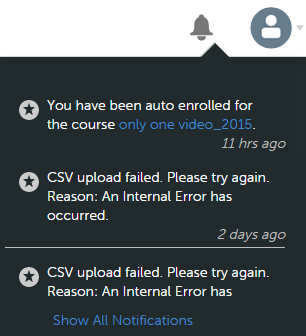

# Meldingen

De meldingsfunctie is van toepassing op alle gebruikers van Adobe Learning Manager. Iedere gebruiker krijgt echter op basis van zijn rol verschillende soorten meldingen onder verschillende scenario&#39;s. Alle waarschuwingen en meldingen voor gebruikers worden weergegeven via het meldingsvenster.

## Toegangsmeldingen {#accessnotifications}

Gebruikers kunnen meldingen zien door rechtsboven in het venster op het meldingspictogram te klikken. Dit pop-upvenster toont de hoogtepunten van alle meldingen samen met het tijdstip waarop deze verschenen en een schuifbalk. Klik op Alle meldingen weergeven onderaan het pop-upvenster om meer informatie over alle meldingen weer te geven. De pagina Meldingen verschijnt.

Het aantal nieuwe meldingen staat in het gemarkeerde getal boven het meldingenpictogram. Als er bijvoorbeeld vijf nieuwe meldingen zijn sinds uw vorige aanmelding, ziet u het getal vijf boven het meldingenpictogram. De cijfers verdwijnen zodra u de meldingen hebt gelezen.

## Soorten meldingen voor beheerders {#typesofnotificationsforadministrators}

Beheerders krijgen meldingen voor de volgende instanties:

* Wanneer een csv-lijst met gebruikers is geüpload.
* Wanneer de upload van een csv-lijst met gebruikers is mislukt. De beheerder krijgt een bericht met de reden voor de fout.
* De beheerder kan ook meldingswaarschuwingen voor instantieniveaus instellen voor cursussen en leerprogramma&#39;s. Hierbij krijgt de beheerder de meldingen met de frequentie die op instantieniveau is geselecteerd.

>[!NOTE]
>
>Als een beheerder naast zijn rol ook auteur- of beheerdersrechten heeft, krijgt de beheerder meldingen met betrekking tot elke rol.

Het onderstaande screenshot toont een voorbeeld van het meldingsvenster voor de beheerdersrol:

*Beheermeldingen weergeven*

Dit pop-upvenster toont de hooglichten van alle meldingen, het tijdstip waarop deze verschenen en een schuifbalk. Het gemarkeerde getal boven het meldingenpictogram geeft het aantal nieuwe meldingen aan. Als er bijvoorbeeld vijf nieuwe meldingen zijn sinds uw vorige aanmelding, ziet u het getal vijf boven het meldingenpictogram. De cijfers verdwijnen zodra u de meldingen hebt gelezen.

Klikken **[!UICONTROL Alle meldingen tonen]** onder aan het meldingsvenster om alle meldingen op een aparte pagina weer te geven. Op de pagina met meldingen ziet u het volgende:

* **Alle meldingen**: Alle meldingen hier weergeven
* **In behandeling**: bekijk hier alle openstaande meldingen
* **Discussie**: Zoek naar cursussen om te zien welke discussies plaatsvinden.

## Escalatiemeldingen voor meerdere niveaus instellen {#setupmultilevelescalationnotifications}

Escalatiemails over gemiste deadlines van studenten kunnen verzonden worden naar de manager en een skip-manager. U kunt escalatiemeldingen op meerdere niveaus instellen voor niet-voltooiing van de cursus tijdens het aanmaakproces of zelfs nadat deze is aangemaakt. U kunt instellen dat escalatiemeldingen met een bepaalde frequentie worden verzonden naar een manager of skip-manager.

1. Meld u aan als beheerder of auteur en klik op Cursussen.
1. Selecteer de cursus waarvoor u de escalatiemeldingen wilt wijzigen en klik op **[!UICONTROL Cursus weergeven]**.

   

   *Selecteer de optie Cursus weergeven*

1. Klik op **[!UICONTROL Instanties]** > **[!UICONTROL Meldingswaarschuwingen]**.

   

   *Selecteer de optie Meldingswaarschuwingen*

1. Er wordt een kalender geopend met de cursusdeadline rood gemarkeerd. Klik op de gemarkeerde datum om de herinneringen te bekijken die voor de student zijn ingesteld.

   

   *Herinneringen voor deadline weergeven*

1. Stel herinneringen in door datums vóór de deadline te selecteren. Hiermee kunt u herinneringen van de naderende deadline instellen voor de student.

   

   *Stel een deadline voor een herinneringsdatum in*

1. Selecteer een datum na de deadline om toekomstige herinneringen voor de student en escalatiemeldingen voor de manager in te stellen.

   

   *Herinneringen en escalatiedatums instellen*

1. Als de student de cursus nog steeds niet voltooit, zelfs na escalatie naar de manager, kunt u met de instellingen naar de skip-manager van de student escaleren. Klik op een datum na de verlengde deadline, selecteer de herhaling van herinneringen, het aantal dagen voor het schema en selecteer **Manager &amp; Niveaubeheer overslaan** in de **Escalatie** vervolgkeuzelijst. Klik op het blauwe vinkje om de meldingsinstellingen op te slaan.

   

   *Meldingsinstellingen opslaan*

## Veelgestelde vragen {#frequentlyaskedquestions}

+++Hoe kunt u herinneringsmeldingen voor de instantie instellen?

Klik op Meldingswaarschuwingen voor een instantie. Er wordt een kalender geopend met de cursusdeadline rood gemarkeerd. Klik op de gemarkeerde datum om de herinneringen te bekijken die voor de student zijn ingesteld. Stel de meldingen in, zoals uitgelegd in dit [onderdeel](user-notifications.md#Setupmultilevelescalationnotifications).
+++
