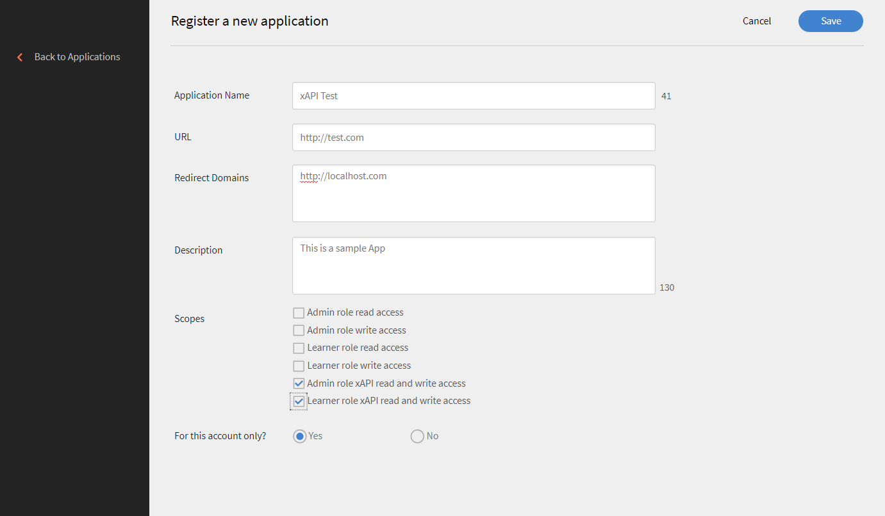

# xAPI in Learning Manager

## Wat is xAPI? {#whatisxapi}

De Experience API (xAPI) is een e-learning softwarespecificatie die systemen voor leerinhoud en leersystemen met elkaar laat communiceren zodat alle leerervaringen worden vastgelegd en bijgehouden. Leerervaringen worden vastgelegd in een LRS (Learning Record Store). LRS&#39;s kunnen zich binnen traditionele Learning Management Systems (LMS&#39;s) bevinden of op zichzelf staan.

Zie voor meer informatie over xAPI [xAPIc-specificaties](https://github.com/adlnet/xAPI-Spec).

## Hoe ondersteunt Learning Manager xAPI? {#howdoeslearningmanagersupportxapi}

Learning Manager heeft een ingebouwde Learning Record Store. Deze LRS heeft de volledige capaciteit om xAPI-statements te accepteren van content die binnen Learning Manager wordt gehost. Het accepteert zelfs xAPI-statements die door derden worden gegenereerd. Deze xAPI-statements worden opgeslagen in Learning Manager en kunnen vervolgens buiten Learning Manager worden geëxporteerd om te worden weergegeven in elk extern datawarehuisvestingssysteem.

## Wanneer gebruikt u xAPI? {#whendoyouusexapi}

Er is steeds meer behoefte aan het vastleggen van leerervaringen van de eindgebruiker die zich uitstrekken over meerdere systemen.  Het is ook nodig om de exacte betrokkenheid van de student bij trainingsinhoud te volgen. Het gaat verder dan Start, In voortgang en Voltooiing (de enige attributen die door SCORM worden vastgelegd).

## xAPI gebruiken in Leerbeheer {#usingxapiinprime}

### Uw toepassing instellen {#setupyourapplication}

1. Meld u aan als integratiebeheerder. Selecteer **[!UICONTROL Toepassingen > Registreren]**.

   

   *Pagina starten om een toepassing te registreren*

1. Registreer een nieuwe toepassing.

   

   *Een nieuwe toepassing registreren*

1. Bepaal het bereik voor de toepassing.

   * Als **[!UICONTROL xAPI lees- en schrijftoegang voor de beheerdersrol]** is ingeschakeld, kan de beheerder xAPI-statements en -documenten plaatsen en ophalen.
   * Als **[!UICONTROL xAPI lees- en schrijftoegang voor de studentrol]** is ingeschakeld, kan de beheerder xAPI-statements en -documenten plaatsen en ophalen.

1. Wijzigingen opslaan. U krijgt uw ontwikkelaars-ID en -geheim.

**Eindpunten**:

Klik op de onderstaande link om het xAPI-document (Swagger) te bekijken:

[xAPI Swagger-document](http://helpx.adobe.com/nl/adobe-connect/topics.html)

>[!NOTE]
>
>xAPI-versie die wordt ondersteund in Learning Manager is 1.0.3.


## API-verificatie {#apiauthentication}

De xAPI van Learning Manager gebruikt het OAuth 2.0-framework om uw clienttoepassingen te verifiëren en autoriseren. Zodra u uw toepassing registreert, kunt u clientId en clientSecret krijgen. De URL ophalen wordt in de browser gebruikt omdat deze de gebruikers van de Leermanager verifieert met behulp van hun vooraf geconfigureerde accounts zoals SSO, Adobe ID.

```
GET https://learningmanager.adobe.com/oauth/o/authorize?client_id=<Enter your clientId>&redirect_uri=<Enter a url to redirect to>&state=<Any String data>&scope=<admin:xapi or learner:xapi>&response_type=CODE.
```

## xAPI-statements bijhouden als LO van Learning Manager {#trackingxapistatementsasprimelo}

Als auteur kunt u nu de xAPI-module kiezen terwijl u cursussen maakt om de gebruikerservaring buiten Learning Manager te volgen. U kunt deze functie bijvoorbeeld gebruiken om de activiteiten te evalueren van gebruikers op een extern platform dat wordt gebruikt om cursussen te volgen.

1. Tijdens het maken van **[!UICONTROL Activiteitenmodule]**, in de **[!UICONTROL Type]**&#x200B;gebruiken, selecteert u in het pop-upmenu  **[!UICONTROL xAPI-module.]**

   

   *Selecteer de optie xAPI-module*

1. U wordt gevraagd een IRI op te geven. Indien niet beschikbaar, genereert Leermanager er automatisch een.

   De IRI voor een activiteit is uniek voor een account. Dat betekent dat twee modules in Learning Manager niet dezelfde IRI kunnen hebben. In de volgende gevallen wordt een nieuwe IRI gegenereerd:

   * Wanneer een cursus met xAPI-module wordt gedeeld tussen accounts.
   * Wanneer een certificering met xAPI-module terugkeert


   Een xAPI-instructie met de vermelde IRI wordt bijgehouden in de bovenstaande module en wordt weergegeven in de rapporten van de Learning Manager.

1. Ga terug naar de pagina Activiteitenmodule om de automatisch gegenereerde IRI opnieuw te bezoeken.
1. Publiceer de module.

**Aandachtspunten:**

* Leerbeheer ondersteunt momenteel alleen mbox als id. Andere ID&#39;s, zoals mboz_sha1, openid, account, worden niet ondersteund.

* De stateId en profileId zijn een UUID wanneer ze worden gebruikt met Learning Manager.
* PUT request does not overwrite the document for xAPIs agents/profile, activity/profile, and activity/state
* Niet-geïdentificeerde groep wordt niet ondersteund in Actor.
* De parameter &quot;related_activities&quot; wordt niet ondersteund in de instructie GET.
* De parameters &#39;format=ids&#39; en &#39;format=canonical&#39; worden niet ondersteund in GET-statements.
* Het verwijderen van de xAPI-instructie maakt geen acties ongedaan die zijn uitgevoerd in Learning Manager toen de instructie werd geplaatst.

## Rapporten genereren {#generatereports}

xAPI-rapporten kunnen worden gegenereerd als Excel-rapporten. Open **[!UICONTROL Rapporten > Excel-rapporten > xAPI-activiteitsrapport]** als beheerder.

Het gedownloade rapport haalt alle informatie op die door de student en beheerder voor een bepaalde instructie is geplaatst.

Dezelfde rapporten kunnen worden gegenereerd/gepland met behulp van FTP- en Box-connectoren voor elke integratie met derden. Volg deze stappen:

Aanmelden als **Integratiebeheerder > FTP/Box-connector openen > xAPI-activiteitsrapport selecteren** in het linkerdeelvenster. Kies of u een rapport wilt plannen/genereren.


*Een rapport plannen of genereren*

* Wanneer alleen de onbewerkte score wordt verzonden in een xAPI-instructie zonder maximale score, wordt de quizscore niet weergegeven in LT.

* Om de percentagescore op te halen in Learning Manager, worden geschaalde scores verzonden via xAPI.

## Voorbeeldrapport {#samplereport}

[Voorbeeld xAPI-rapport.](assets/xapireport8842560559890766717csv.zip)
