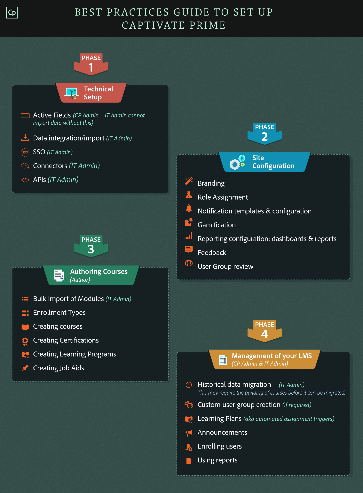

# Gids met beste praktijken voor het instellen van Leermanager

Dit document biedt een aanbevolen aanpak voor organisaties om Adobe Learning Manager in te stellen en te configureren. Het team van Learning Manager stelt een gefaseerde aanpak voor om aan de slag te gaan met de toepassing. Het is niet verplicht om alle fasen in een specifieke volgorde te volgen.

Deze fasen kunnen worden uitgevoerd door drie verschillende rollen, door een of meer personen op basis van uw organisatie-instelling. De drie rollen zijn als volgt:

1. **IT-beheerder** - De IT-beheerder voert activerings- of integratiegerelateerde activiteiten uit die verband houden met de toepassing van Learning Manager in een organisatie. De IT-beheerder kan ook één of meerdere gebruikers toevoegen en een rol van integratiebeheerder vervullen.
1. **Auteur** - De auteur maakt leerinhoud die nodig is voor de leerbehoeften van de organisatie. Auteurs van trainings- of leerinhoud van uw organisatie kunnen beginnen met het maken van de basisinhoud die nodig is voor de toepassing van de Learning Manager.
1. **Beheerder van Learning Manager** - De beheerder van de Leerbeheertoepassing voert configuratie- en instellingsactiviteiten uit. In sommige bedrijven kan de IT-beheerder ook een rol spelen als beheerder van de Learning Manager-toepassing.

U kunt de onderstaande infographic bekijken om een overzicht te krijgen van de fasen en bijbehorende taken.

In dit stadium gaan we ervan uit dat uw organisatie al de licentiecode heeft ontvangen en dat u het account van de Learning Manager hebt geactiveerd. Zoals vermeld in de infographic worden de drie sporen als volgt uitgelegd:

## Fase 1 - Technische installatie (IT-beheerder) {#phase1technicalsetupitadministrator}

In Track 1 kan de IT-beheerder van uw organisatie overschakelen op de rol van integratiebeheerder in de toepassing Learning Manager en enkele activeringen en integraties als volgt uitvoeren:

### Actieve velden inschakelen/toevoegen (Learning Manager Administrator) {#enableaddactivefieldscaptivateprimeadministrator}

Naast de actieve velden die gebruikers tijdens de registratie opgeven, kan de beheerder meer actieve velden toevoegen. De beheerder kan ook de gebruikersvelden in- en uitschakelen. De waarden voor deze actieve velden worden gegenereerd op basis van de metagegevens van verschillende gegevensbronnen die zijn gekoppeld aan gebruikersaccounts. Raadpleeg [Help bij actieve velden](feature-summary/add-users-user-groups.md#active-fields) voor meer informatie.

### Single Sign-On (SSO) {#singlesignonsso}

U kunt de toepassing Learning Manager openen met Adobe ID of door Single Sign-On te gebruiken. Single Sign-On is een mechanisme waarmee een gebruiker zich eenmaal kan verifiëren en meerdere keren toegang krijgt tot meerdere toepassingen. Deze configuratie is niet verplicht voor de organisatie. Als uw organisatie een op SAML 2.0 gebaseerde SSO-provider heeft, kunt u deze gebruiken om de toepassing van Learning Manager te configureren. De configuratie is vereist op organisatieniveau en in de toepassing Learning Manager. Als u ervoor kiest SSO te gebruiken, neemt u contact op met de ondersteuning van de Adobe om configuratie-instructies te ontvangen. Raadpleeg [Help bij Instellingen](feature-summary/settings.md) voor meer informatie.

### Gebruikers in bulk importeren {#bulkimportofusers}

Wanneer u een groot aantal gebruikers in uw organisatie hebt, kunt u alle gebruikers in bulk importeren in de toepassing Learning Manager, met behulp van een CSV-bestand. Voordat u deze taak uitvoert, raden we u aan de lijst met gebruikers uit de HR-toepassing van uw organisatie te exporteren in een CSV-indeling. Zelfs als u de gebruikers in dit stadium niet in bulk importeert, kunt u zich vertrouwd maken met het formaat CSV. Om te beginnen met het importproces in Learning Manager, uploadt u het CSV-bestand en wijst u de toepassingsgegevensvelden toe aan de CSV-kolommen van uw organisatie. Raadpleeg [Help voor bulkimport](add-users-in-bulk.md) voor meer informatie.

### Integratie met FTP-connector {#ftpconnectorintegration}

Als u voortdurend werknemers in uw organisatie moet toevoegen of verwijderen, kunt u ervoor kiezen om de bulkimport van gebruikers te automatiseren met behulp van de FTP-connector. U moet eerst een verbinding tot stand brengen, dan kunt u een CSV uploaden en de kenmerken van CSV toewijzen aan de overeenkomstige velden voor Leermanager. U kunt het proces voor automatisch importeren plannen en het indien nodig ook synchroniseren. Raadpleeg [Help bij FTP-connector](../integration-admin/feature-summary/connectors.md#ftpconnector) voor meer informatie.

### Integratie van Salesforce-connector {#salesforceconnectorintegration}

Als u een Salesforce-account in uw organisatie hebt, kunt u het importeren van alle gebruikers van Salesforce naar de toepassing Learning Manager automatiseren. Als u deze functie wilt gebruiken, kunt u de Salesforce-connector gebruiken om Learning Manager te integreren met het Salesforce-account en de synchronisatie van gegevens te automatiseren. Gebruik de functie voor automatische planning om de automatische gebruikersimport regelmatig uit te voeren. U kunt ook dagelijks synchroniseren. Raadpleeg [Help bij Salesforce-connector](../integration-admin/feature-summary/connectors.md#sfconnector) voor meer informatie.

### Adobe Connect-integratie {#adobeconnectintegration}

Als u Adobe Connect in uw organisatie gebruikt, kunt u het integreren met de toepassing van de Adobe Learning Manager om studenten een naadloze gebruikerservaring te bieden. Dankzij deze integratie hebben uw studenten met één klik toegang tot virtuele lesruimten, rechtstreeks binnen de toepassing Leermanager, zonder zich opnieuw aan te melden bij Adobe Connect. Met deze functie kunnen uw studenten ook de opgenomen virtuele klassikale sessies binnen de LMS-toepassing gebruiken. Integreer eerst de instellingen om te integreren. Gebruik **Instellingen > Adobe Connect > Nu configureren** om Connect URL en aanmeldingsgegevens op te geven en te integreren. Raadpleeg [Help bij Adobe Connect-integratie](feature-summary/adobeconnect-integration.md) voor meer informatie.

### Registratie van Salesforce-app {#salesforceappregistration}

Studenten in uw onderneming kunnen naadloos toegang krijgen tot de Learner-app vanuit hun Salesforce-accounts. Studenten hebben toegang tot de leerinhoud die aan hen is toegewezen, zoals cursussen, leerprogramma&#39;s en taakhulpen vanuit de Salesforce-toepassing. Gebruikers hebben ook toegang tot meldingen en aankondigingen van de Learner-app in Salesforce. Als u deze functionaliteit wilt gebruiken, moet u de Salesforce-app met functionaliteit registreren in de toepassing Leerbeheer. Raadpleeg [Help bij Salesforce-app](../integration-admin/feature-summary/sfdc-app.md) voor meer informatie over de installatie- en gebruiksinstructies.

## Fase 2 - Siteconfiguratie (beheerder van leermanager) {#phase2siteconfigurationcaptivateprimeadministrator}

De beheerder van de toepassing Learning Manager in uw organisatie moet een aantal functies configureren of instellen voordat u deze voor uw studenten implementeert.

### Branding {#branding}

Een organisatie kan het bedrijfslogo in de toepassing Learning Manager willen weergeven, een eigen domein in de URL hebben, de naam van de organisatie weergeven en kleurenschema&#39;s weergeven die overeenkomen met het merk van een organisatie. Met Learning Manager kunnen organisaties al deze functies gebruiken. Als u de instellingen wilt aanpassen en uw eigen branding wilt gebruiken, klikt u op de sectie Branding in het linkerdeelvenster. Klik op Bewerken naast al deze opties en pas deze aan uw wensen aan. Raadpleeg [Help voor Branding en thema&#39;s](feature-summary/themes.md) voor meer informatie.

### Gebruikers/gebruikersgroepen toevoegen {#addusersusergroups}

Aangezien studenten de belangrijkste gebruikers van uw leerinhoud zijn, is het toevoegen van gebruikers in het LMS de eerste stap. Voeg gebruikers toe aan de toepassing Leermanager en wijs rollen toe aan hen. U kunt op de volgende manieren gebruikers toevoegen:

#### Gebruikers toevoegen (intern) {#addusersinternal}

* **Als één gebruiker** - Als u één gebruiker toevoegt aan de toepassing Leermanager, kunt u het uitproberen met een aantal gebruikers voordat u ze in bulk toevoegt. Deze optie is ook handig wanneer u meer individuele gebruikers wilt toevoegen op basis van behoefte, na bulkimport van gebruikers.
* **Zelfregistratie** - Met deze optie kunnen beheerders hun werknemers toestaan zich te registreren bij Leermanager.
* **In bulk importeren** (met behulp van CSV-upload) - Met deze optie kunt u gebruikers in bulk importeren in de toepassing Learning Manager. U moet de gebruikerslijst altijd in CSV-indeling bij de hand houden voordat u deze functie kunt gebruiken.

#### Gebruikers toevoegen (externe profielen) {#addusersexternalprofiles}

* Via externe inschrijving - Met deze optie kunt u externe afdelingsleden of externe medewerkers van uw organisatie inschrijven voor de toepassing.

#### Gebruikersgroepen toevoegen {#addusergroups}

De toepassing Learning Manager genereert standaardgebruikersgroepen op basis van vergelijkbare kenmerken. Naast de standaardgroepen kunt u aangepaste gebruikersgroepen genereren op basis van parameters zoals benoeming en locatie, zodat u deze groepen onder andere kunt gebruiken in Gamification en rapporten. Raadpleeg [Help voor gebruikers toevoegen](feature-summary/add-users-user-groups.md) voor meer informatie.

### Rollen toewijzen {#assignroles}

Nadat de gebruikers aan Leermanager zijn toegevoegd, kan de beheerder beginnen met het toewijzen van auteur-, beheerder- of integratiebeheerdersrollen aan de gebruikers volgens de vereisten van de organisatie. Als u rollen wilt toewijzen aan gebruikers, klikt u in de beheerdersaanmelding op **[!UICONTROL Gebruikers]**  in het linkerdeelvenster selecteert u het selectievakje naast elke gebruikersnaam en klikt u op **[!UICONTROL Handelingen]** de rol die u wilt toewijzen. Managerrollen worden aan gebruikers toegewezen door Adobe Learning Manager op basis van de rollen/privileges die door uw organisatie in het CSV-bestand worden vermeld. U kunt ook de rollen van gebruikers als managers wijzigen met behulp van de workflow Gebruikers bewerken. Raadpleeg [Help voor gebruikers toevoegen](feature-summary/add-users-user-groups.md) voor meer informatie.

### Meldingssjablonen {#notificationtemplates}

Meldingen kunnen nuttig zijn voor gebruikers in een LMS om hun status te kennen of om te worden geïnformeerd over de gebeurtenissen/activiteiten. Tijdens het maken van cursussen, het configureren van de functies of het volgen van cursussen doorlopen gebruikers verschillende gebeurtenissen die meldingen voor studenten, hun managers, beheerders of auteurs activeren. Learning Manager biedt verschillende e-mailmeldingssjablonen in de toepassing. Als beheerder kunt u ze aanpassen aan de vereisten van uw organisatie. Kies **E-mailsjablonen** in het linkerdeelvenster en klik op de sjabloonnaam. Raadpleeg [Help bij e-mailsjablonen](feature-summary/email-templates.md) voor meer informatie

**E-mailmeldingen uitschakelen (aanbevolen)**

Standaard zijn de meldingen ingeschakeld in de toepassing Leerbeheer. U kunt meldingen in dit stadium uitschakelen als u uw werknemers niet op de hoogte wilt stellen van de organisatie.

### Badges {#badges}

Badges zijn een maatstaf voor prestaties die uw werknemer kan verdienen wanneer hij een cursus voltooit. Professionals over de hele wereld gebruiken deze badges als een weergave van specifieke vaardigheden of een leerprestatie. U kunt een verzameling badges maken, zodat u deze aan studenten kunt toewijzen wanneer de leerinhoud is voltooid. Als u badges wilt maken, klikt u op **[!UICONTROL Badges]** in het linkerdeelvenster. Raadpleeg  [Help voor Badges](feature-summary/badges.md) voor meer informatie.

### Feedback {#feedback}

Feedback is een van de belangrijke factoren in een LMS om de leervoortgang van studenten te meten en de kwaliteit van leerinhoud te waarborgen. Leerbeheer biedt twee soorten feedbackopties voor gebruikers.

* L1-feedback is de feedback die studenten na het afronden van de cursus geven.
* L3-feedback is de feedback die managers aan studenten geven op basis van de impact van de cursus op het gedrag en de dagelijkse activiteiten van de studenten.

Het is optioneel voor organisaties om deze functie te gebruiken. Beheerders kunnen de feedbacksjablonen aanpassen aan de vereisten van uw organisatie. Om deze functie te kunnen gebruiken, moet de beheerder L1- en L3-feedbackopties op cursusinstantieniveau inschakelen. Als u de feedback wilt configureren, kiest u een willekeurige cursus, klikt u op Instantie-standaardinstellingen in het linkerdeelvenster en schakelt u de feedbackoptie in. Raadpleeg [Help voor feedback](feature-summary/courses.md) voor meer informatie.

### Gamification {#gamification}

Het is een van de uitdagingen voor organisaties om studenten betrokken te houden terwijl ze de inhoud consumeren. Gamification verhoogt het percentage studenten dat de cursus afrondt door hen te motiveren om hun doelen te bereiken met behulp van gamingtechnieken. Studenten kunnen met hun collega&#39;s wedijveren om punten te scoren voor verschillende leeractiviteiten en bronzen, zilveren, gouden en platina niveaus te behalen. Beheerders kunnen elke Gamificationtaak in- en uitschakelen en de toewijzing van punten aan taken wijzigen. Learning Manager biedt de gamificationfunctie met enkele standaardinstellingen. U kunt de functie al enige tijd gebruiken met standaardinstellingen en vervolgens desgewenst aanpassen. Het is optioneel voor u om de instellingen voor deze functie te configureren/wijzigen. Als u een deskundige op het gebied van uw organisatie hebt, raden wij u aan de instellingen te configureren voordat u deze gebruikt. Raadpleeg [Help bij Gamification](feature-summary/gamification.md) voor meer informatie.

### Leerobjecten maken {#createlearningobjects}

Dit is het logische stadium waarin alle drie sporen (spoor1, spoor 2, en spoor 3) samenkomen voor u om volgende koers te gaan.

Nadat u modules en cursussen hebt gemaakt, kunt u beginnen met het maken van leerobjecten op een hoger niveau, zoals certificeringen, leerprogramma&#39;s of taakhulpen, om verder te gaan. Voordat u begint met het maken van leerobjecten moet u ervoor zorgen dat u al enkele gebruikers in de toepassing Leerbeheer hebt toegevoegd, enkele modules en cursussen hebt gemaakt.

#### Certificeringen maken {#createcertifications}

Certificering is een bewijs van voltooiing van een leerinhoud of een bewijs van prestaties voor studenten op een eenmalig of op een terugkerend tijdstip. De inschrijving van studenten voor leerinhoud kan worden vergroot door studenten na voltooiing van de cursus te certificeren. Als beheerder kunt u een certificeringsprogramma maken dat intern wordt gehost of door een derde partij wordt uitgevoerd. Definieer in de interne certificering de cursussen die een student moet voltooien om te worden gecertificeerd. Zorg ervoor dat er enkele cursussen beschikbaar zijn in het account voordat u een certificering maakt. Raadpleeg  [Help voor certificering](feature-summary/certifications.md) voor meer informatie over het maken van certificeringen.

#### Taakhulpen maken {#createjobaids}

Taakhulpen is een opslagplaats van trainingsinhoud die zonder enige inschrijvings- of voltooiingscriteria toegankelijk is voor studenten. Studenten kunnen naar deze taakhulpen verwijzen terwijl ze op de werkplek zijn om hulp te krijgen bij het uitvoeren van activiteiten of taken in een organisatie. Hoewel het niet verplicht is om taakhulpen te gebruiken als onderdeel van het maken van een cursus, raadt het team van Leermanager aan om taakhulpen te maken als beste werkmethode voor uw organisatie. Raadpleeg de  [Help bij taakhulpen](../authors/feature-summary/job-aids.md) voor informatie over het maken van taakhulpen.

#### Leerprogramma&#39;s maken {#createlearningprograms}

Leerprogramma&#39;s zijn een reeks uniek ontworpen cursussen die voldoen aan specifieke leerdoelen. Voordat u leerprogramma&#39;s maakt, moet u ervoor zorgen dat u al enkele cursussen hebt gemaakt of dat er bestaande cursussen beschikbaar zijn in uw account.  Hoewel het voor een organisatie optioneel is om deze functie te gebruiken, raadt het Learning Manager-team u aan deze functie te gebruiken om gericht leren voor uw werknemers op te nemen. Klik op Leerprogramma&#39;s in het linkerdeelvenster om de leerprogramma&#39;s te gebruiken, kies een set cursussen in de catalogus en publiceer deze. Raadpleeg de [Help bij leerprogramma&#39;s](feature-summary/learning-programs.md) voor specifieke instructies.

### Catalogi maken {#createcatalogs}

U kunt catalogi in een organisatie gebruiken om een doelgerichte inhoud te maken of om inhoud te classificeren voor een gedefinieerde set studenten. In Learning Manager is een catalogus een verzameling leerobjecten zoals cursussen, certificeringen of leerprogramma&#39;s. U kunt de leerobjecten van uw keuze kiezen tijdens het maken van catalogi. Zorg ervoor dat u al een reeks cursussen, certificeringen of leerprogramma&#39;s hebt gemaakt voordat u de catalogi maakt. U kunt aangepaste catalogi maken met een set leerobjecten als u deze wilt toewijzen aan interne of externe gebruikersgroepen. Raadpleeg de  [Help Catalogi](feature-summary/catalogs.md) voor meer informatie over catalogi.

### E-mailmeldingen/gebruikerstoegang inschakelen {#turnonemailnotificationsuseraccess}

In dit stadium kunt u e-mailmeldingen voor de gebruikers van uw toepassingen inschakelen en ook gebruikerstoegang inschakelen.

## Fase 3 - Cursussen ontwerpen (auteur) {#phase3authoringcoursesauthor}

Inhoudsontwikkelaars of -auteurs in uw organisatie kunnen beginnen met het maken van de leerinhoud. Het is verplicht om modules en cursussen te maken omdat deze de basis vormen voor al uw leerinhoud in de toepassing Leermanager.

### Modules maken {#createmodules}

Modules vormen de basisbouwstenen van de toepassing Learning Manager. Begin modules als auteur te maken om uw leerinhoud te ordenen. Met Learning Manager kunt u een van de vier typen cursusmodules kiezen, zoals klassikale modules, modules op eigen tempo, Activiteiten en virtuele klassikale modules. Raadpleeg  [Help voor modules](../authors/how-to-choose-modules.md) om te weten te komen welk type cursusmodule het meest geschikt is voor de behoeften van uw organisatie.

### Cursussen maken {#createcourses}

Beheerders kunnen een auteursrol op zich nemen in de toepassing Learning Manager en cursussen maken. In de toepassing Leermanager is een cursus een basiseenheid met een set modules, die aan de student kan worden toegewezen. Studenten volgen cursussen. U kunt beginnen met het maken van cursussen door de modules te kiezen die u eerder hebt gemaakt, vaardigheden te koppelen die u studenten van de cursus wilt laten behalen, niveaus, punten en badges aan een cursus te koppelen, taakhulpen, vereisten en bronnen te selecteren op basis van uw keuze en de cursus te publiceren. U kunt ook meerdere instanties van een cursus maken, zodat u de cursusinstanties kunt toewijzen aan meerdere studenten in verschillende tijdzones, plannen enzovoort. Raadpleeg de  [Help Cursussen](../authors/feature-summary/courses.md)voor meer informatie over het maken van een cursus.

### Leerobjecten maken {#Createlearningobjects-1}

Dit is het logische stadium waarin alle drie sporen (spoor1, spoor 2, en spoor 3) samenkomen voor u om volgende koers te gaan.

Nadat u modules en cursussen hebt gemaakt, kunt u beginnen met het maken van leerobjecten op een hoger niveau, zoals certificeringen, leerprogramma&#39;s of taakhulpen, om verder te gaan. Voordat u begint met het maken van leerobjecten, moet u ervoor zorgen dat u al enkele gebruikers in de toepassing Leerbeheer hebt toegevoegd, enkele modules en cursussen hebt gemaakt.

#### Certificeringen maken {#Createcertifications-1}

Certificering is een bewijs van voltooiing van een leerinhoud of een bewijs van prestaties voor studenten op een eenmalig of op een terugkerend tijdstip. De inschrijving van studenten voor leerinhoud kan worden vergroot door studenten na voltooiing van de cursus te certificeren. Als beheerder kunt u een certificeringsprogramma maken dat intern wordt gehost of door een derde partij wordt uitgevoerd. Definieer in de interne certificering de cursussen die een student moet voltooien om te worden gecertificeerd. Zorg ervoor dat er enkele cursussen beschikbaar zijn in het account voordat u een certificering maakt. Raadpleeg  [Help voor certificering](feature-summary/certifications.md) voor meer informatie over het maken van certificeringen.

#### Taakhulpen maken {#CreateJobaids-1}

Taakhulpen is een opslagplaats van trainingsinhoud die zonder enige inschrijvings- of voltooiingscriteria toegankelijk is voor studenten. Studenten kunnen naar deze taakhulpen verwijzen terwijl ze op de werkplek zijn om hulp te krijgen bij het uitvoeren van activiteiten of taken in een organisatie. Hoewel het niet verplicht is om taakhulpen te gebruiken als onderdeel van het maken van een cursus, raadt het team van Leermanager aan om taakhulpen te maken als beste werkmethode voor uw organisatie. Raadpleeg de  [Help bij taakhulpen](../authors/feature-summary/job-aids.md) voor informatie over het maken van taakhulpen.

#### Leerprogramma&#39;s maken {#Createlearningprograms-1}

Leerprogramma&#39;s zijn een reeks uniek ontworpen cursussen die voldoen aan specifieke leerdoelen. Voordat u leerprogramma&#39;s maakt, moet u ervoor zorgen dat u al enkele cursussen hebt gemaakt of dat er bestaande cursussen beschikbaar zijn in uw account.  Hoewel het voor een organisatie optioneel is om deze functie te gebruiken, raadt het Learning Manager-team u aan deze functie te gebruiken om gericht leren voor uw werknemers op te nemen. Klik op Leerprogramma&#39;s in het linkerdeelvenster om de leerprogramma&#39;s te gebruiken, kies een set cursussen in de catalogus en publiceer deze. Raadpleeg de [Help bij leerprogramma&#39;s](feature-summary/learning-programs.md) voor specifieke instructies.

## Fase 4 - Beheer van uw LMS (Learning Manager Administrator) {#phase4managingyourlmscaptivateprimeadministrator}

### Aankondigingen {#announcements}

Aankondigingen zijn handig voor de organisatie om alle belangrijke informatie tegelijk aan alle studenten van een account te verspreiden. In de toepassing Learning Manager is een aankondiging een multimediabericht (tekst, afbeelding of video) dat een beheerder kan maken en uitzenden naar een gedefinieerde set gebruikersgroepen en leerobjecten. U kunt direct aankondigingen verzenden of deze automatisch op een bepaalde datum laten activeren. Als u deze functie wilt gebruiken in de toepassing Learning Manager, kiest u Aankondigingen in het linkerdeelvenster en klikt u op Toevoegen om aankondigingen te maken. Raadpleeg [Help voor aankondigingen](feature-summary/announcements.md) voor meer informatie.

### Gebruikersinschrijving {#userenrollment}

Gebruikersinschrijving is een belangrijke stap voor een LMS-toepassing. In dit stadium kunt u beginnen met het inschrijven van de studenten voor verschillende leerobjecten van de toepassing Learning Manager. U kunt studenten handmatig of automatisch inschrijven met behulp van leerplannen.

#### Handmatige inschrijving {#manualenrollment}

* **Zelfinschrijving -** Als u deze optie inschakelt tijdens het maken van een leerobject, kunnen studenten zichzelf inschrijven voor de leerobjecten.
* **Goedkeuring van manager** - Als u deze optie kiest bij het inschrijvingstype terwijl u een cursus maakt, moeten managers de inschrijving van de studenten goedkeuren.
* **Benoeming manager** - Als u dit inschrijvingstype kiest tijdens het maken van een cursus, moeten dergelijke cursussen worden aangewezen door managers.
* **Beheerderinschrijving** - In dit geval kan de beheerder een aantal studenten inschrijven op basis van de vereisten van de organisatie.

Raadpleeg [Help voor gebruikersinschrijving](feature-summary/courses.md)voor meer informatie.

Schrijf studenten op de volgende vier manieren handmatig in voor leerobjecten:

### Geautomatiseerde inschrijving {#automatedenrollment}

Automatiseer de inschrijving van de studenten voor leerobjecten met behulp van leerplannen.

#### Leerplannen (op basis van triggers) {#learningplansbasedontriggers}

U kunt leerplannen gebruiken om automatisch cursussen, leerprogramma&#39;s of certificeringen aan studenten toe te wijzen op basis van het optreden van bepaalde gebeurtenissen. Bijvoorbeeld:

* Nieuwe gebruiker wordt toegevoegd
* Gebruiker wijzigt gebruikersgroep
* Student voltooit een leerobject
* Gebruiker voltooit een vaardigheid

Raadpleeg [Help bij leerplannen](feature-summary/learning-plans.md)  voor meer informatie.

### Rapporten maken {#createreports}

In dit stadium kunt u beginnen met het maken en beheren van verschillende typen rapporten.

Met Adobe Learning Manager kunt u verschillende rapporten maken om de activiteiten van studenten te volgen, te controleren en te beheren. U kunt de volgende drie typen rapportagefuncties gebruiken om rapporten te genereren:

* **Dashboard Rapporten** - Maak samenvattingsrapporten om actiegerichte inzichten te krijgen in het gebruik van leerinhoud door uw studenten, op basis van verschillende categorieën zoals gebruikersgroepen, effectiviteit, cursustijd voor studenten enzovoort.
* **Studenttranscripten** - Maak centrale rapporten voor studenten met een volledige geschiedenis van studenten van de registratiedag tot aan de datum.
* **Cursusrapporten** - Statistieken over het cursusverbruik van studenten op basis van individuele cursussen maken. U kunt ook quizrapporten op cursusniveau maken.

Raadpleeg  [Help bij rapporten](feature-summary/reports.md) voor meer informatie over het genereren van rapporten.

Voor andere informatie over het gebruik van de functies van de LMS-toepassing raadpleegt u [Help bij Learning Manager](../topics.md) op basis van elke rol.
