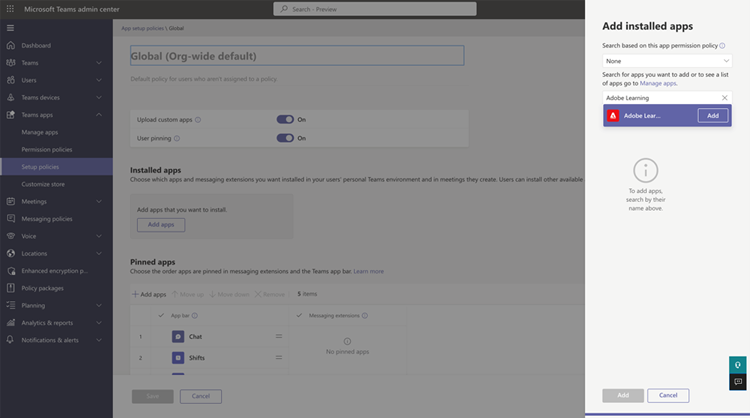

# Adobe Learning Manager-app voor Microsoft Teams

## Instellen

Voor het configureren van ALM voor MS Teams moet u drie stappen doorlopen en hebt u hulp nodig van de ALM-beheerder en Microsoft Azure-beheerder. In sommige organisaties zijn de Azure-beheerder en MS Teams-beheerder niet een en dezelfde persoon, daarom zijn er ook extra MS Teams-beheerders nodig.

**ALM-beheerder - De rol van integratiebeheerder keurt de app Teams goed**

Nadat de integratiebeheerder de MS Teams-app heeft goedgekeurd, is de Adobe Learning Manager-app beschikbaar in de MS Teams App Store en kunnen uw studenten deze openen. De app heeft echter geen meldingen, geen stille aanmelding en kan niet worden vastgemaakt voor de studenten in MS Teams.

**Microsoft Azure Admin keurt de machtiging voor de ALM-app in Azure dashboard goed**

De Azure-beheerder moet de vereiste machtigingen voor de ALM-app goedkeuren. Dan kan de ALM-app meldingen sturen naar MS Teams en stille aanmelding toestaan. Bij stille aanmelding hoeven gebruikers niet apart via de browser in te loggen bij Adobe Learning Manager.

**MS Teams Admin zorgt voor een beleid voor ALM-teams**

De MS Teams-beheerder moet de ALM-app in het beheerderscentrum voor alle gebruikers vastmaken en toestaan als een algemeen beleid. Indien ALM alleen door een bepaalde groep in het bedrijf wordt gebruikt, moet de MS Teams-beheerder een aangepast beleid opstellen en dit alleen op die specifieke groep toepassen.

## Integratiebeheerder goedkeurt Teams-app

Volg onderstaande stappen:

1. Selecteer in de integratiebeheerdersapp de optie **[!UICONTROL Toepassingen]** > **[!UICONTROL Aanbevolen apps]** en selecteert u **[!UICONTROL app ALM Teams]**.

   
   *De app ALM Teams selecteren*

1. Selecteer in de rechterbovenhoek van het scherm **[!UICONTROL Goedkeuren]**.

   
   *Selecteer Goedkeuren op de pagina met app-instellingen*

1. Selecteren **[!UICONTROL OK]** in het dialoogvenster dat wordt weergegeven.

   
   *Selecteer OK na goedkeuring*

1. Na goedkeuring kunt u de &#39;ALM-teamapp&#39; zien in de sectie Externe apps.

   
   *De app ALM Teams verschijnt op de pagina Apps*

Gebruikers hebben nu toegang tot de ALM-app op MS Teams.

## Microsoft Azure-beheerder keurt de machtiging voor de ALM-app goed in het Azure-dashboard

Volg onderstaande stappen:

1. Als Azure Admin navigeert u naar de sectie Azure Active Directory beheren in het Azure-dashboard.

   
   *Azure-dashboard starten*

1. Plak de volgende koppeling in een apart browservenster:

   `https://login.microsoftonline.com/<tenantIdTobeReplaced>/oauth2/authorize?client_id=8d349d9f-bf59-4ece-8022-a41e87d81903&response_type=code&redirect_uri=https://learningmanager.adobe.com`

1. In de bovenstaande koppeling vervangt u `<tenantIdTobeReplaced>` met de tenant-id beschikbaar op de onderstaande pagina Overzicht. Voer de nieuwe URL in.

1. Voeg de app Adobe Learning Manager toe aan uw Azure-toepassingen.

   
   *Toevoegen aan Azure*

1. Selecteer het tabblad Enterprise-applicaties en selecteer Alle applicaties. U ziet hier een lijst met ALMTeamsApp.

   
   *De ALM-app weergeven*

1. Klik op de app en ga naar het tabblad Machtigingen.

   
   *Het tabblad Machtigingen weergeven*

1. Selecteer op het tabblad Machtigingen de optie &#39; **[!UICONTROL Goedkeuring van MSFT-beheerder verlenen]**&#39; om de app-machtigingen voor ALM-teams te geven.

   
   *Machtigingen selecteren*

1. Selecteren **[!UICONTROL Accepteren]**.

   
   *Accepteren selecteren*

1. Als deze machtigingen eenmaal zijn verleend, kan de ALM-app stille aanmeldingen toestaan en meldingen verzenden naar de studenten in de MS Teams-app.

   
   *Toegang verleend*

## MS Teams-beheerder stelt een beleid op voor de Teams-app

Volg onderstaande stappen:

1. Als MS Teams-beheerder maakt u in het Admin Center een beleid om de app Teams toe te voegen aan de app Teams voor uw studenten.

   
   *Een beleid maken*

1. Navigeer naar het gedeelte Beleid opstellen. Maak een globaal beleid en selecteer **[!UICONTROL Apps toevoegen]** in subsectie Vastgezette apps.

   
   *Het beleid toevoegen*

1. Zoek in het daaropvolgende dialoogvenster naar **[!UICONTROL Adobe Learning Manager]** en voeg de app toe. Hiermee voegt u Adobe Learning Manager toe in de sectie Geïnstalleerde apps.

   
   *De app installeren*

1. Sla dit beleid op. Hierdoor is de app beschikbaar voor iedereen in de organisatie.

Beheerders kunnen in plaats van een algemeen beleid ook een aangepast beleid opstellen. Voeg Adobe Learning Manager toe aan dat aangepaste beleid en pas vervolgens het aangepaste beleid toe op alleen gebruikers die toegang moeten krijgen tot de Adobe Learning Manager.
