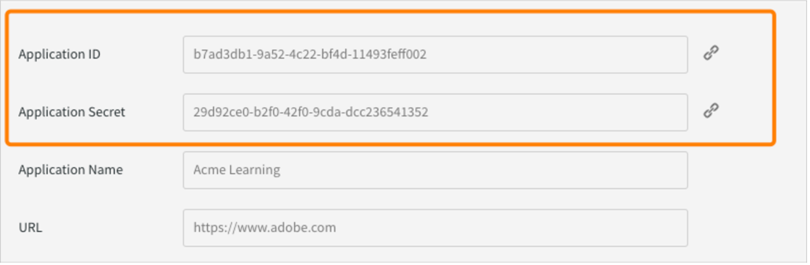

# Pakket voor AEM-sites van Adobe Learning Manager-referentiesite (ALM-referentiesite)

Adobe Learning Manager (ALM) integreert met Adobe Experience Manager (AEM)-sites. Hiermee kunt u uw eigen website en responsieve mobiele interfaces voor Adobe Learning Manager maken met minimale coderingsinspanning. Met deze integratie kunt u aangepaste leerervaringen voor uw gebruikers creëren.

Om zo&#39;n ervaring op te bouwen, biedt ALM een Adobe Learning Manager referentiesite-pakket (ALM reference site package) voor AEM-sites in de vorm van een ZIP-bestand dat u op uw AEM-sites instance kunt installeren.

Het pakket bevat AEM-sites webpaginasjablonen en websitecomponenten, samen met embeddable widgets, bijvoorbeeld leercatalogus, embeddable widgets, kalender, enzovoort.

Nadat u het ALM referentiesite-pakket geïnstalleerd hebt, kunt u beginnen met het bouwen van een website voor Adobe Learning Manager die u kunt hosten op uw AEM-sites instantie. Dan kunnen uw gebruikers componenten op de website slepen en neerzetten.

>[!IMPORTANT]
>
>Adobe Learning Manager-pakketten (ALM) voor AEM Sites bieden een snel startcodeblok voor implementatie. Dit pakket is ontworpen voor headless implementaties. Als u de verschafte codebasis eenmaal hebt gebruikt, is het uw verantwoordelijkheid om deze verder te onderhouden en te ontwikkelen, zoals gebruikelijk is bij headless-toepassingen die zijn gebaseerd op Adobe Learning Manager. De onderliggende API wordt ondersteund door Adobe Learning Manager.

## ALM-referentie-sitepakket installeren

### vereisten van het proces leren kennen

* Licenties voor AEM-sites en Adobe Commerce.
* AEM on-premise 6.5 of Adobe Experience Manager - Cloud Service
* Adobe Commerce 2.4.3

Nadat u uw omgeving van AEM-sites hebt beveiligd, moet u het ALM-referentiesitepakket installeren. Dit pakket bevat AEM-webpagina&#39;s en website-onderdelen waarmee het leerplatform kan worden opgebouwd.

Het pakket van de verwijzingsplaats wordt ontvangen op de [**bewaarplaats GitHub** ](https://github.com/adobe/adobe-learning-manager-reference-site/releases/tag/1.0.0).

Zie de README voor meer informatie.

## Een toepassing maken in [!DNL Adobe Learning Manager]

Nadat u het AEM-sitepakket geïnstalleerd hebt, moet u een ALM-toepassing configureren om uw leerportaal met de AEM-site te verbinden.

Dit scenario is van toepassing wanneer AEM wordt gebruikt met [!DNL Adobe Learning Manager] .

Volg onderstaande stappen:

1. Klik als integratiebeheerder op **[!UICONTROL Applicaties]**.
1. Klik om een nieuwe applicatie te maken in de rechterbovenhoek op **[!UICONTROL Registreren]**.
1. Voer in het venster Registreer een nieuwe applicatie de volgende gegevens in:

   1. Applicatienaam: de naam van de applicatie die u maakt.
   1. URL: de URL van uw organisatie.
   1. Redirect-domeinen: de hostingdomeinen van de AEM-website. U kunt ook wildcards opgeven.
   1. Beschrijving: de beschrijving van de applicatie.
   1. Scopes: selecteer Student-rol leestoegang en Student-rol schrijftoegang.
   1. Alleen voor dit account? Kies Ja als u de toepassing voor het bestaande ALM-account wilt gebruiken.

1. Klik op Opslaan nadat u wijzigingen hebt aangebracht.

Noteer de toepassingsgegevens van het scherm.

*geloofsbrieven van de Toepassing*

Klik op **[!UICONTROL Akkoord]** om de toepassing goed te keuren.

## Tokens krijgen

1. In het lusje van de Middelen van de Ontwikkelaar, klik **[!UICONTROL Tokens van de Toegang voor het Testen en Ontwikkeling]**.

   

   *Uitgezochte Tokens van de Toegang voor het Testen en Ontwikkeling*

1. Voer de volgende gegevens in:

   
   *ga de tokendetails in*

   1. Get OAuth Code: voer de client ID uit het vorige gedeelte in en verander de scope. Klik op Verzenden om de OA-code op te halen.
   1. Get Refresh Token: voer bij Vernieuwingstoken ophalen de client-ID en het cliëntgeheim in. Voer ook de OAuth-code in die u in de vorige stap hebt verkregen. Klik op Verzenden.
   1. Get Refresh Token: voer de client ID en het geheim in uit de vorige sectie. Voer ook de Verversingstoken in die u in de vorige stap hebt verkregen. Klik op Verzenden.
   1. Get Access Token Details: de aanmeldingstoken in die u in de vorige stap hebt verkregen. Klik op Verzenden.

1. U kunt de details halen uit het JSON-antwoord dat volgt. Het antwoord bestaat uit de toegangstoken, de verversingstoken, de gebruikersrol, de rekening-id, de gebruikers-id en de tijd tot de vervaldatum. Let op het vernieuwingstoken, zoals u dat opnieuw gaat gebruiken.

## ALM-account configureren in AEM

1. Lanceer uw AEM-instantie.
1. Klik op Instellingen > Cloud Servicen.
1. Klik op Adobe Learning Manager-configuratie.

   
   *Uitgezochte configuratie van Adobe Learning Manager*

1. Klik op Maken > Configuratiemap. Geef de map een naam.

   
   *creeer configuratie*

1. Selecteer in het leerproject de configuratie die u hebt gemaakt.

1. Voer de details van de configuratie in.

   
   *creeer configuratiemap*

   1. Adobe Learning Manager-modus: kies hoe u de leerervaring wilt voor zowel aangemelde als niet-aangemelde studenten.
   1. Adobe Learning Manager URL: voer de URL in van de ALM-instantie waar de leerservices worden gehost.
   1. Account-id: De id van het ALM-account.
   1. Client-id, clientgeheim en het vernieuwingstoken van auteur: voer de referenties in die u hebt gekregen tijdens het maken van de toepassing in ALM.
   1. Aanpassing van Widget: Voor meer informatie, zie [ integreren met AEM ](/help/migrated/integrate-aem-learning-manager.md) `.`

1. Sla de configuratie op en sluit deze af.

### AEM + Adobe Learning Manager (ingelogde/niet-ingelogde gebruikers)

Met Adobe Learning Manager kunt u nu uw product en training aan uw bestaande en potentiële klanten en partners laten zien, zonder dat u een account hoeft aan te maken of in te loggen. Deze functionaliteit zal u helpen om het gebruik van producten en trainingen te bevorderen door de cursisten een snel en gemakkelijk voorproefje van de training te geven, waardoor de producteigenschappen beter uitkomen en gepromoot worden. Zo kunt u uw producten en aanbiedingen doeltreffend onder de aandacht brengen, vooral bij potentiële klanten en partners, wat leidt tot een grotere bekendheid van uw producten. De gemakkelijke toegang en de betere bereikbaarheid zorgen voor een grotere belangstelling, wat de inschrijvingen voor opleidingen en de aanvaarding van het leren stimuleert.

Met deze workflow kan een student een voorbeeld van een training bekijken, toegang tot informatie over een training krijgen of een training zoeken zonder zich bij Adobe Learning Manager aan te melden. Deze workflow is niet van toepassing op de native Learning Manager-interface (ALLEEN van toepassing op AEM-sites en andere headless interfaces).

**vorm en laat de het leren platformschakelaar** toe

In dit gedeelte worden de stappen beschreven die nodig zijn om de volgende connector te configureren en in te schakelen:

**Toegang van de Gegevens van de Opleiding**

Met deze connector kan uw AEM Sites-gebaseerde of andere op maat gemaakte headless gebruikersinterface opleidingsinformatie ophalen en weergeven aan de student en naadloos opzoeken van opleidingsinformatie realiseren, voor- of nadat een student inlogt.

Deze connector is alleen nodig als u AEM Sites-based of andere headless interfaces gebruikt.

De connector exporteert metadata over de opleiding naar een oplossing voor gegevensopslag en -opzoeking, en naar een systeem voor zoekfuncties. Daarom kunt u uw AEM Sites-gebaseerde of andere op maat gemaakte headless gebruikersinterface configureren om deze twee diensten te gebruiken om trainingsgegevens op te halen, webpagina&#39;s te renderen en geoptimaliseerde trainingszoekfunctionaliteit aan de studenten te bieden. Een niet-ingelogde interface op basis van AEM Sites kan bijvoorbeeld de geëxporteerde metadata gebruiken om een student te helpen zoeken, browsen en toegang te krijgen tot opleidingspagina&#39;s met opleidingsinformatie.

Schakel deze connector in om uw op AEM Sites gebaseerde webpagina&#39;s te bouwen en te renderen, en uw leerlingen aangepaste ervaringen te bezorgen, zowel voor als na het inloggen. Schakel deze connector in om uw op AEM Sites gebaseerde webpagina&#39;s te bouwen en te renderen, en uw leerlingen aangepaste ervaringen te bezorgen, zowel voor als na het inloggen.

* Adobe Learning Manager cdn base-URL - Voer de basis-URL in van het CDN-servicepad voor het ophalen van gegevens op de pagina Toegang tot trainingsgegevens.
* Beheerder vernieuwingstoken - Voer het vernieuwingstoken in dat u in de vorige sectie hebt bepaald.
* De basis-URL van de trainingsmetagegevens - Voer de basis-URL in van het pad van de zoekfunctie en de zoekfunctie voor gegevens-ophaalservice van de pagina Toegang tot trainingsgegevens.
* Adobe Learning Manager Register URL - Voer de zelfregistratie-URL in die door de integratiebeheerder voor het account gegenereerd is, en die door de studenten wordt gebruikt om zich in te schrijven voor de training.

### AEM + Adobe Learning Manager + Adobe Commerce (ingelogde/niet-ingelogde gebruikers)

Adobe Learning Manager biedt nu oplossingen om u te helpen het leerplatform naadloos te integreren met Adobe Commerce. Met deze release kunt u uw native, op AEM sites gebaseerde of andere headless Learning Manager-interfaces gemakkelijk verbinden met Adobe Commerce. Dankzij deze integratie kunt u e-commerce-mogelijkheden binnen uw leerplatform realiseren. U kunt nu betaalde opleidingen aanbieden aan uw klanten en zakenpartners, en aankopen van opleidingen gemakkelijk mogelijk maken op zowel native als non-native Learning Manager-interfaces. Een student kan ook een voorbeeld van een training bekijken, toegang tot informatie over een training krijgen of een training zoeken zonder zich bij Adobe Learning Manager aan te melden.

In plaats van een toepassing te maken, kan een gebruiker de reeds AEM toepassing gebruiken en deze goedkeuren.

* Adobe Learning Manager cdn base-URL - Voer de basis-URL in van het CDN-servicepad voor gegevensophaling vanaf de Adobe Commerce-verbindingspagina.
* Adobe Commerce URL - Voer de URL in van de Adobe Commerce-instantie die u gebruikt.
* GraphQL-proxypad: de client-side Learning Manager-componenten hebben rechtstreeks toegang tot het Adobe Commerce GraphQL-eindpunt en daarom kan CORS-fout optreden. Om deze fout te vermijden, moeten alle vraag of van het zelfde eindpunt zoals AEM worden gediend of via een volmacht worden gediend die kopballen CORS toevoegt.
* Adobe Commerce Store name - Voer de Adobe Commerce store name in die u in de vorige sectie hebt bepaald.
* De symbolische levensduur van de Adobe Commerce-klant (in sec) - Voer de token-levensduur van de klant in om de vooraf bepaalde periode voor een aanmeldingssessie aan te geven.
* Beheerder vernieuwingstoken - Voer het vernieuwingstoken in dat u in de vorige sectie hebt bepaald.

## Webpagina&#39;s aanpassen

Pas uw webpagina&#39;s aan met behulp van de site met AEM referenties en de beschikbare widgets.

1. Lanceer uw AEM-instantie.
1. Klik op Sites en open de configuratiepagina.
1. Klik **[!UICONTROL Lerende Plaats]** > **[!UICONTROL Stramienen van de Taal]** > **[!UICONTROL Engels]**. Alle webpagina&#39;s in het project worden opgenomen in de map.

   
   *Mening alle webpages*

1. Selecteer om het even welk malplaatje en klik **[!UICONTROL uitgeven]**.

1. Klik op de pagina op de knop componentinstellingen en verander de eigenschappen van de component.

   
   *Uitgezochte knoop van Montages*

1. Geef een voorvertoning van uw wijzigingen weer of u kunt de pagina publiceren.

## Webpagina&#39;s maken

Afgezien van de sjablonen die u kunt gebruiken en die geleverd worden door het referentiesite-pakket, kunt u ook webpagina&#39;s maken op basis van de sjablonen ibn AEM.

1. Klik op de AEM hoofdpagina op Maken > Pagina.

1. Kies het sjabloon dat u wilt aanpassen. Klik op Volgende.

1. Voer de pagina-eigenschappen in.

   
   *eigenschappen van de Pagina*

1. Om de pagina tot stand te brengen, creeer **&#x200B;**.

1. Selecteer de nieuwe pagina en klik **[!UICONTROL uitgeven]**.

1. Neem een component op de pagina op, bijvoorbeeld, **Leren - Inhoud**.

   
   *Filter door plaats*

1. Kies de vereiste catalogusfilters die op de pagina worden weergegeven.

## Site maken vanuit Blueprint

Het ALM-referentiesite-pakket biedt de functie ‘Learning Site Blueprint’, waarmee u een website voor uw leerplatform kunt maken. Met AEM-blueprints kunt u webpagina&#39;s bouwen direct vanuit AEM Sites-componenten. U hebt geen sjablonen nodig.

1. Op de AEM startpagina, klik **[!UICONTROL Plaatsen]**.

1. Klik **[!UICONTROL creeer]** > **[!UICONTROL Plaats]**.

1. Klik op Sitevervaging leren.

   

   *creeer plaats van blauwdruk*

1. Klik op Volgende.

1. Voer op de pagina met eigenschappen de metagegevens van de pagina in. Klik op Maken.

   
   *Uitgezochte het Leren Bladeren van de Plaats*

1. Klik op de Home-hyperlink om naar de startpagina te gaan van de site die u hebt gemaakt. Op deze pagina kunt u de widgets en cataloguscomponenten aanpassen.

## Codeer uw website

Naast het gebruik van de ingebouwde sjablonen en het maken van uw website vanaf nul met de WYSIWYG-componenten, kunt u ook code schrijven en de site bouwen.

De code staat in de [Referentiesite GitHub-opslag](https://github.com/adobe/adobe-learning-manager-reference-site) zodat u ermee van start kunt gaan.

De belangrijkste onderdelen van de sjabloon zijn:

* kern: Java-bundel die alle kernfunctionaliteit bevat, zoals OSGi-services, listeners of planners, plus aan componenten gerelateerde Java-code zoals servlets of aanvraagfilters.
* ui.apps: bevat de onderdelen /apps (en /etc) van het project, dat wil zeggen JS&amp;CSS-clientlibs, componenten, sjablonen.
* ui.content: bevat voorbeeldinhoud met behulp van de componenten van het ui.apps
* ui.frontend: bevat React-componenten

Alle code staat klaar zodat u ermee aan de slag kunt.

## Importeer en voeg learning manager-componenten toe aan bestaande webpagina of sjabloon

Door het AEM-referentiesitepakket te installeren voegt u de Learning Manager-componenten toe aan uw AEM Sites-instantie. Standaard kunt u deze componenten toevoegen aan het webproject (website) Learning Site die wij gebruiksklaar leveren. Deze onderdelen zijn ook beschikbaar in de website die u maakt met de Learning Site Blueprint.

Als u echter deze nieuw toegevoegde Learning Manager-componenten in uw bestaande webproject of website wilt gebruiken, moet u ze importeren met de volgende procedure.

1. Installeer het ALM-referentiesite.

1. Open het webproject en navigeer naar het HTML-bestand (voor de webpagina of het websjabloon waar u de Learning Manager-componenten wilt toevoegen).
1. Deelnemen aan een vergadering

   Open het HTML-bestand en voeg de volgende codefragmenten toe aan de paginacomponent, zodat de code wordt uitgevoerd voordat de leercomponenten die in de pagina aanwezig zijn, renderen.

   *`<sly data-sly-use.configModel="com.adobe.learning.core.models.GlobalConfigurationModel"/>`*
   *`<meta name="cp-config" content="${configModel.config}" />`*

   De voorgaande code voegt de in kaart gebrachte configuratie toe in de meta-tag van de pagina, die nodig is om de leercomponenten te laten renderen. Voor meer details, zie [ de verwijzingsplaats van Adobe Learning Manager ](https://github.com/adobe/adobe-learning-manager-reference-site/blob/master/ui.apps/src/main/content/jcr_root/apps/learning/components/page/customheaderlibs.html).

1. Zorg ervoor dat u de configuratie met het Webproject in kaart hebt gebracht.
1. Open de AEM Sites-sjabloon waarin u de onderdelen van de Learning Manager wilt importeren.
1. Navigeer in de editor van de sjabloonpagina naar de container Toegestane onderdelen en selecteer **Beleid**.
1. Ga in de beleidspagina naar Eigenschappen > Toegestane onderdelen en selecteer de volgende onderdelen &quot;Leren - Inhoud&quot;, &quot;Leren - Vorm&quot; en &quot;Leren - Structuur&quot;.

De volgende procedure maakt het mogelijk dat de template voldoet aan de cliëntbibliotheek-afhankelijkheden van de geïmporteerde Learning Manager-componenten.

De webpagina&#39;s die deze componenten bevatten moeten deze bibliotheken laden om de componenten met succes te renderen en te gebruiken.

1. Klik in de editor van de sjabloonpagina op Pagina-informatie en vervolgens op Paginabeleid.
1. Ga op de Beleidspagina naar Eigenschappen > Cliëntbibliotheken en voeg deze toe aan uw sjabloonpagina:

   1. learning.site
   1. learning.ui
   1. learning.commerce

Nadat u dit sjabloon hebt opgeslagen, kunt u de Learning Manager-componenten toevoegen aan alle webpagina&#39;s die van dit sjabloon zijn afgeleid.
