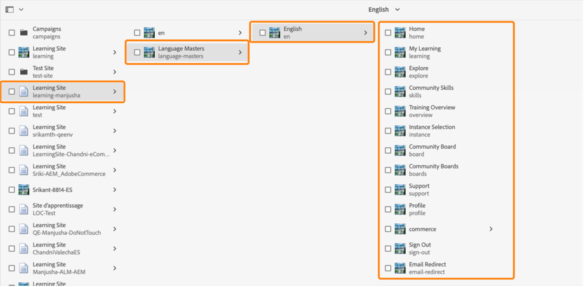
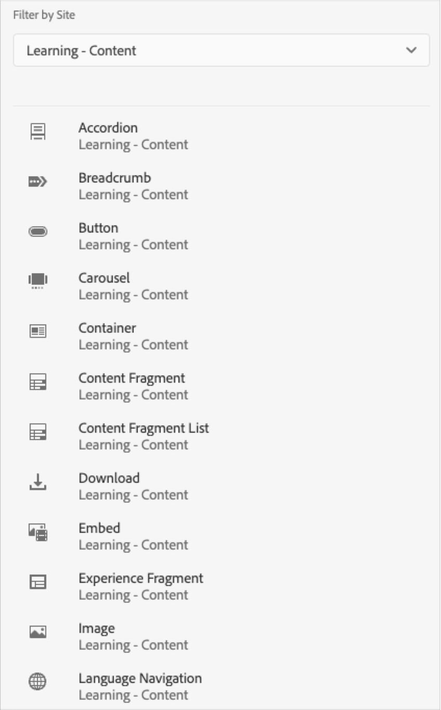

# Adobe Learning Manager-referentiesite (ALM-verwijzingssite) voor AEM Sites

Adobe Learning Manager (ALM) integreert met Adobe Experience Manager-sites (AEM). Zo kunt u uw eigen website en responsieve mobiele interfaces voor Adobe Learning Manager maken met minimale coderingsinspanningen. Met deze integratie kun je aangepaste leerervaringen creëren voor je gebruikers.

Voor het bouwen van een dergelijke ervaring biedt ALM een Adobe Learning Manager-referentiesite (ALM-referentiesite) voor AEM Sites in de vorm van een ZIP-bestand dat u op uw AEM Sites-instantie kunt installeren.

Het pakket bevat sjablonen voor AEM Sites-webpagina&#39;s en websitecomponenten, samen met insluitbare widgets, zoals een Leercatalogus, insluitbare widgets, kalender enzovoort.

Nadat u het ALM-referentiesite hebt geïnstalleerd, kunt u beginnen met het bouwen van een website voor Adobe Learning Manager die u op uw AEM Sites-instantie kunt hosten. Uw gebruikers kunnen de componenten vervolgens naar de website slepen.

ALM-referentiesite installeren

## Voorwaarden

* Licenties voor AEM Sites en Adobe Commerce.
* AEM on-premise 6.5 of Adobe Experience Manager - Cloud Service
* Adobe Commerce 2.4.3

Nadat u uw omgeving van AEM Sites hebt beveiligd, moet u het ALM-verwijzingspakket installeren. Dit pakket bevat AEM webpagina&#39;s en websitecomponenten die u helpen bij het samenstellen van het leerplatform.

Het referentiesite wordt gehost op de [**GitHub-repository**](https://github.com/adobe/adobe-learning-manager-reference-site/releases/tag/1.0.0).

Zie README voor meer informatie.

## Een toepassing maken in [!DNL Adobe Learning Manager]

Nadat u het AEM sitepakket hebt geïnstalleerd, moet u een ALM-toepassing configureren om uw leerportal te koppelen aan de AEM site.

Dit scenario is van toepassing wanneer AEM wordt gebruikt met [!DNL Adobe Learning Manager].

Volg de onderstaande stappen:

1. Als integratiebeheerder klikt u op **[!UICONTROL Toepassingen]**.
1. Als u een nieuwe toepassing wilt maken, klikt u rechtsboven op de pagina op **[!UICONTROL Registreren]**.
1. Voer in het scherm Een nieuwe toepassing registreren de volgende gegevens in:

   1. Toepassingsnaam: de naam van de toepassing die u maakt.
   1. URL: De URL van uw organisatie.
   1. Omleidingsdomeinen: de hostdomeinen van de AEM website. U kunt ook jokertekens opgeven.
   1. Beschrijving: De beschrijving van de toepassing.
   1. Bereiken: Selecteer Leestoegang studentrol en Schrijftoegang studentrol.
   1. Alleen voor dit account?: Selecteer Ja als u de toepassing wilt gebruiken voor het bestaande ALM-account.

1. Klik op Opslaan nadat u de wijzigingen hebt aangebracht.

Noteer de aanmeldingsgegevens van de toepassing vanuit het scherm.

*Toepassingsgegevens*

Klik op **[!UICONTROL Goedkeuren]**.

## Tokens ophalen

1. Klik op het tabblad Developer Resources op **[!UICONTROL Toegangstokens voor testen en ontwikkelen]**.

   

   *Toegangstokens selecteren voor testen en ontwikkelen*

1. Voer de volgende gegevens in:

   
   *Voer de tokengegevens in*

   1. OAuth Code ophalen: voer de client-id in uit de vorige sectie en wijzig het bereik. Klik op Verzenden om de OA-code op te halen.
   1. Token voor vernieuwen ophalen: voer de client-id en het geheim in uit de vorige sectie. Voer ook de OAuth-code in die u uit de vorige stap hebt gekregen. Klik op Verzenden.
   1. Toegangstoken ophalen: voer de client-id en het geheim in van de vorige sectie. Voer ook het vernieuwingstoken in dat u hebt gekregen van de vorige stap. Klik op Verzenden.
   1. Tokengegevens voor toegang ophalen: voer het toegangstoken in dat u hebt gekregen van de vorige stap. Klik op Verzenden.

1. U kunt de details van het JSON-antwoord krijgen dat volgt. De reactie bestaat uit het toegangstoken, het vernieuwingstoken, de gebruikersrol, account-id, de gebruikers-id en de tijd die moet verlopen. Let op het vernieuwingstoken, zoals u dat opnieuw gaat gebruiken.

## ALM-account configureren in AEM

1. Start uw AEM.
1. Klik op Instellingen > Cloud Servicen.
1. Klik op Adobe Learning Manager Configuration.

   
   *Adobe Leerbeheerconfiguratie selecteren*

1. Klik op Maken > Configuratiemap. Geef de map een naam.

   
   *Configuratie maken*

1. Selecteer in het leerproject de configuratie die u hebt gemaakt.

1. Voer de details van de configuratie in.

   
   *Configuratiemap maken*

   1. Modus Adobe Leermanager: kies hoe u de leerervaring wilt voor zowel aangemelde als niet-aangemelde studenten.
   1. URL van Adobe Leermanager: voer de URL in van de ALM-instantie waar de leerservices worden gehost.
   1. Account-id: De id van het ALM-account.
   1. Client-id, clientgeheim en het vernieuwingstoken van auteur: voer de referenties in die u hebt gekregen tijdens het maken van de toepassing in ALM.
   1. Aanpassing van widget: zie voor meer informatie [Integreren met AEM](/help/migrated/integrate-aem-learning-manager.md) `.`

1. Sla de configuratie op en sluit deze.

### AEM + Adobe Learning Manager (aangemelde/niet-aangemelde gebruikers)

Met Adobe Learning Manager kunt u uw product en training nu presenteren aan uw bestaande en toekomstige klanten en partners zonder dat u een account hoeft te maken of u zich hoeft aan te melden. Met deze functionaliteit kunt u de adoptie van producten en trainingen stimuleren door studenten een snelle en eenvoudige voorvertoning van de training te geven, zodat ze productfuncties kunnen markeren en promoten. Daarom kun je je producten en aanbiedingen effectief presenteren, met name aan potentiële klanten en partners, wat leidt tot meer productbewustzijn. Het gemak van toegang en betere bereikbaarheid leiden tot een verhoogde interesse, wat helpt om trainingsinschrijvingen en leeradoptie te stimuleren.

Met deze workflow kan een student een training voorvertonen, toegang krijgen tot trainingsinformatie of naar training zoeken zonder zich aan te melden bij de Adobe Learning Manager. Deze workflow is niet van toepassing op de native Learning Manager-interface (ALLEEN van toepassing op AEM Sites en andere headless interfaces).

**De connector van het leerplatform configureren en inschakelen**

Deze sectie onderstreept de stappen nodig om de volgende schakelaar te vormen en toe te laten:

**Toegang tot trainingsgegevens**

Met deze connector kan uw op AEM Sites gebaseerde of een andere aangepaste headless gebruikersinterface de trainingsinformatie ophalen en naar de studenten renderen en een naadloze zoekfunctie voor trainingsinformatie uitvoeren, zowel voor als na het aanmelden van een student.

Deze connector is alleen vereist als u op AEM Sites gebaseerde of andere headless interfaces gebruikt.

De connector exporteert trainingsmetagegevens naar een oplossing voor gegevensopslag en -ophaalbewerking en naar een systeem voor zoekmogelijkheden. Daarom kunt u uw op AEM Sites gebaseerde of een andere aangepaste headless gebruikersinterface configureren om deze twee services te gebruiken om trainingsgegevens op te halen, webpagina&#39;s te renderen en de studenten geoptimaliseerde zoekfunctionaliteit voor training te bieden. Een niet-aangemelde AEM Sites-interface kan de geëxporteerde metagegevens bijvoorbeeld gebruiken om studenten te helpen bij het zoeken naar, bladeren naar en toegang krijgen tot trainingspagina&#39;s met trainingsinformatie.

Schakel deze connector in om uw op AEM Sites gebaseerde webpagina&#39;s te bouwen en weer te geven en om uw studenten zowel voor als na aanmelding aangepaste ervaringen te bieden. Schakel deze connector in om uw op AEM Sites gebaseerde webpagina&#39;s te bouwen en weer te geven en om uw studenten zowel voor als na aanmelding aangepaste ervaringen te bieden.

* Adobe Leermanager cdn basis-URL - Voer de basis-URL in van het CDN-servicepad voor het ophalen van gegevens op de pagina Toegang tot trainingsgegevens.
* Beheerder vernieuwingstoken - Voer het vernieuwingstoken in dat u in de vorige sectie hebt bepaald.
* De basis-URL van de trainingsmetagegevens - Voer de basis-URL in van het pad van de zoekfunctie en de zoekfunctie voor gegevens-ophaalservice van de pagina Toegang tot trainingsgegevens.
* Adobe Leermanager-register-URL - Voer de zelfregistratie-URL in die door de integratiebeheerder voor het account wordt gegenereerd en die door studenten wordt gebruikt om zich in te schrijven voor training.

### AEM + Adobe Learning Manager + Adobe Commerce (aangemelde/niet-aangemelde gebruikers)

Adobe Learning Manager biedt nu oplossingen waarmee u het leerplatform naadloos kunt integreren met Adobe Commerce. Met deze release kunt u uw native, AEM sites gebaseerde of andere headless Learning Manager-interfaces eenvoudig verbinden met Adobe Commerce. Dankzij deze integratie kun je e-commercemogelijkheden realiseren binnen je leerplatform. U kunt nu betaalde training aanbieden aan uw klanten en zakelijke partners, en u kunt trainingsaankopen eenvoudig inschakelen op zowel de native als de niet-native Learning Manager-interfaces. Een student kan ook een voorvertoning van een training bekijken, toegang krijgen tot trainingsinformatie of naar een training zoeken zonder zich aan te melden bij de Adobe Learning Manager.

In plaats van een toepassing te maken, kan een gebruiker de reeds AEM toepassing gebruiken en deze goedkeuren.

* Adobe Leermanager cdn basis-URL - Voer de basis-URL in van het CDN-servicepad voor het ophalen van gegevens vanaf de Adobe Commerce-verbindingspagina.
* Adobe Commerce URL - Voer de URL in van de Adobe Commerce-instantie die u gebruikt.
* GraphQL-proxypad: de client-side Learning Manager-componenten hebben rechtstreeks toegang tot het Adobe Commerce GraphQL-eindpunt en daarom kan CORS-fout optreden. Om deze fout te vermijden, moeten alle vraag of van het zelfde eindpunt zoals AEM worden gediend of via een volmacht worden gediend die kopballen CORS toevoegt.
* Adobe Commerce Store name - Voer de Adobe Commerce store name in die u in de vorige sectie hebt bepaald.
* De symbolische levensduur van de Adobe Commerce-klant (in sec) - Voer de token-levensduur van de klant in om de vooraf bepaalde periode voor een aanmeldingssessie aan te geven.
* Beheerder vernieuwingstoken - Voer het vernieuwingstoken in dat u in de vorige sectie hebt bepaald.

## Webpagina&#39;s aanpassen

Pas uw webpagina&#39;s aan met behulp van de site met AEM referenties en de beschikbare widgets.

1. Start uw AEM.
1. Klik op Sites en open de configuratiepagina.
1. Klikken **[!UICONTROL Leersite]** > **[!UICONTROL Taalmeesters]** > **[!UICONTROL Engels]**. Alle webpagina&#39;s in het project worden opgenomen in de map.

   
   *Alle webpagina&#39;s weergeven*

1. Selecteer een sjabloon en klik op **[!UICONTROL Bewerken]**.

1. Klik op de knop Componentinstellingen op de pagina en wijzig de eigenschappen van de component.

   
   *Knop Instellingen selecteren*

1. Geef een voorvertoning van uw wijzigingen weer of u kunt de pagina publiceren.

## Webpagina&#39;s maken

Naast de sjablonen die u kunt gebruiken en die worden geleverd door het referentiesite, kunt u ook webpagina&#39;s maken op basis van de sjablonen AEM.

1. Klik op de AEM hoofdpagina op Maken > Pagina.

1. Kies de sjabloon die u wilt aanpassen. Klik op Volgende.

1. Voer de pagina-eigenschappen in.

   
   *Pagina-eigenschappen*

1. Klik op **[!UICONTROL Maken]**.

1. Selecteer de nieuwe pagina en klik op **[!UICONTROL Bewerken]**.

1. Voeg bijvoorbeeld een component op de pagina in **Leermateriaal - Inhoud**.

   
   *Filteren op site*

1. Kies de vereiste catalogusfilters die op de pagina worden weergegeven.

## Site maken van blauwdruk

Het ALM-referentiesite-pakket biedt de functie ‘Learning Site Blueprint’, waarmee u een website voor uw leerplatform kunt maken. Met AEM blauwdrukken kunt u rechtstreeks vanuit AEM Sites-componenten webpagina&#39;s maken. U hoeft geen sjablonen te gebruiken.

1. Klik op de AEM startpagina op **[!UICONTROL Sites]**.

1. Klikken **[!UICONTROL Maken]** > **[!UICONTROL Site]**.

1. Klik op Sitevervaging leren.

   

   *Site maken van blauwdruk*

1. Klik op Volgende.

1. Voer op de pagina met eigenschappen de metagegevens van de pagina in. Klik op Maken.

   
   *Leersite verfijnen selecteren*

1. Klik op de hyperlink Home om naar de startpagina van de site te gaan die u hebt gemaakt. Op deze pagina kunt u de widgets en cataloguscomponenten aanpassen.

## Uw website coderen

Naast het gebruik van de ingebouwde sjablonen en het maken van uw website met behulp van de WYSIWYG-componenten, kunt u ook code schrijven en de site bouwen.

De code bevindt zich in de [Referentiesite GitHub-repository](https://github.com/adobe/adobe-learning-manager-reference-site) om aan de slag te gaan.

De belangrijkste onderdelen van de sjabloon zijn:

* kern: Java-bundel die alle kernfunctionaliteit bevat, zoals OSGi-services, listeners of planners, plus aan componenten gerelateerde Java-code zoals servlets of aanvraagfilters.
* ui.apps: bevat de onderdelen /apps (en /etc) van het project, dat wil zeggen JS&amp;CSS-clientlibs, componenten, sjablonen.
* ui.content: bevat voorbeeldinhoud met behulp van de componenten van het ui.apps
* ui.frontend: bevat React-componenten.

Alle code staat in het rapport om u aan de slag te krijgen.

## Componenten van LMS importeren en toevoegen aan bestaande webpagina of sjabloon

Als u AEM referentiesite installeert, worden de Leerbeheercomponenten aan uw AEM Sites-instantie toegevoegd. Standaard kunt u deze componenten toevoegen aan de leersite van het webproject (website) die wij kant-en-klare oplossingen bieden. Deze componenten zijn ook beschikbaar op de website die u maakt van de Learning Site Blueprint.

Als u deze nieuw toegevoegde Leerbeheercomponenten echter wilt gebruiken voor uw bestaande webproject of website, moet u deze importeren met de volgende procedure.

1. Installeer het ALM-referentiesite.

1. Open het webproject en navigeer naar het HTML-bestand (voor de webpagina of websjabloon waaraan u de componenten van Leerbeheer wilt toevoegen).
1. Deelnemen aan een vergadering

   Open het HTML-bestand en voeg de volgende codefragmenten toe aan de paginacomponent, zodat de code wordt uitgevoerd voordat de leercomponenten in de pagina worden weergegeven.

   *`<sly data-sly-use.configModel="com.adobe.learning.core.models.GlobalConfigurationModel"/>`*
   *`<meta name="cp-config" content="${configModel.config}" />`*

   De voorgaande code voegt de toegewezen configuratie in de metatag van de pagina toe, die nodig is om de leercomponenten te renderen. Zie voor meer informatie [Referentiesite van Adobe Learning Manager](https://github.com/adobe/adobe-learning-manager-reference-site/blob/master/ui.apps/src/main/content/jcr_root/apps/learning/components/page/customheaderlibs.html).

1. Zorg ervoor dat u de configuratie met het Webproject in kaart hebt gebracht.
1. Open de AEM Sites-sjabloon waarin u de onderdelen van de Learning Manager wilt importeren.
1. Navigeer in de sjabloonpagina-editor naar de container Toegestane componenten en selecteer **Beleid**.
1. Navigeer op de beleidspagina naar Eigenschappen > Toegestane componenten en selecteer de volgende componenten &quot;Leren - Inhoud&quot;, &quot;Leren - Formulier&quot; en &quot;Leren - Structuur&quot;

De volgende procedure stelt de sjabloon in staat om te voldoen aan de afhankelijkheden van de clientbibliotheek van de geïmporteerde leerbeheercomponenten.

De webpagina&#39;s die deze componenten bevatten, moeten deze bibliotheken laden om de componenten te renderen en te gebruiken.

1. Klik in de sjabloonpagina-editor op Pagina-informatie en klik vervolgens op Paginabeleid.
1. Navigeer op de pagina Beleid naar Eigenschappen > Clientbibliotheken en voeg deze toe aan uw sjabloonpagina:

   1. learning.site
   1. learning.ui
   1. learning.commerce

Nadat u deze sjabloon hebt opgeslagen, kunt u de componenten van de Learning Manager toevoegen aan alle webpagina&#39;s die van deze sjabloon zijn afgeleid.
