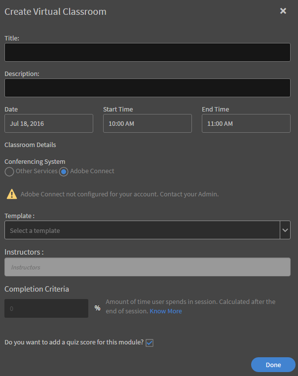

# Adobe Connect-integratie

Auteurs kunnen virtuele klassikale cursussen met Adobe Connect maken tijdens het maken van cursussen. Neem contact op met de beheerder van uw organisatie om Adobe Connect in te schakelen voor uw LMS-account.

## Virtuele klassikale cursus maken met Adobe Connect {#createvirtualclassroomvccoursewithadobeconnect}

1. Klik op de pagina Mijn cursussen op Modules toevoegen en kies Virtuele lesruimte. Het dialoogvenster Virtuele lesruimte maken verschijnt.
1. In het dialoogvenster **Conferentiesysteem** kiest u Adobe Connect.

   

   *Een virtuele lesruimte maken*

1. Voer titel, beschrijving, VC-datum, begintijd en eindtijd in.

   Als Adobe Connect niet is geconfigureerd voor uw account, verschijnt er een waarschuwingsbericht zoals weergegeven in de bovenstaande schermafbeelding. Sjabloon, docenten en andere Adobe Connect-opties zijn uitgeschakeld. U moet contact opnemen met uw beheerder om Adobe Connect voor uw account te configureren.

1. De toepassing Adobe Leermanager haalt de standaardsjablonen (vergadering, training en gebeurtenis) en de lijst met docenten (gebruikers met hostmachtigingen) van Adobe Connect op. Kies de gewenste sjabloon.
1. Kies de docent voor uw VC-cursus uit de lijst met docenten.

   

   *Selecteer de docent in de lijst*

1. Geef voltooiingscriteria op voor de VC-cursus. Voltooiingscriteria is het percentage van de totale duur van de cursus dat een student moet bijwonen om als voltooid te worden beschouwd. De duur van een cursus is bijvoorbeeld 1 uur. Als u 50% opgeeft als voltooiingscriterium, wordt een student die de cursus zelfs gedurende 30 minuten bijwoont, beschouwd als voltooid voor de student.
1. Klikken **[!UICONTROL Gereed]**.

## Gedeelde sjablonen van Adobe Connect {#sharedtemplatesofadobeconnect}

Standaard worden alle gedeelde sjablonen die zijn gemaakt in de Adobe Connect-account opgehaald in de Learning Manager-toepassing. U kunt aangepaste sjablonen toevoegen door deze als gedeelde sjablonen in een Adobe Connect-account te maken.
