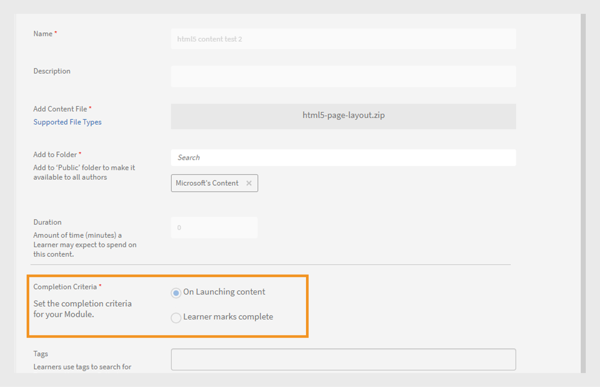
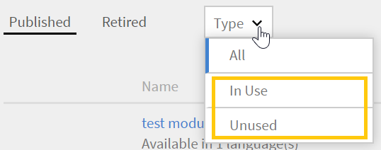
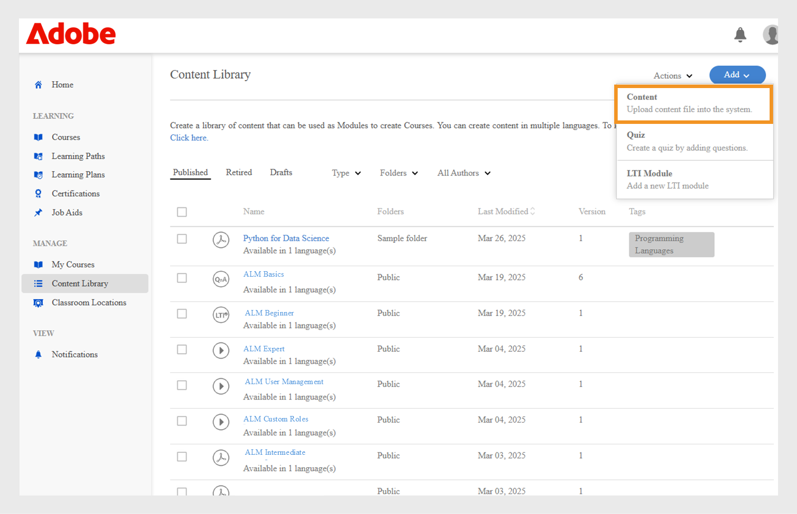
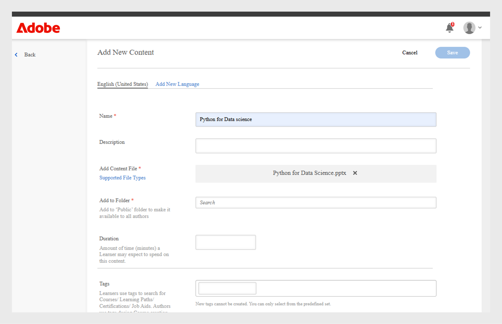

# Inhoudsbibliotheek

Leer hoe u inhoud maakt en deze afstemt op cursussen als inhoud op eigen tempo.

## Inhoudsbibliotheek {#contentlibrary}

Inhoud is de bouwsteen van een cursus. Auteurs maken een bibliotheek met inhoud die op cursussen kan worden afgestemd als inhoud op eigen tempo. Alleen auteurs hebben toegang tot deze inhoudsbibliotheek.

## Ondersteunde inhoudstypen {#supported}

U kunt zowel interactieve als statische inhoud in de bibliotheek uploaden.

De onderstaande tabel toont de interactieve en statische bestandstypen die u naar de bibliotheek kunt uploaden.

<table>
 <tbody>
  <tr>
   <td>
    
<b>Interactieve inhoud</b>
</td>
   <td>
    
<b>Inhoudstype</b>
</td>
   <td>
    
<b>Extensies</b>
</td>
  </tr>
  <tr>
   <td>
    
 
</td>
   <td>
    

    <ul>
     <li>SCORM 1.2</li>
     <li>SCORM 2004</li>
     <li>AICC</li>
     <li>TinCan</li>
    </ul>
    

</td>
   <td>
    
zip
</td>
  </tr>
  <tr>
   <td>
    
<b>Statische inhoud</b>
</td>
   <td>
    
<b>Inhoudstype</b>
</td>
   <td>
    
<b>Extensies</b>
</td>
  </tr>
  <tr>
   <td>
    
 
</td>
   <td>
    
Video
</td>
   <td>
    
mp4, wmv, 3gp, 3g2, 3gp2, asf, avi, f4v h264, mpe, mpeg, mpg, mpg2, m4v, mov, wmv
</td>
  </tr>
  <tr>
   <td>
    
 
</td>
   <td>
    
Audio
</td>
   <td>
    
mp3, wav, aac, m4a, wma, vorbis, pcm, eac3, amr, ac3, amr, ac3
</td>
  </tr>
  <tr>
   <td>
    
 
</td>
   <td>
    
PDF
</td>
   <td>
    
pdf
</td>
  </tr>
  <tr>
   <td>
    
 
</td>
   <td>
    
MS PowerPoint
</td>
   <td>
    
pptx, ppt
</td>
  </tr>
  <tr>
   <td>
    
 
</td>
   <td>
    
MS Word
</td>
   <td>
    
docx, doc
</td>
  </tr>
  <tr>
   <td>
    
 
</td>
   <td>
    
MS Excel
</td>
   <td>
    
xlsx, xls
</td>
  </tr>
  <tr>
   <td>
    
 
</td>
   <td>
    
HTML
</td>
   <td>
    
zip-bestand
</td>
  </tr>
 </tbody>
</table>

## Nieuwe inhoud toevoegen aan de bibliotheek {#addnewcontentinthelibrary}

**Auteurs** kunnen inhoud in ALM toevoegen. Er zijn twee soorten inhoud in ALM: **[!UICONTROL Inhoud]** en **[!UICONTROL Quiz]**. Leren hoe te om inhoud toe te voegen zie [&#x200B; statische inhoud &#x200B;](content-library.md#addstaticcontent) toevoegen en [&#x200B; creeer een quiz &#x200B;](content-library.md##createaquiz).

## Statische inhoud toevoegen {#addstaticcontent}

1. Selecteer **[!UICONTROL Bibliotheek van de Inhoud]** op de linkerruit na u login als **Auteur** en selecteer **[!UICONTROL toevoegen]**.

   Alternatief, kunt u **[!UICONTROL selecteren creeer Inhoud]** van de **[!UICONTROL Begonnen]** pagina.

1. Op het **[!UICONTROL gebied van de Naam]**, typ een naam voor de inhoud die u wilt uploaden.
1. Op het **[!UICONTROL gebied van de Beschrijving]**, typ de beschrijving voor de inhoud. Voer een zinvolle beschrijving in. De tekenlimiet is 400 tekens.
1. Om de inhoud toe te voegen, **[!UICONTROL voeg het Dossier van de Inhoud]** toe, en upload uw middeldossier. Wanneer u inhoud voor meerdere talen toevoegt, kunt u statische en interactieve inhoud niet in één groep combineren. Uw inhoud moet voor alle locaties ofwel statisch, ofwel interactief zijn.

   Als u de inhoud wilt vervangen, kunt u statische inhoud door andere statische inhoud vervangen. Hetzelfde geldt voor interactieve inhoud.

1. Op het **[!UICONTROL gebied van de Duur]**, kunt u naar keuze de verwachte tijd typen een student in deze module zou doorbrengen. De duur is in minuten.

   Als de student een cursus als voltooid markeert, berekenen we de leertijd op basis van de opgegeven duur. Als de student de inhoud in de speler verbruikt, wordt de tijd die in de speler wordt doorgebracht, toegevoegd aan de bestede leertijd. Als de werkelijke tijd van de inhoud korter is dan de opgegeven duur, wordt de tijd van de inhoud ongewijzigd weergegeven. In dit geval worden geen wijzigingen aangebracht.

1. In het **[!UICONTROL gebied van Markeringen]**, typ de markeringen voor de geüploade inhoud zodat uw inhoud vindbaar wordt.

   Een auteur kan deze tags gebruiken om te zoeken naar de inhoud terwijl de inhoud aan de cursus wordt toegevoegd.

### HTML5-bestandstype toevoegen aan de inhoudsbibliotheek

Auteurs kunnen HTML5-inhoud als zip-bestand toevoegen aan inhoud op eigen tempo. De .zip-map moet een HTML-bestand met de naam `index.html` bevatten. Als er meerdere HTML-bestanden zijn, moeten deze allemaal worden gekoppeld met de naam `index.html` van het hoofdbestand. Studenten kunnen de HTML5-inhoud in de Fluidic Player bekijken. De auteur kan deze HTML5-inhoud toevoegen aan de module op eigen tempo van een cursus en de voltooiingscriteria instellen. Auteurs kunnen de criteria voor het voltooien van de HTML-cursus op een van de volgende twee manieren instellen:

* De student kan het als voltooid markeren.
* Het wordt als voltooid gemarkeerd zodra de cursus wordt gestart.

Voer de volgende stappen uit om het bestandstype HTML (.zip) aan de inhoudsbibliotheek toe te voegen.

1. In de auteur app, uitgezochte **[!UICONTROL creeer Inhoud]** op de homepage.
1. In het **[!UICONTROL scherm van de Bibliotheek van de Inhoud]**, uitgezocht **[!UICONTROL voeg]** toe > **[!UICONTROL Inhoud]**.
1. Typ de naam en beschrijving van de inhoud.
1. Selecteer **[!UICONTROL voeg de optie van het Dossier van de Inhoud]** toe, dan doorblader en selecteer de dossiers van de HTML (zipped als omslag).
1. Op de toegevoegde inhoud, kunt u de inhoud op de **[!UICONTROL sectie van de Bibliotheek van de Inhoud]** bekijken.
1. Selecteer de inhoud van de HTML en selecteer dan **[!UICONTROL uitgeven]**.
1. Selecteer om het even welke volgende opties van de **[!UICONTROL optie van de Criteria van de Voltooiing]**.
   * **[!UICONTROL bij het Lanceren van inhoud]**: De cursus zal automatisch als volledig worden gemerkt wanneer de student het lanceert.
   * **[!UICONTROL de tekens van de student volledig]**: de student heeft de optie om de cursus als volledig in de Fluidic Player te merken.

   
   _criteria van de Voltooiing_

1. Selecteer **[!UICONTROL Opslaan]**.
1. Maak een cursus door deze inhoud toe te voegen.  Voor meer informatie, mening [&#x200B; creërend, wijzig, en publiceer cursussen &#x200B;](/help/migrated/authors/feature-summary/courses.md).

Als een auteur in de Learner-app selectiecriteria selecteert als **[!UICONTROL Bij starten van inhoud]** , wordt de cursus als voltooid gemarkeerd wanneer de student de cursus start. Wanneer een auteur **[!UICONTROL volledige de markeringen van de Student]** kiest, zal de student de optie hebben om de cursus als volledig te merken.

_voltooide de markeringen van de Student_

### Versiebeheer {#versioning}

De inhoudsbibliotheek houdt versies van uw geüploade inhoud bij. Als u een wijziging aanbrengt in de inhoud, bijvoorbeeld in een PowerPoint-presentatie, en de PPT opnieuw in de bibliotheek laadt, wordt het versienummer met één verhoogd. Dit helpt u om veranderingen in uw inhoud bij te houden.

## Interactieve inhoud toevoegen {#addinteractivecontent}

1. Selecteer **[!UICONTROL Bibliotheek van de Inhoud]** op de linkerruit na u login als **Auteur** en selecteer **[!UICONTROL toevoegen]**.

   Alternatief, kunt u **[!UICONTROL selecteren creeer Inhoud]** van de **[!UICONTROL Begonnen]** pagina.

1. Op het **[!UICONTROL gebied van de Naam]**, typ een naam voor de inhoud die u wilt uploaden.
1. Op het **[!UICONTROL gebied van de Beschrijving]**, typ de beschrijving voor de inhoud.

   >[!NOTE]
   >
   >Voer een zinvolle beschrijving in. De tekenlimiet is 245 tekens.

1. Om de inhoud toe te voegen, **[!UICONTROL voeg het Dossier van de Inhoud]** toe, en upload uw middeldossier. Wanneer u inhoud voor meerdere talen toevoegt, kunt u statische en interactieve inhoud niet in één groep combineren. Uw inhoud moet voor alle locaties ofwel statisch, ofwel interactief zijn.

* [Ondersteunde bestandstypen](content-library.md#supported)

  De interactieve inhoud kan een project zijn dat met SCORM, AICC of Captivate is gepubliceerd. Het bestand moet een ZIP-bestand zijn.

  U kunt ook HTML-inhoud toevoegen die met Captivate, Presenter of Presenter Video Express is gegenereerd.

1. Adobe Learning Manager ondersteunt bijschriften voor video-inhoud die is geüpload in Adobe Learning Manager. Nu kunnen auteurs het bestand met bijschriften samen met het videobestand uploaden.

   Vervolgens kunnen de studenten de bijschriften bekijken tijdens het afspelen van de videomodule.

   Het formaat gesteund is {de Tracks van de Tekst van 0} Video van het Web (webVTT) [.](https://www.w3.org/TR/webvtt1/)

   Ondersteuning voor bijschriften is beschikbaar voor video-inhoud die is geüpload in de inhoudsbibliotheek in Adobe Learning Manager.

   Wanneer u als auteur een video- of audio-inhoud uploadt, kunt u ook het VTT-bestand uploaden dat de bijschriften bevat.

   De ondertitels verschijnen dan in de Fluidic Player. De titels zijn ook volgzaam aan [&#x200B; WCAG2.0 normen &#x200B;](https://www.w3.org/TR/WCAG20/).

   Wanneer u een videoinhoud aan de bibliotheek toevoegt, kunt u het VTT dossier ook toevoegen, dat **&#x200B;**&#x200B;een geldig dossier moet zijn.

   

   *voeg een webvtt dossier* toe

   Het geüploade vtt-bestand komt overeen met de bestaande versie van de inhoud. Het geüploade webVTT-bestand is dus niet gekoppeld aan de oudere versie van de inhoud.

   Als u de inhoud in verschillende talen maakt, kunt u voor elke taal een ander webVTT-bestand uploaden. Studenten zullen de bijschriften die overeenkomen met de geselecteerde taal tijdens het afspelen kunnen zien.

   >[!NOTE]
   >
   >   Eén VTT-bestand ondersteunt één taal. Als u meerdere talen wilt ondersteunen, uploadt u meerdere videobestanden voor elke inhoudstaal en uploadt u vervolgens het respectievelijke VTT-bestand voor elk videobestand.

   Als auteur vraagt Adobe Learning Manager u telkens wanneer u de inhoud, video of audio wijzigt om een nieuw vtt-bestand.

   Nadat u deze inhoud aan een cursus hebt toegevoegd en wanneer u een voorvertoning van de cursus als student bekijkt, kunt u de bijschriften op de video zien.

   Schakel op de speler de CC-toets op de Fluidic Player in om de bijschriften weer te geven of te verbergen.

   Dezelfde weergave is aanwezig in de **Learner-app** en in **Voorvertoning als student**.

   Wanneer u **toevoegt, bijwerkt, of schrapt** het vtt dossier, ontvangt u een bericht.
WebVTT-ondersteuning is niet beschikbaar voor:

   1. Video-aankondigingen.
   1. Video die wordt afgespeeld in de eLearning-inhoud. Dit wordt aangestuurd door de inhoud.
   1. Video geüpload in Social Learning.
   1. Video gemaakt in Adobe Learning Manager desktop-app.
   1. Video-inhoud gemaakt met behulp van migratieproces.
   1. Video afspelen in mobiele app in offline modus.

1. Op het **[!UICONTROL gebied van de Duur]**, kunt u naar keuze de verwachte tijd ingaan een student in deze module zou doorbrengen. De duur is in minuten.
1. Op het **[!UICONTROL gebied van Markeringen]**, ga de markeringen voor de geüploade inhoud in zodat uw inhoud vindbaar wordt.

### Ondersteuning voor gedeelde catalogus

Als een verkopersaccount een catalogus deelt die de cursussen bevat en de cursussen de modules, audio of video met de ondertitels bevatten, moeten de cursussen zich in het kopersaccount op dezelfde manier gedragen.

Moduledoorgifte moet correct werken van verkopers- naar kopersaccount. Dit kan zijn: bewerken/verwijderen/toevoegen van het vtt-bestand in de module.

Zodra u de inhoud hebt geüpload, kunt u een melding weergeven door op het belletje in de rechterbovenhoek van de pagina te klikken. Telkens wanneer u inhoud wijzigt en opnieuw uploadt, krijgt u een melding. Als u de wijzigingen aanbrengt, krijgt alleen u de melding. Andere auteurs ontvangen geen melding.

## Een quiz maken {#createaquiz}

Maak beoordelingen in Adobe Learning Manager met de nieuwe tool voor het maken een van quiz op de pagina Inhoudsbibliotheek. De gemaakte beoordelingen worden onderdeel van de inhoudsbibliotheek en kunnen worden toegevoegd aan een openbare map voor hergebruik van de cursus.

1. Selecteer Inhoudsbibliotheek in het linkerdeelvenster.
1. In de hoger-juiste hoek van het scherm, selecteer **toevoegen > Quiz**.
1. Typ de naam en beschrijving van de quiz op de pagina Quiz maken.
1. Selecteer in de sectie Quizinhoud de optie **quizvraag toevoegen**.
1. Selecteer het type vraag in het dialoogvenster Quizvraag. Er zijn drie typen vragen:
   * Meerkeuzevragen
   * Waar of niet waar
   * De lege ruimte invullen
1. Voer de vraag in en selecteer het juiste antwoord.
1. Stel de punten in voor de quiz.
1. Schakel het selectievakje in als u wilt dat de vraag juist wordt beantwoord om te slagen voor de quiz **Verplicht om correct te antwoorden om voor de quiz te slagen**.
1. Selecteer **Opslaan en sluiten**.
1. Ga de punten in om de quiz op het **overgaan van criteria** gebied over te gaan.
1. Als u een student een correct antwoord wilt bekijken, laat de knevel **toe toont correcte antwoorden** aan studenten na de quiz.
1. Als u de vragen en antwoorden willekeurig wilt weergeven, schakelt u de volgende schakelopties in:
   * Willekeurige vraagvolgorde
   * Willekeurige antwoordoptievolgorde
1. Geef een map op om de quiz toe te voegen zodat alle auteurs de quiz kunnen openen.
1. Op het **gebied van de Duur**, specificeer de tijd de student aan de quiz moet doorbrengen.
1. Geef een tag op uit de lijst met al gemaakte tags.
1. Voeg een logo en achtergrond toe aan de quiz.
1. Op de hoger-juiste hoek van de pagina, uitgezochte **Publish**.

Volg de onderstaande stappen om de quizzen in een andere taal toe te voegen:

1. Om de quiz voor verschillende talen toe te voegen, selecteer **voeg Nieuwe Taal** tabel toe, en kies de vereiste talen. Op deze manier kunt u meertalige ondersteuning voor uw inhoud toevoegen.

   

   *voeg nieuwe taal voor een inhoud toe*

1. Herhaal de procedure voor het uploaden van inhoud voor de nieuwe talen.
1. Als u een taal wilt verwijderen, selecteer **[!UICONTROL Nieuwe Taal]** tabel toevoegen, en ontruim uw selectie.

   Nadat u de veranderingen hebt aangebracht, klik **[!UICONTROL sparen]**. De nieuwe inhoud is nu beschikbaar in de bibliotheek.

De quiz wordt toegevoegd aan de **[!UICONTROL Bibliotheek van de Inhoud]**. Net als alle andere inhoud in de Inhoudsbibliotheek kunt u een quiz archiveren en vervolgens verwijderen.

## Aan map toevoegen {#add-folder}

Nadat een beheerder de inhoudsmappen heeft gemaakt, kunt u als auteur inhoud uploaden naar een inhoudsmap, zodat de inhoud alleen zichtbaar is voor u of een bepaalde groep van auteurs in het account. U kunt de inhoud ook openbaar en zichtbaar maken voor alle auteurs in het account.

**Voorbeeld van gebruik**

Bijvoorbeeld, willen de agentschappen volledige controle van de inhoud handhaven en iemand die de inhoud over het hoofd ziet moet toegang tot al inhoud hebben. Tegelijkertijd moeten contentmakers in bureaus alleen toegang hebben tot hun eigen content en in sommige gevallen tot de content van iemand anders.

De bibliotheek van de inhoud met bestaande inhoud (d.w.z. inhoud geupload alvorens de omslagen van de Inhoud te vormen) wordt bepaald als **Openbare omslag**. Deze map kan niet worden gearchiveerd of verwijderd. Inhoud die deel uitmaakt van de openbare map, is toegankelijk voor alle typen auteurs. Als Inhoudsmappen zijn geconfigureerd, moeten standaardauteurs en aangepaste auteurs de map selecteren waarin de inhoud moet worden geplaatst, terwijl ze nieuwe inhoud uploaden.

>[!NOTE]
>
>Openbare mappen en privémappen sluiten elkaar uit. Dit betekent dat inhoud **niet** met Openbare omslag en privé omslag tezelfdertijd kan worden geassocieerd. Het kan of aan Openbare omslag worden geassocieerd, **of** het kan met één of meerdere privé omslagen op elk ogenblik worden geassocieerd.

Wanneer u inhoud toevoegt, kunt u de map kiezen waarin de inhoud zich bevindt.

*Inhoud aan een map toevoegen*

Als u **Openbaar** kiest, zal de inhoud aan alle auteurs zichtbaar zijn. Alle inhoud in de account die geen deel uitmaakt van een map, wordt standaard in de openbare map geplaatst.

Opmerking: inhoudsmappen zijn gewoon virtuele compartimenten waarmee inhoud wordt gekoppeld. Als één inhoud in twee mappen wordt geplaatst, betekent dit dat het inhoudsbestand altijd één bestand is, maar gekoppeld is aan meerdere mappen. Als de inhoud wordt bijgewerkt door de aangepaste auteur-1 die toegang heeft tot de aangepaste map-1, wordt dezelfde bijgewerkte inhoud ook weergegeven in de aangepaste map-2 die wordt geopend door de aangepaste auteur-2.

In de inhoudsbibliotheek zijn twee opties beschikbaar voor het beheer van de inhoudsmappen:

**Alle mappen**

Het is een lijst met alle mappen die in het account zijn gemaakt.

*Mening alle omslagen*

**Alle auteurs**

Het is een lijst waarin de auteurs worden weergegeven die inhoud hebben gemaakt en geüpload in de bibliotheek.

*Mening alle auteurs*

Dit is beschikbaar **slechts** wanneer een Beheerder een nieuwe omslag creeert.

## Inhoud verplaatsen naar map {#movecontenttofolder}

Als u inhoud van een openbare map naar een persoonlijke map wilt verplaatsen,

1. Selecteer **Openbare** omslag van de **Alle drop-down lijst van Omslagen**.

   

   *Mening al geüploade inhoud*

1. Kies de inhoud die u naar een map wilt verplaatsen. Dan klik **[!UICONTROL Acties]** > **[!UICONTROL organiseer Inhoud]** > **[!UICONTROL Inhoud van de Beweging aan Omslag]**.

   

   *Verplaats een geselecteerde inhoud naar omslag*

1. Kies de map waarnaar u de inhoud wilt verplaatsen. Klik **[!UICONTROL Beweging]**.

## Inhoud naar map kopiëren {#copycontenttofolder}

Als u een map kopieert, voegt u een tag toe aan de map. Met de kopieerbewerking worden geen kopieën van inhoud gemaakt, maar wordt alleen een koppeling met opgegeven mappen toegevoegd.

*Kopieer een omslag*

## Map ontkoppelen {#unlinkfolder}

Ontkoppelen betekent dat u de inhoud uit de geselecteerde map wilt verwijderen.

De inhoud kan van een gespecificeerde omslag **SLECHTS** worden losgemaakt als het ook met andere omslagen wordt geassocieerd. Als de inhoud die wordt ontkoppeld, slechts aan één map is gekoppeld, is het raadzaam de BEWEGINGSbewerking te gebruiken.

>[!NOTE]
>
>Het menu Indelen onder Acties is in eerste instantie uitgeschakeld. Als u dat menu wilt gebruiken, moet u eerst een map selecteren in de vervolgkeuzelijst.

*maak een omslag* los

## Inhoud voor andere talen toevoegen {#addcontentfordifferentlanguages}

1. Om de inhoud voor verschillende talen toe te voegen, klik **voeg Nieuwe Taal** tabel toe, en kies de vereiste talen. Op deze manier kunt u meertalige ondersteuning voor uw inhoud toevoegen.

   

   *voeg nieuwe taal voor een inhoud toe*

1. Herhaal de procedure voor het uploaden van inhoud voor de nieuwe talen.
1. Als u een taal wilt verwijderen, klikt u op het tabblad Nieuwe taal toevoegen en wist u uw selectie.

   Klik op Opslaan nadat u de wijzigingen hebt aangebracht. De nieuwe inhoud is nu beschikbaar in de bibliotheek.

## Voltooiingscriteria instellen {#setcompletioncriteria}

<table>
 <tbody>
  <tr>
   <td>
    
<b>Statische inhoud</b>
</td>
   <td>
    
<b>Interactieve inhoud</b>
</td>
  </tr>
  <tr>
   <td>
    
U kunt de <b>Voltooiingscriteria</b> voor de inhoud alleen instellen voor de volgende opties:

    <ul>
     <li>Bij starten van inhoud</li>
     <li>Gebaseerd op het minimaal vereiste percentage</li>
    </ul></td>
   <td>
    
U kunt zowel <b>Voltooiingscriteria</b> als <b>Succescriteria</b> voor de inhoud instellen voor de volgende opties:

    <ul>
     <li>Bij starten van inhoud</li>
     <li>Gebaseerd op het minimaal vereiste percentage</li>
     <li>Goede of geprobeerde opties quiz</li>
    </ul>
    
<b> NOTA:</b> slechts de inhoud van de HTML van Captivate, Uitdrukkelijke Video van de Presentator, of Presentator kan worden uitgegeven.
</td>
  </tr>
 </tbody>
</table>

Nadat u de inhoud hebt toegevoegd, kunt u de voltooiingscriteria voor de inhoud wijzigen.

In Adobe Learning Manager worden badges en vaardigheden toegekend op basis van succes en voltooiing. Als de student een cursus heeft voltooid maar niet is geslaagd, ontvangt de student de badge en de vaardigheid voor het LO niet.

Als u bijvoorbeeld Adobe Captivate hebt gebruikt om uw cursus te maken en de leerparameters in te stellen in het dialoogvenster Voorkeuren, worden dezelfde instellingen gemigreerd naar Adobe Learning Manager in de opties voor Voltooiingscriteria.

In het gedeelte Voltooiingscriteria kunt u de onderstaande opties instellen:

**Bij starten van inhoud:** als u deze optie inschakelt, definieert u de voltooiingscriteria voor de inhoud wanneer een student de inhoud opent.

**Gebaseerd op het minimaal vereiste percentage:** stel een waarde in voor het percentage dat de student minimaal moet voltooien. Als u het percentage bijvoorbeeld op 50 instelt, hoeft uw student maar 50% van de inhoud te volgen om toch aan de voltooiingscriteria te voldoen.

**Quiz:** kies een van de volgende criteria:

* **Geslaagd voor quiz:** de status wordt alleen Voltooid als een student voor de quiz slaagt.
* **Quiz geprobeerd:** de status wordt Voltooid als studenten de test hebben geprobeerd, ongeacht of ze ervoor slagen.
* **Geslaagd voor quiz of limiet bereikt:** de status wordt Voltooid als studenten de quiz hebben gehaald of alle pogingen hebben gebruikt. Bijvoorbeeld, als er twee pogingen voor de cursus zijn ingesteld, en:

   * Als studenten de eerste poging doen en slagen, wordt de status Voltooid en geslaagd.
   * Als studenten de eerste poging doen en niet slagen, wordt de status Incompleet en Niet geslaagd, omdat de limiet voor pogingen nog steeds niet is bereikt.
   * Als studenten de quiz opnieuw afleggen en niet slagen, wordt de status Voltooid en Niet geslaagd.
   * Als studenten de quiz opnieuw proberen en slagen, wordt de status Voltooid en geslaagd.

## Succescriteria instellen {#setsuccesscriteria}

U kunt ook de succescriteria voor de cursus opgeven. Een succescriterium geeft aan of de prestaties van een student geslaagd of mislukt zijn. Als u een cursus in Captivate hebt gemaakt, kunt u de succescriteria voor de cursus instellen in het dialoogvenster Voorkeuren, zoals hieronder weergegeven:

U heeft bijvoorbeeld een module met een quiz geüpload. U hebt de Voltooiingscriteria voor die module ingesteld op Bij starten van inhoud en de Succescriteria op Geslaagd voor quiz.

Als de student de cursus heeft gestart, maar de test niet heeft gehaald, wordt de cursus als Voltooid gemarkeerd. Aan de succescriteria wordt echter pas voldaan als de student de quiz heeft gehaald.

## Opties voor inhoudsfilter {#contentfilteroptions}

### Sorteren op datum {#sortaccordingtodate}

Sorteer de inhoud volgens het tijdstip waarop de inhoud voor het laatst is gewijzigd. U kunt de inhoud in oplopende of aflopende volgorde sorteren.

*inhoud van de Soort door datum*

### Sorteren op gebruik {#sortaccordingtousage}

Sorteer de inhoud op basis van de vraag of de inhoud in een cursus wordt gebruikt. Kies in de vervolgkeuzelijst Type voor In gebruik of Niet gebruikt.

*inhoud van de Soort door gebruik*

## Unieke id en vervaldatum voor inhoud toevoegen

### Unieke inhoud-id

De unieke inhoud-id is een unieke code die aan elk inhoudsitem in Adobe Learning Manager wordt gegeven. Hiermee kunnen beheerders en auteurs eenvoudig content vinden en beheren, vooral wanneer ze deze bijwerken of van het ene systeem naar het andere verplaatsen. Deze Content unique ID is ook handig voor het integreren van content met andere tools zoals HR- of compliancesystemen. Voor alle taalversies wordt dezelfde Content-unieke ID gebruikt, zodat alles consistent blijft voor studenten.

* Unieke ID&#39;s voor inhoud moeten uniek zijn voor alle inhoud.
* Unieke inhoud-id mag geen spaties of speciale tekens bevatten.
* Als een unieke inhoud-id wordt gedupliceerd, verschijnt er een fout tijdens het maken.

### Wat is vervaldatum

De vervaldatum markeert inhoud die mogelijk verouderd of niet meer nodig is. Zelfs na de vervaldatum blijft de inhoud beschikbaar, maar auteurs en beheerders worden eraan herinnerd deze indien nodig te controleren en bij te werken. Op basis van instellingen kan verlopen inhoud worden verwijderd uit nieuwe inschrijvingen of gearchiveerd. De Vervaldatum werkt, net als de unieke Content-id, op dezelfde manier voor alle taalversies, zodat content overzichtelijk en up-to-date blijft voor iedereen.

* De inhoud blijft ook na het verstrijken beschikbaar.
* Er verschijnt een waarschuwing als er een datum in het verleden is geselecteerd.
* In het veld &quot;vervaldatum&quot; worden alle datums tussen 1990 en 2037 geaccepteerd.

Zo kunnen organisaties de relevantie van inhoud behouden zonder per ongeluk gepubliceerde items te verwijderen.

De unieke id en vervaldatum van de inhoud zijn van toepassing op alle taalversies van een inhoudsgroep, zodat alle gebruikers dezelfde ervaring hebben, ongeacht de taal. Auteurs kunnen de Content-unieke ID gebruiken om snel naar specifieke content te zoeken en deze te vinden, waardoor het eenvoudiger wordt om trainingsmateriaal te beheren en bij te werken.

Het **[!UICONTROL rapport van de Opleiding]** omvat nu twee nieuwe kolommen: **[!UICONTROL Vervaldatum van de Inhoud (UTC TimeZone)]** en **[!UICONTROL Unieke identiteitskaart van de Inhoud]**, om de unieke identiteitskaart van de Inhoud en Vervaldatum te volgen. Deze velden kunnen via UI of migratie worden toegevoegd en de beheerder kan ze centraal volgen via trainingsrapporten.

### Unieke id en vervaldatum voor inhoud toevoegen

Auteurs kunnen een unieke inhoud-id toevoegen en een vervaldatum instellen bij het maken van inhoud.

Een unieke id en vervaldatum voor inhoud toevoegen:

1. Meld u aan als auteur.
2. Selecteer **[!UICONTROL creeer Inhoud]** of selecteer **[!UICONTROL de Bibliotheek van de Inhoud]** in het linkerpaneel.

   
   _Uitgezocht creeer Inhoud in homepage_

3. Selecteer **[!UICONTROL voeg]** toe en selecteer dan **[!UICONTROL Inhoud]** in auteurshomepage.

   
   _Uitgezocht voeg inhoud in de Bibliotheek van de Inhoud toe_

4. Type de **[!UICONTROL Naam]** en **[!UICONTROL Beschrijving]**

5. Selecteer de inhoud van de **[!UICONTROL Add optie van het Dossier van de Inhoud]**
6. Selecteer de omslag van **[!UICONTROL toevoegen aan Omslag]** optie om de inhoud aan omslag toe te voegen.

   
   _voeg nieuwe inhoud toe_

7. Typ identiteitskaart van de geüploade inhoud in het **[!UICONTROL unieke identiteitskaart van de Inhoud]** gebied. De id moet uniek zijn en moet de juiste naamgevingsrichtlijnen volgen. De id mag geen niet-ASCII-tekens of spaties bevatten. Als u een dubbele id invoert, wordt een foutbericht weergegeven.

   
   _Gebied voor het ingaan van een unieke alfanumerieke identiteitskaart van de Inhoud_

8. Selecteer de vervaldatum voor de inhoud. Deze datum heeft geen invloed op de beschikbaarheid van inhoud of de toegang van studenten. U kunt een willekeurige datum kiezen tussen 1990 en 2037. Als u een datum in het verleden hebt geselecteerd, verschijnt er een waarschuwing, maar kan de inhoud nog wel worden gepubliceerd.
9. Selecteer **[!UICONTROL sparen]**.
De geüploade inhoud verschijnt nu in de **[!UICONTROL Bibliotheek van de Inhoud]**.

### Unieke id voor inhoud en Vervaldatum voor talen instellen

De unieke id en de vervaldatum van de inhoud worden gedefinieerd op het niveau van de inhoudsgroep. Dit houdt in dat ze eenmaal worden ingesteld en automatisch worden toegepast op alle taalversies van de inhoud.

1. Selecteer de inhoud in de **[!UICONTROL Bibliotheek van de Inhoud]**.
2. Selecteer **[!UICONTROL Bewerken]**.
3. Selecteer **[!UICONTROL voeg Nieuwe Taal]** toe.
4. Selecteer een willekeurige taal in de lijst.
5. Selecteer **[!UICONTROL sparen]**.
De unieke inhoud-id en de vervaldatum worden nu weergegeven op de taalspecifieke versie van de inhoud, zoals in dit voorbeeld Duits.

### Zoeken met de unieke inhoud-id

U kunt de Content Unique ID gebruiken om te zoeken naar inhoud in alle taalversies, zodat u gemakkelijker specifieke items kunt vinden en beheren. Daarnaast worden zowel de unieke inhoud als de vervaldatum opgenomen in trainingsrapporten voor consistente tracering en rapportage.

1. Lanceer de **[!UICONTROL Bibliotheek van de Inhoud]**.
2. Typ de **[!UICONTROL unieke identiteitskaart van de Inhoud]** in de onderzoeksbar.

   
   _Doorzoekend inhoud gebruikend unieke identiteitskaart van de Inhoud_
3. Selecteer de inhoud die u wilt weergeven of bewerken.

### Ondersteuning voor contentmigratie

Wanneer het migreren van inhoud, kunt u **expresDate** en **uniqueContentId** in het module_version.csv- dossier omvatten. Zo bent u verzekerd van continuïteit van metagegevens bij het verplaatsen van inhoud tussen systemen.

### Wijzigingen rapportage

In het trainingsrapport zijn nu twee nieuwe kolommen beschikbaar, een unieke ID voor inhoud en een vervaldatum voor inhoud. Met deze velden kunnen beheerders de vervaldatums van inhoud beter controleren.

## Inhoud archiveren {#retirecontent}

Zodra u inhoud hebt gepubliceerd, kunt u deze niet meer verwijderen. U moet de inhoud eerst archiveren. Wanneer u inhoud als gearchiveerd markeert, kunnen studenten de inhoud niet meer zien. De inhoud beweegt ook naar de **[!UICONTROL Gearchiveerde]** sectie.

Volg deze stappen om de inhoud te archiveren:

* In **[!UICONTROL bibliotheek van de Inhoud]**, selecteer de inhoud u wilt archiveren.
* Selecteer **[!UICONTROL Actie]** en selecteer dan **[!UICONTROL Retire]**.

Dit is niet van invloed op inhoud die in leerobjecten wordt gebruikt. Studenten hebben nog steeds toegang tot de inhoud.

>[!NOTE]
>
>U kunt inhoud van de **[!UICONTROL Gearchiveerde]** sectie ook toevoegen, aan **[!UICONTROL Bibliotheek van de Inhoud]** navigeren en dan **[!UICONTROL Gearchiveerd]** selecteren. Selecteer **[!UICONTROL inhoud]** toevoegen. Voor meer details, zie [&#x200B; statische inhoud &#x200B;](content-library.md#addstaticcontent) toevoegen.

## Naar inhoud zoeken {#searchforcontent}

In de inhoudsbibliotheek kunt u naar inhoud zoeken door de naam van de inhoud te selecteren, of de tags die aan de inhoud zijn gekoppeld.

Voer in de zoekbalk de naam van een cursus of tag in om aanbevelingen te krijgen.

<!---->

## Gearchiveerde inhoud publiceren {#republishretiredcontent}

Zodra u inhoud archiveert, kunt u de inhoud opnieuw publiceren en in de lijst Gepubliceerd laten verschijnen. Als u bijvoorbeeld versie 1 van bepaalde inhoud hebt verwijderd en deze door versie 2 wilt vervangen, kunt u versie 1.pptx naar de lijst Gepubliceerd verplaatsen en het bestand met versie 2.pptx bijwerken. Het nieuwe bestand wordt beschikbaar voor gebruik in verschillende cursussen.

Zo publiceert u de gearchiveerde inhoud opnieuw:

1. Ga naar het tabblad **Gearchiveerd** en selecteer de inhoud die u opnieuw wilt publiceren.
1. Selecteer **Actie** > **opnieuw publiceren**.

De inhoud verschijnt nu in de lijst Gepubliceerde.

## Inhoud bijwerken

Auteurs kunnen de inhoud van de gepubliceerde cursus bijwerken.
De inhoud bijwerken:

1. Aanmelden als auteur.
2. Selecteer **[!UICONTROL de Bibliotheek van de Inhoud]**.
3. Zoek naar de inhoud en selecteer **[!UICONTROL uitgeven]**.
4. Verwijder oudere inhoud en upload een nieuw bestand en publiceer het.

Zo krijgen studenten de nieuwste versie van de inhoud.

Controle uit dit [&#x200B; blog &#x200B;](https://elearning.adobe.com/2024/06/how-to-update-the-content-in-the-course/) voor meer informatie.

### Inhoudsversiebeheer voor studenten die een cursus hebben voltooid

Adobe Learning Manager biedt auteurs nu duidelijkere opties voor het beheer van contentupdates. Auteurs kunnen de inhoud die al in een cursus beschikbaar is, bijwerken. Wanneer een nieuwe versie wordt toegevoegd, verschijnt het versienummer naast de inhoud.

Wanneer een beheerder een cursus met bijgewerkte inhoud bezoekt, ziet hij of zij een knop Bijwerken naast de nieuwe versie. Beheerders zien ook duidelijke updateopties om te kiezen hoe de nieuwe inhoudsversie op studenten wordt toegepast.

| Studentenstaat | Nu bijwerken | Uiteindelijk bijwerken | Bijwerken niet gestart |
|---|---|---|---|
| Niet ingeschreven | V2 | V2 | V2 |
| Nog niet gestart | V2 | V2 | V2 |
| In uitvoering | V2 * | V1 → V2 * | V1 |
| Voltooid | V2 * | V2 * | V1 (bewaard) |

(*) Geeft aan dat de module opnieuw wordt ingesteld wanneer de versie wordt bijgewerkt.

Met Update niet gestart, blijven studenten die de cursus al hebben voltooid de oorspronkelijke inhoudsversie zien (V1). Zo voorkomt u onverwachte afspeelproblemen en zorgt u voor een consistente ervaring voor studenten die terugkeren naar voltooide cursussen.

### Opties voor bijwerken van inhoud

Wanneer een beheerder **[!UICONTROL Update]** klikt, kunnen zij van de volgende opties kiezen:

* **[!UICONTROL werk nu alle Studenten]** bij: Pas onmiddellijk de inhoudsupdate voor alle studenten toe. Niet gestart, Bezig en Voltooid studenten gaan meteen naar de nieuwe versie.
* **[!UICONTROL werk uiteindelijk alle Studenten]** bij: pas de update voor alle studenten in fasen toe. Niet gestart en Voltooid studenten ontvangen nu de nieuwe versie. In uitvoering krijgen studenten de update nadat ze de huidige versie hebben voltooid.
* **[!UICONTROL Werk slechts niet begonnen Studenten]** bij: Pas de update slechts op studenten toe die nog niet de cursus zijn begonnen. In uitvoering en Voltooide studenten blijven op de oorspronkelijke versie staan.

_de updateopties van de Inhoud beschikbaar in de montages van de Update_

## Inhoud verwijderen {#deletecontent}

Nadat u inhoud hebt gearchiveerd, kunt u deze verwijderen.

* Ga naar het tabblad Gearchiveerd en selecteer de inhoud die u wilt verwijderen.
* Selecteer Actie > Verwijderen.

Bestaande cursussen die de inhoud gebruiken, en die uit de inhoudsbibliotheek worden verwijderd, blijven de inhoud gebruiken.

## Veelgestelde vragen {#frequentlyaskedquestions}

+++ Hoe upload ik SCORM-inhoud in Adobe Learning Manager?

Maak een SCORM-conforme eLearning-cursus in een willekeurige tool, zoals Adobe Captivate, en publiceer de inhoud als een ZIP-bestand. Upload vervolgens het ZIP-bestand in de catalogus in Adobe Learning Manager en stel de criteria voor voltooiing en succes in.
+++

+++Hoe kan ik een nieuwe versie van dezelfde inhoud uploaden naar Adobe Learning Manager?

In Adobe Learning Manager worden in de inhoudsbibliotheek ook versies van uw geüploade inhoud bijgehouden. Als u een wijziging aanbrengt in de inhoud, bijvoorbeeld in een PowerPoint-presentatie, en de presentatie opnieuw uploadt in de bibliotheek, wordt het versienummer met één verhoogd. Dit helpt u om veranderingen in uw inhoud bij te houden. U kunt een nieuwe versie van de inhoud op alle leerobjecten tegelijk toepassen, of individuele updates voor elke cursus toepassen.
+++

+++Hoe kan ik de gegevens van een cursus in een andere taal bewerken?
Nadat u een of meer talen hebt toegevoegd (zoals beschreven in een eerder onderdeel), klikt u voor elke taal op het tabblad. Vervolgens kunt u de informatie van de cursus aanvullen of bewerken.

&lt;!——>
+++
