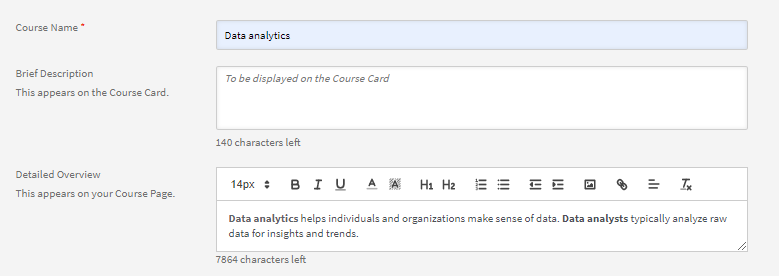
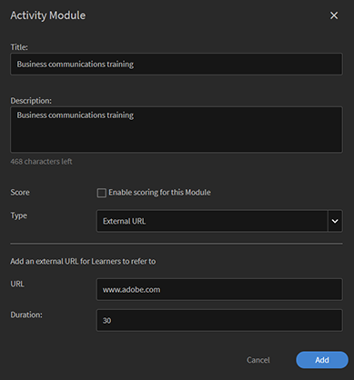
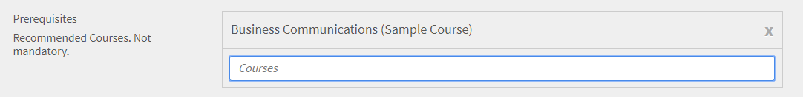
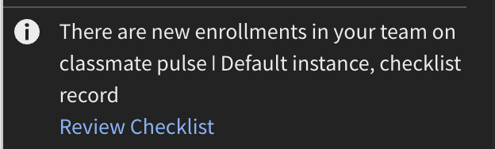
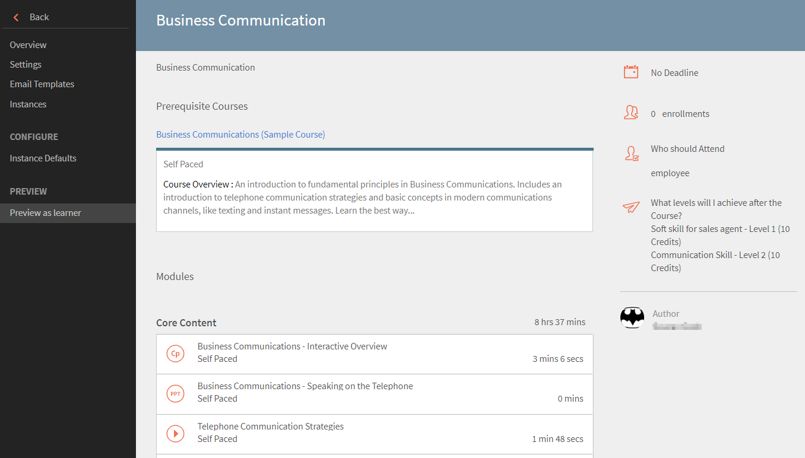
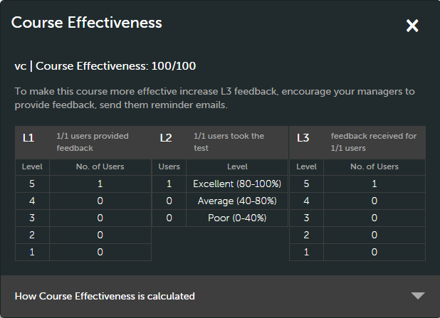
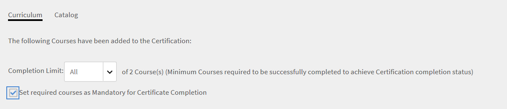
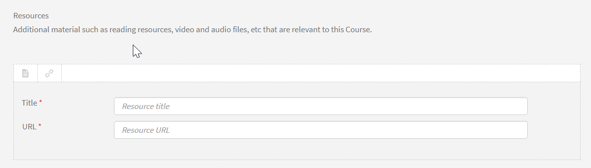

# Cursussen maken, aanpassen en publiceren

Lees dit artikel om te leren hoe u cursussen, certificeringen en leerprogramma&#39;s maakt in Learning Manager.

Auteurs kunnen leerobjecten zoals cursussen, certificeringen en leerplannen maken. Studenten kunnen deze leerobjecten gebruiken, terwijl beheerders de prestaties van de leerlingen kunnen volgen.

## Cursussen in Learning Manager {#coursesincaptivateprime}

Met behulp van Adobe Learning Manager kunnen auteurs cursussen met meerdere modules maken voor virtuele training, training op eigen tempo, klassikale training en activiteiten. Beheerders kunnen deze cursussen verder gebruiken om cursusinstanties te maken, studenten in te schrijven, badges toe te wijzen en feedback voor deze cursussen in te schakelen. Ze kunnen ook leerprogramma&#39;s, leerplannen en certificeringen maken met behulp van deze cursussen.

Auteurs kunnen e-learninginhoud gebruiken die met een eLearning-tool is gemaakt. Andere ondersteunde cursusindelingen zijn videobestanden, pdf, docx en ppt en pptx.

## Een cursus maken - Basisworkflow {#createacoursebasicworkflow}

Volg de onderstaande stappen om een cursus te maken:

1. Meld u als auteur aan bij Adobe Learning Manager, want alleen auteurs hebben de rechten om cursussen te maken. Klik nu op de pagina Aan de slag op **[!UICONTROL Cursussen maken]**.
1. Voer op de pagina **Cursusoverzicht** de naam van de cursus in. Voer nu een korte beschrijving voor de cursus in. Deze wordt weergegeven op de curcuskaart. Deze beschrijving mag niet langer zijn dan 140 tekens. Voer vervolgens het gedetailleerde overzicht voor de cursus in. Dit wordt op de pagina Cursusdetails weergegeven. De beschrijving mag niet langer zijn dan 1500 tekens.

   Als auteur ziet u de beschrijving van de modules terwijl u een module aan de cursus toevoegt.

1. Klik op Nieuwe taal toevoegen in de linkerbovenhoek van de pagina om uw cursus in andere talen beschikbaar te maken. Selecteer de taal of talen waarin u uw cursus beschikbaar wilt stellen. Klik op **[!UICONTROL Opslaan]**. Zie [Inhoud voor andere talen toevoegen](/help/migrated/authors/feature-summary/content-library.md) voor meer informatie.
1. **Cursusinstellingen aanpassen**

   1. Kies op de pagina Cursusinstellingen een vaardigheid voor de cursus. Kies de gewenste vaardigheid in de vervolgkeuzelijst Vaardigheid. Kies dan het gewenste niveau in de vervolgkeuzelijst Niveau.
   1. Kies de cursusvaardigheden en stel het niveau en de punten voor de vaardigheid in. Voeg indien nodig meer vaardigheden toe.
   1. Kies het type inschrijving in de vervolgkeuzelijst **Inschrijvingstype**.

   U kunt kiezen uit de volgende typen:

   * **Manager-aangewezen:** alleen managers kunnen deze cursussen aanwijzen. Een student kan zich niet voor dit soort cursussen inschrijven.
   * **Goedgekeurd door manager:** managers keuren deze cursussen goed. Studenten kunnen zich inschrijven voor deze cursussen, maar ze worden niet rechtstreeks ingeschreven voor dit soort cursussen zonder toestemming van de manager. Managers ontvangen een meldingsaanvraag wanneer studenten zich voor dit soort cursussen inschrijven. Heeft de manager goedkeuring gegeven, dan worden deze cursussen weergegeven als cursussen waarvoor de studenten zijn ingeschreven.
   * **Zelfingeschreven:** studenten kunnen zichzelf rechtstreeks voor dit soort cursussen inschrijven.

1. Klik op **[!UICONTROL Opslaan]** om de wijzigingen op te slaan. Klik op **[!UICONTROL Publiceren]** om de cursus te publiceren.

## Een cursus maken - Geavanceerde workflow {#createacourseadvancedworkflow}

1. Meld u als auteur aan bij Adobe Learning Manager, want alleen auteurs hebben de rechten om cursussen te maken. Klik nu op de pagina Aan de slag op **[!UICONTROL Cursussen maken]**.
1. Voer op de pagina **Cursusoverzicht** de naam van de cursus in. Voer nu een korte beschrijving voor de cursus in. Deze wordt weergegeven op de curcuskaart. Deze beschrijving mag niet langer zijn dan 140 tekens. Voer vervolgens het gedetailleerde overzicht voor de cursus in. Dit wordt op de pagina Cursusdetails weergegeven. De beschrijving mag niet langer zijn dan 1500 tekens.
1. Klik op Nieuwe taal toevoegen in de linkerbovenhoek van de pagina om uw cursus in andere talen beschikbaar te maken. Selecteer de taal of talen waarin u uw cursus beschikbaar wilt stellen. Klik op **[!UICONTROL Opslaan]**. Zie [Inhoud voor andere talen toevoegen](/help/migrated/authors/feature-summary/content-library.md) voor meer informatie.
1. **Cursusinstellingen aanpassen**

   1. Kies op de pagina Cursusinstellingen een vaardigheid voor de cursus. Kies de gewenste vaardigheid in de vervolgkeuzelijst Vaardigheid. Kies dan het gewenste niveau in de vervolgkeuzelijst Niveau.
   1. Kies de cursusvaardigheden en stel het niveau en de punten voor de vaardigheid in. Voeg indien nodig meer vaardigheden toe.
   1. Voeg zo nodig de aangepaste compatibiliteitslabels toe aan de cursus. Zie [Compatibiliteitslabels toevoegen aan een cursus/leerpad/certificering](/help/migrated/authors/feature-summary/courses.md#add-compliance-labels-to-courselearning-pathcertification).
   1. Kies het type inschrijving in de vervolgkeuzelijst **Inschrijvingstype**.

   U kunt kiezen uit de volgende typen:

   * **Manager-aangewezen:** alleen managers kunnen deze cursussen aanwijzen. Een student kan zich niet voor dit soort cursussen inschrijven.
   * **Goedgekeurd door manager:** managers keuren deze cursussen goed. Studenten kunnen zich inschrijven voor deze cursussen, maar ze worden niet rechtstreeks ingeschreven voor dit soort cursussen zonder toestemming van de manager. Managers ontvangen een meldingsaanvraag wanneer studenten zich voor dit soort cursussen inschrijven. Heeft de manager goedkeuring gegeven, dan worden deze cursussen weergegeven als cursussen waarvoor de studenten zijn ingeschreven.
   * **Zelfingeschreven:** studenten kunnen zichzelf rechtstreeks voor dit soort cursussen inschrijven.

1. Kies of u een prijs wilt instellen voor uw cursus of hem gratis wilt maken. Als u wilt dat het een betaalde cursus is, kies dan voor de optie **[!UICONTROL Betaald]** en specificeer een prijs. De prijs wordt dan weergegeven op de cursuskaart en op de pagina Met het cursusoverzicht voor een leerling.

   OPMERKING: Dit is alleen ingeschakeld wanneer Adobe Commerce Connector is geconfigureerd.

1. Schakel het selectievakje **Studenten kunnen zichzelf uitschrijven** in als u studenten de mogelijkheid wilt geven zich van uw cursus uit te schrijven.

1. **Configuratie van instanties**

   Als u deze optie inschakelt, kunnen studenten met een status in uitvoering andere instanties bekijken en zich daar inschrijven. Een student kan vervolgens de voortgang van de vorige instantie behouden.

   Als u na de publicatie van de cursus terugkeert naar de pagina Instellingen, kunt u de optie niet langer bewerken.

   U kunt de optie inschakelen voor de volgende cursustypen:

   * Op eigen tempo
   * Klaslokaal
   * Activiteit
   * Gemengd

   Opmerking: als u tijdens het dupliceren van een cursus de optie Instantieconfiguratie hebt ingeschakeld in de broncursus, blijft de optie uitgeschakeld in de doelcursus.

   **Instantieschakelaar wordt niet ondersteund voor**:

   * Betaalde cursussen
   * Door manager aangewezen inschrijvingscursussen.

   De configuratie van Schakelen van instantie wordt niet doorgegeven aan collega-accounts als deze wordt gedeeld via de catalogus, de optie blijft uitgeschakeld in de doelcursus.

1. **Meerdere inschrijvingen**

   Hiermee kun je studenten in meer dan één cursus in één of verschillende periodes inschrijven.

   Schakel de schakelknop **Meerdere inschrijvingen** in om te schakelen tussen de verschillende cursusinschrijvingen van een leerling. Als u Schakelen van instantie hebt ingeschakeld, kunt u Meerdere inschrijvingen niet gebruiken.

1. Selecteer de vereiste cursussen die moeten worden voltooid voordat uw cursus wordt gestart. Klik op het veld Cursussen en maak een keuze uit de lijst met cursussen.
1. Schakel het **selectievakje Vereiste** inschakelen **** in als u de vereiste cursussen verplicht wilt maken.
1. Voeg trefwoorden toe als tags voor uw cursus. Met deze tags kunnen de studenten uw cursus gemakkelijk vinden. Al deze tags worden automatisch toegevoegd op basis van de modules die we hebben toegevoegd. Als u andere tags heeft die u aan deze cursus wilt toevoegen, kunt u dit doen.
1. Voeg trefwoorden toe als tags voor uw cursus. Met deze tags kunnen de studenten uw cursus gemakkelijk vinden. Al deze tags worden automatisch toegevoegd op basis van de modules die we hebben toegevoegd. Als u andere tags heeft die u aan deze cursus wilt toevoegen, kunt u dit doen.
1. Selecteer in het veld Automatisch uittreden een datum waarop de cursus wordt beëindigd. De beheerder moet eerst de optie Automatisch archiveren inschakelen.
1. Klik op **[!UICONTROL Opslaan]** om de wijzigingen op te slaan. Klik op **[!UICONTROL Publiceren]** om de cursus te publiceren.

### Compatibiliteitslabels toevoegen aan cursus/leerpad/certificering {#add-custom-compliance-label}

Ga als volgt te werk om compatibiliteitslabels toe te voegen aan cursussen:

1. Ga in de auteursapp naar Cursussen/Leerpaden ]**/**[!UICONTROL  Certificeringen ]**en selecteer**[!UICONTROL  Toevoegen ]**.******[!UICONTROL 
1. Typ de naam en andere gegevens, zoals een beschrijving, vaardigheden.
1. Typ het label voor compatibiliteit en selecteer het **[!UICONTROL in het tekstvak Aangepaste compatibiliteit]** .

   
   _Aangepaste compatibiliteit toevoegen_

   >[!IMPORTANT]
   >
   >Zorg ervoor dat u een deadline voor de cursus instelt wanneer u aangepaste naleving toevoegt.

1. Sla de cursus/het leerpad/certificering op en publiceer deze.
Nu wordt de cursus/het leerpad/certificering beschouwd als een compatibiliteitstype. Beheerders kunnen deze cursus toevoegen aan het nalevingsdashboard en deze delen met managers om de voortgang te volgen

>[!NOTE]
>
>Auteurs kunnen de compatibiliteitslabels ook toevoegen aan een bestaande cursus, leerpad of certificering door deze te bewerken.

## Gamification-punten

U kunt gamification-punten toewijzen op cursus- en cursusinstantieniveau. Hiermee kunt u punten toewijzen aan verschillende cursussen en instanties. Studenten worden gestimuleerd om specifieke cursussen te volgen of een bepaalde cursusexemplaren te verkiezen boven andere.

1. Selecteer **[!UICONTROL Gamification-punten]** op cursusinstantieniveau.


*Punten instellen voor gamification*

1. Selecteer **[!UICONTROL Bewerken]**.
1. Als je Instellingen voor cursusniveau gebruiken selecteert, worden de volgende opties weergegeven:

   * **[!UICONTROL Na voltooiing]**: selecteer deze schakelknop als u wilt dat de student 100 punten krijgt wanneer deze een cursus heeft voltooid.
   * **Meer regels**

      * **[!UICONTROL Snelle voltooiing]**: als u dit selecteert, krijgen de eerste 30 studenten 100 punten wanneer zij een cursus voltooien.
      * **[!UICONTROL Tijdige voltooiing]**: als u dit selecteert, krijgen studenten 100 punten als ze een cursus binnen 999 dagen voltooien.

1. Als u **[!UICONTROL Aangepaste instellingen gebruiken]** selecteert, worden de volgende opties weergegeven:

   * **[!UICONTROL Na voltooiing]**: selecteer deze schakeloptie als u wilt dat de student 100 punten krijgt wanneer deze een cursus heeft voltooid.
   * **Meer regels**

      * **[!UICONTROL Snelle voltooiing]**: als u deze optie selecteert, kunt u bepalen hoeveel studenten specifieke punten krijgen toegewezen.
      * **[!UICONTROL Tijdige voltooiing]**: als u deze optie selecteert, kunt u bepalen hoeveel punten studenten krijgen als ze binnen een bepaalde tijd een cursus voltooien.

   

   *Vroege en tijdige voltooiing instellen*

1. Selecteer **[!UICONTROL Opslaan]**.

## Leermiddelen samenvoegen

Een auteur kan bepalen of ze de leermiddelen op het niveau van leerplannen willen samenvoegen of een afzonderlijk cursusniveau willen behouden.

Selecteer **[!UICONTROL leerpad]** > **[!UICONTROL instellingen]** als auteur. Klik op **[!UICONTROL Bewerken]**.

Als deze **[!UICONTROL optie is ingeschakeld, wordt weergegeven of de op cursusniveau aanwezige bronnen op cursuspadniveau worden weergegeven in de sectie Bronnen]** . Wanneer deze optie is ingeschakeld, wordt aangegeven of de op cursusniveau aanwezige bronnen worden weergegeven op het niveau van het leerpad.

>[!NOTE]
>
>Op de pagina Instellingen van een leerpad kan een beheerder deze optie ook inschakelen, zodat bronnen worden weergegeven op het cursusniveau dat op het niveau van het leerpad wordt weergegeven.

## Planningsassistent

Beheer conflicten bij het boeken van docenten en klaslokalen. Als je wilt weten op welk tijdstip en wanneer een instructeur beschikbaar is voordat hij of zij toewijst aan de cursus, gebruik je de Planningsassistent.

Klik tijdens het maken van een cursus voor een VC- of CR-cursus op Planassistent.


*Start planningsassistent*

Het venster Planningsassistent wordt gestart.


*Het dialoogvenster Planningsassistent*

In de Planningsassistent kunt u:

* Docenten zoeken op naam.
* Docenten zoeken op basis van hun vaardigheden.

### Docenten zoeken op naam

Typ in het veld Docent de naam van de docent of zoek naar een gedeeltelijke docentnaam. Er verschijnt een lijst met docenten waaruit u een docent kunt kiezen.


*Cursusleiders zoeken*

Er kunnen meerdere docenten worden geselecteerd, maar er kan slechts één docent per keer worden toegewezen. De geselecteerde tijd wordt gemarkeerd in het venster tijdconflict. In de buurt van de cursusleider wordt een kruisje weergegeven. U klikt hierop om de cursusleider te verwijderen.


*Meerdere cursusleiders zoeken*

### Docenten zoeken op vaardigheden

Zoek naar een docent met één of meerdere vaardigheden. De zoekopdracht gebruikt de operator AND.

Vaardigheden kunnen alleen worden gezocht op gedeeltelijke of volledige vaardigheidsnaam, niet op vaardigheidsniveau.

Voer op de Assistent de naam van de docent, locatie en plaatslimiet in.

Je kunt ook zoeken naar een functie die wordt weergegeven nadat je op het filterpictogram aan de rechterkant van het zoekvak voor cursusleider hebt geklikt. In de onderstaande schermafbeelding wordt de knop weergegeven.


*Docenten zoeken op vaardigheden*

### Gebruikersgroepfilter

Selecteer het filter in het veld Cursusleider. Er is een **[!UICONTROL Gebruikersgroepfilter]** waarmee een auteur of aangepaste auteur de juiste docent kan vinden aan de hand van de waarden in de Gebruikersgroep.

Als beide filters worden toegepast, wordt een lijst met docenten weergegeven die tot de gebruikersgroep behoren en de geselecteerde vaardigheden hebben.

Dit is van toepassing op De Planningsassistent op de pagina Cursussen of Instanties.


*Filteren op gebruikersgroepen*

### Instantiepagina

U kunt de Planningsassistent ook openen vanaf de pagina Instantie, zoals hieronder wordt weergegeven.

De Planningsassistent is ook beschikbaar op de instantiepagina, voor beheerders en een aangepaste beheerder/auteur.


*Cursusleiders plannen vanaf de instantiespagina*

### Een locatie zoeken

U kunt naar een locatie zoeken door zowel de naam van het klaslokaal als het locatiegebied op te geven op zowel de pagina&#39;s module als planningsassistent.

## Tekst met opmaak

Tijdens het maken van een cursus, leerprogramma, certificering of taakhulp kunnen auteurs verschillende typen inhoud invoegen zoals tekst, afbeeldingen, of diverse opties voor tekstopmaak toepassen.

Wanneer u een cursus maakt, ziet u de Rich Text Editor in het veld Cursusoverzicht. U kunt uw inhoud opmaken, afbeeldingen toevoegen, hyperlinks toevoegen, enzovoort.



*De Rich Text Editor starten*

U kunt de RTF-editor ook gebruiken om een beschrijving te wijzigen bij het maken van een:

**Leerprogramma**


*Rich Text Editor gebruiken voor een leerprogramma*

**Certificering**


*Rich Text Editor gebruiken voor een certificering*

**Taakhulp**


*De Rich Text Editor gebruiken voor banenhulp*

Daarnaast kunt u de RTF-editor voor andere talen gebruiken.

## Ondersteuning van beschrijvingen in RTF-tekst voor headless gebruikersinterface

### Waarom is CSS vereist?

RTF-tekst bestaat uit HTML-opmaak. Als de opmaak wordt weergegeven zonder wijzigingen, past de browser de standaardstijl toe. Dit past vaak niet goed bij de stijlrichtlijnen van het bedrijf. Een CSS is dus vereist om te voldoen aan de richtlijnen.

### Standaardstijl

Het bijgevoegde CSS-opmaakmodel bevat de stijl die wordt toegepast door Learning Manager. De stijl is geoptimaliseerd met het oog op de meeste gebruiksgevallen. Download het bijgevoegde CSS-bestand en importeer het in uw web-app volgens uw conventies en systeem. De gedefinieerde CSS-klassen zijn naamruimtes onder de ql-editor-klasse en ze interfereren niet met uw bestaande stijlen.

### Stijl aanpassen

De standaardstijl werkt misschien niet voor iedereen. De stijl kan worden aangepast door de geleverde CSS te overschrijven. De stijlvormgeving staat in de wrapper onder ql-editor als afhankelijke opties. De volgende klassen worden gebruikt:

* Inspringen: **li.ql-indent-$number**. $nummer varieert van 1-9
* grootte: **ql-size-small**, **ql-size-large**, **ql-size-huge**

* uitlijning: **ql-align-center**, **ql-align-justify**, **ql-align-right**

* kleur: **ql-color-$color**. $kleur = white (wit), red (rood), orange (oranje), yellow (geel), green (groen), blue (blauw), purple (paars)
* achtergrond: **ql-bg-$color**. $kleur = black (zwart), red (rood), orange (oranje), yellow (geel), green (groen), blue (blauw), purple (paars)
* html-tags: p, ol, ul, pre, blockquote, h1, h2, h3, h4, h5, h6

[Voor aanpassing te gebruiken CSS-bestand.](assets/ql-headless.css)

### API-WIJZIGINGEN OM DE WEERGAVE VAN OVERZICHTEN MET TEKST MET OPMAAK IN TE SCHAKELEN

Wanneer klanten een headless-interface bouwen, moeten ze de leerobjecten weergeven in de aangepaste gebruikersinterface die ze ontwikkelen. Hiervoor zou doorgaans de API [GET /learningObjects](https://learningmanagereu.adobe.com/docs/primeapi/v2/#!/learning_object/get_learningObjects) die wordt weergegeven, gebruikt moeten worden. Nu Learning Manager het vastleggen van &#39;rich text&#39; voor het overzichtsveld ondersteunt, wordt dit ook zichtbaar in het gegevensmodel van Learning Objects in de API-reacties. Zie het veld &#39;richTextOverview&#39; in de fragment van het model in de API-respons hieronder. Houd er ook rekening mee dat het veld dat eerder is weergegeven (&quot;overzicht&quot;) ongewijzigd blijft voor achterwaartse compatibiliteit.

```
{ 
 "data": [ 
 { 
 "id": "string", 
 "type": "string", 
 "attributes": { 
 … 
 "localizedMetadata": [ 
 { 
 "description": "string", 
 "locale": "string", 
 "name": "string", 
 "overview": "string", 
 "richTextOverview": "string" 
 } 
 ], 
 … 
 }, 
 "relationships": { 
 … 
 } 
 } 
 } 
 ] 
} 
```

Klanten die het veld Overzicht al gebruiken, zien geen wijzigingen in hun headless-interface en zien zoals voorheen tekst zonder opmaak. Als klanten van het overzicht met tekst met opmaak willen gebruikmaken, zullen ze overzichten met tekst met opmaak voor hun leerobjecten moeten maken in de gebruikersinterface van de auteur en daarna zal Adobe Learning Manager ook het overzicht met tekst met opmaak retourneren, naast de tekst zonder opmaak (zoals voorheen) in het API-responsmodel.

Om deze tekst met opmaak in hun gebruikersinterface weer te geven, moet de klant echter een CSS opnemen. Dit wordt in de volgende gedeelten in detail uitgelegd.

## Meerdere pogingen toestaan {#allowmultipleattempts}

Heeft de beheerder meerdere pogingen ingeschakeld, dan kunt u als auteur meerdere pogingen configureren voor een interactieve e-learningmodule op cursus- of moduleniveau.


*Meerdere pogingen configureren voor een interactieve e-learningmodule*

<table>
 <tbody>
  <tr>
   <td>
    <p><b>Optie</b></p></td>
   <td>
    <p><b>Beschrijving</b></p></td>
  </tr>
  <tr>
   <td>
    <p>Pogingen instellen op</p></td>
   <td>
    <p>U kunt het aantal pogingen voor een module op oneindig instellen of een bepaalde limiet opgeven.<span style="font-size: 0.8125rem;">De student ziet de informatie over pogingen nadat deze optie is ingeschakeld. De leerling kan ervoor kiezen de module opnieuw te negeren door op de knop 'Opnieuwtempt' te klikken.</span></p></td>
  </tr>
  <tr>
   <td>
    <p>Nieuwe poging stoppen wanneer module is voltooid of behaald</p></td>
   <td>
    <p>Als u wilt configureren wanneer studenten de nieuwe poging niet moeten selecteren, schakelt u het selectievakje Nieuwe poging stoppen als module is voltooid of doorgegeven in. De optie 'Opnieuwtempt' wordt verwijderd uit de weergave van de leerling zodra deze de module heeft voltooid.</p></td>
  </tr>
  <tr>
   <td>
    <p>Vergrendel module tussen pogingen 0:0:1 Formaat: Dagen / Uur / Minuten</p></td>
   <td>
    <p>U kunt de modules voor een bepaalde tijd tussen pogingen vergrendelen door het selectievakje "<b>Module vergrendelen tussen pogingen 0:0:1 Formaat: Dagen/Uur/Minuten</b>" in te schakelen. Wanneer een module is vergrendeld, kan de leerling de module pas bezoeken als de vergrendelingstijd is verstreken. </p>
    <p>u kunt de eindcriteria van een poging definiëren door de selectievakjes '<b>Player sluiten</b>' of '<b>Voltooiing</b>' in te stellen.</p></td>
  </tr>
  <tr>
   <td>
    <p>Speler sluiten</p></td>
   <td>
    <p>Telkens wanneer een module wordt gestart, wordt dit beschouwd als een nieuwe poging als <b>Speler sluiten</b> als criterium is geselecteerd. De student krijgt prompts met details over modulevergrendeling en pogingen wanneer deze de speler sluit.</p></td>
  </tr>
  <tr>
   <td>
    <p>Voltooiing</p></td>
   <td>
    <p>Als het einde van een poging is gebaseerd op <b>Voltooiing</b>, wordt dit berekend op basis van de succescriteria voor de inhoud. Studenten mogen de module pas opnieuw proberen nadat de voltooiingsgegevens vanuit de inhoud zijn verstuurd. De details van modulevergrendelingen en pogingen worden na afloop van een poging aan de student doorgegeven.</p></td>
  </tr>
  <tr>
   <td>
    <p>Tijdslimiet instellen om module te voltooien</p></td>
   <td>
    <p>Auteurs kunnen een tijdslimiet instellen voor het voltooien van een module door het selectievakje '<b>Tijdslimiet voor voltooien van module</b> instellen' in te schakelen.</p>
    <p>Telkens wanneer de speler wordt gestart, wordt dit beschouwd als een nieuwe poging en tijdens het opstarten ziet de student de tijddetails.</p>
    <p><b>Opmerking:</b><span style="font-size: 0.8125rem;">De poging wordt automatisch beëindigd zodra de tijd is verstreken. De huidige poging wordt ook beëindigd wanneer de speler wordt gesloten.</span></p></td>
  </tr>
  <tr>
   <td>
    <p>Meerdere pogingen op moduleniveau</p></td>
   <td>
    <p>Wanneer u een poging op Moduleniveau selecteert in de vervolgkeuzelijst Pogingslimiet instellen op, kunt u de opties op het niveau van de afzonderlijke modules configureren.</p></td>
  </tr>
 </tbody>
</table>

## Cursusmodules {#coursemodules}

### Modules toevoegen {#addmodules}

U kunt nu de modules Inhoud, Voorbereidend werk en Test toevoegen. **Inhouds**-modules zijn de belangrijkste modules waaruit de cursus bestaat. **Voorbereidend werk**-modules bevatten enige basisinformatie waarmee leerlingen zich op de cursus kunnen voorbereiden. De leerlingen zijn niet verplicht deze modules te voltooien. **Test**-modules helpen leerlingen om de inhoud over te slaan en de test te doen als ze al op de hoogte zijn van de inhoud en de test willen doen om aan de nalevingsvereiste te voldoen.

Voer de onderstaande stappen uit om een inhoudsmodule toe te voegen:

1. Klik op **[!UICONTROL Modules toevoegen]**. U ziet vier opties om modules toe te voegen. De eerste optie is voor het toevoegen van modules op eigen tempo. Dit zijn de modules die u maakt en aan de modulebibliotheek van Adobe Learning Manager toevoegt. De tweede optie is voor het instellen van een virtueel klaslokaal. De derde optie is voor het opzetten van een klassikale module en de vierde is voor de activiteitenmodule.

   

   *Een module toevoegen voor een cursus*

   **Module op eigen tempo:** in deze modus kunt u een cursusmodule op uw eigen tempo starten en voltooien. U kunt uw eigen schema maken.

   Nadat u op de optie hebt geklikt, ziet u de lijst met modules op eigen tempo die al aan uw modulebibliotheek zijn toegevoegd. U kunt hier door de lijst scrollen en de modules selecteren die u wilt toevoegen. U kunt ook naar de modules zoeken door de naam van de module in het zoekveld of de moduletags in te voeren.

   Klik op **[!UICONTROL Toevoegen]** nadat u de modules hebt geselecteerd. Deze modules verschijnen nu onder de sectie Inhoud.

   U kunt de modules ook opnieuw indelen. Sleep een willekeurige module omhoog of omlaag om de modules in de gewenste volgorde te zetten.

   **Virtuele klassikale module:** in deze modus kunnen leerlingen live online lezingen bijwonen, die door een getrainde docent worden gegeven. Voer de titel en beschrijving in en stel de duur van de sessie in. U kunt ook de conferentie-URL opgeven, evenals de instructeurs die de sessie moeten leiden. Klik op **[!UICONTROL Gereed]** om de wijzigingen op te slaan.

   

   *Een VC-module toevoegen*

   Stel bij het aanmaken van een cursus met behulp van het dialoogvenster virtuele lesruimte het **Conferentiesysteem** in op de Teams-verbinding die u hebt aangemaakt. Kies of u wel of niet een organisator voor de vergadering voor dit evenement wilt.

   Als u Ja **voor een vergaderingsorganisator selecteert**, moet u de naam van de organisator invoeren. Typ de naam en selecteer de organisator.

   **Lobby omzeilen**

   * Als u **Ja** kiest, kan elke student de vergadering bijwonen.
   * Als u **Nee** kiest, wordt er een verzoek naar de organisator verzonden om de student wel of niet toe te staan de vergadering bij te wonen.

   **Opmerking:** een student moet beschikbaar zijn op Microsoft Teams. Maar de student kan zich bij Learning Manager aanmelden als gast.

   **Klassikale module:** in deze modus zijn studenten in persoon aanwezig bij lezingen, die door een getrainde docent worden gegeven. Voer de titel en beschrijving in en stel de duur van de sessie in. U kunt ook de locatie van de klas opgeven, evenals de instructeurs die de sessie moeten leiden. Klik op **[!UICONTROL Gereed]** om de wijzigingen op te slaan.

   

   *Een klaslokaalmodule toevoegen*

   Wanneer u een cursus maakt, moet u in het configuratiedialoogvenster voor virtual classroom het conferentiesysteem instellen op de Microsoft Teams-verbinding die u hebt gemaakt. Kies of u wel of niet een organisator voor de vergadering voor dit evenement wilt.

   Als u Ja voor een vergaderingsorganisator selecteert, moet u de naam van de organisator invoeren. Typ de naam van de organisator en selecteer de organisator.

   **Lobby omzeilen**

   * Als u Ja selecteert, kan iedere leerling deelnemen aan de vergadering.
   * Als u Nee selecteert, wordt een verzoek naar de organizer verzonden om de leerling toe te staan of te voorkomen dat hij of zij deelneemt aan de vergadering.

   **Opmerking:** als een leerling als gast lid wil worden van Microsoft Teams, moet hij of zij het e-mailadres invoeren. Het e-mailadres moet aanwezig zijn in Learning Manager.

   **Activiteitenmodule:** in deze modus moeten studenten een set activiteiten zoals workshops, oefeningen, vragenlijsten en andere leeractiviteiten voltooien. Voer de titel, beschrijving en de externe URL voor referentie in. Klik op **[!UICONTROL Gereed]** om de wijzigingen op te slaan.

   

   *Een activiteitsmodule toevoegen*

   U kunt de duur opgeven terwijl u een activiteitsmodule in een cursus toevoegt voor het type Bestandsindiening en op xAPI gebaseerde modules.

1. Voeg op dezelfde manier modules toe voor de modi Voorbereidend werk en Test.
1. Kies Op volgorde of Niet op volgorde om dit voor de modules in te stellen.

   Als u **Op volgorde** kiest, verschijnen de modules in de volgorde waarin u ze hebt gemaakt. Kiest u **Niet op volgorde**, dan worden de modules niet op volgorde gezet. Studenten kunnen de modules in elke gewenste volgorde voltooien.

1. Kies in de vervolgkeuzelijst Verplichte modules het aantal modules dat de student moet volgen om de cursus te voltooien.
1. Voeg een omslagafbeelding en de bannerafbeelding voor de cursus toe. De catalogi worden door de beheerder gemaakt. Zie [Catalogi](/help/migrated/administrators/feature-summary/catalogs.md) voor meer informatie.

   **Opmerking:** de aanbevolen afmetingen zijn:

   * **Omslagafbeelding:** 300 px x 300 px
   * **Bannerafbeelding:** 1600 x 140 px

1. Klik op **[!UICONTROL Opslaan]** rechtsboven op de pagina.

#### HTML-koppeling toevoegen in de module Activiteit

Auteurs kunnen HTML-koppelingen toevoegen in de module Activiteit en de voltooiingscriteria instellen. Ga als volgt te werk om een HTML-koppeling toe te voegen en een voltooiingscriteria in te stellen:

1. Selecteer **[!UICONTROL in de auteursapp cursussen]** maken op de startpagina.
1. Selecteer **[!UICONTROL Toevoegen in]** het **[!UICONTROL scherm Cursuscatalogus]**
1. Typ de naam en beschrijving van de cursus.
1. Selecteer in de **[!UICONTROL optie Module]** de optie **[!UICONTROL Module]** toevoegen > **[!UICONTROL module]** Activiteit.
1. Typ de naam en beschrijving in de prompt van de **[!UICONTROL module Activity (]** Activiteit).
1. Selecteer het **[!UICONTROL type]** als **[!UICONTROL externe URL]**.
1. Selecteer een van de volgende opties bij de **[!UICONTROL optie Voltooiingscriteria]** .
   * **[!UICONTROL De tekens van de leerling zijn voltooid]**: de leerling heeft de mogelijkheid om de cursus als voltooid te markeren in Fluidic Player.
   * **[!UICONTROL Bij het starten van inhoud]**: de cursus wordt automatisch als voltooid gemarkeerd wanneer de leerling deze start.

   
   _Voltooiingscriteria_

1. Selecteer **[!UICONTROL De cursus toevoegen]** en publiceren.

## Controlelijst {#create-checklist}

Evaluatie is een belangrijk aspect van elk LMS. Online beoordelingen zijn een van de belangrijkste manieren om het begrip van een onderwerp te evalueren. Maar vaak is het noodzakelijk om het begrip van een persoon te evalueren terwijl hij/zij aan het werk is door te zien hoe hij/zij de benodigde taken uitvoert.

Denk maar eens aan winkel- of magazijnmedewerkers die een evaluatie ondergaan voor de taken die ze dagelijks moeten uitvoeren. Dit kunnen de stappen zijn die worden uitgevoerd voor het repareren van een koffiemachine, of de stappen voor het inpakken van materiaal. Docenten kunnen medewerkers op dergelijke taken beoordelen op basis van een controlelijst en hen de beoordeling &#39;Geslaagd&#39; of &#39;Gezakt&#39; geven in de evaluatieactiviteit.

### Een controlelijst maken {#createachecklist}

Alleen een auteur kan een controlelijst maken. Een controlelijst is een type activiteitenmodule. Tijdens het instellen van een activiteitsmodule kunt u, een auteur, een activiteit selecteren als **controlelijst**, zoals hieronder wordt getoond:


*Een controlelijst maken*

Nadat u de optie **Controlelijst** hebt gekozen, ziet u een paar extra opties.

**Type controlelijst:** kies een optie, **Ja/Nee** of **1-5**. Kiest u voor Ja/Nee, dan bevat de controlelijst vragen die alleen met Ja of Nee kunnen worden beantwoord. Kiest u voor 1-5, dan ziet u een Likert-controlelijst. U kunt dan een vraag beoordelen op een vijfpuntsschaal.

**Slagingscriteria:**

<table>
 <tbody>
  <tr>
   <td>
    <p>Als u had gekozen voor <b>Ja/Nee</b>, dan ...</p></td>
   <td>
    <p>Als u had gekozen voor <b>1-5</b>, dan ...</p></td>
  </tr>
  <tr>
   <td>
    <p>Stel de slagingscriteria in als het aantal antwoorden als Ja. Als u bijvoorbeeld 3 invoert, slaagt de student voor de cursus als hij/zij ten minste drie <b>Ja</b>-antwoorden ontvangt, wanneer hij/zij wordt beoordeeld door een docent.</p></td>
   <td>
    <p>Stel de slagingscriteria in als een drempel van een willekeurig getal tussen 1-5. Als u bijvoorbeeld 2 en 4 invoert, slaagt de student voor de cursus als hij/zij ten minste <b>twee </b>beoordelingen behaalt met een score groter dan of gelijk aan <b>vier</b>.</p></td>
  </tr>
 </tbody>
</table>

Kies een docent of docenten die de student gaan evalueren.

En als u iets voor opmerkingen of een notitie hebt, kunt u dat toevoegen in het **tekstveld Notitie naar cursusleider** .

Voeg nu de controlelijstvragen toe. Klik op **[!UICONTROL Toevoegen]**. U kunt maximaal 150 vragen toevoegen.


*Vragen over toevoegen van controlelijst*

Klik op **[!UICONTROL Meer toevoegen]** om meer vragen toe te voegen.

Sla de wijzigingen op, voeg de module toe en publiceer de cursus.

### Vaardigheden toevoegen {#addskills}

Voer op deze pagina de volgende gegevens in:

1. Kies de cursusvaardigheden en stel het niveau en de punten voor de vaardigheid in. Voeg indien nodig meer vaardigheden toe.

   

   *Vaardigheden toevoegen voor een cursus*

1. Kies het type inschrijving. Dit zijn de opties:

   * **Manager-aangewezen:** alleen managers kunnen deze cursussen aanwijzen. Een student kan zich niet voor dit soort cursussen inschrijven.
   * **Goedgekeurd door manager:** managers keuren deze cursussen goed. Studenten kunnen zich inschrijven voor deze cursussen, maar ze worden niet rechtstreeks ingeschreven voor dit soort cursussen zonder toestemming van de manager. Managers ontvangen een meldingsaanvraag wanneer studenten zich voor dit soort cursussen inschrijven. Heeft de manager goedkeuring gegeven, dan worden deze cursussen weergegeven als cursussen waarvoor de studenten zijn ingeschreven.
   * **Zelfingeschreven:** studenten kunnen zichzelf rechtstreeks voor dit soort cursussen inschrijven.

1. Schakel het selectievakje **Studenten kunnen zichzelf uitschrijven** in als u studenten de mogelijkheid wilt geven zich van uw cursus uit te schrijven.
1. Selecteer de vereiste cursussen die moeten worden voltooid voordat uw cursus wordt gestart. Klik op het veld Cursussen en maak een keuze uit de lijst met cursussen.

   

   *Vooraf vereiste cursussen toevoegen*

1. Schakel het selectievakje **Vereisten** in als u wilt dat de vereiste cursussen verplicht worden gesteld.
1. Voeg trefwoorden toe als tags voor uw cursus. Met deze tags kunnen de studenten uw cursus gemakkelijk vinden. Al deze tags worden automatisch toegevoegd op basis van de modules die we hebben toegevoegd. Als u andere tags heeft die u aan deze cursus wilt toevoegen, kunt u dit doen.
1. Klik op het tekstgebied en kies de profielen uit de suggesties om de profielen van uw doelgroep voor deze cursus toe te voegen.
1. Voeg leermiddelbestanden voor uw cursus toe als extra materiaal. Sleep uw materiaal zoals tekst, of video- of audiobestanden.
1. Deze cursus is nu beschikbaar voor de studenten met deze profielen als aanbevolen cursus. U kunt in deze sectie ook extra leermiddelen voor uw leerlingen toevoegen. Studenten kunnen deze bestanden downloaden voor later gebruik. Nadat u al deze wijzigingen hebt doorgevoerd, klikt u op **[!UICONTROL Opslaan]** in de rechterbovenhoek. Uw cursus wordt dan als concept opgeslagen. Uw cursus wordt standaard als concept opgeslagen.

## Docenten aan modules toewijzen {#assigninstructorsformodules}

1. Nadat u modules voor uw cursus hebt gemaakt, kunt u docenten aan de modules toewijzen. Klik in het Auteurdashboard op **[!UICONTROL Cursuscatalogus]**.
1. Klik op de cursus die de module bevat waaraan u docenten wilt toewijzen.
1. Klik in de **sectie Modules** toevoegen op de module waaraan u een cursusleider wilt toewijzen.
1. Specificeer in het veld **Docent** de gebruikersnaam van de gebruiker aan wie u de rol van docent wilt toewijzen.

   

   *Een rol van cursusleider toewijzen aan een gebruiker*

1. Klik op **[!UICONTROL Opnieuw publiceren als u de cursus opnieuw wilt publiceren]** met de updates.

## Observatiecontrolelijst

Naast docenten kunnen managers nu ook een Controlelijstmodule beoordelen. Personenmanagers, evenals niet-hiërarchische managers zoals winkelmanagers of locatiemanagers, kunnen de controlelijst bekijken en invullen.

Cursusauteurs kunnen persoonsmanagers en niet-hiërarchische managers (indien van toepassing) als revisoren toevoegen door deze rolopties te selecteren in de sectie Revisoren bij het instellen van een controlelijstmodule. Dit kan worden uitgevoerd op cursusinstantieniveau.


*Revisoren toevoegen in een activiteitsmodule*

Als u de optie &#39;**[!UICONTROL +managers&#39; selecteert]**, kan automatisch de manager van een leerling in de hiërarchie van de organisatie de controlelijst controleren. U hoeft niet afzonderlijk managernamen te zoeken en toe te voegen.

Als uw accountbeheerder niet-hiërarchische managerrollen heeft ingesteld (zoals winkelmanagers of locatiemanagers) met behulp van de optie Actieve velden, kunt u die managerrollen selecteren en deze de mogelijkheid bieden om de controlelijst te beoordelen.

U hoeft niet afzonderlijk managernamen te zoeken en toe te voegen. Wanneer studenten zich inschrijven voor de cursus Controlelijst, stuurt deze automatisch een melding naar hun managers/winkelmanagers voor controle, samen met een geselecteerde docent. In deze workflow is het voor auteurs eenvoudig om de namen van individuele managers niet te vermelden.

Als u in de voorbeeldafbeelding hierboven de optie &quot;**[!UICONTROL +Store Managers]**&quot; selecteert, wordt de niet-hiërarchische manager automatisch ingeschakeld door de leerling om de controlelijst te controleren. Houd er rekening mee dat &#39;opslaan&#39; hier wordt vervangen door het actieve veld dat door de beheerder is gedefinieerd.

Updates aan de controlelijstmodule omvat ook meldingen aan docenten en managers wanneer een student is ingeschreven in een cursus die een controlelijstmodule bevat. De beoordelaar krijgt in het meldingscentrum Learning Manager en op het docent/managerdashboard een melding dat er actie is vereist voor de controlelijst.

<!---->

De beoordelaar kan informatie bekijken over alle in behandeling zijnde beoordelingsitems van de controlelijst in het menu Controlelijsten en in het menu Meldingen wanneer deze inlogt als docent/manager.


*Goedkeuringen voor certificering*

Nadat u op Controlelijst bekijken hebt geklikt, kan de beoordelaar de evaluatie voltooien.


*Revisie-items in behandeling*

Rapportage kan worden gedownload op controlelijsten. Deze bevatten gedetailleerde informatie over evaluatie van studenten, naam, rol en e-mailadres van de beoordelaar.

Het CSV-bestand voor controlelijsten heeft de volgende nieuwe en bijgewerkte velden:

* Naam van beoordelaar in plaats van naam van docent
* E-mail van beoordelaar in plaats van e-mail van docent
* Rol van beoordelaar: mogelijke waarden zijn Manager, winkel-/locatiemanager, docent

## Voorbeeld van een cursus bekijken {#previewacourse}

Nadat de cursus is gemaakt en opgeslagen als concept, kunt u een voorvertoning van de cursus als leerling bekijken. U kunt de cursus vervolgens publiceren om deze beschikbaar te maken in de cursuscatalogus.

Klik op **[!UICONTROL Voorbeeld bekijken als student]** om de cursus vooraf te bekijken.


*Een cursus voorvertonen als een leerling*

Hiermee wordt de pagina **Overzicht** van de cursus geopend met de modules, hun volgorde en andere cursusdetails.



*Modules en andere gerelateerde details weergeven*

Klik op elk van deze modules om deze af te spelen en te zien hoe studenten deze cursus zullen ervaren. Dit begint met het afspelen van de cursus in de Fluidic Player.

## Een cursus publiceren {#publishacourse}

Nadat u een voorbeeld van de cursus als student hebt bekeken, kunt u de cursus publiceren, zodat deze voor studenten beschikbaar wordt. Houd er rekening mee dat de cursus nog in conceptmodus is.

De levenscyclus van een cursus ziet er meestal als volgt uit:

* **Concept** : wanneer een auteur klaar is met het maken en opslaan van een cursus. Een cursus met deze status is nog niet beschikbaar voor studenten.
* **Publiceren** : wanneer een auteur klaar is met het publiceren van een cursus. Studenten kunnen zich op dit punt inschrijven voor een cursus. U kunt de cursus op dit punt bewerken.
* **** Buiten gebruik gesteld: na het publiceren van een cursus kan een auteur de status gepensioneerd maken als de auteur niet wil dat de cursus wordt weergegeven in de cursuscatalogus voor studenten.
* **Verwijderd** : een cursus in de status Verwijderd wordt volledig verwijderd uit de Adobe Learning Manager-toepassing. Alleen auteurs kunnen cursussen verwijderen wanneer ze zich in de status Concept of Buiten gebruik gesteld bevinden.


*Workflow van een cursuslevenscyclus*

Klik op **[!UICONTROL Publiceren]** rechtsboven op de pagina om de cursus die u hebt gemaakt te publiceren.


*Een cursus publiceren*

Klik op **[!UICONTROL OK]** in de bevestigingspop-up die verschijnt.

De cursus is nu beschikbaar in de cursuscatalogus.

## Een cursus weergeven {#viewacourse}

Als auteur kunt u een lijst met alle beschikbare cursussen bekijken. Klik op Cursuscatalogus om alle cursussen in het Learning Manager-account te bekijken. Klik op **[!UICONTROL Mijn cursussen]** om al uw cursussen in uw Learning Manager-account te bekijken.

Zet de muis op de opties op de cursuskaart en klik op **[!UICONTROL Cursus weergeven]**.


*Een cursus bekijken*

Het venster met cursusinformatie wordt weergegeven. De cursus bevindt zich in de modus alleen-lezen. Klik op **[!UICONTROL Bewerken]** om de cursus te wijzigen.

## Een cursus archiveren {#retireacourse}

Als u een cursus archiveert, kunt u geen nieuwe studenten voor de cursus inschrijven. Studenten die al zijn ingeschreven, kunnen de cursus volgen.

Zet de muis op de opties op de cursuskaart en klik op Een cursus archiveren om dit te doen.


*Een cursus met pensioen gaan*

Klik op **[!UICONTROL Ja]** in de bevestigingspop-up die verschijnt.

## Een cursus dupliceren {#duplicateacourse}

U kunt een kopie van de cursus maken en de cursus vervolgens wijzigen. Als u een back-up van uw cursus wilt maken, kunt u de cursus dupliceren.

## Cursussen zoeken {#searchforcourses}

Adobe Learning Manager maakt het u gemakkelijker om snel de gewenste cursussen te vinden. U kunt als volgt naar uw cursussen zoeken:

**Zoekveld:** klik op de zoekbalk in de rechterbovenhoek van de pagina **Cursuscatalogus**. Typ de naam van de cursus of eventuele trefwoorden voor uw cursussen. U kunt ook zoeken met behulp van tags, die tijdens het maken van de cursus worden toegevoegd. U kunt via het veld Cursussen zoeken naar tags zoeken. Deze worden in het zoekveld weergegeven terwijl u typt.


*Zoeken naar cursussen*

**Lijst van cursussen filteren**: u kunt de cursussen filteren op status zoals Alle, Gepubliceerd, Concept en Gearchiveerd. U krijgt een gefilterde lijst met cursussen waarin u de gewenste cursussen kunt selecteren.

Als auteur kunt u de cursussen ook sorteren om de gewenste cursus sneller te vinden. Klik op Sorteren ]**op**[!UICONTROL  en kies alfabetische oplopende volgorde, alfabetische aflopende volgorde, datum van cursusupdate en effectiviteit van de cursussen.


*Filter lijst met cursussen*

## Studenten voor een cursus inschrijven {#enrolllearnersinacourse}

Om studenten voor de cursussen in te schrijven of om managers toe te staan studenten voor de cursussen toe te wijzen, moet u naar de modus Beheerder overschakelen, omdat alleen beheerders het recht hebben om studenten voor de cursussen in te schrijven.

Naar modus Beheerder overschakelen

1. Klik op uw profielfoto en selecteer vervolgens Beheerder.
1. Klik in de modus Beheerder op **[!UICONTROL Cursussen]** in het linkerdeelvenster. Op deze pagina zie je alle cursussen die door alle auteurs in je Learning Manager-account zijn gemaakt.
1. Zet de muis op de cursuskaart om de optie **Studenten inschrijven** weer te geven en studenten in te schrijven. Klik op deze optie.

   

   *Studenten inschrijven voor een cursus*

1. In het dialoogvenster Studenten inschrijven ziet u in de rechterbovenhoek dat de optie **Standaardinstantie** is geselecteerd. Zodra een cursus door een auteur is gemaakt, wordt een standaardinstantie van de cursus gemaakt.

   

   *Standaardinstantie van een cursus weergeven*

1. Typ de naam van een student in het veld Inclusief studenten en kies een student. U kunt hier ook gebruikersgroepen toevoegen. Als je alle studenten in je Learning Manager-account wilt inschrijven, begin je alles te typen. U kunt studenten ook in een team inschrijven.

   

   *Learhers toevoegen aan een cursus*

1. Als u een student van de cursus wilt uitsluiten, voert u de naam van de student in het veld **Studenten uitsluiten** in.
1. Nadat u de studenten hebt ingeschreven, klikt u op **[!UICONTROL Doorgaan]**. In het dialoogvenster Studenten inschrijven kunt u het overzicht van de inschrijving bekijken.

   

   *Overzicht van cursusinschrijvingen weergeven*

1. Klik op **[!UICONTROL Inschrijven]** om alle studenten voor de cursus in te schrijven. Deze studenten zijn nu voor deze cursus ingeschreven. De studenten krijgen een melding om de cursus te gaan volgen. Herhaal de inschrijvingsprocedure om meer studenten in te schrijven.

## Wijzigingen van de pagina Cursusinstantie voor Connect VC-modules {#connect-vc}

Tijdens het ophalen van een Connect-cursus kunt u twee soorten ruimtes maken:

* Dynamisch
* Permanent

Een permanente url staat altijd vast. Maar gebruikers die geen Connect en een eigen vergaderruimte hebben, moeten tijdens runtime een dynamische vergaderruimte gebruiken. Mensen kunnen dan deelnemen aan hun vergadering.


*Dynamische opties voor vergaderruimtes*

U kunt nu de url van de permanente ruimte wijzigen op de pagina **Cursusinstantie**.

<!--|  |  |
|---|---|-->

## Studenten van een cursus uitschrijven {#unenrolllearnersfromacourse}

Bij het maken van een cursus kan een auteur de optie **Studenten kunnen zichzelf uitschrijven** inschakelen, zodat studenten die de cursus volgen zich van de cursus kunnen afmelden.

Een beheerder kan ook studenten van de cursus uitschrijven.


*Studenten uit een cursus inschrijven*

Zie [Studenten uitschrijven](/help/migrated/administrators/feature-summary/courses.md) voor meer informatie.

## Cursusmodules voor Captivate en Presenter toevoegen {#addcoursemodulesforcaptivateandpresenter}

U kunt de cursusmodules ook naar Learning Manager publiceren vanuit Adobe Captivate- en Adobe Presenter-software via het menu Presenteren.

1. Klik in Captivate op **[!UICONTROL Publiceren]** > **[!UICONTROL Publiceren naar Learning Manager]**.
1. Geef de naam van het subdomein of de e-mail-ID op en klik op **[!UICONTROL Indienen]**. Als u meerdere accounts hebt, wordt u gevraagd om het juiste account te kiezen.
1. Meld u aan met uw Adobe-gegevens. Klik op **[!UICONTROL Account aanmaken]** als u geen Adobe ID hebt. Na autorisatie wordt u doorverwezen naar de pagina voor het publiceren van de module.
1. Geef alle basisinformatie over de module en klik op Publiceren.

U kunt de gepubliceerde module bekijken op de Learning Manager-pagina voor modules. Ga voor meer informatie naar [Project publiceren naar Adobe Learning Manager](https://helpx.adobe.com/captivate/classic/publish-project-to-captivate-prime.html).

## Cursuseffectiviteit {#courseeffectiveness}

De effectiviteitsscore van de cursus helpt de auteurs om de cursussen die niet goed aansluiten op de behoeften van de student te evalueren en deze waar nodig aan te passen. De effectiviteit van de cursus wordt geëvalueerd om inzicht te krijgen in het nut van de cursus voor de student. Het is een combinatie van de resultaten van feedback van de student over de cursusinhoud. De resultaten van de quiz en de feedback van de manager evalueren de leeraar op basis van het leren van de cursus.

In **Mijn Cursussen** kan de auteur de effectiviteitsscore van de cursus op de cursusminiaturen zien, zoals weergegeven op de onderstaande afbeelding. U ziet de score voor deze cursus als 100.

<!---->

De effectiviteitsscore van de cursus wordt bepaald aan de hand van de L1-, L2- en L3-feedbackwaarden. Klik op de waarde voor de effectiviteit van de cursus om deze uitgesplitst op feedback te bekijken. Er verschijnt een pop-upmenu, zoals hieronder weergegeven.



*Berekening cursusdoeltreffendheid*

In dit voorbeeld heeft 1 van 1 gebruiker alle drie de feedbacktypes ontvangen, vandaar dat de score 100/100 is. Uit deze tabel kunt u de ontbrekende feedback aflezen om de algehele effectiviteit te verbeteren. Klik op de pijltjestoets rechtsonder in het pop-upmenu om te zien hoe de cursuseffectiviteit wordt berekend.

<!---->

Zoals te zien in het bovenstaande taartdiagram wordt er meer gewicht gegeven aan de L3-feedback van de manager.

## Certificeringen en leerprogramma&#39;s {#certificationsandlearningprograms}

Zowel auteur als beheerder kunnen vanuit de auteurstoepassing certificeringen en leerprogramma&#39;s voor studenten maken. Klik op de startpagina op Certificeringen of Leerprogramma&#39;s om de respectievelijke leerobjecten te maken.

Als u wilt weten hoe u certificeringen en leerprogramma&#39;s kunt maken en beheren, raadpleegt  [u Certificeringen](/help/migrated/administrators/feature-summary/certifications.md) en  [leerprogramma&#39;s](/help/migrated/administrators/feature-summary/learning-programs.md).

## Verplichte cursussen voor externe certificering {#mandatorycoursesforexternalcertification}

In eerdere versies van Learning Manager was voltooiing van een cursus niet verplicht voor studenten in Externe certificering om een certificaat te voltooien.

U kunt cursussen nu verplicht stellen door de optie **Stel de vereiste cursussen in als Verplicht voor het voltooien van certificaten** op het tabblad Curriculum in te schakelen.



*Verplichte cursussen instellen om een certificaat te voltooien*

Wanneer cursussen verplicht worden gesteld:

* Op de pagina Inzendingen van de manager worden de studenten pas weergegeven nadat ze de cursussen hebben voltooid.
* De student kan een bestand pas uploaden nadat de cursus is afgerond.

## Veelgestelde vragen {#frequentlyaskedquestions}

+++Hoe verwijder ik de &quot;seek manager benoeming&quot; voor een cursus?

Voer de volgende stappen uit:

1. Meld u aan als auteur bij Learning Manager.
1. Open de cursus.
1. Klik in het linkerdeelvenster op **[!UICONTROL Instellingen]** > **[!UICONTROL Bewerken]**.
1. Wijzig in de vervolgkeuzelijst **Inschrijvingstype** het inschrijvingstype **Manager-aangewezen** in **Goedgekeurd door manager** of **Zelfingeschreven**.

1. Wanneer u het type inschrijving hebt gewijzigd, publiceert u de cursus opnieuw.

+++

+++Hoe combineer ik cursussen?

U kunt cursussen combineren via een leerprogramma.

1. Meld u aan als beheerder bij Learning Manager.
1. Klik op **[!UICONTROL Leerprogramma&#39;s]** in het linkerdeelvenster.
1. Klik op **[!UICONTROL Toevoegen]** om een leerprogramma toe te voegen.
1. Voer de details van het leerprogramma in en klik op **[!UICONTROL Opslaan]** om het leerprogramma op te slaan.
1. Klik na het maken van het leerprogramma op **[!UICONTROL Catalogus]**.
1. Klik op een cursuskaart op **[!UICONTROL Toevoegen]**, zoals hieronder getoond. Herhaal de stappen voor zoveel cursussen als u wilt toevoegen aan het leerprogramma.


Wanneer u alle cursussen voor het leerprogramma hebt toegevoegd, klikt u op **[!UICONTROL Publiceren]**.

U kunt alleen zelfingeschreven cursussen aan een leerprogramma toevoegen, geen Manager-aangewezen- of Goedgekeurd door manager-cursussen. Dit is standaard in Learning Manager.

+++

+++Hoe zorg je ervoor dat alle studenten niet alle cursussen kunnen zien?

U kunt dit doen met behulp van catalogi. Een standaardcatalogus bevat alle cursussen die standaard aan Learning Manager zijn toegevoegd.

U moet de standaardcatalogus uitschakelen en aangepaste catalogi maken.

1. Meld u aan als beheerder bij Learning Manager.
1. Klik op **[!UICONTROL Catalogi]** in het linkerdeelvenster.
1. Maak een catalogus door op **[!UICONTROL Maken]** te klikken. Voer de details in en klik op **[!UICONTROL Opslaan]**.

1. Bij de nieuwe catalogusopties kunt u verschillende soorten leren selecteren die u kunt toevoegen, bijvoorbeeld een leerprogramma, certificering of een cursus.
1. Klik op **[!UICONTROL Inhoud toevoegen]** in de sectie Leerprogramma.
1. Klik in het linkerdeelvenster op **[!UICONTROL Intern delen]** of **[!UICONTROL Extern delen]**, afhankelijk van uw doelgroep.

1. Klik op **[!UICONTROL Gebruikersgroepen toevoegen]** om een gebruikersgroep toe te voegen.
1. Schakel op de pagina Catalogi de **D-catalogus[!UICONTROL uit]** en schakel de catalogus in die u hebt gemaakt.


+++

+++Hoe kan ik een voltooide cursus opnieuw inschrijven?

Een voltooide cursus kan niet worden teruggedraaid. Een student **kan niet opnieuw worden ingeschreven** voor een voltooide cursus.

+++

+++Hoe kunnen studenten een cursus weergeven, zelfs nadat ze deze hebben voltooid?

Een student kan een voltooide cursus bekijken door te klikken op de knop Opnieuw bekijken in de cursus.

Voer onderstaande stappen uit:

1. Meld u aan als student.
1. Open de cursus die u hebt voltooid.
1. Klik op **[!UICONTROL Opnieuw bekijken]**.

+++

+++Hoe voeg ik een resourcebestand toe in de cursus?

Als u een cursus aanmaakt, kunt u video-, audio-, pdf- of text-bestanden die relevant zijn voor de cursus, aan de cursus toevoegen zodat de student toegang heeft tot aanvullende leermaterialen.



+++

+++Hoe stel ik meerdere pogingen in voor module?

**Vereiste:** De beheerder moet de optie **Meerdere pogingen** inschakelen in **Instellingen > Algemeen** in de Beheer-app.

Schakel als auteur op de pagina Cursusoverzicht de optie **Meerdere pogingen toestaan** in.

Zie voor meer informatie de [sectie over meerdere pogingen](courses.md#Allowmultipleattempts).

+++

+++Kun je de inhoud die is geüpload naar Adobe Learning Manager downloaden om de inhoud te wijzigen?

Nee, de inhoud die naar Learning Manager wordt geüpload, is een gepubliceerd zip-bestand en niet het bronbestand. Daarom kan de inhoud niet worden bewerkt in een auteurstool, zelfs niet wanneer de inhoud is gedownload. U hebt een bronbestand nodig om de inhoud te kunnen bewerken.

+++
