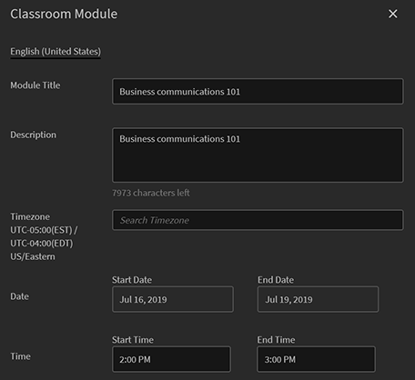
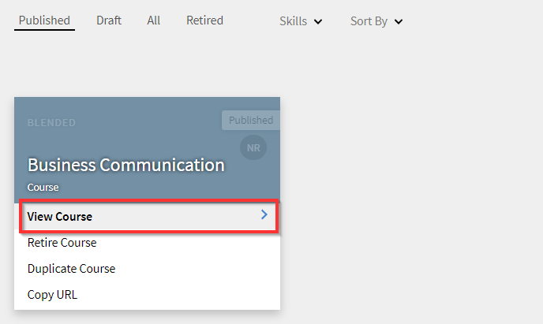
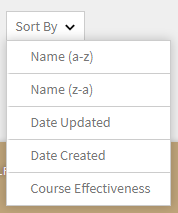
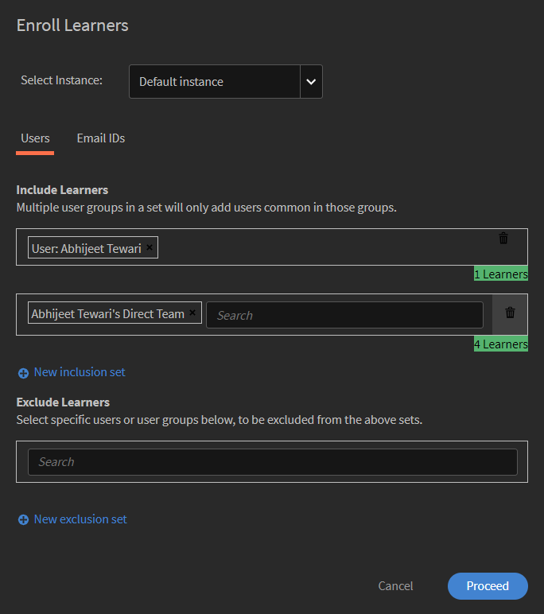
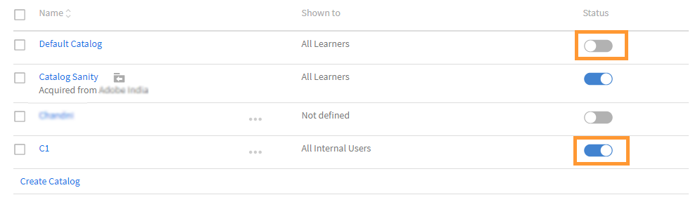

# Cursussen maken, wijzigen en publiceren

Lees dit artikel voor meer informatie over het maken van cursussen, certificeringen en leerprogramma&#39;s in Learning Manager.

Auteurs kunnen leerobjecten zoals cursussen, certificeringen en leerplannen maken. Studenten kunnen deze leerobjecten gebruiken, terwijl beheerders de voortgang van de studenten kunnen volgen.

## Cursussen in Leermanager {#coursesincaptivateprime}

Met Adobe Learning Manager kunnen auteurs cursussen maken met behulp van een of meer modules voor virtuele training, training op eigen tempo, klassikale training en activiteiten. Beheerders kunnen deze cursussen verder gebruiken om cursusinstanties te maken, studenten in te schrijven, badges toe te wijzen en feedback voor deze cursussen in te schakelen. Met deze cursussen kunnen ze ook leerprogramma&#39;s, leerplannen en certificeringen maken.

Auteurs kunnen e-learninginhoud gebruiken die met een eLearning-tool is gemaakt. Andere ondersteunde cursusindelingen zijn videobestanden, PDF, doc, docx, PPT en PPTX.

## Een cursus maken - de basisworkflow {#createacoursebasicworkflow}

Volg onderstaande stappen om een cursus te maken:

1. Meld u als auteur aan bij Adobe Learning Manager, omdat alleen auteurs het recht hebben cursussen te maken. Klik nu op de pagina Aan de slag op **[!UICONTROL Cursussen maken]**.
1. Op de **Cursusoverzicht** de naam van de cursus in. Voer nu een korte beschrijving in voor deze cursus, die wordt weergegeven op de cursuskaart. Deze beschrijving mag niet meer dan 140 tekens bevatten. Voer vervolgens het gedetailleerde overzicht voor de cursus in, dat wordt weergegeven op de pagina Cursusdetails. De beschrijving mag niet langer zijn dan 1500 tekens.

   Als auteur kunt u de beschrijving van de modules zien terwijl u de module aan een cursus toevoegt.

1. Klik op Nieuwe taal toevoegen linksboven op de pagina om uw cursus in andere talen beschikbaar te maken. Selecteer de taal of talen waarin u uw cursus beschikbaar wilt maken. Klikken **[!UICONTROL Opslaan]**. Zie voor meer informatie [Inhoud toevoegen voor verschillende talen](/help/migrated/authors/feature-summary/content-library.md).
1. **Cursusinstellingen wijzigen**-

   1. Kies op de pagina Cursusinstellingen een vaardigheid voor de cursus. Kies de vereiste vaardigheid in de vervolgkeuzelijst Vaardigheid. Kies vervolgens het gewenste niveau in de vervolgkeuzelijst Niveau.
   1. Kies de cursusvaardigheden, stel het niveau in en stel de punten voor de vaardigheid in. Voeg desgewenst meer vaardigheden toe.
   1. Van de **Type inschrijving** kiest u het type inschrijving.

   Dit zijn de typen inschrijvingen:

   * **Manager-aangewezen:** Alleen managers kunnen deze cursussen aanwijzen. Een student kan zich niet voor dit soort cursussen inschrijven.
   * **Goedgekeurd door manager:** Managers keuren deze cursussen goed. Studenten kunnen zich voor deze cursussen inschrijven, maar ze worden niet rechtstreeks voor dit soort cursussen ingeschreven zonder toestemming van de manager. Managers ontvangen een meldingsaanvraag wanneer studenten zich voor dit soort cursussen inschrijven. Na goedkeuring door de manager worden deze cursussen weergegeven als cursussen waarvoor studenten zijn ingeschreven.
   * **Zelfingeschreven:** Studenten kunnen zich rechtstreeks voor dit soort cursussen inschrijven.

1. Klik op **[!UICONTROL Opslaan]**. Klik op **[!UICONTROL Publiceren]**.

## Een cursus maken - Geavanceerde workflow {#createacourseadvancedworkflow}

1. Meld u als auteur aan bij Adobe Learning Manager, omdat alleen auteurs het recht hebben cursussen te maken. Klik nu op de pagina Aan de slag op **[!UICONTROL Cursussen maken]**.
1. Op de **Cursusoverzicht** de naam van de cursus in. Voer nu een korte beschrijving in voor deze cursus, die wordt weergegeven op de cursuskaart. Deze beschrijving mag niet meer dan 140 tekens bevatten. Voer vervolgens het gedetailleerde overzicht voor de cursus in, dat wordt weergegeven op de pagina Cursusdetails. De beschrijving mag niet langer zijn dan 1500 tekens.
1. Klik op Nieuwe taal toevoegen linksboven op de pagina om uw cursus in andere talen beschikbaar te maken. Selecteer de taal of talen waarin u uw cursus beschikbaar wilt maken. Klikken **[!UICONTROL Opslaan]**. Zie voor meer informatie [Inhoud toevoegen voor verschillende talen](/help/migrated/authors/feature-summary/content-library.md).
1. **Cursusinstellingen wijzigen**-

   1. Kies op de pagina Cursusinstellingen een vaardigheid voor de cursus. Kies de vereiste vaardigheid in de vervolgkeuzelijst Vaardigheid. Kies vervolgens het gewenste niveau in de vervolgkeuzelijst Niveau.
   1. Kies de cursusvaardigheden, stel het niveau in en stel de punten voor de vaardigheid in. Voeg desgewenst meer vaardigheden toe.
   1. Van de **Type inschrijving** kiest u het type inschrijving.

   Dit zijn de typen inschrijvingen:

   * **Manager-aangewezen:** Alleen managers kunnen deze cursussen aanwijzen. Een student kan zich niet voor dit soort cursussen inschrijven.
   * **Goedgekeurd door manager:** Managers keuren deze cursussen goed. Studenten kunnen zich voor deze cursussen inschrijven, maar ze worden niet rechtstreeks voor dit soort cursussen ingeschreven zonder toestemming van de manager. Managers ontvangen een meldingsaanvraag wanneer studenten zich voor dit soort cursussen inschrijven. Na goedkeuring door de manager worden deze cursussen weergegeven als cursussen waarvoor studenten zijn ingeschreven.
   * **Zelfingeschreven:** Studenten kunnen zich rechtstreeks voor dit soort cursussen inschrijven.

1. Kies of u een prijs voor uw cursus wilt instellen of maak deze gratis. Kies de optie als u de cursus wilt laten betalen **[!UICONTROL betaald]** en geef een prijs op. De prijs verschijnt vervolgens op de cursuskaart en de overzichtspagina van de cursus voor een student.

   OPMERKING: deze optie is alleen ingeschakeld wanneer de Adobe Commerce-connector is geconfigureerd.

1. Schakel het selectievakje in als u studenten de mogelijkheid wilt geven zichzelf uit te schrijven voor uw cursus **Studenten kunnen zichzelf uitschrijven**.
1. **Instantieconfiguratie**

   Als u deze optie inschakelt, kunnen studenten met de status In bewerking naar andere instanties gaan en zich daar inschrijven. Een student kan dan de voortgang van de vorige instantie behouden.

   Als u na publicatie van de cursus terugkeert naar de pagina Instellingen, kan deze optie niet meer worden bewerkt.

   U kunt de optie inschakelen voor de volgende cursustypen:

   * Op eigen tempo
   * Klaslokaal
   * Activiteit
   * Overvloeid

   Opmerking: tijdens het dupliceren van een cursus blijft de optie Instantieconfiguratie in de broncursus uitgeschakeld in de doelcursus.

   **Instance Switch wordt niet ondersteund voor**:

   * Betaalde cursussen
   * Door manager aangewezen inschrijvingscursussen.

   Configuratie van instance switch wordt niet doorgegeven aan collega-accounts als deze wordt gedeeld via de catalogus, de optie blijft uitgeschakeld in de doelcursus.

1. **Meerdere inschrijvingen**

   Hiermee kunt u studenten in meer dan één cursusinstantie op een of meerdere tijdstippen inschrijven.

   De schakelknop inschakelen **Meerdere inschrijvingen** om te schakelen tussen verschillende cursusinschrijvingen van een student. Als u Instance Switch hebt ingeschakeld, kunt u geen Meerdere inschrijvingen gebruiken.

1. Selecteer de vereiste cursussen die moeten worden voltooid voordat u de cursus start. Klik op het veld Cursussen en maak een keuze in de lijst met cursussen.
1. Schakel het **Inschakelen** **Vereisten** Schakel deze optie in als u de vereiste cursussen voor mij verplicht wilt maken.
1. Voeg trefwoorden toe als tags voor uw cursus. Met deze tags kunnen de studenten uw cursus gemakkelijk vinden tijdens het zoeken. Al deze tags worden automatisch toegevoegd op basis van de modules die we hebben toegevoegd. Als u andere tags hebt die u aan deze cursus wilt toevoegen, kunt u deze invoeren.
1. Voeg trefwoorden toe als tags voor uw cursus. Met deze tags kunnen de studenten uw cursus gemakkelijk vinden tijdens het zoeken. Al deze tags worden automatisch toegevoegd op basis van de modules die we hebben toegevoegd. Als u andere tags hebt die u aan deze cursus wilt toevoegen, kunt u deze invoeren.
1. Selecteer in het veld Automatisch archiveren een datum waarop de cursus wordt afgesloten. De beheerder moet eerst de optie Automatisch archiveren inschakelen.
1. Klik op **[!UICONTROL Opslaan]**. Klik op **[!UICONTROL Publiceren]**.

## Gamificationpunten

U kunt gamificationpunten toewijzen op cursus- en cursusinstantieniveau. Hiermee kunt u punten toewijzen aan verschillende cursussen of instanties. Studenten worden gestimuleerd om specifieke cursussen te volgen of de voorkeur te geven aan een bepaalde cursusinstantie boven andere.

1. Selecteer op cursusinstantieniveau **[!UICONTROL Gamificationpunten]**.


*Punten instellen voor gamification*

1. Selecteren **[!UICONTROL Bewerken]**.
1. Als u Instellingen op cursusniveau gebruiken selecteert, worden de volgende opties weergegeven:

   * **[!UICONTROL Na voltooiing]**: Selecteer deze schakeloptie als u wilt dat de student 100 punten krijgt wanneer hij of zij een cursus heeft voltooid.
   * **Meer regels**

      * **[!UICONTROL Vroegtijdige voltooiing]**: Als u dit selecteert, krijgen de eerste 30 studenten 100 punten wanneer ze een cursus voltooien.
      * **[!UICONTROL Tijdige voltooiing]**: Als u dit selecteert, krijgen studenten 100 punten als ze een cursus binnen 999 dagen voltooien.

1. Als u **[!UICONTROL Aangepaste instellingen gebruiken]**, worden de volgende opties weergegeven:

   * **[!UICONTROL Na voltooiing]**: Selecteer deze schakeloptie als u wilt dat de student 100 punten krijgt wanneer hij of zij een cursus heeft voltooid.
   * **Meer regels**

      * **[!UICONTROL Vroegtijdige voltooiing]**: Als u deze optie selecteert, kunt u bepalen hoeveel studenten specifieke punten krijgen toegewezen.
      * **[!UICONTROL Tijdige voltooiing]**: Als u deze optie selecteert, kunt u bepalen hoeveel punten studenten krijgen als ze binnen een bepaalde tijd een cursus voltooien.

   

   *Snelle en tijdige voltooiing instellen*

1. Selecteren **[!UICONTROL Opslaan]**.

## Samengevoegde leermiddelen

Een auteur kan beslissen of hij of zij de leermiddelen op het niveau van het leerplan wil samenvoegen of op een individueel cursusniveau wil laten blijven.

Als auteur selecteert u **[!UICONTROL Leerpad]** > **[!UICONTROL Instellingen]**. Klikken **[!UICONTROL Bewerken]**.

In het dialoogvenster **[!UICONTROL Bronnen]** te klikken, het selectievakje Gecombineerde leercursusmiddelen op leerpad tonen, indien ingeschakeld, geeft aan of aanwezige leermiddelen op cursusniveau worden weergegeven op leerpad-niveau.

>[!NOTE]
>
>Op de pagina Instellingen van een leerpad kan een beheerder deze optie ook inschakelen, die bronnen op cursusniveau weergeeft die op het niveau van het leerpad worden weergegeven.

## Planningsassistent

Conflicten beheren in boekingsinstructeurs en lesruimten. Gebruik de Planningsassistent als u wilt weten op welk tijdstip en op welk tijdstip een docent beschikbaar is voordat u hem aan de cursus toewijst.

Klik tijdens het maken van een cursus voor een VC- of CR-cursus op Planning Assistant.


*Starten met plannen van assistent*

Het venster Scheduling Assistant wordt geopend.


*Het dialoogvenster Planning Assistant*

In de Planningsassistent kunt u:

* Zoek docenten op naam.
* Zoek docenten op basis van hun vaardigheden.

### Docenten zoeken op hun naam

Typ in het veld Docent de naam van de docent of zoek naar een gedeeltelijke docentnaam. Er verschijnt een lijst met docenten waaruit u een docent kunt kiezen.


*Zoeken naar docenten*

Er kunnen meerdere docenten worden geselecteerd, maar er kan slechts één docent tegelijk worden toegewezen. De geselecteerde tijd wordt gemarkeerd in het venster voor een tijdconflict. In de buurt van de docent verschijnt een kruispictogram, waarop u klikt om de docent te verwijderen.


*Zoeken naar meerdere docenten*

### Docenten zoeken op vaardigheden

Zoek naar een docent met enkele of meerdere vaardigheden. De zoekopdracht gebruikt de operator AND.

Vaardigheden kunnen alleen worden doorzocht op gedeeltelijke of volledige vaardigheidsnaam, niet op vaardigheidsniveau.

Voor de Medewerker, ga de naam van de instructeur, plaats, en plaatsgrens in.

U kunt ook zoeken in vaardigheden die worden weergegeven nadat u op het filterpictogram aan de rechterkant van het zoekvak voor docenten hebt geklikt. In de onderstaande schermafbeelding wordt de knop weergegeven.


*Zoeken naar docenten op basis van vaardigheden*

### Gebruikersgroepfilter

Selecteer het filter in het veld Docent. Er is een **[!UICONTROL Gebruikersgroep]** een auteur of aangepaste auteur filteren kan de juiste docent vinden met behulp van de waarden in de gebruikersgroep.

Als beide filters worden toegepast, wordt een lijst met docenten weergegeven die tot de gebruikersgroep behoren en de geselecteerde vaardigheden hebben.

Dit geldt voor de planningsassistent op de pagina Cursussen of Instanties.


*Filteren op gebruikersgroepen*

### Instantiepagina

U kunt de Planningsassistent ook openen vanaf de Instantie-pagina, zoals hieronder wordt weergegeven.

De Planningsassistent is ook beschikbaar op de Instantie-pagina voor beheerders en voor aangepaste beheerders/auteurs.


*Docenten plannen vanaf de pagina Instanties*

### Zoeken naar een locatie

U kunt naar een locatie zoeken door zowel de naam van de lesruimte als de naam van het locatiegebied op te geven op zowel de module- als de pagina&#39;s van de Planningsassistent.

## RTF-opmaak

Tijdens het maken van een cursus, leerprogramma, certificering of taakhulp kunnen auteurs verschillende typen inhoud invoeren, zoals tekst, afbeeldingen, of verschillende opties voor tekstopmaak toepassen.

Wanneer u een cursus maakt, ziet u de Rich Text Editor in het veld Cursusoverzicht. U kunt uw inhoud opmaken, afbeeldingen toevoegen, hyperlinks toevoegen enzovoort.


*De RTF-editor starten*

U kunt ook de Rich Text Editor gebruiken om de beschrijving te wijzigen bij het maken van een:

**Leerprogramma**


*Rich Text Editor gebruiken voor een leerprogramma*

**Certificering**


*Rich Text Editor gebruiken voor certificering*

**Taakhulp**


*RTF-editor gebruiken voor taakhulp*

Bovendien kunt u de Rich Text Editor voor andere talen gebruiken.

## Ondersteuning voor uitgebreide tekstbeschrijving voor headless gebruikersinterface

### Waarom is CSS vereist?

RTF-tekst bestaat uit HTML-opmaakcodes. Als de markering op de huidige manier wordt weergegeven, wordt de standaardstijl toegepast door de browser. Dit gaat vaak niet goed met de stijlrichtlijnen van het bedrijf. CSS is vereist om aan de richtlijnen te voldoen.

### Standaardstijl

De gekoppelde CSS-stijlpagina bevat de opmaak die wordt toegepast door Learning Manager. De stijl wordt getweend op basis van de meeste gebruikstoepassingen. Download het bijgevoegde CSS-bestand en importeer het naar uw webapp volgens uw conventies en buildsysteem. De gedefinieerde CSS-klassen worden benoemd in de klasse ql-editor en veroorzaken geen problemen met uw bestaande stijlen.

### Stijlen aanpassen

De standaardstijl voldoet mogelijk niet aan de behoeften van iedereen. U kunt de aanpassingen uitvoeren door de meegeleverde CSS te overschrijven. Alle stijlen worden onder de ql-editor geplaatst als afstammende kiezers. De volgende klassen worden gebruikt:

* Inspringing: **li.ql-indent-$number**. $getal varieert van 1-9
* grootte: **ql-size-small**, **ql-size-large**, **ql-size-brug**

* uitlijning: **ql-align-center**, **ql-align-justify**, **ql-align-right**

* kleur: **ql-color-$color**. $color = wit, rood, oranje, geel, groen, blauw, paars
* achtergrond: **ql-bg-$color**. $color = zwart, rood, oranje, geel, groen, blauw, paars
* html-tags: p, ol, ul, pre, blockquote, h1, h2, h3, h4, h5, h6

[CSS-bestand voor aanpassing.](assets/ql-headless.css)

### API-WIJZIGINGEN OM HET RENDEREN VAN RIJKE TEKSTOVERZICHTEN IN TE SCHAKELEN

Wanneer klanten een headless interface bouwen, moeten ze de leerobjecten weergeven in die aangepaste gebruikersinterface die ze ontwikkelen. Hiervoor gebruikt u doorgaans de opdracht [GET /learningObjects](https://learningmanagereu.adobe.com/docs/primeapi/v2/#!/learning_object/get_learningObjects) API die zichtbaar is. Nu Leermanager het vastleggen van &quot;rijke tekst&quot; voor het overzichtsveld ondersteunt, stelt het gegevensmodel van leerobjecten in de API-reacties ook dit beschikbaar. Zie het veld &quot;richTextOverview&quot; in het fragment van het model in de API-respons hieronder. Let er ook op dat het veld dat u eerder weergeeft (&#39;overzicht&#39;), niet wordt gewijzigd voor achterwaartse compatibiliteit.

```
{ 
 "data": [ 
 { 
 "id": "string", 
 "type": "string", 
 "attributes": { 
 … 
 "localizedMetadata": [ 
 { 
 "description": "string", 
 "locale": "string", 
 "name": "string", 
 "overview": "string", 
 "richTextOverview": "string" 
 } 
 ], 
 … 
 }, 
 "relationships": { 
 … 
 } 
 } 
 } 
 ] 
} 
```

Klanten die het overzichtsveld al gebruiken, blijven ongewijzigd in hun headless interface. Klanten zien gewoon onbewerkte tekst zoals voorheen. Als klanten willen profiteren van het uitgebreide tekstoverzicht, moeten ze overzichten met rijke opmaak maken voor hun leerobjecten in de gebruikersinterface van de auteur. Daarna begint Leermanager ook het uitgebreide tekstoverzicht te retourneren, naast de normale tekst (zoals eerder) in het API-responsmodel.

Om deze rijke tekst echter weer te geven in hun gebruikersinterface, moet de klant een CSS opnemen. Dit wordt gedetailleerd uitgelegd in de volgende secties.

## Meerdere pogingen toestaan {#allowmultipleattempts}

Nadat de beheerder meerdere pogingen heeft ingeschakeld, kunt u als auteur meerdere pogingen voor een interactieve e-learningmodule op cursus- of moduleniveau configureren.


*Meerdere pogingen configureren voor een interactieve e-learningmodule*

<table>
 <tbody>
  <tr>
   <td>
    <p><b>Optie</b></p></td>
   <td>
    <p><b>Beschrijving</b></p></td>
  </tr>
  <tr>
   <td>
    <p>Pogingen instellen op</p></td>
   <td>
    <p>U kunt het aantal pogingen voor een module instellen op oneindig of een bepaalde limiet opgeven.<span style="font-size: 0.8125rem;">De student krijgt de informatie over de poging te zien zodra deze is ingeschakeld. De student kan de module opnieuw proberen door op de knop Opnieuw proberen te klikken.</span></p></td>
  </tr>
  <tr>
   <td>
    <p>Nieuwe poging stoppen wanneer module is voltooid of bereikt</p></td>
   <td>
    <p>Schakel het selectievakje 'Nieuwe poging stoppen zodra module is voltooid of behaald' in om te configureren wanneer studenten de optie voor nieuwe pogingen niet meer kunnen selecteren. De optie Opnieuw proberen wordt uit de studentweergave verwijderd als de module met succes is voltooid.</p></td>
  </tr>
  <tr>
   <td>
    <p>Module vergrendelen tussen pogingen 0:0:1 notatie: dagen/uren/minuten</p></td>
   <td>
    <p>U kunt modules tussen pogingen voor een bepaalde tijd vergrendelen door het selectievakje "<b>Module vergrendelen tussen pogingen 0:0:1 notatie: dagen/uren/minuten</b>". Wanneer een module is vergrendeld, kan de student de module pas bezoeken nadat de ingestelde vergrendelingstijd is verstreken. </p>
    <p>U kunt de eindcriteria van een poging definiëren door de optie '<b>Speler sluiten</b>' of '<b>Voltooiing</b>" selectievakjes.</p></td>
  </tr>
  <tr>
   <td>
    <p>Speler sluiten</p></td>
   <td>
    <p>Elke keer dat de module wordt gestart, wordt beschouwd als een nieuwe poging als de criteria "<b>Speler sluiten</b>". Een student krijgt informatie over modulevergrendeling en pogingen bij het sluiten van de speler.</p></td>
  </tr>
  <tr>
   <td>
    <p>Voltooiing</p></td>
   <td>
    <p>Als het einde van een poging is gebaseerd op <b>Voltooiing</b>en wordt het berekend op basis van de succescriteria voor de inhoud. Studenten mogen de module pas opnieuw proberen nadat de voltooiingsgegevens door de inhoud zijn verzonden. De details van modulevergrendelingen en pogingen worden na afloop van een poging aan de student doorgegeven.</p></td>
  </tr>
  <tr>
   <td>
    <p>Tijdslimiet instellen om module te voltooien</p></td>
   <td>
    <p>Auteurs kunnen een tijdslimiet voor het voltooien van een module instellen door het selectievakje in te schakelen, "<b>Tijdslimiet instellen om module te voltooien</b>".</p>
    <p>Elke keer dat de speler wordt gestart, wordt beschouwd als een nieuwe poging en de student krijgt de tijdgegevens te zien tijdens het starten.</p>
    <p><b>Opmerking:</b><span style="font-size: 0.8125rem;">De poging wordt automatisch beëindigd zodra de tijd is verstreken. Als u ook de speler sluit, wordt de huidige poging beëindigd.</span></p></td>
  </tr>
  <tr>
   <td>
    <p>Meerdere pogingen op moduleniveau</p></td>
   <td>
    <p>Als u een poging op moduleniveau selecteert in de vervolgkeuzelijst Poging instellen op kunt u de opties op moduleniveau configureren.</p></td>
  </tr>
 </tbody>
</table>

## Cursusmodules {#coursemodules}

### Modules toevoegen {#addmodules}

U kunt nu de modules Inhoud, Voorbereidend werk en Test toevoegen. **Inhoud** modules zijn de belangrijkste modules waaruit de cursus bestaat. **Voorwerk** modules bevatten enkele basisinformatie die studenten kan helpen zich voor te bereiden voor de cursus. Deze modules hoeven niet door de studenten te worden voltooid. **Testout** met modules kunnen studenten de inhoud overslaan en de test uitvoeren als ze zich al bewust zijn van de inhoud en de test willen uitvoeren om aan de nalevingsvereiste te voldoen.

Voer de onderstaande stappen uit om een inhoudsmodule toe te voegen:

1. Klikken **[!UICONTROL Modules toevoegen]**. U ziet vier opties voor het toevoegen van modules. De eerste optie is om modules op eigen tempo toe te voegen. Dit zijn de modules die u maakt en toevoegt aan de modulebibliotheek in Adobe Learning Manager. Deze tweede optie is het instellen van de virtuele lesruimte. De derde is het instellen van een klassikale module, de vierde is de activiteitenmodule.

   

   *Een module voor een cursus toevoegen*

   **Module op eigen tempo:** In deze modus kunt u een cursusmodule op uw eigen tempo starten en voltooien. U kunt uw eigen schema instellen.

   Nadat u op de optie hebt geklikt, ziet u de lijst met modules op eigen tempo die al aan uw modulebibliotheek zijn toegevoegd. Hier kunt u door de lijst bladeren en de modules selecteren die u wilt toevoegen, of u kunt naar de modules zoeken door de naam van de module in het zoekveld of de moduletags te typen.

   Klik op **[!UICONTROL Toevoegen]**. Deze modules staan nu onder de sectie Inhoud.

   U kunt de modules ook opnieuw rangschikken. Sleep een module naar boven of beneden en rangschik de modules in de juiste volgorde.

   **Virtuele klassikale module:** In deze modus kunnen studenten live online lezingen bijwonen, gefaciliteerd door een getrainde docent. Voer de titel, beschrijving en de duur van de sessie in. U kunt ook de conferentie-URL opgeven en de docenten die de sessie moeten leiden. Klik op **[!UICONTROL Gereed]**.

   

   *Een VC-module toevoegen*

   Wanneer u een cursus maakt met behulp van het dialoogvenster voor configuratie van virtuele lesruimten, stelt u de **Conferentiesysteem** naar de Teams-verbinding die u hebt gemaakt. Geef op of u de vergadering wilt organiseren voor de gebeurtenis.

   Als u **Ja** voor een organisator van een vergadering, moet u de naam van de organisator ingaan. Typ de naam en selecteer de Organizer.

   **Lobby omzeilen**

   * Als u **Ja** kan deelnemen aan de vergadering.
   * Als u **Nee**, wordt een verzoek naar de organisator verzonden om de student toe te staan of te verhinderen aan de vergadering deel te nemen.

   **Opmerking:** Een student moet beschikbaar zijn op Microsoft Teams. De student kan zich echter als gast aansluiten bij de Learning Manager.

   **Klaslokaalmodule:** In deze modus kunnen studenten persoonlijke lezingen bijwonen, die worden bijgewoond door een getrainde docent. Voer de titel, beschrijving en de duur van de sessie in. U kunt ook de locatie van de cursus opgeven en de docenten die de sessie moeten leiden. Klik op **[!UICONTROL Gereed]**.

   

   *Een klassikale module toevoegen*

   Wanneer u een cursus maakt, stelt u in het dialoogvenster Configuratie virtuele lesruimte het conferentiesysteem in op de Microsoft Teams-verbinding die u hebt gemaakt. Geef op of u de vergadering wilt organiseren voor de gebeurtenis.

   Als u Ja selecteert voor een organisator van een vergadering, moet u de naam van de organisator invoeren. Typ de naam van de Organizer en selecteer de Organizer.

   **Lobby omzeilen**

   * Als u Ja selecteert, kan elke student deelnemen aan de vergadering.
   * Als u Nee selecteert, wordt een verzoek naar de organisator verzonden om toe te staan dat de student aan de vergadering deelneemt of om te voorkomen dat hij of zij hieraan deelneemt.

   **Opmerking:** Als een student zich als gast bij Microsoft Teams wil aansluiten, moet hij/zij het e-mailbericht invoeren. Het e-mailadres moet aanwezig zijn in Leerbeheer.

   **Module activiteit:** In deze modus moeten studenten een reeks activiteiten voltooien, zoals workshops, oefeningen, vragenlijsten en andere leeractiviteiten. Voer de titel, beschrijving en de externe URL ter referentie in. Klik op **[!UICONTROL Gereed]**.

   

   *Een activiteitenmodule toevoegen*

   U kunt de duur opgeven tijdens het toevoegen van een activiteitenmodule in een cursus voor activiteitentype Bestand verzenden en op xAPI gebaseerde modules.

1. Voeg op dezelfde manier modules toe voor de modi Voorbereidend werk en Test.
1. Kies het sequentietype voor modules op volgorde of Niet op volgorde op basis van uw voorkeur.

   Als u **Geordend**, verschijnen de modules in dezelfde volgorde als u ze hebt gemaakt. Als u **ongeordend**, worden de modules niet op volgorde gezet. Studenten kunnen de modules in elke willekeurige volgorde voltooien.

1. Kies in de vervolgkeuzelijst Verplichte modules het aantal modules dat de student moet volgen om de cursus te voltooien.
1. Voeg een omslagafbeelding en de bannerafbeelding voor de cursus toe. De catalogi worden gemaakt door de beheerder. Zie voor meer informatie [Catalogi](/help/migrated/administrators/feature-summary/catalogs.md).

   **Opmerking:** De aanbevolen afmetingen zijn:

   * **Omslagafbeelding:** 300 px, 300 px
   * **Bannerafbeelding:** 1600 px, 140 px

1. Klik rechtsboven op de pagina op **[!UICONTROL Opslaan]**.

## Checklist {#create-checklist}

Evaluatie is een belangrijk aspect van elk LMS. Onlinebeoordelingen zijn een van de belangrijkste manieren om het inzicht van een student in een onderwerp te evalueren. Maar vaak is het nodig om het begrip van een persoon te evalueren terwijl hij of zij aan het werk is door hem/haar de noodzakelijke taken uit te voeren.

Overweeg werknemers of magazijnmedewerkers die worden geëvalueerd op te slaan voor de taken die ze dagelijks moeten uitvoeren. Het kunnen de stappen zijn die worden uitgevoerd om een koffieapparaat te repareren of de stappen die nodig zijn om een materiaal te verpakken. Docenten kunnen medewerkers voor dergelijke taken evalueren op basis van een checklist en deze evalueren als geslaagd of niet geslaagd in de evaluatieactiviteit.

### Een checklist maken {#createachecklist}

Alleen een auteur kan een controlelijst maken. Een controlelijst is een type activiteitenmodule. Tijdens het instellen van een activiteitenmodule kunt u als auteur een Activiteit selecteren als **Checklist**, zoals hieronder weergegeven:


*Een checklist maken*

Als u eenmaal de optie hebt gekozen **Checklist**, ziet u een aantal extra opties.

**Type controlelijst:** Kies een willekeurige optie, **Ja/Nee** of **1-5**. Als u Ja/Nee kiest, bevat de checklist vragen die alleen met Ja of Nee kunnen worden beantwoord. Als u 1-5 kiest, ziet u een Likert-controlelijst, waarin u een score kunt toekennen aan een vraag op een schaal van vijf punten.

**Kwaliteitscriteria:**

<table>
 <tbody>
  <tr>
   <td>
    <p>Als u <b>Ja/Nee</b>, dan...</p></td>
   <td>
    <p>Als u <b>1-5</b>, dan...</p></td>
  </tr>
  <tr>
   <td>
    <p>Stel de voldoende criteria in als het aantal reacties op Ja. Als u bijvoorbeeld 3 invoert, slaagt de student erin om de cursus te voltooien als hij/zij ten minste drie <b>Ja </b>reacties, indien geëvalueerd door een docent.</p></td>
   <td>
    <p>Stel de voldoende criteria in als een drempel van een willekeurig getal tussen 1 en 5. Als u bijvoorbeeld 2 en 4 invoert, slaagt de student voor de cursus als hij/zij ten minste <b>twee </b>evaluaties die score hebben groter dan of gelijk aan <b>vier</b>.</p></td>
  </tr>
 </tbody>
</table>

Kies een docent of docenten die de student zullen evalueren.

Als u een opmerking of notitie wilt toevoegen, kunt u dat ook toevoegen in de **Opmerking voor docent** tekstveld.

Voeg nu de vragen over de checklist toe. Klikken **[!UICONTROL Toevoegen]**. U kunt maximaal 150 vragen toevoegen.


*Vragen over checklist toevoegen*

Klik op **[!UICONTROL Meer toevoegen]**.

Sla de wijzigingen op, voeg de module toe en publiceer de cursus.

### Vaardigheden toevoegen {#addskills}

Voer op deze pagina de volgende gegevens in:

1. Kies de cursusvaardigheden, stel het niveau in en stel de punten voor de vaardigheid in. Voeg desgewenst meer vaardigheden toe.

   

   *Vaardigheden toevoegen voor een cursus*

1. Kies het type inschrijving. De volgende opties zijn beschikbaar:

   * **Manager-aangewezen:** Alleen managers kunnen deze cursussen aanwijzen. Een student kan zich niet voor dit soort cursussen inschrijven.
   * **Goedgekeurd door manager:** Managers keuren deze cursussen goed. Studenten kunnen zich voor deze cursussen inschrijven, maar ze worden niet rechtstreeks voor dit soort cursussen ingeschreven zonder toestemming van de manager. Managers ontvangen een meldingsaanvraag wanneer studenten zich voor dit soort cursussen inschrijven. Na goedkeuring door de manager worden deze cursussen weergegeven als cursussen waarvoor studenten zijn ingeschreven.
   * **Zelfingeschreven:** Studenten kunnen zich rechtstreeks voor dit soort cursussen inschrijven.

1. Schakel het selectievakje in als u studenten de mogelijkheid wilt geven zichzelf uit te schrijven voor uw cursus **Studenten kunnen zichzelf uitschrijven**.
1. Selecteer de vereiste cursussen die moeten worden voltooid voordat u de cursus start. Klik op het veld Cursussen en maak een keuze in de lijst met cursussen.

   

   *Voeg de vereiste cursussen toe*

1. Schakel het **Vereisten** Schakel deze optie in als u de vereiste cursussen voor mij verplicht wilt maken.
1. Voeg trefwoorden toe als tags voor uw cursus. Met deze tags kunnen de studenten uw cursus gemakkelijk vinden tijdens het zoeken. Al deze tags worden automatisch toegevoegd op basis van de modules die we hebben toegevoegd. Als u andere tags hebt die u aan deze cursus wilt toevoegen, kunt u deze invoeren.
1. Voeg de profielen van uw doelgroep voor deze cursus toe door op het tekstgebied te klikken en de profielen uit de suggesties te kiezen.
1. Voeg leermiddelbestanden voor uw cursus toe als extra materiaal. Sleep uw materialen zoals tekst, video of audiobestanden.
1. Deze cursus is nu beschikbaar voor deze studenten met deze profielen als aanbevolen cursus. In deze sectie kunt u ook aanvullende bronnen voor uw studenten toevoegen. Studenten kunnen deze bestanden downloaden voor later gebruik. Als u al deze wijzigingen hebt doorgevoerd, klikt u op **[!UICONTROL Opslaan]** in de rechterbovenhoek. Zo slaat u uw cursus op als concept. Uw cursus wordt standaard als concept opgeslagen.

## Docenten toewijzen voor modules {#assigninstructorsformodules}

1. Nadat u modules voor uw cursus hebt gemaakt, kunt u docenten aan de modules toewijzen. Klik in het dashboard Auteur op **[!UICONTROL Cursuscatalogus]**.
1. Klik op de cursus waaraan u docenten wilt toewijzen.
1. Van de **Modules toevoegen** te klikken op de module waaraan u een docent wilt toewijzen.
1. In het dialoogvenster **Docent** in, geeft u de gebruikersnaam op van de gebruiker aan wie u de rol van docent wilt toewijzen.

   

   *Een docentrol toewijzen aan een gebruiker*

1. Klik op **[!UICONTROL Opnieuw publiceren]**.

## Controlelijst voor waarneming

Een module Checklist kan nu door managers worden gereviseerd, naast docenten. Personenmanagers en niet-hiërarchische managers, zoals winkelmanagers en locatiebeheerders, kunnen de checklist bekijken en voltooien.

Cursusauteurs kunnen Personen en Niet-hiërarchische managers (indien van toepassing) als revisoren toevoegen door deze rolopties te selecteren in de sectie &quot;Revisoren&quot; terwijl ze een controlelijstmodule instellen. Dit kan op cursusinstantieniveau worden gedaan.


*Revisoren toevoegen aan een activiteitenmodule*

De &quot;**[!UICONTROL +Managers]**&quot; automatisch zal de manager van een student in de organisatiehiërarchie inschakelen om de controlelijst te bekijken. U hoeft de managernamen niet afzonderlijk te zoeken en toe te voegen.

Als uw accountbeheerder niet-hiërarchische managerrollen (zoals locatiebeheerders of sitemanagers) heeft ingesteld met de optie Actieve velden, kunt u deze managerrollen selecteren en inschakelen om de controlelijst te bekijken.

U hoeft de managernamen niet afzonderlijk te zoeken en toe te voegen. Wanneer studenten zich inschrijven voor de checklist-cursus, stuurt deze automatisch een melding naar hun managers/winkelmanagers voor revisie, samen met een geselecteerde docent. Dankzij deze workflow kunnen auteurs eenvoudig de namen van individuele managers niet vermelden.

Selecteer in de bovenstaande voorbeeldschermafbeelding de optie &quot;**[!UICONTROL +Store Managers]** Met de optie &quot; wordt automatisch de niet-hiërarchische manager die aan de student is uitgelijnd, ingeschakeld om de controlelijst te bekijken. Merk op dat &quot;opslag&quot; hier wordt vervangen door het actieve veld dat door de beheerder is gedefinieerd.

Updates van de controlelijstmodule bevatten ook meldingen aan docenten en managers wanneer een student is ingeschreven voor een cursus met een controlelijstmodule. De revisor krijgt een melding in het Leermanager-meldingscentrum en op het dashboard Docent/manager dat de actie voor de controlelijst moet worden uitgevoerd.

<!---->

De revisor kan informatie over alle revisieonderdelen van de controlelijst die in behandeling zijn, bekijken in het menu Controlelijst en in het menu Meldingen wanneer hij of zij zich als docent/manager aanmeldt.


*Goedkeuringen voor certificering*

Nadat u op Controlelijst voor revisie hebt geklikt, kan de revisor de evaluatie voltooien.


*Revisieonderdelen van een checklist bekijken*

De rapportage kan worden gedownload op checklists, waaronder gedetailleerde informatie over de evaluatie van studenten, de naam van de revisor, de rol en e-mail.

Het CSV-bestand voor controlelijsten heeft de nieuwe en bijgewerkte velden:

* Naam revisor in plaats van Naam docent
* E-mail van revisor in plaats van e-mail van docent
* Rol van revisor - Mogelijke waarden zijn Manager, Store/Location Manager, docent

## Een cursus voorvertonen {#previewacourse}

Nadat de cursus als concept is gemaakt en opgeslagen, kunt u een voorbeeld van de cursus bekijken als student en deze vervolgens publiceren om deze beschikbaar te maken in de cursuscatalogus.

Klik op **[!UICONTROL Voorvertonen als student]**.


*Een cursus voorvertonen als student*

De cursus wordt geopend **Overzicht** pagina waar u de modules, hun volgorde en andere gegevens over de cursus kunt zien.


*Modules en andere gerelateerde details weergeven*

Als u wilt zien hoe de studenten deze cursus kunnen ervaren, klikt u op elk van deze modules om deze af te spelen. Hiermee wordt de cursus afgespeeld in de Fluidic Player.

## Een cursus publiceren {#publishacourse}

Nadat u de cursus als student hebt voorvertoond, kunt u de cursus publiceren, zodat deze voor studenten beschikbaar is. De cursus bevindt zich nog in de conceptmodus.

De levenscyclus van een cursus ziet er meestal als volgt uit:

* **Concept** - Wanneer een auteur een cursus heeft gemaakt en opgeslagen. Op dit punt is de cursus nog niet beschikbaar voor studenten.
* **Gepubliceerd** - Wanneer een auteur een cursus heeft gepubliceerd. Studenten kunnen zich nu inschrijven voor de cursus. U kunt een cursus op deze status ook bewerken.
* **Gearchiveerd** - Een auteur kan een cursus na publicatie archiveren als de auteur niet wil dat de cursus in de cursuscatalogus voor studenten verschijnt.
* **Verwijderd** - Een cursus heeft de status Verwijderd wanneer deze volledig is verwijderd uit de Adobe Learning Manager-toepassing. Alleen auteurs kunnen cursussen met de status Concept of Gearchiveerd verwijderen.


*Workflow van een cursuslevenscyclus*

Als u de cursus die u hebt gemaakt wilt publiceren, klikt u op **[!UICONTROL Publiceren]** rechtsboven op de pagina.


*Een cursus publiceren*

Klik in het bevestigingspop-upbericht dat verschijnt op **[!UICONTROL OK]**.

De cursus is nu beschikbaar in de cursuscatalogus.

## Een cursus weergeven {#viewacourse}

Als auteur kunt u een lijst met alle beschikbare cursussen weergeven. Klik op Cursuscatalogus om alle cursussen in Leermanager-account weer te geven. Klik op **[!UICONTROL Mijn cursussen]**.

Houd de muis op de opties op de cursuskaart en klik op **[!UICONTROL Cursus weergeven]**.



*Een cursus weergeven*

Het venster met cursusinformatie wordt weergegeven. De cursus heeft de modus Alleen-lezen. Klik op **[!UICONTROL Bewerken]**.

## Een cursus archiveren {#retireacourse}

Als u een cursus archiveert, kunt u geen nieuwe studenten voor de cursus inschrijven. Studenten die al zijn ingeschreven, kunnen de cursus volgen.

Als u een cursus wilt archiveren, plaatst u de muis op de opties op de cursuskaart en klikt u op Cursus archiveren.


*Een cursus archiveren*

Klik in de bevestigingspop-up die verschijnt op **[!UICONTROL Ja]**.

## Een cursus dupliceren {#duplicateacourse}

U kunt een kopie van de cursus maken en vervolgens de cursus wijzigen. Als u een back-up van uw cursus wilt maken, kunt u de cursus dupliceren.

## Cursussen zoeken {#searchforcourses}

Met Adobe Learning Manager kunt u gemakkelijker snel de gewenste cursussen vinden. U kunt op de volgende manieren naar uw cursussen zoeken:

**Zoekveld:** Klik op de zoekbalk in de rechterbovenhoek van het dialoogvenster **Cursuscatalogus** pagina. Typ de naam van de cursus of eventuele trefwoorden die aan uw cursussen zijn gekoppeld. U kunt ook zoeken met tags die tijdens het maken van de cursus zijn toegevoegd. U kunt naar tags zoeken in het veld Cursussen, wat betekent dat de tags in het zoekveld worden weergegeven terwijl u ze typt.


*Cursussen zoeken*

**Lijst met cursussen filteren:** U kunt de cursussen filteren op status zoals Alle, Gepubliceerd, Concept en Gearchiveerd. Afhankelijk van uw keuze kunt u de gefilterde lijst met cursussen bekijken en de vereiste cursussen selecteren.

Als auteur kunt u de cursussen ook sorteren om de gewenste cursus beter te vinden. Klikken **[!UICONTROL Sorteren op]** en kies alfabetische oplopende volgorde, alfabetische aflopende volgorde, datum waarop de cursus is gemaakt, datum waarop de cursus is bijgewerkt en effectiviteit van de cursussen.



*Lijst met cursussen filteren*

## Studenten inschrijven voor een cursus {#enrolllearnersinacourse}

Als u studenten voor de cursussen wilt inschrijven of managers wilt toestaan om studenten voor de cursussen aan te wijzen, moet u overschakelen naar de modus Beheerder, omdat alleen beheerders het recht hebben om studenten voor de cursussen in te schrijven.

Om over te schakelen naar de beheermodus:

1. Klik op uw profielfoto en selecteer Beheerder.
1. Klik in de beheermodus op **[!UICONTROL Cursussen]** in het linkerdeelvenster. Op deze pagina ziet u alle cursussen die door alle auteurs zijn gemaakt in uw Learning Manager-account.
1. Als u de studenten wilt inschrijven, houdt u de muis boven de cursuskaart en ziet u de optie **Studenten inschrijven**. Klik op deze optie.

   

   *Studenten inschrijven voor een cursus*

1. In het dialoogvenster Studenten inschrijven ziet u rechtsboven dat de optie **Standaardinstantie** is geselecteerd. Zodra een cursus door een auteur is gemaakt, wordt een standaardinstantie van de cursus gemaakt.

   

   *Standaardinstantie van een cursus weergeven*

1. Typ de naam van een student in het veld Inclusief studenten en kies een student. U kunt hier ook gebruikersgroepen toevoegen. Als u alle studenten wilt inschrijven voor uw Learning Manager-account, begint u met typen. U kunt ook studenten inschrijven voor een team.

   

   *Studenten aan een cursus toevoegen*

1. Als u een student van de cursus wilt uitsluiten, voert u de naam van de student in het dialoogvenster **Studenten uitsluiten** veld.
1. Nadat u de studenten hebt ingeschreven, klikt u **[!UICONTROL Doorgaan]**. In het dialoogvenster Studenten inschrijven kunt u het overzicht van de inschrijving bekijken.

   

   *Overzicht van cursusinschrijving weergeven*

1. Als u alle studenten voor de cursus wilt inschrijven, klikt u op **[!UICONTROL Inschrijven]**. Deze studenten zijn nu ingeschreven voor deze cursus. De studenten krijgen een melding om door te gaan en de cursus te volgen. Herhaal de inschrijvingsprocedure om meer studenten in te schrijven.

## Wijzigingen in de pagina Cursusinstantie voor Connect VC-modules {#connect-vc}

Tijdens het ophalen van een Connect-cursus kunt u twee soorten ruimten maken:

* Dynamisch
* Blijvend

Een blijvende URL is altijd opgelost. Maar voor gebruikers die geen Connect en hun eigen vergaderruimte hebben, moeten zij een dynamische vergaderruimte gebruiken bij uitvoering. Mensen kunnen dan deelnemen aan hun vergadering.


*Opties voor dynamische vergaderruimten*

U kunt nu de URL van de permanente ruimte wijzigen op het tabblad **Cursusinstantie** pagina.

<!--|  |  |
|---|---|-->

## Studenten van een cursus uitschrijven {#unenrolllearnersfromacourse}

Tijdens het maken van een cursus kan een auteur de optie **Studenten kunnen zichzelf uitschrijven** zodat studenten die de cursus volgen zich van de cursus kunnen uitschrijven.

Een beheerder kan ook studenten van de cursus uitschrijven.


*Studenten van een cursus uitschrijven*

Zie voor meer informatie [Studenten uitschrijven](/help/migrated/administrators/feature-summary/courses.md).

## Cursusmodules toevoegen voor Captivate en Presenter {#addcoursemodulesforcaptivateandpresenter}

U kunt de cursusmodules ook publiceren naar Learning Manager vanuit de Adobe Captivate- en Adobe Presenter-software via het menu Publiceren.

1. Klik in de Captivate op **[!UICONTROL Publiceren]** > **[!UICONTROL Publiceren naar Leermanager]**.
1. Geef de subdomeinnaam of e-mail-ID op en klik op **[!UICONTROL Verzenden]**. Als u meerdere accounts hebt, wordt u gevraagd om het account te kiezen.
1. Meld u aan met de aanmeldingsgegevens van de Adobe. Als u geen Adobe-id hebt, klikt u op **[!UICONTROL Account maken]**. Na autorisatie wordt u doorverwezen naar de pagina voor het publiceren van modules.
1. Geef alle basisinformatie over de module op en klik op Publiceren.

U kunt de gepubliceerde module zien op de pagina Leermiddelmodules. Zie voor meer informatie [Project publiceren naar Adobe Leermanager](https://helpx.adobe.com/captivate/classic/publish-project-to-captivate-prime.html).

## Cursuseffectiviteit {#courseeffectiveness}

De effectiviteitsscore van de cursus helpt de auteurs om de cursussen die niet naar wens werken, te evalueren en aan te passen. De effectiviteit van de cursus wordt geëvalueerd om inzicht te krijgen in het nut van een cursus voor de student. Het is een combinatie van de resultaten van feedback van de student over de cursusinhoud. De quizresultaten van de cursus voor een student en feedback van de manager om een student te evalueren op basis van het leren van de cursus.

In **Mijn cursussen** kan een auteur de effectiviteitsscore van de cursus op de cursusminiaturen bekijken, zoals weergegeven in de onderstaande afbeelding. U kunt de score voor deze cursus zien als 100.

<!---->

De effectiviteitsscore van de cursus wordt bepaald op basis van de L1-, L2- en L3-feedbackwaarden. Klik op de effectiviteitswaarde van de cursus om het overzicht van elke feedback weer te geven. Er verschijnt een pop-upmenu, zoals hieronder weergegeven.


*Berekening van cursuseffectiviteit*

In deze voorbeeldmomentopname, ontving 1 van 1 gebruiker alle drie soorten terugkoppelen, vandaar de score 100/100 is. In deze tabel kunt u zien welke ontbrekende feedback ontbreekt om de algehele effectiviteit te verbeteren. Klik op de pijl-omlaag in de rechterbenedenhoek van het pop-upmenu om te zien hoe de effectiviteit van de cursus wordt berekend.

<!---->

Volgens het bovenstaande cirkeldiagram wordt meer gewicht gegeven aan L3-feedback van de manager.

## Certificeringen en leerprogramma&#39;s {#certificationsandlearningprograms}

Zowel auteur als beheerder kunnen certificeringen en leerprogramma&#39;s voor studenten maken vanuit de auteur-app. Klik op de startpagina op Certificeringen of Leerprogramma&#39;s om de respectievelijke leerobjecten te maken.

Ga voor meer informatie over het maken en beheren van certificeringen en leerprogramma&#39;s naar  [Certificeringen](/help/migrated/administrators/feature-summary/certifications.md) en  [Leerprogramma&#39;s](/help/migrated/administrators/feature-summary/learning-programs.md).

## Verplichte cursussen voor externe certificering {#mandatorycoursesforexternalcertification}

In eerdere versies van Learning Manager was voltooiing van een cursus door de student in Externe certificering niet verplicht om een certificaat te voltooien.

U kunt cursussen nu verplicht maken door de optie **Vereiste cursussen instellen als Verplicht voor voltooiing van certificaat** op het tabblad Studieprogramma.


*Verplichte cursussen instellen om een certificaat te voltooien*

Wanneer cursussen als verplicht worden ingesteld:

* Op de pagina Verzenden van de manager worden de studenten pas weergegeven nadat ze de cursussen hebben voltooid.
* De student kan een bestand pas uploaden nadat de cursus is voltooid.

## Veelgestelde vragen {#frequentlyaskedquestions}

+++How to remove &quot;seek manager nomination&quot; for a course?

Voer de volgende stappen uit:

1. Meld u als auteur aan bij Learning Manager.
1. Open de cursus.
1. Klik in het linkerdeelvenster op **[!UICONTROL Instellingen]** > **[!UICONTROL Bewerken]**.
1. Op de **Type inschrijving** vervolgkeuzelijst, wijzigt u het inschrijvingstype van **Manager-aangewezen** aan **Manager goedgekeurd** of **Zelf ingeschreven**.

1. Nadat u het type inschrijving hebt gewijzigd, publiceert u de cursus opnieuw.

+++

+++Hoe kan ik cursussen combineren?

U kunt cursussen combineren via een leerprogramma.

1. Meld u als beheerder aan bij Learning Manager.
1. Klik in het linkerdeelvenster op **[!UICONTROL Leerprogramma&#39;s]**.
1. Klik op **[!UICONTROL Toevoegen]**.
1. Voer de details van het leerprogramma in en klik op **[!UICONTROL Opslaan]**.
1. Klik na het maken van het leerprogramma op **[!UICONTROL Catalogus]**.
1. Klik op een cursuskaart op **[!UICONTROL Toevoegen]**, zoals hieronder weergegeven. Herhaal dit proces voor zoveel cursussen als u wilt toevoegen aan het leerprogramma.


Nadat u alle cursussen hebt toegevoegd die in het leerprogramma zijn vereist, klikt u op **[!UICONTROL Publiceren]**.

In een leerprogramma kunt u alleen cursussen die u zelf hebt ingeschreven toevoegen, en niet cursussen die door manager of manager zijn goedgekeurd. Dit is een standaardgedrag in Leerbeheer.

+++

+++Hoe kan ik ervoor zorgen dat alle studenten niet alle cursussen kunnen zien?

U kunt dit bereiken via catalogi. Een standaardcatalogus bevat standaard alle cursussen die aan Leermanager zijn toegevoegd.

U moet de standaardcatalogus uitschakelen en aangepaste catalogi maken.

1. Meld u als beheerder aan bij Learning Manager.
1. Klik in het linkerdeelvenster op **[!UICONTROL Catalogi]**.
1. Een catalogus maken door op **[!UICONTROL Maken]**. Voer de details in en klik op **[!UICONTROL Opslaan]**.

1. Voor de nieuwe catalogusopties kunt u verschillende typen leermateriaal selecteren die u kunt toevoegen, bijvoorbeeld Leerprogramma, Certificering of Cursus.
1. Klik in de sectie Leerprogramma op **[!UICONTROL Inhoud toevoegen]**.
1. Klik in het linkerdeelvenster op **[!UICONTROL Intern delen]** of **[!UICONTROL Extern delen]** afhankelijk van het doelpubliek.

1. Klik op **[!UICONTROL Gebruikersgroepen toevoegen]**.
1. Schakel op de pagina Catalogi de optie **D[!UICONTROL standaardcatalogus]** en schakel de catalogus die u hebt gemaakt in.



+++

+++Hoe kunt u zich opnieuw inschrijven voor een voltooide cursus?

Een cursusvoltooiing kan niet worden teruggedraaid. Een student **kan niet opnieuw worden ingeschreven** naar een voltooide cursus.

+++

+++Hoe kunnen studenten de cursus nog bekijken nadat ze deze hebben voltooid?

Een student kan een cursus na voltooiing bekijken door in de cursus op de knop Opnieuw bekijken te klikken.

Voer de onderstaande stappen uit:

1. Meld u aan als student.
1. Open de cursus die u hebt voltooid.
1. Klikken **[!UICONTROL Reviseren]**.

+++

+++How om middeldossier in de cursus toe te voegen?

Tijdens het maken van een cursus kunt u video-, audio-, pdf- of tekstbestanden aan de cursus toevoegen die relevant zijn voor de cursus, zodat de student toegang heeft tot aanvullend trainingsmateriaal.


+++

+++Hoe kan ik meerdere pogingen instellen op een module?

**Voorwaarde:** De beheerder moet de optie **Meerdere pogingen** in **Instellingen > Algemeen** in de Admin-app.

Als auteur schakelt u op de pagina Cursusoverzicht de optie **Meerdere pogingen toestaan**.

Zie de klasse [sectie over meerdere pogingen](courses.md#Allowmultipleattempts).

+++

+++Kan u de inhoud downloaden die is geüpload naar Adobe Learning Manager om de inhoud te wijzigen?

Nee, de inhoud die is geüpload in Learning Manager is een gepubliceerd ZIP-bestand en is niet het bronbestand. Zelfs als de inhoud is gedownload, kan de inhoud niet worden bewerkt met een ontwerpgereedschap. U hebt een bronbestand nodig om de inhoud te bewerken.

+++

