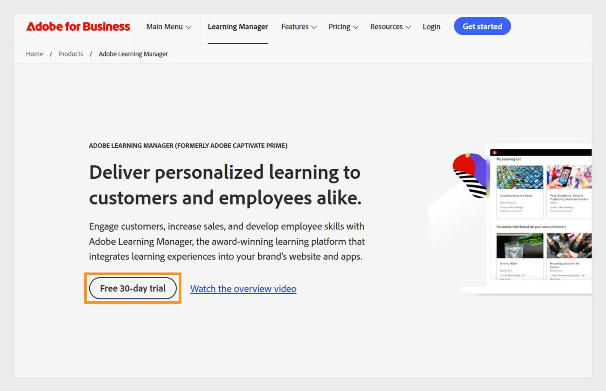

# Een proefaccount maken in Adobe Learning Manager

U kunt in Adobe Learning Manager eenvoudig een gratis proefaccount van 30 dagen instellen om functies te verkennen en leerworkflows te testen. In deze handleiding wordt uitgelegd waar u begint, hoe u zich aanmeldt en hoe u uw accountgegevens kunt vinden nadat u deze hebt ingesteld.

Een proefaccount maken:

1. Ga naar [ Adobe Learning Manager ](https://business.adobe.com/products/learning-manager/adobe-learning-manager.html).
2. Selecteer **[!UICONTROL Vrije proefversie van 30 dagen]**.

   

3. Selecteer **[!UICONTROL creeer een rekening]** op de login pagina.

   

4. Typ uw **[!UICONTROL E-mailadres]** en **[!UICONTROL Wachtwoord]**.

   

5. Typ de volgende details en selecteer **[!UICONTROL Create rekening]**:
   * Voornaam
   * Achternaam
   * Geboortedatum

   

6. Typ het formulier en vul het in met de vereiste gegevens om uw proefaccount in te stellen.
7. Zoek na de installatie uw account-id in de URL van uw Adobe Learning Manager-URL.

   

