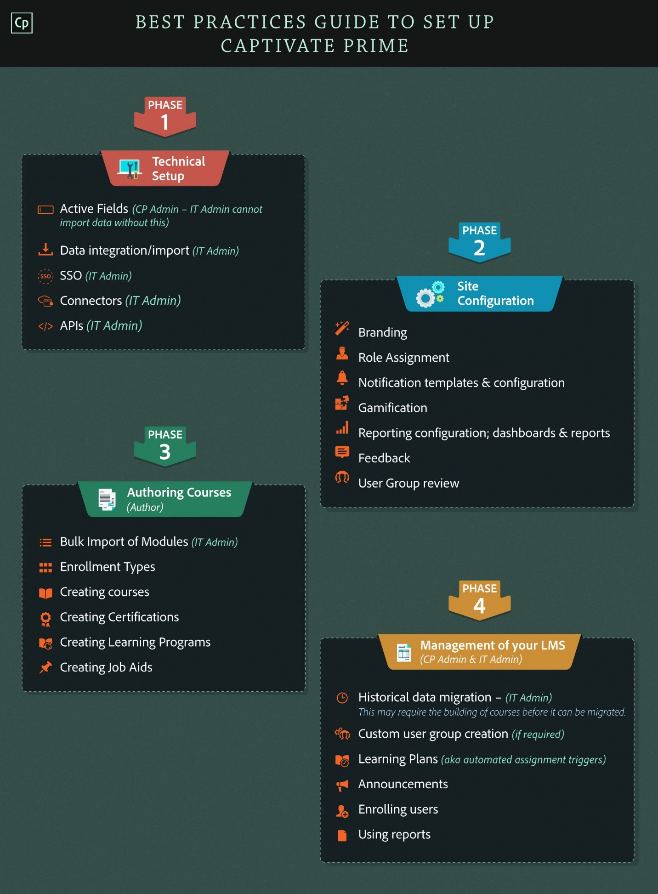
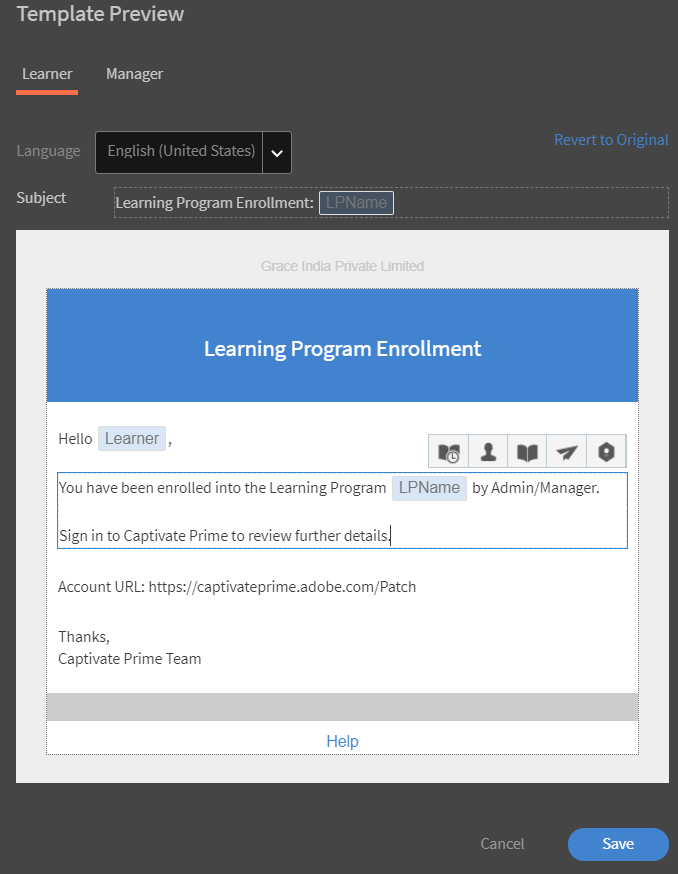
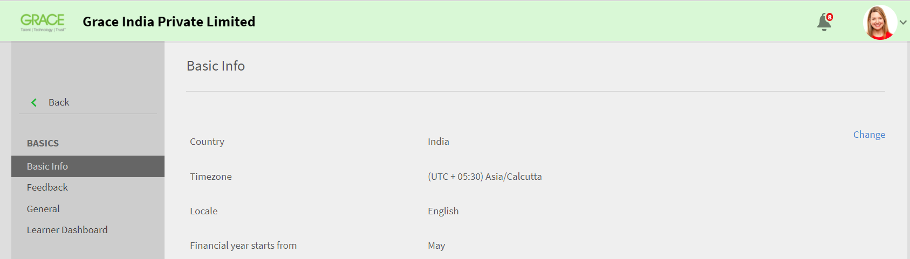
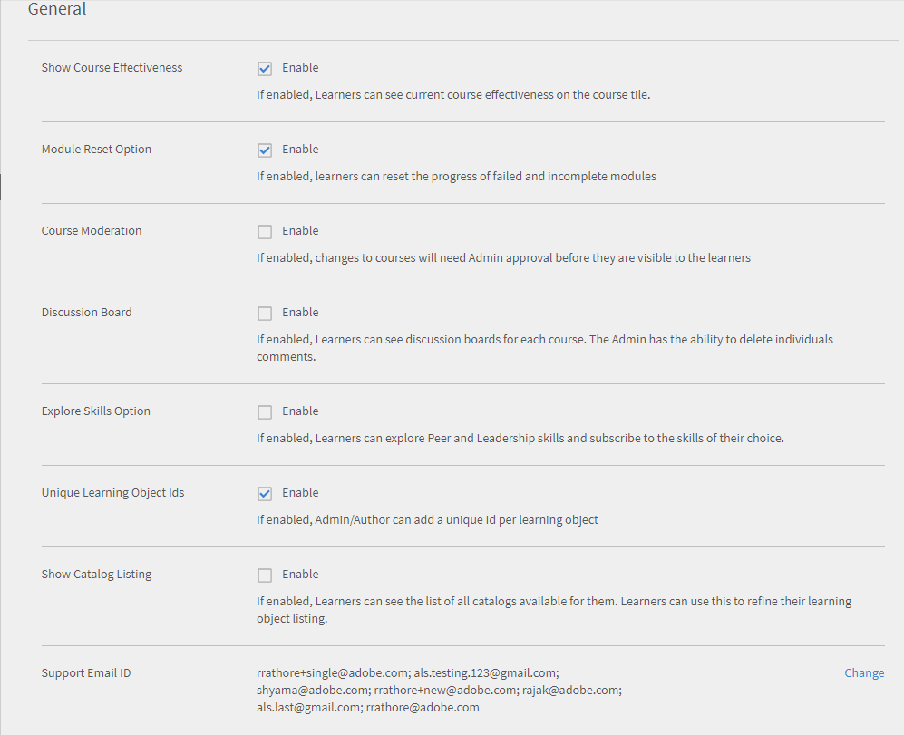

# Learning Manager Deployment Gids

## Inleiding {#introduction}

Learning Manager is een LMS (Learning Management System) waarmee trainingsprofessionals aansprekend en aanpasbaar leermateriaal kunnen leveren dat kan bijdragen aan de behoeften of doelstellingen van een organisatie. Met Learning Manager kunnen voornamelijk trainers of managers cursussen en andere leerobjecten, in een bepaalde volgorde, toewijzen aan studenten. Deze tool biedt ook verschillende krachtige functies, waaronder een Fluidic Player in meerdere formaten, gamification, badges en een gebruiksvriendelijk studentendashboard. Het is echter essentieel om eerst Learning Manager te configureren en in te stellen om gebruik te kunnen maken van deze functies.

Deze handleiding biedt stapsgewijze instructies om aan de slag te gaan met Learning Manager. Dit document biedt ook gedetailleerde informatie over de configuratie. Lees verder om te weten te komen hoe u aan de slag kunt gaan met Learning Manager.

## Voor wie is deze handleiding bedoeld? {#whoisthisguideintendedfor}

Als Learning Manager-gebruiker kunt u de rol van beheerder, auteur, docent, manager of student op u nemen. Deze handleiding is bedoeld voor gebruikers die waarschijnlijk betrokken zijn bij het opzetten van een LMS voor een organisatie of een klant:

* **IT-beheerder** - Als ICT-beheerder kunt u Learning Manager activeren of integreren in uw organisatie. Een IT-beheerder kan ook enkele of meerdere gebruikers toevoegen en kan de rol vervullen van een integratiebeheerder of een beheerder die Learning Manager integreert met toepassingen van derden.
* **Auteur** - Als auteur van een leermanager kunt u leerinhoud maken die vereist is voor de leervereisten van een organisatie. Een auteur is betrokken bij het maken van de basisinhoud die wordt geüpload in Learning Manager.

* **Beheerder van Learning Manager** - Een leermanbeheerder voert de configuratie- en instellingsactiviteiten uit die betrekking hebben op de toepassing. Bij sommige bedrijven kan een IT-beheerder ook de rol van Learning Manager-beheerder op zich nemen.

## Aan de slag met de implementatie van Learning Manager {#getstartedwithcaptivateprimedeployment}

Nadat u Learning Manager heeft gekocht, activeert u uw Learning Manager-account met de licentiesleutel die u hebt ontvangen. Ga verder met de volgende configuraties, zoals hieronder aangegeven:

## Uw site configureren in Learning Manager {#configureyoursiteincaptivateprime}

Voordat u begint met het toevoegen en implementeren van leerobjecten in Learning Manager, zijn er enkele belangrijke configuraties vereist. Begin met het configureren van uw site voor uw organisatie. Siteconfiguratie bestaat uit de volgende stappen:

* Branding en logo instellen voor uw organisatie
* E-mailsjablonen configureren
* Basisaccountinstellingen configureren
* Feedbackinstellingen configureren
* Instellingen voor het studentendashboard configureren

### Branding en logo instellen {#setupbrandingandlogo}

Als beheerder kunt u de branding en de thema&#39;s instellen zodat deze aansluiten bij de brandvereisten van uw organisatie. Ga als volgt te werk om de branding en thema&#39;s voor uw site in te stellen:

### Het logo en de banner instellen: {#settingthelogoandbanner}

Gebruik de logo- en bannerinstellingen om het logo van uw bedrijf weer te geven in Learning Manager. Configureer de brandingopties om het domein van het bedrijf in de URL in te stellen, de organisatienaam weer te geven en kleurenschema&#39;s weer te geven die overeenkomen met het merk van de organisatie. De brandinginstellingen configureren:

* Meld u als beheerder bij uw Learning Manager-account aan.
* Klik in het linkerdeelvenster op **Branding**.
* Op de pagina Branding kunt u de volgende opties configureren door op **Bewerken** te klikken naast de optie die u wilt wijzigen:

   * **Naam organisatie** : De waarde die u hier opgeeft, bepaalt de naam die op de banner op elke pagina van uw site wordt weergegeven.
   * **Subdomein**: Deze waarde bepaalt de URL voor uw site.
   * **Logostijlen**: De afbeelding in dit veld verschijnt als het logo in de rechterbovenhoek van elke pagina. Hier kunt u kiezen of u alleen het logo of de naam van uw organisatie wilt weergeven, of het logo en de naam van de organisatie.

>[!NOTE]
>
>U kunt de naam en het logo alleen configureren met Branding. U kunt de positie van het logo of de afbeelding niet wijzigen.

***Learning Manager ondersteunt de volgende bestandsindelingen voor logo-afbeeldingen: .png, .jpeg, .jpg, .gif, .bmp***

### De thema&#39;s voor uw site instellen {#settingthethemesforyoursite}

Met Learning Manager kunt u het uiterlijk van uw site wijzigen met behulp van thema&#39;s. De toepassing biedt de volgende kleurenthema&#39;s waaruit u kunt kiezen:

* Prime-standaard
* Kiezels
* Carnaval
* Herfst
* Winterlucht

U kunt een van de kleurenschema&#39;s kiezen die passen bij uw bedrijfsmerk.

1. **&#x200B;**
1. Klik in het gedeelte **Thema&#39;s** op **[!UICONTROL Bewerken]**. Met de toepassing kunt u een nieuw thema kiezen. Terwijl u een thema selecteert, ziet u meteen de kleurenschema&#39;s die worden gebruikt voor de belangrijkste interface-elementen.

   

1. U kunt de opdracht **Kleur bovenste balk**, **Accentkleur** en de **Helderheid zijbalk**.  U kunt uw eigen merkkleuren gebruiken voor deze belangrijke interface-elementen.
1. Klik op **[!UICONTROL Thema opnieuw instellen]** om de waarden terug te zetten naar het standaardkleurenschema voor uw thema. De kleuren voor de belangrijkste UI-elementen zijn ingesteld op de standaardopties voor het gekozen thema.
1. Nadat u het thema hebt gekozen, klikt u op **[!UICONTROL Hints weergeven]** om de labels of hints in het voorbeeld te bekijken.

   

   U ziet een diavoorstelling met verschillende afbeeldingen in het gedeelte **Thema&#39;s**. Met deze diavoorstelling kunt u direct een voorbeeld van het thema of kleurenschema bekijken. U kunt direct een voorbeeld van geselecteerde pagina&#39;s bekijken, zoals de startpagina, het studentendashboard enzovoort.

1. Als u een voorbeeld van de wijzigingen in een browser wilt bekijken, klikt u op **[!UICONTROL Livevoorbeeld]**. Het pop-upvenster Voorbeeld van livethema wordt weergegeven, waar u het kleurenschema kunt wijzigen of verder kunt gaan met de standaardopties. Als u een voorbeeld van uw opties in een browser wilt bekijken, klikt u op **[!UICONTROL Voorbeeld]** in dit pop-upvenster.

   

1. De gekozen opties worden tijdelijk toegepast op uw site. Als u het geselecteerde thema en de kleurinstellingen wilt opslaan, klikt u op **[!UICONTROL Toepassen]**.
1. Nadat u een thema hebt geselecteerd en toegepast, klikt u op **&#x200B;**&#x200B;[!UICONTROL Opslaan]&#x200B;**&#x200B;** om uw keuze op te slaan.

## E-mailsjablonen configureren {#configureemailtemplates}

Als beheerder is uw volgende stap het configureren van e-mailsjablonen voor verschillende gebeurtenissen. U kunt e-mailsjablonen die naar gebruikers worden verzonden, in-, uitschakelen en wijzigen. Er zijn drie hoofdcategorieën van e-mailsjablonen:

* Algemene e-mailsjablonen: deze e-mails worden geactiveerd voor algemene gebeurtenissen. Bijvoorbeeld een welkomstbericht wanneer een gebruiker zich voor de eerste keer aanmeldt.
* E-mailsjablonen die zijn gekoppeld aan een leerobject of -activiteit: deze e-mails worden verzonden naar studenten, auteurs of managers wanneer er een leeractiviteit is. Bijvoorbeeld e-mails die worden geactiveerd na cursusinschrijving, deelname in het klaslokaal, cursusvoltooiing, enzovoort.
* Herinneringen en updates: deze e-mails worden geactiveerd wanneer gebruikers updates of herinneringen nodig hebben voor een gebeurtenis. Bijvoorbeeld een student die een herinnering ontvangt voor een aankomende cursus of een beheerder die een e-mailmelding ontvangt voor een gedeeld rapport.

U kunt elk van deze e-mailmeldingen inschakelen en configureren vanuit het dashboard Beheerder. Voer de volgende stappen uit om te leren hoe u e-mailsjablonen instelt:

1. Klik in het linkerdeelvenster op **[!UICONTROL **&#x200B; E-mailsjablonen &#x200B;**.]**
1. Klik op een van de volgende tabbladen:**[!UICONTROL ** Algemeen **/** Leeractiviteit **/** Herinneringen en updates **.]** Laten we er bijvoorbeeld van uitgaan dat u op **[!UICONTROL **&#x200B; Leeractiviteit &#x200B;**.]**
1. Klik op de wisselknop voor de activiteit waarvoor u een e-mail wilt activeren. In dit voorbeeld, veronderstellen wij u klikt **[!UICONTROL **&#x200B; Leerprogramma - Ingeschreven door beheerder/manager &#x200B;**.]**

   

   Het systeem geeft het pop-upbericht &quot;Ingeschakeld met succes&quot; weer. Wanneer een manager of beheerder een student nu inschrijft voor een cursus, ontvangt de student een e-mail van dit Learning Manager-account.

1. U kunt het standaard e-mailsjabloon wijzigen. Klik hiervoor op de gebeurtenis. In dit voorbeeld klikt u op **[!UICONTROL Leerprogramma - Ingeschreven door beheerder/manager.]**
1. In het dialoogvenster **[!UICONTROL Sjabloonvoorbeeld]** weergegeven, ziet u twee tabbladen: [!UICONTROL Student] en [!UICONTROL Manager].

   

   Klik voor elk van deze tabbladen op de hoofdtekst van de e-mail om de inhoud te wijzigen. Klik op **[!UICONTROL Opslaan]** om de wijzigingen in het e-mailsjabloon op te slaan.

   Wanneer een student nu door de manager of de beheerder wordt ingeschreven voor een cursus, ontvangen de student en de manager een e-mailmelding.

   ***Opmerking: de wijzigingen zijn alleen van toepassing op de e-mailsjabloon die is gekoppeld aan de geselecteerde gebeurtenis.***

1. U kunt de account-URL of de handtekening in het e-mailsjabloon niet wijzigen. Om de **[!UICONTROL account-URL]** of **[!UICONTROL handtekening]** te wijzigen, klikt u op het tabblad **[!UICONTROL Instellingen]**. Op dit tabblad kunt u de e-mailbanner, e-mailhandtekening en de account-URL wijzigen.

   De link van de account-URL wordt in alle e-mails weergegeven, vlak voor de handtekening. Voer de gewenste URL in en klik op **[!UICONTROL Opslaan]**. Deze URL is alleen zichtbaar voor de interne gebruikers.

   Voor E-mailbanner kunt u de kleur van de banner wijzigen door  **[!UICONTROL **&#x200B; Bannerachtergrond &#x200B;**.] **&#x200B; U kunt een aangepaste afbeelding ook als een banner gebruiken door het &#x200B;** [!UICONTROL Aangepaste afbeelding] **&#x200B; gebruiken. Klikken  &#x200B;** [!UICONTROL Opslaan]** na het aanbrengen van de wijzigingen.

   ***Opmerking: de aangepaste afbeeldingsgrootte voor de e-mailbanner moet 1240 x 200 px zijn. Afbeeldingen die groter zijn dan de aanbevolen grootte, worden uitgesneden.***

   ***Learning Manager ondersteunt alleen .jpg-, .jpeg- en .png-bestandstypen voor e-mailbanners.***

   

1. U kunt er ook voor kiezen om Optionele manager-e-mails in te schakelen. Als u **[!UICONTROL Inschakelen]** selectievakje, wanneer een direct rapport een e-mail van dit Prime-account ontvangt, wordt de manager ook opgenomen in de mailinglijst.

   ***Opmerking: De instellingen op dit tabblad zijn van toepassing op alle sjablonen, globaal.***

### E-mailsjablonen configureren voor een leerobject {#configureemailtemplatesforalearningobject}

Naast het instellen van e-mailsjablonen op globaal niveau, kunt u als beheerder ook e-mailsjablonen configureren voor een specifiek leerobject. In dit geval zijn alle wijzigingen die u aanbrengt in het e-mailsjabloon alleen van toepassing op dat leerobject.

Deze optie is ook beschikbaar voor auteurs, wanneer ze een leerobject instellen.

E-mailsjablonen configureren voor een leerobject:

1. Klik op de cursus, het leerprogramma of de certificering waarvoor u het e-mailsjabloon wilt configureren.
1. Klik in het linkerdeelvenster op **[!UICONTROL **&#x200B; E-mailsjablonen &#x200B;**.] **&#x200B; Het systeem geeft het pop-upvenster &#x200B;**&#x200B;**[!UICONTROL Voorbeeld van sjabloon]**&#x200B;** weer.
1. Wijzig het onderwerp of de hoofdtekst van de e-mailsjabloon en klik op **[!UICONTROL **Opslaan**]**&#x200B;om de wijzigingen toe te passen.
1. Klik op **[!UICONTROL **&#x200B; Origineel herstellen &#x200B;**.]**

### Gebruikers beperken in het ontvangen van e-mails {#restrictusersfromreceivingemails}

Als beheerder kunt u selecteren wie e-mails van Learning Manager ontvangt. U kunt dit bereiken met de **&#x200B;**&#x200B;[!UICONTROL Beperkte gebruiker]&#x200B;**&#x200B;** optie onder **&#x200B;**&#x200B;[!UICONTROL Instellingen] **&#x200B; **&#x200B;tab. Voeg gebruikers toe door hun naam, e-mail-ID of unieke gebruikers-ID op de lijst te zetten. De gebruikers die onder deze optie worden vermeld, worden beperkt in het ontvangen van e-mailcommunicatie van Learning Manager.

## Uw accountinstellingen configureren {#configureyouraccountsettings}

Met Learning Manager kunt u een aantal accountinstellingen configureren, zoals basisinstellingen, feedbackinstellingen, algemene instellingen en instellingen voor het studentendashboard. In de volgende procedures wordt beschreven hoe u elk van deze instellingen kunt configureren:

### Basisinstellingen configureren {#configurebasicsettings}

1. Klik op de startpgina van Learning Manager op **&#x200B;**&#x200B;[!UICONTROL Instelllingen]&#x200B;**&#x200B;**. Standaard geeft het systeem de pagina Basisgegevens weer, met de standaardtaal en locatievelden.
1. Klik op **&#x200B;**&#x200B;[!UICONTROL Wijzigen]&#x200B;**&#x200B;** in de rechterbovenhoek van de pagina om de basisgegevens te bewerken.
1. Configureer de volgende opties:

   * **Land**: selecteer het land in dit vervolgkeuzeveld.
   * **Tijdzone**: stel de juiste tijdzone in voor uw locatie.
   * **Landinstellingen**: selecteer de gewenste taal. Als u de taal in dit veld wijzigt, wordt de wijziging toegepast op alle gebruikers die deze toepassing gebruiken. Elke gebruiker kan echter afzonderlijk de taal van de voorkeur wijzigen.
   * **Boekjaar start vanaf**: selecteer de maand waarin het boekjaar voor uw organisatie begint.

   

## Feedbackinstellingen configureren {#configurefeedbacksettings}

Met Learning Manager kunt u feedback van studenten verzamelen voor een cursus. Het is ook mogelijk om feedback over studenten te verzamelen met Learning Manager. U moet eerst de feedbacktypes L1 en L3 configureren om feedback te krijgen.

L3-feedback is de feedback die een manager geeft over een student. U kunt dit type feedback gebruiken om de prestaties van de studenten in de loop der tijd te volgen. L1-feedback is de feedback die een student geeft over een cursus. Dit type feedback helpt een beheerder om directe feedback over een cursus te verzamelen.

Als beheerder kunt u de feedbackinstellingen globaal configureren. Volg hiervoor deze procedure:

1. Klik op de startpagina van Learning Manager op **[!UICONTROL Instellingen]**.
1. Klik in het linkerdeelvenster op **[!UICONTROL Algemeen]**.
1. Klik op de knop **[!UICONTROL L1-feedback]** tabblad. U ziet de opties om één verplichte vraag en meerdere optionele vragen in te stellen. Dit zijn de vragen die een student bekijkt terwijl hij/zij feedback geeft na het voltooien van een cursus. De vragen zijn geformuleerd als instructies, zodat studenten hun antwoord op een schaal van 1 tot 5 kunnen selecteren.

   Het eerste deel van de L1-feedback is een verplichte vraag hoe een student deze cursus aan een vriend of collega kan aanbevelen.

   ***Opmerking: u kunt de verplichte vraag niet bewerken of wijzigen.***

   

1. Om de andere vragen voor uw feedbackvragenlijst te configureren, klikt u op de vragen in de **&#x200B;**&#x200B;[!UICONTROL cursussen op eigen tempo]&#x200B;**&#x200B;** of **&#x200B;**&#x200B;[!UICONTROL klassikale cursussen]&#x200B;**&#x200B;**. Wanneer u op een vraag klikt, kunt u de standaardvragen bewerken.

   

1. U kunt de standaardvragen in- of uitschakelen, of de standaardvragen volledig naar wens aanpassen. U kunt bijvoorbeeld de standaardvraag &quot;De trainingsvraag was relevant voor mij&quot; verwijderen en de vraag vervangen door &quot;Ik vond de training nuttig en relevant.&quot;
1. Nadat u de vragen voor studenten hebt voltooid, kunt u de herinneringsinstellingen configureren. Standaard is er een bestaande herinnering, waarbij de toepassing automatische herinneringen naar studenten stuurt bij een succesvolle afronding van een cursus. Deze herinnering wordt ook elke twee weken herhaald totdat de student reageert. U kunt de bestaande herinnering wijzigen door op de herinnering te klikken, of een nieuwe herinnering toevoegen.

   

1. Configureer de herinneringsinstellingen door de volgende opties te voltooien:

   * **Wanneer te verzenden**: geef aan of u de feedbackaanvraag wilt verzenden bij voltooiing van de cursus of na voltooiing van de cursus.
   * **Dagen na voltooiing**: Geef het aantal dagen op waarna u de feedbackaanvraag wilt verzenden. Dit veld is alleen zichtbaar als **&#x200B;**&#x200B;[!UICONTROL Na cursusvoltooiing]&#x200B;**&#x200B;** is geselecteerd.

   * **Herhaling**: geef aan of u de feedbackherinnering elke dag, elke week of elke maand wilt verzenden. U kunt ook aangeven hoeveel weken de herinnering moet worden verzonden.

1. Klik op het vinkje om uw herinneringsinstellingen op te slaan.
1. Klik op ** nadat u alle feedbackinstellingen hebt voltooid [!UICONTROL **Opslaan**]**rechtsboven op de pagina.

## L3-feedback configureren: {#configurel3feedback}

L3-feedback bevat de vragen die naar de manager van een student worden verzonden nadat de student een cursus heeft voltooid. Met L3-feedback kan een beheerder wijzigingen bijhouden in het gedrag of de vaardigheid van een student in de loop der tijd. Klik op de pagina Feedback op het tabblad **&#x200B;**&#x200B;[!UICONTROL L3-feedback]&#x200B;**&#x200B;** om deze feedback te configureren. U ziet één standaardvraag. De manager moet deze vraag beantwoorden met een beoordelingsschaal van vijf punten.

U kunt de herinneringen voor L3-feedback configureren, net als bij de L1-feedback. U kunt de bestaande herinnering wijzigen of een nieuwe feedbackherinnering toevoegen.

Nadat u de feedbackvraag en de herinneringsinstellingen hebt voltooid, klikt u op **&#x200B;**&#x200B;[!UICONTROL Opslaan]&#x200B;**&#x200B;** om uw instellingen toe te passen.

## Feedback configureren op instantieniveau {#configurefeedbackataninstancelevel}

In de vorige procedure zijn de stappen beschreven om de feedbackinstellingen op globaal niveau te configureren. Dat wil zeggen dat de instellingen worden toegepast op alle cursussen. Naast deze algemene vragen kunt u als beheerder of auteur aanvullende L1- en L3-feedbackvragen configureren op instantieniveau.

De feedbackinstellingen configureren op instantieniveau:

1. Klik op de startpagina van Learning Manager op **[!UICONTROL Cursussen]**.
1. Beweeg over de cursus waar u de feedbackinstellingen wilt configureren. Klikken [!UICONTROL **Cursus weergeven**.]

   

1. Klik op de pagina met cursusgegevens op **[!UICONTROL Standaardinstellingen voor instanties]** in de sectie Configureren.
1. In het dialoogvenster [!UICONTROL **Taal**] de taal waarin u de feedbackvragenlijst wilt weergeven.
1. Schakel de L1-reactiefeedback in als u feedback van studenten wilt krijgen. U kunt maximaal twee vragen toevoegen in dit gedeelte. Studenten kunnen beschrijvende antwoorden op deze vragen geven.
1. Schakel het selectievakje **[!UICONTROL Verplicht maken]** in als u een of beide vragen verplicht wilt stellen.
1. Selecteer **[!UICONTROL Vragenlijst direct na cursusvoltooiing tonen]** als u wilt dat studenten de feedbackvragenlijst direct na voltooiing van de cursus kunnen zien.

   

1. De L3-feedback over gedragswijziging op instantieniveau configureren **&#x200B;**&#x200B;[!UICONTROL Inschakelen]&#x200B;**&#x200B;** de L3-feedback. De toepassing toont een vooraf gedefinieerde, verplichte vraag en een vraag die u zelf kunt invullen.
1. Voor de vooraf gedefinieerde vraag over de verbetering van de student na het volgen van de cursus, heeft het antwoord de Likert-schaal-indeling. Dat wil zeggen dat managers een optie moeten kiezen op een schaal van zeer mee eens tot zeer oneens.
1. Geef de tweede vraag voor de manager op. Managers kunnen op deze vraag een beschrijvend antwoord geven.
1. Schakel het selectievakje **&#x200B;**&#x200B;[!UICONTROL Verplicht maken]&#x200B;**&#x200B;** in als u de tweede vraag verplicht wilt stellen.

   

1. Configureer optioneel de herinneringsinstellingen op instantieniveau. Als u hier geen herinneringsinstellingen configureert, worden de algemene herinneringsinstellingen automatisch toegewezen.
1. Klik op ** nadat u de feedbackvragen en de herinneringsinstellingen hebt voltooid [!UICONTROL **Opslaan**]**om uw instellingen toe te passen.

   ***Opmerking: feedbackinstellingen zijn niet van toepassing op certificeringen.***

## Algemene instellingen configureren {#configuregeneralsettings}

Met de algemene instellingen in Learning Manager kunnen beheerders algemene instellingen configureren die van invloed zijn op andere functies in de toepassing. U kunt bijvoorbeeld algemene instellingen gebruiken om aan te geven of de cursuseffectiviteit zichtbaar kan worden gemaakt voor studenten. De algemene instellingen configureren:

1. Klik op de startpagina van Learning Manager op **&#x200B;**&#x200B;[!UICONTROL Instelllingen]&#x200B;**&#x200B;**.
1. Klik in het linkerdeelvenster op **&#x200B;**&#x200B;[!UICONTROL Algemeen]&#x200B;**&#x200B;**.
1. Op de pagina Algemene instellingen kunt u de volgende opties configureren:

   Voor al deze opties varieert de functie die elke optie beïnvloedt. Indien nodig, kunnen we crosslinks geven naar elk van de gedetailleerde functies.

   * **Cursuseffectiviteit weergeven**: schakel deze optie in als u wilt dat studenten de effectiviteit van een cursus op de cursustitel zien.
   * **Optie voor module herstellen**: schakel deze optie in als u studenten de mogelijkheid wilt geven om een module te herstellen. Studenten kunnen dan hun modules herstellen als ze deze niet hebben gehaald, of als ze de module gedeeltelijk hebben voltooid en opnieuw willen beginnen.
   * **Cursusmoderatie**: schakel deze optie in als u wilt dat de wijzigingen in een cursus worden goedgekeurd door een beheerder voordat de wijzigingen zichtbaar zijn voor studenten.
   * **Discussieboard**: schakel deze optie in als u wilt dat studenten discussieboards voor cursussen kunnen zien en gebruiken. Als u het selectievakje **Discussiebord** inschakelt, kunnen de studenten en docenten opmerkingen plaatsen voor cursussen. Als de instellingen op cursusniveau echter aangeven dat deze functie niet is geselecteerd, hebben deze instellingen voorrang op de beheerdersinstellingen.

   * **De optie Vaardigheden ontdekken**: schakel deze optie in als u wilt dat studenten vaardigheden van collega&#39;s en leidinggevenden kunnen ontdekken.
   * **Unieke leerobject-ID&#39;s**: schakel deze optie in als u auteurs de mogelijkheid wilt geven om unieke ID&#39;s aan leerobjecten toe te voegen.
   * **Cataloguslijst weergeven**: schakel deze optie in als u wilt dat studenten alle beschikbare catalogi kunnen zien. Met deze optie kunnen studenten hun lijst met leerobjecten verfijnen.

   

## Instellingen voor het studentendashboard configureren {#configurelearnerdashboardsettings}

Op het studentendashboard in Learning Manager kunnen studenten hun verplichte en aanbevolen cursussen bekijken, naast hun prestaties, vaardigheden en aankondigingen. Beheerders kunnen bepalen hoe dit studentendashboard eruit moet zien door de instellingen voor het studentendashboard te configureren. Met deze instellingen kunnen beheerders de widgets op de pagina Student instellen. Met deze instellingen wordt ook bepaald hoe en waar de widgets op het studentendashboard worden geplaatst. Als beheerder kunt u een voorbeeld van de lay-out van het studentendashboard bekijken voordat u de instellingen toepast.

1. Klik op de startpagina van Learning Manager op **[!UICONTROL Instellingen]**.
1. Klik in het linkerdeelvenster op **[!UICONTROL **&#x200B; Studentendashboard &#x200B;**.]**
1. Selecteer de widgets die u wilt inschakelen. Als u een widget deselecteert, wordt de widget onmiddellijk uit het voorbeeld verwijderd. Studenten kunnen deze widget niet in hun dashboard zien.
1. Klik op **&#x200B;**&#x200B;[!UICONTROL Opslaan]&#x200B;**&#x200B;** om de instellingen toe te passen.

   

1. Klik op **[!UICONTROL Standaardinstellingen herstellen.]** In dit geval zijn alle widgets behalve **[!UICONTROL welkomstberichten en sticky-aankondigingen]** zichtbaar.

   ***Zelfs nadat u de instellingen voor het Studentendashboard hebt ingeschakeld, kunnen studenten widgets in hun respectieve dashboards wijzigen en verplaatsen.***

