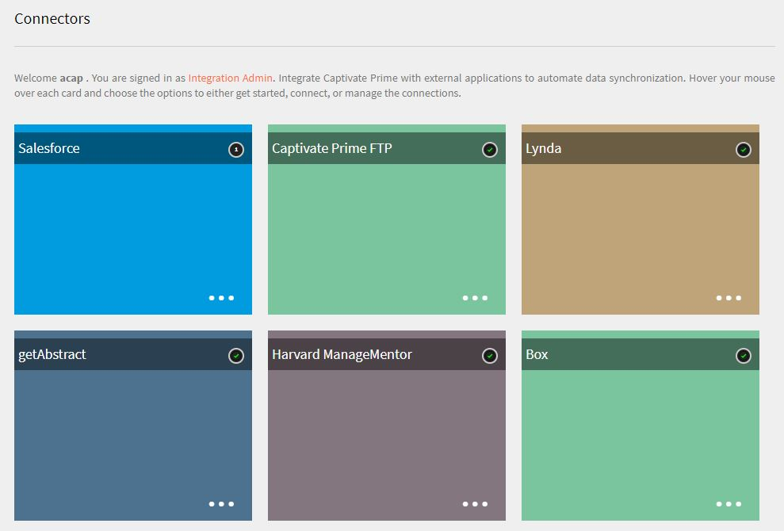
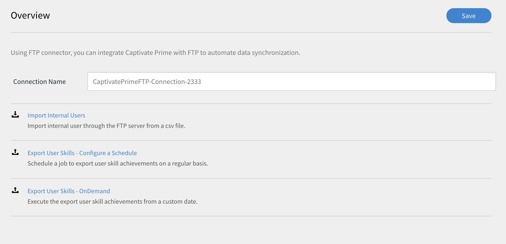
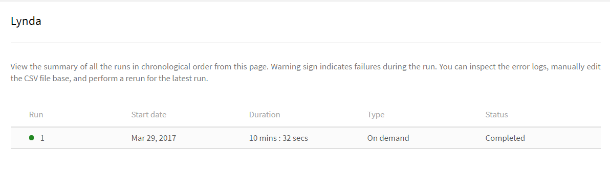

# Connectoren van Learning Manager

Leer hoe u Salesforce met Learning Manager integreert met behulp van connectoren, hoe u FTP integreert met Learning Manager en CSV automatisch uploadt met behulp van FTP-connector.

Ondernemingen hebben andere toepassingen en systemen die mogelijk moeten worden geïntegreerd met Learning Manager. Connectoren zijn hulpprogramma&#39;s die helpen bij het uitvoeren van op data gebaseerde integraties, zoals het importeren van gegevens in Learning Manager van externe systemen of het exporteren van gegevens naar externe systemen vanuit Learning Manager. In de release van juli 2016 hebben de connectoren alleen de mogelijkheid om gebruikers in bulk te importeren voor Learning Manager van externe systemen.

Learning Manager biedt Salesforce- en FTP-connectoren. Met behulp van de Salesforce-connector kunnen integratiebeheerders van een organisatie hun Salesforce-toepassing integreren met Learning Manager. Als integrator kunt u ook de FTP-connector gebruiken om automatisch een set gebruikers te importeren in uw bedrijfstoepassing.

Learning Manager biedt ook de Lynda-, getAbstract- en de Harvard Management System-connectoren waarmee studenten cursussen kunnen openen en volgen via Lynda.com, getAbstract en Harvard ManageMentor.

Lees verder om te weten te komen hoe u elk van deze connectoren in Learning Manager configureert en gebruikt.

## Salesforce-connector {#sfconnector}

De Salesforce-connector verbindt Learning Manager- en Salesforce-accounts om de synchronisatie van gegevens te automatiseren. De mogelijkheden van de Salesforce-connector zijn als volgt:

### Kenmerken toewijzen

De integratiebeheerder kan Salesforce-kolommen kiezen en deze toewijzen aan de groepeerbare kenmerken van de overeenkomstige Learning Manager. Dit is een eenmalige inspanning. Zodra de toewijzing is voltooid, wordt dezelfde toewijzing gebruikt in volgende gebruikersimporten. Het kan opnieuw worden geconfigureerd als de beheerder een andere toewijzing voor het importeren van gebruikers wil hebben.

### Geautomatiseerde gebruikersimport

Via het proces voor gebruikersimport kan de beheerder van de leermanager werknemersgegevens ophalen uit Salesforce en deze automatisch importeren in Learning Manager. Deze automatisering voorkomt de handmatige inspanning die nodig is om CSV te maken en te uploaden naar Learning Manager.

### Automatisch plannen

Het kan effectief zijn om de functie voor automatische planning samen met de functie voor geautomatiseerde gebruikersimport te gebruiken. De beheerder van de leermanager kan een planning instellen op basis van de behoeften van de organisatie. Gebruikers in de toepassing Leermanager kunnen volgens het schema up-to-date zijn. Synchronisatie kan dagelijks worden uitgevoerd in de toepassing Learning Manager.

### Gebruikers filteren

De beheerder van de leermanager kan filteren op de gebruikers toepassen voordat deze worden geïmporteerd. Zo kan de beheerder van de leermanager ervoor kiezen om alle gebruikers in de hiërarchie onder een of meer specifieke managers te importeren.

## Salesforce-connector configureren {#configuresalesforceconnector}

Leer het proces voor de integratie van Learning Manager met Salesforce.

### Voorwaarden {#prerequisites}

Zorg ervoor dat u de URL van uw Salesforce-organisatie bij u hebt. Als uw organisatie bijvoorbeeld de naam **myorg** kan de Salesforce-URL [https://myorg.salesforce.com](https://myorg.salesforce.com/). Dit is de enige invoer die nodig is om een Salesforce-account te verbinden met Learning Manager.

Zorg er ook voor dat u de juiste aanmeldingsgegevens voor het account hebt.

## Een verbinding maken {#createaconnection}

1. Beweeg de muis over de Salesforce-kaart/-miniatuur op de startpagina van Learning Manager. Er verschijnt een menu. Klikken **[!UICONTROL Verbinden]** in het menu.

   

1. Er verschijnt een dialoogvenster waarin u wordt gevraagd de org-url in te voeren. Klikken **[!UICONTROL Verbinden]** nadat u de URL hebt opgegeven.
1. Als de verbinding tot stand is gebracht, wordt de pagina Voorbeeld weergegeven.

## Kenmerken toewijzen {#mapattributes}

Zodra de verbinding tot stand is gebracht, kunt u Salesforce-kolommen toewijzen aan de overeenkomstige kenmerken van Leerbeheer. Deze stap is verplicht.

1. Op de toewijzingspagina ziet u links de kolommen van de Leermanager en rechts de kolommen van Salesforce. Selecteer de juiste kolomnaam die is toegewezen aan de kolomnaam van de leermanager.

   

   De kolomgegevens van de leermanager die aan de linkerkant worden weergegeven, worden opgehaald uit de actieve velden. De **manager** veld moet noodzakelijkerwijs worden toegewezen aan een veld van het type e-mailadres. U moet alle kolommen toewijzen voordat u de connector kunt gebruiken.

1. Klikken **[!UICONTROL Opslaan]** na het voltooien van de toewijzing.
1. De connector is nu klaar voor gebruik. Het account dat nu is geconfigureerd, wordt als gegevensbron weergegeven in de beheerdersapp, zodat de beheerder het importeren kan plannen of kan synchroniseren op verzoek.

## De Salesforce-connector gebruiken {#usingsalesforceconnector}

De Salesforce-connector maakt verbinding met Salesforce.com om de geconfigureerde gebruikers op te halen en toe te voegen aan Learning Manager.

## Learning Manager FTP-connector {#ftpconnector}

Met behulp van de FTP-connector kunt u Learning Manager integreren met willekeurige externe systemen om de synchronisatie van gegevens te automatiseren. Naar verwachting kunnen externe systemen gegevens exporteren in een CSV-indeling en deze in de juiste map van het FTP-account van Learning Manager plaatsen. De mogelijkheden voor FTP-connector zijn als volgt:

U kunt ook de Box-connector gebruiken voor gegevensmigratie, gebruikersimport en gegevensexport. Zie voor meer informatie [Box connector.](third-party-connectors.md#main-pars_header_302653946)

## Gegevens importeren {#dataimport}

Via het proces voor gebruikersimport kan de beheerder van de leermanager werknemersgegevens ophalen van de FTP-service van de Learning Manager en deze automatisch importeren in Learning Manager. Met deze functie kunt u meerdere systemen integreren door de door die systemen gegenereerde CSV in de juiste mappen van de FTP-accounts te plaatsen. De leermanager pakt de CSV-bestanden op, voegt deze samen en importeert de gegevens volgens de planning. Raadpleeg de planningsfunctie voor meer informatie.

**Kenmerken toewijzen**

De integratiebeheerder kan de kolommen van CSV kiezen en toewijzen aan de groepeerbare kenmerken van de Learning Manager. Deze toewijzing is een eenmalige inspanning. Zodra de toewijzing is voltooid, wordt dezelfde toewijzing gebruikt in volgende gebruikersimporten. De toewijzing kan opnieuw worden geconfigureerd als de beheerder een andere toewijzing voor het importeren van gebruikers wil hebben.

## Gegevens exporteren {#exportdata}

Met de functie voor het exporteren van gegevens kunnen gebruikers gebruikersvaardigheden exporteren naar een FTP-locatie om deze te integreren met een willekeurig extern systeem.

## Planning {#scheduling}

De beheerder kan planningstaken volgens de vereisten van de organisatie instellen en gebruikers in de toepassing Leermanager zijn up-to-date volgens de planning. Op dezelfde manier kan de integratiebeheerder de export van vaardigheden tijdig plannen om deze te integreren met een extern systeem. Synchronisatie kan dagelijks worden uitgevoerd in de toepassing Learning Manager.

## FTP-connector van Learning Manager configureren {#configurecaptivateprimeftpconnector}

Leer het proces om Learning Manager te integreren met de FTP-connector.

### Een verbinding maken {#Createaconnection-1}

1. Beweeg de muis over de FTP-kaart/miniatuur op de startpagina van Learning Manager. Er verschijnt een menu. Klikken **[!UICONTROL Verbinden]** in het menu.

   

1. Er verschijnt een dialoogvenster waarin u wordt gevraagd de e-mail-ID in te voeren. Geef de e-mail-ID op van de persoon die verantwoordelijk is voor het beheer van het FTP-account van de Learning Manager voor de organisatie. Klikken **[!UICONTROL Verbinden]** nadat u de e-mail-ID hebt opgegeven.
1. Leermanager stuurt u een e-mail waarin de gebruiker wordt gevraagd het wachtwoord opnieuw in te stellen voordat hij/zij voor het eerst toegang krijgt tot de FTP. De gebruiker moet het wachtwoord opnieuw instellen en dit gebruiken om toegang te krijgen tot het FTP-account van de Learning Manager.

   Er kan slechts één FTP-account voor LMS worden gemaakt voor een bepaald LMS-account.

   Op de overzichtspagina kunt u de verbindingsnaam voor uw integratie opgeven. Kies uit de volgende opties welke actie u wilt uitvoeren:

   * Interne gebruikers importeren
   * Gebruikersvaardigheden exporteren - Een planning configureren
   * Gebruikersvaardigheden exporteren - Op verzoek

   

## Importeren

+++ interne gebruiker

Met de optie Interne gebruiker importeren kunt u het genereren van een gebruikersimportrapport automatisch plannen. De gegenereerde rapporten worden als CSV-bestanden naar u verzonden.

+++

+++Kenmerken toewijzen

Zodra de verbinding tot stand is gebracht, kunt u de kolommen van de CSV-bestanden die in de FTP-map worden geplaatst, toewijzen aan de overeenkomstige kenmerken van Learning Manager. Deze stap is verplicht.

1. Op de pagina Kenmerken toewijzen ziet u links de verwachte kolommen van de leermanager en rechts de CSV-kolomnamen. In eerste instantie ziet u aan de rechterkant een leeg selectiekader. Een CSV-sjabloon importeren door te klikken **Bestand kiezen**.
1. In de bovenstaande stap worden alle CSV-kolomnamen aan de rechterkant van de vervolgkeuzelijst voor selectie toegevoegd. Selecteer de juiste kolomnaam die is toegewezen aan de kolomnaam van de leermanager.

   *Het veld Manager moet worden toegewezen aan een veld van het type e-mailadres. U moet alle kolommen toewijzen voordat u de connector kunt gebruiken.*

1. Klikken **[!UICONTROL Opslaan]** na het voltooien van de toewijzing.

   De connector is nu klaar voor gebruik. Het net geconfigureerde account wordt nu als gegevensbron weergegeven in de beheerdersapp zodat de beheerder het importeren kan plannen of het account op aanvraag kan synchroniseren.

+++

+++De FTP-connector van Learning Manager gebruiken

1. De CSV-bestanden van externe systemen moeten op het volgende pad worden geplaatst:

   `code $OPERATION$/$OBJECT_TYPE$/$SUB_OBJECT_TYPE$/data.csv`

   **Opmerking:** In de release van juli 2016 is alleen import van gebruikers toegestaan. Om de FTP-connector te kunnen gebruiken, moet u ervoor zorgen dat de CSV-bestanden in de volgende map worden geplaatst:

   `code Home/import/user/internal/*.csv`

1. De FTP-connector haalt alle rijen uit CSV-bestanden, dus het is belangrijk dat de rij die overeenkomt met een gebruiker in een CSV niet in andere CSV&#39;s wordt weergegeven.
1. Alle CSV&#39;s moeten de kolommen bevatten die in de toewijzing zijn opgegeven.
1. Alle vereiste CSV&#39;s moeten aanwezig zijn in de map voordat het proces begint.

Tijdens het importeren van gebruikers naar Leermanager moet de beheerder ook weten hoe gebruikers worden beheerd in Leerbeheer. Raadpleeg [Help bij gebruikersbeheer](../integration-admin/feature-summary/migration-manual.md#usermanagement) voor meer informatie.

+++

## Exporteren

+++Vaardigheden

Er zijn twee opties om vaardigheidsrapporten van de gebruiker te exporteren.

**[!UICONTROL Gebruikersvaardigheden - op verzoek]**: U kunt de startdatum opgeven en het rapport exporteren met de optie. Het rapport wordt geëxtraheerd vanaf de ingevoerde datum tot heden.

**[!UICONTROL Gebruikersvaardigheden - configureren]**: Met deze optie kunt u de extractie van het rapport plannen. Schakel het selectievakje Planning inschakelen in en geef de begindatum en -tijd op. U kunt ook opgeven met welk interval het rapport moet worden gegenereerd en verzonden.

+++

Als u de Exportmap wilt openen waarin de geëxporteerde bestanden op uw FTP-locatie worden geplaatst, opent u de koppeling naar de FTP-map op de pagina Gebruikersvaardigheden, zoals hieronder weergegeven.

De automatisch geëxporteerde bestanden zijn aanwezig op de locatie **Home/export/&#42;FTP_locatie&#42;**

De automatisch geëxporteerde bestanden zijn beschikbaar met de titel, **skill_results__&#42;datum vanaf &#42;_aan_&#42;datum tot&#42;.csv**

## Lynda-connector {#lyndaconnector}

De Lynda-connector kan worden gebruikt door zakelijke klanten van Lynda.com die graag willen dat hun studenten Lynda-cursussen kunnen zoeken en volgen vanuit Learning Manager. De connector kan worden geconfigureerd om periodiek cursussen op te halen van Lynda.com met uw API-sleutel. Zodra een cursus in Leermanager is gemaakt, kunnen gebruikers deze opzoeken en volgen. De voortgang van de student kan vervolgens worden bijgehouden in Leermanager.

### De Lynda-connector configureren {#configurethelyndaconnector}

1. Klik op Lynda in het dashboard van de integratiebeheerder.

   U ziet de tegel met drie opties: Aan de slag, Verbinden en Verbindingen beheren.

1. Klik op Verbinden als u de Lynda-connector voor het eerst configureert.

   U moet het Exavault FTP-account configureren voordat u deze connector configureert.

1. Geef een naam op voor uw connector vanaf de verbindingspagina. Voer de appsleutel en de geheime sleutel voor uw verbinding in.

   U moet contact opnemen met uw leverancier voor appsleutel en geheime sleutel.

1. Klik op Opslaan.

   De configuratie wordt opgeslagen en de Lynda-verbinding voor uw account wordt toegevoegd. U kunt nu vanaf de startpagina op Verbindingen beheren klikken en uw configuratie op elk gewenst moment bewerken.

1. Als u al een verbinding tot stand hebt gebracht, klikt u op Verbindingen beheren om al uw verbindingen weer te geven.

   De migratiefunctie moet zijn ingeschakeld voor uw account voordat u deze connector kunt configureren.

1. Klik op de verbinding die u wilt bewerken.
1. Klik in het linkerdeelvenster op Configureren. Voer een van de volgende handelingen uit:

   * Bekijk of bewerk de details van uw account en het synchronisatieschema vanuit dit venster. Als u dit account wilt inschakelen, moet u het selectievakje Verbinding inschakelen selecteren.
   * Klik op Bewerken en bewerk uw referenties. Klik op Herstellen om uw updates voor dit veld ongedaan te maken.
   * Klik op Planning inschakelen om uw synchronisatie te plannen. U kunt de begintijd en -datum invoeren en vervolgens de frequentie van uw synchronisatieplanning in dagen invoeren. Bijvoorbeeld, synchronisatie elke 3 dagen inschakelen.

   Klik op Opslaan om uw wijzigingen op te slaan.

   

1. Klik in het linkerdeelvenster op Uitvoering op verzoek. Met deze optie kunt u gebruikersfeeds en andere relevante gegevens importeren uit Lynda. Voer de startdatum in voor de uitvoering op verzoek en klik op Uitvoeren om de synchronisatie uit te voeren. Alle gegevens vanaf de startdatum tot heden worden geïmporteerd.

   * U kunt tijdens de uitvoering op Toegang tot Leermanager uitschakelen klikken, zodat de toepassing tijdens de synchronisatie een downtime krijgt.
   * Als u tijdens de uitvoering op Toegang tot Leermanager inschakelen klikt, is er geen onderbreking van de service tijdens de synchronisatie.

   

1. U kunt ook op elk moment op Uitvoeringsstatus in het linkerdeelvenster klikken om het overzicht van alle runs voor deze connector in chronologische volgorde weer te geven. U kunt de begindatum en de duur van de synchronisatie, het type synchronisatie (of het nu gaat om synchronisatie op verzoek) en de status van de synchronisatie (of de synchronisatie wordt uitgevoerd of is voltooid) bekijken.

   Wanneer u een verbinding verwijdert en opnieuw maakt, worden de vorige runs voor de connector opnieuw weergegeven. U kunt alle runs bekijken voordat u de verbinding hebt verwijderd.

   U kunt een herhaling alleen uitvoeren voor de laatste synchronisatie.

   

## getAbstract-connector {#getabstractconnector}

De getAbstract-connector kan worden gebruikt door zakelijke klanten van getAbstract.com, die graag willen dat hun studenten getAbstract-samenvattingen zoeken en volgen. De connector kan worden geconfigureerd om periodiek gebruiksgegevens op te halen, op basis waarvan voltooiingsrecords van studenten worden gemaakt in Learning Manager. Lees verder om te weten te komen hoe u deze connector in Learning Manager kunt configureren.

### De getAbstract-connector configureren {#configurethegetabstractconnector}

1. Klik op getAbstract in het dashboard voor geïntegreerde beheer.

   In de tegel ziet u drie opties: Aan de slag, Verbinden en Verbindingen beheren.

1. Klik op Verbinden als u de getAbstract-connector voor het eerst configureert.

   U moet het Exavault FTP-account configureren voordat u deze connector configureert.

   Zorg ervoor dat u deze FTP-gegevens deelt met uw inhoudsprovider om toegang te krijgen tot de feeds.

1. Voer in het veld Verbindingsnaam een naam voor uw verbinding in.

   Voer de juiste sleutels in de velden Client-id en Clientgeheim in. U moet mogelijk contact opnemen met uw leverancier om de juiste sleutels voor deze connector te verkrijgen.

   De toetsen zijn vereist om de metagegevens van de cursus te verkrijgen voor de cursussen die de client gebruikt.

1. Als er al een verbinding tot stand is gebracht, klikt u op getAbstract > Verbindingen beheren om uw bestaande configuratie te bekijken en te bewerken.

   De migratiefunctie moet zijn ingeschakeld voor uw account voordat u deze connector kunt configureren.

1. Klik op de verbinding waarvan u de configuratie wilt bekijken of bewerken.

   

1. Klik in het linkerdeelvenster op Configureren. Voer een van de volgende handelingen uit:

   * Bekijk of bewerk de details van uw account en het synchronisatieschema vanuit dit venster. Als u dit account wilt inschakelen, moet u het selectievakje Verbinding inschakelen selecteren.
   * Klik op Bewerken en bewerk uw referenties. Klik op Herstellen om uw updates voor dit veld ongedaan te maken.
   * Klik op Planning inschakelen om uw synchronisatie te plannen. U kunt de begintijd en -datum invoeren en vervolgens de frequentie van uw synchronisatieplanning in dagen invoeren. Bijvoorbeeld, synchronisatie elke 3 dagen inschakelen.

1. Klik op Opslaan.

   De configuratie wordt opgeslagen en de getAbstract-verbinding voor uw account wordt toegevoegd.

1. Klik in het linkerdeelvenster op Uitvoering op verzoek. Met deze optie kunt u gebruikersfeeds en andere relevante gegevens uit getAbstract importeren. Voer de startdatum in voor de uitvoering op verzoek en klik op Uitvoeren om de synchronisatie uit te voeren. Alle gegevens vanaf de startdatum tot heden worden geïmporteerd.

   * U kunt tijdens de uitvoering op Toegang tot Leermanager uitschakelen klikken, zodat de toepassing tijdens de synchronisatie een downtime krijgt.
   * Als u tijdens de uitvoering op Toegang tot Leermanager inschakelen klikt, is er geen onderbreking van de service tijdens de synchronisatie.

1. U kunt ook op elk moment op Uitvoeringsstatus in het linkerdeelvenster klikken om het overzicht van alle runs voor deze connector in chronologische volgorde weer te geven. U kunt de begindatum en de duur van de synchronisatie, het type synchronisatie (of het nu gaat om synchronisatie op verzoek) en de status van de synchronisatie (of de synchronisatie wordt uitgevoerd of is voltooid) bekijken.

   Wanneer u een verbinding verwijdert en opnieuw maakt, worden de vorige runs voor de connector opnieuw weergegeven. U kunt alle runs bekijken voordat u de verbinding hebt verwijderd.

   U kunt een herhaling alleen uitvoeren voor de laatste synchronisatie.

   Om elk type synchronisatie te laten werken, moet u ervoor zorgen dat de gebruikersfeed aanwezig is in de getAbstract FTP-map voor de datums die in de synchronisatie zijn opgegeven.

   Zie het volgende Excel-blad, een voorbeeld van een gebruikersfeed-bestand van getAbstract. De bestandsnaam moet de volgende indeling hebben:** report_export_yyyy_MM_dd_HHmmss.xlsx** of **report_export_jjjj_MM_dd.xlsx**.
   [Voorbeeld van Excel-blad voor getAbstract-gebruikersinvoer](assets/report-export-20170401175342.xlsx)

## Harvard ManageMentor-connector {#hmmconnector}

De Harvard ManageMentor-connector kan worden gebruikt door zakelijke klanten van Harvard ManageMentor die graag willen dat hun studenten Harvard ManageMentor-cursussen kunnen zoeken en volgen. De connector helpt bij het maken van cursussen in Learning Manager en kan worden geconfigureerd om periodiek voortgangsgegevens van studenten op te halen. Voer de volgende procedure uit om deze connector te configureren:

### De Harvard ManagerMentor-connector configureren {#configuretheharvardmanagermentorconnector}

1. Klik in het dashboard van de geïntegreerde beheerder op Harvard ManageMentor.

   In de tegel ziet u drie opties: Aan de slag, Verbinden en Verbindingen beheren.

1. Als u de Harvard ManageMentor-connector voor het eerst configureert, klikt u op Verbinden.

   U moet ook het Exavault FTP-account configureren voordat u deze connector configureert.

   Zorg ervoor dat u deze FTP-gegevens deelt met uw inhoudsprovider om toegang te krijgen tot de feeds.

1. Voer in het veld Verbindingsnaam een naam in voor uw verbinding. Klik op Verbinden om deze verbinding op te slaan.
1. Als er al een verbinding tot stand is gebracht, klikt u op Harvard ManageMentor > Verbindingen beheren. Klik op de verbinding die u wilt bewerken om uw bestaande configuratie te bewerken.

   De migratiefunctie moet zijn ingeschakeld voor uw account voordat u deze connector kunt configureren.

   

1. Klik in het linkerdeelvenster op Configureren. Voer een van de volgende handelingen uit:

   * Bekijk of bewerk de details van uw account en het synchronisatieschema vanuit dit venster. Als u dit account wilt inschakelen, moet u het selectievakje Verbinding inschakelen selecteren.
   * Klik op Planning inschakelen om uw synchronisatie te plannen. U kunt de begintijd en -datum invoeren en vervolgens de frequentie van uw synchronisatieplanning in dagen invoeren. Bijvoorbeeld, synchronisatie elke 3 dagen inschakelen.

1. Klik in het linkerdeelvenster op Uitvoering op verzoek. Met deze optie kunt u gebruikersfeeds en andere relevante gegevens importeren uit Harvard ManageMentor. Voer de startdatum in voor de uitvoering op verzoek en klik op Uitvoeren om de synchronisatie uit te voeren. Alle gegevens vanaf de startdatum tot heden worden voor deze verbinding geïmporteerd.

   * U kunt tijdens de uitvoering op Toegang tot Leermanager uitschakelen klikken, zodat de toepassing tijdens de synchronisatie een downtime krijgt.
   * Als u tijdens de uitvoering op Toegang tot Leermanager inschakelen klikt, is er geen onderbreking van de service tijdens de synchronisatie.

   Als u de synchronisatie om de paar dagen wilt automatiseren, geeft u het aantal dagen op in het veld Aantal dagen herhalen. Synchronisatie zorgt ervoor dat uw account wordt bijgewerkt met de nieuwste versie van de abstracts en samenvattingen van Harvard ManageMentor.

1. U kunt ook op elk moment op Uitvoeringsstatus in het linkerdeelvenster klikken om het overzicht van alle runs voor deze connector in chronologische volgorde weer te geven. U kunt de begindatum en de duur van de synchronisatie, het type synchronisatie (of het nu gaat om synchronisatie op verzoek) en de status van de synchronisatie (of de synchronisatie wordt uitgevoerd of is voltooid) bekijken.

   Wanneer u een verbinding verwijdert en opnieuw maakt, worden de vorige runs voor de connector opnieuw weergegeven. U kunt alle runs bekijken voordat u de verbinding hebt verwijderd.

   U kunt een herhaling alleen uitvoeren voor de laatste synchronisatie.

   De synchronisatie kan alleen worden voltooid als ten minste een van de volgende bestanden aanwezig is in de FTP-map van Harvard ManageMentor:

   hmm12_metadata.xlsx: Dit bestand bevat de cursusmetagegevens voor de Harvard ManageMentor-connector. Zorg ervoor dat u de naamgevingsconventie volgt wanneer u het bestand uploadt.

   client_hmm12_20150125.xlsx: dit is de gebruikersfeed voor de Harvard ManageMentor-connector. De naamgevingsconventie voor bestanden die u moet volgen is **client_hmm12_yyyyDD.xlsx.**

   Zie de volgende twee voorbeelden van gebruikersfeed- en cursusfeed-bestanden voor deze connector:
   [Cursusmetagegevensbestand voor de Harvard ManageMentor-connector](assets/hmm12-metadata.xlsx) [Gebruikersfeed voor de Harvard ManageMentor-connector](assets/client-hmm12-20170304.xlsx)

## Workday-connector {#workdayconnector}

Met behulp van de Workday-connector kunt u Learning Manager integreren met Workday tenant om de synchronisatie van gegevens te automatiseren.

### Importeren

#### Kenmerken toewijzen

De integratiebeheerder kan Workday-kolommen kiezen en deze toewijzen aan de groepeerbare kenmerken van de overeenkomstige Learning Manager. Dit is een eenmalige inspanning. Zodra de toewijzing is voltooid, wordt dezelfde toewijzing gebruikt in volgende gebruikersimporten. Het kan opnieuw worden geconfigureerd als de beheerder een andere toewijzing voor het importeren van gebruikers wil hebben.

#### Geautomatiseerde gebruikersimport

Via het gebruikersimportproces kan de beheerder van de leermanager werknemersgegevens uit Workday ophalen en deze automatisch importeren in de Learning Manager.

#### Gebruikers filteren

De beheerder van de leermanager kan filteren op de gebruikers toepassen voordat deze worden geïmporteerd. Zo kan de beheerder van de leermanager ervoor kiezen om alle gebruikers in de hiërarchie onder een of meer specifieke managers te importeren.

## Exporteren

Met de Exporteren van gebruikersvaardigheden kunnen gebruikers automatisch gebruikersvaardigheden exporteren naar Workday.

Vaardigheden van meerdere Learning Manager-accounts kunnen niet gelijktijdig met hetzelfde Workday-account worden geëxporteerd.

## Planning {#Scheduling-1}

De beheerder kan planningstaken volgens de vereisten van de organisatie instellen en gebruikers in de toepassing Leermanager zijn up-to-date volgens de planning. Op dezelfde manier kan de integratiebeheerder de export van vaardigheden tijdig plannen om deze te integreren met een extern systeem. Synchronisatie kan dagelijks worden uitgevoerd in de toepassing Learning Manager.

## Workday-connector configureren {#configureworkdayconnector}

**Vereiste**: Vraag de Workday-beheerder van uw organisatie om een integratiesysteem-gebruiker (ISU) te maken met de machtigingen zoals gedefinieerd in het ISU_Permissions-document. Download een kopie via de onderstaande koppeling.
[Download een kopie van de beveiliging van het integratiesysteem voor gebruikers (ISU).](assets/isu-permissions-v1.pdf) Leer het proces om Learning Manager te integreren met de Workday-connector.

1. Beweeg de muis over de tegel van Workday op de startpagina van Learning Manager. Er verschijnt een menu. Klikken **[!UICONTROL Verbinden]** in het menu.

   

1. Er verschijnt een dialoogvenster waarin u wordt gevraagd de referenties voor de nieuwe verbinding in te voeren. De volgende velden moeten u invoeren voordat u verbinding maakt.

   * Verbindingsnaam: geef een verbindingsnaam op, afhankelijk van uw voorkeur.
   * Host-URL: de integratiebeheerder kan de host-URL-gegevens van de overeenkomstige Workday-beheerder opvragen.
   * Tenant: de tenant is intern in uw bedrijf. Uw Workday-beheerder zal u de tenantgegevens verstrekken.
   * Gebruikersnaam en wachtwoord: De Workday-beheerder maakt een geïntegreerde systeemgebruiker (ISU) met de vereiste beveiligingsrechten en deelt deze met de integratiebeheerder.

   Opmerking: Learning Manager gebruikt versie 28.1 van de Workday API.

   

1. Klik op Verbinden nadat u informatie in alle relevante velden hebt ingevoerd.

   U kunt ook meerdere Workday-verbindingen synchroniseren met uw Learning Manager-account.

Op de overzichtspagina kunt u de verbindingsnaam voor uw integratie opgeven. Kies uit de volgende opties welke actie u wilt uitvoeren:

* Interne gebruikers importeren
* Gebruikersvaardigheden exporteren - Een planning configureren
* Gebruikersvaardigheden exporteren - Op verzoek

## Importeren

### Kenmerken toewijzen {#MapAttributes-1}

U kunt de Workday-connector gebruiken om Learning Manager en Workday te integreren om de synchronisatie van gegevens te automatiseren. U kunt alle actieve gebruikers van Workday importeren in Leermanager. Gebruikers kunnen worden geïmporteerd uit verschillende gegevensbronnen, waaronder FTP en Salesforce.

De gebruikerskenmerken van Learning Manager en Workday moeten worden toegewezen voordat u gebruikers importeert. Gebruik op de overzichtspagina de optie Interne gebruikers onder Importeren om de kaartkenmerken op te geven.

Voer de aanmeldgegevens van de Adobe Leermanager in onder de kolom Adobe Leermanager. Gebruik de vervolgkeuzelijsten om de juiste gegevens te selecteren voor de kolommen onder Workday.

Op dit moment ondersteunt Learning Manager het importeren van 44 gebruikerskenmerken uit Workday. Voeg aanvullende kenmerken toe met behulp van de actieve velden in Leerbeheer.

Workday heeft vier hiërarchische niveaus terwijl Learning Manager twee niveaus heeft. De vier niveaus in Workday zijn vaardigheidsprofielcategorie, vaardigheidsprofiel, vaardigheidsitemcategorie en vaardigheidsitem. Uw vaardigheidsnaam en niveau van Leermanager worden samen toegewezen in Workday onder het vaardigheidsitem.

+++Lijst met ondersteunde Workday-kenmerken

wd:User_ID\
wd:Worker_ID\
wd:Personal_Data.wd:Name_Data.wd:Preferred_Name_Data.wd:Name_Detail_Data.@wd:Opgemaakte_naam\
wd:Personal_Data.wd:Name_Data.wd:Legal_Name_Data.wd:Name_Detail_Data.@wd:Opgemaakte_naam\
wd:Personal_Data.wd:Name_Data.wd:Legal_Name_Data.wd:Name_Detail_Data.wd:Prefix_Data.wd:Title_Descriptor\
wd:Personal_Data.wd:Name_Data.wd:Preferred_Name_Data.wd:Name_Detail_Data.wd:Prefix_Data.wd:Title_Descriptor\
wd:Personal_Data.wd:Name_Data.wd:Preferred_Name_Data.wd:Name_Detail_Data.wd:First_Name\
wd:Personal_Data.wd:Name_Data.wd:Preferred_Name_Data.wd:Name_Detail_Data.wd:Last_Name\
wd:Personal_Data.wd:Name_Data.wd:Legal_Name_Data.wd:Name_Detail_Data.wd:First_Name\
wd:Personal_Data.wd:Name_Data.wd:Legal_Name_Data.wd:Name_Detail_Data.wd:Last_Name\
wd:Personal_Data.wd:Contact_Data.wd:Address_Data.0.@wd:Formatted_Address\
wd:Personal_Data.wd:Contact_Data.wd:Address_Data.0.wd:Postal_Code\
wd:Personal_Data.wd:Contact_Data.wd:Address_Data.0.wd:Country_Region_Descriptor\
wd:Personal_Data.wd:Contact_Data.wd:Phone_Data.0.@wd:Opgemaakte_telefoon\
wd:Personal_Data.wd:Contact_Data.wd:Phone_Data.0.wd:Country_ISO_Code\
wd:Personal_Data.wd:Contact_Data.wd:Phone_Data.0.wd:International_Phone_Code\
wd:Personal_Data.wd:Contact_Data.wd:Phone_Data.0.wd:Phone_Number\
wd:Personal_Data.wd:Primary_Nationality_Reference.wd:ID.1.$\
wd:Personal_Data.wd:Gender_Reference.wd:ID.1.$\
wd:Personal_Data.wd:Identification_Data.wd:National_ID.0.wd:National_ID_Data.wd:ID\
wd:Personal_Data.wd:Identification_Data.wd:Custom_ID.0.wd:Custom_ID_Data.wd:ID\
wd:User_Account_Data.wd:Default_Display_Language_Reference.wd:ID.1.$\
wd:Role_Data.wd:Organization_Role_Data.wd:Organization_Role.0.wd:Organization_Role_Reference.wd:ID.1.$\
wd:Employment_Data.wd:Worker_Job_Data.0.wd:Position_Data.wd:Position_Title\
wd:Employment_Data.wd:Worker_Job_Data.0.wd:Position_Data.wd:Business_Title\
wd:Employment_Data.wd:Worker_Job_Data.0.wd:Position_Data.wd:Business_Site_Summary_Data.wd:Name\
wd:Employment_Data.wd:Worker_Job_Data.0.wd:Position_Data.wd:Business_Site_Summary_Data.wd:Address_Data.@wd:Formatted_Address\
wd:Employment_Data.wd:Worker_Job_Data.0.wd:Position_Data.wd:Job_Classification_Summary_Data.0.wd:Job_Classification_Reference.wd:ID.1.$\
wd:Employment_Data.wd:Worker_Job_Data.0.wd:Position_Data.wd:Job_Classification_Summary_Data.0.wd:Job_Group_Reference.wd:ID.1.$\
wd:Employment_Data.wd:Worker_Job_Data.0.wd:Position_Data.wd:Work_Space__Reference.wd:ID.1.$\
wd:Employment_Data.wd:Worker_Status_Data.wd:Active\
wd:Employment_Data.wd:Worker_Status_Data.wd:Active_Status_Date\
wd:Employment_Data.wd:Worker_Status_Data.wd:Hire_Date\
wd:Employment_Data.wd:Worker_Status_Data.wd:Original_Hire_Date\
wd:Employment_Data.wd:Worker_Status_Data.wd:Gearchiveerd\
wd:Employment_Data.wd:Worker_Status_Data.wd:Retirement_Date\
wd:Employment_Data.wd:Worker_Status_Data.wd:Terminated\
wd:Employment_Data.wd:Worker_Status_Data.wd:Termination_Date\
wd:Employment_Data.wd:Worker_Status_Data.wd:Termination_Last_Day_of_Work\
wd:Organization_Data.wd:Worker_Organization_Data.0.wd:Organization_Data.wd:Organization_Code\
wd:Organization_Data.wd:Worker_Organization_Data.0.wd:Organization_Data.wd:Organization_Name\
wd:Organization_Data.wd:Worker_Organization_Data.0.wd:Organization_Data.wd:Organization_Type_Reference.wd:ID.1.$\
wd:Organization_Data.wd:Worker_Organization_Data.0.wd:Organization_Data.wd:Organization_Subtype_Reference.wd:ID.1.$\
wd:Qualification_Data.wd:Education.0.wd:School_Name\
wd:Qualification_Data.wd:External_Job_History.0.wd:Job_History_Data.wd:Job_Title\
wd:Qualification_Data.wd:External_Job_History.0.wd:Job_History_Data.wd:Company\
wd:Management_Chain_Data.wd:Worker_Surveillance_Management_Chain_Data.wd:Management_Chain_Data.0.wd:Manager.Employee_ID

+++

## Exporteren

U kunt alle vaardigheden die een gebruiker heeft behaald, exporteren van Leermanager naar Workday. Merk op dat alleen alle actieve gebruikersvaardigheden worden geëxporteerd en dat Leermanager gearchiveerde vaardigheden niet exporteert. U kunt ook meerdere Learning Manager-accounts aansluiten op dezelfde Workday-connector. Als de vaardigheidsnamen in twee Learning Manager-accounts hetzelfde zijn, worden ze toegewezen aan dezelfde vaardigheid in Workday. Het is raadzaam vaardigheidsnamen in alle Leermanaccounts bij te werken voordat u de vaardigheid in Workday bijwerkt voor het geval twee Learning Manager-accounts hetzelfde Workday-account gebruiken.

+++Gebruikersvaardigheden - Configureren

Met deze optie kunt u de extractie van het rapport plannen. Zorg ervoor dat het selectievakje Gebruikersvaardigheden exporteren via deze verbinding inschakelen is ingeschakeld. Schakel het selectievakje Planning inschakelen in en geef de begindatum en -tijd op. U kunt ook opgeven met welk interval het rapport moet worden gegenereerd en verzonden. Schakel het selectievakje Planning inschakelen in en voer de startdatum, tijd en herhaling na het aantal dagen in. Klik op Opslaan als u klaar bent.

+++

++ + Gebruikersvaardigheden - Op verzoek

U kunt de begindatum opgeven en het rapport exporteren met deze optie. Het rapport wordt geëxtraheerd vanaf de ingevoerde datum tot heden. Voer de datum in vanaf wanneer u wilt beginnen met het genereren van het rapport en klik op Uitvoeren.

+++

++ + Gebruikersvaardigheden - Uitvoeringsstatus

Hier kunt u het overzicht van alle taken bekijken en hun statusrapport ophalen. u kunt foutenrapporten downloaden door op de verbinding van het foutenrapport te klikken.

+++

## miniOrange-connector {#miniorangeconnector}

Met behulp van de miniOrange-connector kunt u Learning Manager integreren met miniOrange tenant om de synchronisatie van gegevens te automatiseren.

### Importeren

#### Kenmerken toewijzen

De integratiebeheerder kan miniOrange-kenmerken kiezen en deze toewijzen aan de overeenkomstige groepeerbare kenmerken van de Learning Manager. Dit is een eenmalige inspanning. Zodra de toewijzing is voltooid, wordt dezelfde toewijzing gebruikt in volgende gebruikersimporten. Het kan opnieuw worden geconfigureerd als de beheerder een andere toewijzing voor het importeren van gebruikers wil hebben.

#### Geautomatiseerde gebruikersimport

Via het gebruikersimportproces kan de beheerder van de leermanager werknemersgegevens ophalen uit miniOrange en deze automatisch importeren in Learning Manager.

#### Gebruikers filteren

De beheerder van de leermanager kan filteren op de gebruikers toepassen voordat deze worden geïmporteerd. Zo kan de beheerder van de leermanager ervoor kiezen om alle gebruikers in de hiërarchie onder een of meer specifieke managers te importeren.

Neem contact op met het CSM-team van Learning Manager om een miniOrange-connector in te stellen.

## miniOrange-connector configureren {#configureminiorangeconnector}

1. Beweeg de muis over de miniOrange-kaart/miniatuur op de startpagina van Learning Manager. Er verschijnt een menu. Klikken  **[!UICONTROL Verbinden]** in het menu.

   

1. Klik op Verbinden om een nieuwe verbinding tot stand te brengen. De miniOrange-connector-pagina wordt weergegeven. Voer de gegevens in van uw account dat u wilt toewijzen.

   

1. Als u een miniOrnage-gebruiker rechtstreeks wilt importeren als interne gebruiker van de Learning Manager, gebruikt u de **[!UICONTROL Interne gebruikers importeren]** gebruiken.

   

1. Op de toewijzingspagina ziet u links de kolommen van de Leermanager en rechts de miniOrnage-kolommen. Selecteer de juiste kolomnaam die is toegewezen aan de kolomnaam van de leermanager.

   

1. Als u de gegevensbron als beheerder wilt weergeven en bewerken, klikt u op **[!UICONTROL Instellingen > Gegevensbron]**.

   De vastgestelde miniOrange-bron wordt vermeld. Als u het filter wilt bewerken, klikt u op **[!UICONTROL Bewerken]**.

   

1. U ontvangt een melding wanneer het importeren is voltooid. Als u het importlogboek wilt weergeven of bewerken, klikt u op **[!UICONTROL Gebruikers > Importlogboek.]**

### Een verbinding verwijderen {#deleteaconnection}

Ga als volgt te werk om een bestaande miniOrange-verbinding te verwijderen.

## BlueJeans-connector {#bluejeansconnector}

U kunt de Learning Manager nu integreren met de BlueJeans-connector en BlueJeans gebruiken om lessen te hosten. Met BlueJeans kun je audio- en videoconferentiegesprekken, videofragmenten en webinars starten.

Volg deze stappen om de connector in te stellen en te gebruiken.

1. Beweeg de muis over de BlueJeans-kaart/miniatuur op de startpagina van Learning Manager. Er verschijnt een menu. Klikken  **[!UICONTROL Verbinden]** in het menu.

   

1. De BlueJeans-connector-pagina wordt geopend. Voer de gegevens van uw account in de respectievelijke velden in om Learning Manager en BlueJeans te integreren voor synchronisatie van de gebruikersfeed. U kunt de gegevens opvragen bij de beheerder van uw BlueJeans-account.

   

   Als student gebruikt u, terwijl u de connector inschakelt, dezelfde e-mail-ID als voor uw Leermanager-account om gebruikersfeeds weer in Leermanager in te schakelen.

1. Zodra de verbinding tot stand is gebracht, maakt u als auteur een VC-cursus met BlueJeans als conferentiesysteem.

   

1. Beheerders, managers en studenten kunnen studenten voor de gemaakte cursus inschrijven. Na inschrijving ontvangt de student een e-mail. De leerling kan zich aanmelden bij zijn of haar leermanaccount om de programmagegevens te bekijken en de cursus te volgen.
1. Wanneer de cursus is voltooid, wordt het voltooiingsrapport naar Leermanager verzonden. De beheerder kan het voltooiingsrapport bekijken om de aanwezigheid en de score van de studenten te controleren.

   

## Box-connector {#boxconnector}

Met behulp van de BOX-connector kunt u Learning Manager integreren met willekeurige externe systemen om de synchronisatie van gegevens te automatiseren. Verwacht wordt dat externe systemen gegevens kunnen exporteren in een CSV-indeling en deze in de juiste map van het Learning Manager Box-account kunnen plaatsen. De mogelijkheden van de Box-connector zijn als volgt:

U kunt de FTP-connector ook gebruiken voor gegevensmigratie, gebruikersimport en gegevensexport. Voor meer informatie, [FTP-connector van Learning Manager.](third-party-connectors.md#main-pars_header_1427405935)

## Gegevens importeren {#DataImport-1}

Via het proces voor gebruikersimport kan de beheerder van de leermanager werknemersgegevens ophalen van de Learning Manager Box-service en deze automatisch importeren in Learning Manager. Met deze functie kunt u meerdere systemen integreren door de CSV die door deze systemen wordt gegenereerd, in de juiste mappen van de Box-accounts te plaatsen. De leermanager pakt de CSV-bestanden op, voegt deze samen en importeert de gegevens volgens de planning. Raadpleeg de planningsfunctie voor meer informatie.

**Kenmerken toewijzen**

De integratiebeheerder kan de kolommen van CSV kiezen en toewijzen aan de groepeerbare kenmerken van de Learning Manager. Deze toewijzing is een eenmalige inspanning. Zodra de toewijzing is voltooid, wordt dezelfde toewijzing gebruikt in volgende gebruikersimporten. De toewijzing kan opnieuw worden geconfigureerd als de beheerder een andere toewijzing voor het importeren van gebruikers wil hebben.

## Gegevens exporteren {#dataexport}

Met de gegevensexport kunnen gebruikers gebruikersvaardigheden exporteren naar een Box-locatie om deze te integreren met elk extern systeem.

## Rapporten plannen {#schedulereports}

De beheerder kan planningstaken volgens de vereisten van de organisatie instellen en gebruikers in de toepassing Leermanager zijn up-to-date volgens de planning. Op dezelfde manier kan de integratiebeheerder de export van vaardigheden tijdig plannen om deze te integreren met een extern systeem. Synchronisatie kan dagelijks worden uitgevoerd in de toepassing Learning Manager.

## Box-connector configureren {#configureboxconnector}

Leer het proces om Learning Manager te integreren met Box connector.

1. Beweeg de muis over de Box-kaart/miniatuur op de startpagina van Learning Manager. Er verschijnt een menu. Klik op Verbinden in het menu.

   

1. Er verschijnt een dialoogvenster waarin u wordt gevraagd de e-mail-ID in te voeren. Geef de e-mail-ID op van de persoon die verantwoordelijk is voor het beheer van het Box-account voor de organisatie. Klik op Verbinden nadat u de e-mail-ID hebt opgegeven.

1. Leermanager stuurt u een e-mail waarin de gebruiker wordt gevraagd het wachtwoord opnieuw in te stellen voordat hij/zij voor het eerst toegang krijgt tot de Box. De gebruiker moet het wachtwoord opnieuw instellen en dit gebruiken om toegang te krijgen tot het Box-account van de Learning Manager.

   Er kan slechts één Learning Manager Box-account worden gemaakt voor een bepaald Learning Manager-account.

   Op de overzichtspagina kunt u de verbindingsnaam voor uw integratie opgeven. Kies uit de volgende opties welke actie u wilt uitvoeren:

   * Interne gebruikers importeren
   * Gebruikersvaardigheden exporteren - Een planning configureren
   * Gebruikersvaardigheden exporteren - Op verzoek

## Importeren

+++Interne gebruiker

Met de optie Interne gebruiker importeren kunt u het genereren van een gebruikersimportrapport automatisch plannen. De gegenereerde rapporten worden als CSV-bestanden naar u verzonden.

+++

+++Kenmerken Kaart

Zodra een verbinding tot stand is gebracht, kunt u de kolommen van CSV-bestanden die in de Box-map worden geplaatst, toewijzen aan de overeenkomstige kenmerken van Leerbeheer. Deze stap is verplicht.

1. Op de pagina Kenmerken toewijzen ziet u links de verwachte kolommen van de leermanager en rechts de CSV-kolomnamen. In eerste instantie ziet u aan de rechterkant een leeg selectiekader. Importeer een CSV-sjabloon door op Bestand kiezen te klikken.

1. In de bovenstaande stap worden alle CSV-kolomnamen aan de rechterkant van de vervolgkeuzelijst voor selectie toegevoegd. Selecteer de juiste kolomnaam die is toegewezen aan de kolomnaam van de leermanager.

   *Het veld Manager moet worden toegewezen aan een veld van het type e-mailadres. U moet alle kolommen toewijzen voordat u de connector kunt gebruiken.*

1. Klik op Opslaan nadat u de toewijzing hebt voltooid.

   De connector is nu klaar voor gebruik. Het net geconfigureerde account wordt nu als gegevensbron weergegeven in de beheerdersapp zodat de beheerder het importeren kan plannen of het account op aanvraag kan synchroniseren.

+++

+++Interface van de Learning Manager Box-connector

1. De CSV-bestanden van externe systemen moeten op het volgende pad worden geplaatst:

   `code $OPERATION$/$OBJECT_TYPE$/$SUB_OBJECT_TYPE$/data.csv`

   **Opmerking:** In de release van juli 2016 is alleen import van gebruikers toegestaan. Als u de Box-connector wilt gebruiken, moet u ervoor zorgen dat de CSV-bestanden in de volgende map worden geplaatst:\
   `code Home/import/user/internal/*.csv`

1. De Box-connector haalt alle rijen uit CSV-bestanden, dus het is belangrijk dat de rij die overeenkomt met een gebruiker in een CSV niet wordt weergegeven in andere CSV&#39;s.
1. Alle CSV&#39;s moeten de kolommen bevatten die in de toewijzing zijn opgegeven.
1. Alle vereiste CSV&#39;s moeten aanwezig zijn in de map voordat het proces begint.

Tijdens het importeren van gebruikers naar Leermanager moet de beheerder ook weten hoe gebruikers worden beheerd in Leerbeheer. Raadpleeg [Help bij gebruikersbeheer](../integration-admin/feature-summary/migration-manual.md#usermanagement) voor meer informatie.

+++

## Exporteren

+++Vaardigheden

Er zijn twee opties om vaardigheidsrapporten van de gebruiker te exporteren.

Gebruikersvaardigheden - Op verzoek: u kunt de startdatum opgeven en het rapport exporteren met de optie. Het rapport wordt geëxtraheerd vanaf de ingevoerde datum tot heden

**[!UICONTROL Gebruikersvaardigheden - configureren]**: Met deze optie kunt u de extractie van het rapport plannen. Schakel het selectievakje Planning inschakelen in en geef de begindatum en -tijd op. U kunt ook opgeven met welk interval het rapport moet worden gegenereerd en verzonden.

+++

Als u de Exportmap wilt openen waar de geëxporteerde bestanden op uw Box-locatie worden geplaatst, opent u de koppeling naar Box-map op de pagina Gebruikersvaardigheden, zoals hieronder weergegeven.

De automatisch geëxporteerde bestanden zijn aanwezig op de locatie **Home/export/&#42;Box_location&#42;**

De automatisch geëxporteerde bestanden zijn beschikbaar met de titel, **skill_results__&#42;datum vanaf &#42;_aan_&#42;datum tot&#42;.csv**

De toegangsrechten en de inhoud in de Box-map die door het Leerbeheerteam wordt gedeeld, moeten door de klant worden beheerd.  Houd er ook rekening mee dat de inhoud in de map fysiek wordt opgeslagen in de regio Frankfurt.

## LinkedInLearning-connector {#linkedinlearningconnector}

De LinkedInLearning-connector kan worden gebruikt door zakelijke klanten van LinkedIn.com die graag willen dat hun studenten cursussen kunnen zoeken en volgen vanuit Learning Manager. De connector kan worden geconfigureerd om periodiek cursussen op te halen met uw API-sleutel. Zodra een cursus in Leermanager is gemaakt, kunnen gebruikers deze opzoeken en volgen. De voortgang van de student kan vervolgens worden bijgehouden in Leermanager.

### LinkedIn-connector configureren {#configurelinkedinconnector}

1. Klik in het dashboard van de geïntegreerde beheerder op LinkedInLearning.

   U ziet de tegel met drie opties: Aan de slag, Verbinden en Verbindingen beheren.

1. Klik op Verbinden als u de LinkedInLearning-connector voor het eerst configureert.

   U moet het Exavault FTP-account configureren voordat u deze connector configureert.

1. Geef een naam op voor uw connector vanaf de verbindingspagina. Voer de appsleutel en de geheime sleutel voor uw verbinding in.

   Neem contact op met uw leverancier om de appkey en de geheime sleutel op te halen.

1. Klik op Opslaan.

   De configuratie wordt opgeslagen en de LinkedInLearning-verbinding voor uw account wordt toegevoegd. U kunt nu vanaf de startpagina op Verbindingen beheren klikken en uw configuratie op elk gewenst moment bewerken.

1. Als u al een verbinding tot stand hebt gebracht, klikt u op Verbindingen beheren om al uw verbindingen weer te geven.

   De migratiefunctie moet zijn ingeschakeld voor uw account voordat u deze connector kunt configureren.

1. Klik op de verbinding die u wilt bewerken.
1. Klik in het linkerdeelvenster op Configureren. Voer een van de volgende handelingen uit:

   * Bekijk of bewerk de details van uw account en het synchronisatieschema vanuit dit venster. Als u dit account wilt inschakelen, moet u het selectievakje Verbinding inschakelen selecteren.
   * Klik op Bewerken en bewerk uw referenties. Klik op Herstellen om uw updates voor dit veld ongedaan te maken.
   * Klik op Planning inschakelen om uw synchronisatie te plannen. U kunt de begintijd en -datum invoeren en vervolgens de frequentie van uw synchronisatieplanning in dagen invoeren. Bijvoorbeeld, synchronisatie elke 3 dagen inschakelen.

   Klik op Opslaan om uw wijzigingen op te slaan.

1. Klik in het linkerdeelvenster op Uitvoering op verzoek. Met deze optie kunt u gebruikersfeeds en andere relevante gegevens uit LinkedIn importeren. Voer de startdatum in voor de uitvoering op verzoek en klik op Uitvoeren om de synchronisatie uit te voeren. Alle gegevens vanaf de startdatum tot heden worden geïmporteerd.

   * U kunt tijdens de uitvoering op Toegang tot Leermanager uitschakelen klikken, zodat de toepassing tijdens de synchronisatie een downtime krijgt.
   * Als u tijdens de uitvoering op Toegang tot Leermanager inschakelen klikt, is er geen onderbreking van de service tijdens de synchronisatie.

1. U kunt ook op elk moment op Uitvoeringsstatus in het linkerdeelvenster klikken om het overzicht van alle runs voor deze connector in chronologische volgorde weer te geven. U kunt de begindatum en de duur van de synchronisatie, het type synchronisatie (of het nu gaat om synchronisatie op verzoek) en de status van de synchronisatie (of de synchronisatie wordt uitgevoerd of is voltooid) bekijken.

   Wanneer u een verbinding verwijdert en opnieuw maakt, worden de vorige runs voor de connector opnieuw weergegeven. U kunt alle runs bekijken voordat u de verbinding hebt verwijderd.

   U kunt een herhaling alleen uitvoeren voor de laatste synchronisatie.

