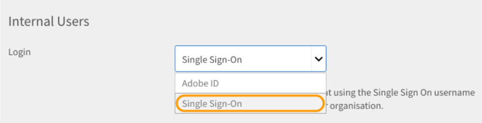
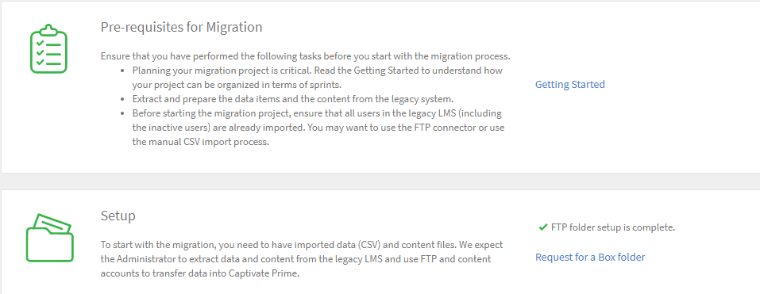

# Implementatiehandleiding voor Learning Manager - Sectie 2

## Technische installatie {#technicalsetup}

De technische instellingen voor uw Learning Manager-account zijn vooral vereist voor zakelijke gebruikers. In dit document wordt gesproken over het configureren van eenmalige aanmelding voor uw organisatie en het integreren van Learning Manager met externe connectoren.

### Eenmalige aanmelding configureren {#configuresinglesignon}

Als systeembeheerder van de Admin Console is een van uw eerste taken het definiëren en instellen van een identiteitssysteem waarmee uw eindgebruikers worden geverifieerd. Wanneer uw organisatie licenties voor Learning Manager koopt, moet u deze licenties aan uw eindgebruikers verstrekken. Hiervoor hebt u een manier nodig om deze gebruikers te verifiëren. Voer de volgende procedure uit om SSO voor uw gebruikers te vormen.

1. Klik op de startpagina van Learning Manager op **[!UICONTROL ** Instellingen **>** Aanmeldingsmethoden **.]**

   

1. Afhankelijk van uw gebruikerstype selecteert u een van de volgende opties **[!UICONTROL ** Interne gebruikers **of** Externe gebruikers **.]**

1. Vanaf de **[!UICONTROL **Aanmelden**]**vervolgkeuzelijst, selecteer **[!UICONTROL ** Single Sign-On **.]**

   

1. Als u de instellingen voor Single Sign On wilt configureren, klikt u op **[!UICONTROL ** Wijzigen **.]**

   

1. In het dialoogvenster ****[!UICONTROL Id-geïnitieerde verificatie-URL]**** -veld, voert u de verificatie-URL in die door uw serviceprovider is opgegeven.

   

1. Klik op **[!UICONTROL **Uploaden **]**naast de**[!UICONTROL  **XML-bestand met metagegevens IDP **]******veld en upload uw XML-bestand.
1. Klikken **[!UICONTROL ** Opslaan **.]**
1. De SSO-verificatie is geconfigureerd voor uw account. U moet zich via SSO kunnen aanmelden bij uw Learning Manager-account.

   ***De SSO die u in Leermanager vormt zou SAML 2.0 moeten steunen.***

## Migratie van gebruikersgegevens {#migrationofuserdata}

Als beheerder is migratie een van de cruciale stappen die u moet uitvoeren wanneer uw onderneming Leermanager aanschaft. Het is absoluut noodzakelijk dat u uw bestaande trainingsinhoud en gebruikersgegevens verplaatst naar de Leermanager. De volgende migratieworkflow helpt u de voordelen van een modern en intuïtief LMS te benutten zonder de oude gegevens van uw organisatie te verliezen.

Met Learning Manager kunt u in iteratieve sprints stapsgewijs vanuit uw bestaande LMS migreren via een wizard. U krijgt volledig inzicht in de status van elke sprint om ervoor te zorgen dat uw studenten geen downtime ervaren terwijl u uw oude gegevens migreert naar Adobe Learning Manager.

Voor het uitvoeren van de migratieworkflow hebt u de rechten van integratiebeheerders nodig. Als beheerder kunt u ofwel de rol van integratiebeheerder opnemen, of deze rol toewijzen aan een andere gebruiker.

**We kunnen Shaleen&#39;s hulp hier gebruiken om een visueel systeem te creëren.**

1. Vereiste
1. Evaluatie van de bestaande inhoud en gebruikersgegevens
1. De gegevens uit het bestaande LMS exporteren en toewijzen
1. FTP- en BOX-mappen voor migratie instellen
1. Studenten overbrengen naar Leermanager
1. Leerinhoud overbrengen naar Leermanager
1. Resterende gegevens overbrengen naar Learning Manager

### Vereiste {#prerequisite}

Voordat u het migratieproces start, moet u de volgende voorwaarde uitvoeren:

* Extractie van gegevens en inhoud van het bestaande LMS en transformatie van de gegevens naar de bestandsindelingen zoals gedefinieerd door Learning Manager.
* Gebruikers importeren via FTP- en BOX-connectoren. De integratiebeheerder moet ervoor zorgen dat de connectoren voorafgaand aan het migratieproces worden geconfigureerd.

***Het wordt aanbevolen dat beheerders het migratieproces uitproberen in een proefaccount voordat ze de gegevens en inhoud migreren naar de productieomgeving van de Learning Manager. ***

### Gegevens evalueren en exporteren {#evaluatingandexportingdata}

De integratiebeheerder moet eerst kijken naar de gegevens die beschikbaar zijn in het huidige LMS. Als integratiebeheerder kunt u alleen de volgende leerobjecten migreren:

* Module
* Cursus
* Moduleversie
* Cursusinstantie
* Cursusmodule
* Vaardigheden
* Vaardigheidsniveau
* Vaardigheidcursus
* Certificering
* Certificeringscursus
* Certificering verplicht
* Leerprogramma
* Leerprogramma cursus
* Leerprogramma-instantie
* Cursusinstantie van het leerprogramma
* Inschrijvingen
* Inschrijving voor certificering
* Inschrijving voor leerprogramma
* Cursusgraden voor gebruikers

Nadat u uw bestaande gegevens hebt geëvalueerd, moet u deze gegevens toewijzen aan de standaard CSV-specificaties in Leerbeheer. Download het volgende voorbeeld ***csv-specifications.zip*** bestand met zeven Excel-bladen die vereist zijn voor deze migratie. Deze Excel-bladen bevatten specificaties met beschrijvingen die u helpen begrijpen hoe u de bestaande gegevens kunt toewijzen aan de velden in de CSV-bestanden.

<!--
<Download link to the zip file>
-->

Zorg ervoor dat elk CSV-bestand de gegevens voor elk veld in de voorgeschreven indeling bevat:

<table> 
 <tbody> 
  <tr> 
   <th width="7%" valign="top">
<strong>Nee.</strong>
</th> 
   <th width="29%" valign="top">
<strong>Excel-bladnaam</strong>
</th> 
   <th width="31%" valign="top">
<strong>Beschrijving van inhoud</strong>
</th> 
   <th width="31%" valign="top">
<strong>Opmerkingen</strong>
</th> 
  </tr> 
  <tr> 
   <td>
1
</td> 
   <td>
module.xlsx
</td> 
   <td>
Metagegevens voor module.csv
</td> 
   <td>
 
</td> 
  </tr> 
  <tr> 
   <td>
2
</td> 
   <td>
course.xlsx
</td> 
   <td>
Metagegevens voor course.csv
</td> 
   <td>
Vermeld één auteursnaam voor een bepaalde cursus omdat meerdere auteursnamen soms niet correct worden weergegeven in de toepassing na migratie. 
</td> 
  </tr> 
  <tr> 
   <td>
3
</td> 
   <td>
module_version.xlsx 
</td> 
   <td>
Metagegevens voor module_version.csv
</td> 
   <td>
Zorg ervoor dat u het URL-pad opgeeft van de Box-accountmap waar u de inhoud hebt geüpload. 
</td> 
  </tr> 
  <tr> 
   <td>
4
</td> 
   <td>
course_instance.xlsx
</td> 
   <td>
Metagegevens voor course_instance.csv 
</td> 
   <td> </td> 
  </tr> 
  <tr> 
   <td>
5
</td> 
   <td>
course_module.xlsx
</td> 
   <td>
Metagegevens voor course_module.csv
</td> 
   <td> </td> 
  </tr> 
  <tr> 
   <td>
6
</td> 
   <td>
skill.xlsx
</td> 
   <td>
Metagegevens voor skill.csv
</td> 
   <td> </td> 
  </tr> 
  <tr> 
   <td>
7
</td> 
   <td>
skill_level.xlsx
</td> 
   <td>
Metagegevens voor skill_level.csv
</td> 
   <td> </td> 
  </tr> 
  <tr> 
   <td>
8
</td> 
   <td>
skill_course.xlsx
</td> 
   <td>
Metagegevens voor skill_course.csv
</td> 
   <td> </td> 
  </tr> 
  <tr> 
   <td>
9
</td> 
   <td>
Certification.xlsx
</td> 
   <td>
Metagegevens voor Certification.csv
</td> 
   <td> </td> 
  </tr> 
  <tr> 
   <td>
10
</td> 
   <td>
certification_course.xlsx
</td> 
   <td>
Metagegevens voor certification_course.csv
</td> 
   <td> </td> 
  </tr> 
  <tr> 
   <td>
11
</td> 
   <td>
certification_commit.xlsx
</td> 
   <td>
Metagegevens voor certification_commit.csv
</td> 
   <td> </td> 
  </tr> 
  <tr> 
   <td>
12
</td> 
   <td>
learning_program.xlsx
</td> 
   <td>
Metagegevens voor learning_program.csv
</td> 
   <td> </td> 
  </tr> 
  <tr> 
   <td>
13
</td> 
   <td>
learning_program_course.xls 
</td> 
   <td>
Metagegevens voor learning_program_course.csv 
</td> 
   <td> </td> 
  </tr> 
  <tr> 
   <td>
14
</td> 
   <td>
learning_program_instance.xlsx 
</td> 
   <td>
Metagegevens voor learning_program_instance.csv
</td> 
   <td> </td> 
  </tr> 
  <tr> 
   <td>
15
</td> 
   <td>
learning_program_instance_course_instance.xlsx 
</td> 
   <td>
Metagegevens voor learning_program_instance_course_instance.csv
</td> 
   <td> </td> 
  </tr> 
  <tr> 
   <td>
16
</td> 
   <td>
enrollments.xlsx
</td> 
   <td>
Metagegevens voor enrollments.csv
</td> 
   <td> </td> 
  </tr> 
  <tr> 
   <td>
17
</td> 
   <td>
certification_enrollment.xlsx
</td> 
   <td>
Metagegevens voor certification_enrollment.csv
</td> 
   <td> </td> 
  </tr> 
  <tr> 
   <td>
18
</td> 
   <td>
learning_program_enrollment.xlsx
</td> 
   <td>
Metagegevens voor learning_program_enrollment.csv
</td> 
   <td> </td> 
  </tr> 
  <tr> 
   <td>
19
</td> 
   <td>
User_course_grade.xlsx
</td> 
   <td>
Metagegevens voor User_course_grade.csv
</td> 
   <td>
Geef de vereiste gegevens voor studentrecords in het CSV-bestand op, ook al zijn deze niet verplicht. Zonder deze informatie kan het zijn dat de toepassing Learning Manager geen gegevens weergeeft, zelfs als het CSV-bestand voor migratie wordt verwerkt. 
</td> 
  </tr> 
 </tbody> 
</table>

***Learning Manager ondersteunt alleen datum- en tijdwaarden in UTF 8- en 32-bits indeling. Er kunnen fouten optreden tijdens de migratie als u de datum opgeeft in CSV-bestanden met een datum die buiten het bereik valt, zoals 2038-07-17T08:53:21.000Z of 1980-04-17T08:13:25,322Z.***

### Afhankelijkheden tijdens het importeren van gegevens naar CSV-bestanden {#dependencieswhileimportingdatatocsvfiles}

Let op de volgende afhankelijkheden wanneer u de bestaande gegevens importeert in de standaard-CSV-indeling:

* module_version.csv is afhankelijk van module.csv
* course_instance.csv is afhankelijk van course.csv
* course_module.csv is afhankelijk van course.csv, module.csv en module_version.csv
* course_instance.csv is afhankelijk van course.csv
* enrollment.csv is afhankelijk van course.csv
* user_course_grade.csv is afhankelijk van course.csv en module.csv
* skill_course.csv is afhankelijk van course.csv
* skill_level.csv is afhankelijk van skill.csv
* learning_program_instance.csv is afhankelijk van het leerprogramma en learning_program_course.csv
* learning_program_course.csv is afhankelijk van learning_program.csv
* learning_program_enrollment.csv is afhankelijk van het leerprogramma en learning_program_instance.csv
* learning_program_instance_course_instance.csv is afhankelijk van learning_program.csv, learning_program_instance.csv en course_instance.csv
* certification_course.csv is afhankelijk van certification.csv en course.csv
* certification_commit.csv is afhankelijk van certification.csv en certification_course.csv
* certification_enrollment.csv is afhankelijk van certification.csv, certification_course.csv en certification_enrollment.csv

Nadat u de gegevens hebt geëxporteerd, slaat u de CSV-bestanden op uw lokale computer op. De bestanden kunnen nu worden verwijderd in de FTP- of BOX-mappen.

## FTP- en BOX-mappen instellen voor de migratie {#setupftpandboxfoldersforthemigration}

Voordat u de daadwerkelijke migratie van alle inhoud plant en start, moet u eerst de FTP- en BOX-mappen instellen. U hebt deze mappen nodig om uw CSV-bestanden in deze mappen neer te zetten. Zodra uw oudere inhoud, in de vorm van CSV-bestanden, beschikbaar is in de FTP- en BOX-mappen, kan Learning Manager de gegevens gebruiken.

### Een FTP-account instellen {#setupanftpaccount}

Klik op de startpagina van de integratiebeheerder op **[!UICONTROL ** CSV FTP-map aanvragen **.]** Voer in het pop-upvenster dat verschijnt uw e-mail-id in. Ga door de online wizard om de Exavault FTP-account te maken. Zodra u uw account hebt gemaakt, kunt u uw migratieproject- en sprintprojectmappen bekijken in Exavault FTP.

Bekijk een voorbeeldmomentopname van de projectbestanden en -map van ExaVault, zoals hieronder weergegeven:

Wanneer u de FTP-map hebt ingesteld, wordt het bericht &quot;De installatie van de FTP-map is voltooid&quot; weergegeven.

## Een BOX-account instellen {#setupaboxaccount}

Voer de volgende stappen uit om een BOX-account te maken en een BOX-map in te stellen:

Selecteer Migratie op de startpagina van de integratiebeheerder.

Klik in de sectie Setup op Aanvragen voor een Box-map.

In het dialoogvenster ****[!UICONTROL E-mail invoeren]**** Voer de e-mail-ID in waar u de aanmeldingsinstructies voor verbinding met Box wilt ontvangen.

Klikken **[!UICONTROL ** Verbinden **.]**

U ontvangt dan een e-mail van Box met een koppeling naar de gedeelde map. Als u geen Box-account hebt, klikt u op Sign Up en maakt u een account. Aanmeldingsinstructies worden vervolgens naar de e-mail-ID van de integratiebeheerder verzonden.

Nadat u de verbinding hebt opgeslagen, verschijnt op de migratiepagina het bericht: &quot;Mapinstellingen voor Box is voltooid&quot;.

## Inhoud migreren naar Leermanager {#migratingthecontenttocaptivateprime}

Voordat u de migratie start, is het belangrijk dat u het volgende opmerkt:

* Er kan op elk moment slechts één migratieproject actief zijn in een account. Binnen een project kan slechts één sprint actief zijn op een bepaald moment.
* U kunt een run die al in uitvoering is niet ongedaan maken. U kunt echter de bestaande verwijderingsoptie binnen elke functie van Leermanager gebruiken om migratie van gegevens of inhoud ongedaan te maken.

Zodra het migratieproject van start gaat, krijgt het project de status &#39;Onder migratie&#39;. In deze status kan geen andere gebruiker dan de integratiebeheerder zich aanmelden bij Learning Manager.

Trainingsinhoud uploaden naar inhoudsmappen:

Klik op de startpagina van de integratiebeheerder op **[!UICONTROL Migratie.]**

Op de startpagina Migratie geeft het systeem de migratieprojecten weer die al in uw organisatie zijn gemaakt.

Klik op **[!UICONTROL **Nieuw**]**rechtsboven op de pagina om een migratieproject te maken.

***Als u nog geen FTP-map hebt gemaakt, wordt u gevraagd een Exavault-account voor de FTP-map te maken. Dit is een verplichte stap voordat u een migratieproject gaat maken. ***

In het dialoogvenster ****[!UICONTROL Nieuw migratieproject maken]**** de naam voor uw project op.

Geef een tag op voor uw project, de cursuscatalogus en geef een beschrijving voor het migratieproject. Uw migratiegegevensitems worden geïdentificeerd met behulp van de tag Migratieproject. Als u geen specifieke cursuscatalogus hebt, kiest u de standaardcatalogus in de vervolgkeuzelijst, worden alle cursussen die u met een migratieproject migreert, opgenomen in de catalogus die u in dit stadium kiest. Als u geen catalogus kiest, maken alle gemigreerde cursussen deel uit van de standaardcatalogus.

Klikken **[!UICONTROL Maken.]**

Maak op de pagina Sprint Configuration een sprint voor uw migratieproject. Een sprint definieert in het LMS-migratieproces een set migratie-items die u uit het bestaande LMS wilt migreren.

Geef een naam voor de sprint op en geef een beschrijving voor de sprint op.

Selecteer de ****[!UICONTROL Gebruikers zijn toegevoegd of gewijzigd sinds het laatste selectievakje is uitgevoerd]**** om de lijst met gebruikers te synchroniseren met de toepassing Leermanager. Als u inhoud en gegevens migreert naar de toepassing Learning Manager, is dit mogelijk niet vereist. Maar als er een time-lapse is tussen uw eerdere sprintmigratie en de nieuwste sprintmigratie, kunt u het beste de gebruikerslijst synchroniseren. Met deze stap kan de database van de Learning Manager synchroon zijn met uw LMS-gebruikers.

***De synchronisatiestap wordt aanbevolen wanneer enrollment.csv en user_course_course_grade.csv worden gemigreerd. Deze stap zorgt ervoor dat de database van de Learning Manager synchroon is met uw migratiedatabase en dat alle gebruikers wier records die in de sprint moeten worden gemigreerd, beschikbaar zijn in de migratiedatabase.***

Klikken **[!UICONTROL ** Volgende **.]**

Klik op **[!UICONTROL **Starten**]**om de sprintmigratie te starten met uw geüploade gegevens en inhoud. Klikken ****[!UICONTROL Vernieuwen]**** voordat u de sprint start om de FTP- en inhoudsmappen te synchroniseren met Learning Manager.

U kunt op ***[!UICONTROL Stoppen]**** op elk moment tijdens het sprintmigratieproces om de sprintmigratie af te breken.

Het systeem geeft de migratiestatus weer voor elk van de sprintgegevensitems en -inhoud. Controleer het aantal geslaagde en mislukte items als onderdeel van migratiesprintrun.

Als u module-inhoud uploadt, moet u ervoor zorgen dat het pad naar de inhoudsmap wordt vermeld in het *module_version.csv *file. Als u deze stap overslaat, kunnen er fouten optreden tijdens de migratie. Als u bijvoorbeeld inhoud van een module op eigen tempo uploadt, zoals video&#39;s, moet u het relatieve Box-URL-pad opgeven in het *module_version.csv *file.

Hieronder vindt u ter referentie een voorbeeld van de voortgang van de migratie. Zoals te zien in de afbeelding, kunt u het aantal verwerkte records voor elk migratiegegevensitem bekijken, samen met de status van geslaagde en mislukte items. Klik op Foutrecords downloaden naast de mislukte items om de foutenlogboeken te downloaden en weer te geven. U kunt de problemen in CSV oplossen en opnieuw uploaden in FTP.

Klik op ** om een lijst met alle sprints van een migratieproject weer te geven [!UICONTROL **Sprint**]**in het linkernavigatiegebied. U kunt een lijst weergeven met alle sprints, het aantal runs dat u voor elke sprint hebt uitgevoerd, de startdatum, de duur en de voltooiingsstatus zoals weergegeven in de voorbeeldafbeelding hieronder.

Klik op ** om een lijst met alle sprints van een migratieproject weer te geven [!UICONTROL **Sprint**]**in het linkernavigatiegebied. U kunt een lijst weergeven met alle sprints, het aantal runs dat u voor elke sprint hebt uitgevoerd, de startdatum, de duur en de voltooiingsstatus zoals weergegeven in de voorbeeldafbeelding hieronder.

Klik op ** om een lijst met alle sprints van een migratieproject weer te geven [!UICONTROL **Sprint**]**in het linkernavigatiegebied. U kunt een lijst weergeven met alle sprints, het aantal runs dat u voor elke sprint hebt uitgevoerd, de startdatum, de duur en de voltooiingsstatus zoals weergegeven in de voorbeeldafbeelding hieronder.

***Voordat u het migratieproject als voltooid markeert, moet u controleren of alle sprints in het project zijn voltooid. Als u het migratieproject als voltooid hebt gemarkeerd, kunt u niet meer teruggaan en sprints maken in dat project. U kunt geen wijzigingen aanbrengen in dat project. U kunt alleen een ander migratieproject maken en er sprints aan toevoegen.***

Nadat u de leergegevens en -inhoud van het verouderde LMS van uw organisatie hebt gemigreerd, controleert u of de gegevens en inhoud goed zijn geïmporteerd. U kunt controleren door u aan te melden als beheerder en de beschikbaarheid van geïmporteerde modules en cursusgegevens en -inhoud te controleren

Raadpleeg de volgende bronnen voor nuttige informatie over migratie:

* Migratieproblemen oplossen
* Veelgestelde vragen over het uploaden van CSV&#39;s

