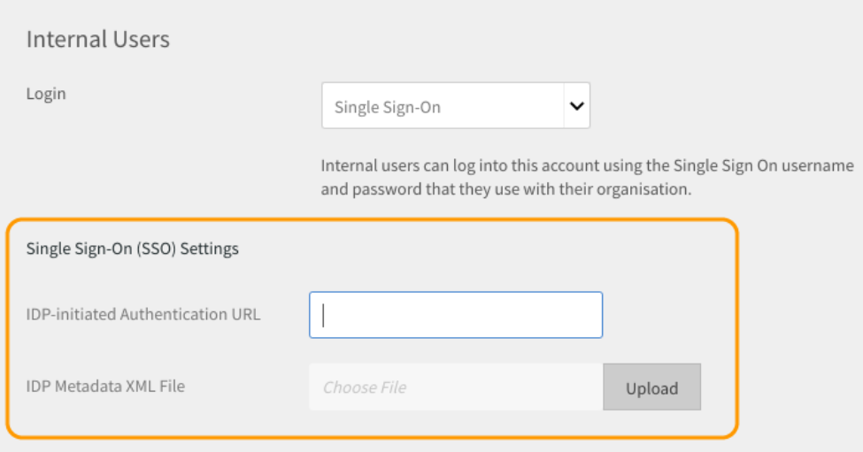

# Implementatiehandleiding voor Learning Manager - Sectie 2

## Technische configuratie {#technicalsetup}

De technische instellingen voor uw Learning Manager-account zijn vooral vereist voor zakelijke gebruikers. In dit document wordt gesproken over het configureren van eenmalige aanmelding voor uw organisatie en het integreren van Learning Manager met externe connectoren.

### Single Sign-On configureren {#configuresinglesignon}

Een van uw eerste taken als systeembeheerder in de beheerconsole is het definiëren en opzetten van een identiteitssysteem waarmee uw eindgebruikers worden geverifieerd. Wanneer uw organisatie licenties voor Learning Manager koopt, moet u deze licenties aan uw eindgebruikers verstrekken. Hiervoor hebt u een manier nodig om deze gebruikers te verifiëren. Voer de volgende procedure uit om eenmalige aanmelding voor uw gebruikers te configureren.

1. Klik op de startpagina van Learning Manager op **[!UICONTROL **&#x200B; Instellingen &#x200B;**>**&#x200B; Aanmeldingsmethoden &#x200B;**.]**

   

1. Afhankelijk van uw gebruikerstype selecteert u een van de volgende opties **[!UICONTROL **&#x200B; Interne gebruikers &#x200B;** of **&#x200B; Externe gebruikers &#x200B;**.]**

1. Vanaf de **[!UICONTROL **Aanmelden**]**&#x200B;vervolgkeuzelijst, selecteer **[!UICONTROL **&#x200B; Single Sign-On &#x200B;**.]**

   

1. Als u de instellingen voor Single Sign On wilt configureren, klikt u op **[!UICONTROL **&#x200B; Wijzigen &#x200B;**.]**

   

1. Voer in het veld **&#x200B;**&#x200B;[!UICONTROL Verificatie-URL geïnitieerd door IDP]&#x200B;**&#x200B;** de verificatie-URL in die uw serviceprovider heeft verstrekt.

   

1. Klik op **[!UICONTROL **Uploaden &#x200B;**]&#x200B;**naast de**&#x200B;[!UICONTROL &#x200B; **XML-bestand met metagegevens IDP &#x200B;**]&#x200B;**&#x200B;**&#x200B;**veld en upload uw XML-bestand.
1. Klikken **[!UICONTROL **&#x200B; Opslaan &#x200B;**.]**
1. De verificatie via eenmalige aanmelding is geconfigureerd voor uw account. U moet zich via SSO kunnen aanmelden bij uw Learning Manager-account.

   ***De SSO die u in Leermanager vormt zou SAML 2.0 moeten steunen.***

## Migratie van gebruikersgegevens {#migrationofuserdata}

Als beheerder is migratie een van de cruciale stappen die u moet uitvoeren wanneer uw onderneming Leermanager aanschaft. Het is absoluut noodzakelijk dat u uw bestaande trainingsinhoud en gebruikersgegevens verplaatst naar de Leermanager. Met de volgende migratieworkflow kunt u profiteren van de voordelen van een modern en intuïtief LMS zonder de oude gegevens van uw organisatie te verliezen.

Met Learning Manager kunt u in iteratieve sprints stapsgewijs vanuit uw bestaande LMS migreren via een wizard. U krijgt volledig inzicht in de status van elke sprint om ervoor te zorgen dat uw studenten geen downtime ervaren terwijl u uw oude gegevens migreert naar Adobe Learning Manager.

Om de migratieworkflow uit te voeren, hebt u de integratiebeheerdersrechten nodig. Als beheerder kunt u de rol van integratiebeheerder op u nemen of deze rol toewijzen aan een andere gebruiker.

**We kunnen Shaleen&#39;s hulp hier gebruiken om een visueel systeem te creëren.**

1. Vereiste
1. Evaluatie van de bestaande inhoud en gebruikersgegevens
1. De gegevens exporteren en toewijzen vanuit het bestaande LMS
1. FTP- en BOX-mappen instellen voor migratie
1. Studenten overbrengen naar Leermanager
1. Leerinhoud overbrengen naar Leermanager
1. Resterende gegevens overbrengen naar Learning Manager

### Vereiste {#prerequisite}

Voordat u het migratieproces start, moet u de volgende noodzakelijke stappen uitvoeren:

* Extractie van gegevens en inhoud van het bestaande LMS en transformatie van de gegevens naar de bestandsindelingen zoals gedefinieerd door Learning Manager.
* Gebruikers importeren met behulp van FTP- en BOX-connectoren. De integratiebeheerder moet ervoor zorgen dat de connectoren vóór de migratie geconfigureerd worden.

***Het wordt aanbevolen dat beheerders het migratieproces uitproberen in een proefaccount voordat ze de gegevens en inhoud migreren naar de productieomgeving van de Learning Manager. &#x200B;***

### Gegevens evalueren en exporteren {#evaluatingandexportingdata}

De integratiebeheerder moet eerst kijken naar de gegevens die beschikbaar zijn in het huidige LMS. Als integratiebeheerder kunt u alleen de volgende leerobjecten migreren:

* Module
* Cursus
* Moduleversie
* Cursusinstantie
* Cursusmodule
* Vaardigheden
* Vaardigheidsniveau
* Vaardigheid cursus
* Certificering
* Certificering cursus
* Vastlegging certificering
* Leerprogramma
* Leerprogramma cursus
* Leerprogramma instantie
* Leerprogramma cursusinstantie
* Inschrijvingen
* Inschrijving voor certificering
* Inschrijving voor leerprogramma
* Curcuscijfers van gebruiker

Nadat u uw bestaande gegevens hebt geëvalueerd, moet u deze gegevens toewijzen aan de standaard CSV-specificaties in Leerbeheer. Download het volgende voorbeeldbestand ***csv-specifications.zip*** met zeven Excel-bladen die nodig zijn voor deze migratie. Deze Excel-bladen bevatten specificaties met beschrijvingen die u laten zien hoe u de bestaande gegevens kunt koppelen aan de velden in de CSV-bestanden.

<!--
<Download link to the zip file>
-->

Zorg ervoor dat elk CSV-bestand de gegevens voor elk veld in de voorgeschreven indeling bevat:

<table> 
 <tbody> 
  <tr> 
   <th width="7%" valign="top">
<strong>Aantal</strong>
</th> 
   <th width="29%" valign="top">
<strong>Excel-bladnaam</strong>
</th> 
   <th width="31%" valign="top">
<strong>Beschrijving van de inhoud</strong>
</th> 
   <th width="31%" valign="top">
<strong>Opmerkingen</strong>
</th> 
  </tr> 
  <tr> 
   <td>
1
</td> 
   <td>
module.xlsx
</td> 
   <td>
Metagegevens voor module.csv
</td> 
   <td>
 
</td> 
  </tr> 
  <tr> 
   <td>
2
</td> 
   <td>
course.xlsx
</td> 
   <td>
Metagegevens voor course.csv
</td> 
   <td>
Vermeld één auteursnaam voor een cursus, omdat meerdere auteursnamen na migratie soms niet goed worden weergegeven in de toepassing. 
</td> 
  </tr> 
  <tr> 
   <td>
3
</td> 
   <td>
module_version.xlsx 
</td> 
   <td>
Metagegevens voor module_version.csv
</td> 
   <td>
Zorg ervoor dat u het URL-pad van de Box-accountmap opgeeft waarnaar u de inhoud hebt geüpload. 
</td> 
  </tr> 
  <tr> 
   <td>
4
</td> 
   <td>
course_instance.xlsx
</td> 
   <td>
Metagegevens voor course_instance.csv 
</td> 
   <td> </td> 
  </tr> 
  <tr> 
   <td>
5
</td> 
   <td>
course_module.xlsx
</td> 
   <td>
Metagegevens voor course_module.csv
</td> 
   <td> </td> 
  </tr> 
  <tr> 
   <td>
6
</td> 
   <td>
skill.xlsx
</td> 
   <td>
Metagegevens voor skill.csv
</td> 
   <td> </td> 
  </tr> 
  <tr> 
   <td>
7
</td> 
   <td>
skill_level.xlsx
</td> 
   <td>
Metagegevens voor skill_level.csv
</td> 
   <td> </td> 
  </tr> 
  <tr> 
   <td>
8
</td> 
   <td>
skill_course.xlsx
</td> 
   <td>
Metagegevens voor skill_course.csv
</td> 
   <td> </td> 
  </tr> 
  <tr> 
   <td>
9
</td> 
   <td>
Certification.xlsx
</td> 
   <td>
Metagegevens voor Certification.csv
</td> 
   <td> </td> 
  </tr> 
  <tr> 
   <td>
10
</td> 
   <td>
certification_course.xlsx
</td> 
   <td>
Metagegevens voor certification_course.csv
</td> 
   <td> </td> 
  </tr> 
  <tr> 
   <td>
11
</td> 
   <td>
certification_commit.xlsx
</td> 
   <td>
Metagegevens voor certification_commit.csv
</td> 
   <td> </td> 
  </tr> 
  <tr> 
   <td>
12
</td> 
   <td>
learning_program.xlsx
</td> 
   <td>
Metagegevens voor learning_program.csv
</td> 
   <td> </td> 
  </tr> 
  <tr> 
   <td>
13
</td> 
   <td>
learning_program_course.xls 
</td> 
   <td>
Metagegevens voor learning_program_course.csv 
</td> 
   <td> </td> 
  </tr> 
  <tr> 
   <td>
14
</td> 
   <td>
learning_program_instance.xlsx 
</td> 
   <td>
Metagegevens voor learning_program_instance.csv
</td> 
   <td> </td> 
  </tr> 
  <tr> 
   <td>
15
</td> 
   <td>
learning_program_instance_course_instance.xlsx 
</td> 
   <td>
Metagegevens voor learning_program_instance_course_instance.csv
</td> 
   <td> </td> 
  </tr> 
  <tr> 
   <td>
16
</td> 
   <td>
enrollments.xlsx
</td> 
   <td>
Metagegevens voor enrollments.csv
</td> 
   <td> </td> 
  </tr> 
  <tr> 
   <td>
17
</td> 
   <td>
certification_enrollment.xlsx
</td> 
   <td>
Metagegevens voor certification_enrollment.csv
</td> 
   <td> </td> 
  </tr> 
  <tr> 
   <td>
18
</td> 
   <td>
learning_program_enrollment.xlsx
</td> 
   <td>
Metagegevens voor learning_program_enrollment.csv
</td> 
   <td> </td> 
  </tr> 
  <tr> 
   <td>
19
</td> 
   <td>
User_course_grade.xlsx
</td> 
   <td>
Metagegevens voor User_course_grade.csv
</td> 
   <td>
Verstrek de vereiste gegevens van studentrecords in het CSV-bestand, ook al zijn ze niet verplicht. Zonder deze informatie is het mogelijk dat de Learning Manager-toepassing geen gegevens weergeeft, zelfs als de CSV voor migratie wordt verwerkt. 
</td> 
  </tr> 
 </tbody> 
</table>

***Learning Manager ondersteunt alleen datum- en tijdwaarden in UTF 8- en 32-bits indeling. Er kunnen fouten optreden tijdens de migratie als u de datum opgeeft in CSV-bestanden met een datum die buiten het bereik valt, zoals 2038-07-17T08:53:21.000Z of 1980-04-17T08:13:25,322Z.***

### Afhankelijkheden bij het importeren van gegevens naar CSV-bestanden {#dependencieswhileimportingdatatocsvfiles}

Houd rekening met de volgende afhankelijkheden als u de bestaande gegevens in de standaard CSV-indeling importeert:

* module_version.csv is afhankelijk van module.csv
* course_instance.csv is afhankelijk van course.csv
* course_module.csv is afhankelijk van course.csv, module.csv en module_version.csv
* course_instance.csv is afhankelijk van course.csv
* enrollment.csv is afhankelijk van course.csv
* user_course_grade.csv is afhankelijk van course.csv en module.csv
* skill_course.csv is afhankelijk van course.csv
* skill_level.csv is afhankelijk van skill.csv
* learning_program_instance.csv is afhankelijk van het leerprogramma en learning_program_course.csv
* learning_program_course.csv is afhankelijk van learning_program.csv
* learning_program_enrollment.csv is afhankelijk van het leerprogramma en learning_program_instance.csv
* learning_program_instance_course_instance.csv is afhankelijk van learning_program.csv, learning_program_instance.csv en course_instance.csv
* certification_course.csv is afhankelijk van certification.csv en course.csv
* certification_commit.csv is afhankelijk van certification.csv en certification_course.csv
* certification_enrollment.csv is afhankelijk van certification.csv, certification_course.csv en certification_enrollment.csv

Nadat u de gegevens hebt geëxporteerd, slaat u de CSV-bestanden op uw lokale computer op. De bestanden kunnen nu in de FTP- of BOX-mappen worden geplaatst.

## FTP- en BOX-mappen instellen voor de migratie {#setupftpandboxfoldersforthemigration}

Voordat u uw daadwerkelijke migratie van alle inhoud plant en start, moet u eerst de FTP- en BOX-mappen instellen. U hebt deze mappen nodig om uw CSV-bestanden in deze mappen te plaatsen. Zodra uw oudere inhoud, in de vorm van CSV-bestanden, beschikbaar is in de FTP- en BOX-mappen, kan Learning Manager de gegevens gebruiken.

### Een FTP-account instellen {#setupanftpaccount}

Klik op de startpagina van de integratiebeheerder op **[!UICONTROL **&#x200B; CSV FTP-map aanvragen &#x200B;**.]** Voer in het pop-upvenster dat verschijnt uw e-mail-ID in. Doorloop de online wizard om het Exavault FTP-account aan te maken. Zodra u uw account hebt gemaakt, kunt u uw migratieproject- en sprintprojectmappen bekijken in Exavault FTP.

Bekijk hier een voorbeeld van de projectbestanden en -map van ExaVault:

Wanneer u de FTP-map hebt ingesteld, wordt het bericht &quot;De installatie van de FTP-map is voltooid&quot; weergegeven.

## Een Box-account instellen {#setupaboxaccount}

Voer de volgende stappen uit om een BOX-account aan te maken en een BOX-map in te stellen:

Selecteer Migratie op de startpagina Integratiebeheerders.

Klik in het gedeelte Instellingen op Een Box-map aanvragen.

Voer in het veld **&#x200B;**&#x200B;[!UICONTROL E-mail invoeren]&#x200B;**&#x200B;** de e-mail-ID in waarop u de aanmeldingsinstructies wilt ontvangen voor het maken van een verbinding met Box.

Klikken **[!UICONTROL **&#x200B; Verbinden &#x200B;**.]**

U ontvangt dan een e-mail van Box met een link naar de gedeelde map. Hebt u geen Box-account, klik dan op Sign up en maak een account. Vervolgens worden de aanmeldingsinstructies verzonden naar de e-mail-ID van de integratiebeheerder.

Nadat u de verbinding hebt opgeslagen, verschijnt op de migratiepagina het bericht: &quot;Mapinstellingen voor Box is voltooid&quot;.

## Inhoud migreren naar Leermanager {#migratingthecontenttocaptivateprime}

Voordat u de migratie start, is het belangrijk dat u het volgende opmerkt:

* Er kan altijd maar één migratieproject tegelijk actief zijn in een account. Binnen een project kan er altijd maar één sprint tegelijk actief zijn.
* U kunt een run die al wordt uitgevoerd, niet ongedaan maken. U kunt echter de bestaande verwijderingsoptie in elke functie van Learning Manager gebruiken om migratie van gegevens of inhoud ongedaan te maken.

Zodra het migratieproject van start gaat, krijgt het project de status &#39;Onder migratie&#39;. In deze status kan geen andere gebruiker dan de integratiebeheerder zich aanmelden bij Learning Manager.

Trainingsinhoud naar inhoudsmappen uploaden:

Klik op de startpagina Integratiebeheerders op **[!UICONTROL Migratie.]**

Op de startpagina Migratie geeft het systeem de migratieprojecten weer die al in uw organisatie zijn gemaakt.

Klik op **[!UICONTROL **Nieuw**]**&#x200B;rechtsboven op de pagina om een migratieproject te maken.

***Als u nog geen FTP-map hebt gemaakt, wordt u gevraagd een Exavault-account voor de FTP-map te maken. Dit is een verplichte stap voordat u een migratieproject gaat maken. &#x200B;***

Geef op de pagina **&#x200B;**&#x200B;[!UICONTROL Een nieuw migratieproject maken]&#x200B;**&#x200B;** de naam voor uw project op.

Geef een tag op voor uw project, de cursuscatalogus, en geef een beschrijving op voor het migratieproject. Uw migratiegegevens worden geïdentificeerd met behulp van de tag voor migratieprojecten. Als u geen specifieke cursuscatalogus hebt, kiest u de standaardcatalogus in de vervolgkeuzelijst. Alle cursussen die u via een migratieproject migreert, worden opgenomen in de catalogus die u hier kiest. Als u geen catalogus kiest, behoren alle gemigreerde cursussen tot de standaardcatalogus.

Klik op **[!UICONTROL Maken.]**

Maak op de pagina Sprintconfiguratie een sprint voor uw migratieproject. Een sprint definieert in het LMS-migratieproces een set migratie-items die u uit het bestaande LMS wilt migreren.

Geef een naam op voor de sprint en geef een beschrijving op voor de sprint.

Selecteer de **&#x200B;**&#x200B;[!UICONTROL Gebruikers zijn toegevoegd of gewijzigd sinds het laatste selectievakje is uitgevoerd]&#x200B;**&#x200B;** om de lijst met gebruikers te synchroniseren met de toepassing Leermanager. Als u inhoud en gegevens migreert naar de toepassing Learning Manager, is dit mogelijk niet vereist. Maar als er tijd is verstreken tussen uw eerdere sprintmigratie en de laatste sprintmigratie, wordt het aanbevolen om de gebruikerslijst te synchroniseren. Met deze stap kan de database van de Learning Manager synchroon zijn met uw LMS-gebruikers.

***De synchronisatiestap wordt aanbevolen wanneer enrollment.csv en user_course_course_grade.csv worden gemigreerd. Deze stap zorgt ervoor dat de database van de Learning Manager synchroon is met uw migratiedatabase en dat alle gebruikers wier records die in de sprint moeten worden gemigreerd, beschikbaar zijn in de migratiedatabase.***

Klikken **[!UICONTROL **&#x200B; Volgende &#x200B;**.]**

Klik op **[!UICONTROL **Starten**]&#x200B;**om de sprintmigratie te starten met uw geüploade gegevens en inhoud. Klikken &#x200B;**&#x200B;**[!UICONTROL Vernieuwen]**&#x200B;** voordat u de sprint start om de FTP- en inhoudsmappen te synchroniseren met Learning Manager.

U kunt op ***[!UICONTROL Stoppen]**&#x200B;** op elk moment tijdens het sprintmigratieproces om de sprintmigratie af te breken.

Het systeem geeft de migratiestatus weer voor alle gegevensitems en inhoud van de sprint. Controleer het aantal geslaagde en mislukte items als onderdeel van de migratiesprintrun.

Als u module-inhoud uploadt, moet u ervoor zorgen dat het pad naar de inhoudsmap wordt vermeld in het *module_version.csv *file. Als u deze stap overslaat, kunnen er tijdens migratie fouten optreden. Als u bijvoorbeeld inhoud van een module op eigen tempo uploadt, zoals video&#39;s, moet u het relatieve Box-URL-pad opgeven in het *module_version.csv *file.

Hieronder vindt u ter referentie een voorbeeld van de voortgang van de migratie. Zoals te zien in het voorbeeld, kunt u het aantal verwerkte records voor elk migratiegegevensitem bekijken. De status geeft aan of migratie is geslaagd of mislukt. Klik op Foutrecords downloaden naast de mislukte items om de foutenlogboeken te downloaden en bekijken. U kunt de problemen in CSV oplossen en opnieuw uploaden in FTP.

Klik op ** om een lijst met alle sprints van een migratieproject weer te geven [!UICONTROL **Sprint**]**in het linkernavigatiegebied. U kunt een lijst van alle sprints bekijken, het aantal runs dat u voor elke sprint hebt uitgevoerd, de startdatum, de duur en de voltooiingsstatus, zoals weergegeven in het voorbeeld hieronder.

Klik op ** om een lijst met alle sprints van een migratieproject weer te geven [!UICONTROL **Sprint**]**in het linkernavigatiegebied. U kunt een lijst van alle sprints bekijken, het aantal runs dat u voor elke sprint hebt uitgevoerd, de startdatum, de duur en de voltooiingsstatus, zoals weergegeven in het voorbeeld hieronder.

Klik op ** om een lijst met alle sprints van een migratieproject weer te geven [!UICONTROL **Sprint**]**in het linkernavigatiegebied. U kunt een lijst van alle sprints bekijken, het aantal runs dat u voor elke sprint hebt uitgevoerd, de startdatum, de duur en de voltooiingsstatus, zoals weergegeven in het voorbeeld hieronder.

***Voordat u het migratieproject als voltooid markeert, moet u controleren of alle sprints in het project zijn voltooid. Zodra u het migratieproject als voltooid hebt gemarkeerd, kunt u niet meer teruggaan om sprints in dat project te maken. U kunt geen wijzigingen aanbrengen in dat project. U kunt alleen een ander migratieproject maken en er sprints aan toevoegen.***

Nadat u de leergegevens en -inhoud van het oude LMS van uw organisatie hebt gemigreerd, controleert u of de gegevens en inhoud juist zijn geïmporteerd. U kunt dit controleren door u aan te melden als beheerder en de beschikbaarheid van geïmporteerde modules en cursusgegevens en -inhoud te controleren

Raadpleeg het volgende voor nuttige bronnen over migratie:

* Migratieproblemen oplossen
* Veelgestelde vragen over het uploaden van CSV&#39;s

