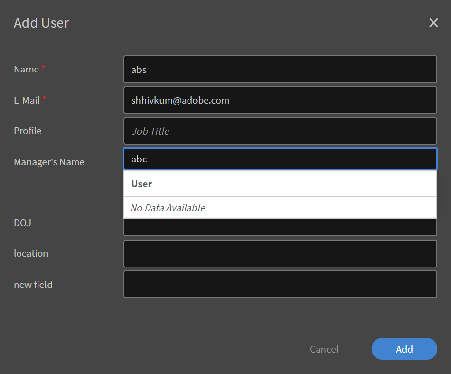

# Gebruikers instellen in Leerbeheer

## Interne en externe gebruikers {#internalandexternalusers}

In elk LMS, inclusief Learning Manager, is het beheren van gebruikers een belangrijk aspect. Met Learning Manager kunt u gebruikers classificeren als intern en extern. Interne gebruikers zijn gebruikers die tot een specifieke organisatie of groep behoren. In het algemeen zijn gebruikers binnen een onderneming interne gebruikers. Deze gebruikers hebben specifieke leerobjecten met specifieke deadlines, zoals toegewezen door hun managers of de beheerder.

Externe gebruikers daarentegen zijn over het algemeen tijdelijke gebruikers van een specifiek leerbeheerdersaccount. Deze gebruikers hebben mogelijk toegang tot specifieke leerobjecten door op een tijdelijke, externe koppeling te klikken die ze via e-mail ontvangen. De externe gebruikersprofielen hebben doorgaans een vervaldatum. Een organisatie die certificeringen voor Java uitvoert, kan bijvoorbeeld elke gebruiker hebben die zich tijdelijk aanmeldt om relevante cursussen te voltooien en vervolgens probeert te certificeren. Meestal hebben klassikale trainingen en cursussen voor externe gebruikers ook een beperkte capaciteit.

Lees verder om te weten te komen hoe u interne gebruikers en externe gebruikers in Leerbeheer kunt toevoegen.

## Externe gebruikers instellen {#setupexternalusers}

Als beheerder kunt u externe gebruikers, zoals medewerkers van partnerorganisaties, toevoegen aan uw Leerbeheerdersaccount. Externe gebruikers toevoegen:

1. Vanaf de **[!UICONTROL **Beheerder**]**aanmeldingspagina, klikken op **[!UICONTROL **Gebruikers**]**in het linkernavigatiegebied.
1. In het **[!UICONTROL **Gebruikers**]**pagina, klik **[!UICONTROL **Extern**]**in het linkernavigatiegebied. Het systeem geeft de pagina Externe gebruikers weer met een lijst van externe gebruikers (indien van toepassing).
1. Klik op **[!UICONTROL **Toevoegen**]**rechtsboven op de pagina.

   

1. In het **[!UICONTROL **Gebruiker toevoegen**]**pop-upvenster, zijn de volgende velden verplicht:

   * **[!UICONTROL **Profielnaam**:]**Geef de naam op voor het externe profiel dat u maakt.
   * **[!UICONTROL ** Manager-e-mail **:]** Geef het e-mailadres van de manager voor de externe gebruiker op.
   * **[!UICONTROL ** Toegewezen plaatsen **:]** Geef op hoeveel studenten zich voor de cursus kunnen inschrijven.
   * **[!UICONTROL ** Vervaldatum **:]** Geef de vervaldatum op waarna een externe gebruiker de cursus niet kan registreren of volgen.

1. Klikken **[!UICONTROL ** Geavanceerde instellingen **.]**
1. Stel desgewenst de volgende opties in wanneer u een extern profiel maakt:

   * **[!UICONTROL ** Afbeelding toevoegen **:]** Sleep de gewenste afbeelding. Deze afbeelding wordt voor gebruikers weergegeven op de pagina Student.
   * **[!UICONTROL ** Aanmeldingsvereiste **:]** Geef het aantal dagen op waarbinnen de gebruiker zich moet aanmelden. Als de externe gebruiker deze aanmeldperiode overschrijdt, kan de student het leerobject niet openen of volgen.
   * **[!UICONTROL ** Toegestane domeinen **:]** Geef de domeinen op, gescheiden door een komma. Alleen gebruikers met de opgegeven domeinen kunnen zich registreren bij het account.
   * **[!UICONTROL ** E-mailverificatie vereist **:]** Schakel dit selectievakje in als u gebruikers een verificatiebericht wilt sturen

1. Klikken **[!UICONTROL Opslaan.]**

   

   Er wordt een pop-upvenster met de URL weergegeven. U kunt deze URL kopiëren en naar de externe gebruikers verzenden. Standaard wordt een e-mail met deze URL naar de gebruiker verzonden.

1. Als u externe profielen toevoegt, worden deze weergegeven in het dialoogvenster **[!UICONTROL ** Pagina Externe gebruikers **(** Beheerder **>** Gebruikers **>** Extern **).]** De limiet van de licentie, de vervaldatum en de aanmeldingsvereisten worden ook weergegeven voor deze gebruikers.
1. Als u de instellingen van een externe gebruiker wilt bewerken, klikt u op de gebruikersnaam. De **[!UICONTROL Externe inschrijving bewerken]** wordt weergegeven. Wijzig de instellingen en klik **[!UICONTROL ** Opslaan **.]**
1. U kunt de welkomstmail ook op elk gewenst moment opnieuw verzenden of de URL kopiëren door op de pictogrammen voor e-mail/URL kopiëren naast het externe profiel te klikken.

   

## Het externe gebruikersprofiel pauzeren {#pausetheexternaluserprofile}

Nadat u een externe gebruikersgroep aan Leermanager hebt toegevoegd, kunt u het registratieproces voor externe gebruikers ook pauzeren. Wanneer u pauzeert, wordt het registratieproces voor externe gebruikers geblokkeerd. Dit proces werkt echter alleen als de gebruikers zich nog niet hebben geregistreerd door de uitnodiging te accepteren.

Klik op ** om de externe gebruikersgroepen te pauzeren [!UICONTROL **Handelingen**]**in de rechterbovenhoek van de pagina en kies **[!UICONTROL Pauze]**.

## Extern gebruikersprofiel hervatten {#resumeexternaluserprofile}

U kunt de blokkering (pauzeren) op elk gewenst moment opheffen door de optie Hervatten te kiezen. Klik op **[!UICONTROL **Handelingen**]**rechtsboven op de pagina en kies **[!UICONTROL Hervatten]**.

**[!UICONTROL Statussen voor externe gebruikers]**

In Learning Manager zijn de volgende statussen van toepassing op externe gebruikers:

* **Inactief frame** - In deze status is de registratie van externe gebruikers verlopen. Beheerders stellen de vervaldatum voor de externe gebruikers in terwijl ze deze toevoegen via de workflow Gebruiker toevoegen.
* **Actieve staat** - In deze status kunnen de externe gebruikers zich registreren bij de toepassing Leermanager en zich ook aanmelden bij de toepassing.
* **Pauze** - In deze status is het registratieproces voor externe gebruikers geblokkeerd. De bestaande gebruikers kunnen zich echter wel blijven aanmelden.

## Interne gebruikers instellen {#setupinternalusers}

Als beheerder kunt u wellicht gebruikers voor uw onderneming of organisatie instellen. Deze gebruikers worden ook aangeroepen als interne gebruikers. Interne gebruikers kunnen zich bij de toepassing aanmelden met Single Sign On of met Adobe ID. Deze gebruikers kunnen de leerobjecten vervolgens openen en gebruiken volgens hun vereisten. Er zijn drie mogelijke manieren om interne gebruikers voor een organisatie in te stellen:

* Gebruikers in bulk toevoegen met behulp van een CSV
* Gebruikers toevoegen via zelfregistratie
* Eén interne gebruiker toevoegen

## Gebruikers toevoegen met een CSV-bestand {#addingusersusingacsvfile}

U kunt deze methode kiezen om interne gebruikers toe te voegen als het aantal gebruikers groot is. Wanneer u een CSV gebruikt om gebruikers voor de eerste keer toe te voegen, moet u de inhoud van de CSV-gegevens toewijzen aan de toepassingslabels. Als u vervolgens nieuwe gebruikers toevoegt of de gebruikersgegevens bijwerkt, blijft dezelfde toewijzing behouden. Interne gebruikers in bulk toevoegen:

1. Op de **[!UICONTROL Beheerderstartpunt]** pagina, klikt u op **[!UICONTROL **Gebruikers**]**in het linkernavigatiegebied.
1. Klikken **[!UICONTROL ** Toevoegen **>** Een CSV uploaden **.]**
1. Klik in het pop-updialoogvenster op **[!UICONTROL ** Importeren **.]**
1. Blader naar de locatie waar u uw CSV-bestand hebt opgeslagen. Klikken **[!UICONTROL Openen]**.
1. Importeer het CSV-bestand en wijs de inhoud van het CSV-bestand toe aan de toepassingslabels. Deze stap is alleen van toepassing wanneer u het CSV-bestand voor de eerste keer uploadt.
1. Klik op **[!UICONTROL **Opslaan**]**om de toewijzing op te slaan.
1. Klik op **[!UICONTROL **Toevoegen**]**om het CSV-bestand te uploaden dat al is toegewezen aan de toepassingsgegevens.

### Overwegingen bij het maken van het CSV-bestand voor uploaden: {#considerationswhencreatingthecsvfileforupload}

Wanneer u het CSV-bestand maakt om interne gebruikers te uploaden, zijn de volgende verplichte velden waarvoor u gegevens moet invoeren: Naam werknemer, E-mail werknemer, Profiel of Aanwijzing van werknemer en Hiërarchie manager.

De naam en het e-mailadres van elke medewerker kunnen rechtstreeks aan de toepassingsgegevens worden toegewezen. Let op: u moet een e-mail opgeven die in het CSV-bestand is opgegeven, als de e-mail van de manager. U kunt de manager-id definiëren wanneer u het CSV-bestand maakt, of u kunt de e-mail-id opgeven die overeenkomt met de manager-id wanneer u het CSV-bestand uploadt.

***Voordat u een id toevoegt als manager-id van een medewerker, moet u ervoor zorgen dat de manager als medewerker wordt toegevoegd aan het CSV-bestand.***

***Zorg ervoor dat er geen extra spaties tussen items zijn om het CSV-bestand te uploaden.***

Hier ziet u een voorbeeld van een CSV-bestand:

Download een voorbeeld-CSV-bestand `<give link to zip file>`.

<!--Zip file reference, no source file-->

### Hoofdgebruiker instellen {#settinguprootuser}

Automatiseer de bulkimport van gebruikers.

## Gebruikers toevoegen via zelfregistratie {#addingusersthroughselfregistration}

U kunt niet alleen interne gebruikers in bulk toevoegen, maar u kunt ook gebruikers toevoegen via zelfregistratie. U kunt zelfregistratie gebruiken om werknemers in staat te stellen zichzelf als studenten te registreren bij uw Leermiddelbeheeraccount. Wanneer u een zelfregistratieprofiel maakt, wordt er een unieke URL gemaakt. Deel deze URL met de medewerker om hen in staat te stellen zich te registreren in Leermanager.

1. Op de **[!UICONTROL Beheerderstartpunt]** pagina, klikken **[!UICONTROL Gebruikers]** in het linkernavigatievenster.
1. Klikken **[!UICONTROL ** Toevoegen **>** Zelfregistratie **.]**

   

1. In het dialoogvenster **[!UICONTROL Gebruiker toevoegen]** in het pop-upvenster de naam van de medewerker op in het dialoogvenster **[!UICONTROL Profielnaam]** veld.
1. In het dialoogvenster **[!UICONTROL Naam van manager]** in. Voer de naam van de manager van de werknemer in.
1. U kunt desgewenst het profielbeeld van de medewerker toevoegen met de **[!UICONTROL Afbeelding toevoegen]** veld.
1. Klikken **[!UICONTROL Opslaan]**.

   

   Het systeem geeft een ander pop-upvenster weer met het bericht dat het profiel is gemaakt. In dit dialoogvenster wordt ook een unieke URL gegenereerd.

1. Deel deze URL met de medewerker om de werknemer in staat te stellen zichzelf als student te registreren.

   

## Enkele gebruikers toevoegen in Leerbeheer {#addsingleusersincaptivateprime}

Het toevoegen van afzonderlijke gebruikers is de derde methode waarmee u interne gebruikers aan uw account kunt toevoegen. Wanneer u een aantal gebruikers wilt toevoegen, is deze procedure ideaal. Eén gebruiker toevoegen:

1. Op de **[!UICONTROL Beheerderstartpunt]** pagina, klikken **[!UICONTROL Gebruikers]** in het linkernavigatievenster.
1. Klikken **[!UICONTROL ** Toevoegen **>** Enkele gebruiker **.]**

1. Geef in het pop-upvenster Gebruiker toevoegen de volgende gegevens op voor gebruikers:

   * **[!UICONTROL Naam]** **[!UICONTROL :]** Geef de naam van de werknemer of interne gebruiker op. Dit veld is verplicht.

   * **[!UICONTROL E-mail]** **[!UICONTROL :]** Geef de e-mail-ID van de medewerker op. Dit veld is verplicht.

   * **[!UICONTROL Profiel]** **[!UICONTROL :]** Geef de benoeming of functie van de werknemer op.

   * **[!UICONTROL ** Naam van manager **:]** Geef de naam van de manager op. De manager zou reeds in het gegevensbestand moeten worden toegevoegd om hier te specificeren.
   * **[!UICONTROL ** DOJ **:]** Geef de datum op waarop de werknemer zich moet aansluiten.
   * **[!UICONTROL **Locatie**:]**Geef de locatie van de werknemer op. Als uw organisatie zich bijvoorbeeld op verschillende geografische locaties bevindt, geeft u de locatie op waar de werknemer zich bevindt.

   

1. Klikken **[!UICONTROL Toevoegen]**.
1. Het systeem toont een bericht dat de gebruiker met succes is toegevoegd. De gebruiker ontvangt een verificatiekoppeling in de opgegeven e-mail-ID. De gebruiker kan op deze koppeling klikken om zijn account te activeren en toegang te krijgen tot Learning Manager.

   

## Gebruikersgroepen beheren in Leerbeheer {#managingusergroupsincaptivateprime}

Gebruikersgroep is slechts een groep gebruikers die tot een gedefinieerde categorie behoren. Als beheerder kunt u gebruikersgroepen gebruiken om snel studenten te selecteren op basis van hun kenmerken. Bovendien kunt u snel logo&#39;s of catalogi aan de groep gebruikers toewijzen en aangepaste rapporten over hun voortgang genereren.

Er zijn twee typen gebruikersgroepen in Leerbeheer: Aangepast en Automatisch gegenereerd. Wanneer u studenten aan uw account toevoegt, worden automatisch enkele standaardgroepen gemaakt op basis van de rollen en eigenschappen van de gebruikers in uw account. Deze groepen worden automatisch gegenereerd. Bijvoorbeeld een groep met alle studenten of alle auteurs.

***U kunt de naam en de beschrijving van automatisch gegenereerde groepen niet bewerken.***

Klik in het linkerdeelvenster op **[!UICONTROL Automatisch gegenereerd]**. De toepassing geeft een lijst weer van alle automatisch gegenereerde gebruikersgroepen die beschikbaar zijn voor uw account.

U kunt ook aangepaste groepen maken met een geselecteerde lijst met gebruikers in Leerbeheer. Met aangepaste groepen kunt u een naam, beschrijving en kenmerken voor de gebruikersgroep opgeven. Aangepaste groepen die u maakt in Learning Manager zijn dynamisch van aard. Dat wil zeggen dat nieuwe gebruikers met vergelijkbare kenmerken worden toegevoegd aan deze gebruikersgroepen.

## Aangepaste gebruikersgroepen maken {#createcustomusergroups}

1. Klik op de startpagina van de Learning Manager Administrator op **[!UICONTROL Gebruikers]**.
1. Klik op de pagina Aangepaste gebruikersgroepen op **[!UICONTROL **Toevoegen**]**rechtsboven op de pagina.

   Het systeem geeft de **[!UICONTROL Gebruikersgroep toevoegen]** in.

   

1. Geef de naam en de beschrijving voor uw gebruikersgroep op. Bijvoorbeeld Dev-Users, inclusief gebruikers van het productontwikkelingsteam.
1. Voeg gebruikers toe aan de aangepaste gebruikersgroep door de gebruikersnaam of het profiel van de gebruiker in te voeren in het dialoogvenster **[!UICONTROL ** Gebruikers toevoegen **veld.]**
1. Als u meer gebruikers wilt toevoegen aan de aangepaste groep, klikt u op **[!UICONTROL ** Meer gebruikers toevoegen **.]**
1. Klik op ** nadat u alle gebruikers hebt toegevoegd[!UICONTROL Opslaan]**om de aangepaste gebruikersgroep op te slaan.

