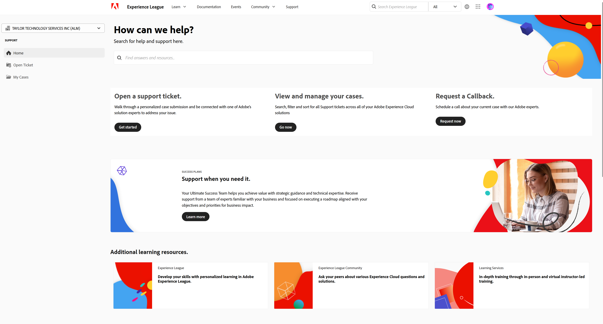

# Een ondersteuningsticket verzenden op het Experience League

Het proces voor het indienen van Adobe Learning Manager-ondersteuningstickets is nu rechtstreeks geïntegreerd met het ondersteuningsplatform voor Experiencen League. Dit is een zelfserviceportaal dat onlangs opnieuw is ontworpen om klanten met rechten meer personalisatie en gebruiksgemak te bieden. Bekijk deze handleiding hieronder voor meer informatie over hoe u toegang krijgt tot de portal voor ondersteuning van Experiencen League en een ticket registreert.

Houd er rekening mee dat het verzenden van een ondersteuningsticket alleen beschikbaar is voor geautoriseerde ondersteuningscontactpersonen. Voor uw vragen over ondersteuning kunt u uw ondersteuningstickets tot 11 mei 2025 via e-mail naar Adobe Learning Manager verzenden. Na deze datum kunt u, naast het bestaande e-mailkanaal, ook uw ondersteuningstickets verzenden via de ondersteuningsportal voor Experiencen League, zoals hieronder wordt beschreven.

1. Om tot het portaal van de Steun toegang te hebben, bezoek de **[!UICONTROL website van het Experience League]** en selecteer het **[!UICONTROL 3&rbrace; lusje van de Steun dat bij de bovenkant van de pagina wordt gevestigd.]** Alternatief, kunt u de [ directe verbinding ](https://experienceleague.adobe.com/home?lang=nl-NL#support) bezoeken.

   
   _homepage van de Steun_

2. Van de **[!UICONTROL homepage van de Steun]**, kunt u gemakkelijk aan uw open gevallen navigeren, een nieuw geval registreren, hoogste steunartikelen bekijken, of extra het leren middelen onderzoeken.

   
   _Open kaartje_

3. Om een geval voor te leggen, selecteer de optie **[!UICONTROL Open een steungeval]**. U kunt **[!UICONTROL Open Tickets]** optie op het sidebar menu ook selecteren. U zult aan de pagina van de gevalverwezenlijking worden geleid, waar u uw productnaam (Adobe Learning Manager, Audience Manager, Campagne, Doel, enz.), **[!UICONTROL titel van het Geval]**, en **[!UICONTROL beschrijving van het Geval]** kunt ingaan. Als u het proces voor het oplossen van problemen wilt versnellen, moet u het probleem zo beschrijvend mogelijk beschrijven.

   Vul tegen het einde van het formulier de volgende velden in om ons meer specifieke informatie te verschaffen die ons helpt problemen op te lossen:

   * Reden voor uitgave (selecteer de gewenste vervolgkeuzelijst voor een type uitgave)
   * Account-ID
   * Rol (beheerder, auteur, student, integratiebeheerder, enz.)
   * Hoofdletterprioriteit (laag, gemiddeld, hoog, kritiek)
   * Business Impact
   * Tijdzone
   * Optie om bedoelde gebruikers te kopiëren.

   Tot slot ben zeker om het even welke relevante dossiers te uploaden alvorens u **[!UICONTROL klikt voorlegt]**. (De bijlage is niet groter dan 24 MB)

   
   _vorm van het Ticket_

4. Zodra u **[!UICONTROL klikt leg geval]** voor, zult u aan de **[!UICONTROL Mijn gevallen]** pagina worden opnieuw gericht, waar u om het even welke en alle gevallen kunt bekijken die uw organisatie heeft voorgelegd. U kunt ook aan deze pagina navigeren door de **[!UICONTROL Mijn gevallen]** knoop op het sidebar menu te klikken. Op deze pagina kun je al je open en gesloten ondersteuningsgevallen bekijken. Met de opties boven aan de pagina kunt u filteren op status (open of gesloten) van geval tot geval of op oplossing van Experience Cloud. U kunt de zoekbalk ook gebruiken om te zoeken naar trefwoorden die betrekking hebben op uw ondersteuningsproblemen.

   
   _Open gevallen_

5. Als u meer details over een casus wilt bekijken, klikt u op de casus om de weergave te openen. In de gevalweergave kunt u de meest recente opmerkingen bekijken met de toegewezen eigenaar van de casus en aanvullende bijlagen of reacties toevoegen die u wilt.

U kunt een case escaleren door de optie &quot;Escaleren naar beheer&quot; te selecteren aan de rechterkant van de pagina onder Hoofdletterdetails. U kunt de kwestie ook sluiten door de aangrenzende knoop van het &quot;Dichte geval&quot;te selecteren.

## Aanvullende opmerkingen

Om uw escalaties op de meest efficiënte manier aan te pakken, kunt u alleen een escalatieprocedure indienen als dit ernstige gevolgen heeft voor uw organisatie, partners of klanten.

Als u verdere vragen op hebt hoe te om het **[!UICONTROL portaal van de Steun van het Experience League te gebruiken]**, te laten ons in de commentaarsectie hieronder weten, of ons team van de Steun direct bij dit e-mailadres [ almdynsupp@adobe.com ](mailto:almdynsupp@adobe.com) bereiken.

Om een geautoriseerd contact toe te voegen dat steunkaartjes via Experience League (EXL) kan openen, te bezoeken gelieve [ http://licensing.adobe.com ](http://licensing.adobe.com).
