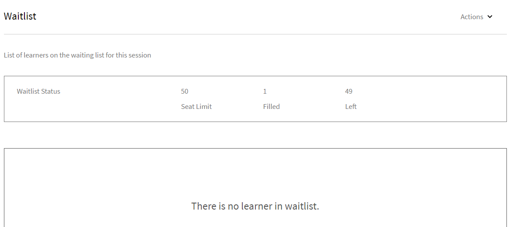

# Studenten beheren voor uw sessie

Lees dit artikel voor informatie om deelnemers te beheren en e-mails over cursussen en e-mailherinneringen voor uw sessies te sturen.

## Zie sessies of modules met beoordelingen in behandeling {#pending}

Als docent kunt u de sessies of modules met lopende beoordelingen zien.

Voor de pagina van Zittingen/van Modules, kunt u een kolom **In afwachting van Recensies** zien die het aantal hangende revisies voor de overeenkomstige zitting/de activiteit toont.

## Wachtlijst voor uw sessie beheren {#managewaitlistforyoursession}

Wanneer studenten zich voor uw module registreren, kunt u de recentste status van de inschrijvingen en wachtlijst zien op de pagina Wachtlijst.

1. Selecteer in de app voor docenten de optie Aanstaande sessies > Wachtlijst in het linkerdeelvenster.

   U kunt de Plaatslimiet en het aantal geboekte en vrije plaatsen bekijken. U ziet ook een tabel met studenten die op de wachtlijst zijn geplaatst. Deze is leeg als er niemand op de wachtlijst staat.

   
   *de wachtlijst van de Mening studenten*

1. Selecteer in de tabel Wachtlijst de student of studenten die u wilt bevestigen.
1. Selecteer Acties > Studenten bevestigen.

   De studenten die u hebt bevestigd, worden aan de lijst met bevestigde studenten toegevoegd.

Docenten kunnen studenten van sessies uitschrijven. Ze worden dan ook van het bijbehorende leermateriaal uitgeschreven. Selecteer het tabblad **[!UICONTROL Wachtlijst]**. Gebruik het selectievakje om de studenten die u wilt uitschrijven te selecteren. Om uit te schrijven, uitgezochte **[!UICONTROL Acties]** > **[!UICONTROL studenten]** uitschrijven.

*uitschrijven de studenten*

### Wachtlijstrapport

Het nieuwe **[!UICONTROL Wachtlijstrapport van Adobe Learning Manager]** staat instructeurs toe om wachtlijst studentenlijst voor alle instanties van een cursus te downloaden. De instructeurs kunnen tot dit rapport van de **[!UICONTROL Wachtlijst]** sectie op de **[!UICONTROL pagina van het Overzicht van de Zitting]** toegang hebben.

De volgende kolommen zijn beschikbaar in het rapport Wachtlijst:

* Cursusnaam
* Instantienaam
* Instantie-ID
* Instantiestatus
* Gebruikersnaam
* E-mail
* Unieke ID van gebruiker
* Datum ingeschreven (tijdzone UTC)
* Status
* Wachtlijstnummer
* Wachtlijstlimiet
* Plaatslimiet

Het rapport downloaden van de sectie Docent:

1. Login als **[!UICONTROL Instructeur]**.
2. Selecteer een sessie op de startpagina.
3. Selecteer de **[!UICONTROL optie Wachtlijst]** in de **[!UICONTROL pagina van het Overzicht van de Zitting]**.
4. Selecteer **[!UICONTROL Acties]** > **[!UICONTROL Rapport van de Uitvoer]** om het **[!UICONTROL Wachtlijst]** rapport te downloaden.

## Aanwezigheid voor uw sessie markeren {#markattendanceforyoursession}

U kunt het aantal bevestigde studenten voor de sessie, hun naam, aanwezigheidsstatus en andere details bekijken op de pagina Studenten.

1. Klik in het linkerdeelvenster op Aanstaande sessies > Studenten.
1. Selecteer de student of studenten in de lijst met deelnemers en voer een van de volgende handelingen uit:

   * Klik op Acties > Aanwezigheid markeren. Zodra de status is gemarkeerd als Deelgenomen, kunt u deze niet meer wijzigen.
   * Klik op Acties > Niet aanwezig als een student er niet was.
   * Klik op Acties > Studenten verwijderen om een student wegens annulering of om andere redenen te verwijderen.

   Een student kan een module niet voltooien totdat de aanwezigheidsstatus van de module Aanwezig weergeeft.

   
   *Aanwezigheid van de student van het Teken*

## E-mails naar studenten sturen {#sendemailstolearners}

U kunt e-mails naar specifieke of alle deelnemers van uw sessie sturen. De functie E-mail verzenden is bijzonder nuttig als u de aanwezigheid van studenten wilt bevestigen of als u informatie over de sessie wilt verzenden. U kunt ook de optie E-mail verzenden naar iedereen gebruiken om het opdracht- en sessiemateriaal of algemene informatie naar alle deelnemers te sturen.

Voer een van de volgende handelingen uit om e-mails naar studenten te sturen via de pagina Studenten in de app voor docenten:

* Selecteer een deelnemer en klik op Acties > E-mail naar bepaalde mensen verzenden om e-mails naar die specifieke deelnemer te sturen.
* Klik op Acties >E-mail verzenden naar iedereen om e-mails, cursusmateriaal of een opdracht naar alle bezoekers te sturen.

## Studentenlijst exporteren {#exportinglearnerslist}

Als docent kunt u de aanwezigheid van al uw studenten eenvoudig markeren door de deelnemerslijst als PDF te exporteren. Zo exporteert u de deelnemerslijst van de deelnemer uit het linkerdeelvenster. Klik op Acties > Studentenlijst exporteren (PDF).

Nadat de deelnemerlijst voor uw sessie is bevestigd, kunt u deze als PDF exporteren. In het afdrukbare PDF worden de studenten in een tabel weergeven. U kunt vervolgens aanwezigheid markeren of scores geven en aantekeningen maken voor uzelf of de student, allemaal in dezelfde PDF.

Rechtsboven in deze PDF staat een QR-code. Studenten kunnen deze code scannen met de mobiele Learning Manager-app voor studenten om hun aanwezigheid te markeren.

*Scan de code QR om aanwezigheid* te merken

## Inzendingen goedkeuren of afwijzen {#approveorrejectsubmissions}

Als studenten documenten zoals opdrachten, rapporten of beoordelingen voor uw sessie hebben geüpload, kunt u de documenten op de pagina Inzendingen bekijken. U kunt het materiaal gebruiken om de student te beoordelen en de inzending goed- of afkeuren.

1. Klik in het linkerdeelvenster op Aanstaande sessies of Eerdere sessies, afhankelijk van het schema van uw sessie.
1. Klik op de cursus waarvoor u de inzendingen wilt bekijken.

   Klik op Inzendingen in het linkerdeelvenster.

1. U kunt de inzendingen van deelnemers voor de geselecteerde sessie bekijken. Selecteer de inzending die u wilt goedkeuren of afwijzen en klik op Goedkeuren of Afwijzen.

   De status van de inzending verandert in Goedgekeurd of Afgewezen, afhankelijk van uw actie.

## Herinneringen voor uw sessie configureren {#configureremindersforyoursession}

1. Klik op Aanstaande sessies in het linkerdeelvenster.
1. Klik op de cursus waarvoor u de herinnering wilt instellen. Klik op Herinneringen in het linkerdeelvenster.
1. Klik in de tegel Herinnering selecteren op Herinnering instellen.

   
   *vorm herinneringen voor uw zitting*

1. Ga als volgt te werk:

   * Stel in het dialoogvenster Instellingen voor herinneringen in wanneer de herinnering naar studenten moet worden verzonden: Vóór deadline, Op deadline of Na deadline.
   * Stel in het veld Dagen voor deadline in hoeveel dagen vóór de deadline u de herinnering naar de studenten wilt versturen.
   * Stel de herhaling voor uw herinnering in.

   
   *de herinneringsmontages van de Mening*

1. Voer een van de volgende handelingen uit:

   * Klik op het vinkje om de herinnering op te slaan.
   * Klik op het kruisje om de herinnering te annuleren.

   Op de datum die u in uw herinneringsinstellingen hebt opgegeven wordt een geautomatiseerde cursusherinnering naar alle deelnemers gestuurd.

   Als u al herinneringen voor uw sessies hebt ingesteld, kunt u deze onder de tegels Bestaande herinneringen bekijken. U kunt ook aanvullende herinneringen aan uw bestaande herinneringen toevoegen.

   Klik op een bestaande herinnering om deze te verwijderen. Klik in het pop-upvenster dat verschijnt op het pictogram Verwijderen (prullenbak) om de herinnering te verwijderen.
