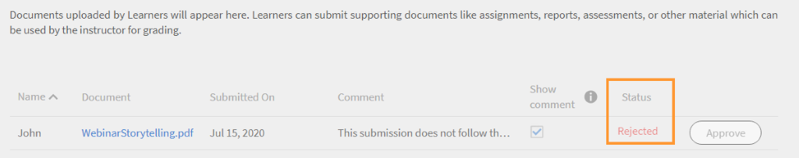

# Modules

Lees dit artikel voor meer informatie over het beheren van modules als docent in Learning Manager.

## Overzicht van sessie weergeven {#viewsessionoverview}

1. Klik in het linkerdeelvenster op Aanstaande sessie.
1. Selecteer in de lijst van uw aanstaande sessies de sessie waarvan u de details wilt bekijken.

   De app geeft het Sessie-overzicht weer met details zoals de naam van de sessie, locatie, tijdstippen, inschrijvingslimiet, wachtlijstlimiet, enzovoort.

   
   *Aanstaande sessies weergeven*

## Sessiedetails configureren {#configuresessiondetails}

1. Klik in het linkerdeelvenster op Aanstaande sessie.
1. Selecteer de sessie die u wilt bijwerken.
1. Klik op Bewerken rechtsboven.

   
   *Sessiedetails configureren*

1. Op de pagina Sessieoverzicht kunt u de sessietijdstippen, datum, locatie, enzovoort bewerken. U kunt ook de volgende sessiedetails bewerken of toevoegen:

   * Geef de inschrijvingslimiet op om het maximum aantal studenten voor de sessie in te stellen.
   * Geef de wachtlijstlimiet op als u het maximumaantal studenten dat op de wachtlijst voor de sessie is toegestaan, wilt instellen.
   * Selecteer Ja in het veld Inzendingen toestaan om studenten in staat te stellen toewijzingen in te dienen. Als u Nee selecteert, kunnen studenten geen toewijzingen uploaden voor de sessie.

   
   *Sessiedetails bewerken*

1. Klik op Opslaan.

   U kunt het veld Docent niet vanaf deze pagina bewerken.

## Bronbestanden uploaden voor uw sessie {#uploadresourcefilesforyoursession}

Als docent kunt u bronbestanden uploaden, zoals toewijzingsbestanden of presentaties voor de modules of activiteitenbestanden voor de module. Gebruik het menu Bronnen om leermiddelbestanden voor uw module of sessie toe te voegen.

1. Klik in de app voor docenten op Aanstaande sessies > Bronnen.

   U kunt de pagina Bronnen weergeven, die al een koppeling bevat naar de bronnen die de auteurs hebben geüpload voor de cursus die aan uw module is gekoppeld. Bovendien kunnen docenten ook bronbestanden voor modules uploaden.

1. Klik op Toevoegen.

   
   *Een bron voor de sessie toevoegen*

1. Blader naar het juiste bestand op uw computer. Selecteer het bestand en klik op Openen.
1. Nadat het bestand is geüpload, ziet u het bestand samen met de datum waarop het is toegevoegd.

   Studenten die zich voor deze module hebben ingeschreven, kunnen uw bestanden zien zodra ze zijn geüpload, in de sectie Bronnen onder Cursussen.

   Als u een bronbestand wilt verwijderen, selecteert u het bestand of de bestanden die u wilt verwijderen. Klik op Acties > Bestand verwijderen op de pagina Bronnen.

## Indienen van bestanden voor activiteitenmodules {#filesubmissionforactivitymodules}

De activiteitenmodule ondersteunt de workflow Bestanden verzenden. Als auteur maakt u een activiteitenmodule en selecteert u de  **[!UICONTROL Bestandsverzending]** gebruiken. Zo kunnen studenten een bestand indienen.

Deze bestanden kunnen worden goedgekeurd/afgewezen door de docenten van de module. De module wordt pas voltooid nadat de docent de inzending heeft goedgekeurd.

 
*Bestanden goedkeuren of afwijzen*

## Controlelijst evalueren {#evaluate-checklist-module}

Nadat de student de cursus heeft gevolgd, ziet de docent de controlelijstmodule op de pagina Inzendingen/controlelijsten in het **Modules** sectie. Deze pagina bevat alle modules van de activiteitencontrolelijst samen met de modules van de activiteitenindiening waarvoor de reviews worden verwacht. Voor elke module wordt het aantal studenten weergegeven waarvoor de evaluatie is gepland.

Op de onderstaande pagina kunt u modules van het type weergeven **Verzending** en **Checklist**. Voor dit voorbeeld gebruiken we de module Controlelijst.

*Lijst met modules weergeven*

Klik op de module Controlelijst. Op de **Checklist** ziet u het volgende:

* De naam van de module
* De naam van de cursus
* Instantie van de cursus
* Door de auteur ingestelde criteria doorgeven
* Aantal vragen op de controlelijst

*De pagina met controlelijsten weergeven*

Als u een student wilt evalueren, klikt u op **[!UICONTROL Evalueren]** in de **[!UICONTROL Checklist]** kolom. U kunt ook zien dat de status van de revisie **In behandeling**.

Evalueer de student en klik op **[!UICONTROL Verzenden]**. Als docent moet u op alle evaluatievragen antwoorden.

*Controlelijst voor evaluatie*

Afhankelijk van de voldoende criteria is Status mislukt of geslaagd.

Een controlelijst kan na evaluatie niet opnieuw worden geëvalueerd.

Een docent kan ook de antwoorden bekijken die zijn ingediend door andere docenten van de module.

U kunt de studenten als CSV exporteren op basis van het toegepaste zoekfilter.

Nadat de docent de cursus heeft geëvalueerd aan de hand van de controlelijst, ziet de student de modulestatus als **Doorgeven** en cursusstatus als **Voltooid** of de modulestatus **Mislukt** en cursusstatus als **Voltooid**.

## Instructeurs reageren op afwijzing van een activiteit {#rejection-comments}

Een student kan de opmerking van een docent zien in het bericht dat ter afwijzing is verzonden. De student kan vervolgens opnieuw verzenden door meer informatie in de vorm van opmerkingen te verstrekken.

Dit is de workflow:

1. Een auteur maakt een cursus met een activiteitenmodule, wijst een docent toe en publiceert de cursus.

1. Een student voltooit de cursus en dient na afloop van de cursus een bewijs van voltooiing in.

   
   *Bewijs van voltooiing indienen*

1. De instructeur selecteert dan de activiteitenmodule die aan hem/haar wordt toegewezen. Op de pagina Inzendingen voor de module klikt de docent op **Bewerken**. Vervolgens kan hij/zij de opmerkingen voor afwijzing invoeren en de optie Opmerking weergeven inschakelen, zodat de student de opmerking in het bericht kan bekijken.

   
   *Opmerkingen bij voltooiing invoeren*

1. De docent kan klikken **Afwijzen**. De status van de indiening verandert in **Gemarkeerd voor weigering**.

   
   *Een inzending afwijzen*

1. Na verzending verandert de status in **Afgewezen**.

   
   *Afwijzingsstatus weergeven*

1. De student ziet nu een melding dat zijn/haar inzending is afgewezen. De opmerkingen van de docent worden ook in de melding weergegeven.

   
   *Melding van afwijzing ontvangen*

Om de wijzigingen te kunnen doorvoeren, heeft de Adobe de e-mailsjabloon bijgewerkt voor **Inzending afgewezen**.

## Muziek en opmerkingen toevoegen voor activiteitenmodules {#addscoresandcommentsforactivitymodules}

Volg de onderstaande stappen om scores en opmerkingen toe te voegen voor activiteitenmodules die zijn verzonden voor verzending:

1. Klik in het linkerdeelvenster op **[!UICONTROL Student]**.

   
   *Een student selecteren*

1. Klik op de pagina van de student op **[!UICONTROL Handelingen]** > **[!UICONTROL Scores en opmerkingen bewerken]**.

   
   *Opmerkingen toevoegen*

   Voor studenten die de cursus niet hebben voltooid, wordt het veld voor de score en de opmerkingen niet weergegeven.

   
   *Muziek en opmerkingen bewerken*

1. Klikken **[!UICONTROL Opslaan]**.
