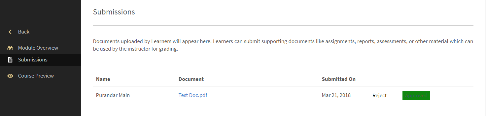
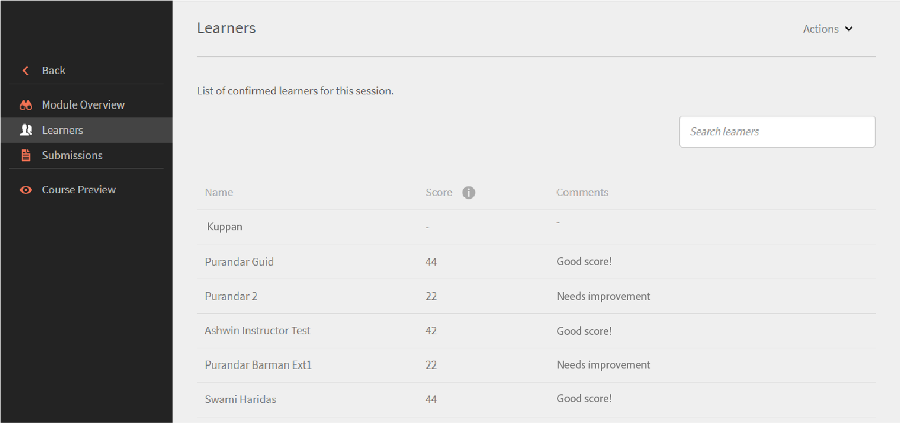

# Modules

Lees dit artikel om te weten te komen hoe u als docent modules kunt beheren in Learning Manager.

## Bekijk het sessie-overzicht {#viewsessionoverview}

1. Klik in het linkerdeelvenster op Aanstaande sessie.
1. Selecteer in de lijst van uw aanstaande sessies de sessie waarvan u de details wilt bekijken.

   De app toont het Sessie-overzicht met details zoals de naam van de sessie, de locatie, de tijdstippen, de inschrijvingslimiet, de wachtlijstlimiet etc.

   
   *Aanstaande sessies weergeven*

## Sessiedetails configureren {#configuresessiondetails}

1. Klik in het linkerdeelvenster op Aanstaande sessie.
1. Selecteer de sessie die u wilt bijwerken.
1. Klik op Bewerken in de rechterbovenhoek.

   
   *Sessiedetails configureren*

1. Op de pagina Sessieoverzicht kunt u de sessietijden, de datum, de locatie en dergelijke aanpassen. U kunt daarnaast de volgende sessiedetails bewerken of toevoegen:

   * Specificeer de Inschrijvingslimiet om het maximale aantal studenten dat voor de sessie is toegestaan, in te stellen.
   * Specificeer de wachtlijstlimiet als u het maximale aantal studenten op de wachtlijst voor de sessie wilt instellen.
   * Selecteer in het veld Inzendingen toestaan Ja om studenten in staat te stellen opdrachten in te zenden. Als u Nee selecteert, kunnen studenten geen toewijzingen uploaden voor de sessie.

   
   *Sessiedetails bewerken*

1. Klik op Opslaan.

   U kunt het docentenveld van deze pagina niet bewerken.

## Leermiddelbestanden uploaden voor uw sessie {#uploadresourcefilesforyoursession}

Als docent kunt u leermiddelbestanden uploaden, zoals opdrachtbestanden of presentaties voor de modules, of activiteitenbestanden voor de module. Gebruik het menu Leermiddelbestanden om leermiddelbestanden aan uw module of sessie toe te voegen.

1. Klik in de Docenten-app op Aanstaande sessies > Leermiddelbestanden.

   U kunt de pagina Leermiddelbestanden bekijken, die al een link bevat naar de leermiddelen die de auteurs mogelijk hebben geüpload voor de cursus die bij uw module hoort. Daarnaast kunnen docenten ook leermiddelbestanden voor modules uploaden.

1. Klik op Toevoegen.

   
   *Een bron voor de sessie toevoegen*

1. Blader naar het juiste bestand op uw computer. Selecteer het bestand en klik op Openen.
1. Nadat het bestand is geüpload, kunt u het bestand zien, samen met de datum waarop het is toegevoegd.

   Studenten die zich voor deze module hebben ingeschreven, kunnen uw bestanden zien zodra ze zijn geüpload, in de rubriek Leermiddelen onder Cursussen.

   Selecteer de te verwijderen bestanden om een of meerdere leermiddelbestanden te verwijderen. Klik op de pagina Leermiddelen op Acties > Bestand verwijderen.

## Bestand inzenden voor activiteitenmodules {#filesubmissionforactivitymodules}

De activiteitenmodule ondersteunt de workflow Bestanden inzenden. Als auteur maakt u een activiteitenmodule en selecteert u de  **[!UICONTROL Bestandsverzending]** gebruiken. Dit stelt de studenten in staat om een bestand in te zenden.

Deze bestanden kunnen door de docenten van de module worden goedgekeurd/afgewezen. De module wordt pas voltooid nadat de docent de inzending heeft goedgekeurd.

 
*Bestanden goedkeuren of afwijzen*

## De module Controlelijst beoordelen {#evaluate-checklist-module}

Nadat de student de cursus heeft gevolgd, ziet de docent de controlelijstmodule op de pagina Inzendingen/controlelijsten in het **Modules** sectie. Deze pagina bevat alle activiteitencontrolelijstmodules, samen met de modules voor inzending van activiteiten waarvoor beoordelingen gepland staan. Voor elke module staat het aantal studenten getoond voor wie de beoordeling gepland staat.

Op de onderstaande pagina kunt u modules van het type weergeven **Verzending** en **Checklist**. Voor dit voorbeeld gebruiken we de controlelijstmodule.

*Lijst met modules weergeven*

Klik op de module Controlelijst. Op de **Checklist** ziet u het volgende:

* De naam van de module
* De naam van de cursus
* Instantie waartoe de cursus behoort
* Slagingscriteria die de auteur heeft ingesteld
* Aantal controlelijstvragen

*De pagina met controlelijsten weergeven*

Als u een student wilt evalueren, klikt u op **[!UICONTROL Evalueren]** in de **[!UICONTROL Checklist]** kolom. U kunt ook zien dat de status van de beoordeling **Openstaand** is.

Beoordeel de student en klik op **[!UICONTROL Indienen]**. Als docent moet u alle beoordelingsvragen beantwoorden.

*Controlelijst voor evaluatie*

Afhankelijk van de slagingscriteria is de status Gezakt of Geslaagd.

Een controlelijst kan niet nogmaals worden beoordeeld.

Een docent kan ook de antwoorden zien die door andere docenten van de module zijn ingediend.

U kunt de studenten als CSV exporteren op basis van het toegepaste zoekfilter.

Nadat de docent de cursus heeft geëvalueerd aan de hand van de controlelijst, ziet de student de modulestatus als **Doorgeven** en cursusstatus als **Voltooid** of de modulestatus **Mislukt** en cursusstatus als **Voltooid**.

## Opmerkingen van docent voor afwijzing van een activiteit {#rejection-comments}

Een student kan de opmerking van een docent zien in het bericht dat ter afwijzing is verzonden. De student kan zich vervolgens opnieuw aanmelden door meer informatie in de vorm van opmerkingen te geven.

Dit is de workflow:

1. Een auteur maakt een cursus met een activiteitenmodule, wijst een docent toe en publiceert de cursus.

1. Een student voltooit de cursus en dient na afloop van de cursus een bewijs van voltooiing in.

   
   *Bewijs van voltooiing indienen*

1. De instructeur selecteert dan de activiteitenmodule die aan hem/haar wordt toegewezen. Op de pagina Inzendingen voor de module klikt de docent op **Bewerken**. Vervolgens kan hij/zij de opmerkingen voor afwijzing invoeren en de optie Opmerking weergeven inschakelen, zodat de student de opmerking in het bericht kan bekijken.

   
   *Opmerkingen bij voltooiing invoeren*

1. De docent kan klikken **Afwijzen**. De status van de indiening verandert in **Gemarkeerd voor weigering**.

   
   *Een inzending afwijzen*

1. Na verzending verandert de status in **Afgewezen**.

   
   *Afwijzingsstatus weergeven*

1. De student ziet nu een melding dat zijn/haar inzending is afgewezen. De opmerkingen van de docent worden ook in de melding weergegeven.

   
   *Melding van afwijzing ontvangen*

Om de wijzigingen te kunnen doorvoeren, heeft de Adobe de e-mailsjabloon bijgewerkt voor **Inzending afgewezen**.

## Scores en opmerkingen toevoegen voor activiteitenmodules {#addscoresandcommentsforactivitymodules}

Volg de onderstaande stappen om scores en opmerkingen toe te voegen voor activiteitenmodules die zijn ingezonden:

1. Klik op **[!UICONTROL Student]** in het linkerdeelvenster.

   
   *Een student selecteren*

1. Klik op de pagina Studenten op **[!UICONTROL Acties]** > **[!UICONTROL Scores en opmerkingen bewerken]**.

   
   *Opmerkingen toevoegen*

   Voor leerlingen die de cursus niet hebben voltooid, wordt het veld Scores en opmerkingen niet weergegeven.

   
   *Muziek en opmerkingen bewerken*

1. Klik op **[!UICONTROL Opslaan]**.
