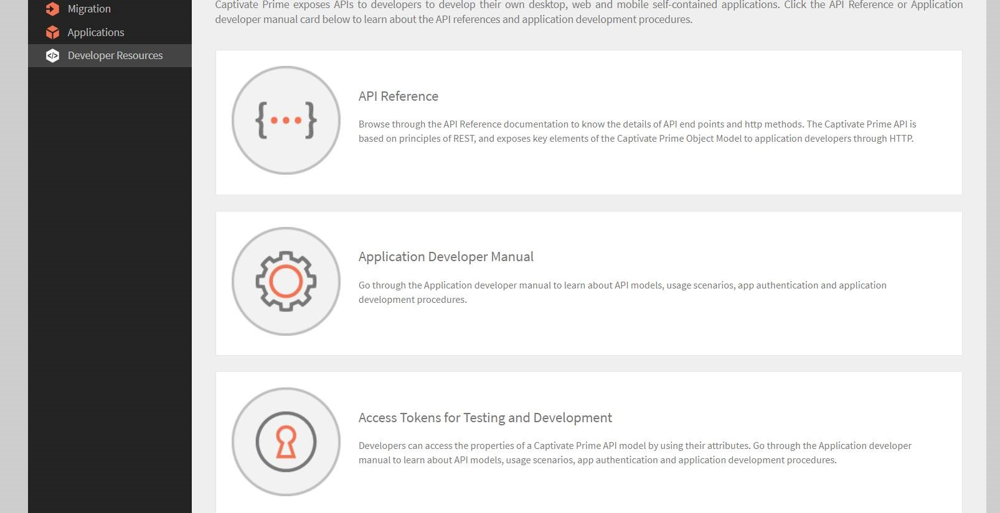

# Learning Manager integreren met AEM

## Overzicht {#overview}

Learning Manager is Learning Management System met een geïntegreerd Learning Content Management System. Gebruikers beheren hun leerinhoud door deze naar Learning Manager te uploaden, zodat Learning Manager het volgende uitvoert: versiebeheer, toewijzingen aan cursussen, het bepalen van de zichtbaarheid voor studenten, traceren van gevolgde cursussen en rapportage naar beheerders.

Er zijn echter gebruikers die hun inhoud in activabeheersystemen opslaan en beheren. De inhoud wordt dan opnieuw gebruikt voor diverse andere functies.

De diverse stroken in de Learner-app kunnen in de AEM-sites worden ingesloten. Elke student die zich aanmeldt op de AEM-site, ziet zijn of haar specifieke trainingsgegevens in deze stroken.

## Het inhoudspakket downloaden {#downloadthecontentpackage}

Het installatieprogramma wordt als een AEM-inhoudspakket verzonden. [***Het pakket downloaden***](https://github.com/adobe/captivate-prime-aem-components/releases).

Het inhoudspakket is beschikbaar als ZIP-bestand en is compatibel met AEM 6.4 en AEM 6.5.

## Installeer het Learning Manager-component {#installcaptivateprimecomponent}

Installeer het Captivate Prime-inhoudspakket met AEM-pakketbeheer:

>[!NOTE]
>
>Zie voor informatie over het installeren van pakketten  [***Werken met pakketten***](https://experienceleague.adobe.com/docs/experience-manager-65/administering/contentmanagement/package-manager.html?lang=en#how-to-work-with-packages).

1. Open AEM Package Manager als AEM-auteur.

1. Klik op de knop **Pakket uploaden**.

1. Klikken **[!UICONTROL Bladeren]** en uploadt u het inhoudspakket.
1. Klik op **[!UICONTROL Uploaden]**.
1. Als u het pakket hebt geüpload, installeert u het inhoudspakket door dit te selecteren en te klikken op **[!UICONTROL Installeren]**.

   

## Het vernieuwingstoken genereren {#generatetherefreshtoken}

Voor de AEM-beheerder is een vernieuwingstoken vereist van het Learning Manager account. De integratiebeheerder van Learning Manager genereert het vernieuwingstoken.

1. Keur de uitgelichte app van de AEM-sites goed.

   Klikken **[!UICONTROL Toepassingen]** > **[!UICONTROL Aanbevolen apps]** > **[!UICONTROL Adobe Experience Manager - Sites]**.

   

1. Klikken **[!UICONTROL Toepassingen]** > **[!UICONTROL Aanbevolen apps]** en opent u de toepassing AEM sites.

   Kopieer de toepassings-ID en de beschrijving.

1. Klikken **[!UICONTROL Bronnen voor ontwikkelaars]** > **[!UICONTROL Toegangstokens]**.

   

1. Voer de volgende gegevens in:

   * Client-ID, dit is de toepassings-ID.
   * Client-geheim, dit staat in Beschrijving.

1. Haal de OAuth-code op. U moet de API van versie 2 gebruiken in de doorverwijzings-URI.
1. Klikken **[!UICONTROL Verzenden]** en krijg het vernieuwingstoken.

## De widget in AEM configureren {#configurethewidgetinaem}

Voor de widgetconfiguratie vereist de AEM auteur alleen het vernieuwingstoken van de Learning Manager Integration-beheerder.

U kunt ook meerdere accountconfiguraties op meerdere pagina&#39;s instellen.

1. Klikken **[!UICONTROL Gereedschappen]** > **[!UICONTROL Cloud Servicen]** > **[!UICONTROL Widgetconfiguratie van Captivate Learning Manager]**.
1. Klik op **[!UICONTROL Maken]**.
1. Voer het vernieuwingstoken hier in. Stel de andere instellingen in.
1. Hostnaam moet voor EU-regio&#39;s worden gewijzigd in &quot;learningmanager&quot;.
1. Sla de configuratie op en sluit deze af.
1. Selecteer een configuratie en publiceer de configuratie.

## AEM-auteur {#aemauthor}

De AEM-auteur moet de component eerst toevoegen aan het AEM-sjabloon

Vervolgens kan de AEM-auteur het Adobe Learning Manager-component slepen en neerzetten en naar wens configureren.

De component Learning Manager vereist dat de configuratie die in de bovenstaande stap is gemaakt, wordt toegewezen aan de pagina.  Auteurs kunnen de configuratie toewijzen door Pagina-eigenschappen te bewerken onder **[!UICONTROL Gedeeld]** > **[!UICONTROL Configuratie]** > **[!UICONTROL Cloudconfiguratie]** en geef het configuratiepad op. Op deze manier kan de auteur configuraties aanmaken voor meerdere Captivate Prime-accounts en elke account toewijzen aan een andere Sites-pagina. Als een configuratie niet aan de pagina is toegewezen, leest de component de configuratie van de bovenliggende pagina recursief totdat er een is gevonden.

## Student {#learner}

De student kan de cursussen op deze pagina volgen.

Om toegang te krijgen tot de Learning Manager-widget, moet de student aangemeld zijn als een AEM-gebruiker. Ook, eigenschap **email** moet aanwezig zijn in het knooppunt &quot;/profile&quot; van het knooppunt rep:User van de student. Dit e-mailadres moet exact hetzelfde zijn als het e-mailadres in het Learning Manager-account.

De student kan de cursussen op deze pagina volgen.

De cursusvoortgang wordt ook opgeslagen.

De volgende widgets zijn beschikbaar:

1. Gamification
1. Studentenagenda
1. Sociale widget
1. Cataloguswidget
1. Mijn leermateriaal
1. Aanbeveling op basis van wat collega&#39;s leren
1. Aanbeveling door de beheerder
1. Aanbeveling op basis van interesses van student

Als er geen aanbevelingen zijn, is de widget leeg.

## Ondersteuning voor Skyline

Skyline is de cloudversie van AEM. U moet Skyline eerst installeren vanuit pakketbeheer. Als u de component Skyline in AEM wilt gebruiken, moet een gebruiker aanwezig zijn in het Leerbeheerdersaccount. Met andere woorden, het e-mailadres van de gebruiker moet in het account bestaan.

## Skyline implementeren

De stappen om Skyline te vormen worden vermeld in  [GitHub-repo](https://github.com/adobe/captivate-prime-aem-components).

## Cataloguswidget

De widget Catalogus geeft een gebruiker training weer vanuit een specifieke of een set catalogi. Selecteer Catalogus in de weergegeven opties in de sectie Eigenschappen van de pagina-eigenschappen.


De widget Catalogus bevat de volgende opties:

* **[!UICONTROL Catalogus-id&#39;s]:** De door komma&#39;s gescheiden catalogus-id&#39;s waarvoor de training moet worden weergegeven.
* **[!UICONTROL Sorteren]:** Sorteervolgorde voor de training. De opties zijn: naam, datum, aanmaakdatum, datumIngeschreven, enzovoort.
* **[!UICONTROL Studentenstatus]:** Retourneert alle training die het volgende gebruikt als filters ingeschreven, gestart, voltooid en ingeschreven. De zoekresultaten worden niet weergegeven als de sorteeroptie dateEnrolled, dueDate of dateEnrolled is.
* **[!UICONTROL Naam van vaardigheid]:** De vaardigheid die wordt gebruikt om de exacte training te filteren.
* **[!UICONTROL Tagnaam]:** De tag die wordt gebruikt om exacte resultaten te filteren.

Hier volgen enkele aanvullende componenten die u kunt aanpassen:

**[!UICONTROL Leerobjecttypen]:** Filter op basis van het type leerobject. De ondersteunde typen zijn: cursus, certificering, jobAid en learningProgram.

In AEM is de titel van een kaart in een strip aanvankelijk leeg. Typ in eigenschappen de naam van de titel in widgets.html.

**Aanpassing**

U kunt het uiterlijk van de lay-out aanpassen met widgets.html. U kunt de weergave van de kaarten die worden weergegeven wijzigen en het thema aanpassen.

In het dialoogvenster **[!UICONTROL Algemene instellingen]** kunt u de primaire en secundaire kleuren voor de kaarten kiezen en de eigenschappen opgeven om het thema aan te passen.

```
\{ 
 "globalCssText":"@import url('https://fonts.googleapis.com/css2?family=Grandstander:ital,wght@0,100;0,200;0,300;0,400;0,500;0,600;0,700;0,800;0,900;1,100;1,200;1,300;1,400;1,500;1,600;1,700;1,800;1,900&family=Montserrat:ital,wght@0,100;0,200;0,300;0,400;0,500;0,600;0,700;0,800;0,900;1,100;1,200;1,300;1,400;1,500;1,600;1,700;1,800;1,900&display=swap');", 
 "fontNames":"Grandstander", 
 "cardLayout":{ 
 "cardLayoutName":"compact", 
 "cardPrimaryColor":"#376BA4", 
 "cardSecondaryColor":"#F98EB0", 
 "startedStateTextColor":"#ffffff", 
 "continueStateTextColor":"#ffffff", 
 "revisitStateTextColor":"#ffffff", 
 "startedStateColor":"#a0a0a0", 
 "continueStateColor":"#f9a122", 
 "revisitedStateColor":"#7fbc64", 
 "textPrimaryColor":"#ffffff", 
 "textSecondaryColor":"#d93f3f", 
 "navIconColor":"#a0a0a0" 
 } 
}
```

### LO-inschrijving van hogere volgorde negeren

Als de **[!UICONTROL LO-inschrijving hogere volgorde negeren]** is ingeschakeld en een gebruiker rechtstreeks is ingeschreven voor een leerprogramma of certificering, worden de cursussen voor dat certificatie- of leerprogramma weergegeven voor de gebruiker in de widgets.

Als het selectievakje is uitgeschakeld, worden de cursussen in het leerprogramma of de certificering waarvoor de gebruiker zich niet rechtstreeks heeft ingeschreven, niet weergegeven.


De instelling wordt dan toegepast op de widget.

### Beveiliging

De velden Client-ID en Client-geheim worden toegevoegd. Bovendien wordt het vernieuwingstoken gemaskeerd. Nadat een gebruiker de volledige configuratie heeft gemaakt, als de gebruiker de configuratie opnieuw opent om deze te bewerken, of als een andere gebruiker deze configuratie opent, wordt het vernieuwingstoken gemaskeerd.
