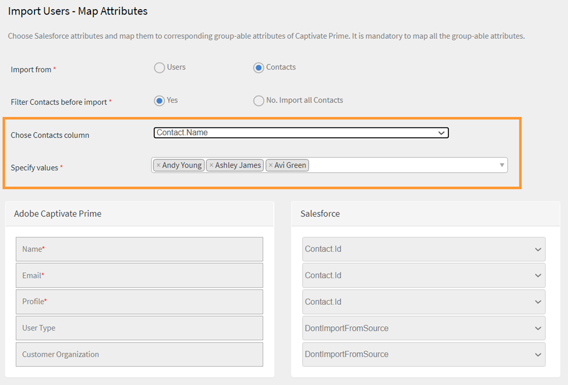
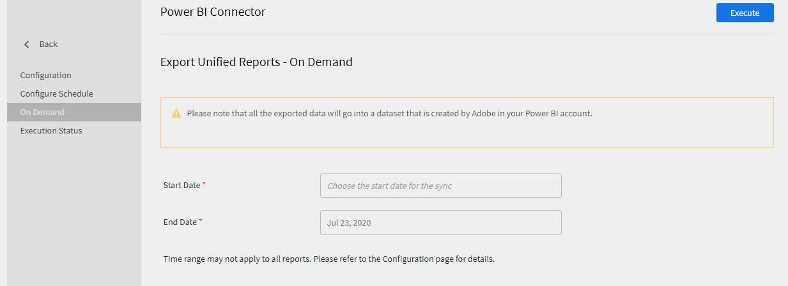
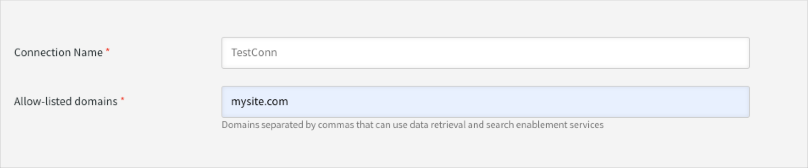

# Learning Manager-connectoren

Bedrijven hebben andere toepassingen en systemen die geïntegreerd moeten worden met Learning Manager. Connectoren zijn hulpprogramma&#39;s die helpen bij het uitvoeren van op data gebaseerde integraties, zoals het importeren van gegevens in Learning Manager van externe systemen.  Het voert ook het exporteren van gegevens naar externe systemen uit vanuit Learning Manager.

Learning Manager levert Salesforce- en FTP-connectoren. Via de Salesforce-connector kunnen de integratiebeheerders van een organisatie hun Salesforce-toepassing met Learning Manager integreren. Als integrator kunt u ook een FTP-connector gebruiken om een aantal gebruikers automatisch in uw bedrijfstoepassing te importeren.

Learning Manager levert ook de Lynda-, getAbstract- en de Harvard Management System-connectoren. Deze connectoren stellen studenten in staat om toegang te krijgen tot en gebruik te maken van cursussen van Lynda.com, getAbstract en Harvard ManageMentor.

Lees verder om te weten te komen hoe u elk van deze connectoren in Learning Manager kunt configureren en gebruiken.

<!--
>[!NOTE]
>
>**Update:** December 2020 update of Learning Manager
>
>For **FTP**, **Box**, and **Custom FTP** connectors, while exporting Learner Transcript or xAPI, you can also export the data as a **zip** file, for:
>
>* Learner Transcripts
>* xAPI
-->

>[!NOTE]
>
>Met de november 2022-versie van Adobe Learning Manager is Zoom afgekeurd [JWT-verificatie in juni 2023](https://marketplace.zoom.us/docs/guides/auth/jwt/). Volgens deze aankondiging werkt de Zoom-connector met JWT tot de genoemde datum, maar wij raden gebruikers aan om een server-naar-server OAuth-app te maken om deze functionaliteit in de accounts te vervangen. Elke nieuwe verbinding beschikt standaard over Zoom OAuth-verificatie.

## Salesforce-connector {#sfconnector}

De Salesforce-connector verbindt Learning Manager met Salesforce-accounts om de synchronisatie van gegevens te automatiseren. De mogelijkheden van de Salesforce-connector zijn als volgt:

### Kenmerken toewijzen

De integratiebeheerder kan Salesforce-kolommen kiezen en aan de overeenkomstige groepeerbare kenmerken van Learning Manager toewijzen. Wanneer de toewijzing is voltooid, wordt dezelfde toewijzing voor verdere gebruikersimporten gebruikt. De beheerder kan de toewijzing opnieuw configureren als deze een andere toewijzing voor het importeren van gebruikers wil.

### Geautomatiseerde gebruikersimport

Via het proces voor gebruikersimport kan de Learning Manager-beheerder werknemersgegevens uit Salesforce ophalen en automatisch in Learning Manager importeren. Door deze automatisering hoeft het creëren van CSV&#39;s en het uploaden naar Learning Manager niet handmatig te gebeuren.

### Automatisch plannen

Het kan effectief zijn om de functie voor automatische planning samen met de functie voor geautomatiseerde gebruikersimport te gebruiken. De Learning Manager-beheerder kan het schema volgens de behoeften van de organisatie instellen. Gebruikers in de toepassing Leermanager kunnen volgens het schema up-to-date zijn. De synchronisatie kan dagelijks worden uitgevoerd in de Learning Manager-toepassing.

### Gebruikers filteren

De Learning Manager-beheerder kan gebruikers filteren voordat ze worden geïmporteerd. Zo kan de Learning Manager-beheerder er bijvoorbeeld voor kiezen om alle gebruikers in de hiërarchie onder één of meer specifieke managers te importeren.

### De Salesforce-connector configureren {#configuresalesforceconnector}

Als u Salesforce wilt integreren met Learning Manager, moet u het proces leren

#### vereisten van het proces leren kennen {#prerequisites}

Zorg ervoor dat u uw organisatie-URL voor Salesforce hebt. Als uw organisatie bijvoorbeeld de naam **myorg** kan de Salesforce-URL `https://myorg.salesforce.com`. Dit is alles wat u moet invoeren om het Salesforce-account met Learning Manager te verbinden.

Zorg er ook voor dat u de juiste gegevens hebt om u bij het account aan te melden.

#### Een verbinding maken {#createaconnection}

1. Beweeg de muis over de Salesforce-kaart/miniatuur op de Learning Manager-startpagina. Er verschijnt een menu. Klik op **[!UICONTROL Verbinden]** in het menu.

   

   *De optie Verbinden*

1. Er verschijnt een dialoogvenster waarin u wordt gevraagd om de org-url in te voeren. Klikken **[!UICONTROL Verbinden]** nadat u de URL hebt opgegeven.
1. Zodra de verbinding tot stand is gebracht, verschijnt de overzichtspagina.

### Kenmerken toewijzen {#mapattributes}

Zodra de verbinding tot stand is gebracht, kunt u Salesforce-kolommen toewijzen aan de corresponderende kenmerken van Learning Manager. Deze stap is verplicht.

1. Op de toewijzingspagina ziet u links de kolommen van de Leermanager en rechts de kolommen van Salesforce. Selecteer de juiste kolomnaam die is toegewezen aan de kolomnaam van de leermanager.

   
   *Kenmerken toewijzen*

   >[!NOTE]
   >
   >De kolomgegevens van de leermanager die aan de linkerkant worden weergegeven, worden opgehaald uit de actieve velden. De **manager** veld moet worden toegewezen aan een veld van het type e-mailadres. U moet alle kolommen toewijzen voordat u de connector kunt gebruiken.

1. Klikken **[!UICONTROL Opslaan]** na het voltooien van de toewijzing.
1. De connector is nu klaar voor gebruik. Het account dat is geconfigureerd verschijnt als een gegevensbron binnen de beheerdersapp. De beheerder kan de import of synchronisatie op verzoek plannen.

## Gebruik van de Salesforce-connector {#usingsalesforceconnector}

De Salesforce-connector maakt verbinding met Salesforce.com om de geconfigureerde gebruikers op te halen en toe te voegen aan Learning Manager.

### Gebruikers importeren van Salesforce-contacten {#import-salesforce-contacts}

Learning Manager verbetert de Salesforce-connector nu zodat zowel contacten als Salesforce-gebruikers worden opgehaald en automatisch geïmporteerd in Learning Manager.

Voer op de Salesforce-connector-pagina de Salesforce-URL in en voltooi de verificatie. Nadat u zich hebt geverifieerd, kunt u doorgaan met het importeren van gebruikers of contactpersonen. Als u de optie Contactpersonen kiest, geeft u de subset op van de contactpersonen die u wilt importeren.

Kies de Salesforce-kolommen en wijs deze toe aan de overeenkomstige groepeerbare kenmerken van de Learning Manager. Wanneer de toewijzing is voltooid, wordt dezelfde toewijzing voor verdere gebruikersimporten gebruikt.

1. Aanmelden bij Salesforce.
1. Klik op de verbindingspagina op **[!UICONTROL Interne gebruikers importeren]**.

   
   *Interne gebruikers importeren*

1. Op de **Gebruikers importeren** , is er een nieuwe optie, Contactpersonen. Klik op het keuzerondje **Contactpersonen** en ziet u de volgende opties.

   
   *De contactkenmerken toewijzen*

1. Als u op **[!UICONTROL Ja]** kunt u het volgende doen:

   * **Kies de kolom Contactpersonen:** Selecteer het veld dat u naar Leermanager wilt importeren.
   * **Geef waarden op:** Kies de waarden die het geselecteerde veld vertegenwoordigen.

   
   *Geef de waarden op*

   * Wijs de Salesforce-kolommen toe aan die van Learning Manager.
   * Klik op **[!UICONTROL Opslaan]**.

1. Als u op **[!UICONTROL Nee. Alle contactpersonen importeren]** kunt u de velden rechtstreeks toewijzen zonder de contactpersonen te filteren. Hier importeert u alle contactpersonen uit Salesforce.
1. Klik op **[!UICONTROL Opslaan]**.

## Leerrecords exporteren

Learning Manager biedt de mogelijkheid om leerrecords zoals transcripten, gebruikersrapporten en vaardigheidsrapporten te exporteren naar Salesforce. U kunt bepalen of de geëxporteerde gegevens moeten worden gekoppeld aan de tabel &#39;Gebruiker&#39; of de tabel &#39;Contactpersonen&#39; in Salesforce.

*Leerrecords exporteren*

### Aangepaste objecten in Salesforce

Voordat u leerrecords uit Leerbeheer exporteert, moet u aangepaste objecten in Salesforce maken. Aangepaste objecten zijn objecten die u maakt om informatie op te slaan die specifiek is voor uw bedrijf of sector. Zie [Aangepaste objecten van Salesforce](https://trailhead.salesforce.com/en/content/learn/modules/data_modeling/objects_intro) voor meer informatie.

Zo maakt u de objecten:

1. Download en installeer de pakketten om de aangepaste objecten te maken.

   * [Pakket 1](https://test.salesforce.com/packaging/installPackage.apexp?p0=04t1k0000008WPJ)
   * [Pakket 2](https://test.salesforce.com/packaging/installPackage.apexp?p0=04t1k0000008WPT)
   * [Pakket 3](https://test.salesforce.com/packaging/installPackage.apexp?p0=04t1k0000008WPi)

1. Hernoem de namen van de aangepaste objecten in Salesforce.
1. Selecteer de gebeurtenis en klik op **[!UICONTROL Opslaan]**.

**Gebeurtenissen koppelen met:** Kies welke sectie u wilt exporteren - Gebruiker of Contactpersoon. Als u Contactobject kiest, worden gebruikers die wel in Leerbeheer aanwezig zijn maar niet in Salesforce, in Salesforce gemaakt.

*Gebeurtenissen koppelen, optie*

>[!NOTE]
>
>U kunt meerdere verbindingen maken in één account. Een enkele verbinding kan tot drie aangepaste objecten in Salesforce dienen. Als u meerdere verbindingen voor hetzelfde Salesforce-account wilt maken, moet u de drie pakketten installeren. We bieden ondersteuning tot drie pakketten.
>
>U moet net zoveel pakketten installeren als het aantal verbindingen dat u wilt maken.

>[!NOTE]
>
>Op de pagina Uitvoeringsstatus voor Salesforce kan het aantal verwerkte records alleen worden gecontroleerd vanuit Salesforce. In Learning Manager wordt de status weergegeven als voltooid, zelfs als alle records die zijn verwerkt gedeeltelijk zijn geëxporteerd of niet zijn voltooid.

## Het Salesforce-pakket installeren

Learning Manager biedt een Salesforce App-pakket. Na de installatie en configuratie in SFDC kunnen verkoopmedewerkers hun trainingsactiviteiten uitvoeren in de SFDC-portal. Met deze app kunnen SFDC-gebruikers nieuwe trainingen verkennen, aanbevelingen bekijken en deze rechtstreeks in de SFDC-portal gebruiken. Gebruikers ontvangen de aankondigingen die door beheerders worden verzonden in de vorm van mastheads rechtstreeks binnen de app in de SFDC-portal.

### Instellen in de Learning Manager-app.

1. Meld u als integratiebeheerder bij uw Learning Manager-beheerdersaccount aan.
1. Klikken **[!UICONTROL Toepassingen]** > **[!UICONTROL Aanbevolen apps]**.
1. Klikken **[!UICONTROL Salesforce]**.
1. Let op de toepassingspagina van Salesforce op de toepassings-id (ook wel client-id genoemd) en het clientgeheim dat in de beschrijving wordt vermeld.
1. Klikken **[!UICONTROL Goedkeuren]** en uw app moet zijn goedgekeurd.
1. Klikken **[!UICONTROL Bronnen voor ontwikkelaars]** > **[!UICONTROL Toegangstokens voor testen en ontwikkelen]**.
1. In de sectie OAuth Code ophalen moeten de client-id en het bereik worden ingesteld op - admin:read,admin:write. Klikken **[!UICONTROL Verzenden]**.
1. Voer bij Vernieuwingstoken ophalen de client-ID en het clientgeheim in. Klikken **[!UICONTROL Verzenden]** en noteer het vernieuwingstoken.

### Account aanmaken in de Salesforce-app

1. Maak een account aan op de aanmeldingspagina van Salesforce. U moet een Salesforce-account maken in de editie voor ontwikkelaars of ondernemingen.  [URL voor ontwikkelaarsaanmelding](https://developer.salesforce.com/signup). Zorg ervoor dat u de e-mail-ID gebruikt om u aan te melden voor Salesforce die u voor Leerbeheer hebt gebruikt.
1. Verifieer uw account via de verificatie-e-mail.
1. Maak een wachtwoord aan en meld u aan bij Salesforce.
1. Noteer de Salesforce-URL na aanmelding (bijvoorbeeld site.lightning.force.com)

### Installeer het Learning Manager-pakket

Als u het pakket wilt installeren, moet u eerst het bestaande pakket in Salesforce verwijderen. Voordat u de installatie ongedaan maakt, moet u de instellingen inschakelen, zoals hieronder weergegeven. U moet deze instellingen toepassen, anders kunt u het pakket niet installeren.

>[!NOTE]
>
>De app Adobe Learning Manager wordt alleen ondersteund in de Salesforce Lightning-weergave.

1. Start de [Learning Manager-pakket-URL](https://login.salesforce.com/packaging/installPackage.apexp?p0=04t1k0000008WOQ).
1. In het dialoogvenster **Aanmelden** pagina, klikken **[!UICONTROL Aangepast domein gebruiken]**.
1. Voer de URL van het pakket in en klik op **[!UICONTROL Doorgaan]**. Op de installatiepagina moet de optie Installeren voor alleen beheerders zijn geselecteerd. Wijzig deze optie niet.
1. Klikken **[!UICONTROL Installeren]**. Nadat het pakket is geïnstalleerd, klikt u op **[!UICONTROL Gereed]**. U wordt naar de pagina Geïnstalleerde pakketten geleid en u kunt het geïnstalleerde Adobe Learning Manager-pakket zien.
1. Ga naar het startprogramma voor apps (naast Configuratie) en zoek naar Adobe Learning Manager.
1. Klik op **[!UICONTROL Configureren]**.
1. Klikken **[!UICONTROL Nieuw]** en voeg de volgende details toe:

   * **Configuratie:** Voer een naam naar keuze in.
   * **ClientID**: Voer de waarde in die u in de eerste sectie hebt gekregen.
   * **ClientSecret:** Voer de waarde in die u in de eerste sectie hebt gekregen.
   * **Vernieuwingstoken:** Voer de waarde in die u in de eerste sectie hebt gekregen.
   * **LearningManagerBaseURL:** De URL van de site waarop Leerbeheer wordt gehost.

### Instellingen voor externe site toevoegen

1. Klik rechtsboven op de pagina op **[!UICONTROL Instellen]**.
1. In **[!UICONTROL Snel zoeken]**, zoek naar instellingen voor externe site.
1. Klikken **[!UICONTROL Nieuwe externe site]**.
1. Voer de gegevens in:

   * **Naam van externe site:** Voer een naam naar keuze in.
   * **Remote Site URL:** De URL van de site waar Learning Manager wordt gehost.

1. Start Learning Manager.

### Meldingen inschakelen voor de app Leermanager

1. Klik rechtsboven op **[!UICONTROL Instellen]**.
1. Zoek naar aangepaste meldingen.
1. Klikken **[!UICONTROL Nieuw]**.
1. Voer de volgende gegevens in:

   1. **Naam aangepaste melding:** LearningManagerNotification
   1. **API-naam:** LearningManagerNotification

1. Beide selecteren **Desktop** en **Mobiel** als ondersteunde kanalen.

1. Klik op **[!UICONTROL Opslaan]**.
1. Volg de onderstaande stappen om pushmeldingen voor mobiele apparaten in te schakelen:

   1. Installeer de mobiele Salesforce-app op uw mobiele telefoon.
   1. Meld u aan bij de app met uw gegevens.
   1. Ga naar **Instellen** > **Leveringsinstellingen voor meldingen**.
   1. Voeg Salesforce toe voor iOS en Android.

### Deïnstalleer Learning Manager bij Salesforce

1. Ga in de Salesforce-app naar Geïnstalleerde pakketten.
1. Klikken **[!UICONTROL Verwijderen]**.

## Learning Manager configureren voor Salesforce-gebruikers

De Learning Manager-app is ook beschikbaar voor gebruikers die in een Salesforce-account aanwezig zijn. De beheerder van Salesforce kan gebruikers toevoegen op basis van de profielen. De Salesforce-profielen komen overeen met die in Learning Manager. Bijvoorbeeld beheerder, integratiebeheerder, docent enzovoort. De Salesforce-beheerder kan ook een aangepast profiel maken.

Als Salesforce-beheerder kunt u de profielen aan gebruikers toewijzen of een aangepast profiel maken.

U kunt het Salesforce-profiel aan de studenten toewijzen wanneer u het pakket installeert.

Nadat u het pakket hebt geïnstalleerd, moet u het profiel configureren.

Klikken **[!UICONTROL Configureren]** > **[!UICONTROL Nieuw]** en voeg vervolgens het volgende toe:

* Configuratienaam
* Client-id
* Clientgeheim
* LearningManagerBaseURL
* Omleiden uitschakelen

>[!NOTE]
>
>Studenten kunnen de app Leermanager alleen weergeven als u de app voor alle studenten inschakelt.

Vervolgens geeft u toegang tot de Learning Manager-app.

*Machtigingen instellen voor toegang tot de app Leermanager*

Selecteer de gebruikers en wijs de betreffende machtigingen toe. De studenten hebben nu toegang tot de Learning Manager-app.

Nu selecteert u een profiel, een standaard profiel van een gebruiker bijvoorbeeld, en klikt u op het profiel. Klikken **[!UICONTROL Bewerken]** en in de **Aangepaste app-instellingen** schakelt u het selectievakje **Adobe Learning Manager**. Hierdoor heeft de student toegang tot de app.

In de vervolgkeuzelijst **Startpagina voor studenten** selecteert u in de sectie **Aangepaste tabbladinstellingen** de optie **Standaard ingeschakeld**.

U moet de app voor alle profielen zichtbaar maken.

Klikken **[!UICONTROL Opslaan]** en de studenten die tot alle profielen behoren, krijgen toegang tot de app Leermanager.

### Wijzigingen met betrekking tot leerpad

#### Bestaande verbindingen

Als de optie Leerpad is uitgeschakeld in het beheerdersaccount, worden er geen rijen en kolommen toegevoegd aan het rapport.

Als de optie Leerpad is ingeschakeld in het beheerdersaccount, wordt de kolom &quot;Type&quot; gevuld met Leerpad voor het geval studenten zich ervoor inschrijven.

>[!NOTE]
>
>Als de vlag wordt toegelaten en u een bestaande verbinding gebruikt, kunnen een paar verslagen worden gemist.

#### Nieuwe verbindingen

Als de optie Leerpad is uitgeschakeld in het beheerdersaccount, bestaat het trainingsrapport uit de volgende kolommen, maar bevat het geen gegevens.

* **Ingesloten pad:** geeft de naam van het leerprogramma weer.
* **Ingesloten pad-ID:** geeft de ID&#39;s voor het leerprogramma weer.
* **Ingesloten cursus-id:** Geeft de id&#39;s weer van cursussen die zich in een leerpad bevinden.

Daarnaast worden de drie nieuwe kolommen weergegeven voor nieuwe verbindingen in accounts waarvoor leerpad is ingeschakeld en stromen alle gegevens door.

Bovendien bevat het rapport het kolomtype Leerpad (hoger niveau) voor alle studenten die zijn ingeschreven voor een leerpad.

In de kolom Type wordt de naam van het leerprogramma gewijzigd in Leerpad. Bestaande verbindingen wijzigen niet.

## Learning Manager FTP-connector {#ftpconnector}

Met behulp van de FTP-connector kunt u Learning Manager integreren met willekeurige externe systemen om de synchronisatie van gegevens te automatiseren. Van externe systemen wordt verwacht dat ze gegevens in een CSV-formaat kunnen exporteren en in de juiste map van het Learning Manager FTP-account kunnen plaatsen. De mogelijkheden voor FTP-connector zijn als volgt:

U kunt ook de Box-connector gebruiken voor gegevensmigratie, gebruikersimport en gegevensexport. Zie Box connector voor meer informatie.

### Gegevensimport {#dataimport}

Met het gebruikersimportproces kan de Learning Manager Administrator werknemersgegevens ophalen van de FTP-service van Learning Manager en ze automatisch in Learning Manager importeren. Met behulp van deze functie kunt u meerdere systemen integreren door de door deze systemen gegenereerde CSV in de juiste mappen van de FTP-accounts te plaatsen. Learning Manager haalt de CSV-bestanden op, voegt ze samen en importeert de gegevens volgens de planning. Raadpleeg de planningsfunctie voor meer informatie.

**Kenmerken toewijzen**

Kenmerken toewijzen Deze toewijzing is een eenmalige inspanning. Zodra de toewijzing is voltooid, wordt dezelfde toewijzing gebruikt voor de daaropvolgende gebruikersimporten. De toewijzing kan opnieuw worden geconfigureerd als de beheerder een andere toewijzing voor het importeren van gebruikers wil hebben.

#### Gegevens exporteren {#exportdata}

Gevensexport stelt gebruikers in staat om de vaardigheden van de gebruiker en de transcripten van de student te exporteren naar een FTP-locatie om deze te integreren met een willekeurig systeem van derden.

#### Planning {#scheduling}

De beheerder kan planningstaken volgens de vereisten van de organisatie instellen en gebruikers in de Learning Manager-toepassing zijn up-to-date volgens de planning. Op dezelfde manier kan de integratiebeheerder de export van vaardigheden op een tijdige basis plannen om deze te integreren met een extern systeem. De synchronisatie kan dagelijks worden uitgevoerd in de Learning Manager-toepassing.

### Learning Manager FTP-connector configureren {#configurecaptivateprimeftpconnector}

Leer het proces om de FTP-connector te integreren met Learning Manager.

#### Een verbinding maken {#Createaconnection-1}

1. Beweeg de muis over de FTP-kaart/miniatuur op de Learning Manager-startpagina. Er verschijnt een menu. Klik op **[!UICONTROL Verbinden]** in het menu.

   

   *De optie Verbinden*

1. Er verschijnt een dialoogvenster waarin u wordt gevraagd de e-mail-ID in te voeren. Geef de e-mail-ID op van de persoon die verantwoordelijk is voor het beheer van het FTP-account van de Learning Manager voor de organisatie. Klikken **[!UICONTROL Verbinden]** nadat u de e-mail-ID hebt opgegeven.
1. Learning Manager stuurt u een e-mail waarin de gebruiker wordt gevraagd het wachtwoord opnieuw in te stellen voordat hij/zij voor het eerst toegang krijgt tot de FTP. De gebruiker moet het wachtwoord opnieuw instellen en het gebruiken om toegang te krijgen tot het Learning Manager-FTP-account.

   >[!NOTE]
   >
   >Er kan slechts één Learning Manager FTP-account worden aangemaakt voor een bepaald Learning Manager-account.

   Op de overzichtspagina kunt u de verbindingsnaam voor uw integratie opgeven. Kies uit de volgende opties welke actie u wilt uitvoeren:

   * Interne gebruikers importeren
   * xAPI importeren
   * Vaardigheden van gebruikers exporteren - Een planning configureren
   * Vaardigheden van gebruikers exporteren - Op verzoek
   * Studenttranscripten exporteren - Een planning configureren
   * Studenttranscripten exporteren - op verzoek

   
   *Exportopties*

### Importeren

+++ interne gebruiker

Met de optie voor het importeren van interne gebruikers kunt u de gebruikers van een CSV importeren in een Leermanager op verzoek of tijdens het plannen.

+++

+++Kenmerken toewijzen

Zodra de verbinding tot stand is gebracht, kunt u de kolommen van de CSV-bestanden toewijzen. Het bestand wordt in de FTP-map geplaatst bij de overeenkomstige attributen van Learning Manager. Deze stap is verplicht.

1. Op de pagina Kenmerken toewijzen ziet u links de verwachte kolommen van de leermanager en rechts de CSV-kolomnamen. In eerste instantie ziet u aan de rechterkant een leeg selectievakje. Een CSV-sjabloon importeren door te klikken **Bestand kiezen**.
1. Via de bovenstaande stap worden alle CSV-kolomnamen aan de rechterkant van de vervolgkeuzelijst ingevuld. Selecteer de juiste kolomnaam die is toegewezen aan de kolomnaam van de leermanager.

   >[!NOTE]
   >
   >Het veld Manager moet worden toegewezen aan een veld van het type e-mailadres. U moet alle kolommen toewijzen voordat u de connector kunt gebruiken.

1. Klikken **[!UICONTROL Opslaan]** na het voltooien van de toewijzing.

   De connector is nu klaar voor gebruik. Het geconfigureerde account verschijnt als gegevensbron in de beheerdersapp zodat de beheerder de import of de synchronisatie op verzoek kan plannen.

+++

+++De FTP-connector van Learning Manager gebruiken

1. De CSV-bestanden van externe systemen moeten op het volgende pad worden geplaatst:

   `code $OPERATION$/$OBJECT_TYPE$/$SUB_OBJECT_TYPE$/data.csv`

   >[!NOTE]
   >
   >In de release van juli 2016 is alleen import van gebruikers toegestaan. Om de FTP-connector te gebruiken, moet u ervoor zorgen dat de CSV-bestanden in de volgende map worden geplaatst:

   `code Home/import/user/internal/*.csv`

1. De FTP-connector haalt alle rijen uit CSV-bestanden. Het is belangrijk dat de rij die overeenkomt met een gebruiker in een CSV niet in andere CSV&#39;s verschijnt.
1. Alle CSV&#39;s moeten de kolommen bevatten die in de toewijzing zijn opgegeven.
1. Alle vereiste CSV&#39;s moeten aanwezig zijn in de map voordat het proces begint.

>[!NOTE]
>
>Tijdens het importeren van gebruikers in Learning Manager moet de beheerder ook weten hoe gebruikers worden beheerd in Learning Manager. Raadpleeg [Help bij gebruikersbeheer](migration-manual.md#usermanagement) voor meer informatie.

+++

+++xAPI importeren

Met de opties voor xAPI-import kunt u het importeren van xAPI-statements van externe diensten in Learning Manager op verzoek plannen.

+++

+++Vereiste configuraties voor het importeren van xAPI

1. Selecteer op de configuratiepagina een bestaande configuratie die beschikbaar is in de configuratielijst om xAPI-statements uit de CSV te importeren. Klik op Bewerken of **voeg een nieuwe configuratie toe** link to navigate to the configure Import-Sources page.

   **Configuratie**

   * Vul de velden Naam en Naam van bronbestand op de pagina configureren-importeren-bronnen in. De naam van het bronbestand moet overeenkomen met de bestandsnaam die is in de FTP-maplocatie opgegeven.
   * Klik op **[!UICONTROL Opslaan]** om uw wijzigingen op te slaan.

   
   *Configureren*

   **Filteren**

   * Klik in het linkerdeelvenster op **[!UICONTROL Filteren]**.
   * Vul de velden Naam en Voorwaarden op de pagina configureren-importeren-filteren in om de records uit te filteren. Klik op **[!UICONTROL Nieuw filter toevoegen]** om een ander filter toe te voegen. U kunt een filter opslaan of verwijderen door in de kolom Acties op de optie **Opslaan** of **Verwijderen** te klikken.

   
   *Filteren*

   **Toewijzing**

   * Klik in het linkerdeelvenster op **[!UICONTROL Toewijzing]**.
   * Op de pagina xAPI-statements importeren-Configuratie-Toewijzing ziet u aan de linkerkant de xAPI JSON-padveldnamen die aan de CSV-kolomnamen moeten worden toegewezen.
   * Standaard zijn de drie JSON-padveldnamen die aan de CSV-kolomnamen moeten worden toegewezen **actor.mbox**, **verb.id** en **object.id**. U kunt andere toe te wijzen velden toevoegen door op **Nieuwe toewijzing toevoegen** te klikken.

   * Selecteer het type kolomnaam dat u aan de Json-padveldnaam wilt toewijzen (of dit nu gaat een tekenreeks, nummer, Booleaan, of datumtype is).
   * Klik na het voltooien van de toewijzing op Opslaan. De xAPI-import kan nu volgens een planning of op verzoek worden geïmporteerd.

   
   *Toewijzing*

1. Klik in het linkerdeelvenster op **[!UICONTROL Planning configureren]**. Klik op **[!UICONTROL Planning inschakelen]** om het importeren van xAPI-statements te plannen.

   U kunt de starttijd en -datum invoeren en vervolgens de frequentie van uw xAPI-importplanning in dagen invoeren. Bijvoorbeeld, xAPI-import voor elke 3 dagen inschakelen.

   
   *xAPI-statements importeren - Planning configureren*

1. Klik in het linkerdeelvenster op **[!UICONTROL Uitvoering op verzoek]**.

   
   *xAPI-statements importeren - Op verzoek*

1. Klik in het linkerdeelvenster op **[!UICONTROL Uitvoeringsstatus]** om het overzicht van alle runs voor deze connector in chronologische volgorde weer te geven. U kunt de begindatum en de duur van de xAPI-import, het type import (op verzoek of volgens een planning) en de status van de import (of de xAPI-import in voortgang is, of voltooid of mislukt is) bekijken.

   
   *xAPI-statements importeren - Uitvoeringsstatus*

+++

### Badge als

+++Vaardigheden

Er zijn twee opties om vaardigheidsrapporten van de gebruiker te exporteren.

**[!UICONTROL Gebruikersvaardigheden - op verzoek]**: U kunt de startdatum opgeven en het rapport exporteren met de optie. Het rapport wordt geëxtraheerd van de ingevoerde datum tot heden.

*Exportoptie op verzoek*

**[!UICONTROL Gebruikersvaardigheden - Configureren]**: via deze optie kunt u de extractie van het rapport plannen. Selecteer het selectievakje Planning inschakelen en geef de begindatum en -tijd op. U kunt ook aangeven met welke intervallen u het rapport wilt laten genereren en verzenden.

*Exporteren van rapport configureren*

+++

Als u de exportmap wilt openen waarin de geëxporteerde bestanden zijn geplaatst, opent u de koppeling naar de FTP-map op de pagina Gebruikersvaardigheden, zoals hieronder weergegeven.

*FTP-map om bestanden weer te geven*

De automatisch geëxporteerde bestanden zijn aanwezig op de locatie **Home/export/&#42;FTP_locatie&#42;**

De automatisch geëxporteerde bestanden zijn beschikbaar met de titel, **skill_results__&#42;datum vanaf &#42;_aan_&#42;datum tot&#42;.csv**

*Geëxporteerd CSV-bestand*

+++Studenttranscript

**Configureren**: Met deze optie kunt u de extractie van het rapport plannen. Selecteer het selectievakje Planning inschakelen en geef de begindatum en -tijd op. U kunt ook aangeven met welke intervallen u het rapport wilt laten genereren en verzenden.

+++

Als u de exportmap wilt openen waarin de geëxporteerde bestanden op uw FTP-locatie worden geplaatst, opent u de koppeling naar de FTP-map op de pagina Studenttranscript, zoals hieronder weergegeven

De automatisch geëxporteerde bestanden zijn aanwezig op de locatie **Home/export/&#42;FTP_locatie&#42;**

De automatisch geëxporteerde bestanden zijn beschikbaar met de titel, **learner_transcript_&#42;datum vanaf &#42;_aan_&#42;datum tot&#42;.csv**

### Ondersteuning voor handmatige csv-velden {#supportformanualcsvfields}

Bij het importeren van gebruikersgegevens via FTP moet een beheerder alle actieve velden in het systeem toewijzen aan het juiste veld in de csv.

Dit is verplicht voor alle actieve csv-velden. Voor handmatig geactiveerde velden kan de integratiebeheerder de optie **DontImportFromSource** selecteren.

Door deze optie te selecteren worden de waarden van handmatig geactiveerde velden niet overschreven bij de csv-import. De door de student ingevulde waarden blijven intact.

>[!NOTE]
>
>Tijdens het toewijzen, als de optie **DontImportFromSource** is geselecteerd voor het actieve CSV-veld, wordt dit veld uit het systeem verwijderd.

*FTP-connector voor actieve velden*

## Lynda-connector {#lyndaconnector}

De Lynda-connector wordt gebruikt door zakelijke klanten van Lynda.com die graag willen dat hun studenten Lynda-cursussen kunnen zoeken en volgen in Learning Manager. De connector kan worden geconfigureerd om periodiek cursussen van Lynda.com op te halen met uw API-sleutel. Zodra een cursus binnen Learning Manager is gemaakt, kunnen gebruikers deze opzoeken en volgen. De voortgang van de student kan vervolgens binnen Learning Manager worden bijgehouden.

### De Lynda-connector configureren {#configurethelyndaconnector}

1. Klik op Lynda in het dashboard van de integratiebeheerder.

   U ziet de tegel met drie opties: Aan de slag, Verbinden en Verbindingen beheren.

1. Klik op Verbinden als u de Lynda-connector voor het eerst configureert.

   <!--Configure the Exavault FTP account before you configure this connector.-->

1. Geef op de verbindingspagina een naam op voor uw connector. Voer de appsleutel en de geheime sleutel voor uw verbinding in.

   >[!NOTE]
   >
   >Neem contact op met uw leverancier voor de appsleutel en de geheime sleutel.

1. Klik op Opslaan.

   De configuratie wordt opgeslagen en de Lynda-verbinding voor uw account wordt toegevoegd. U kunt nu vanaf de startpagina op Verbindingen beheren klikken en uw configuratie op elk gewenst moment bewerken.

1. Als u al een verbinding tot stand hebt gebracht, klikt u op Verbindingen beheren om al uw verbindingen te bekijken.

   >[!NOTE]
   >
   >De migratiefunctie moet zijn ingeschakeld voor uw account voordat u deze connector kunt configureren.

1. Klik op de verbinding die u wilt bewerken.
1. Klik in het linkerdeelvenster op **[!UICONTROL Configureren]**. Voer een van de volgende handelingen uit:

   * Bekijk of bewerk de details van uw account en het synchronisatieschema vanuit dit venster. Schakel het selectievakje Verbinding inschakelen in als u dit account wilt inschakelen.
   * Klik op Bewerken en bewerk uw gegevens. Klik op Herstellen om uw updates voor dit veld ongedaan te maken
   * Klik op Schema inschakelen om uw synchronisatie te plannen. U kunt de starttijd en -datum invoeren en vervolgens de frequentie van uw synchronisatieplanning in dagen invoeren. Bijvoorbeeld, om de drie dagen synchroniseren.

   Klik op **[!UICONTROL Opslaan]** om uw wijzigingen op te slaan.

   

   *Lynda-connector voor Learning Manager configureren*

1. Klik in het linkerdeelvenster op Uitvoering op verzoek. Met deze optie kunt u gebruikersfeeds en andere relevante gegevens vanuit Lynda importeren. Voer de startdatum voor de uitvoering op verzoek in en klik op Uitvoeren om de synchronisatie uit te voeren. Alle gegevens vanaf de startdatum tot heden worden geïmporteerd.

   * Wanneer de toepassing tijdens de synchronisatie uitvalt, kunt u tijdens de uitvoering klikken op Toegang tot Learning Manager uitschakelen.
   * Als u tijdens de uitvoering op Toegang tot Learning Manager inschakelen klikt, is er geen onderbreking van de service tijdens de synchronisatie.

   

   *Voer uitvoering op verzoek uit voor Lynda-connector*

1. U kunt ook op elk moment op Uitvoeringsstatus in het linkerdeelvenster klikken om het overzicht van alle runs voor deze connector in chronologische volgorde te bekijken. U kunt de startdatum en duur van de synchronisatie, het type synchronisatie (of het al dan niet gaat om synchronisatie op verzoek) en de status van de synchronisatie (of de synchronisatie wordt uitgevoerd of is voltooid) bekijken.

   >[!NOTE]
   >
   >Wanneer u een verbinding wist en opnieuw aanmaakt, worden de vorige runs voor de connector weergegeven. U kunt alle runs bekijken voordat u de verbinding wist.

   U kunt alleen de laatste synchronisatie opnieuw uitvoeren.

   

   *Bekijk het overzicht van alle runs en klik Uitvoeringsstatus*

## getAbstract-connector {#getabstractconnector}

De getAbstract-connector kan gebruikt worden door zakelijke klanten van getAbstract.com die graag willen dat hun studenten getAbstract-samenvattingen kunnen zoeken en volgen in Captivate Prime. De connector kan worden geconfigureerd om periodiek gebruiksgegevens op te halen, op basis waarvan de voltooiingsrecords van studenten in Learning Manager worden gemaakt. Lees verder om te weten te komen hoe u deze connector in Learning Manager moet configureren.

### De getAbstract-connector configureren {#configurethegetabstractconnector}

1. Klik in het dashboard van de integratiebeheerder op getAbstract.

   U ziet de tegel met drie verschillende opties: Aan de slag, Verbinden en Verbindingen beheren.

1. Klik op Verbinden als u de getAbstract-connector voor het eerst configureert.

   <!--Configure the Exavault FTP account before you configure this connector.

   Ensure that you share this FTP credentials with your content provider to access the feeds.-->

1. Voer in het veld Verbindingsnaam een naam voor uw verbinding in.

   Voer de juiste sleutels in de velden Client-ID en Clientgeheim in. Neem contact op met uw leverancier voor de juiste sleutels voor deze connector.

   De sleutels zijn nodig om de metagegevens van de door de client gevolgde cursussen te verkrijgen.

1. Klik als u al verbinding hebt op de startpagina op getAbstract > Verbindingen beheren om uw bestaande configuratie te bekijken en te bewerken.

   >[!NOTE]
   >
   >De migratiefunctie moet zijn ingeschakeld voor uw account voordat u deze connector kunt configureren.

1. Klik op de verbinding waarvan u de configuratie wilt bekijken of bewerken.

   

   *De getAbstract-connector voor Learning Manager configureren*

1. Klik in het linkerdeelvenster op Configureren. Voer een van de volgende handelingen uit:

   * Bekijk of bewerk de details van uw account en het synchronisatieschema vanuit dit venster. Schakel het selectievakje Verbinding inschakelen in als u dit account wilt inschakelen.
   * Klik op Bewerken en bewerk uw gegevens. Klik op Herstellen om uw updates voor dit veld ongedaan te maken
   * Klik op Schema inschakelen om uw synchronisatie te plannen. U kunt de starttijd en -datum invoeren en vervolgens de frequentie van uw synchronisatieplanning in dagen invoeren. Bijvoorbeeld, om de drie dagen synchroniseren.

1. Klik op **[!UICONTROL Opslaan]**.

   De configuratie wordt opgeslagen en de getAbstract-verbinding voor uw account wordt toegevoegd.

1. Klik in het linkerdeelvenster op Uitvoering op verzoek. Met deze optie kunt u gebruikersfeeds en andere relevante gegevens uit getAbstract importeren. Voer de startdatum voor de uitvoering op verzoek in en klik op Uitvoeren om de synchronisatie uit te voeren. Alle gegevens vanaf de startdatum tot heden worden geïmporteerd.

   * Wanneer de toepassing tijdens de synchronisatie uitvalt, kunt u tijdens de uitvoering klikken op Toegang tot Learning Manager uitschakelen.
   * Als u tijdens de uitvoering op Toegang tot Learning Manager inschakelen klikt, is er geen onderbreking van de service tijdens de synchronisatie.

1. U kunt ook op elk moment op Uitvoeringsstatus in het linkerdeelvenster klikken om het overzicht van alle runs voor deze connector in chronologische volgorde te bekijken. U kunt de startdatum en duur van de synchronisatie, het type synchronisatie (of het al dan niet gaat om synchronisatie op verzoek) en de status van de synchronisatie (of de synchronisatie wordt uitgevoerd of is voltooid) bekijken.

   >[!NOTE]
   >
   >Wanneer u een verbinding wist en opnieuw aanmaakt, worden de vorige runs voor de connector weergegeven. U kunt alle runs bekijken voordat u de verbinding wist.

   U kunt alleen de laatste synchronisatie opnieuw uitvoeren.

   Zorg er voor elk type synchronisatie voor dat de gebruikersfeed aanwezig is in de getAbstract FTP-map voor de gegevens die in de synchronisatie zijn gespecificeerd.

   Raadpleeg het volgende Excelblad met een voorbeeld van een gebruikersfeed-bestand van getAbstract. De bestandsnaam moet het volgende formaat hebben: **rapport_export_jjjj_MM_dd_UUmmss.xlsx** of **report_export_jjjj_MMM_dd.xlsx**.
   [Voorbeeld van Excel-blad voor getAbstract-gebruikersinvoer](assets/report-export-20170401175342.xlsx)

## Harvard ManageMentor-connector {#hmmconnector}

De Harvard ManageMentor-connector wordt gebruikt door zakelijke klanten van Harvard ManageMentor die graag willen dat hun studenten Harvard ManageMentor-cursussen kunnen zoeken en volgen. De connector helpt bij het maken van cursussen binnen Learning Manager en kan worden geconfigureerd om periodiek de voortgangsgegevens van studenten op te halen. Voer de volgende procedure uit om deze connector te configureren:

### De Harvard ManagerMentor-connector configureren {#configuretheharvardmanagermentorconnector}

1. Klik in het dashboard van de integratiebeheerder op Harvard ManageMentor.

   U ziet de tegel met drie verschillende opties: Aan de slag, Verbinden en Verbindingen beheren.

1. Klik op Verbinden als u de Harvard ManageMentor-connector voor het eerst configureert.

   <!--Configure the Exavault FTP account before you configure this connector.

   Ensure that you share this FTP credentials with your content provider to access the feeds.-->

1. Voer in het veld Verbindingsnaam een naam voor uw verbinding in. Klik op Verbinden om deze verbinding op te slaan.
1. Klik als u al verbinding hebt op de startpagina op Harvard ManageMentor > Verbindingen beheren. Klik op de verbinding die u wenst te bewerken.

   >[!NOTE]
   >
   >De migratiefunctie moet zijn ingeschakeld voor uw account voordat u deze connector kunt configureren.

   

   *Configureer de HarvardManage Mentor-connector voor Learning Manager*

1. Klik in het linkerdeelvenster op Configureren. Voer een van de volgende handelingen uit:

   * Bekijk of bewerk de details van uw account en het synchronisatieschema vanuit dit venster. Schakel het selectievakje Verbinding inschakelen in als u dit account wilt inschakelen.
   * Klik op Schema inschakelen om uw synchronisatie te plannen. U kunt de starttijd en -datum invoeren en vervolgens de frequentie van uw synchronisatieplanning in dagen invoeren. Bijvoorbeeld, om de drie dagen synchroniseren.

1. Klik in het linkerdeelvenster op Uitvoering op verzoek. Met deze optie kunt u gebruikersfeeds en andere relevante gegevens uit Harvard ManageMentor importeren. Voer de startdatum voor de uitvoering op verzoek in en klik op Uitvoeren om de synchronisatie uit te voeren. Alle gegevens vanaf de startdatum tot heden worden voor deze verbinding geïmporteerd.

   * Wanneer de toepassing tijdens de synchronisatie uitvalt, kunt u tijdens de uitvoering klikken op Toegang tot Learning Manager uitschakelen.
   * Als u tijdens de uitvoering op Toegang tot Learning Manager inschakelen klikt, is er geen onderbreking van de service tijdens de synchronisatie.

   Als u de synchronisatie om de paar dagen wilt automatiseren, geef dan het aantal dagen op in het veld Herhaal aantal dagen. Synchronisatie zorgt ervoor dat uw account wordt bijgewerkt met de laatste versie van de abstracts en samenvattingen van Harvard ManageMentor.

1. U kunt ook op elk moment op Uitvoeringsstatus in het linkerdeelvenster klikken om het overzicht van alle runs voor deze connector in chronologische volgorde te bekijken. U kunt de startdatum en duur van de synchronisatie, het type synchronisatie (of het al dan niet gaat om synchronisatie op verzoek) en de status van de synchronisatie (of de synchronisatie wordt uitgevoerd of is voltooid) bekijken.

   >[!NOTE]
   >
   >Wanneer u een verbinding wist en opnieuw aanmaakt, worden de vorige runs voor de connector weergegeven. U kunt alle runs bekijken voordat u de verbinding wist.

   U kunt alleen de laatste synchronisatie opnieuw uitvoeren.

   Om de synchronisatie te laten slagen, moet u ervoor zorgen dat ten minste één van de volgende bestanden aanwezig is in de FTP-map van Harvard ManageMentor:

   hmm12_metadata.xlsx: Dit bestand geeft de cursusmetagegevens voor de Harvard ManageMentor-connector. Zorg ervoor dat u de naamconventie volgt wanneer u het bestand uploadt.

   client_hmm12_20150125.xlsx: dit is de gebruikersfeed voor de Harvard ManageMentor-connector. De bestandsnaamconventie die gevolgd moet worden is **client_hmm12_yyyyMMMdd.xlsx.**

   Zie de volgende twee voorbeelden van gebruikersfeed- en cursusfeed-bestanden voor deze connector:

   * [Cursusmetagegevensbestand voor de Harvard ManageMentor-connector](assets/hmm12-metadata.xlsx)
   * [Gebruikersfeed voor de Harvard ManageMentor-connector](assets/client-hmm12-20170304.xlsx)

## Workday-connector {#workdayconnector}

Met behulp van de Workday-connector kunt u Learning Manager integreren met Workday tenant om de synchronisatie van gegevens te automatiseren.

### Importeren

#### Kenmerken toewijzen

De integratiebeheerder kan Workday-kolommen kiezen en aan de overeenkomstige groepeerbare kenmerken van Learning Manager toewijzen. Wanneer de toewijzing is voltooid, wordt dezelfde toewijzing voor verdere gebruikersimporten gebruikt. De beheerder kan de toewijzing opnieuw configureren als deze een andere toewijzing voor het importeren van gebruikers wil.

#### Geautomatiseerde gebruikersimport

Met het gebruikersimportproces kan de Learning Manager Administrator werknemersgegevens uit Workforce halen en ze automatisch in Learning Manager importeren.

#### Gebruikers filteren

Learning Manager Administrator kan gebruikers filteren voordat ze worden geïmporteerd. Zo kan de Learning Manager-beheerder er bijvoorbeeld voor kiezen om alle gebruikers in de hiërarchie onder één of meer specifieke managers te importeren.

### Exporteren

Via Gebruikersvaardigheden exporteren kunnen gebruikers automatisch gebruikersvaardigheden naar Workday exporteren.

>[!NOTE]
>
>Het is niet mogelijk vaardigheden van meerdere Learning Manager-accounts tegelijkertijd met hetzelfde Workday-account te exporteren.

### Planning {#Scheduling-1}

De beheerder kan planningstaken volgens de vereisten van de organisatie instellen en gebruikers in de Learning Manager-toepassing zijn up-to-date volgens de planning. Op dezelfde manier kan de integratiebeheerder de export van vaardigheden op een tijdige basis plannen om deze te integreren met een extern systeem. De synchronisatie kan dagelijks worden uitgevoerd in de Learning Manager-toepassing.

### De Workday-connector configureren {#configureworkdayconnector}

>[!PREREQUISITES]
>
>Vraag de beheerder van Workday van uw organisatie om een Gebruiker van het Systeem van de Integratie (ISU) met de toestemmingen te creëren zoals die in het document ISU_Permissions worden bepaald. Download een exemplaar via onderstaande link.

[Download een kopie van de beveiliging van het integratiesysteem voor gebruikers (ISU).](assets/isu-permissions-v1.pdf) Leer het proces om de Workday-connector te integreren met Learning Manager.

1. Beweeg de muis over de tegel van Workday op de startpagina van Learning Manager. Er verschijnt een menu. Klik op **[!UICONTROL Verbinden]** in het menu.

   

   *Workday tile*

1. Er verschijnt een dialoogvenster waarin u wordt gevraagd de gegevens voor de nieuwe verbinding in te voeren. Voer de volgende velden in voordat u de verbinding tot stand brengt.

   * Verbindingsnaam: voer een verbindingsnaam naar keuze in.
   * Host-URL: de integratiebeheerder kan de host-URL-details bij de desbetreffende Workday-beheerder opvragen.
   * Tenant: de tenant is intern in uw bedrijf. U ontvangt de gegevens van de tenant van de Workday-beheerder.
   * Gebruikersnaam en wachtwoord: De Workday-beheerder maakt een geïntegreerde systeemgebruiker (ISU) met de vereiste beveiligingsrechten en deelt deze met de integratiebeheerder.

>[!NOTE]
>
>   Learning Manager gebruikt versie 28.1 van de Workday API.

*Workday-connector configureren*

1. Klik op Verbinden na het invoeren van informatie in alle relevante velden.

   >[!NOTE]
   >
   >U kunt ook meerdere Workday-verbindingen laten synchroniseren met uw Learning Manager-account.

Op de overzichtspagina kunt u de verbindingsnaam voor uw integratie opgeven. Kies uit de volgende opties welke actie u wilt ondernemen:

* Interne gebruikers importeren
* Vaardigheden van gebruikers exporteren - Een planning configureren
* Vaardigheden van gebruikers exporteren - Op verzoek

*Overzicht van Workday*

### Importeren

#### Kenmerken toewijzen {#MapAttributes-1}

U kunt de Workday-connector gebruiken om Learning Manager en Workday te integreren om de synchronisatie van gegevens te automatiseren. U kunt alle actieve gebruikers van Workday naar Learning Manager importeren. Gebruikers kunnen worden geïmporteerd vanuit verschillende gegevensbronnen, waaronder FTP en Salesforce.

Voordat gebruikers kunnen worden geïmporteerd, moeten de gebruikersattributen van Learning Manager en Workday worden toegewezen. Kies op de overzichtspagina onder Importeren voor de optie Interne gebruikers om de toewijzingsattributen op te geven.

Voer de Adobe Learning Manager-gegevens in de kolom onder Adobe Learning Manager. Gebruik de vervolgkeuzelijsten om de juiste gegevens te selecteren voor de kolommen onder Workday.

>[!NOTE]
>
>Momenteel ondersteunt Learning Manager het importeren van 69 gebruikersattributen uit Workday. Voeg via de actieve velden in Learning Manager meer attributen toe.

*Kenmerken toewijzen*

Selecteer de **Uitsluiten van voorwaardelijke werknemers** Schakel het selectievakje in om te voorkomen dat de tijdelijke workers die beschikbaar zijn onder een manager worden geïmporteerd.

Workday heeft vier hiërarchieniveaus, terwijl Learning Manager twee niveaus heeft. De vier niveaus in Workday zijn vaardigheidsprofielcategorie, vaardigheidsprofiel, vaardigheidsitemcategorie en vaardigheidsitem. Uw vaardigheidsnaam en niveau van Leermanager worden samen toegewezen in Workday onder het vaardigheidsitem.

>[!NOTE]
>
>U kunt extra Workday-attributen toevoegen. Neem contact op met uw CSAM om de attributen toe te voegen.

+++Lijst met ondersteunde Workday-kenmerken

wd:User_ID wd:Worker_ID manager wd:Personal_Data.wd:Name_Data.wd:Preferred_Name_Data.wd:Name_Detail_Data.@wd:Formatted_Name wd:Personal_Data.wd:Name_Data.wd:Legal_Name_Data.wd:Name_Detail_Data.@wd:Formatted_Name wd:Personal_Data.wd:Name_Data.wd:Legal_Name_Data.wd:Name_Detail_Data.wd:Prefix_Data.wd:Title_Descriptor wd:Personal_Data.wd:Name_Data.wd:Preferred_Name_Data.wd:Name_Detail_Data.wd:Prefix_Data.Data wd:Title_Descriptor wd:Personal_Data.wd:Name_Data.wd:Preferred_Name_Data.wd:Name_Detail_Data.wd:First_Name wd:Personal_Data.wd:Name_Data.wd:Preferred_Name_Data.wd:Name_Detail_Data.wd:Last_Name wd:Personal_Data.wd:Name Data.wd:Legal_Name_Data.wd:Name_Detail_Data.wd:First_Name wd:Personal_Data.wd:Name_Data.wd:Legal_Name_Data.wd:Name_Detail_Data.wd:Last_Name wd:Personal_Data.wd:Contact_Data.wd:Address_Data.0.@wd:Formatted_Address wd:Personal_Data.wd:Contact_Data.wd:Address_Data.0.wd:Postal_Code wd:Personal_Data.wd:Contact_Data.wd:Email_Address_Data.0.wd:Email_Address wd:Personal_Data.wd:Contact_Data.wd:Address_Data.0.wd:Country_Region Descriptor wd:Personal_Data.wd:Contact_Data.wd:Phone_Data.0.@wd:Formatted_Phone wd:Personal_Data.wd:Contact_Data.wd:Phone_Data.0.wd:Country_ISO_Code wd:Personal_Data.wd:Contact_Data.wd:Phone_Data.0.wd:International_Phone_Code wd:Personal_Data.wd:Contact_Data.wd:Phone_Data.0.wd:Phone_Number wd:Personal_Data.wd:Primary_Nationality_Reference.wd:ID.1.$ wd:Personal_Data.wd:Gender_Reference.wd:ID.1.$ wd:Personal_Data.wd:Identification_Data.wd:National_ID.0.wd:National_ID_Data.wd:ID wd:Personal_Data.wd:Identification_Data.wd:Custom_ID.0.wd:Custom_ID_Data.wd:ID wd:User_Account_Data.wd:Default_Display_Language_Reference.wd:ID.1.$ wd:Role_Data.wd:Organization_Role_Data.wd:Organization_Role.0.wd:Organization_Role_Reference.wd:ID.1.$ wd:Employment_Data.wd:Worker_Job_Data.0.wd:Position_Data.wd:Position_Title wd:Employment_Data.wd:Worker_Job_Data.0.wd:Position_Data.wd:Business_Title wd:Employment_Data.wd:Worker_Job_Data.0.wd:Position_Data.wd:Business_Site_Summary Data.wd:Name wd:Employment_Data.wd:Worker_Job_Data.0.wd:Position_Data.wd:Business_Site_Summary_Data.wd:Address_Data.@wd:Formatted_Address wd:Employment_Data.wd:Worker_Job_Data.0.wd:Position_Data.wd:Job_Classification_Summary_Data.0.wd:Job_Classification_Reference.wd:ID.1.$ wd:Employment_Data.wd:Worker_Job_Data.0.wd:Position_Data.wd:Job_Classification_Summary_Data.0.wd:Job_Group_Reference.wd:ID.1.$ wd:Employment_Data.wd:Worker_Job_Data.0.wd:Position_Data.wd:Work_Space__Reference.wd:ID.1.$ wd:Employment_Data.wd:Worker_Job_Data.0.wd:Position_Data.wd:Job_Profile_Summary_Data.wd:Job_Family_Reference.0.wd:ID.1.$ wd:Employment_Data.wd:Worker_Job_Data.0.wd:Position_Data.wd:Job_Profile_Summary_Data.wd:Job_Profile_Name wd:Employment_Data.wd:Worker_Job_Data.0.wd:Position_Data.wd:Job_Profile_Summary_Data.wd:Job_Profile_Reference.wd:ID.1.$ wd:Employment_Data.wd:Worker_Job_Data.0.wd:Position_Data.wd:Business_Site_Summary_Data.wd:Address_Data.0.wd:Country_Reference.wd:ID.2.$ wd:Employment_Data.wd:Worker_Job_Data.0.wd:Position_Data.wd:Worker_Type_Reference.wd:ID.1.$ wd:Employment_Data.wd:Worker_Job_Data.0.wd:Position_Data.wd:Business_Site_Summary_Data.wd:Address_Data.0.@wd:Format_Address wd:Employment_Data.wd:Worker_Job_Data.0.wd:Position_Data.wd:Job_Profile_Summary_Data.wd:Management_Level_Reference.wd:ID.1.$ wd:Employment_Data.wd:Worker_Status_Data.wd:Active wd:Employment_Data.wd:Worker_Status_Data.wd:Active_Status_Date wd:Employment_Data.wd:Worker_Status_Data.wd:Hire_Date wd:Employment_Data.wd:Worker_Status_Data.wd:Original_Hire_Date Employment_Data.wd:Worker_Status_Data.wd:Gearchiveerde wd:Employment_Data.wd:Worker_Status_Data.wd:Retirement_Date wd:Employment_Data.wd:Worker_Status_Data.wd:Terminated wd:Employment_Data.wd:Worker_Status_Data.wd:Termination_Date wd:Employment_Data.wd Worker_Status_Data.wd:Termination_Last_Day_of_Work wd:Organization_Data.wd:Worker_Organization_Data.0.wd:Organization_Data.wd:Organization_Code wd:Organization_Data.wd:Worker_Organization_Data.0.wd:Organization_Data.wd:Organization_Name wd:Organization_Data.wd:Worker_Organization_Organization_Data 0.wd:Organization_Data.wd:Organization_Type_Reference.wd:ID.1.$ wd:Organization_Data.wd:Worker_Organization_Data.0.wd:Organization_Data.wd:Organization_Subtype_Reference.wd:ID.1.$ wd:Qualification_Data.wd:Education.0.wd:School_Name wd:Qualification_Data.wd:External_Job_History.0.wd:Job_History_Data.wd:Job_Title wd:Qualification_Data.wd:External_Job_History.0.wd:Job_History_Data.wd:Company wd:Management_Chain_Data.wd Worker_Surveillance_Management_Chain_Data.wd:Management_Chain_Data.0.wd:Manager.Employee_ID Primary Work Email wd:Organization_Type_Reference_cost_Center_ID wd:Organization_Type_Reference_cost_Center_Name wd:Organization_Type_Reference_Company wd:Organization_Subtype_Reference_Department wd:Organization_Subtype_Reference_Division wd:Universal_ID wd:Integration_Field_Override_Data.3.wd:Value wd:Employment_Data.wd:Worker_Job_Data.0.wd:Position_Data.wd:Business_Site_Summary_Data.wd:Address_Data.0.wd:Country_Region_Descriptor wd:Employment_Data.wd:Worker_Job_Data.0.wd:Position_Data.data wd:Business_Site_Summary_Data.wd:Address_Data.0.wd:Country_Region_Reference.wd:ID.2.$ wd:Personal_Data.wd:Contact_Data.wd:Address_Data.0.wd:Gemeente

+++

### Exporteren

U kunt alle vaardigheden van een gebruiker van Learning Manager naar Workday exporteren. Alleen actieve gebruikersvaardigheden worden geëxporteerd en Learning Manager exporteert geen gearchiveerde vaardigheden. U kunt ook meerdere Leerbeheer verbinden\
accounts aan dezelfde Workday-connector. Als de vaardigheidsnamen in twee Learning Manager-accounts hetzelfde zijn, worden ze toegewezen aan dezelfde vaardigheid in Workday. Als twee Learning Manager-accounts hetzelfde Workday-account gebruiken, is het raadzaam om de vaardigheidsnamen in alle Learning Manager-accounts bij te werken voordat u de vaardigheid in Workday bijwerkt.

+++Gebruikersvaardigheden - Configureren

Met deze optie kunt u de extractie van het rapport plannen. Zorg ervoor dat het selectievakje Exporteren van gebruikersvaardigheden via deze verbinding inschakelen is ingeschakeld. Selecteer het selectievakje Planning inschakelen en geef de begindatum en -tijd op. U kunt ook aangeven met welke intervallen u het rapport wilt laten genereren en verzenden. Schakel het selectievakje Planning inschakelen in en voer de startdatum, tijd en herhaling na een bepaald aantal dagen in. Klik op Opslaan als u klaar bent.

*Rapport voor gebruikersvaardigheden configureren*

+++

++ + Gebruikersvaardigheden - Op verzoek

U kunt de begindatum opgeven en het rapport exporteren met deze optie. Het rapport wordt geëxtraheerd van de ingevoerde datum tot heden. Voer de datum in vanaf wanneer u wilt beginnen met het genereren van het rapport en klik op Uitvoeren.

*Rapport over gebruikersvaardigheden op verzoek*

+++

++ + Gebruikersvaardigheden - Uitvoeringsstatus

Hier kunt u de samenvatting van alle taken bekijken en een statusrapport daarvan ontvangen. U kunt foutrapporten downloaden door op de foutrapportagelink te klikken.

*Uitvoeringsrapport gebruikersvaardigheden*

+++

## miniOrange-connector {#miniorangeconnector}

Met behulp van de miniOrange-connector kunt u Learning Manager integreren met miniOrange-tenant om de synchronisatie van gegevens te automatiseren.

### Importeren

#### Kenmerken toewijzen

De integratiebeheerder kan miniOrange-kenmerken kiezen en deze toewijzen aan de overeenkomstige groepeerbare kenmerken van de Learning Manager. Wanneer de toewijzing is voltooid, wordt dezelfde toewijzing voor verdere gebruikersimporten gebruikt. De beheerder kan de toewijzing opnieuw configureren als deze een andere toewijzing voor het importeren van gebruikers wil.

#### Geautomatiseerde gebruikersimport

Via het gebruikersimportproces kan de beheerder van de leermanager werknemersgegevens ophalen uit miniOrange en deze automatisch importeren in Learning Manager.

#### Gebruikers filteren

Learning Manager Administrator kan gebruikers filteren voordat ze worden geïmporteerd. Zo kan de Learning Manager-beheerder er bijvoorbeeld voor kiezen om alle gebruikers in de hiërarchie onder één of meer specifieke managers te importeren.

Neem contact op met het CSM-team van Learning Manager om de miniOrange-connector in te stellen.

### De miniOrange-connector configureren {#configureminiorangeconnector}

1. Beweeg de muis over de miniOrange-kaart/miniatuur op de startpagina van Learning Manager. Er verschijnt een menu. Klikken  **[!UICONTROL Verbinden]** in het menu.

   

   *MiniOrange-connector-tegel*

1. Klikken **[!UICONTROL Verbinden]** om een nieuwe verbinding te maken. De miniOrange-connector-pagina wordt weergegeven. Vul de gegevens in van het account dat u wenst toe te wijzen.

   

   *Een verbinding maken*

1. Als u een miniOrnage-gebruiker rechtstreeks wilt importeren als interne gebruiker van de Learning Manager, gebruikt u de **[!UICONTROL Interne gebruikers importeren]** gebruiken.

   

   *Interne gebruikers importeren*

1. Op de toewijzingspagina ziet u links de kolommen van de Leermanager en rechts de miniOrnage-kolommen. Selecteer de juiste kolomnaam die is toegewezen aan de kolomnaam van de leermanager.

   

   *Kenmerken toewijzen*

1. Klik, als u de gegevensbron als beheerder wilt bekijken bewerken, op **[!UICONTROL Instellingen > Gegevensbron]**.

   De vastgestelde miniOrange-bron wordt vermeld. Als u het filter wilt bewerken, klikt u op **[!UICONTROL Bewerken]**.

   

   *Een gegevensbron weergeven en bewerken*

1. U ontvangt een melding na voltooiing van de import. Klik op **[!UICONTROL Gebruikers > Importlogboek]** om het importlogboek te bekijken of te bewerken.

#### Een verbinding verwijderen {#deleteaconnection}

Voer de volgende stappen uit om een gevestigde miniOrange-verbinding te verwijderen.

<!---## Video conferencing connectors (Bluejeans Meetings and Zoom) {#bluejeansconnector}

You can now integrate Learning Manager with BlueJeans and Zoom connectors and use them to host classes.  The connector enables you to set up video conferencing meetings/classes with the learners.

To set up and use the connector, follow these steps.

1. In Learning Manager  home page , hover the mouse over the BlueJeans/Zoom thumbnail. A menu appears. Click  **[!UICONTROL Connect]** option from the menu.

   

   *Zoom connector tile*

1. The BlueJeans/ Zoom connector page opens. Enter the details of your account into respective fields to integrate and synchronize the user feed. You can get the details from the administrator of your connector account.

   
   *Connect to BlueJeans/ Zoom*

   >[!NOTE]
   >
   >As a learner, while enabling the connector, use the same email id used for your Learning Manager account to enable user feeds back into Learning Manager.

1. Once the connection is established, as an Author, create a VC course with BlueJeans/ Zoom as the conferencing system.

   
   
   *Create a VC course*

1. Administrators, managers, and learners can enroll learners  to  the created course. Upon enrollment, the learner receives an email. The learner can sign in to their Learning Manager account to view the program details and take the course.
1. When the course is complete, the completion report is sent to Learning Manager. The administrator can see the completion report to check the attendance and score of the learners.

   
   *Attendance and scoring report*

### Create a zoom server-to-server OAuth app

When you create a Zoom Server-to-Server OAuth app to be used in Adobe Learning Manager, you must add scopes required by Adobe Learning Manager while creating the connection.

Adobe Learning Manager requires the scopes below and the scopes must be selected in the OAuth app.

* View all user meetings /meeting:read:admin
* View and manage all user meetings /meeting:write:admin
* View report data /report:read:admin
* View all user information /user:read:admin
* View users' information and manage users /user:write:admin-->

## Box-connector {#boxconnector}

Met de Box-connector kunt u Learning Manager integreren met willekeurige externe systemen om de synchronisatie van gegevens te automatiseren. Verwacht wordt dat externe systemen gegevens kunnen exporteren in een CSV-indeling en deze in de juiste map van het Learning Manager Box-account kunnen plaatsen. De mogelijkheden van de Box-connector zijn als volgt:

U kunt de FTP-connector ook gebruiken voor gegevensmigratie, gebruikersimport en gegevensexport. Ga voor meer informatie naar [Learning Manager FTP-connector.](connectors.md#main-pars_header_1427405935)

### Gegevensimport {#DataImport-1}

Met het gebruikersimportproces kan de Learning Manager Administrator werknemersgegevens uit de Learning Manager Box-service halen en ze automatisch in Learning Manager importeren. Met behulp van deze functie kunt u meerdere systemen integreren door de door deze systemen gegenereerde CSV in de juiste mappen van de Box-accounts te plaatsen. Learning Manager haalt de CSV-bestanden op, voegt ze samen en importeert de gegevens volgens de planning. Raadpleeg de planningsfunctie voor meer informatie.

**Kenmerken toewijzen**

Kenmerken toewijzen Deze toewijzing is een eenmalige inspanning. Zodra de toewijzing is voltooid, wordt dezelfde toewijzing gebruikt voor de daaropvolgende gebruikersimporten. De toewijzing kan opnieuw worden geconfigureerd als de beheerder een andere toewijzing voor het importeren van gebruikers wil hebben.

## Gegevensexport {#dataexport}

De gegevensexport stelt gebruikers in staat om de vaardigheden van de gebruiker en de studenttranscripten te exporteren naar een Box-locatie om deze te integreren met een willekeurig extern systeem.

## Rapporten plannen {#schedulereports}

De beheerder kan planningstaken volgens de vereisten van de organisatie instellen en gebruikers in de Learning Manager-toepassing zijn up-to-date volgens de planning. Op dezelfde manier kan de integratiebeheerder de export van vaardigheden op een tijdige basis plannen om deze te integreren met een extern systeem. De synchronisatie kan dagelijks worden uitgevoerd in de Learning Manager-toepassing.

## Box-connector configureren {#configureboxconnector}

U kunt de Box-connector integreren met Learning Manager door het proces te leren kennen.

1. Beweeg de muis over de Box-kaart/miniatuur op de startpagina van Learning Manager. Er verschijnt een menu. Klik op Verbinden in het menu.

   

   *Verbinden met vak*

1. Er verschijnt een dialoogvenster waarin u wordt gevraagd de e-mail-ID in te voeren. Geef de e-mail-ID op van de persoon die verantwoordelijk is voor het beheer van het Box-account voor de organisatie. Klik op Verbinden nadat u de e-mail-ID hebt opgegeven.
1. Learning Manager stuurt u een e-mail waarin de gebruiker wordt gevraagd het wachtwoord opnieuw in te stellen voordat hij/zij voor het eerst toegang krijgt tot de Box. De gebruiker moet het wachtwoord opnieuw instellen en dit gebruiken voor toegang tot het Box-account van de Learning Manager.

   >[!NOTE]
   >
   >Er kan slechts één Learning Manager Box-account worden gemaakt voor een bepaald Learning Manager-account.

   Op de overzichtspagina kunt u de verbindingsnaam voor uw integratie opgeven. Kies uit de volgende opties welke actie u wilt uitvoeren:

   * Interne gebruikers importeren
   * xAPI-activiteitsrapporten importeren
   * Vaardigheden van gebruikers exporteren - Een planning configureren
   * Vaardigheden van gebruikers exporteren - Op verzoek
   * Studenttranscript exporteren - Een planning configureren
   * Studenttranscript exporteren - Op verzoek

## Importeren

+++Interne gebruiker

Met de optie voor het importeren van interne gebruikers kunt u het genereren van een gebruikersimportverslag automatisch plannen. De gegenereerde rapporten worden als .CSV-bestanden naar u verzonden.

+++

+++Kenmerken Kaart

Zodra een verbinding tot stand is gebracht, kunt u de kolommen van CSV-bestanden die in de Box-map zijn geplaatst, toewijzen aan de overeenkomstige kenmerken van Leerbeheer. Deze stap is verplicht.

1. Op de pagina Kenmerken toewijzen ziet u links de verwachte kolommen van de leermanager en rechts de CSV-kolomnamen. In eerste instantie ziet u aan de rechterkant een leeg selectievakje. Importeer een CSV-sjabloon door op Bestand kiezen te klikken.
1. Via de bovenstaande stap worden alle CSV-kolomnamen aan de rechterkant van de vervolgkeuzelijst ingevuld. Selecteer de juiste kolomnaam die is toegewezen aan de kolomnaam van de leermanager.

   *Het veld Manager moet worden toegewezen aan een veld van het type e-mailadres. U moet alle kolommen toewijzen voor u de connector kunt gebruiken.*

1. Klik op Opslaan nadat u de toewijzing hebt voltooid.

   De connector is nu klaar voor gebruik. Het geconfigureerde account verschijnt als gegevensbron in de beheerdersapp zodat de beheerder de import of de synchronisatie op verzoek kan plannen.

+++

+++xAPI-activiteitsrapport

Met de optie xAPI-activiteitsrapport kunt u de import van xAPI-statements uit externe diensten genereren. De bestanden worden als CSV-bestanden opgeslagen en vervolgens geconverteerd naar xAPI-statements tijdens het importeren in Learning Manager.

+++

+++Vereiste configuraties voor het importeren van xAPI

1. Selecteer op de configuratiepagina een bestaande configuratie die beschikbaar is in de configuratielijst om xAPI-statements uit de CSV te importeren. Klik op Bewerken of A **Een nieuwe configuratie toevoegen** koppeling voor navigatie naar de pagina xAPI-statements importeren-Configuratie-Bronbestand.

   

   *Een nieuwe configuratie bewerken of toevoegen*

   **Configuratie**

   * Vul de velden Naam en Naam van bronbestand op de pagina configureren-importeren-bronnen in. De naam van het bronbestand moet overeenkomen met de bestandsnaam die is in de FTP-maplocatie opgegeven.
   * Klik op **[!UICONTROL Opslaan]** om uw wijzigingen op te slaan.

   

   *Configureren*

   **Filteren**

   * Klik in het linkerdeelvenster op Filteren
   * Vul de velden Naam en Voorwaarden op de pagina configureren-importeren-filteren in om de records uit te filteren. Klik op Nieuw filter toevoegen om een ander filter toe te voegen. U kunt een filter opslaan of verwijderen door in de kolom Acties op de optie Opslaan of Verwijderen te klikken.

   

   *Filteren*

   **Toewijzing**

   * Klik in het linkerdeelvenster op Toewijzing.
   * Op de pagina Configureren-Importeren-Toewijzing ziet u aan de linkerkant de xAPI JSON-padveldnamen die aan de CSV-kolomnamen moeten worden toegewezen.
   * Standaard zijn de drie JSON-padveldnamen die aan de CSV-kolomnamen moeten worden toegewezen **actor.mbox**, **verb.id** en **object.id**. U kunt andere toe te wijzen velden toevoegen door op Nieuwe toewijzing toevoegen te klikken.
   * Selecteer het type kolomnaam dat u aan de Json-padveldnaam wilt toewijzen (of dit nu gaat een tekenreeks, nummer, Booleaan, of datumtype is).
   * Klik na het voltooien van de toewijzing op Opslaan. De xAPI-import kan nu volgens een planning of op verzoek worden geïmporteerd.

   
   *Toewijzing*

1. Klik in het linkerdeelvenster op **[!UICONTROL Planning configureren]**. Klik op Planning inschakelen om het importeren van xAPI-statements te plannen. U kunt de starttijd en -datum invoeren en vervolgens de frequentie van uw xAPI-importplanning in dagen invoeren. Bijvoorbeeld, xAPI-import voor elke 3 dagen inschakelen.

   
   *xAPI-statements importeren - Planning configureren*

1. Klik in het linkerdeelvenster op **[!UICONTROL Uitvoering op verzoek]**.

   
   *xAPI-statements importeren - Op verzoek*

1. Klik in het linkerdeelvenster op **[!UICONTROL Uitvoeringsstatus]** om het overzicht van alle runs voor deze connector in chronologische volgorde weer te geven. U kunt de begindatum en de duur van de xAPI-import, het type import (op verzoek of volgens een planning) en de status van de import (of de xAPI-import in voortgang is, of voltooid of mislukt is) bekijken.

   
   *xAPI-statements importeren - Uitvoeringsstatus*

+++

+++Interface van de Learning Manager Box-connector

1. De CSV-bestanden van externe systemen moeten op het volgende pad worden geplaatst:

   `code $OPERATION$/$OBJECT_TYPE$/$SUB_OBJECT_TYPE$/data.csv`

   >[!NOTE]
   >
   >In de release van juli 2016 is alleen import van gebruikers toegestaan. Zorg er daarom voor dat de CSV-bestanden in de volgende map worden geplaatst om de Box-connector te gebruiken:

   `code Home/import/user/internal/*.csv`

1. De Box-connector haalt alle rijen uit CSV-bestanden. Het is belangrijk dat de rij die overeenkomt met een gebruiker in een CSV niet in andere CSV&#39;s verschijnt.
1. Alle CSV&#39;s moeten de kolommen bevatten die in de toewijzing zijn opgegeven.
1. Alle vereiste CSV&#39;s moeten aanwezig zijn in de map voordat het proces begint.

Bij het importeren van gebruikers in Learning Manager, moet de beheerder ook weten hoe gebruikers in Learning Manager beheerd worden. Raadpleeg [Help bij gebruikersbeheer](migration-manual.md#usermanagement) voor meer informatie.

+++

## Badge als

+++Vaardigheden

Er zijn twee opties om vaardigheidsrapporten van de gebruiker te exporteren.

Gebruikersvaardigheden - Op verzoek: u kunt via deze optie de startdatum specificeren en het rapport exporteren. Het rapport wordt geëxtraheerd vanaf de ingevoerde datum tot heden

**[!UICONTROL Gebruikersvaardigheden - Configureren]**: via deze optie kunt u de extractie van het rapport plannen. Selecteer het selectievakje Planning inschakelen en geef de begindatum en -tijd op. U kunt ook aangeven met welke intervallen u het rapport wilt laten genereren en verzenden.

+++

Als u de Exportmap wilt openen waar de geëxporteerde bestanden op uw Box-locatie worden geplaatst, opent u de koppeling naar Box-map op de pagina Gebruikersvaardigheden, zoals hieronder weergegeven.

De automatisch geëxporteerde bestanden zijn aanwezig op de locatie **Home/export/&#42;Box_location&#42;**

De automatisch geëxporteerde bestanden zijn beschikbaar met de titel, **skill_results__&#42;datum vanaf &#42;_aan_&#42;datum tot&#42;.csv**

>[!NOTE]
>
>De klant beheert de toegangsrechten en de inhoud in de Box-map die door het team van Leermanager wordt gedeeld.  Ook de inhoud in de map wordt fysiek opgeslagen in de regio Frankfurt.

### Ondersteuning voor handmatige csv-velden {#Supportformanualcsvfields-1}

Bij het importeren van gebruikersgegevens via Box moet een beheerder alle actieve velden in het systeem toewijzen aan het juiste veld in de csv.

Dit is verplicht voor alle actieve csv-velden. Voor handmatig geactiveerde velden kan de integratiebeheerder de optie **DontImportFromSource** selecteren.

Door deze optie te selecteren worden de waarden van handmatig geactiveerde velden niet overschreven bij de csv-import. De door de student ingevulde waarden blijven intact.

>[!NOTE]
>
>Tijdens het toewijzen, als de optie **DontImportFromSource** is geselecteerd voor het actieve CSV-veld, wordt dit veld uit het systeem verwijderd.

*Box-connector voor actieve velden*

>[!NOTE]
>
>Elke connector of migratie, die gebruik maakt van FTP/Box als gegevensbron, zal alle csv-bestanden die worden verwerkt, verwijderen.
>
>Het csv-bestand voor de inhoudconnectoren, bijvoorbeeld LinkedIn, zal na zeven dagen worden verwijderd, terwijl het csv-bestand voor het importeren van gebruikers onmiddellijk zal worden verwijderd.

## LinkedIn Learning-connector {#linkedinlearningconnector}

De LinkedIn Learning-connector wordt gebruikt door zakelijke klanten van LinkedIn.com die graag willen dat hun studenten cursussen kunnen zoeken en volgen in Learning Manager. De connector kan worden geconfigureerd om periodiek cursussen op te halen met uw API-sleutel. Zodra een cursus binnen Learning Manager is gemaakt, kunnen gebruikers deze opzoeken en volgen. De voortgang van de student kan vervolgens binnen Learning Manager worden bijgehouden.

>[!NOTE]
>
>De tijd die wordt besteed aan cursussen van LinkedIn Learning wordt via het LinkedIn Content/LinkedIn-platform doorgegeven aan het Learning Manager-studieplatform. Als LinkedIn Learning de studietijd niet doorstuurt, kan deze tijd niet door ons studieplatform worden geregistreerd. In dat geval is de leertijd die door de leermanager wordt weergegeven nul.

### Instellingen configureren in Linkedln Learning-portaal {#configuresettingsinlinkedlnlearningportal}

1. Meld u als beheerder aan bij Linkedln Learning LMS.
1. Klikken **[!UICONTROL beheerder]** in het bovenste navigatievenster.
1. Klik op het tabblad **[!UICONTROL Instellingen]** in het volgende venster.
1. Selecteren **[!UICONTROL Afspeelintegratie]** in het linkernavigatievenster en klik vervolgens op de knop **Integratie** tabblad.
1. Klikken **[!UICONTROL LMS Content Launch Settings]** om de instellingen uit te vouwen.
1. Voeg de volgende drie hostnamen toe: **learningmanager.adobe.com**, **learningmanagerlrs.adobe.com**, **cpcontents.adobe.com**
1. Selecteer **[!UICONTROL AICC-integratie inschakelen]**.

   

   *LinkedIn Learning-configuratie*

### LinkedIn Learning-connector configureren {#configurelinkedinlearningconnector}

1. Klik in het dashboard Integratiebeheerder op [!UICONTROL LinkedIn Learning]. De opties Aan de slag, Verbinden en Verbindingen beheren worden weergegeven.
1. Als u de LinkedIn Learning-connector voor het eerst configureert, klikt u op [!UICONTROL Verbinden].

   <!--Configure the Exavault FTP account before you configure this connector.

   
   *Configure connection*-->

1. Geef op de verbindingspagina een naam op voor uw connector. Voer de appsleutel en de geheime sleutel voor uw verbinding in.

   >[!NOTE]
   >
   >De bedrijfsbeheerder kan een nieuwe toepassing genereren via de LinkedIn Learning Admin-portal om de appkey en de geheime sleutel op te halen.

1. Klik op **[!UICONTROL Opslaan]**.

   De configuratie wordt opgeslagen en de LinkedIn Learning-verbinding voor uw account wordt toegevoegd. U kunt nu klikken op **[!UICONTROL Verbindingen beheren]** vanaf de startpagina en uw configuratie op elk gewenst moment bewerken.

1. Als u al een verbinding tot stand hebt gebracht, klikt u op **[!UICONTROL Verbindingen beheren]** bekijk al uw verbindingen.

   >[!NOTE]
   >
   >De migratiefunctie moet zijn ingeschakeld voor uw account voordat u deze connector kunt configureren.

1. Klik op de verbinding die u wilt bewerken.
1. Klik in het linkerdeelvenster op Configureren. Voer een van de volgende handelingen uit:

   * Bekijk of bewerk de details van uw account en het synchronisatieschema vanuit dit venster. Selecteer de **[!UICONTROL Verbinding inschakelen]** Schakel dit selectievakje in als u dit account wilt inschakelen.
   * Klikken **[!UICONTROL Bewerken]** en bewerk uw referenties. Klik op Herstellen om uw updates voor dit veld ongedaan te maken.
   * Klikken **[!UICONTROL Planning inschakelen]** om uw synchronisatie te plannen. U kunt de starttijd en -datum invoeren en vervolgens de frequentie van uw synchronisatieplanning in dagen invoeren. Bijvoorbeeld, om de drie dagen synchroniseren.

   Klik op **[!UICONTROL Opslaan]** om uw wijzigingen op te slaan.

1. Klik in het linkerdeelvenster op **[!UICONTROL Uitvoering op verzoek]**. Met deze optie kunt u gebruikersfeeds en andere relevante gegevens vanuit LinkedIn importeren. Voer de startdatum in voor de uitvoering op verzoek en klik op Uitvoeren om de synchronisatie uit te voeren. Alle gegevens vanaf de startdatum tot heden worden geïmporteerd.

   * U kunt op **[!UICONTROL Toegang uitschakelen]** naar Leermanager tijdens de uitvoering wanneer de toepassing tijdens de synchronisatie een downtime heeft.
   * Als u op **[!UICONTROL Toegang inschakelen]** naar Leermanager tijdens de uitvoering, er is geen onderbreking in de service tijdens de synchronisatie.

   

   *Uitvoering van het rapport op verzoek*

1. U kunt ook op elk moment op Uitvoeringsstatus in het linkerdeelvenster klikken om het overzicht van alle runs voor deze connector in chronologische volgorde te bekijken. U kunt de startdatum en duur van de synchronisatie, het type synchronisatie (of het al dan niet gaat om synchronisatie op verzoek) en de status van de synchronisatie (of de synchronisatie wordt uitgevoerd of is voltooid) bekijken.

   

   *Uitvoeringsstatus rapporteren*

   >[!NOTE]
   >
   >Wanneer u een verbinding wist en opnieuw aanmaakt, worden de vorige runs voor de connector weergegeven. U kunt alle runs bekijken voordat u de verbinding wist.

   U kunt alleen de laatste synchronisatie opnieuw uitvoeren.

### LinkedIn Learning-content filteren {#filter-linkedin}

Er zijn filters in LinkedIn-connectoren om inhoud te scheiden op basis van LinkedIn Learning-bibliotheken. Daarnaast kunt u ook inhoud filteren op basis van taal en bibliotheek en alleen de cursussen in de gewenste talen importeren. Wanneer de inhoud is geïmporteerd, wordt deze op basis van de importconfiguratie gescheiden in meerdere catalogi.

Dit zijn de filters:

**Gebruik van filtertraining:** filtert een subgroep van cursussen uit LinkedIn naar Learning Manager.

* **Gebaseerd op taal**

*Filteren op taal*

* **Gebaseerd op Library from LinkedIn Learning**

*Filteren op catalogus*

**Trainingen importeren naar**

*Training importeren in catalogi*

**Importtags**

Er is een type tag, **aangepaste tag**, die u kunt gebruiken om aangepaste tags toe te voegen aan uw LinkedIn Learning-cursussen. U kunt zoveel tags toevoegen als u wilt, van elkaar gescheiden door komma&#39;s.

*Aangepaste tags toevoegen*

De inhoud wordt pas na de migratie opgeslagen. De inhoud wordt in respectieve catalogi opgeslagen.

## Power BI-connector {#powerbiconnector}

>[!NOTE]
>
>Learning Manager ondersteunt alleen integratie met commerciële licenties van Microsoft Power BI. Het integreert niet met Microsoft Power BI in Government Cloud.

U kunt integratie met deze connector gebruiken om uw bestaande Power BI-accounts te benutten voor het analyseren en visualiseren van leergegevens uit Learning Manager binnen Power BI. Tijdens de configuratie kan de integratiebeheerder zijn Power BI-werkruimte zo instellen dat deze stapsgewijs wordt gevuld met twee live-datasets - studenttranscript en rapporten over gebruikersvaardigheden. U kunt vervolgens alle functies en mogelijkheden van Power BI gebruiken om aangepaste dashboards te ontwikkelen, implementeren en distribueren naar wens van de organisatie.

### De connector configureren {#configuringtheconnector}

Om de connector te configureren, kunt u in het dialoogvenster **[!UICONTROL Connectoren]** pagina, aanwijzen over de **[!UICONTROL Power BI]** tegel en klikken **[!UICONTROL Verbinden]**. De Power BI-pagina wordt geopend. Verstrek de client-ID en het clientgeheim van de app, de naam van de tenant en de werkruimte-ID (optioneel) om een verbinding tot stand te brengen. Volg deze stappen om deze gegevens te verkrijgen.

*Configureer de Power BI-connector*

1. Starten <https://app.powerbi.com/embedsetup>.
1. Klikken **[!UICONTROL Insluiten voor uw organisatie]** en meld u aan bij uw Microsoft-account.
1. Voer de naam van de app in.
1. Selecteer in de sectie App-type de optie Server-side web-app.
1. In het dialoogvenster **[!UICONTROL URL omleiden]** de optie **Een aangepaste URL gebruiken** (Kies deze optie als u de URL van de doeltoepassing kent). Voer de volgende URL in:

   `https://learningmanager.adobe.com/ctr/app/azure/_callback` (werk het domein bij op basis van de omgeving)

1. Voer in het veld Home-URL de volgende URL in: `https://learningmanager.adobe.com/`
1. Selecteer in de sectie Machtigingen de optie **Alle gegevenssets lezen** en **Alle gegevenssets lezen en schrijven**.

   De tenant verkrijgen: neem contact op met uw Power BI-beheerder om de naam van de tenant op te geven.

   Werkplek-ID verkrijgen: een werkplek maken is alleen mogelijk voor Power BI Pro-gebruikers. U kunt een werkplek maken in Power BI en de ID uit de URL halen.

1. Klikken **[!UICONTROL App registreren]** en sla de client-id en het clientgeheim op.

>[!NOTE]
>
>Als u de verbinding opnieuw wilt autoriseren, moet u nog een Power App maken en de omleidings-URL voor herbranding opgeven.

U kunt Studenttranscripten, Gebruikersvaardigheden en xAPI-activiteitsrapport op dezelfde manier exporteren. Kies in het linkerpaneel voor Studenttranscripten/Gebruikersvaardigheden. De pagina Exporteren wordt geopend.

Schakel het selectievakje **[!UICONTROL Gebruikersvaardigheid/Studenttranscript-export inschakelen in via deze verbinding]** in. Wijzigingen opslaan.

**Export configureren**: als u de extractie van het rapport wilt plannen. Selecteer de **[!UICONTROL Planning inschakelen]** en geef de begindatum en -tijd op. U kunt ook aangeven met welke intervallen u het rapport wilt laten genereren en verzenden.

*De uitvoer vormt om het rapport te plannen*

**Exporteren op verzoek:** U kunt de begindatum opgeven en het rapport exporteren met de optie. Het rapport wordt geëxtraheerd vanaf de ingevoerde datum tot heden.

*Exporteren op verzoek*

De geëxporteerde gegevens kunnen worden bekeken door u aan te melden bij uw Power BI-account. De geëxporteerde gegevens staan vermeld onder de optie gegevenssets.

### xAPI Activiteitsrapporten exporteren in Learning Manager {#exportxapiactivityreportsincaptivateprime}

Klik op de pagina met PowerBI-xAPI-mogelijkheden op **[!UICONTROL xAPI-activiteitsrapport exporteren]**.

*PowerBI - xAPI-activiteitsrapport exporteren*

Selecteer **Configuratie** in het linkerdeelvenster en volg de onderstaande stappen:

* Vul het JSON-padveld in dat met de kolomnaam en het tekenreekstype overeenkomt.
* Klik op **[!UICONTROL Toevoegen]** om meer JSON-paden toe te voegen.
* U kunt de invoer in de JSON-padvelden bewerken door op **[!UICONTROL Bewerken]** te klikken.
* Klik op **[!UICONTROL Opslaan]** om uw wijzigingen op te slaan.

**Planning configureren**

Klik in het linkerdeelvenster op **[!UICONTROL Planning configureren]** en doe het volgende:

* Klik op Exporteren van xAPI-statements via deze verbinding inschakelen.
* Selecteer het selectievakje **[!UICONTROL Planning inschakelen]** en geef de begindatum en -tijd op. U kunt ook opgeven om de hoeveel dagen de export moet worden herhaald en verzonden.
* Klik op de knop **[!UICONTROL Opslaan]** om de instellingen van de geconfigureerde planning op te slaan.

*Planning configureren van xAPI-export*

**Op verzoek**

Klik in het linkerdeelvenster op **[!UICONTROL Op verzoek]** en geef de begindatum op de pagina xAPi-statements exporteren-Op verzoek.

*xAPI-export op verzoek*

Alle geëxporteerde gegevens gaan naar een dataset die door Adobe in uw Power BI-account wordt gemaakt.

xAPI-export naar Power BI mislukt als enkele van de xAPI-statements in LRS geen JSON-pad hebben dat voor export is geconfigureerd. Voor de xAPI-statements waar het JSON-pad niet beschikbaar is, moet de constante waarde N/A worden toegevoegd en weergegeven in Power BI.

**Uitvoeringsstatus**

Selecteer **Uitvoeringsstatus** om een overzicht van alle taken in chronologische volgorde weer te geven. Het waarschuwingsteken geeft aan wat er tijdens de run fout is gegaan. U kunt foutrapporten downloaden als **CSV** door op de koppeling voor het foutrapport te klikken.

*Uitvoeringsstatus xAPI-export*

### Gecombineerde rapporten {#unified-reports}

Leermanager biedt een manier om export te maken met een combinatie van rapporten zoals gebruikersgegevens, studenttranscript, gamification, feedbackrapporten en meer, als één dataset naar Power BI.

Hierdoor kunnen Power BI-gebruikers de gegevens uit meerdere rapporten samenvoegen om veel krachtige analyses en visualisaties in Power BI te presenteren.

*Uniforme rapporten voor Power BI*

**Export op verzoek**

Geef de begindatum en einddatum op en exporteer het rapport met de optie. Het rapport wordt voor het opgegeven datumbereik geëxtraheerd.

*Op verzoek exporteren*

**Geplande export**

Als u de extractie van het rapport wilt plannen. Selecteer het selectievakje **Planning inschakelen** en geef de begindatum en -tijd op. U kunt ook aangeven met welke intervallen u het rapport wilt laten genereren en verzenden.

*Planning configureren*

U kunt trainingsrapporten ook exporteren naar Power BI.

Trainingsrapporten kunnen worden geëxporteerd naar Power BI als onderdeel van de functie Gecombineerde rapporten.

Het trainingsrapport heeft twee extra velden:

* Aantal gebruikers dat feedback op een cursus heeft gedeeld
* Gemiddelde waardering met sterren voor een cursus

### Filterstatus van studenttranscripten {#lt-status}

In het gedeelte Gecombineerde rapporten van een Power BI-connectie is er een optie om studenttranscripten te exporteren op basis van de status van de leerobjecten.

* **Alles selecteren:** exporteer alle bestanden of activiteiten op moduleniveau in het opgegeven datumbereik.
* **Voltooid:** exporteer alle bestanden die voltooid zijn in het datumbereik.
* **Wordt uitgevoerd:** Exporteer alle records met de status In uitvoering.
* **Niet gestart:** Sluit de records uit die in het opgegeven datumbereik zijn ingeschreven, maar die niet zijn gestart bij het genereren van het rapport.

* **Niet ingeschreven:** voeg alle bestanden bij die niet zijn ingeschreven in het datumbereik.

*Filterstatus van leertranscripten*

U kunt de gewenste lijst exporteren en Power BI gebruiken om het rapport later te analyseren.

### Power BI-sjablonen downloaden {#template}

Learning Manager biedt ook kant-en-klare sjablonen voor Power BI. Deze sjablonen bieden betere analysemogelijkheden voor Adobe Leermanager-accountbeheerders.

U kunt de sjablonen eenvoudig downloaden, relevante rapporten exporteren en rapporten met een plotbestand samenstellen met behulp van deze beschikbare sjablonen.

*Power BI-sjablonen downloaden*

Zo kunnen gebruikers deze sjablonen downloaden en gebruiken in een Power BI-toepassing, deze verder aanpassen en een boeiend verhaal vertellen in uw rapporten.

[**Sjablonen downloaden**](https://documentcloud.adobe.com/link/track?uri=urn:aaid:scds:US:842bb6a2-cd7d-4c3d-b968-da38bc1cc18a)

<!--<table> 
 <tbody>
  <tr> 
   <td></td> 
   <td>
 
 
<a disablelinktracking="false" href="https://documentcloud.adobe.com/link/track?uri=urn:aaid:scds:US:842bb6a2-cd7d-4c3d-b968-da38bc1cc18a"><strong><em>Download the templates</em></strong></a>
</td> 
  </tr> 
 </tbody>
</table>-->

U kunt de sjablonen ook handmatig downloaden via de bovenstaande link. Gebruik de sjablonen en pas uw rapporten aan de hand daarvan aan.

### Trainingsrapport exporteren

De trainingsrapporten kunnen worden geëxporteerd naar Power BI als onderdeel van de functie Gecombineerde rapporten.

Het trainingsrapport heeft deze extra velden:

* Aantal gebruikers dat feedback op een cursus heeft gedeeld
* Gemiddelde waardering met sterren voor een cursus

*Rapport over exporttraining*

### Wijzigingen met betrekking tot leerpad

#### Beheerder: transcripten leren en geïntegreerd rapport

**Bestaande verbindingen**

Als de optie Leerpad is uitgeschakeld in het beheerdersaccount, worden er geen rijen en kolommen toegevoegd aan de rapporten.

Als de optie Leerpad is ingeschakeld in het beheerdersaccount, bevat het rapport het kolomtype Leerpad (hoger niveau) voor alle studenten die zijn ingeschreven voor een leerpad.

**Nieuwe verbindingen**

Als de optie Leerpad is uitgeschakeld in het beheerdersaccount, bestaat het trainingsrapport uit de volgende kolommen:

* Ingesloten pad: geeft de naam van het leerprogramma weer.
* Ingesloten pad-ID: geeft de ID&#39;s voor het leerprogramma weer.
* Ingesloten cursus-ID: geeft de ID&#39;s van de cursussen in een leerpad weer.

Bovendien bevat het rapport het kolomtype Leerpad (hoger niveau) voor alle studenten die in een leerpad zijn ingeschreven.

In de kolom Type wordt de naam leerprogramma gewijzigd naar leerpad. Bestaande verbindingen wijzigen niet. Voor nieuwe verbindingen worden de wijzigingen echter na 30 dagen doorgevoerd.

#### Trainingsrapport: Uniform rapport

**Bestaande verbindingen**

Als de optie Leerpad is uitgeschakeld in het beheerdersaccount, worden er geen rijen en kolommen toegevoegd aan de rapporten.

Als de optie Leerpad is ingeschakeld in het beheerdersaccount, bevat het rapport de kolom &quot;Type&quot;. De kolom bevat de nieuwe waarde &quot;Leerpad (hoger niveau), indien van toepassing&quot;.

**Nieuwe verbindingen**

Als de optie Leerpad is uitgeschakeld in het beheerdersaccount, bestaat het trainingsrapport uit de volgende kolommen:

* **Ingesloten pad:** geeft de naam van het leerprogramma weer.
* **Ingesloten pad-ID:** geeft de ID&#39;s voor het leerprogramma weer.
* **Ingesloten cursus-id:** Geeft de id&#39;s weer van cursussen die zich in een leerpad bevinden.

Bovendien bevat het rapport het kolomtype Leerpad (hoger niveau) voor alle studenten die in een leerpad zijn ingeschreven.

In de kolom Type wordt de naam leerprogramma gewijzigd naar leerpad. Bestaande verbindingen wijzigen niet. Voor nieuwe verbindingen worden de wijzigingen echter na 30 dagen doorgevoerd.

## Aangepaste FTP {#custom-ftp}

**Voorwaarden**

>[!NOTE]
>
>Als u uw aangepaste FTP wilt installeren, neemt u contact op met uw CSM. De CSM zal de vereiste details van het opzetten van de FTP verstrekken.
>
>Bij het instellen van de FTP is een doorlooptijd vereist. IT-ondersteuning is vereist voor de lijst met IP&#39;s en poorten en voor het maken van bepaalde mappen met specifieke machtigingen op uw FTP-server.

Learning Manager biedt de mogelijkheid om verbinding te maken met uw aangepaste FTP-locatie.

Uw FTP zal deze ondersteunen:

### Gegevensimport

Met het gebruikersimportproces kan de Learning Manager Administrator werknemersgegevens ophalen van de FTP-service van Learning Manager en ze automatisch in Learning Manager importeren. Met behulp van deze functie kunt u meerdere systemen integreren door de door deze systemen gegenereerde CSV in de juiste mappen van de FTP-accounts te plaatsen. Learning Manager haalt de CSV-bestanden op, voegt ze samen en importeert de gegevens volgens de planning. Raadpleeg de planningsfunctie voor meer informatie.

**Kenmerken toewijzen**

Kenmerken toewijzen Deze toewijzing is een eenmalige inspanning. Zodra de toewijzing is voltooid, wordt dezelfde toewijzing gebruikt voor de daaropvolgende gebruikersimporten. De toewijzing kan opnieuw worden geconfigureerd als de beheerder een andere toewijzing voor het importeren van gebruikers wil hebben.

### Gegevensexport

Met de gegevensexport kunnen gebruikers gebruikersvaardigheden en studenttranscripten exporteren naar de FTP-locatie om deze te integreren met elk systeem van een derde partij.

### Rapporten plannen

De beheerder kan planningstaken volgens de vereisten van de organisatie instellen en gebruikers in de Learning Manager-toepassing zijn up-to-date volgens de planning. Op dezelfde manier kan de integratiebeheerder de export van vaardigheden op een tijdige basis plannen om deze te integreren met een extern systeem. De synchronisatie kan dagelijks worden uitgevoerd in de Learning Manager-toepassing.

Meld u aan als integratiebeheerder en klik op **[!UICONTROL Aangepaste FTP]** > **[!UICONTROL Verbinden]**.

Er zijn twee soorten verificaties:

*Aangepaste opties voor FTP-verificatie*

* **Standaard:** Bij basisverificatie hoeft u alleen de URL van het FTP-domein, de gebruikersnaam en het wachtwoord op te geven. Klik op Verbinden nadat u de details hebt opgegeven.
* **Certificering:** Als de FTP van de klant certificaatauthentificatie steunt, kunnen zij deze optie kiezen. Nadat u op SSH-sleutel genereren hebt geklikt, wordt de SSH-toets gedownload naar uw lokale computer. Als u het bestand opent, ziet de toets er als volgt uit:

*SSH openbare sleutel*

U moet deze openbare sleutel in uw FTP-server plaatsen voordat u de onderstaande details toevoegt. Als u de opgegeven sleutel hebt ingesteld als de openbare sleutel van uw FTP, geeft u de URL van het FTP-domein en de gebruikersnaam op en klikt u op **Verbinden** om de verbinding in te stellen.

Als de verbinding eenmaal is ingesteld, worden automatisch mappen voor importeren en exporteren gemaakt op de FTP-locatie. Nadat de import-/exportfunctionaliteit is geleverd door Aangepaste FTP.

>[!NOTE]
>
>Een aangepaste FTP-connector kan alleen met SFTP-servers worden geconfigureerd.

## ADFS-aansluiting {#adfsconnector}

Voorwaarden om een ADFS-verbinding tot stand te brengen:

* Meld u met deze URL aan bij uw Azure Portal:  [https://portal.azure.com/](https://portal.azure.com/) voordat u uw app registreert.
* Azure Active Directory openen.

## Stappen om uw toepassing te registreren {#stepstoregisteryourapplication}

1. Klik op Azure Active Directory. Klikken **[!UICONTROL Toevoegen]** > **[!UICONTROL Toepassingsregistratie]**.

   
   *App-registratie toevoegen*

1. Voer de naam in van de toepassing.

   
   *Voer de naam van de toepassing in*

   Klik op **[!UICONTROL Registreren]**.

1. Selecteer in het rechterdeelvenster **[!UICONTROL Certificaten en geheimen]**.

   

   *Certificaten en geheimen selecteren*

1. Voeg een client-geheim toe.

   

   *Een clientgeheim toevoegen*

1. Voeg een beschrijving toe aan het geheim en stel de vervaldatum in op 24 maanden.

   

   *Beschrijving toevoegen*

1. Kopieer de waarde en het geheim naar bijvoorbeeld het kladblok.

   

   *Waarde en geheime sleutel kopiëren*

1. Klik op **API-machtigingen**.

   

   *Linkerdeelvenster met API-machtigingen*

1. Selecteer **Machtigingen toevoegen**. Schakel ook de optie **Admin toestemming verlenen** in.

   

   *Machtigingen toevoegen*

1. Selecteer **Microsoft Graph**.

   

   *Microsoft-grafiek selecteren*

1. Selecteer **Toepassingstoestemmingen**.

   

   *Toepassingsmachtigingen selecteren*

1. Zoek naar de *directory* en selecteer **Directorygegevens lezen**.

   

   *Leesdirectory-gegevens selecteren*

1. Voer *gebruiker* in als de zoekterm.

   

   *Voer de zoekterm in*

1. Selecteer **De volledige profielen van alle gebruikers lezen**.

   

   *Selecteer Alle gebruikersprofielen lezen*

1. Selecteer **Machtigingen toevoegen**.

   

   *Selecteer Machtigingen toevoegen*

1. Voer op de ADFS-configuratiepagina in Adobe Learning Manager de client-id en het eerder verkregen client-geheim in.

   Klik op **[!UICONTROL Verbinden]**.

1. Aanmelden bij **portal.azure.com**. De waarden worden ingevuld in de velden Tenant-id en Primair domein.

### Importeren

#### Kenmerken toewijzen

De integratiebeheerder kan ADFS-kenmerken kiezen en deze toewijzen aan de groepeerbare kenmerken van de overeenkomstige Learning Manager. Wanneer de toewijzing is voltooid, wordt dezelfde toewijzing voor verdere gebruikersimporten gebruikt. Het kan opnieuw worden geconfigureerd als de beheerder een andere toewijzing voor het importeren van gebruikers wil hebben.

#### Geautomatiseerde gebruikersimport

Via het proces voor gebruikersimport kan de beheerder van de leermanager werknemersgegevens ophalen uit ADFS en deze automatisch importeren in Learning Manager.

#### Gebruikers filteren

De beheerder van de leermanager kan filteren op de gebruikers toepassen voordat deze worden geïmporteerd. Zo kan de Learning Manager-beheerder er bijvoorbeeld voor kiezen om alle gebruikers in de hiërarchie onder één of meer specifieke managers te importeren.

Neem contact op met het CSM-team van Learning Manager om de ADFS-connector in te stellen.

## De ADFS-connector configureren {#configureadfsconnector}

1. Beweeg de muis over de ADFS-kaart/miniatuur op de startpagina van Learning Manager. Er verschijnt een menu. Klik op de optie Verbinden in het menu.

   

   *ADFS-miniatuur*

1. Klik op Verbinden om een nieuwe verbinding tot stand te brengen. De ADFS-connector-pagina wordt weergegeven. Vul de gegevens in van het account dat u wenst toe te wijzen.

   

   *Verbinding maken*

1. Als u de ADFS-gebruiker rechtstreeks als interne gebruiker van de Learning Manager wilt importeren, gebruikt u de optie Interne gebruikers importeren.

   

   *Gebruiker importeren in Leermanager*

1. Op de toewijzingspagina ziet u links de kolommen van de leermanager en rechts de kolommen van de ADFS. Selecteer de juiste kolomnaam die is toegewezen aan de kolomnaam van de leermanager.

   

   *Kenmerken toewijzen*

1. Als u de gegevensbron als beheerder wilt weergeven en bewerken, klikt u op **[!UICONTROL Instellingen]** > **[!UICONTROL Gegevensbron]**.

   De bestaande ADFS-bron wordt vermeld. Als u het filter wilt bewerken, klikt u op **[!UICONTROL Bewerken]**.

   
   *Instelling gegevensbron*

1. U ontvangt een melding na voltooiing van de import. Als u het importlogboek wilt weergeven of bewerken, klikt u op **[!UICONTROL Gebruikers]** > **[!UICONTROL Logboek importeren]**.

### Een verbinding verwijderen {#Deleteaconnection-1}

Voer de volgende stappen uit om een gevestigde miniOrange-verbinding te verwijderen.

## Adobe Connect {#connect}

1. Klik in Adobe Connect op de drie puntjes op de kaart en kies **Verbinden**.
1. Klik op de knop **Nu configureren** in Adobe Connect-configuratiesectie.
1. Geef de Adobe Connect-domeinnaam van uw bedrijf en meld u aan met uw bedrijfsgegevens.

   Een voorbeeld van een Adobe Connect-URL: ***mycompany.adobeconnect.com***

   U moet de e-mail-ID van de Adobe Connect-accountbeheerder opgeven.

   >[!NOTE]
   >
   >Alleen door Adobe gehoste accounts worden ondersteund in Learning Manager. Voorbeeld; &#39;.adobeconnect.com&#39;.

1. Klikken **[!UICONTROL Integreren]**.

   Nadat de e-mail-ID is geverifieerd, geeft Learning Manager het bericht weer als Connect is geïntegreerd. U kunt uw virtuele klassikale cursussen automatisch bekijken met behulp van Adobe Connect.

   **Nadat het Connect-accountbeheer zijn/haar email-ID heeft geverifieerd, wordt het verzoek ter goedkeuring voorgelegd aan het Adobe Connect back-end team. Het duurt doorgaans een dag of twee voordat de integratie is goedgekeurd en ingesteld.**

   >[!NOTE]
   >
   >De Adobe Connect-accountbeheerder moet de algemene gebruiksvoorwaarden van Adobe Connect accepteren. Als deze niet worden geaccepteerd, mislukt uw aanmeldpoging mogelijk. Meld u na het aanmaken van het Adobe Connect-account eenmaal aan op het account. Bij de eerste aanmeldpoging verschijnt er een pagina met de Algemene voorwaarden.

### Sessie-informatie voor virtueel klaslokaal toevoegen {#addvirtualclassroomsessioninformation}

Als de auteur van een virtuele klassikale cursus de sessie-informatie niet heeft verstrekt, dan kan de beheerder de sessiedetails opnemen.

Klik op de naam van de VC-cursus in Beheerdersaanmelding. Klik op Instanties in het linkerdeelvenster en op Sessiedetails.  Klik op het pictogram Bewerken in de rechterhoek van de pagina Sessiedetails om de sessiegegevens toe te voegen.

Met de integratie van Adobe Learning Maanger en Adobe Connect voor het maken van virtuele klassikale modules of sessies, moet uw Connect-account ondersteuning bieden voor vergaderzalen met een voldoende aantal ruimten en gelijktijdige gebruikers voor uw use case. Deze vergaderzalen worden gebruikt om virtuele klassikale modules van Learning Manager te hosten. Er wordt door Learning Manager dynamisch een nieuwe Connect vergaderzaal aangemaakt voor elke virtuele klasmodule of sessie binnen Learning Manager.

>[!NOTE]
>
>U moet Adobe Connect apart aanschaffen, los van Adobe Learning Manager.

### Permanente vergaderruimte van Adobe Connect {#persistent}

In Adobe Connect gebruiken klanten bestaande vergaderruimtes die ze al hebben gemaakt in Connect. Alle vergaderruimtes in Connect zijn permanent en de sjablonen voor de vergaderruimtes zijn zorgvuldig ingesteld om een uniforme ervaring voor elke permanente ruimte te bieden.

U kunt een virtueel klaslokaal maken met behulp van een ruimte die al in Adobe Connect is gemaakt.

In Learning Manager kunnen studenten de verbonden ruimte voor hun virtuele sessie ook betreden met behulp van een verificatiemethode.

*Adobe Connect-verificatie*

Wanneer u met behulp van Adobe Connect een VC-module maakt, kunt u een permanente ruimte selecteren. Als u **Nee** selecteert, wordt zoals voorheen een dynamische vergaderruimte gemaakt.

*Blijvende ruimteselectie*

Als een student via Adobe Connect een cursus heeft gevolgd en afgerond, wordt na enige tijd een opname van de sessie en een wachtwoord weergegeven in de Learner-app.

*Connect-opname*

### Quizscores importeren uit Adobe Connect {#quiz-adobe-connect}

Importeer Connect-quizgegevens in Learning Manager en integreer deze met de bestaande rapportworkflow, zodat gebruikers van Leermanager quizgegevens, gebruikersreacties en scores kunnen ophalen uit Adobe Connect-sessies binnen het rapport, zoals deze beschikbaar zijn voor modules met quizzen op eigen tempo.

Als een student een quizcursus volgt of interacties heeft in het Connect-gedeelte die quizrapportages ondersteunen, worden alle interacties van studenten gevolgd totdat ze zijn voltooid. De cursus moet een Connect VC-cursus zijn.

Hieronder volgt een korte workflow van het proces.

**Adobe Connect - Host**

* De host in Connect maakt een cursus en uploadt interactieve inhoud met een quiz.
* De host maakt een training in een **virtuele lesruimte** en slaat de VC-training op. De host heeft de optie om de hierboven gemaakte cursus te koppelen aan de VC of kan tijdens de sessie de optie **Cursus delen** in de Connect-app gebruiken om de cursus te delen.

**Leermanager - Auteur**

* De auteur maakt een cursus in Leermanager met als moduletype **Virtuele lesruimte.**
* Kies uit de **Conferentiesysteem**-vervolgkeuzelijst de optie Koppelen als de VC-provider.
* Kies de Persistent Meeting-cursus en selecteer het VC-klaslokaal dat door de host in Connect is gemaakt. Kies de docent. Sla de cursus op en publiceer deze.

**Leermanager - Student**

* Nadat de cursus is gepubliceerd, schrijft de student zich in voor de cursus.
* De student wordt naar de Connect VC-sessie geleid waar de Connect-host hem/haar toegang toe geeft.

**Adobe Connect - Host**

* Binnen de VC-sessie deelt de Connect-host de quiz die eerder werd gedeeld.

**Adobe Connect - Student**

* De student neemt deel aan de quiz en sluit de sessie wanneer de quiz is voltooid.

**Leermanager - Student**

* De student sluit de sessie en de sessie wordt automatisch gesynchroniseerd.

**Leermanager - Beheerder**

* Wanneer de sessie is verlopen, wordt de importworkflow van de quiz na de geplande duur geactiveerd.
* Wacht totdat de planning is geactiveerd en de verwerking is voltooid. U kunt de verwerkingsstatus controleren aan de kant van de integratiebeheerder door de **Uitvoeringsstatus** te bekijken binnen de Adobe Connect-connector om de voortgang te zien. Wanneer de uitvoering is gelukt, verandert de status in **Voltooid**.

* De beheerder kiest vervolgens de cursus voor leermanagers die eerder is gemaakt. De beheerder ziet het volgende:

   * **Aanwezigheid en scores** - Toont de uiteindelijke quizscore en de aanwezigheidsstatus.
   * **L2-quizscore**

      * **Op gebruiker** - Geeft de uiteindelijke quizscore weer die wordt weergegeven als **Punten** en **Percentage**.
      * **Op vraag** - Toont de quizinformatie als een rapportdiagram.

## Marketo Engage-connector {#marketo}

Learning Manager integreert met Marketo Engage, een marketingautomatiseringssoftware waarmee je marketingcampagnes kunt uitvoeren.

De aansluiting van het Marketo Engage is ontworpen om leads toe te voegen (of bij te werken) in de database van het Marketo Engage wanneer een nieuwe gebruiker wordt toegevoegd aan de Learning Manager-account. Het associeert ook het leergedrag van de gebruiker in Leermanager (cursusinschrijving, cursusvoltooiing, vaardigheidstoewijzing en vaardigheidsvoltooiing) als aangepaste objecten met de overeenkomstige leads in het Marketo Engage. Hierdoor kan een marketeer deze informatie gebruiken om doelgroepen te targeten op basis van hun leergedrag dat is vastgelegd in Learning Manager en functies van Marketo Engage zoals &quot;Slimme lijsten&quot; gebruiken.

Als integratiebeheerder kunt u Learning Manager met een Marketo Engage-exemplaar integreren om gegevenssynchronisatie te automatiseren. U kunt interne gebruikers en trainingsinschrijvingen exporteren, evenals voltooiingen van vaardigheden. De handelingen kunnen gepland worden uitgevoerd en op verzoek worden geconfigureerd.

Om Learning Manager te integreren met uw Marketo-account, moet uw Marketo-account de mogelijkheid hebben om schema&#39;s te maken op basis van API&#39;s.

U kunt de volgende drie rapporten van de Marketo-app downloaden:

* Gebruikersrapport
* Leertranscript
* Gebruikersvaardigheidsrapport

Wanneer u een verbinding met een Marketo Engage maakt, moet u de volgende gegevens opgeven:

* Verbindingsnaam
* Client-id
* Client-geheim
* Marketo Engage

*Referenties invoeren voor Marketo*

>[!NOTE]
>
>U kunt de client-id en het client-geheim uit de Marketo Engage-app halen. In de Marketo-app kunt u de client-ID en -geheim ophalen via de **LaunchPoint** en het Marketo-domein van de **WebServices** sectie.

Op de **Uniforme rapporten** van de Markeo Engage-verbinding in de Learning Manager-app kunt u campagnes maken op basis van:

* Een nieuwe gebruiker wordt toegevoegd aan Leerbeheer
* Een nieuwe gebruiker is ingeschreven voor een cursus
* Een nieuwe gebruiker heeft een cursus voltooid
* Een student is ingeschreven voor een vaardigheid
* Een student heeft een vaardigheid gehaald

Net als bij elke andere connector kunt u op verzoek gegevens plannen en exporteren.

### Kolomtoewijzing in Marketo Engage {#columnmappinginmarketoengage}

Er zijn twee typen databases in Marketo:

* Lead-database
* Aangepast object-database

Kolomtoewijzing wordt gebruikt om de lead-database te maken. Leads zijn gebruikers die u uit het gebruikersrapport hebt geëxporteerd.

De velden van het gebruikersrapport staan vermeld in de kolom Adobe Learning Manager. De velden in de kolom Marketo bevatten wat Marketo biedt. Met beide kolommen kunt u elk veld in Learning Manager toewijzen aan dat van Marketo. Vanuit een kolom Leermanager sluit u zich aan bij een gerelateerde kolom uit Marketo. Na het samenvoegen van de kolommen wordt er een lead-database gemaakt.

U kunt vervolgens alle geëxporteerde gebruikers in Marketo bekijken.

In het gedeelte **Aangepaste objecten van Marketo** in de Marketo-app kunt u zien dat alle drie de rapporten aanwezig zijn: studenttranscript, gebruikersvaardigheid en gebruikersrapport. Deze rapporten hebben de tekenreeks **&quot;cp_&quot;** aan elkaar worden toegevoegd. Elke nieuwe gebruiker die wordt geëxporteerd naar Marketo wordt als lead beschouwd.

### Gebeurtenissen

Exporteer gegevens van Learning Manager-gebeurtenissen naar een Marketo Engage-instantie. Selecteer de te exporteren gebeurtenissen naar de Marketo Engage-database ofwel op afroep ofwel op schema.

* Nieuwe gebruiker toevoegen
* Gebruikersmetadata updaten
* Gebruikersactiviteit updaten
* Training-inschrijving
* Zelfinschrijving
* Voltooiing markeren

<!--## BlueJeans Events {#bj-events}

BlueJeans Events connector connects Learning Manager and BlueJeans systems to automate data synchronization. Using this connector, you can:

* **Set up virtual sessions using BlueJeans Events:** Configure a new event in BlueJeans and setup a VC session in Learning Manager by selecting the appropriate BlueJeans event. Date and time details are picked automatically from the BlueJeans events.
* **Automated User Completion Syncing:** An Automated user completion syncing process allows the Learning Manager Administrator to fetch completion records for BlueJeans events automatically.

This new connector requires a separate set of credentials to configure the connector. The credentials of the existing BlueJeans Meetings connector will not work for BlueJeans Events connector.

 
*Credentials for BlueJeans Event Connector*

### Workflow {#workflow}

1. The BlueJeans Event moderator creates an event from within BlueJeans.
1. The author creates BlueJeans event course using the BlueJeans event url, which is created in future dates.
1. Since BlueJeans events have a similar title for multiple events, the author must append the event attendee url to the room name, so that he/she can choose the appropriate event.

   The format to enter event url: ***event name--event attendee url***

   For Dynamic rooms, the behavior is similar to that of Adobe Connect.

   
   *BlueJeans Events configuration*

1. Once the author enters the BlueJeans event url, the date and time will be auto populated.
1. Add an instructor to the event. The instructor will now have elevated privileges as a Presenter in a BlueJeans event.

Administrators, managers, and learners can enroll learners to the created course. Upon enrollment, the learner receives an email. The learner can sign in to their Learning Manager account to view the program details and take the course.

When the course is complete, the completion report gets triggered after a scheduled duration. The administrator can see the completion report to check the attendance and score of the learners.

If the BlueJeans Event moderator enables the recording during the session, after session ends, the recording is available in the learner app.

*BlueJeans Events configuration*

When you enable the check-box **Fetch Events created by the other users**, you can then add the list of BlueJeans event creators in the **Additional Event Creators** field. In the Author app, only events created by these users are searchable via the type-ahead field.

If the **Additional Event Creators** field is left blank, all events created in BlueJeans will be available for searching in the Author App.

The Author, in the Author app, then selects an event from the list of available events. In addition, the Author can add instructors to the event. These instructors in Learning Manager would become the presenters within BlueJeans events.

>[!NOTE]
>
>All users must belong to the same enterprise in BlueJeans Events App.

>[!NOTE]
>
>We've added a caching mechanism that improves the overall user experience. It is applicable when you select additional event creators. In this mode, the events are fetched the first time when an author searches for an event. The cache persists for 30 mins so that authors know how long they must wait to fetch the new events.-->

## Microsoft Teams-connector

Microsoft® Teams® is een permanent op chat gebaseerd samenwerkingsplatform dat het delen van documenten, online vergaderingen en andere functies voor zakelijke communicatie ondersteunt.

Adobe Learning Manager gebruikt een virtual classroom connector die gebruikt kan worden om Microsoft Teams-vergaderingen in Learning Manager te integreren.

De Microsoft Teams-connector verbindt de Learning Manager- en Microsoft Teams-systemen om automatische synchronisatie van gegevens mogelijk te maken. Hier volgt een lijst met de mogelijkheden van de Microsoft Teams-connector:

**Virtuele sessies instellen met Microsoft Teams**

Deze connector helpt uw Adobe Learning Manager-account te integreren met uw Microsoft Teams-account. Na de integratie kan een auteur in Learning Manager met de connector Microsoft Teams gebruiken als technologieserviceprovider voor de virtuele klassikale modules die in Learning Manager zijn gemaakt.

**Laat Microsoft Teams studenten verifiëren bij het betreden van de virtuele lesruimte**

Een organisator van de vergadering kan de lobby inschakelen om de toegang tot de vergadering te beperken en de andere vergaderopties beheren die door Microsoft Teams worden geboden.

**Synchronisatie van geautomatiseerde gebruikersvoltooiing gebruiken**

Met het geautomatiseerde synchronisatieproces voor de voltooiing van gebruikers kan een Learning Manager-beheerder automatisch de voltooiingsrecords en de opname-URL voor de Teams-vergadering ophalen.

Zie voor meer informatie  [**Microsoft Teams-connector installeren in Adobe Learning Manager**](install-microsoft-teams-connector.md).

## Training Data Access

>[!NOTE]
>
>**Deze specifieke functionaliteit is alleen beschikbaar als Adobe Learning Manager wordt verkocht als een Add-on bij Adobe Experience Manager.**

De Training Data Access-connector stelt u op AEM-sites gebaseerde gebruikersinterface in staat om trainingsinformatie op te halen en weer te geven aan de lerenden, en helpt om gemakkelijk en sneller te zoeken.

De connector exporteert trainingsmetadata naar een oplossing voor gegevensopslag en -opzoeking. U kunt dan uw interface op basis van AEM Sites configureren om deze twee diensten te gebruiken om trainingsgegevens op te halen, webpagina&#39;s te renderen, en geoptimaliseerde trainingszoekfunctionaliteit aan de lerenden aan te bieden.

Een niet-aangemelde, op AEM Sites gebaseerde interface kan de geëxporteerde metagegevens bijvoorbeeld gebruiken om studenten te helpen bij het zoeken naar, bladeren naar en toegang krijgen tot trainingspagina&#39;s met trainingsinformatie

Schakel deze connector in om uw webpagina&#39;s op basis van AEM Sites te bouwen en te renderen, en uw leerlingen aangepaste ervaringen aan te bieden vanuit AEM, waar de cursusinformatie wordt opgehaald door een openbare API te gebruiken (headless LMS).

### De connector configureren

Gebruik de Training Data Access-connector om uw Adobe Learning Manager-account te integreren met een gegevensopslag- en opvraagservice en een zoeksysteem om met uw interface op basis van AEM Sites trainingsgegevens op te halen, webpagina&#39;s te renderen en geoptimaliseerde zoekfunctionaliteit voor trainingen te bieden aan de studenten.

Exporteer metagegevens voor trainingen van Adobe Learning Manager naar de services voor het opvragen van gegevens en het mogelijk maken van zoekopdrachten. U kunt ook een schema maken om deze exportbewerkingen te automatiseren.

1. Voer de naam van de verbinding en een geldige domeinnaam in.

   

   *Verbindings- en domeinnamen invoeren*

1. Klik op **[!UICONTROL Verbinden]**. De basis-URL en de opvraag-URL worden gegenereerd.

   

   *URL&#39;s genereren*

1. Schakel de verbinding in.

   

   *De verbinding inschakelen*

1. Zodra u de verbinding inschakelt, worden de afbeeldingen van alle cursussen, leerpaden en certificaten gemigreerd naar het CDN.
1. Exporteer de metagegevens van de cursussen, leertrajecten en certificaten naar de zoek- en opvraagservice.

### Website maken in AEM

**Voorwaarde:** Installeer het AEM-pakket via de  [**GitHub-repository**](https://github.com/adobe/adobe-learning-manager-reference-site/releases/tag/1.0.0).

1. Gebruik basis- en opvraag-URL&#39;s, client-id, client-geheim en Admin Refresh Token, en maak een configuratie in AEM.
1. Maak de website met behulp van de AEM-componenten.
1. Publiceer de website.

Zie deze voor meer informatie  [**document**](../../adobe-learning-manager-integration-aem.md).

### Studenten

De gepubliceerde website toont een lijst met alle gemigreerde cursussen, certificaten en leertrajecten die zijn opgehaald uit de zoekservice voor niet-aangemelde studenten.

Wanneer een student op cursus, certificaat of leerpad klikt, wordt de overzichtspagina geopend. Wanneer de student zich inschrijft, moet deze zich eerst op de pagina aanmelden en daarna de cursus volgen.

## Adobe Commerce-connector

>[!NOTE]
>
>Deze specifieke functionaliteit is alleen beschikbaar als Adobe Learning Manager wordt verkocht als invoegtoepassing voor Adobe Experience Manager.

>[!NOTE]
>
>Deze connector kan ook worden ingeschakeld voor proefaccounts.

Adobe Learning Manager biedt nu integratie met Adobe Commerce, een platform om eCommerce-ervaringen te bouwen voor B2B- en B2C-klanten.

Adobe Commerce is een uitbreidbare en schaalbare oplossing voor commerce enablement waarmee u op één platform commerce-ervaringen via meerdere kanalen kunt opbouwen voor B2B- en B2C-klanten. Gebruik de Adobe Commerce-connector om uw Adobe Learning Manager-account te verbinden met Adobe Commerce en e-commercemogelijkheden op het leerplatform te realiseren.

Schakel deze connector in en gebruik de Adobe Commerce-functies om het leeraanbod als betaalde trainingen aan te bieden. Merk op dat u Adobe Commerce apart moet kopen voordat u het met Adobe Learning Manager kunt integreren via deze connector.

De connector integreert met Adobe Commerce door de opleidingsgegevens naar het commerceplatform te sturen, waar studenten vervolgens een betaling kunnen doen en een opleiding kunnen aanschaffen.

Naast het initiëren van een aankoop, verzamelt de connector ook aankoopgegevens van Adobe Commerce, die door Adobe Learning Manager gebruikt worden om de aankoop te valideren en toegang tot de training te ontgrendelen.

**Voorwaarden**

1. Inschakelen  [RabbitMq](https://devdocs.magento.com/cloud/project/services-rabbit.html) of een andere berichtenagent.
1. Inschakelen  [KRON](https://devdocs.magento.com/cloud/env/variables-deploy.html#cron_consumers_runner).
1. Bewerk voor stappen 1 en 2 de volgende bestanden:

   1. .magento.app.yaml
   1. .magento/services.yaml
   1. .magento.env.yaml

1. Opties limiet opheffen via aangepaste module. Deze stap is optioneel, maar wordt sterk aanbevolen voor grote datasets.
1. Schakel alle async API&#39;s op de pagina in. Omdat er veel gegevens kunnen zijn, gebeurt de uitvoer asynchroon. De API&#39;s van Adobe Commerce worden de payload van de aanvraag genoemd. Het verzoek duwt de berichten aan een rij en er is een consument aan deze rij, die deze berichten verwerkt en producten aan de verkoopkant creeert. Adobe Commerce voorziet standaard niet in deze async verwerking. Daarom moet u deze optie inschakelen.
1. Voeg een link toe om terug te keren naar ALM op de succespagina van de betaling. Deze retour-URL moet geconfigureerd zijn in Adobe Commerce. De URL die voor de koppeling moet worden gebruikt. -  `https://learningmanager.adobe.com/app/learner#/postPayment`
1. Wijzig de indexering van &quot;Bij opslaan&quot; in &quot;Gepland&quot;.  Zie deze voor meer informatie  [KB](https://support.magento.com/hc/en-us/articles/360040227191).
1. Pas de volgende patches toe. Zie voor meer informatie  [Patches toepassen](https://devdocs.magento.com/cloud/project/project-patch.html).
1. Configureer snel.  Voor Adobe Commerce is een snelle implementatie van cloudinfrastructuur vereist. Deze wordt gebruikt in Staging- en Productomgevingen. Zie [Fastly instellen](https://devdocs.magento.com/cloud/cdn/configure-fastly.html) voor meer informatie.

### De connector configureren

Klik, als integratiebeheerder, in de Adobe Commerce-connector op **[!UICONTROL Connect]**.

Voer op de configuratiepagina de volgende gegevens in. Deze details, de verificatiecodes, zijn beschikbaar in Adobe Commerce. Zodra u een integratie in Adobe Commerce hebt gemaakt, zijn de referenties daar beschikbaar.

*Adobe Commerce-connector configureren*

Zodra de Adobe Commerce-connectorverbinding ingeschakeld is, kan een auteur de prijs voor een cursus, een leerpad of een certificaat bepalen.

Nadat de cursus, het leerpad of het certificaat gepubliceerd is, kan een cursist cursussen kopen de cursisten-app.

* **Native Learning Manager:** De student kan een cursus, Leerplan of een certificaat kopen vanuit Learning Manager. Dit is alleen van toepassing wanneer de auteur een prijs heeft toegevoegd.
* **Op maat gemaakt met behulp van AEM sites:** De leerling kan een cursus kopen op een AEM-site.

### Workflow

De Adobe Commerce Administrator configureert Learning Manager als een integratie.

De auteur markeert de cursussen, leerpaden of certificaten als premium en kent prijzen toe. Deze optie is er alleen als e-commerce voor het account is ingeschakeld. Ga voor meer informatie naar [Cursussen maken](../../authors/feature-summary/courses.md).

De cursus of het leerpad zal niet beschikbaar zijn voor aankoop totdat de gegevens gesynchroniseerd zijn in Adobe Commerce.

### Cursussen exporteren naar Adobe Commerce

Nadat een auteur de prijzen voor verschillende cursussen, leerpaden of certificeringen heeft ingesteld, exporteert u, als de integratiebeheerder, de cursussen, leerpaden of certificeringen naar Adobe Commerce.

>[!NOTE]
>
>In de maart 2024-versie van Adobe Learning Manager hebben we ondersteuning geïntroduceerd voor [Adobe Commerce 2.4.6](https://experienceleague.adobe.com/docs/commerce-operations/release/notes/adobe-commerce/2-4-6.html?lang=en).

1. Klikken **[!UICONTROL Metagegevens van training exporteren]** > **[!UICONTROL Op verzoek]**.

1. Selecteer de datums.

1. Klik op **[!UICONTROL Uitvoeren]**. Bij een succesvolle uitvoering zullen alle cursussen of leerpaden die geprijsd zijn, verplaatst worden naar Adobe Commerce. De student kan de cursus vervolgens kopen via Leermanager.

### Native Learning Manager met Adobe Commerce

#### Student

Als student moet u aangemeld zijn om een cursus, een certificaat of een leerpad te kopen.

Om een cursus aan te schaffen klikt u op Nu kopen. U wordt doorverwezen naar Adobe Commerce om de aankoop te voltooien. Zodra de betaling is gelukt, ziet u een bericht waarin u wordt gevraagd terug te gaan naar de Leermanager en de cursus te starten. U moet zich ook afzonderlijk aanmelden bij Adobe Commerce om de aankoop te voltooien.

Als u een cursus, certificaat of leerpad aanschaft via ALM Native of AEM, ontvangt u e-mails van zowel ALM als Adobe Commerce.

Bovendien kunt u e-mails van Adobe Commerce in- en uitschakelen.

### AEM sites met Adobe Commerce

Als de optie Op maat gemaakt met behulp van AEM-sites ingeschakeld is, kunt u als leerling cursussen kopen van een op maat gemaakte AEM-site.

De AEM-site zal alle metadata van Learning Manager hebben om zoeken via Adobe Commerce mogelijk te maken. De cursussen worden opgehaald van Adobe Commerce in niet-aangemelde gevallen.

Zowel ingelogd als niet ingelogd is mogelijk. Niet-aangemelde gebruikers kunnen de catalogus, leerplannen en certificaten doorzoeken en bekijken. Maar als u een cursus wilt aanschaffen, moet u inloggen op de AEM-site.

Net als bij de native Learning Manager kunt u, nadat u ingelogd bent, een cursus aan het winkelwagentje toevoegen en vervolgens de cursus bekijken of kopen.

### Adobe Commerce-connector instellen

#### Vereisten

De beheerder schakelt het selectievakje in. **Prijzen voor trainingen inschakelen**, in **Instellingen > Algemeen** in de Admin-app. Als de optie is ingeschakeld, kunnen auteurs prijzen voor trainingen opgeven.  Als u een Adobe Commerce-koppeling toevoegt, is dit vinkje automatisch van toepassing.

Adobe Learning Manager ondersteunt e-commerce om opleidingen te kopen en te verkopen. Hier kunnen gebruikers opleidingen verkopen om de up-selling en cross-selling van hun producten te bevorderen.

Met de integratie van Adobe Commerce ondersteunt Adobe Learning Manager het kopen en verkopen van opleidingen om een completere klantenervaring te bieden in Customer Partner Education-scenario&#39;s.

De belangrijkste doelen van deze integratie zijn:

* Gebruikers kunnen omzet genereren door cursussen te verkopen op de Adobe Learning Manager of op een Headless Learning-interface.
* Schakel Adobe Commerce-integratie in het platform in om cursussen te verkopen met behulp van de native app en AEM van Learning Manager.
* Laat de klanten van de leermanager formeel leren aanbieden in de vorm van betaalde cursussen.
* Studenten in staat stellen een voorvertoning van cursussen te bekijken voordat ze besluiten de training aan te schaffen.

#### Adobe Learning Manager-playlist

**Integratiebeheerder**

1. Voeg op de pagina Integratiebeheerder de Adobe Commerce-connector toe. Haal de verificaties op uit de applicatie die in Adobe Commerce is gemaakt.
1. Zodra Adobe Commerce ingeschakeld is, is e-commerce ingeschakeld op Adobe Learning Manager. De gegevens van Learning Manager worden naar Adobe Commerce gesynchroniseerd volgens een schema. De gegevens bevatten alle (betaalde) opleidingen, samen met de metadata (gebruikers, vaardigheden, naam van de auteur, prijs enz.).

>[!NOTE]
>
>Adobe Learning Manager en Adobe Commerce hebben verschillende aanmeldingsgegevens.

### AEM

In deze modus volgt een Student de cursus op een AEM-gebaseerde site, die gebouwd is met behulp van AEM-gebaseerde sjablonen en componenten.

Op de AEM site heeft de student ondersteuning voor winkelwagentje, winkelwagentje toevoegen aan winkelwagentje, cursussen uit het winkelwagentje verwijderen enzovoort.

Als de gebruiker niet ingelogd is, kan deze nog steeds zoeken naar cursuscatalogi en cursusdetails bekijken, maar geen cursus kopen. Als student moet u ingelogd zijn om een cursus te kopen.

Nadat de Student de cursus gekocht heeft, wordt hij doorverwezen naar de overzichtspagina van de cursus in de staat van inschrijving, waar hij de gekochte cursus kan volgen.

#### Headless: niet-ingelogd

Een student kan:

* Opleidingen zoeken via de zoekfunctie.
* Opleidingen filteren naar prijsbereik.

Een student kan niet:

* Een cursus aanschaffen via de Overzichtspagina.
* Betaalde inhoud bekijken.

#### Headless: ingelogd

Een student kan:

* Gratis of betaalde opleidingen ontdekken, bekijken, zoeken en filteren.

* Een cursus toevoegen aan zijn winkelwagen en dan afrekenen om hem te kopen.
* Trainingscursussen in de winkelwagen toevoegen, updaten of verwijderen.
* Gelijktijdig betalen voor meerdere trainingscursussen.
* Een betaalde cursus bekijken in de speler.
* Berichten zien als er een betalingsfout is.

* De factuur zien als bijlage bij de e-mail na het kopen van de cursus.

#### On-demand synchronisatie

De synchronisatie tussen Learning Manager en Adobe Commerce vindt tweemaal per dag plaats. Nadat de beheerder een account voor e-commerce heeft ingeschakeld, **Exporteren van metagegevens voor training via deze verbinding inschakelen** als deze optie is ingeschakeld, worden de afbeeldingen van de cursus, het leerpad en de certificaten opgeslagen in een openbare CDN.

Als de gegevens niet worden gesynchroniseerd, worden de prijzen niet voor studenten weergegeven.

Als e-commerce voor de native Learning Manager is ingeschakeld en de synchronisatie tussen Learning Manager en Adobe Commerce is voltooid, kunnen studenten gratis of betaalde training bekijken of doorzoeken.

Er is AEM geen Nu kopen, alleen een **Toevoegen aan winkelwagentje** knop. Deze knop blijft ook uitgeschakeld als de synchronisatie niet wordt uitgevoerd.

#### Veelgestelde vragen

+++Welke cursussen kunnen niet worden aangeschaft?

Cursussen zoals herhaalde certificeringen, opleidingen van de inhoudsmarkt, verworven opleidingen, opleidingen van connectoren, Taakhulpen en door de manager goedgekeurde/genomineerde cursussen, kunnen niet door een student gekocht worden.
+++

+++Is er een wijziging in het Studenttranscript en het trainingsrapport?

Deze rapporten tonen de prijs en de datum van aankoop van alle gekochte trainingen in de rekening.
+++

+++Kan een student zich inschrijven voor een gratis training?

Ja, een student kan zich inschrijven voor een gratis opleiding. Een gratis opleiding toont de knoppen voor voorvertoning en inschrijving op de overzichtspagina.
+++
