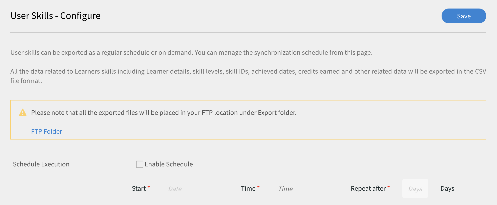
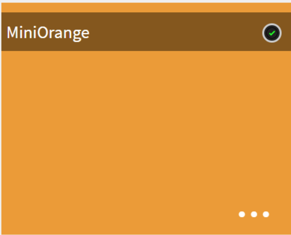
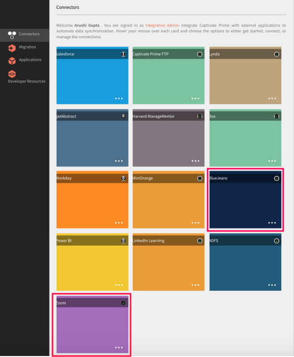
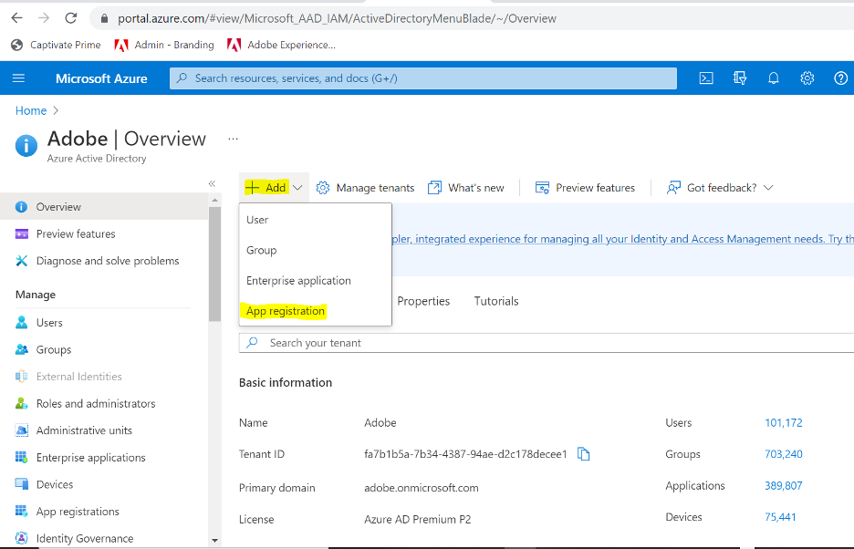
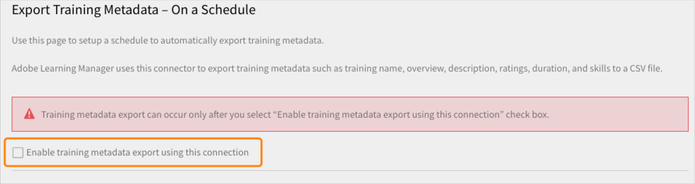
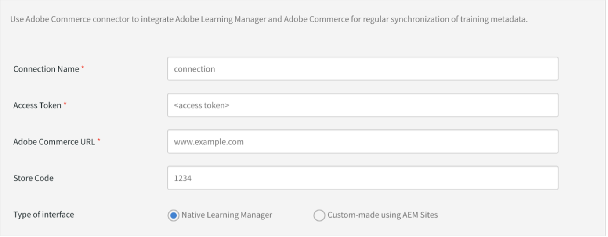

# Connectoren van Learning Manager

Ondernemingen hebben andere toepassingen en systemen die moeten worden geïntegreerd met Learning Manager. Connectoren zijn hulpprogramma&#39;s die helpen bij het uitvoeren van op data gebaseerde integraties, zoals het importeren van gegevens in Learning Manager van externe systemen.  Het voert ook het exporteren van gegevens naar externe systemen uit vanuit Learning Manager.

Learning Manager biedt Salesforce- en FTP-connectoren. Met behulp van de Salesforce-connector kunnen integratiebeheerders van een organisatie hun Salesforce-toepassing integreren met Learning Manager. Als integrator kunt u ook de FTP-connector gebruiken om automatisch een set gebruikers te importeren in uw bedrijfstoepassing.

Learning Manager biedt ook de Lynda-, getAbstract- en de Harvard Management System-connectoren. Met deze connectoren kunnen studenten cursussen openen en volgen vanaf Lynda.com, getAbstract en Harvard ManageMentor.

Lees verder om te weten te komen hoe u elk van deze connectoren in Learning Manager configureert en gebruikt.

<!--
>[!NOTE]
>
>**Update:** December 2020 update of Learning Manager
>
>For **FTP**, **Box**, and **Custom FTP** connectors, while exporting Learner Transcript or xAPI, you can also export the data as a **zip** file, for:
>
>* Learner Transcripts
>* xAPI
-->

>[!NOTE]
>
>Met de november 2022-versie van Adobe Learning Manager is Zoom afgekeurd [JWT-verificatie in juni 2023](https://marketplace.zoom.us/docs/guides/auth/jwt/). Daarom blijft de Zoom-connector met JWT werken tot de vermelde datum, maar we raden gebruikers aan een Server-to-Server OAuth-app te maken om de functionaliteit in hun account te vervangen. Voor elke nieuwe verbinding wordt standaard Zoom OAuth-verificatie gebruikt.

## Salesforce-connector {#sfconnector}

De Salesforce-connector verbindt Learning Manager- en Salesforce-accounts om de synchronisatie van gegevens te automatiseren. De mogelijkheden van de Salesforce-connector zijn als volgt:

### Kenmerken toewijzen

De integratiebeheerder kan Salesforce-kolommen kiezen en deze toewijzen aan de groepeerbare kenmerken van de overeenkomstige Learning Manager. Zodra de toewijzing is voltooid, wordt dezelfde toewijzing gebruikt in volgende gebruikersimporten. Het kan opnieuw worden geconfigureerd als de beheerder een andere toewijzing voor het importeren van gebruikers wil hebben.

### Geautomatiseerde gebruikersimport

Via het proces voor gebruikersimport kan de beheerder van de leermanager werknemersgegevens ophalen uit Salesforce en deze automatisch importeren in Learning Manager. Deze automatisering voorkomt de handmatige inspanning die nodig is om CSV te maken en te uploaden naar Learning Manager.

### Automatisch plannen

Het kan effectief zijn om de functie voor automatische planning samen met de functie voor geautomatiseerde gebruikersimport te gebruiken. De beheerder van de leermanager kan een planning instellen op basis van de behoeften van de organisatie. Gebruikers in de toepassing Leermanager kunnen volgens het schema up-to-date zijn. Synchronisatie kan dagelijks worden uitgevoerd in de toepassing Learning Manager.

### Gebruikers filteren

De beheerder van de leermanager kan filteren op de gebruikers toepassen voordat deze worden geïmporteerd. Zo kan de beheerder van de leermanager ervoor kiezen om alle gebruikers in de hiërarchie onder een of meer specifieke managers te importeren.

### Salesforce-connector configureren {#configuresalesforceconnector}

Als u Salesforce wilt integreren met Learning Manager, moet u het proces leren

#### Voorwaarden {#prerequisites}

Zorg ervoor dat u de URL van uw Salesforce-organisatie bij u hebt. Als uw organisatie bijvoorbeeld de naam **myorg** kan de Salesforce-URL `https://myorg.salesforce.com`. Dit is de enige invoer die nodig is om een Salesforce-account te verbinden met Learning Manager.

Zorg er ook voor dat u de juiste aanmeldingsgegevens voor het account hebt.

#### Een verbinding maken {#createaconnection}

1. Beweeg de muis over de Salesforce-kaart/-miniatuur op de startpagina van Learning Manager. Er verschijnt een menu. Klikken **[!UICONTROL Verbinden]** in het menu.

   

   *De optie Verbinden*

1. Er verschijnt een dialoogvenster waarin u wordt gevraagd de org-url in te voeren. Klikken **[!UICONTROL Verbinden]** nadat u de URL hebt opgegeven.
1. Als de verbinding is gelukt, verschijnt de overzichtspagina.

### Kenmerken toewijzen {#mapattributes}

Zodra de verbinding tot stand is gebracht, kunt u Salesforce-kolommen toewijzen aan de corresponderende kenmerken van Learning Manager. Deze stap is verplicht.

1. Op de toewijzingspagina ziet u links de kolommen van de Leermanager en rechts de kolommen van Salesforce. Selecteer de juiste kolomnaam die is toegewezen aan de kolomnaam van de leermanager.

   
   *Kenmerken toewijzen*

   >[!NOTE]
   >
   >De kolomgegevens van de leermanager die aan de linkerkant worden weergegeven, worden opgehaald uit de actieve velden. De **manager** veld moet worden toegewezen aan een veld van het type e-mailadres. U moet alle kolommen toewijzen voordat u de connector kunt gebruiken.

1. Klikken **[!UICONTROL Opslaan]** na het voltooien van de toewijzing.
1. De connector is nu klaar voor gebruik. Het account dat is geconfigureerd en als gegevensbron wordt weergegeven in de beheerdersapp. De beheerder kan de import of synchronisatie op verzoek plannen.

## De Salesforce-connector gebruiken {#usingsalesforceconnector}

De Salesforce-connector maakt verbinding met Salesforce.com om de geconfigureerde gebruikers op te halen en toe te voegen aan Learning Manager.

### Gebruikers importeren uit Salesforce-contactpersonen {#import-salesforce-contacts}

Learning Manager verbetert de Salesforce-connector om zowel contactpersonen als Salesforce-gebruikers op te halen en deze automatisch te importeren in Learning Manager.

Voer op de Salesforce-connector-pagina de Salesforce-URL in en voltooi de verificatie. Nadat u zich hebt geverifieerd, kunt u doorgaan met het importeren van gebruikers of contactpersonen. Als u de optie Contactpersonen kiest, geeft u de subset op van de contactpersonen die u wilt importeren.

Kies de Salesforce-kolommen en wijs deze toe aan de overeenkomstige groepeerbare kenmerken van de Learning Manager. Zodra de toewijzing is voltooid, wordt dezelfde toewijzing gebruikt in volgende gebruikersimporten.

1. Aanmelden bij Salesforce.
1. Klik op de verbindingspagina op **[!UICONTROL Interne gebruikers importeren]**.

   
   *Interne gebruikers importeren*

1. Op de **Gebruikers importeren** , is er een nieuwe optie, Contactpersonen. Klik op het keuzerondje **Contactpersonen** en ziet u de volgende opties.

   
   *De contactkenmerken toewijzen*

1. Als u op **[!UICONTROL Ja]** kunt u het volgende doen:

   * **Kies de kolom Contactpersonen:** Selecteer het veld dat u naar Leermanager wilt importeren.
   * **Geef waarden op:** Kies de waarden die het geselecteerde veld vertegenwoordigen.

   
   *Geef de waarden op*

   * Wijs de Salesforce-kolommen toe aan die van Learning Manager.
   * Klik op **[!UICONTROL Opslaan]**.

1. Als u op **[!UICONTROL Nee. Alle contactpersonen importeren]** kunt u de velden rechtstreeks toewijzen zonder de contactpersonen te filteren. Hier importeert u alle contactpersonen uit Salesforce.
1. Klik op **[!UICONTROL Opslaan]**.

## Leerrecords exporteren

Learning Manager biedt de mogelijkheid om leerrecords zoals transcripten, gebruikersrapporten en vaardigheidsrapporten te exporteren naar Salesforce. U kunt bepalen of de geëxporteerde gegevens moeten worden gekoppeld aan de tabel &#39;Gebruiker&#39; of de tabel &#39;Contactpersonen&#39; in Salesforce.

*Leerrecords exporteren*

### Aangepaste objecten in Salesforce

Voordat u leerrecords uit Leerbeheer exporteert, moet u aangepaste objecten in Salesforce maken. Aangepaste objecten zijn objecten die u maakt om informatie op te slaan die specifiek is voor uw bedrijf of sector. Zie voor meer informatie [Salesforce, aangepaste objecten](https://trailhead.salesforce.com/en/content/learn/modules/data_modeling/objects_intro).

Zo maak je de objecten:

1. Download en installeer de pakketten om de aangepaste objecten te maken.

   * [Pakket 1](https://test.salesforce.com/packaging/installPackage.apexp?p0=04t1k0000008WPJ)
   * [Pakket 2](https://test.salesforce.com/packaging/installPackage.apexp?p0=04t1k0000008WPT)
   * [Pakket 3](https://test.salesforce.com/packaging/installPackage.apexp?p0=04t1k0000008WPi)

1. Wijzig de namen van de aangepaste objecten in Salesforce.
1. Selecteer de gebeurtenissen en klik op **[!UICONTROL Opslaan]**.

**Gebeurtenissen koppelen met:** Kies welke sectie u wilt exporteren - Gebruiker of Contactpersoon. Als u Contactobject kiest, worden gebruikers die wel in Leerbeheer aanwezig zijn maar niet in Salesforce, in Salesforce gemaakt.

*Gebeurtenissen koppelen, optie*

>[!NOTE]
>
>U kunt meerdere verbindingen maken in één account. Een enkele verbinding kan tot drie aangepaste objecten aanleveren in Salesforce. Als u meerdere verbindingen voor hetzelfde Salesforce-account wilt maken, moet u de drie pakketten installeren. We bieden ondersteuning voor maximaal drie pakketten.
>
>Hoeveel verbindingen u wilt maken, u moet zoveel pakketten installeren als u wilt.

>[!NOTE]
>
>Op de pagina Uitvoeringsstatus voor Salesforce kan het aantal verwerkte records alleen worden gecontroleerd vanuit Salesforce. In Learning Manager wordt de status weergegeven als voltooid, zelfs als alle records die zijn verwerkt gedeeltelijk zijn geëxporteerd of niet zijn voltooid.

## Salesforce-pakket installeren

Learning Manager biedt een Salesforce App-pakket. Als de software eenmaal is geïnstalleerd en geconfigureerd in SFDC, kunnen verkoopmedewerkers hun trainingsactiviteiten uitvoeren in de SFDC-portal. Met deze app kunnen SFDC-gebruikers nieuwe trainingen verkennen, aanbevelingen bekijken en volgen, rechtstreeks in de SFDC-portal. Gebruikers ontvangen de aankondigingen die door beheerders worden verzonden in de vorm van mastheads rechtstreeks binnen de app in de SFDC-portal.

### Instellen in de app Learning Manager

1. Meld u als integratiebeheerder aan bij uw Leermanager-account.
1. Klikken **[!UICONTROL Toepassingen]** > **[!UICONTROL Aanbevolen apps]**.
1. Klikken **[!UICONTROL Salesforce]**.
1. Let op de toepassingspagina van Salesforce op de toepassings-id (ook wel client-id genoemd) en het clientgeheim dat in de beschrijving wordt vermeld.
1. Klikken **[!UICONTROL Goedkeuren]** en uw app moet zijn goedgekeurd.
1. Klikken **[!UICONTROL Bronnen voor ontwikkelaars]** > **[!UICONTROL Toegangstokens voor testen en ontwikkelen]**.
1. In de sectie OAuth Code ophalen moeten de client-id en het bereik worden ingesteld op - admin:read,admin:write. Klikken **[!UICONTROL Verzenden]**.
1. Voer bij Token Vernieuwen ophalen de client-id en het clientgeheim in. Klikken **[!UICONTROL Verzenden]** en noteer het vernieuwingstoken.

### Account maken in Salesforce-app

1. Maak een account op de aanmeldingspagina van Salesforce. U moet een Salesforce-account maken in de editie voor ontwikkelaars of ondernemingen.  [URL voor ontwikkelaarsaanmelding](https://developer.salesforce.com/signup). Zorg ervoor dat u de e-mail-ID gebruikt om u aan te melden voor Salesforce die u voor Leerbeheer hebt gebruikt.
1. Verifieer uw account via de verificatie-e-mail.
1. Maak een wachtwoord en meld u aan bij Salesforce.
1. Noteer de Salesforce-URL na aanmelding (bijvoorbeeld site.lightning.force.com)

### Leerbeheerpakket installeren

Als u het pakket wilt installeren, moet u eerst het bestaande pakket in Salesforce verwijderen. Voordat u de installatie ongedaan maakt, moet u de instellingen inschakelen, zoals hieronder wordt weergegeven. U moet deze instellingen toepassen, anders kunt u het pakket niet installeren.

>[!NOTE]
>
>De app Adobe Learning Manager wordt alleen ondersteund in de Salesforce Lightning-weergave.

1. Start de [Learning Manager-pakket-URL](https://login.salesforce.com/packaging/installPackage.apexp?p0=04t1k0000008WOQ).
1. In het dialoogvenster **Aanmelden** pagina, klikken **[!UICONTROL Aangepast domein gebruiken]**.
1. Voer de URL van het pakket in en klik op **[!UICONTROL Doorgaan]**. Op de installatiepagina moet de optie Installeren voor alleen beheerders zijn geselecteerd. Wijzig deze optie niet.
1. Klikken **[!UICONTROL Installeren]**. Nadat het pakket is geïnstalleerd, klikt u op **[!UICONTROL Gereed]**. U wordt begeleid naar de pagina Geïnstalleerde pakketten en u kunt het geïnstalleerde pakket van Adobe Learning Manager zien.
1. Ga naar de App Launcher (naast Setup) en zoek naar Adobe Learning Manager.
1. Klik op **[!UICONTROL Configureren]**.
1. Klikken **[!UICONTROL Nieuw]** en voeg de volgende details toe:

   * **Configuratie:** Voer een naam van uw keuze in.
   * **ClientID**: Voer de waarde in die u in de eerste sectie hebt gekregen.
   * **ClientSecret:** Voer de waarde in die u in de eerste sectie hebt gekregen.
   * **Vernieuwingstoken:** Voer de waarde in die u in de eerste sectie hebt gekregen.
   * **LearningManagerBaseURL:** De URL van de site waarop Leerbeheer wordt gehost.

### Externe site-instellingen toevoegen

1. Klik rechtsboven op de pagina op **[!UICONTROL Instellen]**.
1. In **[!UICONTROL Snel zoeken]**, zoek naar instellingen voor externe site.
1. Klikken **[!UICONTROL Nieuwe externe site]**.
1. Voer de details in:

   * **Naam externe site:** Voer een naam van uw keuze in.
   * **URL externe site:** De URL van de site waarop Leerbeheer wordt gehost.

1. Leerbeheer starten.

### Meldingen inschakelen voor de app Leermanager

1. Klik rechtsboven op **[!UICONTROL Instellen]**.
1. Zoek naar aangepaste meldingen.
1. Klikken **[!UICONTROL Nieuw]**.
1. Voer de volgende gegevens in:

   1. **Naam aangepaste melding:** LearningManagerNotification
   1. **API-naam:** LearningManagerNotification

1. Beide selecteren **Desktop** en **Mobiel** als ondersteunde kanalen.

1. Klikken **[!UICONTROL Opslaan]**.
1. Volg de onderstaande stappen om pushmeldingen in te schakelen voor mobiele apparaten:

   1. Installeer de mobiele Salesforce-app in uw mobiele telefoon.
   1. Meld u met uw referenties aan bij de app.
   1. Ga naar **Instellen** > **Leveringsinstellingen voor meldingen**.
   1. Voeg Salesforce toe voor iOS en Android.

### Leermanager verwijderen uit Salesforce

1. Ga in de Salesforce-app naar Geïnstalleerde pakketten.
1. Klikken **[!UICONTROL Verwijderen]**.

## Leerbeheer voor Salesforce-gebruikers configureren

De app Leermanager is ook beschikbaar voor gebruikers die aanwezig zijn in een Salesforce-account. De Salesforce-beheerder kan gebruikers toevoegen op basis van de profielen. De Salesforce-profielen zijn vergelijkbaar met de profielen in Leerbeheer. Bijvoorbeeld Beheerder, Integratiebeheerder, Docent, enzovoort. De Salesforce-beheerder kan ook een aangepast profiel maken.

Als Salesforce-beheerder kunt u de profielen toewijzen aan gebruikers of een aangepast profiel maken.

Wanneer u het pakket installeert, kunt u het Salesforce-profiel aan de studenten toewijzen.

Nadat u het pakket hebt geïnstalleerd, moet u het profiel configureren.

Klikken **[!UICONTROL Configureren]** > **[!UICONTROL Nieuw]** en voeg vervolgens het volgende toe:

* Configuratienaam
* ClientID
* ClientSecret
* LearningManagerBaseURL
* Omleiden uitschakelen

>[!NOTE]
>
>Studenten kunnen de app Leermanager alleen weergeven als u de app voor alle studenten inschakelt.

De volgende stap bestaat uit het verlenen van toestemming voor toegang tot de app Leermanager.

*Machtigingen instellen voor toegang tot de app Leermanager*

Selecteer de gebruikers en wijs de toestemmingen dienovereenkomstig toe. De studenten hebben nu toegang tot de app Leermanager.

Selecteer nu een profiel, bijvoorbeeld Standaardprofiel van een gebruiker, en klik op het profiel. Klikken **[!UICONTROL Bewerken]** en in de **Aangepaste app-instellingen** schakelt u het selectievakje **Adobe Learning Manager**. Hierdoor is de app toegankelijk voor de gebruiker.

In het dialoogvenster **Aangepaste tabinstellingen** in de **Startpagina student** vervolgkeuzelijst, selecteer de optie **Standaard ingeschakeld**.

U moet de app zichtbaar maken voor alle profielen.

Klikken **[!UICONTROL Opslaan]** en de studenten die tot alle profielen behoren, krijgen toegang tot de app Leermanager.

### Met het leerpad samenhangende wijzigingen

#### Bestaande verbindingen

Als de optie Leerpad is uitgeschakeld in het beheerdersaccount, worden er geen rijen en kolommen toegevoegd aan het rapport.

Als de optie Leerpad is ingeschakeld in het beheerdersaccount, wordt de kolom &quot;Type&quot; gevuld met Leerpad voor het geval studenten zich ervoor inschrijven.

>[!NOTE]
>
>Als de vlag wordt toegelaten en u een bestaande verbinding gebruikt, kunnen een paar verslagen worden gemist.

#### Nieuwe verbindingen

Als de optie Leerpad is uitgeschakeld in het beheerdersaccount, bestaat het trainingsrapport uit de volgende kolommen, maar bevat het geen gegevens.

* **Ingesloten pad:** Geeft de naam van het leerprogramma weer
* **Ingesloten pad-id:** Geeft de id&#39;s voor het leerprogramma weer.
* **Ingesloten cursus-id:** Geeft de id&#39;s weer van cursussen die zich in een leerpad bevinden.

Voor nieuwe verbindingen in accounts waarvoor leerpad is ingeschakeld, worden de drie nieuwe kolommen weergegeven en stromen alle gegevens.

Bovendien bevat het rapport het kolomtype Leerpad (hoger niveau) voor alle studenten die zijn ingeschreven voor een leerpad.

In de kolom Type wordt de naam van het leerprogramma gewijzigd in Leerpad. Voor bestaande verbindingen is er geen wijziging.

## Learning Manager FTP-connector {#ftpconnector}

Met behulp van de FTP-connector kunt u Learning Manager integreren met willekeurige externe systemen om de synchronisatie van gegevens te automatiseren. Naar verwachting kunnen externe systemen gegevens exporteren in een CSV-indeling en deze in de juiste map van het FTP-account van Learning Manager plaatsen. De mogelijkheden voor FTP-connector zijn als volgt:

U kunt ook de Box-connector gebruiken voor gegevensmigratie, gebruikersimport en gegevensexport. Zie Box connector voor meer informatie.

### Gegevens importeren {#dataimport}

Via het proces voor gebruikersimport kan de beheerder van de leermanager werknemersgegevens ophalen van de FTP-service van de Learning Manager en deze automatisch importeren in Learning Manager. Met deze functie kunt u meerdere systemen integreren door de door die systemen gegenereerde CSV in de juiste mappen van de FTP-accounts te plaatsen. De leermanager pakt de CSV-bestanden op, voegt deze samen en importeert de gegevens volgens de planning. Raadpleeg de planningsfunctie voor meer informatie.

**Kenmerken toewijzen**

De integratiebeheerder kan de kolommen van CSV kiezen en toewijzen aan de groepeerbare kenmerken van de Learning Manager. Deze toewijzing is een eenmalige inspanning. Wanneer de toewijzing is voltooid, wordt dezelfde toewijzing gebruikt in volgende gebruikersimporten. De toewijzing kan opnieuw worden geconfigureerd als de beheerder een andere toewijzing voor het importeren van gebruikers wil hebben.

#### Gegevens exporteren {#exportdata}

Met de gegevensexport kunnen gebruikers gebruikersvaardigheden en studenttranscripten exporteren naar een FTP-locatie om deze te integreren met een willekeurig extern systeem.

#### Planning {#scheduling}

De beheerder kan planningstaken volgens de vereisten van de organisatie instellen en gebruikers in de toepassing Leermanager zijn up-to-date volgens de planning. Op dezelfde manier kan de integratiebeheerder de export van vaardigheden tijdig plannen om deze te integreren met een extern systeem. Synchronisatie kan dagelijks worden uitgevoerd in de toepassing Learning Manager.

### FTP-connector van Learning Manager configureren {#configurecaptivateprimeftpconnector}

Leer het proces om de FTP-connector te integreren met Learning Manager.

#### Een verbinding maken {#Createaconnection-1}

1. Beweeg de muis over de FTP-kaart/miniatuur op de startpagina van Learning Manager. Er verschijnt een menu. Klikken **[!UICONTROL Verbinden]** in het menu.

   

   *De optie Verbinden*

1. Er verschijnt een dialoogvenster waarin u wordt gevraagd de e-mail-ID in te voeren. Geef de e-mail-ID op van de persoon die verantwoordelijk is voor het beheer van het FTP-account van de Learning Manager voor de organisatie. Klikken **[!UICONTROL Verbinden]** nadat u de e-mail-ID hebt opgegeven.
1. Leermanager stuurt u een e-mail waarin de gebruiker wordt gevraagd het wachtwoord opnieuw in te stellen voordat hij/zij voor het eerst toegang krijgt tot de FTP. De gebruiker moet het wachtwoord opnieuw instellen en het gebruiken om toegang te krijgen tot het FTP-account van de Learning Manager.

   >[!NOTE]
   >
   >Er kan slechts één FTP-account voor LMS worden gemaakt voor een bepaald LMS-account.

   Op de overzichtspagina kunt u de verbindingsnaam voor uw integratie opgeven. Kies uit de volgende opties welke actie u wilt uitvoeren:

   * Interne gebruikers importeren
   * xAPI importeren
   * Gebruikersvaardigheden exporteren - Een planning configureren
   * Gebruikersvaardigheden exporteren - Op verzoek
   * Studenttranscripten exporteren - Een planning configureren
   * Studenttranscripten exporteren - op verzoek

   
   *Exportopties*

### Importeren

+++ interne gebruiker

Met de optie voor het importeren van interne gebruikers kunt u de gebruikers van een CSV importeren in een Leermanager op verzoek of tijdens het plannen.

+++

+++Kenmerken toewijzen

Als de verbinding tot stand is gebracht, kunt u de kolommen van de CSV-bestanden toewijzen. Deze wordt in de FTP-map geplaatst naar de corresponderende kenmerken van Learning Manager. Deze stap is verplicht.

1. Op de pagina Kenmerken toewijzen ziet u links de verwachte kolommen van de leermanager en rechts de CSV-kolomnamen. In eerste instantie ziet u aan de rechterkant een leeg selectiekader. Een CSV-sjabloon importeren door te klikken **Bestand kiezen**.
1. In de bovenstaande stap worden alle CSV-kolomnamen aan de rechterkant van de vervolgkeuzelijst voor selectie toegevoegd. Selecteer de juiste kolomnaam die is toegewezen aan de kolomnaam van de leermanager.

   >[!NOTE]
   >
   >Het veld Manager moet worden toegewezen aan een veld van het type e-mailadres. U moet alle kolommen toewijzen voordat u de connector kunt gebruiken.

1. Klikken **[!UICONTROL Opslaan]** na het voltooien van de toewijzing.

   De connector is nu klaar voor gebruik. Het geconfigureerde account wordt als gegevensbron weergegeven in de beheerdersapp zodat de beheerder de import of synchronisatie op verzoek kan plannen.

+++

+++De FTP-connector van Learning Manager gebruiken

1. De CSV-bestanden van externe systemen moeten op het volgende pad worden geplaatst:

   `code $OPERATION$/$OBJECT_TYPE$/$SUB_OBJECT_TYPE$/data.csv`

   >[!NOTE]
   >
   >In de release van juli 2016 is alleen import van gebruikers toegestaan. Om de FTP-connector te gebruiken, moet u ervoor zorgen dat de CSV-bestanden in de volgende map worden geplaatst:

   `code Home/import/user/internal/*.csv`

1. De FTP-connector haalt alle rijen uit CSV-bestanden. Het is belangrijk dat de rij die overeenkomt met een gebruiker in een CSV niet wordt weergegeven in andere CSV&#39;s.
1. Alle CSV&#39;s moeten de kolommen bevatten die in de toewijzing zijn opgegeven.
1. Alle vereiste CSV&#39;s moeten aanwezig zijn in de map voordat het proces begint.

>[!NOTE]
>
>Tijdens het importeren van gebruikers naar Leermanager moet de beheerder ook weten hoe gebruikers worden beheerd in Leerbeheer. Raadpleeg [Help bij gebruikersbeheer](migration-manual.md#usermanagement) voor meer informatie.

+++

+++xAPI importeren

Met de xAPI-importopties kunt u de import van xAPI-statements van externe services naar Learning Manager plannen wanneer dat nodig is.

+++

+++Vereiste configuraties voor het importeren van xAPI

1. Selecteer op de configuratiepagina een bestaande configuratie die beschikbaar is in de configuratielijst om xAPI-statements uit de CSV te importeren. Klik op Bewerken of **voeg een nieuwe configuratie toe** link to navigate to the configure Import-Sources page.

   **Configuratie**

   * Vul de twee velden Naam en Naam van bronbestand in op de pagina Configureren. De naam van het bronbestand moet overeenkomen met de bestandsnaam die is opgegeven in de locatie van de FTP-map.
   * Klikken **[!UICONTROL Opslaan]** om uw wijzigingen op te slaan.

   
   *Configureren*

   **Filter**

   * Klik in het linkerdeelvenster op **[!UICONTROL Filter]**.
   * Vul op de pagina configureren-importeren-filteren de velden Naam en Voorwaarden in om de records uit te filteren. Klikken **[!UICONTROL Nieuw filter toevoegen]** om een ander filter toe te voegen. U kunt een filter opslaan of verwijderen door op **Opslaan** of **Verwijderen** onder de kolom Acties.

   
   *Filter*

   **Toewijzing**

   * Klik in het linkerdeelvenster op **[!UICONTROL Toewijzing]**.
   * Op de pagina xAPI-statements importeren-Configuratie-Toewijzing ziet u aan de linkerkant de xAPI JSON-padveldnamen die moeten worden toegewezen aan de CSV-kolomnamen.
   * Standaard zijn de drie JSON-padveldnamen die aan de CSV-kolomnamen moeten worden toegewezen **actor.mbox**, **verb.id**, en **object.id**. U kunt andere toe te wijzen velden toevoegen door op **Nieuwe toewijzing toevoegen**.

   * Selecteer het type kolomnaam dat u aan de padnaam van het JSON-veld toewijst (of het nu een tekenreeks, getal, Boolean of datumtype is).
   * Klik op Opslaan nadat u de toewijzing hebt voltooid. De xAPI-import kan nu volgens schema of op verzoek worden geïmporteerd.

   
   *Toewijzing*

1. Klik in het linkerdeelvenster op **[!UICONTROL Planning configureren]**. Klikken **[!UICONTROL Planning inschakelen]** om het importeren van xAPI-statements te plannen.

   U kunt de begintijd en -datum invoeren en vervolgens de frequentie van uw xAPI-importschema in dagen invoeren. Bijvoorbeeld, xAPI-import inschakelen voor elke 3 dagen.

   
   *xAPI-statements importeren - Planning configureren*

1. Klik in het linkerdeelvenster op **[!UICONTROL Uitvoering op verzoek]**.

   
   *xAPI-statements importeren - Op verzoek*

1. Klik in het linkerdeelvenster op **[!UICONTROL Uitvoeringsstatus]** om de samenvatting van alle looppas voor deze schakelaar, in een chronologische orde te bekijken. U kunt de begindatum en de duur van de importtijd van xAPI, het type import (op aanvraag of volgens planning) en de status van de import (of de xAPI-import in voortgang is, voltooid of mislukt is) bekijken.

   
   *xAPI-statements importeren - Uitvoeringsstatus*

+++

### Exporteren

+++Vaardigheden

Er zijn twee opties om vaardigheidsrapporten van de gebruiker te exporteren.

**[!UICONTROL Gebruikersvaardigheden - op verzoek]**: U kunt de startdatum opgeven en het rapport exporteren met de optie. Het rapport wordt geëxtraheerd vanaf de ingevoerde datum tot heden.

*Exportoptie op verzoek*

**[!UICONTROL Gebruikersvaardigheden - configureren]**: Met deze optie kunt u de extractie van het rapport plannen. Schakel het selectievakje Planning inschakelen in en geef de begindatum en -tijd op. U kunt ook opgeven met welk interval het rapport moet worden gegenereerd en verzonden.

*Exporteren van rapport configureren*

+++

Als u de exportmap wilt openen waarin de geëxporteerde bestanden zijn geplaatst, opent u de koppeling naar de FTP-map op de pagina Gebruikersvaardigheden, zoals hieronder weergegeven.

*FTP-map om bestanden weer te geven*

De automatisch geëxporteerde bestanden zijn aanwezig op de locatie **Home/export/&#42;FTP_locatie&#42;**

De automatisch geëxporteerde bestanden zijn beschikbaar met de titel, **skill_results__&#42;datum vanaf &#42;_aan_&#42;datum tot&#42;.csv**

*Geëxporteerd CSV-bestand*

+++Studenttranscript

**Configureren**: Met deze optie kunt u de extractie van het rapport plannen. Schakel het selectievakje Planning inschakelen in en geef de begindatum en -tijd op. U kunt ook opgeven met welk interval het rapport moet worden gegenereerd en verzonden.

+++

Als u de exportmap wilt openen waarin de geëxporteerde bestanden op uw FTP-locatie worden geplaatst, opent u de koppeling naar de FTP-map op de pagina Studenttranscript, zoals hieronder weergegeven

De automatisch geëxporteerde bestanden zijn aanwezig op de locatie **Home/export/&#42;FTP_locatie&#42;**

De automatisch geëxporteerde bestanden zijn beschikbaar met de titel, **learner_transcript_&#42;datum vanaf &#42;_aan_&#42;datum tot&#42;.csv**

### Ondersteuning voor handmatige CSV-velden {#supportformanualcsvfields}

Tijdens het importeren van gebruikersgegevens via FTP moet een beheerder alle actieve velden in het systeem toewijzen aan het corresponderende veld in de CSV.

Dit is verplicht voor alle csv-actieve velden. Voor handmatige actieve velden kan de integratiebeheerder de optie **DontImportFromSource**.

Als u deze optie selecteert, worden de handmatige actieve veldwaarden niet ingevuld met CSV-import. De door de student opgegeven waarden blijven intact.

>[!NOTE]
>
>Tijdens het toewijzen, als de optie **DontImportFromSource** is geselecteerd voor het actieve CSV-veld, wordt dit veld uit het systeem verwijderd.

*FTP-connector voor actieve velden*

## Lynda-connector {#lyndaconnector}

De Lynda-connector wordt gebruikt door zakelijke klanten van Lynda.com die graag willen dat hun studenten Lynda-cursussen kunnen zoeken en volgen vanuit Learning Manager. De connector kan worden geconfigureerd om periodiek cursussen op te halen van Lynda.com met uw API-sleutel. Zodra een cursus in Leermanager is gemaakt, kunnen gebruikers deze opzoeken en volgen. De voortgang van de student kan vervolgens worden bijgehouden in Leermanager.

### De Lynda-connector configureren {#configurethelyndaconnector}

1. Klik op Lynda in het dashboard van de integratiebeheerder.

   U ziet de tegel met drie opties: Aan de slag, Verbinden en Verbindingen beheren.

1. Klik op Verbinden als u de Lynda-connector voor het eerst configureert.

   <!--Configure the Exavault FTP account before you configure this connector.-->

1. Geef een naam op voor uw connector vanaf de verbindingspagina. Voer de appsleutel en de geheime sleutel voor uw verbinding in.

   >[!NOTE]
   >
   >Neem contact op met uw leverancier voor de appsleutel en de geheime sleutel.

1. Klik op Opslaan.

   De configuratie wordt opgeslagen en de Lynda-verbinding voor uw account wordt toegevoegd. U kunt nu vanaf de startpagina op Verbindingen beheren klikken en uw configuratie op elk gewenst moment bewerken.

1. Als u al een verbinding tot stand hebt gebracht, klikt u op Verbindingen beheren om al uw verbindingen weer te geven.

   >[!NOTE]
   >
   >De migratiefunctie moet zijn ingeschakeld voor uw account voordat u deze connector kunt configureren.

1. Klik op de verbinding die u wilt bewerken.
1. Klik in het linkerdeelvenster op **[!UICONTROL Configureren]**. Voer een van de volgende handelingen uit:

   * Bekijk of bewerk de details van uw account en het synchronisatieschema vanuit dit venster. Schakel het selectievakje Verbinding inschakelen in als u dit account wilt inschakelen.
   * Klik op Bewerken en bewerk uw referenties. Klik op Opnieuw instellen om uw updates voor dit veld ongedaan te maken
   * Klik op Planning inschakelen om uw synchronisatie te plannen. U kunt de begintijd en -datum invoeren en vervolgens de frequentie van uw synchronisatieplanning in dagen invoeren. Bijvoorbeeld, synchronisatie elke drie dagen inschakelen.

   Klikken **[!UICONTROL Opslaan]** om uw wijzigingen op te slaan.

   

   *Lynda-connector voor Learning Manager configureren*

1. Klik in het linkerdeelvenster op Uitvoering op verzoek. Met deze optie kunt u gebruikersfeeds en andere relevante gegevens importeren uit Lynda. Voer de startdatum in voor de uitvoering op verzoek en klik op Uitvoeren om de synchronisatie uit te voeren. Alle gegevens vanaf de begindatum tot heden worden geïmporteerd.

   * U kunt tijdens de uitvoering op Toegang tot Leermanager uitschakelen klikken wanneer de toepassing tijdens de synchronisatie een downtime heeft.
   * Als u tijdens de uitvoering op Toegang tot Leermanager inschakelen klikt, is er geen onderbreking van de service tijdens de synchronisatie.

   

   *Voer uitvoering op verzoek uit voor Lynda-connector*

1. U kunt ook op elk moment op Uitvoeringsstatus in het linkerdeelvenster klikken om het overzicht van alle runs voor deze connector in chronologische volgorde weer te geven. U kunt de begindatum en de duur van de synchronisatie, het type synchronisatie (of het nu gaat om synchronisatie op verzoek) en de status van de synchronisatie (of de synchronisatie wordt uitgevoerd of is voltooid) bekijken.

   >[!NOTE]
   >
   >Wanneer u een verbinding verwijdert en opnieuw maakt, worden de vorige runs voor de connector opnieuw weergegeven. U kunt alle runs bekijken voordat u de verbinding hebt verwijderd.

   U kunt een herhaling alleen uitvoeren voor de laatste synchronisatie.

   

   *Bekijk het overzicht van alle runs en klik Uitvoeringsstatus*

## getAbstract-connector {#getabstractconnector}

De getAbstract-connector wordt gebruikt door zakelijke klanten van getAbstract.com, die graag willen dat hun studenten getAbstract-samenvattingen kunnen zoeken en volgen. De connector kan worden geconfigureerd om periodiek gebruiksgegevens op te halen, op basis waarvan voltooiingsrecords van studenten worden gemaakt in Learning Manager. Lees verder om te weten te komen hoe u deze connector in Learning Manager kunt configureren.

### De getAbstract-connector configureren {#configurethegetabstractconnector}

1. Klik op getAbstract in het dashboard voor geïntegreerde beheer.

   In de tegel ziet u drie opties: Aan de slag, Verbinden en Verbindingen beheren.

1. Klik op Verbinden als u de getAbstract-connector voor het eerst configureert.

   <!--Configure the Exavault FTP account before you configure this connector.

   Ensure that you share this FTP credentials with your content provider to access the feeds.-->

1. Voer in het veld Verbindingsnaam een naam voor uw verbinding in.

   Voer de juiste sleutels in de velden Client-id en Clientgeheim in. Neem contact op met uw leverancier voor de juiste sleutels voor deze connector.

   De toetsen zijn vereist om de metagegevens van de cursus te verkrijgen voor de cursussen die de client gebruikt.

1. Als er al een verbinding tot stand is gebracht, klikt u op getAbstract > Verbindingen beheren om uw bestaande configuratie te bekijken en te bewerken.

   >[!NOTE]
   >
   >De migratiefunctie moet zijn ingeschakeld voor uw account voordat u deze connector kunt configureren.

1. Klik op de verbinding waarvan u de configuratie wilt bekijken of bewerken.

   

   *De getAbstract-connector voor Learning Manager configureren*

1. Klik in het linkerdeelvenster op Configureren. Voer een van de volgende handelingen uit:

   * Bekijk of bewerk de details van uw account en het synchronisatieschema vanuit dit venster. Schakel het selectievakje Verbinding inschakelen in als u dit account wilt inschakelen.
   * Klik op Bewerken en bewerk uw referenties. Klik op Opnieuw instellen om uw updates voor dit veld ongedaan te maken
   * Klik op Planning inschakelen om uw synchronisatie te plannen. U kunt de begintijd en -datum invoeren en vervolgens de frequentie van uw synchronisatieplanning in dagen invoeren. Bijvoorbeeld, synchronisatie elke drie dagen inschakelen.

1. Klikken **[!UICONTROL Opslaan]**.

   De configuratie wordt opgeslagen en de getAbstract-verbinding voor uw account wordt toegevoegd.

1. Klik in het linkerdeelvenster op Uitvoering op verzoek. Met deze optie kunt u gebruikersfeeds en andere relevante gegevens uit getAbstract importeren. Voer de startdatum in voor de uitvoering op verzoek en klik op Uitvoeren om de synchronisatie uit te voeren. Alle gegevens vanaf de begindatum tot heden worden geïmporteerd.

   * U kunt tijdens de uitvoering op Toegang tot Leermanager uitschakelen klikken wanneer de toepassing tijdens de synchronisatie een downtime heeft.
   * Als u tijdens de uitvoering op Toegang tot Leermanager inschakelen klikt, is er geen onderbreking van de service tijdens de synchronisatie.

1. U kunt ook op elk moment op Uitvoeringsstatus in het linkerdeelvenster klikken om het overzicht van alle runs voor deze connector in chronologische volgorde weer te geven. U kunt de begindatum en de duur van de synchronisatie, het type synchronisatie (of het nu gaat om synchronisatie op verzoek) en de status van de synchronisatie (of de synchronisatie wordt uitgevoerd of is voltooid) bekijken.

   >[!NOTE]
   >
   >Wanneer u een verbinding verwijdert en opnieuw maakt, worden de vorige runs voor de connector opnieuw weergegeven. U kunt alle runs bekijken voordat u de verbinding hebt verwijderd.

   U kunt een herhaling alleen uitvoeren voor de laatste synchronisatie.

   Zorg ervoor dat de gebruikersfeed aanwezig is in de getAbstract FTP-map voor de datums die in de synchronisatie zijn opgegeven, anders werkt de synchronisatie niet.

   Zie het volgende Excel-blad, een voorbeeld van een gebruikersfeed-bestand van getAbstract. De bestandsnaam moet de volgende notatie hebben: **report_export_yyyy_MM_dd_HHmmss.xlsx** of **report_export_jjjj_MM_dd.xlsx**.
   [Voorbeeld van Excel-blad voor getAbstract-gebruikersinvoer](assets/report-export-20170401175342.xlsx)

## Harvard ManageMentor-connector {#hmmconnector}

De Harvard ManageMentor-connector wordt gebruikt door zakelijke klanten van Harvard ManageMentor die graag willen dat hun studenten Harvard ManageMentor-cursussen kunnen zoeken en volgen. De connector helpt bij het maken van cursussen in Learning Manager en kan worden geconfigureerd om periodiek voortgangsgegevens van studenten op te halen. Voer de volgende procedure uit om deze connector te configureren:

### De Harvard ManagerMentor-connector configureren {#configuretheharvardmanagermentorconnector}

1. Klik in het dashboard van de geïntegreerde beheerder op Harvard ManageMentor.

   In de tegel ziet u drie opties: Aan de slag, Verbinden en Verbindingen beheren.

1. Als u de Harvard ManageMentor-connector voor het eerst configureert, klikt u op Verbinden.

   <!--Configure the Exavault FTP account before you configure this connector.

   Ensure that you share this FTP credentials with your content provider to access the feeds.-->

1. Voer in het veld Verbindingsnaam een naam in voor uw verbinding. Klik op Verbinden om deze verbinding op te slaan.
1. Als er al een verbinding tot stand is gebracht, klikt u op Harvard ManageMentor > Verbindingen beheren. Klik op de verbinding die u wilt bewerken in uw bestaande configuratie.

   >[!NOTE]
   >
   >De migratiefunctie moet zijn ingeschakeld voor uw account voordat u deze connector kunt configureren.

   

   *Configureer de HarvardManage Mentor-connector voor Learning Manager*

1. Klik in het linkerdeelvenster op Configureren. Voer een van de volgende handelingen uit:

   * Bekijk of bewerk de details van uw account en het synchronisatieschema vanuit dit venster. Schakel het selectievakje Verbinding inschakelen in als u dit account wilt inschakelen.
   * Klik op Planning inschakelen om uw synchronisatie te plannen. U kunt de begintijd en -datum invoeren en vervolgens de frequentie van uw synchronisatieplanning in dagen invoeren. Bijvoorbeeld, synchronisatie elke drie dagen inschakelen.

1. Klik in het linkerdeelvenster op Uitvoering op verzoek. Met deze optie kunt u gebruikersfeeds en andere relevante gegevens importeren uit Harvard ManageMentor. Voer de startdatum in voor de uitvoering op verzoek en klik op Uitvoeren om de synchronisatie uit te voeren. Alle gegevens vanaf de begindatum tot heden worden voor deze verbinding geïmporteerd.

   * U kunt tijdens de uitvoering op Toegang tot Leermanager uitschakelen klikken wanneer de toepassing tijdens de synchronisatie een downtime heeft.
   * Als u tijdens de uitvoering op Toegang tot Leermanager inschakelen klikt, is er geen onderbreking van de service tijdens de synchronisatie.

   Als u de synchronisatie om de paar dagen wilt automatiseren, geeft u het aantal dagen op in het veld Aantal dagen herhalen. Synchronisatie zorgt ervoor dat uw account wordt bijgewerkt met de nieuwste versie van de abstracts en samenvattingen van Harvard ManageMentor.

1. U kunt ook op elk moment op Uitvoeringsstatus in het linkerdeelvenster klikken om het overzicht van alle runs voor deze connector in chronologische volgorde weer te geven. U kunt de begindatum en de duur van de synchronisatie, het type synchronisatie (of het nu gaat om synchronisatie op verzoek) en de status van de synchronisatie (of de synchronisatie wordt uitgevoerd of is voltooid) bekijken.

   >[!NOTE]
   >
   >Wanneer u een verbinding verwijdert en opnieuw maakt, worden de vorige runs voor de connector opnieuw weergegeven. U kunt alle runs bekijken voordat u de verbinding hebt verwijderd.

   U kunt een herhaling alleen uitvoeren voor de laatste synchronisatie.

   U kunt de synchronisatie alleen succesvol laten verlopen als ten minste een van de volgende bestanden aanwezig is in de FTP-map van Harvard ManageMentor:

   hmm12_metadata.xlsx: Dit bestand bevat de cursusmetagegevens voor de Harvard ManageMentor-connector. Zorg ervoor dat u de naamgevingsconventie volgt wanneer u het bestand uploadt.

   client_hmm12_20150125.xlsx: dit is de gebruikersfeed voor de Harvard ManageMentor-connector. De volgende naamgevingsconventie voor bestanden is **client_hmm12_yyyyDD.xlsx.**

   Zie de volgende twee voorbeelden van gebruikersfeed- en cursusfeed-bestanden voor deze connector:

   * [Cursusmetagegevensbestand voor de Harvard ManageMentor-connector](assets/hmm12-metadata.xlsx)
   * [Gebruikersfeed voor de Harvard ManageMentor-connector](assets/client-hmm12-20170304.xlsx)

## Workday-connector {#workdayconnector}

Met behulp van de Workday-connector kunt u Learning Manager integreren met Workday tenant om de synchronisatie van gegevens te automatiseren.

### Importeren

#### Kenmerken toewijzen

De integratiebeheerder kan Workday-kolommen kiezen en deze toewijzen aan de groepeerbare kenmerken van de overeenkomstige Learning Manager. Zodra de toewijzing is voltooid, wordt dezelfde toewijzing gebruikt in volgende gebruikersimporten. Het kan opnieuw worden geconfigureerd als de beheerder een andere toewijzing voor het importeren van gebruikers wil hebben.

#### Geautomatiseerde gebruikersimport

Via het gebruikersimportproces kan de beheerder van de leermanager werknemersgegevens uit Workday ophalen en deze automatisch importeren in de Learning Manager.

#### Gebruikers filteren

De beheerder van de leermanager kan filteren op de gebruikers toepassen voordat deze worden geïmporteerd. Zo kan de beheerder van de leermanager ervoor kiezen om alle gebruikers in de hiërarchie onder een of meer specifieke managers te importeren.

### Exporteren

Met de Exporteren van gebruikersvaardigheden kunnen gebruikers automatisch gebruikersvaardigheden exporteren naar Workday.

>[!NOTE]
>
>Vaardigheden van meerdere Learning Manager-accounts kunnen niet gelijktijdig met hetzelfde Workday-account worden geëxporteerd.

### Planning {#Scheduling-1}

De beheerder kan planningstaken volgens de vereisten van de organisatie instellen en gebruikers in de toepassing Leermanager zijn up-to-date volgens de planning. Op dezelfde manier kan de integratiebeheerder de export van vaardigheden tijdig plannen om deze te integreren met een extern systeem. Synchronisatie kan dagelijks worden uitgevoerd in de toepassing Learning Manager.

### Workday-connector configureren {#configureworkdayconnector}

>[!PREREQUISITES]
>
>Vraag de beheerder van Workday van uw organisatie om een Gebruiker van het Systeem van de Integratie (ISU) met de toestemmingen te creëren zoals die in het document ISU_Permissions worden bepaald. Download een kopie via de onderstaande koppeling.

[Download een kopie van de beveiliging van het integratiesysteem voor gebruikers (ISU).](assets/isu-permissions-v1.pdf) Leer het proces om de Workday-connector te integreren met Learning Manager.

1. Beweeg de muis over de tegel van Workday op de startpagina van Learning Manager. Er verschijnt een menu. Klikken **[!UICONTROL Verbinden]** in het menu.

   

   *Workday tile*

1. Er verschijnt een dialoogvenster waarin u wordt gevraagd de referenties voor de nieuwe verbinding in te voeren. Voordat u de verbinding tot stand brengt, voert u de volgende velden in.

   * Verbindingsnaam: geef een verbindingsnaam op, afhankelijk van uw voorkeur.
   * Host-URL: de integratiebeheerder kan de host-URL-gegevens van de overeenkomstige Workday-beheerder opvragen.
   * Tenant: de tenant is intern in uw bedrijf. Uw Workday-beheerder geeft u de tenantgegevens.
   * Gebruikersnaam en wachtwoord: De Workday-beheerder maakt een geïntegreerde systeemgebruiker (ISU) met de vereiste beveiligingsrechten en deelt deze met de integratiebeheerder.

>[!NOTE]
>
>   Learning Manager gebruikt versie 28.1 van de Workday API.

*Workday-connector configureren*

1. Klik op Verbinden nadat u informatie in alle relevante velden hebt ingevoerd.

   >[!NOTE]
   >
   >U kunt ook meerdere Workday-verbindingen synchroniseren met uw Learning Manager-account.

Op de overzichtspagina kunt u de verbindingsnaam voor uw integratie opgeven. Kies uit de volgende opties welke actie u wilt uitvoeren:

* Interne gebruikers importeren
* Gebruikersvaardigheden exporteren - Een planning configureren
* Gebruikersvaardigheden exporteren - Op verzoek

*Overzicht van Workday*

### Importeren

#### Kenmerken toewijzen {#MapAttributes-1}

U kunt de Workday-connector gebruiken om Learning Manager en Workday te integreren om de synchronisatie van gegevens te automatiseren. U kunt alle actieve gebruikers van Workday importeren in Leermanager. Gebruikers kunnen worden geïmporteerd uit verschillende gegevensbronnen, waaronder FTP en Salesforce.

Voordat u gebruikers importeert, moeten de gebruikerskenmerken van Learning Manager en Workday worden toegewezen. Gebruik op de overzichtspagina de optie Interne gebruikers onder Importeren om de kaartkenmerken op te geven.

Voer de aanmeldgegevens van de Adobe Leermanager in onder de kolom Adobe Leermanager. Gebruik de vervolgkeuzelijsten om de juiste gegevens te selecteren voor de kolommen onder Workday.

>[!NOTE]
>
>Op dit moment ondersteunt Learning Manager het importeren van 44 gebruikerskenmerken uit Workday. Voeg meer kenmerken toe met behulp van de actieve velden in Leerbeheer.

*Kenmerken toewijzen*

Selecteer de **Uitsluiten van voorwaardelijke werknemers** Schakel het selectievakje in om te voorkomen dat de tijdelijke workers die beschikbaar zijn onder een manager worden geïmporteerd.

Workday heeft vier hiërarchische niveaus terwijl Learning Manager twee niveaus heeft. De vier niveaus in Workday zijn vaardigheidsprofielcategorie, vaardigheidsprofiel, vaardigheidsitemcategorie en vaardigheidsitem. Uw vaardigheidsnaam en niveau van Leermanager worden samen toegewezen in Workday onder het vaardigheidsitem.

>[!NOTE]
>
>U kunt extra Workday-kenmerken toevoegen. Neem contact op met uw CSAM om de kenmerken toe te voegen.

+++Lijst met ondersteunde Workday-kenmerken

wd:User_ID\
wd:Worker_ID\
wd:Personal_Data.wd:Name_Data.wd:Preferred_Name_Data.wd:Name_Detail_Data.@wd:Opgemaakte_naam\
wd:Personal_Data.wd:Name_Data.wd:Legal_Name_Data.wd:Name_Detail_Data.@wd:Opgemaakte_naam\
wd:Personal_Data.wd:Name_Data.wd:Legal_Name_Data.wd:Name_Detail_Data.wd:Prefix_Data.wd:Title_Descriptor\
wd:Personal_Data.wd:Name_Data.wd:Preferred_Name_Data.wd:Name_Detail_Data.wd:Prefix_Data.wd:Title_Descriptor\
wd:Personal_Data.wd:Name_Data.wd:Preferred_Name_Data.wd:Name_Detail_Data.wd:First_Name\
wd:Personal_Data.wd:Name_Data.wd:Preferred_Name_Data.wd:Name_Detail_Data.wd:Last_Name\
wd:Personal_Data.wd:Name_Data.wd:Legal_Name_Data.wd:Name_Detail_Data.wd:First_Name\
wd:Personal_Data.wd:Name_Data.wd:Legal_Name_Data.wd:Name_Detail_Data.wd:Last_Name\
wd:Personal_Data.wd:Contact_Data.wd:Address_Data.0.@wd:Formatted_Address\
wd:Personal_Data.wd:Contact_Data.wd:Address_Data.0.wd:Postal_Code\
wd:Personal_Data.wd:Contact_Data.wd:Address_Data.0.wd:Country_Region_Descriptor\
wd:Personal_Data.wd:Contact_Data.wd:Phone_Data.0.@wd:Opgemaakte_telefoon\
wd:Personal_Data.wd:Contact_Data.wd:Phone_Data.0.wd:Country_ISO_Code\
wd:Personal_Data.wd:Contact_Data.wd:Phone_Data.0.wd:International_Phone_Code\
wd:Personal_Data.wd:Contact_Data.wd:Phone_Data.0.wd:Phone_Number\
wd:Personal_Data.wd:Primary_Nationality_Reference.wd:ID.1.$\
wd:Personal_Data.wd:Gender_Reference.wd:ID.1.$\
wd:Personal_Data.wd:Identification_Data.wd:National_ID.0.wd:National_ID_Data.wd:ID\
wd:Personal_Data.wd:Identification_Data.wd:Custom_ID.0.wd:Custom_ID_Data.wd:ID\
wd:User_Account_Data.wd:Default_Display_Language_Reference.wd:ID.1.$\
wd:Role_Data.wd:Organization_Role_Data.wd:Organization_Role.0.wd:Organization_Role_Reference.wd:ID.1.$\
wd:Employment_Data.wd:Worker_Job_Data.0.wd:Position_Data.wd:Position_Title\
wd:Employment_Data.wd:Worker_Job_Data.0.wd:Position_Data.wd:Business_Title\
wd:Employment_Data.wd:Worker_Job_Data.0.wd:Position_Data.wd:Business_Site_Summary_Data.wd:Name\
wd:Employment_Data.wd:Worker_Job_Data.0.wd:Position_Data.wd:Business_Site_Summary_Data.wd:Address_Data.@wd:Formatted_Address\
wd:Employment_Data.wd:Worker_Job_Data.0.wd:Position_Data.wd:Job_Classification_Summary_Data.0.wd:Job_Classification_Reference.wd:ID.1.$\
wd:Employment_Data.wd:Worker_Job_Data.0.wd:Position_Data.wd:Job_Classification_Summary_Data.0.wd:Job_Group_Reference.wd:ID.1.$\
wd:Employment_Data.wd:Worker_Job_Data.0.wd:Position_Data.wd:Work_Space__Reference.wd:ID.1.$\
wd:Employment_Data.wd:Worker_Status_Data.wd:Active\
wd:Employment_Data.wd:Worker_Status_Data.wd:Active_Status_Date\
wd:Employment_Data.wd:Worker_Status_Data.wd:Hire_Date\
wd:Employment_Data.wd:Worker_Status_Data.wd:Original_Hire_Date\
wd:Employment_Data.wd:Worker_Status_Data.wd:Gearchiveerd\
wd:Employment_Data.wd:Worker_Status_Data.wd:Retirement_Date\
wd:Employment_Data.wd:Worker_Status_Data.wd:Terminated\
wd:Employment_Data.wd:Worker_Status_Data.wd:Termination_Date\
wd:Employment_Data.wd:Worker_Status_Data.wd:Termination_Last_Day_of_Work\
wd:Organization_Data.wd:Worker_Organization_Data.0.wd:Organization_Data.wd:Organization_Code\
wd:Organization_Data.wd:Worker_Organization_Data.0.wd:Organization_Data.wd:Organization_Name\
wd:Organization_Data.wd:Worker_Organization_Data.0.wd:Organization_Data.wd:Organization_Type_Reference.wd:ID.1.$\
wd:Organization_Data.wd:Worker_Organization_Data.0.wd:Organization_Data.wd:Organization_Subtype_Reference.wd:ID.1.$\
wd:Qualification_Data.wd:Education.0.wd:School_Name\
wd:Qualification_Data.wd:External_Job_History.0.wd:Job_History_Data.wd:Job_Title\
wd:Qualification_Data.wd:External_Job_History.0.wd:Job_History_Data.wd:Company\
wd:Management_Chain_Data.wd:Worker_Surveillance_Management_Chain_Data.wd:Management_Chain_Data.0.wd:Manager.Employee_ID

+++

### Exporteren

U kunt alle vaardigheden die een gebruiker heeft behaald, exporteren van Leermanager naar Workday. Alleen alle actieve gebruikersvaardigheden worden geëxporteerd en de leermanager exporteert gearchiveerde vaardigheden niet. U kunt ook meerdere Leerbeheer verbinden\
accounts aan dezelfde Workday-connector. Als de vaardigheidsnamen in twee Learning Manager-accounts hetzelfde zijn, worden ze toegewezen aan dezelfde vaardigheid in Workday. Als twee Learning Manager-accounts hetzelfde Workday-account gebruiken, is het raadzaam om de vaardigheidsnamen in alle Learning Manager-accounts bij te werken voordat u de vaardigheid in Workday bijwerkt.

+++Gebruikersvaardigheden - Configureren

Met deze optie kunt u de extractie van het rapport plannen. Zorg ervoor dat het selectievakje Exporteren van gebruikersvaardigheden via deze verbinding inschakelen is ingeschakeld. Schakel het selectievakje Planning inschakelen in en geef de begindatum en -tijd op. U kunt ook opgeven met welk interval het rapport moet worden gegenereerd en verzonden. Schakel het selectievakje Planning inschakelen in en voer de startdatum, tijd en herhaling na het aantal dagen in. Klik op Opslaan als u klaar bent.

*Rapport voor gebruikersvaardigheden configureren*

+++

++ + Gebruikersvaardigheden - Op verzoek

U kunt de begindatum opgeven en het rapport exporteren met deze optie. Het rapport wordt geëxtraheerd vanaf de ingevoerde datum tot heden. Voer de datum in vanaf wanneer u wilt beginnen met het genereren van het rapport en klik op Uitvoeren.

*Rapport over gebruikersvaardigheden op verzoek*

+++

++ + Gebruikersvaardigheden - Uitvoeringsstatus

Hier kunt u het overzicht van alle taken bekijken en hun statusrapport ophalen. U kunt foutenrapporten downloaden door foutenrapportverbinding te klikken.

*Uitvoeringsrapport gebruikersvaardigheden*

+++

## miniOrange-connector {#miniorangeconnector}

Met behulp van de miniOrange-connector kunt u Learning Manager integreren met miniOrange tenant om de synchronisatie van gegevens te automatiseren.

### Importeren

#### Kenmerken toewijzen

De integratiebeheerder kan miniOrange-kenmerken kiezen en deze toewijzen aan de overeenkomstige groepeerbare kenmerken van de Learning Manager. Zodra de toewijzing is voltooid, wordt dezelfde toewijzing gebruikt in volgende gebruikersimporten. Het kan opnieuw worden geconfigureerd als de beheerder een andere toewijzing voor het importeren van gebruikers wil hebben.

#### Geautomatiseerde gebruikersimport

Via het gebruikersimportproces kan de beheerder van de leermanager werknemersgegevens ophalen uit miniOrange en deze automatisch importeren in Learning Manager.

#### Gebruikers filteren

De beheerder van de leermanager kan filteren op de gebruikers toepassen voordat deze worden geïmporteerd. Zo kan de beheerder van de leermanager ervoor kiezen om alle gebruikers in de hiërarchie onder een of meer specifieke managers te importeren.

Neem contact op met het CSM-team van Learning Manager om de miniOrange-connector in te stellen.

### miniOrange-connector configureren {#configureminiorangeconnector}

1. Beweeg de muis over de miniOrange-kaart/miniatuur op de startpagina van Learning Manager. Er verschijnt een menu. Klikken  **[!UICONTROL Verbinden]** in het menu.

   

   *MiniOrange-connector-tegel*

1. Klikken **[!UICONTROL Verbinden]** om een nieuwe verbinding te maken. De miniOrange-connector-pagina wordt weergegeven. Voer de gegevens in van uw account dat u wilt toewijzen.

   

   *Een verbinding maken*

1. Als u een miniOrnage-gebruiker rechtstreeks wilt importeren als interne gebruiker van de Learning Manager, gebruikt u de **[!UICONTROL Interne gebruikers importeren]** gebruiken.

   

   *Interne gebruikers importeren*

1. Op de toewijzingspagina ziet u links de kolommen van de Leermanager en rechts de miniOrnage-kolommen. Selecteer de juiste kolomnaam die is toegewezen aan de kolomnaam van de leermanager.

   

   *Kenmerken toewijzen*

1. Als u de gegevensbron als beheerder wilt weergeven en bewerken, klikt u op **[!UICONTROL Instellingen > Gegevensbron]**.

   De vastgestelde miniOrange-bron wordt vermeld. Als u het filter wilt bewerken, klikt u op **[!UICONTROL Bewerken]**.

   

   *Een gegevensbron weergeven en bewerken*

1. U ontvangt een melding wanneer het importeren is voltooid. Als u het importlogboek wilt weergeven of bewerken, klikt u op **[!UICONTROL Gebruikers > Importlogboek.]**

#### Een verbinding verwijderen {#deleteaconnection}

Voer de volgende stappen uit om een gevestigde miniOrange-verbinding te verwijderen.

## Videoconferentie-connectoren (Bluejeans-vergaderingen en -zoom) {#bluejeansconnector}

U kunt Learning Manager nu integreren met BlueJeans en Zoom-connectoren en deze gebruiken om lessen te hosten.  Met de connector kunt u vergaderingen/klassen voor videoconferenties met de studenten instellen.

Volg deze stappen om de connector in te stellen en te gebruiken.

1. Beweeg de muis over de BlueJeans/Zoom-miniatuur op de startpagina van Learning Manager. Er verschijnt een menu. Klikken  **[!UICONTROL Verbinden]** in het menu.

   

   *Zoom connector tile*

1. De BlueJeans/Zoom-connector-pagina wordt geopend. Voer de gegevens van uw account in de respectievelijke velden in om de gebruikersfeed te integreren en te synchroniseren. U kunt de gegevens opvragen bij de beheerder van uw connectoraccount.

   
   *Verbinden met BlueJeans/Zoom*

   >[!NOTE]
   >
   >Als student gebruikt u, terwijl u de connector inschakelt, dezelfde e-mail-ID als voor uw Leermanager-account om gebruikersfeeds weer in Leermanager in te schakelen.

1. Zodra de verbinding tot stand is gebracht, maakt u als auteur een VC-cursus met BlueJeans/Zoom als conferentiesysteem.

   

   *Een VC-cursus maken*

1. Beheerders, managers en studenten kunnen studenten voor de gemaakte cursus inschrijven. Na inschrijving ontvangt de student een e-mail. De leerling kan zich aanmelden bij zijn of haar leermanaccount om de programmagegevens te bekijken en de cursus te volgen.
1. Wanneer de cursus is voltooid, wordt het voltooiingsrapport naar Leermanager verzonden. De beheerder kan het voltooiingsrapport bekijken om de aanwezigheid en de score van de studenten te controleren.

   
   *Aanwezigheid en scoringsrapport*

### Een zoomserver-naar-server-OAuth-app maken

Wanneer u een Zoom Server-to-Server OAuth-app maakt voor gebruik in Adobe Learning Manager, moet u het bereik toevoegen dat door Adobe Learning Manager wordt vereist tijdens het maken van de verbinding.

Voor Adobe Learning Manager zijn de onderstaande bereiken vereist en de bereiken moeten in de OAuth-app zijn geselecteerd.

* Alle gebruikersvergaderingen/vergaderingen weergeven:read:beheerder
* Alle gebruikersvergaderingen/vergaderingen weergeven en beheren:write:beheerder
* Rapportgegevens/rapport weergeven:read:beheerder
* Alle gebruikersinformatie/gebruikers weergeven:read:beheerder
* Gebruikersgegevens weergeven en gebruikers/gebruikers beheren:write:beheerder

## Box-connector {#boxconnector}

Met behulp van de Box-connector kunt u Learning Manager integreren met willekeurige externe systemen om de synchronisatie van gegevens te automatiseren. Verwacht wordt dat externe systemen gegevens kunnen exporteren in een CSV-indeling en deze in de juiste map van het Learning Manager Box-account kunnen plaatsen. De mogelijkheden van de Box-connector zijn als volgt:

U kunt de FTP-connector ook gebruiken voor gegevensmigratie, gebruikersimport en gegevensexport. Voor meer informatie, [FTP-connector van Learning Manager.](connectors.md#main-pars_header_1427405935)

### Gegevens importeren {#DataImport-1}

Via het proces voor gebruikersimport kan de beheerder van de leermanager werknemersgegevens ophalen van de Learning Manager Box-service en deze automatisch importeren in Learning Manager. Met deze functie kunt u meerdere systemen integreren door de CSV die door deze systemen wordt gegenereerd, in de juiste mappen van de Box-accounts te plaatsen. De leermanager pakt de CSV-bestanden op, voegt deze samen en importeert de gegevens volgens de planning. Raadpleeg de planningsfunctie voor meer informatie.

**Kenmerken toewijzen**

De integratiebeheerder kan de kolommen van CSV kiezen en toewijzen aan de groepeerbare kenmerken van de Learning Manager. Deze toewijzing is een eenmalige inspanning. Wanneer de toewijzing is voltooid, wordt dezelfde toewijzing gebruikt in volgende gebruikersimporten. De toewijzing kan opnieuw worden geconfigureerd als de beheerder een andere toewijzing voor het importeren van gebruikers wil hebben.

## Gegevens exporteren {#dataexport}

Met de gegevensexport kunnen gebruikers gebruikersvaardigheden en Studenttranscripten exporteren naar een Box-locatie om deze te integreren met een willekeurig extern systeem.

## Rapporten plannen {#schedulereports}

De beheerder kan planningstaken volgens de vereisten van de organisatie instellen en gebruikers in de toepassing Leermanager zijn up-to-date volgens de planning. Op dezelfde manier kan de integratiebeheerder de export van vaardigheden tijdig plannen om deze te integreren met een extern systeem. Synchronisatie kan dagelijks worden uitgevoerd in de toepassing Learning Manager.

## Box-connector configureren {#configureboxconnector}

U kunt de Box-connector integreren met Learning Manager door het proces te leren kennen.

1. Beweeg de muis over de Box-kaart/miniatuur op de startpagina van Learning Manager. Er verschijnt een menu. Klik op Verbinden in het menu.

   

   *Verbinden met vak*

1. Er verschijnt een dialoogvenster waarin u wordt gevraagd de e-mail-ID in te voeren. Geef de e-mail-ID op van de persoon die verantwoordelijk is voor het beheer van het Box-account voor de organisatie. Klik op Verbinden nadat u de e-mail-ID hebt opgegeven.
1. Leermanager stuurt u een e-mail waarin de gebruiker wordt gevraagd het wachtwoord opnieuw in te stellen voordat hij/zij voor het eerst toegang krijgt tot de Box. De gebruiker moet het wachtwoord opnieuw instellen en dit gebruiken voor toegang tot het Box-account van de Learning Manager.

   >[!NOTE]
   >
   >Er kan slechts één Learning Manager Box-account worden gemaakt voor een bepaald Learning Manager-account.

   Op de overzichtspagina kunt u de verbindingsnaam voor uw integratie opgeven. Kies uit de volgende opties welke actie u wilt uitvoeren:

   * Interne gebruikers importeren
   * xAPI-activiteitsrapporten importeren
   * Gebruikersvaardigheden exporteren - Een planning configureren
   * Gebruikersvaardigheden exporteren - Op verzoek
   * Studenttranscript exporteren - Een planning configureren
   * Studenttranscript exporteren - Op verzoek

## Importeren

+++Interne gebruiker

Met de optie Interne gebruiker importeren kunt u het genereren van een gebruikersimportrapport automatisch plannen. De gegenereerde rapporten worden als CSV-bestanden naar u verzonden.

+++

+++Kenmerken Kaart

Zodra een verbinding tot stand is gebracht, kunt u de kolommen van CSV-bestanden die in de Box-map zijn geplaatst, toewijzen aan de overeenkomstige kenmerken van Leerbeheer. Deze stap is verplicht.

1. Op de pagina Kenmerken toewijzen ziet u links de verwachte kolommen van de leermanager en rechts de CSV-kolomnamen. In eerste instantie ziet u aan de rechterkant een leeg selectiekader. Importeer een CSV-sjabloon door op Bestand kiezen te klikken.
1. In de bovenstaande stap worden alle CSV-kolomnamen aan de rechterkant van de vervolgkeuzelijst voor selectie toegevoegd. Selecteer de juiste kolomnaam die is toegewezen aan de kolomnaam van de leermanager.

   *Het veld Manager moet worden toegewezen aan een veld van het type e-mailadres. U moet alle kolommen toewijzen voordat u de connector kunt gebruiken.*

1. Klik op Opslaan nadat u de toewijzing hebt voltooid.

   De connector is nu klaar voor gebruik. Het geconfigureerde account wordt als gegevensbron weergegeven in de beheerdersapp zodat de beheerder de import of synchronisatie op verzoek kan plannen.

+++

+++xAPI-activiteitsrapport

Met de optie xAPI-rapportactiviteit kunt u de import van xAPI-statements van de services van derden genereren. De bestanden worden opgeslagen als CSV-bestanden en vervolgens omgezet in xAPI-statements tijdens het importeren in Learning Manager.

+++

+++Vereiste configuraties voor het importeren van xAPI

1. Selecteer op de configuratiepagina een bestaande configuratie die beschikbaar is in de configuratielijst om xAPI-statements uit de CSV te importeren. Klik op Bewerken of A **Een nieuwe configuratie toevoegen** koppeling voor navigatie naar de pagina xAPI-statements importeren-Configuratie-Bronbestand.

   

   *Een nieuwe configuratie bewerken of toevoegen*

   **Configuratie**

   * Vul de twee velden Naam en Naam van bronbestand in op de pagina Configureren. De naam van het bronbestand moet overeenkomen met de bestandsnaam die is opgegeven in de locatie van de FTP-map.
   * Klikken **[!UICONTROL Opslaan]** om uw wijzigingen op te slaan.

   

   *Configureren*

   **Filter**

   * Klik in het linkerdeelvenster op Filteren
   * Vul op de pagina configureren-importeren-filteren het veld Naam en voorwaarden in om de records uit te filteren. Klik op Nieuw filter toevoegen om nog een filter toe te voegen. U kunt een filter opslaan of verwijderen door onder de kolom Acties op de optie Opslaan of Verwijderen te klikken.

   

   *Filter*

   **Toewijzing**

   * Klik in het linkerdeelvenster op Toewijzen.
   * Op de pagina Configureren-Importeren-Toewijzing ziet u aan de linkerkant de xAPI JSON-padveldnamen die moeten worden toegewezen aan de CSV-kolomnamen.
   * Standaard zijn de drie JSON-padveldnamen die aan de CSV-kolomnamen moeten worden toegewezen **actor.mbox**, **verb.id**, en **object.id**. U kunt andere toe te wijzen velden toevoegen door op Nieuwe toewijzing toevoegen te klikken.
   * Selecteer het type kolomnaam dat u aan de padnaam van het JSON-veld toewijst (of het nu een tekenreeks, getal, Boolean of datumtype is).
   * Klik op Opslaan nadat u de toewijzing hebt voltooid. De xAPI-import kan nu volgens schema of op verzoek worden geïmporteerd.

   
   *Toewijzing*

1. Klik in het linkerdeelvenster op **[!UICONTROL Planning configureren]**. Klik op Planning inschakelen om het importeren van xAPI-statements te plannen. U kunt de begintijd en -datum invoeren en vervolgens de frequentie van uw xAPI-importschema in dagen invoeren. Bijvoorbeeld, xAPI-import inschakelen voor elke 3 dagen.

   
   *xAPI-statements importeren - Planning configureren*

1. Klik in het linkerdeelvenster op **[!UICONTROL Uitvoering op verzoek]**.

   
   *xAPI-statements importeren - Op verzoek*

1. Klik in het linkerdeelvenster op **[!UICONTROL Uitvoeringsstatus]** om de samenvatting van alle looppas voor deze schakelaar, in een chronologische orde te bekijken. U kunt de begindatum en de duur van de importtijd van xAPI, het type import (op aanvraag of volgens planning) en de status van de import (of de xAPI-import in voortgang is, voltooid of mislukt is) bekijken.

   
   *xAPI-statements importeren - Uitvoeringsstatus*

+++

+++Interface van de Learning Manager Box-connector

1. De CSV-bestanden van externe systemen moeten op het volgende pad worden geplaatst:

   `code $OPERATION$/$OBJECT_TYPE$/$SUB_OBJECT_TYPE$/data.csv`

   >[!NOTE]
   >
   >In de release van juli 2016 is alleen import van gebruikers toegestaan. Zorg er daarom voor dat de CSV-bestanden in de volgende map worden geplaatst om de Box-connector te gebruiken:

   `code Home/import/user/internal/*.csv`

1. De Box-connector haalt alle rijen uit CSV-bestanden. Het is belangrijk dat de rij die overeenkomt met een gebruiker in een CSV niet wordt weergegeven in andere CSV&#39;s.
1. Alle CSV&#39;s moeten de kolommen bevatten die in de toewijzing zijn opgegeven.
1. Alle vereiste CSV&#39;s moeten aanwezig zijn in de map voordat het proces begint.

Tijdens het importeren van gebruikers naar Leermanager moet de beheerder ook weten hoe gebruikers worden beheerd in Leerbeheer. Raadpleeg [Help bij gebruikersbeheer](migration-manual.md#usermanagement) voor meer informatie.

+++

## Exporteren

+++Vaardigheden

Er zijn twee opties om vaardigheidsrapporten van de gebruiker te exporteren.

Gebruikersvaardigheden - Op verzoek: u kunt de startdatum opgeven en het rapport exporteren met de optie. Het rapport wordt geëxtraheerd vanaf de ingevoerde datum tot heden

**[!UICONTROL Gebruikersvaardigheden - configureren]**: Met deze optie kunt u de extractie van het rapport plannen. Schakel het selectievakje Planning inschakelen in en geef de begindatum en -tijd op. U kunt ook opgeven met welk interval het rapport moet worden gegenereerd en verzonden.

+++

Als u de Exportmap wilt openen waar de geëxporteerde bestanden op uw Box-locatie worden geplaatst, opent u de koppeling naar Box-map op de pagina Gebruikersvaardigheden, zoals hieronder weergegeven.

De automatisch geëxporteerde bestanden zijn aanwezig op de locatie **Home/export/&#42;Box_location&#42;**

De automatisch geëxporteerde bestanden zijn beschikbaar met de titel, **skill_results__&#42;datum vanaf &#42;_aan_&#42;datum tot&#42;.csv**

>[!NOTE]
>
>De klant beheert de toegangsrechten en de inhoud in de Box-map die door het team van Leermanager wordt gedeeld.  Ook de inhoud in de map wordt fysiek opgeslagen in de regio Frankfurt.

### Ondersteuning voor handmatige CSV-velden {#Supportformanualcsvfields-1}

Tijdens het importeren van gebruikersgegevens via Box moet een beheerder alle actieve velden in het systeem toewijzen aan het corresponderende veld in de CSV.

Dit is verplicht voor alle csv-actieve velden. Voor handmatige actieve velden kan de integratiebeheerder de optie **DontImportFromSource**.

Als u deze optie selecteert, worden de handmatige actieve veldwaarden niet ingevuld met CSV-import. De door de student opgegeven waarden blijven intact.

>[!NOTE]
>
>Tijdens het toewijzen, als de optie **DontImportFromSource** is geselecteerd voor het actieve CSV-veld, wordt dit veld uit het systeem verwijderd.

*Box-connector voor actieve velden*

>[!NOTE]
>
>Elke connector of migratie, die FTP/Box als gegevensbron gebruikt, alle CSV-bestanden die worden verwerkt, worden verwijderd.
>
>De CSV voor de inhoudconnectoren, bijvoorbeeld LinkedIn, wordt na zeven dagen verwijderd, terwijl de CSV voor importgebruikers onmiddellijk wordt verwijderd.

## LinkedIn Learning-connector {#linkedinlearningconnector}

De LinkedIn Learning-connector wordt gebruikt door zakelijke klanten van LinkedIn.com die graag willen dat hun studenten cursussen kunnen zoeken en volgen vanuit Learning Manager. De connector kan worden geconfigureerd om periodiek cursussen op te halen met uw API-sleutel. Zodra een cursus in Leermanager is gemaakt, kunnen gebruikers deze opzoeken en volgen. De voortgang van de student kan vervolgens worden bijgehouden in Leermanager.

>[!NOTE]
>
>De leertijd die in LinkedIn Learning-cursussen wordt doorgebracht, wordt door het LinkedIn Content/LinkedIn-platform doorgegeven aan het Learning Manager Learning-leerplatform. Als LinkedIn learning de leertijd niet verstuurt, kan het niet worden opgenomen door ons leerplatform. In dat geval is de leertijd die door de leermanager wordt weergegeven nul.

### Instellingen configureren in Linkedln Learning-portal {#configuresettingsinlinkedlnlearningportal}

1. Meld u als beheerder aan bij Linkedln Learning LMS.
1. Klikken **[!UICONTROL beheerder]** in het bovenste navigatievenster.
1. Klikken **[!UICONTROL instellingen]** van het volgende venster.
1. Selecteren **[!UICONTROL Afspeelintegratie]** in het linkernavigatievenster en klik vervolgens op de knop **Integratie** tabblad.
1. Klikken **[!UICONTROL LMS Content Launch Settings]** om de instellingen uit te vouwen.
1. Voeg de volgende drie hostnamen toe: **learningmanager.adobe.com**, **learningmanagerlrs.adobe.com**, **cpcontents.adobe.com**
1. Selecteren **[!UICONTROL AICC-integratie inschakelen]**.

   

   *LinkedIn Learning-configuratie*

### De LinkedIn Learning-connector configureren {#configurelinkedinlearningconnector}

1. Klik in het dashboard Integratiebeheerder op [!UICONTROL LinkedIn Learning]. De opties Aan de slag, Verbinden en Verbindingen beheren worden weergegeven.
1. Als u de LinkedIn Learning-connector voor het eerst configureert, klikt u op [!UICONTROL Verbinden].

   <!--Configure the Exavault FTP account before you configure this connector.

   
   *Configure connection*-->

1. Geef een naam op voor uw connector vanaf de verbindingspagina. Voer de appsleutel en de geheime sleutel voor uw verbinding in.

   >[!NOTE]
   >
   >De bedrijfsbeheerder kan een nieuwe toepassing genereren via de LinkedIn Learning Admin-portal om de appkey en de geheime sleutel op te halen.

1. Klikken **[!UICONTROL Opslaan]**.

   De configuratie wordt opgeslagen en de LinkedIn Learning-verbinding voor uw account wordt toegevoegd. U kunt nu klikken op **[!UICONTROL Verbindingen beheren]** vanaf de startpagina en uw configuratie op elk gewenst moment bewerken.

1. Als u al een verbinding tot stand hebt gebracht, klikt u op **[!UICONTROL Verbindingen beheren]** bekijk al uw verbindingen.

   >[!NOTE]
   >
   >De migratiefunctie moet zijn ingeschakeld voor uw account voordat u deze connector kunt configureren.

1. Klik op de verbinding die u wilt bewerken.
1. Klik in het linkerdeelvenster op Configureren. Voer een van de volgende handelingen uit:

   * Bekijk of bewerk de details van uw account en het synchronisatieschema vanuit dit venster. Selecteer de **[!UICONTROL Verbinding inschakelen]** Schakel dit selectievakje in als u dit account wilt inschakelen.
   * Klikken **[!UICONTROL Bewerken]** en bewerk uw referenties. Klik op Herstellen om uw updates voor dit veld ongedaan te maken.
   * Klikken **[!UICONTROL Planning inschakelen]** om uw synchronisatie te plannen. U kunt de begintijd en -datum invoeren en vervolgens de frequentie van uw synchronisatieplanning in dagen invoeren. Bijvoorbeeld, synchronisatie elke drie dagen inschakelen.

   Klikken **[!UICONTROL Opslaan]** om uw wijzigingen op te slaan.

1. Klik in het linkerdeelvenster op **[!UICONTROL Uitvoering op verzoek]**. Met deze optie kunt u gebruikersfeeds en andere relevante gegevens uit LinkedIn importeren. Voer de startdatum in voor de uitvoering op verzoek en klik op Uitvoeren om de synchronisatie uit te voeren. Alle gegevens vanaf de begindatum tot heden worden geïmporteerd.

   * U kunt op **[!UICONTROL Toegang uitschakelen]** naar Leermanager tijdens de uitvoering wanneer de toepassing tijdens de synchronisatie een downtime heeft.
   * Als u op **[!UICONTROL Toegang inschakelen]** naar Leermanager tijdens de uitvoering, er is geen onderbreking in de service tijdens de synchronisatie.

   

   *Uitvoering van het rapport op verzoek*

1. U kunt ook op elk moment op Uitvoeringsstatus in het linkerdeelvenster klikken om het overzicht van alle runs voor deze connector in chronologische volgorde weer te geven. U kunt de begindatum en de duur van de synchronisatie, het type synchronisatie (of het nu gaat om synchronisatie op verzoek) en de status van de synchronisatie (of de synchronisatie wordt uitgevoerd of is voltooid) bekijken.

   

   *Uitvoeringsstatus rapporteren*

   >[!NOTE]
   >
   >Wanneer u een verbinding verwijdert en opnieuw maakt, worden de vorige runs voor de connector opnieuw weergegeven. U kunt alle runs bekijken voordat u de verbinding hebt verwijderd.

   U kunt een herhaling alleen uitvoeren voor de laatste synchronisatie.

### LinkedIn Learning-inhoud filteren {#filter-linkedin}

Er zijn filters in LinkedIn-connectoren om content te segregeren op basis van LinkedIn Learning Libraries. Bovendien kunt u inhoud filteren op basis van taal en bibliotheek en alleen de cursussen in de vereiste talen importeren. Nadat de inhoud is geïmporteerd, wordt deze op basis van de importconfiguratie in meerdere catalogi gesegreeerd.

Dit zijn de filters:

**Filtertraining met:** Filtert een subset van cursussen van LinkedIn naar Learning Manager.

* **Gebaseerd op taal**

*Filteren op taal*

* **Gebaseerd op Library from LinkedIn Learning**

*Filteren op catalogus*

**Training importeren naar**

*Training importeren in catalogi*

**Labels importeren**

Er is een tagtype: **Aangepaste tag**, die u kunt gebruiken om aangepaste tags toe te voegen aan uw LinkedIn Learning-cursussen. U kunt zoveel tags toevoegen als u wilt, gescheiden door komma&#39;s.

*Aangepaste tags toevoegen*

De inhoud wordt pas na de migratie opgeslagen. De inhoud wordt opgeslagen in de respectievelijke catalogi.

## Power BI-connector {#powerbiconnector}

>[!NOTE]
>
>Learning Manager ondersteunt integratie met alleen een licentie voor Microsoft Power BI. Het is niet geïntegreerd met Microsoft Power BI in de cloud van de overheid.

U kunt integratie met deze connector gebruiken om uw bestaande Power BI-accounts te benutten voor het analyseren en visualiseren van leergegevens uit Learning Manager binnen Power BI. Tijdens de configuratie kan de integratiebeheerder zijn Power BI-werkruimte zo instellen dat deze incrementeel wordt gevuld met twee live-datasets: studenttranscript en gebruikersvaardigheidsrapporten. Vervolgens kunt u alle functies en mogelijkheden van Power BI gebruiken om aangepaste dashboards te ontwikkelen, te implementeren en te distribueren naar wens in hun organisaties.

### De connector configureren {#configuringtheconnector}

Om de connector te configureren, kunt u in het dialoogvenster **[!UICONTROL Connectoren]** pagina, aanwijzen over de **[!UICONTROL Power BI]** tegel en klikken **[!UICONTROL Verbinden]**. De pagina Power BI wordt geopend. Als u een verbinding tot stand wilt brengen, geeft u de client-id van de app, het clientgeheim van de app, de naam van de tenant en de werkruimte-id (optioneel) op. Volg deze stappen om deze gegevens te verkrijgen.

*Configureer de Power BI-connector*

1. Starten <https://app.powerbi.com/embedsetup>.
1. Klikken **[!UICONTROL Insluiten voor uw organisatie]** en meld u aan bij uw Microsoft-account.
1. Voer de naam van de app in.
1. Selecteer in de sectie App-type de optie Server-side web-app.
1. In het dialoogvenster **[!UICONTROL URL omleiden]** de optie **Een aangepaste URL gebruiken** (Kies deze optie als u de URL van de doeltoepassing kent). Voer de volgende URL in:

   `https://learningmanager.adobe.com/ctr/app/azure/_callback` (werk het domein bij op basis van de omgeving)

1. Voer in het veld Home-URL de volgende URL in: `https://learningmanager.adobe.com/`
1. Selecteer in de sectie Machtigingen de optie **Alle gegevenssets lezen** en **Alle gegevenssets lezen en schrijven**.

   Ophalen van tenant: neem contact op met uw Power BI-beheerder om de tenantnaam op te geven.

   De werkplek-id verkrijgen: het maken van werkruimten is alleen mogelijk voor Power BI Pro-gebruikers. U kunt een werkplaats in de Power BI maken en de ID van de URL ophalen.

1. Klikken **[!UICONTROL App registreren]** en sla de client-id en het clientgeheim op.

>[!NOTE]
>
>Als u de verbinding opnieuw wilt autoriseren, moet u nog een Power App maken en de omleidings-URL voor herbranding opgeven.

U kunt Studenttranscripten, Gebruikersvaardigheden en xAPI-activiteitsrapport op dezelfde manier exporteren. Kies Studenttranscripten/Gebruikersvaardigheden in het linkerdeelvenster. De pagina Exporteren wordt geopend.

Schakel het **[!UICONTROL Exporteren van gebruikersvaardigheden/studenttranscript via dit selectievakje voor verbinding inschakelen]**. Wijzigingen opslaan.

**Export configureren**: Als u de extractie van het rapport wilt plannen. Selecteer de **[!UICONTROL Planning inschakelen]** en geef de begindatum en -tijd op. U kunt ook opgeven met welk interval het rapport moet worden gegenereerd en verzonden.

*De uitvoer vormt om het rapport te plannen*

**Exporteren op verzoek:** U kunt de begindatum opgeven en het rapport exporteren met de optie. Het rapport wordt geëxtraheerd vanaf de ingevoerde datum tot heden.

*Exporteren op verzoek*

U kunt de geëxporteerde gegevens weergeven door u aan te melden bij uw Power BI-account. De geëxporteerde gegevens worden weergegeven onder de optie voor gegevenssets.

### xAPI-activiteitsrapporten exporteren in Learning Manager {#exportxapiactivityreportsincaptivateprime}

Klik op de pagina met PowerBI-xAPI-mogelijkheden op **[!UICONTROL xAPI-activiteitsrapport exporteren]**.

*PowerBI - xAPI-activiteitsrapport exporteren*

Selecteer in het linkerdeelvenster de optie **Configuratie** en voer de onderstaande stappen uit:

* Vul het JSON-padveld in dat overeenkomt met de kolomnaam en het tekenreekstype.
* Als u meer JSON-paden wilt toevoegen, klikt u **[!UICONTROL Toevoegen]**.
* U kunt de vermeldingen in de JSON-padvelden bewerken door op **[!UICONTROL Bewerken]**.
* Klikken **[!UICONTROL Opslaan]** om uw wijzigingen op te slaan.

**Planning configureren**

Klik in het linkerdeelvenster op **[!UICONTROL Planning configureren]** en voer de volgende handelingen uit:

* Klik op Exporteren van xAPI-statements via deze verbinding inschakelen.
* Klik op de knop **[!UICONTROL Planning inschakelen]** en geef de begindatum en -tijd op. U kunt ook opgeven met welk tijdsinterval de export moet worden herhaald en verzonden.
* Klik op de knop **[!UICONTROL Opslaan]** om de configuratie-instellingen op te slaan.

*Planning configureren van xAPI-export*

**Op verzoek**

Klik in het linkerdeelvenster op **[!UICONTROL Op verzoek]** en geeft u de startdatum op in de pagina xAPi-statements exporteren - Op verzoek.

*xAPI-export op verzoek*

Alle geëxporteerde gegevens gaan naar een dataset die door Adobe in uw Power BI-account wordt gemaakt.

xAPI-export naar Power BI mislukt als weinig van de xAPI-statements in LRS geen JSON-pad hebben dat is geconfigureerd voor exporteren. Voor de xAPI-statements waar het JSON-pad niet beschikbaar is, moet de constante waarde N/A worden toegevoegd en weergegeven in Power BI.

**Uitvoeringsstatus**

Selecteren **Uitvoeringsstatus** om het overzicht van alle taken in chronologische volgorde weer te geven. Het waarschuwingsteken geeft aan dat er tijdens de uitvoering fouten zijn opgetreden. U kunt foutrapporten downloaden als **CSV** door op de koppeling voor het foutrapport te klikken.

*Uitvoeringsstatus xAPI-export*

### Uniforme rapporten {#unified-reports}

Leermanager biedt een manier om export te maken met een combinatie van rapporten zoals gebruikersgegevens, studenttranscript, gamification, feedbackrapporten en meer, als één dataset naar Power BI.

Op deze manier kunnen Power BI-gebruikers de data uit meerdere rapporten samenvoegen om krachtige analytics en visualisaties in Power BI te presenteren.

*Uniforme rapporten voor Power BI*

**Export op verzoek**

Geef de begindatum en einddatum op en exporteer het rapport met de optie. Het rapport wordt geëxtraheerd voor het opgegeven datumbereik.

*Op verzoek exporteren*

**Geplande export**

Als u de extractie van het rapport wilt plannen. Selecteer de **Planning inschakelen** en geef de begindatum en -tijd op. U kunt ook opgeven met welk interval het rapport moet worden gegenereerd en verzonden.

*Planning configureren*

U kunt trainingsrapporten ook exporteren naar Power BI.

Trainingsrapporten kunnen naar Power BI worden geëxporteerd als onderdeel van de functie Uniforme rapporten.

Het trainingsrapport heeft twee extra velden:

* Aantal gebruikers dat feedback op een cursus heeft gedeeld
* Gemiddelde sterwaardering voor een cursus

### Filterstatus van studenttranscripten {#lt-status}

In de sectie Uniforme rapporten van een Power BI-verbinding is er een optie om Studenttranscripten te exporteren op basis van de status van de leerobjecten.

* **Alles selecteren:** Exporteer alle records of activiteiten op moduleniveau in het opgegeven datumbereik.
* **Voltooid:** Exporteer alle records die in het datumbereik zijn ingevuld.
* **Wordt uitgevoerd:** Exporteer alle records met de status In uitvoering.
* **Niet gestart:** Sluit de records uit die in het opgegeven datumbereik zijn ingeschreven, maar die niet zijn gestart bij het genereren van het rapport.

* **Uitgeschreven:** Neem alle records op die u niet hebt ingeschreven in het datumbereik.

*Filterstatus van leertranscripten*

U kunt de vereiste lijst exporteren en vervolgens Power BI gebruiken om het rapport later te analyseren.

### Power BI-sjablonen downloaden {#template}

Learning Manager biedt ook kant-en-klare sjablonen voor Power BI. Deze sjablonen bieden betere analysemogelijkheden voor Adobe Leermanager-accountbeheerders.

U kunt de sjablonen eenvoudig downloaden, relevante rapporten exporteren en rapporten met een plotbestand samenstellen met behulp van deze beschikbare sjablonen.

*Power BI-sjablonen downloaden*

Zo kunnen gebruikers deze sjablonen downloaden en gebruiken in een Power BI-toepassing, deze verder aanpassen en een boeiend verhaal vertellen in uw rapporten.

[**Sjablonen downloaden**](https://documentcloud.adobe.com/link/track?uri=urn:aaid:scds:US:842bb6a2-cd7d-4c3d-b968-da38bc1cc18a)

<!--<table> 
 <tbody>
  <tr> 
   <td></td> 
   <td>
 
 
<a disablelinktracking="false" href="https://documentcloud.adobe.com/link/track?uri=urn:aaid:scds:US:842bb6a2-cd7d-4c3d-b968-da38bc1cc18a"><strong><em>Download the templates</em></strong></a>
</td> 
  </tr> 
 </tbody>
</table>-->

U kunt de sjablonen ook handmatig downloaden via de bovenstaande koppeling. Gebruik de sjablonen en pas uw rapporten dienovereenkomstig aan.

### Trainingsrapport exporteren

De trainingsrapporten kunnen naar Power BI worden geëxporteerd als onderdeel van de functie Uniforme rapporten.

Het trainingsrapport heeft de volgende aanvullende velden:

* Aantal gebruikers dat feedback op een cursus heeft gedeeld
* Gemiddelde sterwaardering voor een cursus

*Rapport over exporttraining*

### Met het leerpad samenhangende wijzigingen

#### Beheerder: transcripten leren en geïntegreerd rapport

**Bestaande verbindingen**

Als de optie Leerpad is uitgeschakeld in het beheerdersaccount, worden er geen rijen en kolommen toegevoegd aan de rapporten.

Als de optie Leerpad is ingeschakeld in het beheerdersaccount, bevat het rapport het kolomtype Leerpad (hoger niveau) voor alle studenten die zijn ingeschreven voor een leerpad.

**Nieuwe verbindingen**

Als de optie Leerpad is uitgeschakeld in het beheerdersaccount, bestaat het trainingsrapport uit de volgende kolommen:

* Ingesloten pad: geeft de naam van het leerprogramma weer
* Ingesloten pad-id: geeft de id&#39;s voor het leerprogramma weer.
* Ingesloten cursus-id: geeft de id&#39;s weer van cursussen die zich in een leerpad bevinden.

Bovendien bevat het rapport het kolomtype Leerpad (hoger niveau) voor alle studenten die zijn ingeschreven voor een leerpad.

In de kolom Type wordt de naam van het leerprogramma gewijzigd in Leerpad. Voor bestaande verbindingen is er geen wijziging. Voor nieuwe verbindingen worden de wijzigingen echter na 30 dagen doorgevoerd.

#### Trainingsrapport: Uniform rapport

**Bestaande verbindingen**

Als de optie Leerpad is uitgeschakeld in het beheerdersaccount, worden er geen rijen en kolommen toegevoegd aan de rapporten.

Als de optie Leerpad is ingeschakeld in het beheerdersaccount, bevat het rapport de kolom &quot;Type&quot;. De kolom bevat de nieuwe waarde &quot;Leerpad (hoger niveau), indien van toepassing&quot;.

**Nieuwe verbindingen**

Als de optie Leerpad is uitgeschakeld in het beheerdersaccount, bestaat het trainingsrapport uit de volgende kolommen:

* **Ingesloten pad:** Geeft de naam van het leerprogramma weer
* **Ingesloten pad-id:** Geeft de id&#39;s voor het leerprogramma weer.
* **Ingesloten cursus-id:** Geeft de id&#39;s weer van cursussen die zich in een leerpad bevinden.

Bovendien bevat het rapport het kolomtype Leerpad (hoger niveau) voor alle studenten die zijn ingeschreven voor een leerpad.

In de kolom Type wordt de naam van het leerprogramma gewijzigd in Leerpad. Voor bestaande verbindingen is er geen wijziging. Voor nieuwe verbindingen worden de wijzigingen echter na 30 dagen doorgevoerd.

## Aangepaste FTP {#custom-ftp}

**Voorwaarden**

>[!NOTE]
>
>Neem contact op met uw CSM om uw aangepaste FTP in te stellen. De CSM zal de vereiste details van het opzetten van FTP verstrekken.
>
>Bij het instellen van de FTP is een doorlooptijd vereist. IT-ondersteuning is vereist voor de lijst met IP&#39;s en poorten en voor het maken van bepaalde mappen met specifieke machtigingen op uw FTP-server.

Learning Manager biedt de mogelijkheid om verbinding te maken met uw aangepaste FTP-locatie.

Uw FTP ondersteunt deze:

### Gegevens importeren

Via het proces voor gebruikersimport kan de beheerder van de leermanager werknemersgegevens ophalen van de FTP-service van de Learning Manager en deze automatisch importeren in Learning Manager. Met deze functie kunt u meerdere systemen integreren door de door die systemen gegenereerde CSV in de juiste mappen van de FTP-accounts te plaatsen. De leermanager pakt de CSV-bestanden op, voegt deze samen en importeert de gegevens volgens de planning. Raadpleeg de planningsfunctie voor meer informatie.

**Kenmerken toewijzen**

De integratiebeheerder kan de kolommen van CSV kiezen en toewijzen aan de groepeerbare kenmerken van de Learning Manager. Deze toewijzing is een eenmalige inspanning. Wanneer de toewijzing is voltooid, wordt dezelfde toewijzing gebruikt in volgende gebruikersimporten. De toewijzing kan opnieuw worden geconfigureerd als de beheerder een andere toewijzing voor het importeren van gebruikers wil hebben.

### Gegevens exporteren

Met de gegevensexport kunnen gebruikers gebruikersvaardigheden en studenttranscripten exporteren naar de FTP-locatie om deze te integreren met elk willekeurig extern systeem.

### Rapporten plannen

De beheerder kan planningstaken volgens de vereisten van de organisatie instellen en gebruikers in de toepassing Leermanager zijn up-to-date volgens de planning. Op dezelfde manier kan de integratiebeheerder de export van vaardigheden tijdig plannen om deze te integreren met een extern systeem. Synchronisatie kan dagelijks worden uitgevoerd in de toepassing Learning Manager.

Meld u aan als integratiebeheerder en klik op **[!UICONTROL Aangepaste FTP]** > **[!UICONTROL Verbinden]**.

Er zijn twee soorten verificaties:

*Aangepaste opties voor FTP-verificatie*

* **Standaard:** Bij basisverificatie hoeft u alleen de URL van het FTP-domein, de gebruikersnaam en het wachtwoord op te geven. Klik op Verbinden nadat u de details hebt opgegeven.
* **Certificering:** Als de FTP van de klant certificaatauthentificatie steunt, kunnen zij deze optie kiezen. Nadat u op SSH-sleutel genereren hebt geklikt, wordt de SSH-toets gedownload naar uw lokale computer. Als u het bestand opent, ziet de toets er als volgt uit:

*SSH openbare sleutel*

U moet deze openbare sleutel in uw FTP-server plaatsen voordat u de onderstaande details toevoegt. Als u de opgegeven sleutel hebt ingesteld als de openbare sleutel van uw FTP, geeft u de URL van het FTP-domein en de gebruikersnaam op en klikt u op **Verbinden** om de verbinding in te stellen.

Als de verbinding eenmaal is ingesteld, worden automatisch mappen voor importeren en exporteren gemaakt op de FTP-locatie. Nadat de import-/exportfunctionaliteit is geleverd door Aangepaste FTP.

>[!NOTE]
>
>Een aangepaste FTP-connector kan alleen worden geconfigureerd met SFTP-servers.

## ADFS-connector {#adfsconnector}

Voorwaarden voor het maken van een ADFS-verbinding:

* Meld u met deze URL aan bij uw Azure Portal:  [https://portal.azure.com/](https://portal.azure.com/) voordat u uw app registreert.
* Azure Active Directory openen.

## Stappen voor het registreren van uw toepassing {#stepstoregisteryourapplication}

1. Klik op Azure Active Directory. Klikken **[!UICONTROL Toevoegen]** > **[!UICONTROL Toepassingsregistratie]**.

   
   *App-registratie toevoegen*

1. Voer de naam van de toepassing in.

   
   *Voer de naam van de toepassing in*

   Klikken **[!UICONTROL Registreren]**.

1. Selecteer in het rechterdeelvenster de optie **[!UICONTROL Certificaten en geheimen]**.

   

   *Certificaten en geheimen selecteren*

1. Voeg een clientgeheim toe.

   

   *Een clientgeheim toevoegen*

1. Voeg een beschrijving toe aan het geheim en stel de vervaldatum in op 24 maanden.

   

   *Beschrijving toevoegen*

1. Kopieer de waarde en het geheim naar, bijvoorbeeld, notepad.

   

   *Waarde en geheime sleutel kopiëren*

1. Selecteren **API-machtigingen**.

   

   *Linkerdeelvenster met API-machtigingen*

1. Selecteren **Machtigingen toevoegen**. Schakel de optie ook in **Goedkeuring van beheerder verlenen**.

   

   *Machtigingen toevoegen*

1. Selecteren **Microsoft Graph**.

   

   *Microsoft-grafiek selecteren*

1. Selecteren **Toepassingsmachtigingen**.

   

   *Toepassingsmachtigingen selecteren*

1. Zoeken naar *directory* en selecteer **Directorygegevens lezen**.

   

   *Leesdirectory-gegevens selecteren*

1. Enter *gebruiker* als zoekterm.

   

   *Voer de zoekterm in*

1. Selecteren **Alle gebruikersprofielen lezen**.

   

   *Selecteer Alle gebruikersprofielen lezen*

1. Selecteren **Machtigingen toevoegen**.

   

   *Selecteer Machtigingen toevoegen*

1. Voer op de ADFS-configuratiepagina in Adobe Learning Manager de client-id en het clientgeheim in die u eerder hebt behaald.

   Klikken **[!UICONTROL Verbinden]**.

1. Aanmelden bij **portal.azure.com**. De waarden worden ingevuld in de velden Tenant-id en Primair domein.

### Importeren

#### Kenmerken toewijzen

De integratiebeheerder kan ADFS-kenmerken kiezen en deze toewijzen aan de groepeerbare kenmerken van de overeenkomstige Learning Manager. Zodra de toewijzing is voltooid, wordt dezelfde toewijzing gebruikt in volgende gebruikersimporten. Het kan opnieuw worden geconfigureerd als de beheerder een andere toewijzing voor het importeren van gebruikers wil hebben.

#### Geautomatiseerde gebruikersimport

Via het proces voor gebruikersimport kan de beheerder van de leermanager werknemersgegevens ophalen uit ADFS en deze automatisch importeren in Learning Manager.

#### Gebruikers filteren

De beheerder van de leermanager kan filteren op de gebruikers toepassen voordat deze worden geïmporteerd. Zo kan de beheerder van de leermanager ervoor kiezen om alle gebruikers in de hiërarchie onder een of meer specifieke managers te importeren.

Neem contact op met het CSM-team van Learning Manager om de ADFS-connector in te stellen.

## ADFS-connector configureren {#configureadfsconnector}

1. Beweeg de muis over de ADFS-kaart/miniatuur op de startpagina van Learning Manager. Er verschijnt een menu. Klik op de optie Verbinden in het menu.

   

   *ADFS-miniatuur*

1. Klik op Verbinden om een nieuwe verbinding tot stand te brengen. De ADFS-connector-pagina wordt weergegeven. Voer de gegevens in van uw account dat u wilt toewijzen.

   

   *Verbinding maken*

1. Als u de ADFS-gebruiker rechtstreeks als interne gebruiker van de Learning Manager wilt importeren, gebruikt u de optie Interne gebruikers importeren.

   

   *Gebruiker importeren in Leermanager*

1. Op de toewijzingspagina ziet u links de kolommen van de leermanager en rechts de kolommen van de ADFS. Selecteer de juiste kolomnaam die is toegewezen aan de kolomnaam van de leermanager.

   

   *Kenmerken toewijzen*

1. Als u de gegevensbron als beheerder wilt weergeven en bewerken, klikt u op **[!UICONTROL Instellingen]** > **[!UICONTROL Gegevensbron]**.

   De bestaande ADFS-bron wordt vermeld. Als u het filter wilt bewerken, klikt u op **[!UICONTROL Bewerken]**.

   
   *Instelling gegevensbron*

1. U ontvangt een melding wanneer het importeren is voltooid. Als u het importlogboek wilt weergeven of bewerken, klikt u op **[!UICONTROL Gebruikers]** > **[!UICONTROL Logboek importeren]**.

### Een verbinding verwijderen {#Deleteaconnection-1}

Voer de volgende stappen uit om een gevestigde miniOrange-verbinding te verwijderen.

## Adobe Connect {#connect}

1. Klik in Adobe Connect op de drie puntjes op de kaart en kies **Verbinden**.
1. Klik op de knop **Nu configureren** in Adobe Connect-configuratiesectie.
1. Geef de Adobe Connect-domeinnaam van uw bedrijf op en meld u aan met uw gegevens.

   Een voorbeeld van een Adobe Connect-URL: ***mycompany.adobeconnect.com***

   U moet de e-mail-ID opgeven van de beheerder van het account voor Adobe Connect.

   >[!NOTE]
   >
   >Alleen door Adobe gehoste Connect-accounts worden ondersteund in Learning Manager. Voorbeeld; &#39;.adobeconnect.com&#39;.

1. Klikken **[!UICONTROL Integreren]**.

   Nadat de e-mail-ID is geverifieerd, geeft Learning Manager het bericht weer als Connect is geïntegreerd. U kunt uw virtuele klassikale cursussen automatisch bekijken met Adobe Connect.

   **Nadat de Connect-accountbeheerder zijn e-mail-ID heeft geverifieerd, wordt ter goedkeuring een verzoek ingediend door het Adobe Connect-back-endteam. Het duurt gewoonlijk een dag of twee voordat de integratie is goedgekeurd en ingesteld.**

   >[!NOTE]
   >
   >De accountbeheerder van Adobe Connect dient de Voorwaarden voor het gebruik van Adobe Connect te accepteren. Als dit niet wordt geaccepteerd, kan uw aanmeldingsverificatie mislukken. Meld u eenmaal aan bij het account nadat u het Adobe Connect-account hebt gemaakt. Tijdens de eerste aanmelding wordt een pagina met voorwaarden en bepalingen weergegeven.

### Sessiegegevens van virtuele lesruimten toevoegen {#addvirtualclassroomsessioninformation}

Als de auteur van een virtuele klassikale cursus de sessiegegevens niet heeft verstrekt, kan de beheerder de sessiedetails opnemen.

Klik in Beheerdersaanmelding op de naam van de VC-cursus. Klik op Instanties in het linkerdeelvenster en op Sessiedetails.  Klik op het pictogram Bewerken in de rechterhoek van de pagina Sessiedetails om de sessiegegevens toe te voegen.

Dankzij de integratie van Adobe Learning Manager en Adobe Connect voor het maken van virtuele klassikale modules of sessies, moet uw Connect-account ondersteuning bieden voor vergaderruimten met een passend aantal ruimten en gelijktijdige gebruikers voor uw gebruiksscenario. Deze vergaderruimten worden gebruikt om virtuele lesruimtemodules van de Learning Manager te hosten. Er wordt dynamisch een nieuwe Connect-vergaderruimte gemaakt door Leermanager voor elke virtuele klassikale module of sessie in Leerbeheer.

>[!NOTE]
>
>U moet Adobe Connect apart aanschaffen, behalve Adobe Learning Manager.

### Adobe Connect permanente vergaderruimte {#persistent}

In Adobe Connect gebruiken klanten bestaande vergaderruimten die ze al in Connect hebben gemaakt. Alle vergaderruimten in Connect zijn blijvend en de sjablonen voor de vergaderruimte worden zorgvuldig ingesteld om een uniforme ervaring te bieden voor elke permanente ruimte.

U kunt een sessie in een virtuele lesruimte maken met een van de reeds gemaakte ruimten in Adobe Connect.

Met Learning Manager kunnen studenten ook de verbindingsruimte voor hun virtuele sessie betreden via een verificatiemethode.

*Adobe Connect-verificatie*

Als u een VC-module maakt met Adobe Connect, kunt u een permanente ruimte selecteren. Als **Nee** is geselecteerd, wordt zoals voorheen een dynamische vergaderruimte gemaakt.

*Blijvende ruimteselectie*

Wanneer een student een cursus volgt via Adobe Connect en deze na een tijdje voltooit, wordt de opname van de sessie samen met het wachtwoord weergegeven in de Learner-app.

*Connect-opname*

### Quizscores importeren uit Adobe Connect {#quiz-adobe-connect}

Importeer Connect-quizgegevens in Learning Manager en integreer deze met de bestaande rapportworkflow, zodat gebruikers van Leermanager quizgegevens, gebruikersreacties en scores kunnen ophalen uit Adobe Connect-sessies binnen het rapport, zoals deze beschikbaar zijn voor modules met quizzen op eigen tempo.

Als een student in Connect een quizcursus volgt of interacties onderneemt die quizrapportage ondersteunen, worden naast voltooiing ook alle interacties van de studenten bijgehouden. De cursus moet een Connect VC-training zijn.

Hier volgt een korte workflow van het proces.

**Adobe Connect - Host**

* De gastheer in Connect maakt een cursus en uploadt inhoud die quiz bevat en interactief is.
* De gastheer maakt een **Virtuele lesruimte** training en slaat de VC-training op. De gastheer heeft de optie om de bovenstaande gemaakte cursus aan de VC te koppelen, of hij/zij kan de **Cursus delen** kiest in de Connect App tijdens de sessie om de cursus te delen.

**Leermanager - Auteur**

* De auteur maakt een cursus in Leermanager met als moduletype **Virtuele lesruimte.**
* Van de **Conferentiesysteem** kiest u Verbinden als de VC-provider.
* Kies de cursussen voor een permanente vergadering en selecteer in Connect de door de gastheer gemaakte VC-lesruimte. Kies de docent. Sla de cursus op en publiceer deze.

**Leermanager - Student**

* Nadat de cursus is gepubliceerd, schrijft de student zich in voor de cursus.
* De leerling wordt omgeleid naar de Connect VC-sessie waar hij/zij toegang heeft tot de VC-sessie door de Connect-host.

**Adobe Connect - Host**

* Binnen de VC-sessie deelt de Connect-host de eerder gedeelde quiz.

**Adobe Connect - Student**

* De student neemt de quiz af en sluit de sessie als de quiz is voltooid.

**Leermanager - Student**

* De student sluit de sessie en de sessiesync automatisch.

**Leermanager - Beheerder**

* Nadat de sessie is verlopen, wordt de workflow voor het importeren van quiz geactiveerd na de geplande duur.
* Wacht tot het programma in werking wordt gesteld en de verwerking volledig is. Als u de verwerkingsstatus van de integratiebeheerder wilt controleren, kunt u de **Uitvoeringsstatus** in de Adobe Connect-connector om de voortgang te bekijken. Wanneer de uitvoering is gelukt, verandert de status in **Voltooid**.

* De beheerder kiest vervolgens de cursus voor leermanagers die eerder is gemaakt. De beheerder heeft de volgende taken:

   * **Aanwezigheid en scores** - Geeft de laatste quizscore en de aanwezigheidsstatus weer.
   * **L2 Quiz-score**

      * **Op gebruiker** - Geeft de uiteindelijke quizscore weer die wordt weergegeven als **Punten** en **Percentage**.
      * **Op vraag** - Hiermee geeft u de quizgegevens weer als een rapportgrafiek.

## Marketo Engage-aansluiting {#marketo}

Learning Manager integreert met Marketo Engage, een marketingautomatiseringssoftware waarmee je marketingcampagnes kunt uitvoeren.

De aansluiting van het Marketo Engage is ontworpen om leads toe te voegen (of bij te werken) in de database van het Marketo Engage wanneer een nieuwe gebruiker wordt toegevoegd aan de Learning Manager-account. Het associeert ook het leergedrag van de gebruiker in Leermanager (cursusinschrijving, cursusvoltooiing, vaardigheidstoewijzing en vaardigheidsvoltooiing) als aangepaste objecten met de overeenkomstige leads in het Marketo Engage. Hierdoor kan een marketeer deze informatie gebruiken om doelgroepen te targeten op basis van hun leergedrag dat is vastgelegd in Learning Manager en functies van Marketo Engage zoals &quot;Slimme lijsten&quot; gebruiken.

Als integratiebeheerder kunt u Learning Manager integreren met een Marketo Engage-instantie om de synchronisatie van gegevens te automatiseren. U kunt interne gebruikers exporteren en trainingsinschrijvingen en gebeurtenissen voor het afronden van vaardigheden exporteren. De bewerkingen kunnen volgens een planning worden uitgevoerd en deze kunnen op verzoek worden geconfigureerd.

Om Learning Manager te integreren met uw Marketo-account, moet uw Marketo-account de mogelijkheid hebben om schema&#39;s te maken op basis van API&#39;s.

U kunt deze drie rapporten downloaden vanuit de Marketo-app:

* Gebruikersrapport
* Leertranscript
* Gebruikersvaardigheidsrapport

Wanneer u een verbinding met een Marketo Engage maakt, moet u de volgende gegevens opgeven:

* Verbindingsnaam
* Client-id
* Clientgeheim
* Marketo Engage

*Referenties invoeren voor Marketo*

>[!NOTE]
>
>U kunt de client-id en het geheim opvragen via de Marketo Engage-app. In de Marketo-app kunt u de client-ID en -geheim ophalen via de **LaunchPoint** en het Marketo-domein van de **WebServices** sectie.

Op de **Uniforme rapporten** van de Markeo Engage-verbinding in de Learning Manager-app kunt u campagnes maken op basis van:

* Een nieuwe gebruiker wordt toegevoegd aan Leerbeheer
* Een nieuwe gebruiker is ingeschreven voor een cursus
* Een nieuwe gebruiker heeft een cursus voltooid
* Een student is ingeschreven voor een vaardigheid
* Een student heeft een vaardigheid bereikt

Net als elke andere connector kunt u gegevens plannen en exporteren wanneer dat nodig is.

### Kolomtoewijzing in Marketo Engage {#columnmappinginmarketoengage}

In Marketo zijn er twee soorten databases:

* Leaddatabase
* Aangepaste objectdatabase

Kolomtoewijzing wordt gebruikt om een hoofddatabase te maken. Leads zijn gebruikers die u uit het gebruikersrapport hebt geëxporteerd.

De velden in het gebruikersrapport worden weergegeven onder de kolom Adobe Leerbeheer. De velden onder de kolom Marketo zijn wat Marketo biedt. Met beide kolommen kunt u elk veld in Learning Manager toewijzen aan dat van Marketo. Vanuit een kolom Leermanager sluit u zich aan bij een gerelateerde kolom uit Marketo. Nadat u de kolommen hebt samengevoegd, wordt een database voor leads gemaakt.

Vervolgens kunt u alle geëxporteerde gebruikers in Marketo bekijken.

In het dialoogvenster **Aangepaste Marketo-objecten** in de Marketo-app kunt u zien dat alle drie de rapporten, Studenttranscript, Gebruikersvaardigheid en Gebruikersrapport, aanwezig zijn. Deze rapporten hebben de tekenreeks **&quot;cp_&quot;** aan elkaar worden toegevoegd. Elke nieuwe gebruiker die wordt geëxporteerd naar Marketo, wordt beschouwd als een lead.

### Gebeurtenissen

Exporteer gegevens van Learning Manager-gebeurtenissen naar een Marketo Engage-instantie. Selecteer de gebeurtenissen om naar het gegevensbestand van het Marketo Engage of op bestelling of volgens een programma uit te voeren.

* Nieuwe gebruikerstoevoeging
* Gebruikersmetagegevens bijwerken
* Gebruikersactiviteit bijwerken
* Inschrijving voor training
* Zelfinschrijving
* Voltooiing van vaardigheden

## BlueJeans-gebeurtenissen {#bj-events}

BlueJeans Events-connector verbindt Learning Manager- en BlueJeans-systemen om de synchronisatie van data te automatiseren. Met deze connector kunt u:

* **Virtuele sessies instellen met BlueJeans Events:** Configureer een nieuwe gebeurtenis in BlueJeans en stel een VC-sessie in Learning Manager in door de juiste BlueJeans-gebeurtenis te selecteren. Datum- en tijdgegevens worden automatisch gekozen uit de gebeurtenissen BlueJeans.
* **Synchronisatie van geautomatiseerde gebruikersvoltooiing:** Via een geautomatiseerd proces voor het synchroniseren van gebruikersvoltooi kan de beheerder van de leermanager automatisch voltooiingsrecords voor BlueJeans-gebeurtenissen ophalen.

Deze nieuwe connector vereist een afzonderlijke set referenties om de connector te configureren. De referenties van de bestaande BlueJeans Meeting-connector werken niet voor de BlueJeans Events-connector.

*Referenties voor BlueJeans Event-connector*

### Workflow {#workflow}

1. De BlueJeans Event-moderator maakt een gebeurtenis vanuit BlueJeans.
1. De auteur maakt een BlueJeans-gebeurteniscursus met de BlueJeans-gebeurtenis-url, die in toekomstige datums wordt gemaakt.
1. Aangezien BlueJeans-gebeurtenissen een vergelijkbare titel hebben voor meerdere gebeurtenissen, moet de auteur de URL van de deelnemer aan de gebeurtenis toevoegen aan de naam van de ruimte, zodat hij/zij de juiste gebeurtenis kan kiezen.

   De indeling voor het invoeren van gebeurtenis-URL: ***naam van gebeurtenis—URL van deelnemer aan de gebeurtenis***

   Voor dynamische ruimten is het gedrag vergelijkbaar met dat van Adobe Connect.

   
   *BlueJeans Events-configuratie*

1. Zodra de auteur de gebeurtenis BlueJeans-URL invoert, worden de datum en tijd automatisch ingevuld.
1. Voeg een docent aan de gebeurtenis toe. De docent heeft nu verhoogde rechten als presentator in een BlueJeans-gebeurtenis.

Beheerders, managers en studenten kunnen studenten voor de gemaakte cursus inschrijven. Na inschrijving ontvangt de student een e-mail. De leerling kan zich aanmelden bij zijn of haar leermanaccount om de programmagegevens te bekijken en de cursus te volgen.

Wanneer de cursus is voltooid, wordt het voltooiingsrapport na een geplande duur geactiveerd. De beheerder kan het voltooiingsrapport bekijken om de aanwezigheid en de score van de studenten te controleren.

Als de moderator van de gebeurtenis BlueJeans de opname tijdens de sessie, na afloop van de sessie, inschakelt, is de opname beschikbaar in de Learner-app.

*BlueJeans Events-configuratie*

Wanneer u het selectievakje inschakelt **Gebeurtenissen ophalen die door andere gebruikers zijn gemaakt** kunt u vervolgens de lijst met BlueJeans-gebeurtenismakers toevoegen in het dialoogvenster **Aanvullende gebeurtenisauteurs** veld. In de auteurstoepassing, slechts zijn de gebeurtenissen die door deze gebruikers worden gecreeerd doorzoekbaar via het type-vooruit gebied.

Als de **Aanvullende gebeurtenisauteurs** veld blanco gelaten; alle in BlueJeans gemaakte gebeurtenissen zijn beschikbaar voor zoekopdrachten in de auteur-app.

De auteur selecteert in de auteur-app vervolgens een gebeurtenis in de lijst met beschikbare gebeurtenissen. Bovendien kan de auteur docenten aan de gebeurtenis toevoegen. Deze docenten in Learning Manager worden dan de presentatoren van de BlueJeans-evenementen.

>[!NOTE]
>
>Alle gebruikers moeten tot dezelfde onderneming behoren in de BlueJeans Events-app.

>[!NOTE]
>
>We hebben een cachemechanisme toegevoegd dat de gebruikerservaring verbetert. Deze optie is van toepassing wanneer u extra makers van gebeurtenissen selecteert. In deze modus worden de gebeurtenissen de eerste keer opgehaald wanneer een auteur naar een gebeurtenis zoekt. De cache blijft 30 minuten lang bewaard, zodat auteurs weten hoelang ze moeten wachten om de nieuwe gebeurtenissen op te halen.

## Microsoft Teams Connector

Microsoft® Teams® is een permanent op chat gebaseerd samenwerkingsplatform dat ondersteuning biedt voor het delen van documenten, online vergaderingen en andere functies voor zakelijke communicatie.

Adobe Leermanager maakt gebruik van een connector voor virtuele lesruimten die kan worden gebruikt om Microsoft Teams-vergaderingen te integreren in Leerbeheer.

Microsoft Teams connector verbindt de Learning Manager- en Microsoft Teams-systemen om automatische gegevenssynchronisatie mogelijk te maken. In de volgende lijst worden de verbindingsmogelijkheden van Microsoft Teams beschreven:

**Virtuele sessies instellen met Microsoft Teams**

Deze connector helpt uw Adobe Learning Manager-account te integreren met uw Microsoft Teams-account. Als de connector is geïntegreerd, kan een auteur in Leermanager Microsoft Teams gebruiken als technologieserviceprovider voor de virtuele klassikale modules die zijn gemaakt in Learning Manager.

**Laat Microsoft Teams studenten verifiëren bij het betreden van de virtuele lesruimte**

De organisator van een vergadering kan lobby in staat stellen de toegang tot de vergadering te beperken en de andere vergaderopties te beheren zoals door Microsoft Teams wordt verschaft.

**Synchronisatie van geautomatiseerde gebruikersvoltooiing gebruiken**

Met het geautomatiseerde proces voor het synchroniseren van gebruikersvoltooide bewerkingen kan een beheerder van een leermanager automatisch de voltooiingsrecords en de opname-URL voor de vergadering van teams ophalen.

Zie voor meer informatie  [**Microsoft Teams-connector installeren in Adobe Learning Manager**](install-microsoft-teams-connector.md).

## Toegang tot trainingsgegevens

>[!NOTE]
>
>**Deze specifieke functionaliteit is alleen beschikbaar als Adobe Learning Manager wordt verkocht als een Add on aan Adobe Experience Manager.**

Met de connector Trainingsgegevenstoegang kan uw op AEM Sites gebaseerde, aangepaste gebruikersinterface de trainingsinformatie ophalen en weergeven voor studenten, zodat u gemakkelijk en sneller kunt zoeken.

De connector exporteert trainingsmetagegevens naar een oplossing voor gegevensopslag en -ophaalbewerking. Vervolgens kunt u uw op AEM Sites gebaseerde interface configureren om deze twee services te gebruiken om trainingsgegevens op te halen, webpagina&#39;s weer te geven en de studenten geoptimaliseerde zoekfunctionaliteit voor training te bieden.

Een niet-aangemelde, op AEM Sites gebaseerde interface kan de geëxporteerde metagegevens bijvoorbeeld gebruiken om studenten te helpen bij het zoeken naar, bladeren naar en toegang krijgen tot trainingspagina&#39;s met trainingsinformatie

Schakel deze connector in om uw op AEM Sites gebaseerde webpagina&#39;s te bouwen en te renderen en om uw studenten aangepaste ervaringen te bieden vanuit AEM, waar de cursusinformatie wordt opgehaald met behulp van een openbare API (headless LMS).

### Configureer de connector

Gebruik de connector Trainingsdata Access om uw Adobe Learning Manager-account te integreren met de service voor gegevensopslag en -ophaalservice en het systeem voor zoekactivering, zodat uw op AEM Sites gebaseerde interface trainingsgegevens kan ophalen, webpagina&#39;s kan renderen en de studenten een geoptimaliseerde zoekfunctie voor training kan bieden.

Exporteer trainingsmetagegevens van Adobe Learning Manager naar de services voor het ophalen en inschakelen van gegevens. U kunt ook een planning maken om deze exportbewerkingen te automatiseren.

1. Voer de naam van de verbinding en een geldige domeinnaam in.

   

   *Verbindings- en domeinnamen invoeren*

1. Klikken **[!UICONTROL Verbinden]**. De basis-URL en de ophalen-URL worden gegenereerd.

   

   *URL&#39;s genereren*

1. Schakel de verbinding in.

   

   *De verbinding inschakelen*

1. Nadat u de verbinding hebt ingeschakeld, worden de afbeeldingen van alle cursussen, leerpaden en certificaten gemigreerd naar de CDN.
1. Exporteer de metagegevens van de cursussen, leerpaden en certificaten naar de service voor zoeken en ophalen.

### Website maken in AEM

**Voorwaarde:** Installeer het AEM-pakket via de  [**GitHub-repository**](https://github.com/adobe/adobe-learning-manager-reference-site/releases/tag/1.0.0).

1. Gebruik de basis- en ophalen-URL&#39;s, de client-id, het clientgeheim en de beheerder vernieuwen het token en maak een configuratie in AEM.
1. Maak de website met de AEM componenten.
1. Publiceer de website.

Zie deze voor meer informatie  [**document**](../../adobe-learning-manager-integration-aem.md).

### Studenten

De gepubliceerde website geeft een lijst weer van alle gemigreerde cursussen, certificaten en leerpaden die uit de zoekservice voor niet-aangemelde studenten worden opgehaald.

Wanneer een student op Cursus, Certificaat of Leerpad klikt, wordt de overzichtspagina gestart. Wanneer de student zich inschrijft, moet hij zich eerst aanmelden op de pagina en vervolgens de cursus volgen.

## Adobe Commerce-connector

>[!NOTE]
>
>Deze specifieke functionaliteit is alleen beschikbaar als Adobe Learning Manager wordt verkocht als invoegtoepassing voor Adobe Experience Manager.

>[!NOTE]
>
>Deze connector kan ook worden ingeschakeld voor proefaccounts.

Adobe Learning Manager biedt nu integratie met Adobe Commerce, een platform om eCommerce-ervaringen voor B2B- en B2C-klanten te bouwen.

Adobe Commerce is een uitbreidbare en schaalbare oplossing voor verkoopintegratie waarmee je multi-channel verkoopervaringen voor B2B- en B2C-klanten op één platform kunt bouwen. Gebruik de Adobe Commerce-connector om uw Adobe Learning Manager-account te koppelen aan Adobe Commerce en e-commercemogelijkheden te realiseren op het leerplatform.

Schakel deze connector in en gebruik de Adobe Commerce-functies om het leeraanbod aan te bieden als betaalde training. Houd er rekening mee dat u Adobe Commerce apart moet aanschaffen voordat u het kunt integreren met Adobe Learning Manager via deze connector.

De connector integreert met Adobe Commerce door trainingsgegevens naar het commerceplatform te verzenden, zodat studenten een betaling- en aankooptraining kunnen volgen.

Naast het initiëren van een aankoop verzamelt de connector ook aankoopgegevens van Adobe Commerce, die door Adobe Learning Manager wordt gebruikt om de aankoop te valideren en toegang tot de training te ontgrendelen.

**Voorwaarden**

1. Inschakelen  [RabbitMq](https://devdocs.magento.com/cloud/project/services-rabbit.html) of een andere berichtenagent.
1. Inschakelen  [KRON](https://devdocs.magento.com/cloud/env/variables-deploy.html#cron_consumers_runner).
1. Bewerk de volgende bestanden voor stap 1 en 2:

   1. .magento.app.yaml
   1. .magento/services.yaml
   1. .magento.env.yaml

1. Overschrijf de optielimiet via een aangepaste module. Dit is een optionele stap, maar wordt sterk aanbevolen voor grote datasets.
1. Schakel alle asynchrone API&#39;s op de pagina in. Omdat er veel gegevens zijn, gebeurt het exporteren asynchroon. De API&#39;s van Adobe Commerce worden de payload van de aanvraag genoemd. Het verzoek duwt de berichten aan een rij en er is een consument aan deze rij, die deze berichten verwerkt en producten aan de verkoopkant creeert. Adobe Commerce biedt deze asynchrone verwerking niet standaard. Daarom moet u deze optie inschakelen.
1. Voeg een koppeling toe om terug te keren naar ALM op de pagina met betalingssucces. Deze retour-URL moet worden geconfigureerd in Adobe Commerce. De URL die voor de koppeling moet worden gebruikt. -  `https://learningmanager.adobe.com/app/learner#/postPayment`
1. Wijzig de indexering van &quot;Bij opslaan&quot; in &quot;Gepland&quot;.  Zie deze voor meer informatie  [KB](https://support.magento.com/hc/en-us/articles/360040227191).
1. Pas de volgende patches toe. Zie voor meer informatie  [Patches toepassen](https://devdocs.magento.com/cloud/project/project-patch.html).
1. Configureer snel.  Voor Adobe Commerce is een snelle implementatie van cloudinfrastructuur vereist. Deze wordt gebruikt in Staging- en Productomgevingen. Zie voor meer informatie [Snel instellen](https://devdocs.magento.com/cloud/cdn/configure-fastly.html).

### Configureer de connector

Als integratiebeheerder klikt u in de Adobe Commerce-connector op **[!UICONTROL Verbinden]**.

Voer op de configuratiepagina de volgende gegevens in. Deze gegevens, de autorisatietoetsen, zijn beschikbaar in Adobe Commerce. Zodra u een integratie in Adobe Commerce hebt gemaakt, zijn de referenties daar beschikbaar.

*Adobe Commerce-connector configureren*

Zodra de verbinding met de Adobe Commerce-connector is ingeschakeld, kan een auteur de prijs voor een cursus, leerpad of certificaat instellen.

Nadat de cursus, het leerpad of het certificaat is gepubliceerd, kan een student cursussen kopen in de Learner-app.

* **Systeemeigen leermanager:** De student kan een cursus, leerplan of certificaat aanschaffen in Leermanager. Dit is alleen van toepassing wanneer de auteur een prijs heeft toegevoegd.
* **Aangepast gemaakt met AEM sites:** De student kan een cursus aanschaffen op een AEM site.

### Workflow

De Adobe Commerce-beheerder configureert Learning Manager als een integratie.

De auteur markeert de cursussen, leerpaden of certificaten als premium en wijst prijzen toe. Deze optie is alleen beschikbaar als e-commerce is ingeschakeld voor het account. Zie voor meer informatie [Cursussen maken](../../authors/feature-summary/courses.md).

De cursus of het leerpad kan pas worden aangeschaft nadat de gegevens zijn gesynchroniseerd in Adobe Commerce.

### Cursussen exporteren naar Adobe Commerce

Nadat een auteur de prijzen voor verschillende cursussen, leerpaden of certificeringen heeft ingesteld, exporteert u als integratiebeheerder de cursussen, leerpaden of certificeringen naar Adobe Commerce.

1. Klikken **[!UICONTROL Metagegevens van training exporteren]** > **[!UICONTROL Op verzoek]**.

1. Selecteer de datums.

1. Klikken **[!UICONTROL Uitvoeren]**. Na een geslaagde uitvoering worden alle cursussen of leerpaden die worden geprijsd, verplaatst naar Adobe Commerce. De student kan de cursus vervolgens kopen via Leermanager.

### Native Learning Manager met Adobe Commerce

#### Student

Als student moet u zijn aangemeld om een cursus, certificaat of leerpad te kopen.

Klik op Nu kopen om de cursus aan te schaffen. U wordt omgeleid naar Adobe Commerce om de aankoop te voltooien. Zodra de betaling is gelukt, ziet u een bericht waarin u wordt gevraagd terug te gaan naar de Leermanager en de cursus te starten. U moet zich ook afzonderlijk aanmelden bij Adobe Commerce om de aankoop te voltooien.

Wanneer u een cursus, certificaat of leerpad koopt via de standaard of AEM ALM, ontvangt u e-mails van ALM en Adobe Commerce.

Bovendien kunt u e-mails van Adobe Commerce in- en uitschakelen.

### AEM sites met Adobe Commerce

Wanneer de optie Aangepast gemaakt met AEM sites is ingeschakeld, kunt u als student cursussen kopen van een op maat gemaakte AEM site.

De AEM site bevat alle metagegevens van Learning Manager, zodat u zoekopdrachten kunt uitvoeren via Adobe Commerce. De cursussen worden vanuit Adobe Commerce opgehaald in niet-aangemelde gevallen.

De ervaring voor zowel aanmelden als niet-aangemeld is mogelijk. Gebruikers die zich niet hebben aangemeld, kunnen de cursuscatalogus, het leerplan en de certificaten doorzoeken en hierin bladeren. Als u echter een cursus wilt aanschaffen, moet u zich aanmelden bij de AEM site.

Net als met de native Learning Manager kunt u na het aanmelden een cursus aan het winkelwagentje toevoegen en vervolgens een voorvertoning van de cursus bekijken of de cursus kopen.

### De Adobe Commerce-connector instellen

#### Voorwaarde

De beheerder schakelt het selectievakje in. **Prijzen voor trainingen inschakelen**, in **Instellingen > Algemeen** in de Admin-app. Als de optie is ingeschakeld, kunnen auteurs prijzen voor trainingen opgeven. Wanneer u een Adobe Commerce-verbinding toevoegt, wordt dit selectievakje automatisch ingeschakeld en afgedwongen.

Adobe Learning Manager ondersteunt eCommerce voor het kopen en verkopen van training. Hier kunnen gebruikers training verkopen om de verkoop en cross-selling van hun producten te bevorderen.

Dankzij de integratie van Adobe Commerce ondersteunt Adobe Learning Manager het kopen en verkopen van training om een completere klantervaring te bieden in scenario&#39;s voor het onderwijs van klantervaringen.

De belangrijkste doelstellingen van deze integratie zijn:

* Gebruikers kunnen omzet genereren door cursussen te verkopen op de Adobe Learning Manager of op een Headless Learning-interface.
* Schakel Adobe Commerce-integratie in het platform in om cursussen te verkopen met behulp van de native app en AEM van Learning Manager.
* Laat de klanten van de leermanager formeel leren aanbieden in de vorm van betaalde cursussen.
* Studenten in staat stellen een voorvertoning van cursussen te bekijken voordat ze besluiten de training aan te schaffen.

#### Adobe Learning Manager native

**Integratiebeheerder**

1. Voeg op de pagina Integratiebeheerder de Adobe Commerce-connector toe. Haal de verificaties op uit de toepassing die in Adobe Commerce is gemaakt.
1. Zodra Adobe Commerce is ingeschakeld, is eCommerce ingeschakeld in Adobe Learning Manager. De gegevens van Learning Manager naar Adobe Commerce worden gesynchroniseerd volgens een schema. De gegevens omvatten alle (betaalde) trainingen en de metagegevens (gebruikers, vaardigheden, naam van de auteur, prijs enz.).

>[!NOTE]
>
>Adobe Learning Manager en Adobe Commerce hebben verschillende aanmeldingsgegevens.

### AEM

In deze modus start een student de cursus van een op AEM gebaseerde site, die is gemaakt met behulp van op AEM gebaseerde sjablonen en componenten.

Op de AEM site heeft de student ondersteuning voor winkelwagentje, winkelwagentje toevoegen aan winkelwagentje, cursussen uit het winkelwagentje verwijderen enzovoort.

Als de gebruiker niet is aangemeld, kan hij of zij nog steeds zoeken naar cursuscatalogi en cursusgegevens bekijken, maar kan hij of zij geen cursus aanschaffen. Als student moet u zijn aangemeld als u een cursus wilt aanschaffen.

Nadat de student de cursus heeft aangeschaft, wordt deze omgeleid naar de overzichtspagina van de cursus in de ingeschreven staat, waar de aangeschafte training kan worden gevolgd.

#### Headless - Niet aangemeld

Een student kan:

* Zoek naar training in de zoekbalk.
* Filter elke training op prijsbereik.

Een student kan:

* Koop een cursus via de overzichtspagina.
* Voorbeeld van betaalde inhoud bekijken.

#### Headless - Aangemeld

Een student kan:

* Leer, bekijk, zoek en filter betaalde of gratis trainingscursussen.

* Voeg een cursus toe aan een winkelwagentje en check deze vervolgens uit voor aankoop.
* Voeg trainingscursussen in het winkelwagentje toe, werk ze bij of verwijder ze.
* Tegelijkertijd betalen voor meerdere trainingscursussen.
* Bekijk een voorvertoning van een betaalde cursus in de speler.
* Zie berichten als er een betalingsfout is opgetreden.

* Bekijk de factuur als bijlage in de e-mail na aanschaf van de cursus.

#### On-demand synchronisatie

De synchronisatie tussen Learning Manager en Adobe Commerce vindt tweemaal daags plaats. Nadat de beheerder een account voor e-commerce heeft ingeschakeld, **Exporteren van metagegevens voor training via deze verbinding inschakelen** als deze optie is ingeschakeld, worden de afbeeldingen van de cursus, het leerpad en de certificaten opgeslagen in een openbare CDN.

Als de gegevens niet gesynchroniseerd zijn, worden de prijsgegevens niet weergegeven voor een student.

Als e-commerce voor de native Learning Manager is ingeschakeld en de synchronisatie tussen Learning Manager en Adobe Commerce is voltooid, kunnen studenten gratis of betaalde training bekijken of doorzoeken.

Er is AEM geen Nu kopen, alleen een **Toevoegen aan winkelwagentje** knop. Deze knop blijft ook uitgeschakeld als het synchroniseren niet wordt uitgevoerd.

#### Veelgestelde vragen

+++Welke cursussen kunnen niet worden aangeschaft?

Cursussen, zoals periodieke certificeringen, training op de inhoudsmarkt, verworven training, training van connectoren, taakhulpen en cursussen die door een manager zijn goedgekeurd/aangewezen, kunnen niet door een student worden aangeschaft.
+++

+++Is er een wijziging in het Studenttranscript en het trainingsrapport?

In deze rapporten worden de prijs en de aankoopdatum voor alle gekochte training in het account weergegeven.
+++

+++Kan een student zich inschrijven voor een gratis training?

Ja, een student kan zich inschrijven voor gratis training. Met gratis training wordt de knop Voorvertonen en inschrijven weergegeven op de pagina Overzicht van training.
+++
