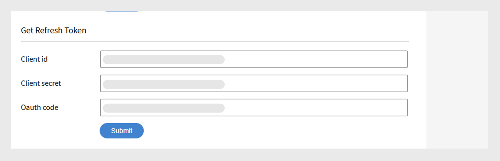
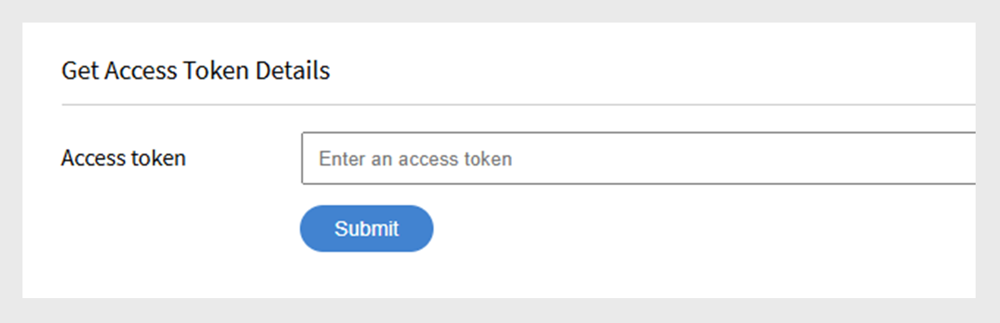

# Adobe Learning Manager Developer Manual

## Overzicht

Adobe Learning Manager biedt RESTful-API&#39;s waarmee ontwikkelaars toepassingen of workflows effectief kunnen integreren en aanpassen. De ontwikkelaarshandleiding biedt richtlijnen voor het gebruik van deze API&#39;s, met onderwerpen zoals verificatie, gegevensmodellen en integratie met andere toepassingen. Bovendien, helpt deze gids [ API verwijzingsdocumentatie ](https://learningmanager.adobe.com/docs/primeapi/v2/) ontwikkelaars in het creëren van externe toepassingen of achterste werkschema&#39;s die met diverse eigenschappen van Adobe Learning Manager, met inbegrip van cursusverwezenlijking, het volgen van studentenvooruitgang, vaardigheidstoewijzing, certificatie, gamification, en transcripten interactie aangaan.

Deze handleiding behandelt het volgende:

* OAuth2.0-verificatie
* API-objectmodellen
* Toont hoe u include, fields, and other parameters gebruikt
* Verstrekt eindpunten voor praktijkvoorbeelden

>[!IMPORTANT]
>
>Deze ontwikkelaarshandleiding is exclusief van toepassing op de V2 API&#39;s van Adobe Learning Manager. Alle voorbeelden, aanvraagstructuren en verificatieworkflows die worden beschreven in deze handleiding zijn specifiek voor de eindpunten /primeapi/v2/. Voor informatie over oudere versies of afgekeurde APIs, verwijs naar de [ API verwijzingsdocumentatie ](https://learningmanager.adobe.com/docs/primeapi/v2/).

## API-gebruiksscenario&#39;s

Ontwikkelaars kunnen API&#39;s van Learning Manager gebruiken om de Learning Manager te verbeteren of te integreren met andere bedrijfstoepassingen. U kunt web-, desktop- of mobiele apps maken met elke technologie. Ontwikkelaars hebben toegang tot toepassingsgegevens binnen Learning Manager, maar de implementatie is extern en volledig door u beheerd. Apps worden doorgaans ontwikkeld door klantorganisaties voor hun eigen accounts, terwijl Adobe partners algemene toepassingen kunnen maken voor breder gebruik.

## Verificatie met OAuth 2.0

Als u Adobe Learning Manager API&#39;s veilig wilt gebruiken, moet u zich verifiëren met het OAuth 2.0-mechanisme van ALM. Dit proces omvat het registreren van uw toepassing, het genereren van een machtigingscode, het uitwisselen van een vernieuwingstoken en het gebruiken van het vernieuwingstoken om een toegangstoken te krijgen.

### Een toepassing registreren

Integreer Adobe Learning Manager met externe toepassingen voor verbeterde veelzijdigheid. De stappen omvatten de toegang tot de interface van de Beheerder van de Integratie, het registreren van de toepassing, en het verkrijgen van cliëntidentiteitskaart en Geheime. Genereer verificatietokens (OAuth, Refresh en Access Tokens) van ALM, waarbij het gebruik van het OAuth 2.0-framework voor verificatie en autorisatie wordt benadrukt. De toegangstoken is zeven dagen geldig.

1. Meld u aan bij Adobe Learning Manager als integratiebeheerder.
2. Selecteer **[!UICONTROL Toepassingen]** op de linkerruit.

   

3. Selecteer **[!UICONTROL Register]** en voeg de volgende informatie toe:

   * **[!UICONTROL Naam van de Toepassing]**: Type de naam van uw toepassing (maximum 50 karakters).
   * **[!UICONTROL URL]**: Officiële URL van uw bedrijf of toepassing. Wordt gebruikt voor identificatie en referentie.
   * **[!UICONTROL richt Domeinen]** opnieuw: Specificeer de domeinen (bijvoorbeeld, [ http://learningmanager.adobe.com ](http://learningmanager.adobe.com)) die ALM aan na vergunning kan opnieuw richten.  U kunt meerdere URL&#39;s vermelden, maar de URL&#39;s moeten geldig zijn.
   * **[!UICONTROL Beschrijving]**: Korte beschrijving van wat de toepassing doet.
   * **[!UICONTROL Bereiken]**: Selecteer één van de zes beschikbare opties om het werkingsgebied van uw toepassing te bepalen. Op basis van uw hier vermelde keuze zijn de API-eindpunten van de Learning Manager toegankelijk voor uw toepassing. Als u bijvoorbeeld leestoegang voor de studentrol hebt gekozen, zijn alle API-eindpunten van de leermanager alleen-lezen voor uw toepassing.

      * Lezen/schrijven-toegang beheerdersrol: hiermee kan de toepassing als beheerder toegang krijgen tot gegevens of deze wijzigen.
      * Lezen/schrijven-toegang studentrol: hiermee kan de toepassing gegevens voor studenten openen of wijzigen.
      * xAPI-lees- en schrijftoegang: hiermee kan de toepassing Experience API-statements (xAPI) openen en verzenden.

   * **[!UICONTROL slechts voor deze rekening?]**

      * **[!UICONTROL ja]** - als u ja kiest, dan is de toepassing niet zichtbaar aan andere accountbeheerders.
      * **[!UICONTROL Nr]** - als u Nr kiest, kunnen andere accountbeheerders tot deze toepassing ook toegang hebben, maar zij moeten toepassings identiteitskaart gebruiken om tot deze toepassing toegang te hebben. Toepassings-id wordt gegenereerd en weergegeven in de bewerkingsmodus van de Learning Manager-toepassing.

     

4. Selecteer **[!UICONTROL sparen]** om de toepassing te registreren.

   * Nadat u de toepassing hebt geregistreerd, is deze beschikbaar in de lijst met toepassingen die in het account zijn gemaakt. Selecteer de toepassing en naast de eerder ingevoerde velden ziet u het volgende:
   * Toepassings-id: dit is de client-id. Deze id vertelt ALM de toepassing die toegang aanvraagt. Het is opgenomen in API-verzoeken om de app te identificeren.
   * Toepassingsgeheim: hiermee wordt uw app geverifieerd en de identiteit ervan geverifieerd tijdens de uitwisselingsstappen voor token (bijvoorbeeld bij het aanvragen van een vernieuwingstoken of een toegangstoken).

   

## Een toegangstoken verkrijgen

### Autorisatiecode ophalen uit omleiding

Nadat u de client-id en het clientgeheim hebt opgehaald, kunt u deze gebruiken om een toegangstoken aan te vragen. Met dit token kunt u API-aanroepen verifiëren.

Als u wilt beginnen met het doorvoeren van de machtigingscode, stuurt u uw gebruikers naar de volgende URL in een browser:

```
GET https://learningmanager.adobe.com/oauth/o/authorize?client_id=<Enter your clientId>&redirect_uri=<Enter a url to redirect to>&state=<Any String data>&scope=<one or more comma separated scopes>&response_type=CODE 
```

Zodra de gebruiker de toepassing goedkeurt, leidt Adobe Learning Manager de opgegeven redirect_uri om met een toegevoegde queryparameter:

[ https://yourapp.com/callback?code=abc123xyz](https://yourapp.com/callback?code=abc123xyz)

Er wordt een parametercode toegevoegd samen met de omleidingsuri.

### Vernieuwingstoken ophalen uit code

Nadat u de code hebt ontvangen, gebruikt u een API-gereedschap en voegt u de volgende POST-aanvraag toe:

```https://learningmanager.adobe.com/oauth/token ```

**Lichaam van het Verzoek (x-www-vorm-urlencoded)**:

```
grant_type=authorization_code  
&code=abc123xyz  
&client_id=<your_client_id>  
&client_secret=<your_client_secret>  
&redirect_uri=<your_redirect_url> 
```

**Antwoord**

```
{ 

  "access_token": "eyJhbGciOiJIUzI1...", 
  "refresh_token": "xTjlfz0jCk6gF1...", 
  "expires_in": 604800, 
  "token_type": "Bearer" 

} 
```

Gebruik het access_token in de machtigingheader om geverifieerde API-aanvragen in te dienen.

### Het toegangstoken in een API-aanroep gebruiken

Verifieer het toegangstoken met behulp van het volgende:

```
GET https://learningmanager.adobe.com/oauth/token/check?access_token=<access_token> 
```

Een toegangstoken is zeven dagen geldig. Na zeven dagen moet u een nieuw toegangstoken genereren met een vernieuwingstoken. Als u met een vernieuwingstoken een nieuw toegangstoken genereert terwijl een bestaand toegangstoken nog geldig is, wordt het bestaande token geretourneerd.

### Toegangstokens verkrijgen voor testen en ontwikkelen

Gebruik het hulpprogramma voor het genereren van Adobe Learning Manager-tokens (ALM) om snel toegangstokens te maken voor test- en ontwikkelingsdoeleinden. Deze tokens zijn uitsluitend bedoeld voor persoonlijk gebruik tijdens ontwikkelings- en foutopsporingsfasen. Houd er rekening mee dat testtokens toegang verlenen tot uw ALM-gegevens, zodat het van essentieel belang is om deze veilig te verwerken. Deel je testtokens nooit met anderen, gebruik ze in productietoepassingen of neem ze op in openbare codeopslagplaatsen. Behandel ze als wachtwoorden om de beveiliging van je account en data te waarborgen.

1. Meld u aan bij Adobe Learning Manager als integratiebeheerder.
2. Selecteer **[!UICONTROL de Middelen van de Ontwikkelaar van 0} en dan]** selecteer de Tokens van de Toegang voor het Testen en Ontwikkeling **[!UICONTROL .]**

   

3. Typ **[!UICONTROL identiteitskaart van de Cliënt]** die u na het creëren van een toepassing kreeg om de code te krijgen OAuth. Dan selecteer **[!UICONTROL voorleggen]**.

   

4. Voeg **[!UICONTROL identiteitskaart van de Cliënt]** en het **[!UICONTROL Geheime punt van de Cliënt]** toe om te krijgen vernieuwt token. Dan selecteer **[!UICONTROL voorleggen]**. De OAuth wordt vooraf ingevuld vanaf de vorige stap.

   

5. Voeg de Client-id en het clientgeheim toe om het toegangstoken op te halen. Dan selecteer **[!UICONTROL voorleggen]**.

   

6. Voeg het toegangstoken toe en selecteer Verzenden om de toegangstoken-details op te halen.

   

Op het selecteren **[!UICONTROL legt]** voor, wordt het toegangstoken geverifieerd, en de volgende reactie verschijnt:

```
{ 
  "access_token": "access token", 
  "refresh_token": "refresh token", 
  "user_role": "admin", 
  "account_id": "1234", 
  "user_id": "123456", 
  "expires_in": 604800 
} 
```

Net als voorheen verloopt het toegangstoken voor testen over zeven dagen.

### Een API-tool gebruiken om de eindpunten te testen

U kunt een API-testtool van derden gebruiken, maar Postman wordt gebruikt om de eindpunten te testen. In de voorbeelden in dit document wordt Postman gebruikt voor het testen van eindpunten.

1. Open Postman en maak een nieuwe aanvraag.
2. Selecteer het tabblad Autorisatie.
3. Stel het autietype in op Dragertoken.

   
4. Plak de toegangstoken die u uit de vorige sectie hebt gekregen in het veld Token.

   

5. Voeg het volgende toe op het tabblad Kopteksten.

   * Sleutel: Accepteren
   * Waarde: toepassing/json
6. Typ uw API-eindpunt in het veld URL. Voorbeeld: [ https://learningmanager.adobe.com/learningManager/api/v2/users](https://learningmanager.adobe.com/learningManager/api/v2/users)
De Verwijzing van de mening [ Adobe Learning Manager API ](https://learningmanager.adobe.com/docs/primeapi/v2/) voor meer informatie.
7. Selecteer Verzenden om de API-aanvraag in te dienen.

## Typen API&#39;s

### Admin-API&#39;s

Met de Admin API&#39;s van Adobe Learning Manager kunnen beheerders leerbewerkingen op grote schaal automatiseren en beheren.

Met de Admin API&#39;s kunnen ontwikkelaars:

>[!NOTE]
>
>De lijst is niet uitputtend.

* **beheer gebruikers en groepen**: Creeer, werk, en schrap gebruikers bij of wijs hen aan groepen toe.
* **schrijf studenten** in: Automatiseer inschrijving in cursussen, Leerpaden, of certificeringen.
* **de vooruitgang van de student** volgen: haal cursus/modulevooruitgang, quizscores, en voltooiingsstatus terug.
* **Genereer rapporten**: De gegevens van de toegang over studentenactiviteit, betrokkenheid, en prestaties.
* **beheer inhoud**: Creeer en orden cursussen, en het Leren Objecten.

De Verwijzing van de mening [ Adobe Learning Manager API ](https://learningmanager.adobe.com/docs/primeapi/v2/) voor meer informatie.

### Student-API&#39;s

De API&#39;s voor studenten zijn ontworpen voor geverifieerde gebruikers (studenten) en bieden u toegang tot studentspecifieke informatie. Deze API&#39;s staan taken toe zoals:

* Toegang tot de cursussen en voortgang van een student
* Betaalde badges of certificeringen ophalen
* Profielgegevens van studenten bijwerken
* Vaardigheden weergeven die zijn gekoppeld aan voltooide cursussen

**Belangrijke punten:**

* Voor deze API&#39;s is een geverifieerd gebruikerstoken nodig, zodat de beveiliging en privacy van gegevens worden gewaarborgd.
* De API&#39;s zijn bedoeld voor scenario&#39;s waarin gebruikers volledig zijn geregistreerd en aangemeld, en niet voor anonieme of gedeelde gebruikers.

De Verwijzing van de mening [ Adobe Learning Manager API ](https://learningmanager.adobe.com/docs/primeapi/v2/) voor meer informatie.

## API-ontwerp en algemene parameters

De API&#39;s bieden ontwikkelaars toegang tot belangrijke leermanschappen zoals gebruikers, cursussen, vaardigheden, certificeringen en leerprogramma&#39;s. Hiervoor worden REST-principes gebruikt, waarbij HTTP-methoden (GET, POST, PUT, DELETE) worden gebruikt voor gegevensbewerkingen.

| | |
|--|--|
| Methoden | GET, PUT, POST, DELETE |
| Indeling | application/vnd.api+json, application/json. [ Leer meer ](https://developer.mozilla.org/en-US/docs/Web/HTTP/Guides/MIME_types/Common_types) over gemeenschappelijke types MIME. |
| Basis-URL | [ https://learningmanager.adobe.com/primeapi/v2/](https://learningmanager.adobe.com/primeapi/v2/) |

### Algemene parameters

| Parameters | Doel |
|--|--|
| include | Krijg verwante middelen in één vraag. |
| velden | Selecteer specifieke kenmerken om de lading te verminderen. |
| filter | Smalle resultaten (bijvoorbeeld op ID, naam) |
| sorteren | Resultaten bestellen. |
| pagina [ grens ], pagina [ verschuiving ] | Ondersteuning voor paginering. |

Hier volgt een korte uitleg van elk:

### include

ALM-API&#39;s kunnen worden gebruikt om nuttige informatie op te halen tijdens het bouwen van een aangepaste toepassing of een headless LMS. De API-eindpunten kunnen verder worden opgenomen met aanvullende &#39;include&#39;-parameters om de extra informatie op te halen die betrekking heeft op de gegevens die standaard worden ontvangen. Deze relaties zijn relaties met datamodellen. Als u bijvoorbeeld een oproep doet om gebruikersgegevens op te halen, ontvangt u de gebruikersgegevens en de relatie van de manager-id en de ALM-account-id. Met de parameter include kunt u op een gedetailleerde manier aanvullende details ophalen samen met de gebruikersgegevens, zoals de beheergegevens en de ALM-accountgegevens.
Kortom, **omvat** parameter wordt gebruikt in API vraag om verwante (verbonden) middelen samen met het primaire middel in één enkele reactie te halen. Het is handig als u toegang wilt tot geneste of afhankelijke gegevens, zoals modules van een cursus of de vaardigheden die aan een student zijn toegewezen, zonder afzonderlijke API-aanroepen te maken.

Belangrijkste voordelen:

* Vermindert meerdere API-aanroepen: vermijdt de noodzaak om elke gerelateerde bron handmatig aan te vragen.
* Verbetert de efficiëntie: snellere ontwikkeling, minder serverlading en snellere rendering van gegevens.
* Zorgt voor gegevensconsistentie: haalt alle gerelateerde gegevens op in een consistente momentopname.

**hoe te om te gebruiken omvat parameter**

Voeg de parameter include toe aan uw API-URL en geef op welke verwante entiteiten u wilt opnemen.

**gemeenschappelijk omvat wegen**

| Waarde opnemen | Beschrijving |
|---|---|
| exemplaren | Retourneert alle instanties van het leerobject |
| enrollment | Retourneert inschrijvingsgegevens voor de gebruiker |
| instances.loResources.resources | Hiermee worden modules en bronnen binnen een instantie opgehaald |
| additionalResources | Retourneert de bijbehorende aanvullende bronnen |
| skills.skillLevel.badge | Hiermee worden vaardigheidsniveaus en de bijbehorende badges opgehaald |
| voorwaarde-LO&#39;s | Omvat vereiste leerobjecten |
| subLO&#39;s | Hiermee worden subleerobjecten opgehaald (gebruikt in LP&#39;s of certificeringen) |
| subLOs.enrollment | Inschrijving voor subleerobjecten |
| instances.badge | Badge die is toegewezen voor het voltooien van een cursusinstantie |
| subLOs.subLOs.instances.loResources.resources | Dicht geneste middelen binnen een sub-sub-LO instantie |

**Voorbeeld 1**

Hiermee worden de gegevens van een gebruiker opgehaald met de parameter userID in het eindpunt

```
https://learningmanager.adobe.com/primeapi/v2/users/<userID>
```

```
GET https://learningmanager.adobe.com/primeapi/v2/users/<userID>
```

In de reactie kunt u zien dat het gegevensobject een relatie heeft met het account en de manager van de gebruiker.

```
"relationships": {
            "account": {
                "data": {
                    "id": "1010",
                    "type": "account"
                }
            },
            "manager": {
                "data": {
                    "id": "3400476",
                    "type": "user"
                }
            }
        }
```

Met de parameter include in de aanvraag kunt u gedetailleerde informatie over de manager ophalen, zoals hieronder wordt weergegeven:

```
GET https://learningmanager.adobe.com/primeapi/v2/users/<userid>?include=manager
```

**Voorbeeld 2**

Gebruik de parameter include in de aanroep van het eindpunt om de cursusdetails op te halen. Het volgende eindpunt krijgt de cursusinformatie samen met de relaties.

```
GET https://learningmanager.adobe.com/primeapi/v2/learningObjects/<courseID>
```

De relaties worden als volgt weergegeven in de reactie:

* exemplaren
* vaardigheden
* auteurs

```
"relationships": {
            "authors": {
                "data": [
                    {
                        "id": "3400468",
                        "type": "user"
                    }
                ]
            },
            "instances": {
                "data": [
                    {
                        "id": "course:16444_31598",
                        "type": "learningObjectInstance"
                    }
                ]
            },
            "skills": {
                "data": [
                    {
                        "id": "course:16444_1796",
                        "type": "learningObjectSkill"
                    },
                    {
                        "id": "course:16444_3103",
                        "type": "learningObjectSkill"
                    }
                ]
            }
        }
```

Andere relaties kunnen (niet aanwezig in het bovenstaande antwoord) omvatten:

* voorwaarde-LO&#39;s
* aanvullende LO&#39;s
* additionalResources

Als u gedetailleerde gegevens wilt over de instanties en vaardigheden, neemt u &#39;instanties,vaardigheden&#39; op in de parameter include.

```
GET https://learningmanager.adobe.com/primeapi/v2/learningObjects/<courseID>?include=instances,skills
```

Als u bijvoorbeeld meer gegevens wilt ophalen die aan de cursusinstantie zijn gekoppeld, zoals loResources (module-informatie van de cursus), moet u loResources toepassen als een genest include-bestand.

```
GET https://learningmanager.adobe.com/primeapi/v2/learningObjects/<courseID>?include=instances.loResources
```

Combineer vaardigheden en instanties met een genest include-bestand.

```
GET https://learningmanager.adobe.com/primeapi/v2/learningObjects/<courseID>?include=instances,instances.loResources,skills
```

**andere omvatten filters**

<table>
  <tbody>
  <tr>
   <td>
    <p style="text-align: left;"><b>Leerprogramma's</b></p></td>
   <td>
    <p style="text-align: left;"><b>Cursus</b></p></td>
  </tr>
  <tr>
  <td><br>subLOs.prerequisiteLOs.enrollment</br><br>subLOs.subLOs.prerequisiteLOs.enrollment</br><br>subLOs.enrollment.loResourceGrades</br><br>subLOs.subLOs.enrollment.loResourceGrades</br><br>subLOs.subLOs.instances.loResources.resources.room</br><br>subLOs.instances.loResources.resources.room</br><br>subLOs.supplementaryResources</br><br>subLOs.enrollment</br><br>SubLOs.enrollment.loInstance.loResources.resources</br><br>subLOs.supplementaryLOs.instances.loResources.resources</br>
  </td>
  <td>
  <br> instances.enrollment.loResourceGrades </br><br> enrollment.loInstance.loResources </br> conditionLOs </br><br> auteurs </br><br> instances.loResources.resources </br><br> additionalLOs.instances.loResources.resources </br><br> additionalResources </br><br> instances.badge </br><br> skills.skillLevel.badge </br><br>.skillLevel.skill </br><br> instances.loResources.resources.room </br><br> conditionLOs.enrollment </br><br> enrollment.loResourceGrades </br>
  </td>
  </tr>
  </table>

#### velden

De kenmerken en relaties van een API-object worden velden genoemd. Gebruik Velden als een parameter in API-aanroepen om specifieke kenmerken van het model op te halen. Zonder de parameter Fields haalt de API-aanroep alle beschikbare kenmerken op.

Bijvoorbeeld, in de volgende API vraag, haalt de gebieden [ vaardigheid ]=name u het naamattribuut van het vaardigheidsmodel alleen.

```
GET https://learningmanager.adobe.com/primeapi/v2/users/3400490/userSkills/3400490_1796_1?include=skillLevel.skill&fields[skill]=name
```

#### paginering

API-paginering is een techniek die in API&#39;s wordt gebruikt om grote gegevenssets op te splitsen in kleinere, beheerbare blokken, pagina&#39;s genoemd, in plaats van de volledige gegevens in één reactie te retourneren.

Paginering vermindert het laden van de client en de server, beperkt de reactiegrootte om knelpunten in de server te voorkomen of is handig voor het weergeven van gegevens in tabellen of lijsten van één pagina tegelijk.

**Hoe de paginering in het werk van ALM APIs**

ALM API&#39;s ondersteunen paginering via parameters zoals:

* pagina [ grens ]: Aantal verslagen per pagina.
* pagina [ verschuiving ]: Aantal verslagen aan oversla.
* pagina [ curseur ]: Wijs aan de volgende reeks resultaten aan. In plaats van op verschuiving gebaseerde paginering (die een aantal records overslaat) gebruikt de op cursor gebaseerde paginering een uniek markeerteken dat door de API wordt geretourneerd om de volgende pagina met resultaten op te halen.

Hieronder wordt beschreven hoe u paginering in API&#39;s kunt gebruiken:

**pagina [ grens]**

Terwijl [ https://learningmanager.adobe.com/primeapi/v2/users ](https://learningmanager.adobe.com/primeapi/v2/users) alle gebruikers en verwante informatie in één enkele vraag terugkeert, beperkt het gebruiken van pagina [ grens ] het aantal resultaten tot de gespecificeerde waarde.

Gebruik de volgende API om slechts vijf gebruikersrecords in één aanroep te retourneren:

```
GET https://learningmanager.adobe.com/primeapi/v2/users?page[limit]=5
```

**pagina [ verschuiving]**

Gebruik deze API-aanroep om drie gebruikersrecords te retourneren, de eerste vijf gebruikers over te slaan en vanaf de zesde te beginnen.

```
GET https://learningmanager.adobe.com/primeapi/v2/users?page[limit]=3&page[offset]=5 
```

**pagina [ curseur]**

1. Klik eerst op de eerste pagina met een limiet van 5.

   ```
   GET https://learningmanager.adobe.com/primeapi/v2/users?page[limit]=5
   ```

2. Kopieer de cursorwaarde van links.next en gebruik deze in de volgende aanvraag:

   ```
   "links": {
       "self": "https://learningmanager.adobe.com/primeapi/v2/users?page[limit]=5",
       "next": "https://learningmanager.adobe.com/primeapi/v2/users?page[limit]=5&page[cursor]=3400482"
    }
   ```

3. Verzend het volgende verzoek:

   ```
   GET https://learningmanager.adobe.com/primeapi/v2/users?page[limit]=5&page[cursor]=3400482
   ```

Hiermee wordt de volgende set van 10 records geretourneerd, te beginnen na het laatste item van de vorige pagina.

#### filter

Met de filterparameter kunt u de API-resultaten beperken op basis van een of meer veldwaarden.

Adobe Learning Manager API&#39;s bieden verschillende variaties van de filterparameter om de reacties te beperken.

De Verwijzing van de mening [ Adobe Learning Manager API ](https://learningmanager.adobe.com/docs/primeapi/v2/) voor meer informatie.

In dit voorbeeld wordt getoond hoe u de taakhulpen kunt filteren waarvoor een student zich heeft ingeschreven bij het gebruiken van het eindpunt met de filterparameter:

```
GET https://learningmanager.adobe.com/primeapi/v2/users/3400480/enrollments?filter.loTypes=jobAid
```

#### sorteren

De sorteerparameter wordt gebruikt voor het sorteren van API-resultaten in oplopende of aflopende volgorde op basis van een of meer velden.

De Adobe Learning Manager biedt verschillende sorteeropties voor het sorteren van de API-reactie. De Verwijzing van de mening [ Adobe Learning Manager API ](https://learningmanager.adobe.com/docs/primeapi/v2/) voor meer informatie.

Als u het vorige voorbeeld uitbreidt, sorteert u nu de inschrijving van de gebruiker naar leerprogramma&#39;s op datum die in oplopende volgorde is ingeschreven.

```
GET https://learningmanager.adobe.com/primeapi/v2/users/3400480/enrollments?filter.lotypes=learningProgram&sort=dateEnrolled
```

## Overzicht van API-modellen

Met de Adobe Learning Manager API&#39;s hebben ontwikkelaars toegang tot leermantobjecten als RESTful-bronnen. Elk API-eindpunt vertegenwoordigt een bron, meestal een object zoals een badge, of een verzameling van dergelijke objecten. De ontwikkelaars gebruiken dan de werkwoorden van HTTP zoals PUT, GET, POST en DELETE om de verrichtingen CRUD op die voorwerpen (inzamelingen) uit te voeren.


| Learning Manager-object | Beschrijving |
|----|----|
| account | Omvat de gegevens van een leermanklant. |
| badge | Een badge is een vorm van prestatiebeloning die studenten krijgen wanneer ze specifieke mijlpalen bereiken terwijl ze binnen een cursus verdergaan. |
| catalog | Catalogus is een verzameling leerobjecten. |
| gebruikersinterface | Gebruiker is het belangrijkste model in Learning Manager. Gebruikers zijn meestal de interne of externe studenten van een organisatie die leerobjecten gebruiken. Zij kunnen echter naast de rol van de student een andere rol op zich nemen, zoals auteur en manager. Gebruikers-ID, -type en -e-mail zijn enkele van de inline attributen. |
| resource | Leermiddel wordt gebruikt voor het modelleren van elke inhoudsbron die voor een module moet worden geordend. Alle bronnen die zijn ingekapseld in een &quot;loResource&quot; zijn equivalent in termen van het leerdoel, maar ze verschillen van elkaar in termen van leveringstype of landinstelling van inhoud. |
| userNotification | Dit model bevat kennisgevingsinformatie over een student. |
| userSkill | UserSkill geeft aan hoeveel van één vaardigheidsniveau door één gebruiker wordt bereikt. |
| userBadge | Gebruikersbadge koppelt afzonderlijke badges aan afzonderlijke gebruikers. Het bevat details zoals wanneer het werd bereikt, assertionUrl etc. |
| skill | Het vaardighedenmodel bestaat uit niveaus en punten. Vaardigheden kunnen door de studenten worden verworven na het afronden van de cursus. |
| skillLevel | Een vaardigheidsniveau bestaat uit een of meer cursussen die moeten worden gevolgd om een niveau te bereiken met de bijbehorende punten. |
| learningObject | Een leerobject is een abstractie voor verschillende soorten objecten waar gebruikers zich voor kunnen inschrijven en van kunnen leren. Op dit moment heeft Leermanager de vier typen leerobjecten: Cursus, Certificering, Leerprogramma en Taakhulp. |
| learningObjectInstance | Een specifieke instantie van een leerobject. |
| learningObjectResource | Dit is gelijk aan het concept module. Een cursus bestaat uit een of meer modules. In Learning Manager kan een module op verschillende gelijkwaardige manieren worden geleverd. Daarom omvat loResource hoofdzakelijk al die gelijkwaardige middelen. |
| loResourceGrade | Dit vat het resultaat samen van de gebruiker die een specifieke bron gebruikt in de context van een leerobject waarvoor hij/zij is ingeschreven. Deze bevat informatie zoals de duur die de gebruiker in de bron heeft doorgebracht, de procentuele voortgang die de gebruiker heeft gemaakt, de status geslaagd/gezakt en de score die de gebruiker in een gekoppelde quiz heeft behaald. |
| calendar | Een kalenderobject is een lijst met aanstaande klassikale of virtuele klassikale cursussen waarvoor de gebruiker zich kan inschrijven. |
| l1FeedbackInfo | L1-Feedback omvat de antwoorden van een student op de feedbackvragen die betrekking hebben op leerobjecten. Meestal wordt dit verzameld nadat de gebruiker een leerobject heeft voltooid indien dit is geconfigureerd om dergelijke feedback van studenten te verzamelen. |
| enrollment | Deze abstractie omvat de details met betrekking tot de transactie die de toewijzing van een specifieke gebruiker aan een specifieke leerobjectinstantie weergeeft. |


## Student-API&#39;s en eindpunten

Hier volgen belangrijke API-eindpunten voor het werken met studentgegevens. Deze API&#39;s begeleiden ontwikkelaars bij het werken met studentgegevens, het volgen van de voortgang, het beheren van inschrijvingen en het ophalen van cursusinhoud.

### Details van alle studenten ophalen

Haal de gegevens van de student op (naam, e-mail, UUID, gebruikersprofiel, enzovoort). Gebruik de API om alle studenten in het account weer te geven.

```
GET https://learningmanager.adobe.com/primeapi/v2/users
```

### Gegevens van een specifieke student ophalen

Als u het profiel van een student wilt bekijken op ID, gebruikt u de volgende API om te bellen.

```
GET https://learningmanager.adobe.com/primeapi/v2/users/<userID>
```

### Alle cursussen, leerprogramma&#39;s, taakhulpen en certificeringen weergeven

Haal de gegevens op van alle leerobjecten waarvoor de student is ingeschreven, is voltooid of door de beheerder is ingeschakeld.

```
GET https://learningmanager.adobe.com/primeapi/v2/learningObjects
```

### Details ophalen van een specifiek leerobject

Krijg gedetailleerde informatie over een leerobject. Deze bevat de aanmaakdatum, de publicatiedatum, de bijgewerkte datum en andere informatie.

```
GET https://learningmanager.adobe.com/primeapi/v2/learningObjects/<LearningObjectID>
```

### Lijst met vaardigheden ophalen die zijn gekoppeld aan cursussen

Geef de vaardigheden weer die aan alle studenten in het account zijn toegewezen.

```
GET https://learningmanager.adobe.com/primeapi/v2/skills
```

### Informatie over vaardigheidsniveau en badges ophalen

Controleer de voortgang van de studenten in de op vaardigheden gebaseerde leertrajecten.

```
GET https://learningmanager.adobe.com/primeapi/v2/skills/<skillID>?include=levels
```

### Lijst met alle badges die voor een account zijn gemaakt

Bel het volgende eindpunt om een lijst op te halen met alle badges die voor een account in een organisatie zijn gemaakt.

```
GET https://learningmanager.adobe.com/primeapi/v2/badges
```

### Informatie van een badge ophalen

Verkrijg gedetailleerde informatie over een badge, zoals de badgenaam, de afbeeldings-URL van de badge en de status van de badge.

```
GET https://learningmanager.adobe.com/primeapi/v2/badges/<skillID>
```

Dit levert de volgende reactie op:

```
{
    "links": {
        "self": "https://learningmanager.adobe.com/primeapi/v2/badges/499"
    },
    "data": {
        "id": "499",
        "type": "badge",
        "attributes": {
            "imageUrl": "https://cpcontentsdev.adobe.com/public/account/1010/accountassets/1010/badges/test_57a5ab00555a475a8fc6671562184dc9.png",
            "name": "penguins",
            "state": "Retired"
        }
    }
}
```

## Andere voorbeelden van API-gebruik

### Een gebruiker maken

1. Gebruik het eindpunt:

   ```
   POST https://learningmanager.adobe.com/primeapi/v2/users
   ```

   Verwerkt de kenmerken van de API-hoofdtekst of de JSON-lading om een gebruiker te genereren en geeft vervolgens een gebruiker de respectievelijke gebruikers-id ingevuld.

2. Gebruik de volgende lading als lichaam:

   ```
   { 
      "data": { 
        "type": "user", 
        "attributes": { 
         "email": "bob@example.com", 
          "name": "Bob", 
          "userType": "INTERNAL" 
        } 
      } 
    }
   ```

Er zijn drie verplichte kenmerken:

* e-mail: E-mail-ID van de gebruiker. Deze waarde moet uniek zijn voor elke gebruiker.
* naam: de naam van de gebruiker.
* userType: Op dit moment kunnen alleen interne gebruikers worden toegevoegd aan de hand van dit eindpunt. Het userType moet &quot;INTERNAL&quot; zijn.

Het volgende antwoord wordt weergegeven:

```
{
  "links": {
      "self": "https://learningmanager.adobe.com/primeapi/v2/users"
  },
  "data": {
      "id": "13386404",
      "type": "user",
      "attributes": {
          "avatarUrl": "https://cpcontents.adobe.com/public/images/default_user_avatar.svg",
          "email": "bob@example.com",
          "name": "Bob",
          "pointsEarned": 0,
          "pointsRedeemed": 0,
          "preferredResolution": "AUTO",
          "profile": "Employee",
          "roles": [
              "Learner"
          ],
          "state": "ACTIVE",
          "userType": "Internal",
          "userUniqueId": "bob@example.com"
      },
      "relationships": {
          "account": {
              "data": {
                  "id": "1010",
                  "type": "account"
              }
          },
          "manager": {
              "data": {
                  "id": "3400468",
                  "type": "user"
              }
          }
      }
  }
}
```

### Een gebruiker verwijderen

1. Haal de gebruikers-id op van de gebruiker die u wilt verwijderen.

   ```
   GET https://learningmanager.adobe.com/primeapi/v2/users/<userID>
   ```

2. Breng vervolgens met DELETE de volgende aanroep aan:

   ```
   DELETE https://learningmanager.adobe.com/primeapi/v2/users/<userID>
   ```

Er verschijnt een reactie van 204. Een 204-responscode geeft aan dat de code is gelukt zonder dat er inhoud is die moet worden geretourneerd. De server heeft het verzoek verwerkt, maar heeft geen gegevens om aan de client te verstrekken.

De status van de gebruiker wordt nu **[!UICONTROL VERWIJDERD]** nadat u de details van de gebruiker terugwint.

### Gebruikersgegevens bijwerken

1. Werk gebruikersgegevens bij van de gebruiker die de v2-API gebruikt. Studenten kunnen bio, uiLocale, contentLocale en timezone aanpassen. Voor grote accounts zijn dit asynchrone aanroepen. Er zijn vele andere gebruikersattributen die kunnen worden bijgewerkt gebruikend dit API eindpunt. Gebruik het /users/ {id} eindpunt, waar identiteitskaart gebruikersidentiteitskaart van de gebruiker is de waarvan details moeten worden bijgewerkt.

```
PATCH https://learningmanager.adobe.com/primeapi/v2/users/<userID>
```

Voeg het volgende toe in de lading van de aanvraag om de gebruiker bij te werken met de id `<userID>` uit de vorige sectie.

Wijzig elk veld in de lading.

```
{
    "data": {
        "id": "3400468",
        "type": "user",
        "attributes": {
            "avatarUrl": "https://cpcontents.adobe.com/public/images/default_user_avatar.svg",
            "binUserId": "3e6d571f-3956-44db-be69-8e458bde649f",
            "bio": "Manager",
            "contentLocale": "de-DE",
            "email": "user@example.com",
            "enrollOnClick": true,
            "fields": {
                "Web": "Web",
                "newfororder": "newvalue",
                "location": "New",
                "test1": "b"
            },
            "gamificationEnabled": true,
            "lastLoginDate": "2025-04-30T09:30:51.000Z",
            "metadata": {
                "level": "5",
                "expertise": "java",
                "sport": "tennis"
            },
            "name": "John Adams",
            "pointsEarned": 8600,
            "pointsRedeemed": 0,
            "preferredResolution": "AUTO",
            "profile": "Employee",
            "roles": [
                "Learner",
                "Admin",
                "Author",
                "Instructor",
                "Integration Admin",
                "Manager"
            ],
            "state": "ACTIVE",
            "timeZoneCode": "213",
            "uiLocale": "en-US",
            "userType": "Internal",
            "userUniqueId": "user@example.com"
        },
        "relationships": {
            "account": {
                "data": {
                    "id": "1010",
                    "type": "account"
                }
            }
        }
    }
}
```

Nadat u de vraag maakt, worden de details van de gebruiker bijgewerkt.

### Een extern profiel maken

Een extern profiel verwijst naar een gebruikersprofiel dat is gemaakt voor externe studenten, doorgaans individuen die geen deel uitmaken van de interne gebruikersbasis van de organisatie. Tot deze studenten kunnen klanten, partners, leveranciers, franchisehouders of tijdelijke contractanten behoren die toegang nodig hebben tot door de organisatie aangeboden trainings- of certificeringsprogramma&#39;s.

1. Gebruik het volgende eindpunt:

   ```
   POST https://learningmanager.adobe.com/primeapi/v2/externalProfiles
   ```

2. Gebruik de volgende lading als lichaam:

```
{
    "data": {
      "type": "externalProfile",
      "attributes": {
        "name": "Jonas Albertson",
        "expiry": "2027-12-31T18:29:59.000Z",
        "managerEmail": "jonas@acme.com",
        "seatLimit": 10
      }
    }
}
```

De lading heeft de volgende attributen:

* naam: de naam van de externe gebruiker.
* vervaldatum: de vervaldatum (in ISO-8601-indeling) van de gebruikersregistratie in Adobe Learning Manager.
* managerEmail: het e-mailadres van de manager van de gebruiker van de partnerorganisatie.
* seatLimit: het aantal toegestane licenties voor de partnerorganisatie.

Nadat u de vraag maakt, krijgt u de volgende reactie:

```
{
    "links": {
        "self": "https://learningmanager.adobe.com/primeapi/v2/externalProfiles"
    },
    "data": {
        "id": "18805",
        "type": "externalProfile",
        "attributes": {
            "accessKey": "8gte2ne7f4r14",
            "enabled": true,
            "expiry": "2027-12-31T18:29:59.000Z",
            "managerEmail": "jonas@acme.com",
            "name": "Jonas Albertson",
            "seatLimit": 10,
            "url": "https://learningmanager.adobe.com/eplogin?groupid=18805&accesskey=8gte2ne7f4r14"
        }
    }
}
```

Dit betekent dat de externe gebruiker is toegevoegd aan Adobe Learning Manager. Verzend de URL in de reactie naar de gebruiker, met behulp waarvan deze zich kan registreren op het platform.

### Gebruikersrapport extraheren met gebruikers-ID en managergegevens

Een gebruikersrapport kan direct van het gebruikersinterface worden gedownload (**[!UICONTROL Admin]** > **[!UICONTROL Gebruikers]** > **[!UICONTROL Intern]**). Het rapport retourneert echter niet de gebruikers-id en de gegevens van de bijbehorende manager.
Met de API voor taken voor een beheerder kunt u de details ophalen.

1. Voeg de volgende lading aan Jobs API toe.

   ```
   {
       "data": {
           "type": "job",
           "attributes": {
               "description": "description of your choice",
               "jobType": "generateUsers",
               "payload":{
                   "expandMetadata":true
               }
           }
      }
   }
   ```

2. Gebruik het volgende eindpunt.

   ```
   POST https://learningmanager.adobe.com/primeapi/v2/jobs
   ```

3. Kopieer de taak-id uit het antwoord.

   ```
   {
       "links": {
           "self": "https://learningmanager.adobe.com/primeapi/v2/jobs"
       },
       "data": {
           "id": "43118",
           "type": "job",
           "attributes": {
               "dateCreated": "2025-05-26T06:35:35.000Z",
               "description": "description of your choice",
               "jobType": "generateUsers",
               "payload": {
                   "expandMetadata": true
               },
             "status": {
                   "code": "Submitted"
               }
           }
       }
   }
   ```

   In de reactie is de taak-id 43118.
4. Nadat u de id hebt gekopieerd, gebruikt u de id in de Jobs API om het rapport te downloaden.

   ```
   GET https://learningmanager.adobe.com/primeapi/v2/jobs/43118
   ```

5. Kopieer de S3 URL van de reactie.
6. Plak de URL in uw browser. De browser vraagt u het CSV-bestand op te slaan of te openen. Sla het bestand op uw computer op.
Het gedownloade bestand bevat de volgende kolommen:

internalUserID, userEmail, customerDefinedUniqueUserId, name, managerEmail, userType, state, excludeFromGamification, pointsEarned, profile, rollen, dateCreated, lastLoginDate, dateDeleting, uiLocale, contentLocale, timeZoneCode, userSource, group, Active fields, metadata en lastSocial ActivityDate.

### Badge genereren met de Jobs API

1. Ontvang een lijst met badges voor een gebruiker in de organisatie. Gebruik het volgende eindpunt:

   ```
   GET https://learningmanager.adobe.com/primeapi/v2/users/3400476/userBadges
   ```

   Waarbij 3400476 de gebruikers-id is.
2. Kopieer de badge-id uit het antwoord. 3400476_759_COMPETENCY_1796_1 is bijvoorbeeld de badge-id.

   ```
   {
    "id": "3400476_759_COMPETENCY_1796_1",
    "type": "userBadge",
    "attributes": {
        "assertionUrl": "https://cpcontentsdev.adobe.com/public/accountassets/1010/badges/assertions/a99566b5aa8f4cfa92380581733c63a9_1626278856926.json",
        "dateAchieved": "2016-02-25T08:45:25.000Z",
        "modelType": "skillLevel"
    },
    "relationships": {
        "badge": {
            "data": {
                "id": "759",
                "type": "badge"
            }
        },
        "learner": {
            "data": {
                "id": "3400476",
                "type": "user"
            }
        },
        "model": {
            "data": {
                "id": "1796_1",
                "type": "skillLevel"
            }
        }
    }
   }
   ```

3. Maak een lading en geef de badge-id op in de lading. Een voorbeeldlading is als volgt:

   ```
   {
    "data": {
        "type": "job",
        "attributes": {
            "description": "Acme Corp Badge",
            "jobType": "generateUserBadge",
            "payload": {
                "userBadgeId": "3400476_759_COMPETENCY_1796_1"
            }
        }
    }
   }  
   ```

   Nadat u een vraag maakt, zult u taakidentiteitskaart in de reactie krijgen.
4. Neem baanID van de reactie en gebruik taakidentiteitskaart in het volgende eindpunt om de vraag te maken.

   ```
   GET https://learningmanager.adobe.com/primeapi/v2/jobs/<jobsID>
   ```

5. Kopieer de badge-URL van het antwoord en open de URL in een browser. Het certificaat wordt gedownload als een PDF.

### Gebruikers maken in Adobe Learning Manager

Het POST /users eindpunt helpt u een gebruiker creëren gebruikend de headless wijze. Maak gebruikers met gedetailleerde informatie, zoals het registratieproces in de native gebruikersinterface in Adobe Learning Manager.

Bijvoorbeeld:

```
POST https://learningmanager.adobe.com/primeapi/v2/users
```

Voeg de volgende tekst toe aan de aanvraag:

```
{   
   "data":  
     {  
       "type": "user",  
       "attributes": {  
         "bio": "",  
         "contentLocale": "fr-FR",  
         "email": "user@work.com",  
         "enrollOnClick": true,  
         "fields": {  
           "Learning Categories": [  
             "Business"  
           ],  
           "Categories": "IT"  
         },  
         "gamificationEnabled": true,  
         "name": "Test User",  
         "profile": "Engineer",  
         "userType": "INTERNAL",  
         "userUniqueId": "user@work.com"  
       },  
       "relationships": {  
         "account": {  
           "data": {  
             "id": "108079",  
             "type": "account"  
           }  
         }
         }  
       }  
    } 
```

Nadat u de vraag maakt, verschijnt de volgende reactie:

```
{
    "links": {
        "self": "https://learningmanager.adobe.com/primeapi/v2/users"
    },
    "data": {
        "id": "13385627",
        "type": "user",
        "attributes": {
            "avatarUrl": "https://cpcontents.adobe.com/public/images/default_user_avatar.svg",
            "email": "user@work.com",
            "name": "Test User",
            "pointsEarned": 0,
            "pointsRedeemed": 0,
            "preferredResolution": "AUTO",
            "profile": "Engineer",
            "roles": [
                "Learner"
            ],
            "state": "ACTIVE",
            "userType": "Internal",
            "userUniqueId": "user@work.com"
        },
        "relationships": {
            "account": {
                "data": {
                    "id": "1010",
                    "type": "account"
                }
            },
            "manager": {
                "data": {
                    "id": "3400468",
                    "type": "user"
                }
            }
        }
    }
}
```

Er wordt een nieuwe gebruiker toegevoegd aan Adobe Learning Manager.

### L1-feedback plaatsen

1. Haal de cursus-, instantie- en inschrijvingsgegevens van de student op. Gebruik de volgende endoint:

   ```
   GET /enrollments
   ```

2. Controleer of L1-feedback is ingeschakeld voor de cursusinstantie.

   ```
   GET https://learningmanager.adobe.com/primeapi/v2/learningObjects/<loID>/instances/<loInstanceID>/l1Feedback
   ```

3. Stuur de L1-feedback.

   ```
   POST /enrollments/{id}/l1Feedback
   ```

Voorbeeld van vereiste lading:

```
{
    "data": {
      "id": "course:7454218_10333537_11257863",
      "type": "feedback",
      "attributes": {
        "questions": [
          {
            "answer": "8",
            "questionId": "1",
            "mandatory": true,
            "questionType": "scaleTen"
          }
        ],
        "score": 80
      }
    }
  }
```

### Informatie op moduleniveau van een cursus ophalen

1. Haal de gegevens van een leerobject op ID.

   ```
   GET https://learningmanager.adobe.com/primeapi/v2/learningObjects/<loID>
   ```

   ```
   {
    "links": {
        "self": "https://learningmanager.adobe.com/primeapi/v2/learningObjects/course:1171899"
    },
    "data": {
        "id": "course:1171899",
        "type": "learningObject",
        "attributes": {
            "authorNames": [
                "James Adams"
            ],
            "dateCreated": "2017-11-01T15:28:09.000Z",
            "datePublished": "2017-11-01T15:28:20.000Z",
            "dateUpdated": "2017-11-01T15:28:20.000Z",
            "duration": 60,
            "effectiveModifiedDate": "2017-11-01T15:28:20.000Z",
            "effectivenessIndex": 0,
            "enrollmentType": "Self Enroll",
            "hasOptionalLoResources": false,
            "hasPreview": false,
            "isExternal": false,
            "isMqaEnabled": false,
            "isPrerequisiteEnforced": false,
            "isSubLoOrderEnforced": false,
            "loFormat": "Self Paced",
            "loResourceCompletionCount": 3,
            "loType": "course",
            "moduleResetEnabled": false,
            "state": "Published",
            "unenrollmentAllowed": true,
            "catalogLabels": [
                {
                    "catalogLabelValueIds": [
                        {
                            "name": "Sales",
                            "id": "catalogLabel:13_31"
                        }
                    ],
                    "description": "",
                    "mandatory": false,
                    "name": "Department",
                    "values": [
                        "Sales"
                    ]
                }
            ],
            "localizedMetadata": [
                {
                    "locale": "en-US",
                    "name": " Test course 2"
                }
            ],
            "rating": {
                "averageRating": 0,
                "ratingsCount": 0
            }
        },
        "relationships": {
            "authors": {
                "data": [
                    {
                        "id": "3400468",
                        "type": "user"
                    }
                ]
            },
            "instances": {
                "data": [
                    {
                        "id": "course:1171899_2067352",
                        "type": "learningObjectInstance"
                    }
                ]
            },
            "skills": {
                "data": [
                    {
                        "id": "course:1171899_1797",
                        "type": "learningObjectSkill"
                    }
                ]
            }
        }
    }
   }
   ```

2. Gebruik de parameter include om het volgende op te halen:

   a. Vermeld alle modules van het leerobject.

   ```
   GET https://learningmanager.adobe.com/primeapi/v2/learningObjects/course:1171899?include=instances.loResources
   ```

   b. Vermeld alle inhoud van de modules.

   ```
   GET https://learningmanager.adobe.com/primeapi/v2/learningObjects/course:1171899?include=instances.loResources.resources
   ```

### Voortgang module controleren

1. Haal het leerobject uit de catalogus op met de cursus-id.

   ```
   GET https://learningmanager.adobe.com/primeapi/v2/learningObjects?page[limit]=10&filter.loTypes=course&sort=name&filter.ignoreEnhancedLP=true&id=<courseID>
   ```

2. Haal inschrijvingsgegevens van een student op met behulp van de inschrijvers-id.

   ```
   GET https://learningmanager.adobe.com/primeapi/v2/enrollments/<enrollmentID>
   ```

   Kopieer de bronklasse-id van het leerobject uit de reactie.
3. Gebruik de id in het volgende eindpunt.

   ```
   GET https://learningmanager.adobe.com/primeapi/v2/loResourceGrades/<courseResourceGradeID>
   ```

In de reactie krijgt u informatie over de voortgang van de module.

### Imiteren van studenten

Bij het implementeren van een headless LMS met Adobe Learning Manager als back-end, kunnen organisaties ondersteuningspersoneel nodig hebben om studenten te kunnen nakomen voor probleemoplossing of hulp. De API-gestuurde imitatiemethode garandeert veilige toegang met behoud van de vertrouwelijkheid van de studentreferentie en ondersteunt naadloze overgangen in sessiestatussen.

Adobe Learning Manager (ALM) vergemakkelijkt het nadoen van studenten in headless LMS-omgevingen via een speciale API. Met deze functie kan ondersteuningspersoneel tijdelijk de identiteit van een student overnemen, zodat deze problemen kan diagnosticeren, functionaliteiten kan testen of praktische hulp kan bieden door de ervaring van de student te simuleren. Imitatie wordt geactiveerd met een toegangstoken voor beheerders in de cache, dat wordt gebruikt om programmatisch een toegangstoken voor studenten te genereren. Hierdoor kan het systeem werken alsof het als student is aangemeld.

>[!IMPORTANT]
>
>Gebruikers moeten speciale API-toegang aanvragen om deze functie te kunnen gebruiken en het systeem moet sessieoverschakeling, autorisatie en andere indicatoren verwerken om transparantie en verantwoordingsplicht tijdens de imitatie te waarborgen.

**API eindpuntdetails**

```
POST /oauth/learnerToken
```

**Volledige URL voorbeeld**

```
https://learningmanager.adobe.com/oauth/o/learnerToken?learner_email=foo@acme.com&force=false
```

**parameters van de Vraag:**

* student_e-mail: (tekenreeks) De e-mail van de student om zich voor te doen.
* force: (Boolean) Of een nieuwe token geforceerd moet worden gegenereerd als deze bestaat.

**Hoofdtekst van het verzoek:**

```
{
    "client_id": "your-client-id",
    "client_secret": "your-client-secret",
    "refresh_token": "your-admin-refresh-token"
}  
```

**reactie van de Steekproef:**

```
{
    "access_token": "generated-token",
    "refresh_token": "new-refresh-token",
    "user_role": "learner",
    "account_id": "123456",
    "user_id": "7891011",
    "expires_in": 604800
}  
```

**Steekproef cURL:**

```
curl --location --request POST 'https://learningmanager.adobe.com/oauth/o/learnerToken?learner_email=foo@acme.com&force=false' \
--header 'Content-Type: application/json' \
--data-raw '{
  "client_id": "xxxx",
  "client_secret": "xxxx",
  "refresh_token": "xxxx"
}'
```

### Studenttranscripten genereren

**codes van de Fout**

| HTTP-status | Betekenis | Problemen oplossen |
|---|---|---|
| 400 | Ongeldig verzoek | Controleren op ontbrekende of onjuist gevormde parameters in de aanvraag. Controleer de vereiste velden en corrigeer de opmaak. Bijvoorbeeld, ongeldige syntaxis voor filter, gebieden, of omvat parameters. |
| 401 | Niet-geautoriseerd ongeldig of ontbrekend token | Zorg ervoor dat uw toegangstoken correct is en in de machtigingheader is opgenomen. Controleer of het token actief is. Gebruik ook de juiste client-id en het juiste clientgeheim wanneer u een token aanvraagt. |
| 403 | Verboden. Geen toegang | U hebt geen toegang tot de bron. Controleer of uw token het juiste bereik heeft (admin:read, student:write, enzovoort.) |
| 404 | Bron niet gevonden | Het eindpunt of de resource-id is onjuist of bestaat niet. Zorg ervoor dat de resource voorkomt in de lijst met parameters. |
| 406 | Niet acceptabel - Onjuiste koptekst accepteren | Voeg deze kopbal aan uw verzoek toe: Accepteer: application/vnd.api+json <br> Adobe Learning Manager APIs vereist strikt dit inhoudstype.</br> |
| 500 | Interne serverfout | Dit is een serverprobleem. Probeer het later opnieuw of meld het probleem aan Adobe Learning Manager-ondersteuningsteams als het probleem zich blijft voordoen. |


<!--# Application developer manual

>[!NOTE]
>
>Learning Manager V1 API is now deprecated. We recommend that you use V2 APIs to interact with Learning Manager.


## Overview {#overview}

[Adobe Learning Manager](http://www.adobe.com/in/products/learningmanager.html) is a cloud-hosted, learner-centric, and self-service learning management solution. Customers can access Learning Manager resources programmatically using the Learning Manager API to integrate it with other enterprise applications. The API can also be used by Adobe partners to enhance the value proposition of Learning Manager, by extending its functionality or by integrating it with other applications or services.

### Usage scenario {#usagescenario}

Using Learning Manager API, developers can build self-contained applications that extend the functionality of Learning Manager or integrate Learning Manager with other enterprise applications workflows. You can develop a web application, desktop client or a mobile app using any technology of your choice. As a developer you can access your application data from within Learning Manager. The deployment of the application that you develop is external to the Learning Manager platform and you have full control over the software development lifecycle as the application evolves. Typically, applications are developed by a customer organization for use with their Learning Manager account, and these applications are private to that specific customer organization. Also, Adobe partners can build generic applications with Learning Manager API, that can be used by a large set of Learning Manager customers.

## Learning Manager API {#apidescription}

The Learning Manager API is based on principles of REST, and exposes key elements of the Learning Manager Object Model to application developers through HTTP. Before knowing the details of the API endpoints and the HTTP methods, developers can become familiar with the various Learning Manager objects, their attributes and inter-relationships. Once the models are understood, it will be useful to get a basic understanding of the structure of API requests and responses, and a few common programming terms that we use generically across the API.

For details of the various API endpoints and methods, refer to the  [Learning Manager API documentation](https://learningmanager.adobe.com/docs/primeapi/v2/).

## Learner APIs

Adobe Learning Manager - Learner APIs allow you to create a custom learning experience for your users. The usage of these APIs need a valid user token and are to be used only for the purpose of workflows where there is a fully licensed/registered Learner.
 
>[!IMPORTANT]
>
>They are not to be used, as is, for any sort of data retrieval to support any non-logged in user/shared users or any other such cases.
 
The non-logged in use cases require special handling. 

**Reach out to the Solution Architecture team, in case you have any questions on the appropriate use of these APIs and ensure that a Solution Architect has vetted a solution before you deploy it**.

## API authentication {#apiauthentication}

When writing an application that makes API calls to Learning Manager, you have to register your application using the Integration Admin app. 

Learning Manager APIs use OAuth 2.0 framework to authenticate and authorize your client applications. 

**Procedure**

**1. Set up your application**

You can set up your application with client id and client secret to use the proper end points. Once you register your application, you can get the clientId and clientSecret. Get URL should be used in browser as it authenticates the Learning Manager users using their pre-configured accounts such as SSO, Adobe ID, and so on. 

```
GET https://learningmanager.adobe.com/oauth/o/authorize?client_id=<Enter your clientId>&redirect_uri=<Enter a url to redirect to>&state=<Any String data>&scope=<one or more comma separated scopes>&response_type=CODE.
```

After successful authentication, your browser redirects to the redirect_uri mentioned in the above URL. A parameter **code** is appended along with the redirect uri.

**2. Get refresh token from code**

`POST https://learningmanager.adobe.com/oauth/token Content-Type: application/x-www-form-urlencoded`

Body of the post request:

```
client_id: 
<enter your clientid>
 & 
 client_secret: 
 <enter your clientsecret>
  & 
  code: 
  <code from step 1></code>
 </enter>
</enter>
```

**3.** **Obtain an access token from refresh token**

URL to obtain access token: 

POST [https://learningmanager.adobe.com/oauth/token/refresh](https://learningmanager.adobe.com/oauth/token/refresh) Content-Type: application/x-www-form-urlencoded

Body of the post request:

```
client_id: 
<enter your clientid>
 & 
 client_secret: 
 <enter your clientsecret>
  & 
  refresh_token: 
  <refresh token>
   
  </refresh>
 </enter>
</enter>
```

**URL to verify access token details**

`GET https://learningmanager.adobe.com/oauth/token/check?access_token=<access_token>`

**Usage limitation**

An access token is valid for seven days. After a day, you have to generate a new access token using refresh token. If you generate a new access token from refresh token while an existing access token is still valid, the existing token is returned. 

Some of the frequently used terms in Learning Manager API are explained below for your reference. 

**Includes**

Developers can access a single API object model and also multiple models associated with that model. To access the subsequent related models, you need to understand the relationship of each model with other models. **Includes** parameter enables developers to access the dependant models. You can use comma separator to access multiple models. For sample usage and more details on **includes**, refer to sample API model section in this page. 

**API request**

The API requests can be made by making a HTTP Request. Depending upon the end point and method developer may have a choice of various HTTP verbs such as GET, PUT, POST, DELETE, PATCH, etc. For some requests query parameters can be passed. When making a request for a specific data model, the user can also request for related models as described in the JSON API specifications. The structure of a typical API Request is described in [sample model usage](/help/migrated/integration-admin/feature-summary/developer-manual.md#api-usage-illustration).

**API response**

When an API request is made by a client, a SON document is obtained according to the JSON API specification. The response also contains the HTTP Status code, which the developer can verify to perform the appropriate next steps in his application logic. The structure of a typical API Response is described in  [sample model usage](/help/migrated/integration-admin/feature-summary/developer-manual.md#api-usage-illustration).

**Errors**

When an API request fails, an Error response is obtained. The HTTP Status code returned in the response indicates the nature of error. Error codes are represented with numbers for each model in the API reference. 200, 204, 400 and 404 are some of the common errors represented in APIs indicating HTTP access issues.  

**Fields**

API object's attributes and its relationships are collectively called Fields. Refer to [JSON API for more information.](http://jsonapi.org/format/#document-resource-object-fields) You can use Fields as a parameter while making API calls to fetch one or more specific attributes from the model. In absence of the Fields parameter, the API call fetches all the available attributes from the model. For example, in the following API call, fields[skill]=name fetches you the name attribute of the skill model alone. 

`https://learningmanager.adobe.com/primeapi/v2/users/{userId}/userSkills/{id}?include=skillLevel.skill&fields[skill]=name `

**Pagination**

Sometimes, an API request results in a long list of objects to be returned in the response. In such cases, the pagination attribute enables the developer to fetch the results sequentially in terms of multiple pages, where each page contains a range of records. For example, pagination attribute in Learning Manager enables you to set the maximum number of records to be displayed in a page. Also, you can define the range value of records to be displayed on page. 

**Sorting**

Sorting is allowed in API models. Based on the model, choose the type of sorting to be applied for the results. Sorting can be applied in ascending or descending order. For example, if you specify `code sort=name`, then it is ascending sort by name. If you specify `code sort=-name`, it is descending sort by name. Refer to [JSON API spec for more information](http://jsonapi.org/format/#fetching-sorting). 

## API usage illustration {#samplemodel}

Let us consider a scenario where a developer wants to get skill name, max points assigned for skill level and points earned by the learner for that skill.

A userSkill model in Learning Manager APIs consists of id, type, dateAchieved, dateCreated, pointsEarned as default attributes. So, when a developer uses GET method to acquire details of userSkill model, the current data pertaining to the default attributes is shown in the response output. 

But, in this scenario, the developer wants to get the skill name, and points of skill level for the user. Learning Manager API enables you to access this related information using relationship fields and include parameter. The associated models for userSkill are obtained in relatioships tag. You can get the details of each associated models by calling these models along with the userSkill. To get this information, use **`code include`** parameter with dot (period) separated values for each of the associated models. You can use comma as separator to request another model like user include=skillLevel.skill,course

**API Call**

`https://learningmanagerqe1.adobe.com/primeapi/v1/users/%7buserId%7d/userSkills/%7bid%7d?include=skillLevel.skill&fields%5bskill%5d=name&fields%5bskillLevel%5d=maxCredits&fields%5buserSkill%5d=pointsEarned`

For example userId can be 746783 and the userSkills id: 746783_4426_1. 

**Response of API call**

```
\{ 
 "links": {"self": "https://learningmanager.adobe.com/primeapi/v2/users/746783/userSkills/746783_4426_1?include=skillLevel.skill&fields[userSkill]=pointsEarned&fields[skillLevel]=maxCredits&fields[skill]=name"}, 
 "data": { 
 "id": "746783_4426_1", 
 "type": "userSkill", 
 "attributes": {"pointsEarned": 5}, 
 "links": {"self": "https://learningmanager.adobe.com/primeapi/v2/users/746783/userSkills/746783_4426_1"} 
 }, 
 "included": [ 
 { 
 "id": "4426", 
 "type": "skill", 
 "attributes": {"name": "Java"}, 
 "links": {"self": "https://learningmanager.adobe.com/primeapi/v2/skills/4426"} 
 }, 
 { 
 "id": "4426_1", 
 "type": "skillLevel", 
 "attributes": {"maxCredits": 10} 
 } 
 ] 
} 

```

## Learning Manager models {#models}

The Learning Manager API allows developers to access Learning Manager objects as RESTful resources. Each API endpoint represents a resource, typically an object instance like Badge, or a collection of such objects. The developers then use the HTTP verbs such as PUT, GET, POST and DELETE to perform the CRUD operations on those objects (collections).

+++V1 API

The following diagram represents the various elements of the Learning Manager Object Model in V1 API.


The following table describes various elements of the Learning Manager V1 object model: 

<table border="1" cellspacing="0" cellpadding="0">
 <tbody>
  <tr>
   <td>
    <p><strong>Serial No</strong></p></td>
   <td>
    <p><strong>Learning Manager Object</strong></p></td>
   <td>
    <p><strong>Description</strong></p></td>
  </tr>
  <tr>
   <td>
    <p>1.      </p></td>
   <td>
    <p>user</p></td>
   <td>
    <p>User is the key model in Learning Manager. Users are typically the internal or external learners of an organization who consume learning objects. However they may play some other roles such as author and Manager along with learner role. User id, type, email are some of the inline attributes. </p></td>
  </tr>
  <tr>
   <td>
    <p>2.      </p></td>
   <td>
    <p>course</p></td>
   <td>
    <p>Course is one of the learning objects supported in Learning Manager, that consists of one or more modules. </p></td>
  </tr>
  <tr>
   <td>
    <p>3.      </p></td>
   <td>
    <p>module</p></td>
   <td>
    <p>Module is a building block to create learning objects in Learning Manager. Modules can be of four different types such as Class room, virtual class room, activity and self-paced. Use this module model to get the details of all modules in an account. </p></td>
  </tr>
  <tr>
   <td>
    <p>4.      </p></td>
   <td>
    <p>certification</p></td>
   <td>
    <p>Certification is awarded to learners based on successful completion of courses. Courses are required in the application before you use certifications. </p></td>
  </tr>
  <tr>
   <td>
    <p>5.      </p></td>
   <td>
    <p>learning program</p></td>
   <td>
    <p>Learning programs are uniquely designed courses meeting specific learning requirements of users. Typically, learning programs are used to drive learning goals spanning across individual courses. </p></td>
  </tr>
  <tr>
   <td>
    <p>6.      </p></td>
   <td>
    <p>badge</p></td>
   <td>
    <p>Badge is a token of accomplishment that learners get when they reach specific milestones as they progress within a course. </p></td>
  </tr>
  <tr>
   <td>
    <p>7.      </p></td>
   <td>
    <p>skill</p></td>
   <td>
    <p>Skills model consists of levels and credits. Skills can be acquired by learners after relevant course completion. </p></td>
  </tr>
  <tr>
   <td>
    <p>8.      </p></td>
   <td>
    <p>certificationEnrollment</p></td>
   <td>
    <p>This model provides details of an enrollment by a user to a single certification.</p></td>
  </tr>
  <tr>
   <td>
    <p>9.  </p></td>
   <td>
    <p>courseEnrollment</p></td>
   <td>
    <p>This model provides details of an enrollment by a user to a single course. </p></td>
  </tr>
  <tr>
   <td>
    <p>10.  </p></td>
   <td>
    <p>courseInstance</p></td>
   <td>
    <p>A course can have one or many instances associated with it. You can get Course instance </p></td>
  </tr>
  <tr>
   <td>
    <p>11.  </p></td>
   <td>
    <p>courseSkill</p></td>
   <td>
    <p>A courseSkill model specifies the progress of a single skill that is achieved by completing a course.</p></td>
  </tr>
  <tr>
   <td>
    <p>12.  </p></td>
   <td>
    <p>courseModule</p></td>
   <td>A courseModule model specifies how a module is included  in a course. For instance, whether the module is used for pretest or for content.</td>
  </tr>
  <tr>
   <td>
    <p>13.  </p></td>
   <td>learningProgramInstance</td>
   <td>
    <p>A learning program can consist of multiple instances imbibing similar properties of a learning program or customized instances. </p></td>
  </tr>
  <tr>
   <td>
    <p>14.  </p></td>
   <td>
    <p>job aid</p></td>
   <td>
    <p>Job aid is a learning content accessible to learners without any enrollment or completion criteria. You can fetch, updated date, state, id information along with its related models such as job aid version, authors and skill level. </p></td>
  </tr>
  <tr>
   <td>
    <p>15.  </p></td>
   <td>
    <p>jobAidVersion</p></td>
   <td>
    <p>Job aid can have one or many versions associated to it based on number revisions in content and number of uploads. This model provides details of a single job aid version. </p></td>
  </tr>
  <tr>
   <td>
    <p>16.  </p></td>
   <td>
    <p>learningProgramInstanceEnrollment</p></td>
   <td>
    <p>Learning program consists of one or many instances. Learners can enroll to a learning program instance by themselves or assigned by administrator. This model provides details of an enrollment by a user to a single learning program instance. </p></td>
  </tr>
  <tr>
   <td>
    <p>17.  </p></td>
   <td>
    <p>moduleVersion</p></td>
   <td>
    <p>A module can have one or many versions based on its revised content uploads. Use this model to obtain specific info about any single module version. </p></td>
  </tr>
  <tr>
   <td>
    <p>18.  </p></td>
   <td>
    <p>skillLevel</p></td>
   <td>
    <p>A skill level comprises of one or many courses to be consumed in order to acquire a level along with its associated credits. </p></td>
  </tr>
  <tr>
   <td>
    <p>19.  </p></td>
   <td>
    <p>userBadge</p></td>
   <td>
    <p>UserBadge relates a single badge with a single user. It contains details such as when was it achieved, assertionUrl and so on. </p></td>
  </tr>
  <tr>
   <td>
    <p>20.  </p></td>
   <td>
    <p>userSkill</p></td>
   <td>
    <p>UserSkill indicates how much of a single skill level is achieved by a single user.</p></td>
  </tr>
 </tbody>
</table>

+++

+++V2 API

Following are the various elements of the Learning Manager class diagram in V2 API.


<table>
 <tbody>
  <tr>
   <th><b>Learning Manager Object</b></th>
   <th><b>Description</b></th>
  </tr>
  <tr>
   <td>account</td>
   <td>Encapsulates the details of a Learning Manager customer.</td>
  </tr>
  <tr>
   <td><code>
     badge
    </code></td>
   <td>Badge is a token of accomplishment that learners get when they reach specific milestones as they progress within a course. <br></td>
  </tr>
  <tr>
   <td><code>
     catalog
    </code></td>
   <td>Catalog is a collection of learning objects.</td>
  </tr>
  <tr>
   <td><code>
     user
    </code></td>
   <td>User is the key model in Learning Manager. Users are typically the internal or external learners of an organization who consume learning objects. However, they may play some other roles such as author and Manager along with learner role. User id, type, email are some of the inline attributes. </td>
  </tr>
  <tr>
   <td>resource</td>
   <td>This is used to model each content resource that a module seeks to encapsulate. All resources encapsulated within <code>
     an
    </code> <code>
     loResource
    </code> are equivalent in terms of the learning objective, but they differ from each other in terms of delivery type or content locale.<br></td>
  </tr>
  <tr>
   <td>userNotification</td>
   <td>This model contains notification information pertaining to a learner.<br></td>
  </tr>
  <tr>
   <td>userSkill</td>
   <td>UserSkill indicates how much of a single skill level is achieved by a single user.<br></td>
  </tr>
  <tr>
   <td>userBadge</td>
   <td>UserBadge relates a single badge <code>
     with
    </code> a single user. It contains details such as when was it achieved, <code>
     assertionUrl
    </code> and so on. <br></td>
  </tr>
  <tr>
   <td>skill</td>
   <td>Skills model consists of levels and credits. Skills can be acquired by learners after relevant course completion. <br></td>
  </tr>
  <tr>
   <td>skillLevel</td>
   <td>A skill level comprises of one or many courses to be consumed in order to acquire a level along with its associated credits. <br></td>
  </tr>
  <tr>
   <td>learningObject</td>
   <td>A Learning Object is an abstraction for various kinds of objects which users can enroll into and learn from. Currently Learning Manager has the four types of Learning Objects – Course, Certification, Learning Program <code>
     and
    </code> Job Aid.<br></td>
  </tr>
  <tr>
   <td>learningObjectInstance<br></td>
   <td>A specific instance of a learning object.<br></td>
  </tr>
  <tr>
   <td>learningObjectResource</td>
   <td>This is equivalent to the concept of <code>
     module
    </code>. A course is composed of one <code>
     of
    </code> more modules. In Learning Manager, a module can be delivered in a variety of equivalent ways. Therefore the <code>
     loResource
    </code> essentially encapsulates all those equivalent resources.<br></td>
  </tr>
  <tr>
   <td>loResourceGrade<br></td>
   <td>This encapsulates the outcome of the user consuming a specific resource in the context of a learning object he is enrolled into. It has information such as the duration spent by <code>
     user
    </code> in the resource, percentage progress made by the user, pass/fail status and the score obtained by the user in any associated quiz.<br></td>
  </tr>
  <tr>
   <td>calendar<br></td>
   <td>A calendar object is a list of <code>
     upcoming classroom
    </code> or virtual classroom courses that the user can enroll into.<br></td>
  </tr>
  <tr>
   <td>l1FeedbackInfo<br></td>
   <td>L1 Feedback encapsulates the answers provided by a learner for the feedback questions associated with Learning Objects. Typically this is collected after the user completes a Learning Object if configured to collect such feedback from learners.<br></td>
  </tr>
  <tr>
   <td>enrollment<br></td>
   <td>This abstraction encapsulates the details pertaining to the transaction representing the assignment of a specific user to a specific learning object instance.<br></td>
  </tr>
 </tbody>
</table>

+++

List of object attributes and relationships.

+++account

**Attributes** 
dateCreated  
gamificationEnabled  
id  
locale  
loginUrl  
logoUrl  
name  
subdomain  
themeData  
timeZoneCode

**Relationships** 
contentLocales(localizationMetadata)  
gamificationLevels(gamificationLevel)  
timeZones(timeZone)  
uiLocales(localizationMetadata)

+++

+++badge

**Attributes** 
id  
imageUrl  
name  
state

+++

+++catalog

**Attributes** 
dateCreated  
dateUpdated  
description  
id  
isDefault  
isInternallySearchable  
isListable  
name  
state

+++

+++data

**Attributes** 
id  
names

+++

+++gamification

**Attributes** 
color  
name  
points

+++

+++learningObject

**Attributes** 
authorNames  
dateCreated  
datePublished  
dateUpdated  
effectivenessIndex  
enrollmentType  
id  
imageUrl  
isExternal  
isSubLoOrderEnforced  
loType  
state  
tags

**Relationships** 
authors(user)  
enrollment(learningObjectInstanceEnrollment)  
instances(learningObjectInstance)  
prerequisiteLOs(learningObject)  
skills(learningObjectSkill)  
subLOs(learningObject)  
supplementaryLOs(learningObject)  
supplementaryResources(resource)

+++

+++learningObjectInstance

**Attributes** 
completionDeadline  
dateCreated  
enrollmentCount  
id  
isDefault  
seatLimit  
state  
validity

**Relationships** 
badge(badge)  
l1FeedbackInfo(feedbackInfo)  
learningObject(learningObject)  
loResources(learningObjectResource)  
localizedMetadata(localizationMetadata)  
subLoInstances(learningObjectInstance)

+++

+++learningObjectInstanceEnrollment

**Attributes** 
dateCompleted  
dateEnrolled  
dateStarted  
hasPassed  
id  
progressPercent  
score  
state

**Relationships** 
learner(user)  
learnerBadge(userBadge)  
learningObject(learningObject)  
loInstance(learningObjectInstance)  
loResourceGrades(learningObjectResourceGrade)

+++

+++learningObjectResource

**Attributes** 
externalReporting  
id  
loResourceType  
resourceType  
version

**Relationships** 
learningObject(learningObject)  
loInstance(learningObjectInstance)  
localizedMetadata(localizationMetadata)  
resources(resource)

+++

+++learningObjectResourceGrade

**Attributes** 
dateCompleted  
dateStarted  
dateSuccess  
duration  
hasPassed  
id  
progressPercent  
score

**Relationships** 
loResource(learningObjectResource)

+++

+++learningObjectSkill

**Attributes** 
credits  
id  
**Relationships** 
learningObject(learningObject)  
skillLevel(skillLevel)

+++

+++recommendation

**Attributes** 
id  
reason

**Relationships** 
learningObject(learningObject)

+++

+++resource

**Attributes** 
authorDesiredDuration  
completionDeadline  
contentStructureInfoUrl  
contentType  
contentZipSize  
contentZipUrl  
dateCreated  
dateStart  
desiredDuration  
downloadUrl  
extraData  
hasQuiz  
hasToc  
id  
instructorNames  
isDefault  
locale  
location  
name  
onlyQuiz  
reportingInfo  
reportingType  
seatLimit

+++

+++skill

**Attributes** 
description  
id  
name  
state

**Relationships** 
levels(skillLevel)

+++

+++skillLevel

**Attributes** 
id  
level  
maxCredits  
name  
**Relationships** 
badge(badge)  
skill(skill)

+++

+++user

**Attributes** 
avatarUrl  
bio  
contentLocale  
email  
fields  
id  
name  
pointsEarned  
profile  
roles  
state  
timeZoneCode  
uiLocale

**Relationships** 
account(account)  
manager(user)

+++

+++userBadge

**Attributes** 
assertionUrl  
dateAchieved  
id  
modelType

**Relationships** 
badge(badge)  
learner(user)  
model(learningObject)

+++

+++userCalendar

**Attributes** 
course  
courseType  
dateStart  
enrolled  
id  
month  
quarter

**Relationships** 
containerLO(learningObject)  
course(learningObject)

+++

+++userNotification

**Attributes** 
actionTaken  
channel  
dateCreated  
id  
message  
modelIds  
modelNames  
modelTypes  
read  
role

+++

+++userSkill

**Attributes** 
dateAchieved  
dateCreated  
id  
pointsEarned

**Relationships** 
learnerBadge(userBadge)  
learningObject(learningObject)  
skillLevel(skillLevel)  
user(user)

+++

## Application development process {#registration}

## Pre-requisites {#prerequisites}

As a developer you have to create a trial account on Learning Manager, so that you can have full access to all the roles within that account. To be able to write an application, a developer has to create some users and courses and get the account to a reasonable state so that the application being developed can have access to some sample data.

## Create client id and secret {#createclientidandsecret}

1. In **Integration Admin** login, click **[!UICONTROL Applications]** on the left pane. 

   

   *Select Applications on Integration Admin*

1. Click **[!UICONTROL Register]** at the upper-right corner of the page to register your application details. Registration page appears. 

   

   *Register the application*

   It is mandatory to fill up all the fields in this page. 

   **Application Name**: Enter your application name. It is not mandatory to use the same application name, it can be any valid name. 

   **URL**: If you know the exact URL where the application is hosted, you can mention it. If you are not aware, then you can mention your company URL. Valid URL name is mandatory in this field. 

   **Redirect Domains**: Enter the domain name of the application where you want the Learning Manager application to redirect after OAuth authentication. You can mention multiple URLs here but you have to use the valid URLs such as `http://google.com`, `http://yahoo.com` and so on. 

   **Description:** Enter the brief description for your application. 

   **Scopes:** Choose one of the four available options to define the scope of your application. Based on your choice mentioned here, Learning Manager API endpoint are accessible for your application. For example, If you chose **Learner role read access**, then all the Learning Manager learner API end points are read-only accessible to your application. 

   **For this account only?**   
   **Yes** - if you choose Yes, then the application is not visible to other account administrators.  
   **No** - if you choose No, other account admins can also access this application but they need to use the application id to access this application. Application id is generated and displayed in Learning Manager application Edit mode. 

   If you choose **Admin role read and write access** as scope while registering the application and choose **Admin role read access** while authoring the APIs, you can still have write access for the application as the app registration scope supersedes the authorization workflow. 

1. Click **[!UICONTROL Register]** at the upper-right corner after filling up the details in the registration page.

## Application development and testing {#applicationdevelopmentandtesting}

The Learning Manager API can be used by developers to build any application. Developers have to ensure that their accounts consist of some valid users and courses. They can create a few dummy users and courses and simulate activity in the trial account, so that they can test functionality of the application.

## Application deployment {#applicationdeployment}

We recommend that the Learning Manager Administrator or an Integration Administrator for the production account, to take ownership of making the application available to users within their organization. Once the application has been tested and is considered ready for production, inform the administrator of the production account. Ideally, the administrators want to generate a new client-id and client-secret for the application in the production account, and perform the necessary steps to incorporate them inside the application in a secure manner. The actual procedure for deploying applications varies from enterprise to enterprise, and the Learning Manager Administrator of your organization has to take support from the IT/IS department within your organization to complete the deployment.

## External application approval {#externalapplicationapproval}

You can add external applications by clicking **Approve** at the upper-right corner of the **Applications** page. Provide the external application id and click **Save.**


*Add and approve an external application*

## Frequently Asked Questions

+++Does Learning Manager have an E-commerce integration?

Adobe Learning Manager does not have an E-commerce integration. However, we provide APIs so that you can create your own headless LMS and implement E-commerce features.
+++
-->