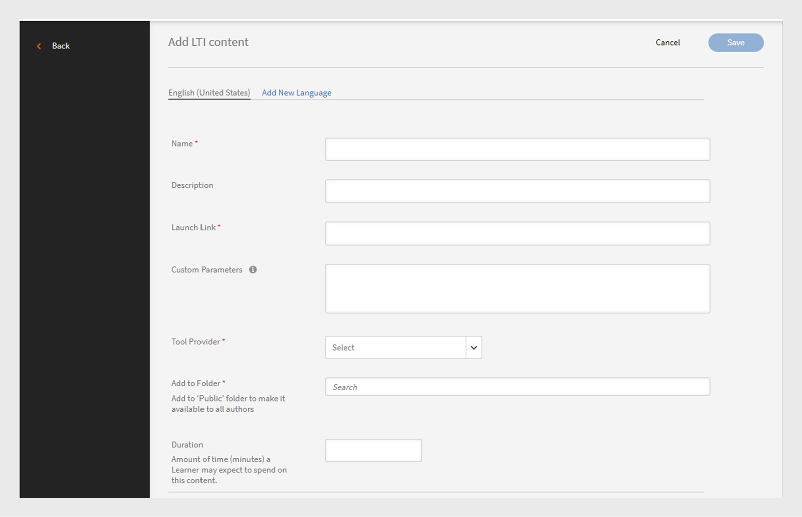

# LTI-integratie

## Wat is LTI?

Interoperabiliteit van leergereedschappen (LTI) is een IMS-standaard voor de integratie van geavanceerde leertoepassingen in onderwijsomgevingen. Gebruikers hebben rechtstreeks vanuit hun LMS toegang tot externe leerinhoud van externe inhoudsproviders zonder zich aan te melden bij of naar een ander LMS te navigeren.

## LTI-integratie met Adobe Learning Manager

Adobe Learning Manager ondersteunt nu LTI versie 1.3, waarmee het kan fungeren als leverancier van gereedschappen en als gebruiker van gereedschappen. Deze functie verbetert de interoperabiliteit tussen Adobe Learning Manager en andere Learning Management Systems (LMS).

**LTI als hulpmiddelleverancier**: LTI als hulpmiddelleverancier staat externe systemen toe om met een LMS te integreren. Adobe Learning Manager fungeert als LTI Tool Provider, waardoor andere LMS-platforms rechtstreeks vanuit hun LMS toegang hebben tot leerobjecten van de Adobe Learning Manager.

**LTI als hulpmiddelconsument**: LTI als de consument van het Hulpmiddel staat LMS toe om externe hulpmiddelen via het LTI (het Leren Interoperability van Hulpmiddelen) te integreren. In dit scenario is LMS een consument van diensten die door externe instrumenten worden geleverd. Adobe Learning Manager fungeert als een LTI Tool Consumer, waardoor het programma leermiddelen van derden kan integreren, zodat Adobe Learning Manager-studenten de leerobjecten van de externe tools in de Adobe Learning Manager kunnen gebruiken.

## LTI-connector instellen in ALM

Ga als volgt te werk om LTI-integratie in Adobe Learning Manager in te schakelen:

1. Login als **[!UICONTROL Admin van de Integratie]**.
2. Op de homepage, uitgezochte **[!UICONTROL Toepassingen]** > **[!UICONTROL Gekenmerkte Apps]**.
3. Selecteer **[!UICONTROL Integraties LTI]** op de **[!UICONTROL pagina van Toepassingen]**.
4. Selecteer **[!UICONTROL laat LTI Integraties]** optie toe en selecteer **[!UICONTROL sparen]**.

_laat Integraties LTI_ toe

>[!NOTE]
>
>U kunt de optie LTI-integraties niet wijzigen of uitschakelen als deze eenmaal is ingeschakeld.

Hierdoor wordt het nieuwe zijpaneel LTI-integraties in het beheerdersaccount gemaakt.

_LTI Sidebar_

Een nieuwe douanerol, **[!UICONTROL LTI Integratie]**, is toegevoegd onder **[!UICONTROL de voorrechten van de Rekening]** in de **[!UICONTROL sectie van de Rol van de Douane]**. Beheerders kunnen deze rol aan gebruikers toewijzen, die hen toegang tot de **[!UICONTROL LTI sectie van de Integratie]** verlenen. Beheerders moeten ook **[!UICONTROL catalogi]** toestemmingen aan deze gebruikers verlenen voor het uitvoeren van de cursussen. Deze setup biedt volledige toegang tot de secties LTI en Catalogi voor het exporteren van cursussen.

_LTI de aangepaste rol van de Integratie_

## Adobe Learning Manager als LTI-provider

Als LTI-provider kunt u in Adobe Learning Manager cursussen uit uw catalogi exporteren als LTI-pakketten die kunnen worden gedeeld met externe LMS-platforms.

### LTI-referenties maken en delen met externe LMS - Admin-workflow

Ga als volgt te werk om de LTI-referenties te delen met externe LMS:

1. Login als **[!UICONTROL Admin]**.
2. Voor de homepage, selecteer **[!UICONTROL Integratie LTI]** > **[!UICONTROL de Configuratie van het Hulpmiddel LTI]**. U kunt de configuratiereferenties op deze pagina zien.
3. De beheerder kan deze referenties delen met een extern LMS voor de registratie van de LTI-site.

   
   _geloofsbrieven van de Configuratie van het Hulpmiddel LTI_

   * **[!UICONTROL Symbolische URL]**: URL waar LMS om een toegangstoken vraagt om voor authentiek te verklaren en communicatie met het hulpmiddel toe te staan LTI.
   * **[!UICONTROL de Verbinding URL van het Doel]**: De bestemmings URL waar de gebruikers wanneer het lanceren van het hulpmiddel LTI van LMS worden opnieuw gericht.
   * **[!UICONTROL Openbare Keyset URL]**: URL die openbare sleutels verstrekt die worden gebruikt om veiligheidstokens voor veilige communicatie te verifiëren.
   * **[!UICONTROL richt URL]** opnieuw: URL waar de gebruikers na het voltooien van een actie op het hulpmiddel worden verzonden LTI, gewoonlijk het opnieuw richten van hen terug naar LMS.

### Externe LMS instellen

De externe LMS-beheerder registreert Adobe Learning Manager en genereert referenties op basis van de referenties die door de Adobe Learning Manager-beheerder worden gedeeld. Deze referenties worden toegevoegd aan de Adobe Learning Manager als laatste stap voor het instellen van Adobe Learning Manager als leverancier van gereedschappen. Hieronder vindt u de externe, door LMS gegenereerde referenties:

* **[!UICONTROL Uitgever of identiteitskaart van het Platform]**: Een unieke herkenningsteken voor LMS of het platform dat het LTI lanceringsverzoek naar de hulpmiddelleverancier verzendt.
* **[!UICONTROL identiteitskaart van de Cliënt]**: Een uniek herkenningsteken dat aan het hulpmiddel LTI door LMS voor vergunningsdoeleinden wordt toegewezen.
* **[!UICONTROL identiteitskaart van de Plaatsing]**: Een herkenningsteken dat een specifieke LTI hulpmiddelplaatsing aan LMS voor het beheren van veelvoudige instanties verbindt.
* **[!UICONTROL Symbolische URL]**: Het eindpunt waar LMS om een toegangstoken vraagt om interactie met het hulpmiddel voor authentiek te verklaren en toe te staan LTI.
* **[!UICONTROL authentificatie URL]**: URL waar LMS gebruikers voor het voor authentiek verklaren en het in werking stellen van de verbinding LTI verzendt.
* **[!UICONTROL Openbare Zeer belangrijke URL]**: URL die de openbare sleutel verstrekt die door het hulpmiddel LTI wordt gebruikt om veiligheidstokens te verifiëren en veilige communicatie te verzekeren.

### Adobe Learning Manager toevoegen als een toolprovider - Admin-workflow

Ga als volgt te werk om Adobe Learning Manager toe te voegen als een toolprovider:

1. Login als **[!UICONTROL Admin]**.
2. Voor de homepage, selecteer **[!UICONTROL Integraties LTI]** > **[!UICONTROL Platforms LTI]**.
3. Selecteer **[!UICONTROL voeg]** toe en ga de geloofsbrieven in die door externe LMS worden gedeeld.

   
   _voeg een nieuw Platform LTI_ toe

4. Zodra al deze waarden worden toegevoegd, uitgezochte **[!UICONTROL bevestigt]** en **[!UICONTROL voeg]** toe.

### LTI-pakket exporteren - beheerworkflow

Met LTI-tools kunt u trainingen uit uw catalogi exporteren als een downloadbaar pakket leerinhoud dat kan worden gedeeld met externe LMS (Learning Management Systems) of met platforms met behulp van de LTI-standaard (Learning Tools Interoperability).

Ga als volgt te werk om de cursus te exporteren uit Adobe Learning Manager:

1. Login als **[!UICONTROL Admin]**.
2. Voor de homepage, uitgezochte **[!UICONTROL Integraties LTI]** > **[!UICONTROL Uitvoer van het Pakket LTI]**.
3. Selecteer **[!UICONTROL Nieuwe pakketuitvoer]**.

   
   _het pakket van LTI van de Uitvoer_

4. Selecteer de gewenste catalogus in de lijst. U kunt de lijst met beschikbare cursussen in de catalogus zien.
5. Selecteer de vereiste cursussen en selecteer **[!UICONTROL Uitvoer als LTI]**.
6. Selecteer de cursus om de startkoppeling weer te geven.
7. Selecteer het **[!UICONTROL pictogram van de Verbinding van de Download]** om het pakket te downloaden. Het pakket is een zip-bestand met de IMSCC-bestanden die correct zijn geëxporteerd.

Met deze startkoppeling of dit IMSCC-bestand kunt u de Adobe Learning Manager-cursussen exporteren naar het externe LMS. Studenten kunnen de Adobe Learning Manager-cursussen vanuit hun LMS volgen.

>[!NOTE]
>
>Als een beheerder een cursus bewerkt of de modules bijwerkt na het maken van de startkoppeling, wordt de koppeling automatisch bijgewerkt. Als een beheerder echter een cursus archiveert nadat de startkoppeling is gemaakt, kan de gearchiveerde cursus niet worden gestart in de LTI-consument.

## Adobe Learning Manager als LTI-consument - Admin-workflow

Als consument LTI, staat Adobe Learning Manager u toe om activiteit, hulpmiddelen, inhoud, en widgets van externe leveranciers LTI te gebruiken.
Om Adobe Learning Manager als consument LTI toe te voegen, hebt u de volgende geloofsbrieven van de externe leverancier LTI nodig:

* Aanmeldings-URL initiëren
* URL doelkoppeling
* Doorverwijzings-URL 
* Type openbare sleutel

Ga als volgt te werk om Adobe Learning Manager toe te voegen als een LTI-consument:

1. Login als **[!UICONTROL Admin]**.
2. Voor de homepage, selecteer **[!UICONTROL Integraties LTI]** > **[!UICONTROL LTI de Registratie van het Hulpmiddel]**.
3. Selecteer **[!UICONTROL toevoegen]** > **[!UICONTROL Nieuw Hulpmiddel LTI]**.

   >[!NOTE]
   >
   >U kunt meerdere LTI-gereedschappen importeren door een CSV-bestand te uploaden.

4. Voer de bovenstaande gegevens in van de LTI-provider.

   
   _voeg een nieuw hulpmiddel LTI toe_

5. Zodra gedaan, selecteer **[!UICONTROL Valideer]** en **[!UICONTROL voeg]** toe.
6. U kunt het volgende scherm zien:

   
   _geloofsbrieven van de Registratie_

7. Deel deze geloofsbrieven met de leverancier LTI voor registratie. Als de registratie is voltooid, kunt u de startkoppeling of het IMSCC-bestand van de LTI-provider ophalen om de cursussen te importeren.

### LTI-inhoud maken - Auteursworkflow

De LTI-providers voorzien u van een startkoppeling of een IMSCC-bestand om hun cursussen aan Adobe Learning Manager toe te voegen. Ga als volgt te werk om cursussen uit een extern LMS toe te voegen:

1. Login als **[!UICONTROL Auteur]**.
2. Selecteer **[!UICONTROL Bibliotheek van de Inhoud]** > **[!UICONTROL voeg]** toe > **[!UICONTROL Module LTI]**.

   
   _voeg LTI Inhoud toe - Auteur_

3. Typ de **[!UICONTROL Naam]** en **[!UICONTROL Beschrijving]**.
4. Typ de **[!UICONTROL Verbinding van de Lancering]** en **[!UICONTROL Parameters van de Douane]** van de leverancier LTI.
5. Selecteer uw [!UICONTROL &#x200B; leverancier LTI &#x200B;] van het **[!UICONTROL drop-down menu van de Leverancier van het Hulpmiddel]**.
6. Onderzoek en selecteer **[!UICONTROL Openbaar]** in **[!UICONTROL toevoegen aan de optie van de Omslag]**. Hiermee stelt u de cursussen beschikbaar voor alle auteurs.
7. Selecteer **[!UICONTROL sparen]**.
Nadat de inhoud is gemaakt, kunt u deze inhoud toevoegen wanneer u de cursus maakt.

### Cursus met LTI-inhoud maken - Auteursworkflow

Ga als volgt te werk om een cursus met LTI-inhoud te maken:

1. Login als **[!UICONTROL Auteur]**.
2. Voor de homepage, uitgezochte **[!UICONTROL Cursussen]** > **[!UICONTROL voeg]** toe.
3. Typ de **[!UICONTROL Naam]** en **[!UICONTROL Beschrijving]** van de cursus.
4. In de **[!UICONTROL optie van Modules]**, uitgezochte **[!UICONTROL Modules]** > **[!UICONTROL Zelf Geplaatste Module]** toevoegen.
5. Selecteer de **[!UICONTROL Inhoud LTI]** u creeerde en selecteer **[!UICONTROL sparen]**.
6. Ga de vereiste details zoals **[!UICONTROL Vaardigheden]** in, **[!UICONTROL Auteurs]**, en **[!UICONTROL Type van Inschrijving]**.
7. Publiceer de cursus nadat u klaar bent. Adobe Learning Manager-studenten kunnen de LTI-cursussen van de externe LTI-provider volgen.

## LTI-exportscenario&#39;s

De volgende typen cursussen kunnen niet als LTI-cursussen worden geëxporteerd:

* **Cursus met de Module van de Activiteit**: Cursussen die specifieke op activiteit-gebaseerde modules bevatten.
* **Cursus met veelvoudige leveringstype**: De cursussen met veelvoudige leveringstype omvatten zelf-afgepaste module, virtuele of klaslokaalmodule, activiteitenmodule en gemengd leren.
* **Cursus met Voorwaarden**: Cursussen die pre-voltooiing vereisen.
* **Cursus met veelvoudige inschrijving**: Cursussen die veelvoudige inschrijving bevatten
* **Cursussen met Veelvoudige Instanties**: Cursussen die veelvoudige leveringsinstanties aanbieden.

| Standaardinstantie | Een of meer niet-standaardinstanties | Verwacht | Foutberichten |
|---|---|---|---|
| Actief | Geen | Badge als | Geen |
| Actief | Actief | Niet exporteren | Meerdere instanties |
| Actief | Gearchiveerd | Niet exporteren | Meerdere instanties |
| Actief | Verwijderd | Badge als | Geen |
| Gearchiveerd | Geen | Niet exporteren | Retire Def Instance |
| Gearchiveerd | Actief | Niet exporteren | Retire Def-instantie, meerdere instanties |
| Gearchiveerd | Gearchiveerd | Niet exporteren | Retire Def-instantie, meerdere instanties |
| Gearchiveerd | Verwijderen | Niet exporteren | Retire Def Instance |

* **Cursussen met Veelvoudig vraag-Antwoord**: Cursussen met toegelaten MQA.
* **Cursus met Ingeschakelde Instantie**: Cursussen die studenten toestaan te schakelen tussen instanties.
* **Betaalde Cursus**: Cursussen die betaling voor inschrijving vereisen.
* **het Deel van Cursussen van het Leren Weg, Certificatie, of het Leren Plan**: Het gedeelte van cursussen van het leren wegen of plannen.
* **Cursussen niet van zelf-ingeschreven Type**: Cursussen beperkt van student zelf-inschrijving.
* **Klaslokaal of Virtuele Cursussen van de Klas**: Cursussen met klaslokaal of virtuele klaslokaalzittingen.
* **Cursussen met niet-Verplicht Modules**: Cursussen die facultatieve of niet-verplichte modules bevatten.

_de status van de Uitvoer_

## Beperkingen voor LTI

Het volgende is beperkingen LTI voor zowel consument als leverancier LTI:

* Overvloeiingscursussen kunnen exporteren die van invloed zijn op de ervaring van de studenten met het gebruik van cursussen.
* De mogelijkheid om cursussen op eigen tempo te exporteren met klassikale, virtuele klassikale of activiteitsmodules, wat van invloed is op de cursuservaring van studenten.
* Kan gedeelde cursussen zoals LinkedIn Learning en Go1-cursussen exporteren.
* De mogelijkheid om cursussen met eerdere inschrijvingsdatums in ALM te starten, wat invloed heeft op de toegang tot en ervaring van studenten.
* Studenten kunnen geen LTI-cursussen volgen in de mobiele iOS ALM-app, wat van invloed is op de ervaring van het cursusverbruik.
* Studenten kunnen in de mobiele ALM-app geen LTI-cursussen offline downloaden en openen, omdat deze cursussen door externe platforms worden aangeboden.
* Beheerders kunnen alleen ingeschakelde catalogi weergeven en kunnen uitgeschakelde catalogi niet zien.
* ALM kent beperkingen op naam (63 tekens) en lengte van e-mail (64 tekens), waardoor externe LTI-studenten die deze limiet overschrijden geen toegang hebben.
* Synchronisatie van cursusvoltooiing of vertragingen bij het synchroniseren van de kwaliteit worden veroorzaakt door het LTI-systeem van derden.
* Cursussynchronisatieberichten worden niet weergegeven voor teams die LTI-cursussen volgen via de app of browser Teams, wat gevolgen heeft voor meldingen van studenten.
* Gebruikersgegevensrapporten kunnen geen gegevens exporteren voor gebruikers die zijn geregistreerd via LTI.
* Namen van gereedschapsleveranciers worden niet automatisch herkend wanneer auteurs starlinks toevoegen aan de gebruiker van de tool, waardoor handmatige selectie vereist is.
* Bulkuploads via CSV vereisen UTF-8-codering voor tekens met accent om importfouten te voorkomen.
* LTI-accountbeheerders kunnen geen cursussen, leerpaden of certificeringen delen die LTI-modules bevatten.
* Kan cijfers niet opnieuw synchroniseren wanneer gebruikers de speler opnieuw openen voor voltooide ALM-cursussen. Dit beïnvloedt de score-updates van studenten en vereist een handmatige retrigger.
* Met ALM kunnen alleen actieve gebruikers en proefgebruikers de LTI-cursussen volgen.
* Gradensynchronisatie ingeschakeld in Module voorkomt dat de ALM-speler wordt gestart, wat invloed heeft op de toegang tot en ervaring met de cursus van de studenten.
* Het actieve LTI-veld is één waarde en ondersteunt geen meerdere waarden.
* Er zijn geen redenen voor een fout beschikbaar als het exporteren mislukt tijdens de migratie van cursussen zonder kerninhoud.
* Externe cijfers voor LTI-cursussen worden niet weergegeven in het Studenttranscript en scores zijn niet zichtbaar op de L2 Quiz-pagina, wat van invloed is op de prestaties van de studenten.

## Problemen met LTI-lancering

Hieronder volgen de cursussen die de externe LTI-speler niet kan starten als gevolg van recente wijzigingen die in ALM zijn aangebracht nadat de starlinks zijn gemaakt:

* Cursussen waarop het exemplaar is gearchiveerd.
* Gearchiveerde cursussen zonder inschrijvingen in ALM.
* Cursussen met inschrijvingen in ALM maar met pensioen.
* Cursussen die zijn verwijderd in ALM.
* Cursussen waarvoor de inschrijvingslimiet is bereikt.

## Best practice

Het wordt aanbevolen een catalogus te maken met cursussen die LTI ondersteunen om problemen met exporteren te voorkomen en het exporteren van de cursussen te vereenvoudigen.

LTI-catalogus met succesvolle exportstatus
