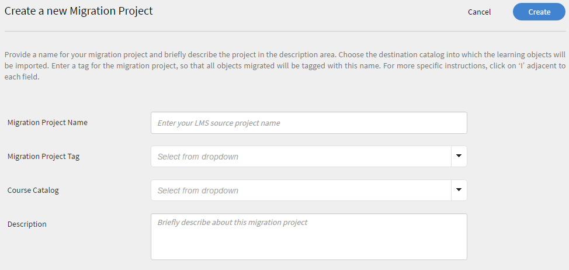
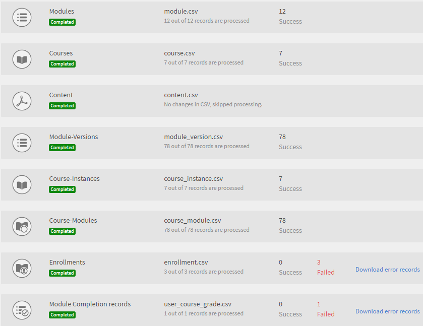

# Migratiehandleiding

Referentiehandleiding voor integratiebeheerders die een bestaand LMS naar Learning Manager LMS willen migreren

<!-- ## Overview {#overview} -->

## Gebruiksscenario {#usagescenario}

Over het algemeen hebben grote ondernemingen hun eigen interne LMS of oudere Learning Management Systems van een andere leverancier. LMS bestaat uit uw trainingsinhoud en trainingsgegevens voor ondernemingen. Als onderneming kunt u bij de aanschaf van de Learning Manager uw bestaande LMS-inhoud en -gegevens verplaatsen naar Learning Manager, zodat u de voordelen van een modern en intuïtief LMS kunt benutten zonder dat u de oude gegevens van uw organisatie kwijtraakt.

Learning Manager biedt de tools en specificaties waarmee de integratiebeheerder van uw organisatie de migratietaken kan opzetten en uitvoeren.

De beheerders van een organisatie kunnen vanaf nu toegang krijgen tot de migratiefunctie in Learning Manager door contact op te nemen met het ondersteuningsteam van Adobe. U kunt contact opnemen met het ondersteuningsteam van de Adobe Learning Manager om de migratiefunctie voor uw account in te schakelen.

## Migratieproces {#apidescription}

De vereisten voor migratie, de belangrijkste stappen die bij het migratieproces betrokken zijn, migratiesprint, specificaties, gegevens- en contentmigratiestappen worden in deze sectie als volgt uitgelegd:

### Vereisten {#prerequisites}

Het Learning Manager-team verwacht dat de volgende taken door de integratiebeheerders van uw organisatie worden uitgevoerd voordat het migratieproces wordt uitgevoerd:

* De integratiebeheerder haalt gegevens en inhoud uit het bestaande LMS op en zet de gegevens in de bestandsindelingen die door Learning Manager zijn gedefinieerd.
* Learning Manager biedt geen ondersteuning voor het importeren van gebruikers als onderdeel van het migratieproces en verwacht dat de organisatie gebruikers via connectoren importeert. Adobe Systems verwacht dat deze connectoren vóór de migratie geconfigureerd worden. Raadpleeg [Help voor Learning Manager-connectoren](connectors.md) voor meer informatie.

Learning Manager beveelt beheerders aan het migratieproces uit te proberen in een proefaccount voordat ze de gegevens en inhoud naar de Learning Manager-productieomgeving migreren.

### Belangrijkste stappen van het migratieproces {#keystepsofmigrationprocess}

De belangrijkste stappen voor het migreren van inhoud en gegevens van een bestaand LMS naar Learning Manager zijn als volgt:

1. De integratiebeheerder of partner evalueert de bestaande LMS-gegevens en -inhoud die gemigreerd moeten worden.
1. De integratiebeheerder evalueert de tools en specificaties van Learning Manager voor het opnemen van gegevens en inhoud.
1. De integratiebeheerder schrijft code of verricht handmatig werk om de trainingsgegevens en -inhoud van het oudere LMS te exporteren op basis van de functionaliteit van het oudere LMS.
1. Zodra de trainingsgegevens en -inhoud beschikbaar zijn, analyseert de integratiebeheerder de gegevens en inhoud en wijst hij/zij deze toe in overeenstemming met de migratiespecificaties van Learning Manager.
1. De integratiebeheerder gebruikt de tools van Learning Manager om in de volgende volgorde te migreren:

   1. Overdracht van de studenten naar Learning Manager
   1. Trainingsinhoud overbrengen naar Learning Manager en
   1. Tot slot, overdracht van trainingsgegevens naar Learning Manager.

De organisatie kan Learning Manager LMS nu samen met de oudere inhoud gaan gebruiken.

### Omvang van migratieobjecten {#scopeofmigrationobjects}

U kunt inhoud alleen voor de volgende leerobjecten migreren:

* Module
* Badges
* Cursus
* Moduleversie
* Cursusinstantie
* Cursusmodule
* Vaardigheden
* Vaardigheidsniveau
* Vaardigheid cursus
* Certificering
* Certificering cursus
* Vastlegging certificering
* Leerprogramma
* Leerprogramma cursus
* Leerprogramma instantie
* Leerprogramma cursusinstantie
* Taakhulp
* Versie taakhulp
* Taakhulp cursus
* Taakhulp vaardigheden
* Inschrijving
* Inschrijving voor certificering
* Inschrijving voor leerprogramma
* Inschrijving voor de taakhulp
* Curcuscijfers van gebruiker

### Kernbegrippen van migratie {#keyconceptsofmigration}

Een aantal van de belangrijkste concepten van het Leerbeheermigratieproces wordt kort uitgelegd ter referentie:

**Migratieproject**

In Learning Manager bestaat een migratieproject uit een of meer sprints. U kunt ook meerdere migratieprojecten voor uw account hebben. Het migratieproces in Learning Manager begint met het maken van een migratieproject.

**Sprint**

In het Learning Manager-migratieproces definieert een sprint een set geselecteerde migratie-items die u uit het bestaande LMS wilt migreren. Een migratie-item kan een cursusmodule, studentrecord of een set cursussen zijn. Een sprint kan meerdere leergegevensitems omvatten. U kunt in elke sprint migratietaken uitvoeren.

**Sprint runs**

Sprint run is het proces waarmee een sprintmigratieopdracht wordt gestart. U kunt de sprintrun op elk punt in de run stoppen.

**Sprint re-runs**

U kunt een migratiesprint na voltooiing op elk moment opnieuw uitvoeren. Deze situatie doet zich voor wanneer u de gegevens in een sprintitem wilt wijzigen om deze opnieuw naar de toepassing te migreren of om de fouten in CSV&#39;s te corrigeren.

**CSV-specificatie**

Learning Manager biedt u een set [standaard CSV-specificaties](migration-manual.md#main-pars_header_140933605). Het beste is om deze CSV-specificaties door te nemen voordat u het migratieproces start. De integratiebeheerder van uw organisatie kan de bestaande gegevensindelingen analyseren en toewijzen, zodat deze overeenkomen met de door de Learning Manager verschafte CSV-sjabloonitems.

**Tags voor migratieprojecten**

Adobe Systems raadt u aan een reeks trefwoorden te gebruiken als tags om uw migratieprojecten eenvoudig te identificeren binnen de Learning Manager-toepassing. Met behulp van deze tags kunt u uw projecten intern identificeren in de Learning Manager-toepassing.

**Inhoudloze module**

Met Learning Manager kunt u een module zonder inhoud uploaden. Adobe Systems beschouwt het als een inhoudloze module in Learning Manager. In een scenario waarin u een deel van de oude gegevens uit uw bestaande LMS wilt migreren zonder dat er inhoud nodig is, kunt u het bestand module_version.csv zonder URL-verwijzing uploaden.

## CSV-specificaties en voorbeeld-CSV&#39;s {#csv}

Hieronder staan de standaard CSV-specificaties die u aan uw bestaande LMS-migratiegegevens kunt toewijzen. Klik op csv-specifications en sample-csvs om ZIP-bestanden te downloaden. Het gedownloade csv-specifications.zip bevat zeven Excel-bladbestanden. Deze Excel-bladbestanden zijn specificaties met beschrijvingen die u laten zien hoe u de CSV-bestanden invult. De overeenkomstige CSV-bestanden moeten de gegevens voor elk veld bevatten in de voorgeschreven indeling, zoals uitgelegd in deze XLSX-bestanden.

<table border="1" cellspacing="0" cellpadding="0" width="100%">
 <tbody>
  <tr>
   <th>
    <p><b>Dianr.</b></p></th>
   <th>
    <p><b>Bestandsnaam</b></p></th>
   <th>
    <p><b>Beschrijving van de inhoud</b></p></th>
   <th>
    <p>Opmerkingen</p></th>
  </tr>
  <tr>
   <td>
    <p>1</p></td>
   <td>
    <p>module.xlsx</p></td>
   <td>
    <p>Metagegevens voor module.csv</p></td>
   <td> </td>
  </tr>
  <tr>
   <td>
    <p>2</p></td>
   <td>
    <p>badge.xlsx</p></td>
   <td>
    <p>Metagegevens voor badge.xlsx</p></td>
   <td> </td>
  </tr>
  <tr>
   <td>
    <p>3</p></td>
   <td>
    <p>course.xlsx</p></td>
   <td>
    <p>Metagegevens voor course.csv</p></td>
   <td>
    <p>Vermeld één auteursnaam voor een cursus, omdat meerdere auteursnamen na migratie soms niet goed worden weergegeven in de toepassing. </p></td>
  </tr>
  <tr>
   <td>
    <p>4</p></td>
   <td>
    <p>module_version.xlsx </p></td>
   <td>
    <p>Metagegevens voor module_version.csv</p></td>
   <td>
    <p>Zorg ervoor dat u het URL-pad van de Box-accountmap opgeeft waarnaar u de inhoud hebt geüpload. </p></td>
  </tr>
  <tr>
   <td>
    <p>5</p></td>
   <td>
    <p>course_instance.xlsx</p></td>
   <td>
    <p>Metagegevens voor course_instance.csv </p></td>
   <td> </td>
  </tr>
  <tr>
   <td>
    <p>6</p></td>
   <td>
    <p>session.xlsx</p></td>
   <td>
    <p>Metagegevens voor session.csv</p></td>
   <td>
    <p>Zorg dat elke vermelding in session.csv is gekoppeld aan ten minste één module voor het klaslokaal/virtuele klaslokaal</p></td>
  </tr>
  <tr>
   <td>
    <p>7</p></td>
   <td>
    <p>course_module.xlsx</p></td>
   <td>
    <p>Metagegevens voor course_module.csv</p></td>
   <td> </td>
  </tr>
  <tr>
   <td>
    <p>8</p></td>
   <td>
    <p>skill.xlsx</p></td>
   <td>
    <p>Metagegevens voor skill.csv</p></td>
   <td> </td>
  </tr>
  <tr>
   <td>
    <p>9</p></td>
   <td>
    <p>skill_level.xlsx</p></td>
   <td>
    <p>Metagegevens voor skill_level.csv</p></td>
   <td> </td>
  </tr>
  <tr>
   <td>
    <p>10</p></td>
   <td>
    <p>skill_course.xlsx</p></td>
   <td>
    <p>Metagegevens voor skill_course.csv</p></td>
   <td> </td>
  </tr>
  <tr>
   <td>
    <p>11</p></td>
   <td>
    <p>certification.xlsx</p></td>
   <td>
    <p>Metagegevens voor Certification.csv</p></td>
   <td> </td>
  </tr>
  <tr>
   <td>
    <p>12</p></td>
   <td>
    <p>certification_course.xlsx</p></td>
   <td>
    <p>Metagegevens voor certification_course.csv</p></td>
   <td> </td>
  </tr>
  <tr>
   <td>
    <p>13</p></td>
   <td>
    <p>certification_commit.xlsx</p></td>
   <td>
    <p>Metagegevens voor certification_commit.csv</p></td>
   <td> </td>
  </tr>
  <tr>
   <td>
    <p>14</p></td>
   <td>
    <p>learning_program.xlsx</p></td>
   <td>
    <p>Metagegevens voor learning_program.csv</p></td>
   <td> </td>
  </tr>
  <tr>
   <td>
    <p>15</p></td>
   <td>
    <p>learning_program_course.xls </p></td>
   <td>
    <p>Metagegevens voor learning_program_course.csv </p></td>
   <td> </td>
  </tr>
  <tr>
   <td>
    <p>16</p></td>
   <td>
    <p>learning_program_instance.xlsx </p></td>
   <td>
    <p>Metagegevens voor learning_program_instance.csv</p></td>
   <td> </td>
  </tr>
  <tr>
   <td>
    <p>17</p></td>
   <td>
    <p>learning_program_instance_course_instance.xlsx </p></td>
   <td>
    <p>Metagegevens voor learning_program_instance_course_instance.csv</p></td>
   <td> </td>
  </tr>
  <tr>
   <td>
    <p>18</p></td>
   <td>
    <p>job_aid.xlsx</p></td>
   <td>
    <p>Metagegevens voor job_aid.csv</p></td>
   <td>
    <p>Elke gemigreerde job_aid vereist een of meer job_aid-versies.</p></td>
  </tr>
  <tr>
   <td>
    <p>19</p></td>
   <td>
    <p>Job_aid_version.xlsx</p></td>
   <td>
    <p>Metagegevens voor job_aid_version.csv</p></td>
   <td> </td>
  </tr>
  <tr>
   <td>
    <p>20</p></td>
   <td>
    <p>job_aid_course.xlsx</p></td>
   <td>
    <p>Metagegevens voor job_aid_course.csv</p></td>
   <td> </td>
  </tr>
  <tr>
   <td>
    <p>21</p></td>
   <td>
    <p>job_aid_skills.xlsx</p></td>
   <td>
    <p>Metagegevens voor job_aid_skills.csv</p></td>
   <td> </td>
  </tr>
  <tr>
   <td>
    <p>22</p></td>
   <td>
    <p>enrollments.xlsx</p></td>
   <td>
    <p>Metagegevens voor enrollments.csv</p></td>
   <td> </td>
  </tr>
  <tr>
   <td>
    <p>23</p></td>
   <td>
    <p>certification_enrollement.xlsx</p></td>
   <td>
    <p>Metagegevens voor certification_enrollement.csv</p></td>
   <td> </td>
  </tr>
  <tr>
   <td>
    <p>24</p></td>
   <td>
    <p>learning_program_enrollment.xlsx</p></td>
   <td>
    <p>Metagegevens voor learning_program_enrollment.csv<br><br></p></td>
   <td> </td>
  </tr>
  <tr>
   <td>
    <p>25</p></td>
   <td>
    <p>job_aid_enrollment.xlsx</p></td>
   <td>
    <p>Metagegevens voor job_aid_enrollment.csv</p></td>
   <td> </td>
  </tr>
  <tr>
   <td>
    <p>26</p></td>
   <td>
    <p>user_course_grade.xlsx</p></td>
   <td>
    <p><br>
      Metagegevens voor user_course_course_grade.csv</p></td>
   <td>
    <p>Verstrek de vereiste gegevens van studentrecords in het CSV-bestand, ook al zijn ze niet verplicht. Zonder deze informatie kan het zijn dat de toepassing Learning Manager geen gegevens weergeeft, zelfs als het CSV-bestand voor migratie wordt verwerkt. sample-csvs.zip file bevat zeven CSV-bestanden met dezelfde naamgevingsconventie als hierboven.</p></td>
  </tr>
  <tr>
   <td>
    <p>27</p></td>
   <td>
    <p>user_skill.xlsx</p></td>
   <td>
    <p><br>
      Metagegevens voor user_skill.csv</p></td>
   <td>
    <p> </p></td>
  </tr>
 </tbody>
</table>

Learning Manager ondersteunt alleen datum- en tijdwaarden in UTF-8- en 32-bits indeling. Er kunnen fouten optreden tijdens de migratie als u de datum vermeldt in CSV-bestanden met een datum die buiten het bereik valt (2038-07-17T08):53:21.000Z of 1980-04-17T08:13:25,322Z.

* [sample-csvs.zip](assets/sample-csvs.zip)
* [csv_specifications.zip](assets/csv-specifications.zip)

U moet rekening houden met de volgende afhankelijkheden van CSV-bestanden tijdens het importeren:

* module_version.csv is afhankelijk van module.csv
* course_instance.csv is afhankelijk van course.csv
* course_module.csv is afhankelijk van course.csv, module.csv en module_version.csv
* course_instance.csv is afhankelijk van course.csv
* session.csv is afhankelijk van course.csv en module.csv
* enrollment.csv is afhankelijk van course.csv
* user_course_grade.csv is afhankelijk van course.csv en module.csv
* skill_course.csv is afhankelijk van course.csv
* skill_level.csv is afhankelijk van skill.csv
* learning_program_instance.csv is afhankelijk van learning_program en learning_program_course.csv
* learning_program_course.csv is afhankelijk van learning_program.csv
* learning_program_enrollment.csv is afhankelijk van learning_program en learning_program_instance.csv
* learning_program_instance_course_instance.csv is afhankelijk van learning_program.csv, learning_program_instance.csv en course_instance.csv
* certification_course.csv is afhankelijk van certification.csv en course.csv
* certification_commit.csv is afhankelijk van certification.csv en certification_course.csv
* certification_enrollment.csv is afhankelijk van certification.csv, certification_course.csv en certification_enrollment.csv

## Migratieprocedure {#migrationprocedure}

Voordat u begint met de migratieprocedure, is het belangrijk om de volgende punten in acht te nemen:

* Er kan altijd maar één migratieproject tegelijk actief zijn in een account. Binnen een project kan er altijd maar één sprint tegelijk actief zijn.
* U kunt een run die al in het migratieproces is, niet ongedaan maken. U kunt echter de bestaande verwijderingsoptie in elke functie van Learning Manager gebruiken om migratie van gegevens of inhoud ongedaan te maken.
* Zodra het migratieproject van start gaat, krijgt het de status &#39;Onder migratie&#39;. Tijdens de migratie kunnen alleen personen met de rol van integratiebeheerder bij Learning Manager inloggen.

### FTP- en Box-accounts maken {#creatingftpandboxaccounts}

Het is zeer belangrijk dat u uw migratieproject plant. Het is raadzaam om projecten in meerdere sprints op te splitsen en duidelijk aan te geven wat u in elke sprint wilt migreren. Het kan zelfs een goed idee zijn om na elke sprint steekproefgewijs te controleren of de gegevens in die sprint goed zijn gemigreerd, in plaats van alles aan het eind van het project te controleren. Voordat u de sprint als onderdeel van uw migratieproject start, moet u gegevens en inhoud van CSV-bestanden uploaden naar respectievelijk FTP- en Box-servers. Als u geen accounts hebt voor Aangepaste FTP en Box, kunt u deze maken.

<!--**Create FTP account**-->

<!--Click **[!UICONTROL Request for CSV FTP folder]**. A pop-up dialog appears prompting you to enter your e-mail id. Go through online instructions and create an FTP account. As soon as you create your account, you can view your migration project and sprint project folders in FTP. 

A sample snapshot of project files and folder of FTP is shown below for your reference. -->

<!---->

**Een Box-account maken**

Maak een map voor het uploaden van inhoud op dezelfde manier als u de FTP-map hebt gemaakt. Klik op Migratie in het linkerdeelvenster en klik op Map voor uploaden van inhoud aanvragen onderaan de geopende pagina.

U ontvangt dan een e-mail van Box met een link naar de gedeelde map. Hebt u geen Box-account, klik dan op Sign up en maak een account. Er worden aanmeldingsinstructies verzonden naar de e-mail-ID van de integratiebeheerder.

**Gegevens uploaden (CSV-bestanden) naar FTP-mappen of Box-mappen**

U moet een FTP- of Box-account maken voordat u een migratieproject maakt. Op dit moment kunt u dus een migratieproject en sprint maken in de toepassing Learning Manager.  Raadpleeg **Migratieprocedure voor gegevens en inhoud** op deze pagina om een migratieproject te maken.

Klik in uw FTP- of Box-account op de naam van uw projectmap en klik op de sprintnaam. U kunt de CSV-gegevensbestanden die u naar de sprintmap wilt migreren, uploaden. Als u wilt uploaden, klikt u op de knop Bestanden uploaden bovenaan in de FTP- of Box-server en zet u de CSV-bestanden neer. Hieronder ziet u ter referentie een voorbeeldmomentopname na het uploaden naar FTP.

<!---->

U kunt terugkeren naar het migratieproject van Learning Manager door op **[!UICONTROL Vernieuwen]** en bekijk alle CSV-gegevenstypen die in uw migratiesprint worden vermeld.

**Trainingsinhoud naar inhoudsmappen uploaden**

Upload de trainingsinhoud van uw bestaande LMS naar uw Box-account. Als u het migratieproject en de sprint al hebt gemaakt, vult het Box-account het migratieproject en de sprintnaam in. U kunt de inhoud in hetzelfde pad uploaden. Raadpleeg **Migratieprocedure voor gegevens en inhoud** op deze pagina om een migratieproject te maken.

U kunt de inhoudsbestanden slepen en neerzetten of op **[!UICONTROL Uploaden]** klikken en de bestanden van uw bureaublad selecteren. Als u een bijzonder groot bestand hebt, kan het uploaden langer duren. Afhankelijk van de grootte van het bestand varieert de tijd die nodig is om de bestanden naar uw Box-account te uploaden.

Hieronder ziet u ter referentie een voorbeeld van een Box-account na het uploaden van inhoud naar dit account:


*Bestanden in Box-account*

Nadat de bestanden naar uw Box-account zijn geüpload, moet u ervoor zorgen dat u het relatieve pad van dit Box-inhoudsbestand in het bestand module_version.csv vermeldt. Dit is een verplichte stap. U moet het pad van de module-inhoud aangeven.

Hebt u zich bij de FTP- en Box-servers aangemeld en de inhoud geüpload, dan verschijnen de CSV-locaties zoals hieronder weergegeven in Learning Manager.


*CSV-locaties in Box-account*

## Migratieprocedure voor gegevens en inhoud {#dataandcontentmigrationprocedure}

De procedure voor het migreren van LMS-gegevens en -inhoud van uw onderneming naar Learning Manager wordt als volgt uitgelegd:

Doorloop de vereisten van het migratieproces voordat u de migratie start. Raadpleeg [CSV-specificaties en voorbeeld-CSV&#39;s](migration-manual.md#main-pars_header_140933605) op deze pagina en maak de CSV&#39;s klaar voor de migratie van gegevens en inhoud.

1. Meld u als integratiebeheerder aan bij de toepassing Learning Manager en klik op **[!UICONTROL Migratie]** in het linkerdeelvenster.

   De startpagina voor migratieprojecten verschijnt. Als uw organisatie al migratieprojecten heeft gemaakt, ziet u hier de lijst van alle migratieprojecten.

1. Klik op **[!UICONTROL Nieuw]** in de rechterbovenhoek van de pagina om een migratieproject te maken. U kunt ook op de link **[!UICONTROL Migratieproject maken]** om dit te doen. De pagina Een migratieproject maken wordt weergegeven.

   Als u nog geen FTP-map hebt gemaakt, wordt u gevraagd om een FTP-map in het account te maken. Dit is een verplichte stap voordat u een migratieproject maakt.

   
   *FTP-map maken*

   Geef de projectnaam, projecttag, cursuscatalogus en beschrijving voor uw migratieproject op. Klik op **[!UICONTROL Maken]**.

   Uw migratiegegevens worden geïdentificeerd met behulp van deze tag voor migratieprojecten. Als u geen specifieke cursuscatalogus hebt, kiest u de standaardcatalogus in de vervolgkeuzelijst. Alle cursussen die u via een migratieproject migreert, worden opgenomen in de catalogus die u hier kiest. Als u geen catalogus kiest, behoren alle gemigreerde cursussen tot de standaardcatalogus.

1. De pagina voor sprintconfiguratie verschijnt zoals hieronder weergegeven. U moet een sprint maken als onderdeel van uw migratieproject. Kies de sprintnaam en geef een korte beschrijving van de sprint. U kunt Ja kiezen als u inhoud als onderdeel van deze sprint wilt migreren. Klikken **[!UICONTROL Volgende]**.

   
   *Sprint-migratie*

   Selectievakje met titel selecteren **Gebruikers zijn toegevoegd of gewijzigd sinds de laatste uitvoering** om de lijst met gebruikers te synchroniseren met de toepassing Leermanager. Als u de inhoud en gegevens naar de Learning Manager-toepassing migreert, is dit misschien niet nodig. Maar als er tijd is verstreken tussen uw eerdere sprintmigratie en de laatste sprintmigratie, is het het beste om de gebruikerslijst te synchroniseren. Met deze stap kan de database van de Learning Manager synchroon zijn met uw LMS-gebruikers.

   Deze synchronisatiestap wordt aanbevolen wanneer enrollment.csv en user_course_course_grade.csv worden gemigreerd. Deze stap zorgt ervoor dat de Learning Manager-database gesynchroniseerd is met uw migratiedatabase en dat alle gebruikers van wie de gegevens in de sprint gemigreerd moeten worden, beschikbaar zijn in de migratiedatabase.

1. U kunt de sprintmigratie starten met uw geüploade gegevens en inhoud. Klikken **[!UICONTROL Vernieuwen]** voordat u Sprint run start om de FTP- en inhoudsmappen te synchroniseren met de toepassing Learning Manager.

   
   *sprintmigratie starten*

   Klikken **[!UICONTROL Starten]** rechtsboven op de pagina. U kunt op **[!UICONTROL Stoppen]** op elk moment tijdens het sprintmigratieproces om de sprintmigratie af te breken.

   De migratiestatus wordt op alle gegevensitems en inhoud van de sprint weergegeven. Controleer het aantal geslaagde en mislukte items als onderdeel van de migratiesprintrun.

   Als u module-inhoud uploadt, zorg er dan voor dat het pad van de inhoudsmap in module_version.csv wordt gegeven. Als u deze stap overslaat, kunnen er tijdens migratie fouten optreden. Als u bijvoorbeeld inhoud voor een module op eigen tempo uploadt, zoals video&#39;s, moet u het relatieve URL-pad van Box in module_version.csv opgeven. Voor de inhoud van de activiteitenmodule kunt u de URL-naam opgeven.

   Hieronder ziet u een voorbeeld van het voortgangsvenster. Zoals te zien in het voorbeeld, kunt u het aantal verwerkte records voor elk migratiegegevensitem bekijken. De status geeft aan of migratie is geslaagd of mislukt. Klik op Foutrecords downloaden naast de mislukte items om de foutenlogboeken te downloaden en bekijken. U kunt de problemen in CSV oplossen en opnieuw uploaden in FTP.

   
   *Vooruitgang van sprint weergeven*

   Klik op de sprintlijst in het linkerdeelvenster om de lijst met alle sprints van een migratieproject te bekijken. U kunt een lijst weergeven met alle sprints, het aantal runs dat u voor elke sprint hebt uitgevoerd, de begindatum, de duur en de voltooiingsstatus, zoals weergegeven in de voorbeeldafbeelding hieronder.

   
   *Lijst met sprints weergeven*

1. Nadat u de laatst bijgewerkte CSV&#39;s hebt geüpload, kunt u rechtsboven op de pagina op Opnieuw uitvoeren klikken. Alle gegevensitems worden dan opnieuw verwerkt waarbij ongewijzigde items worden genegeerd. Bent u tevreden met de migratie van gegevenselementen in een sprint, dan kunt u de migratie als compleet markeren door op de knop bovenaan de pagina te klikken. U kunt later een nieuwe sprint starten met meer gegevensitems. Zodra een sprint als voltooid is gemarkeerd, kunt u deze niet langer opnieuw uitvoeren. In een migratieproject kunt u ook een willekeurig aantal sprints hebben. Als u tevreden bent met de migratiestatus van alle sprints, kunt u het migratieproject als voltooid markeren door op **Project markeren voltooid** koppeling op de pagina Afdruklijst.

   Voordat u het migratieproject als voltooid markeert, moet u controleren dat alle sprints van het project voltooid zijn. Zodra u het migratieproject als voltooid hebt gemarkeerd, kunt u niet meer teruggaan om sprints in dat project te maken of wijzigingen aan te brengen. U moet dan een ander migratieproject maken en hier sprints aan toevoegen.

## Migratieverificatie {#registration}

Nadat u de leergegevens en -inhoud van het oude LMS van uw organisatie hebt gemigreerd, kunt u de geïmporteerde gegevens en inhoud controleren met behulp van verschillende functies voor leerobjecten. U kunt u bijvoorbeeld aanmelden bij de Learning Manager-toepassing als beheerder en de beschikbaarheid van geïmporteerde modules en cursusgegevens en -inhoud controleren.

## Retrofitten in migratie {#retrofittinginmigration}

Met deze integratiefunctie kunt u een retrofit uitvoeren van historische gegevens voor een leerobject van een oud LMS naar een actieve cursus die in Learning Manager is gemaakt.

Hieronder staan de standaard CSV-specificaties die u aan uw bestaande LMS-migratiegegevens kunt toewijzen. Klik op csv-specifications en sample-csvs om ZIP-bestanden te downloaden. Het gedownloade csv-specifications.zip bevat vier Excel-bladbestanden. Deze Excel-bladbestanden zijn specificaties met beschrijvingen die u laten zien hoe u de CSV-bestanden invult. De overeenkomstige CSV-bestanden moeten de gegevens voor elk veld bevatten in de voorgeschreven indeling, zoals uitgelegd in deze XLSX-bestanden.

1-enrollment.xlsx-bevat beschrijvingen van metagegevens die nodig zijn voor het bestand retrofit_enrollment.csv.

2-certification_enrollment.xlsx-bevat beschrijvingen van metagegevens die nodig zijn voor het bestand retrofit_certification_enrollment.csv.

3-learning_program_enrollment.xlsx-bevat beschrijvingen van metagegevens die nodig zijn voor het bestand retrofit_learning_program_enrollment.csv.

4-user_course_grades.xlsx-bevat beschrijvingen van metagegevens die nodig zijn voor het bestand retrofit_user_course_grades.csv.
[csv-specifications.zip](assets/csv-specifications.zip)

>[!NOTE]
>
>UUID (Universally Unique Id) is ook een kolom in de migratie-CSV.


## Migratieproblemen oplossen {#troubleshootingmigrationissues}

[Klik hier](../../kb/troubleshooting-migration.md) voor meer informatie over de tijdelijke oplossingen of oplossingen voor de problemen die integratiebeheerders ondervonden bij het migreren van gegevens en inhoud vanuit hun bestaande LMS naar de Learning Manager-toepassing.

## Tips voor gebruikersbeheer {#usermanagement}

In dit onderwerp vindt u een aantal tips voor gebruikersbeheer in Learning Manager. Deze concepten helpen u gebruikers beter te beheren voor CSV-import, connectoren en migratiefuncties van Learning Manager.

## Learning Manager-ID&#39;s {#captivateprimeids}

Learning Manager biedt twee unieke ID&#39;s voor gebruikers:

* E-mail-ID
* UUID (Universally Unique ID)

Learning Manager ondersteunt UUID om organisaties flexibel beheer van gebruikersaccounts te bieden. Als beheerder kunt u, als u een UUID van gebruikers in een account hebt, de e-mail-ID&#39;s van gebruikers voor dat account wijzigen.

**Gebruiksscenario van UUID in een organisatie**

Overweeg een scenario waarin werknemer A zich bij een bedrijf met de naam Learning Manager aansluit, als contractant. Tijdens de contractperiode kan het bedrijf van de Leermanager geen bedrijfs-e-mail-ID verstrekken als ```A@example.com```in plaats daarvan mag het bedrijf alleen het persoonlijke e-mailaccount van de werknemer in overweging nemen, bijvoorbeeld ```A@gmail.com```. Als na het voltooien van een contractperiode van 6 maanden dezelfde werknemer A zich bij de leermanager aansluit als een fulltime medewerker, kan de leermanager zijn e-mail-ID veranderen in de e-mail-ID van zijn bedrijf: ```A@example.com```.

De leermanager van het bedrijf in het bovengenoemde scenario profiteert van het hebben van UUID-toegang tot gebruikersaccount. Het bedrijf van de Learning Manager kan de persoonlijke e-mail-ID van werknemer A eenvoudig vervangen door een officiële e-mail-ID. De records van de werknemer voor dit account blijven onaangetast door deze wijziging.

## Identificatie voor één gebruiker {#singleuseridentification}

Learning Manager identificeert en onthoudt hoe een gebruiker wordt toegevoegd, bijvoorbeeld door middel van zelfregistratie of CSV-upload, of een afzonderlijke gebruiker die via de gebruikersinterface of API is toegevoegd.

* Als één gebruiker wordt toegevoegd via de UI (gebruikersinterface) of API, kunt u deze gebruiker ook weer verwijderen via de UI of API.
* U kunt afzonderlijke gebruikers updaten via het CSV-uploadproces, maar houd er hierbij rekening mee dat deze gebruikers als CSV-gebruikers worden behandeld en dat de CSV-workflows op hen van toepassing zijn.

## De managerrol toewijzen {#assigningmanagerrole}

In Learning Manager kunt u de managerrol niet rechtstreeks aan een gebruiker toewijzen. Een gebruiker X kan alleen een Leermanager worden als u een managerattribuut van een gebruiker (bijvoorbeeld Y) in dat account instelt als X.

Wanneer X de manager van bijvoorbeeld gebruikers A, B en C is maar de organisatie gaat verlaten, moet u ervoor zorgen dat het managerattribuut van A, B en C op de nieuwe manager wordt ingesteld. U kunt het managerattribuut van deze gebruikers ook tijdelijk op ROOT instellen en hier later de naam van de nieuwe manager aan toewijzen.

Raadpleeg de volgende Help-inhoud voor meer informatie over dit onderwerp:

* [Veelgestelde vragen over het uploaden van CSV&#39;s](/help/migrated/administrators/add-users-in-bulk.md)
* [Hulp bij het toevoegen van gebruikers](/help/migrated/administrators/feature-summary/add-users-user-groups.md)
