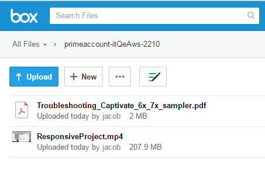

# Migratiehandleiding

Referentiehandleiding voor integratiebeheerders die een bestaand LMS naar LMS willen migreren

## Overzicht {#overview}

<table>
 <tbody>
  <tr>
   <td></td>
   <td>
    
<a href="https://business.adobe.com/products/learning-manager/adobe-learning-manager.html">Adobe Learning Manager</a> is een cloudgehoste, studentgerichte en zelfservice Learning Management Solution. Adobe stelt bedrijven met de bestaande Learning Management Systems (LMS) in staat om de trainingsgegevens en trainingsinhoud van hun organisatie te migreren naar de LMS-toepassing van de Learning Manager. 
</td>
  </tr>
 </tbody>
</table>

### Gebruiksscenario {#usagescenario}

Over het algemeen beschikken grote ondernemingen over hun interne LMS of een andere leverancier van oudere Learning Management Systems. LMS bestaat uit uw trainingsinhoud en trainingsgegevens voor ondernemingen. Als onderneming kunt u bij de aanschaf van de Learning Manager uw bestaande LMS-inhoud en -gegevens verplaatsen naar Learning Manager, zodat u de voordelen van een modern en intuïtief LMS kunt benutten zonder dat u de oude gegevens van uw organisatie kwijtraakt.

Learning Manager biedt de tools en specificaties die nodig zijn om de integratiebeheerder van uw organisatie de migratietaken te laten instellen en uitvoeren.

Vanaf vandaag kunnen de beheerders van een organisatie de migratiefunctie in Leermanager openen door contact op te nemen met het ondersteuningsteam van de Adobe. Als u de migratiefunctie in uw account wilt inschakelen, kunt u contact opnemen met het ondersteuningsteam van de Adobe Learning Manager.

## Migratieproces {#apidescription}

De vereisten voor migratie, de belangrijkste stappen die bij het migratieproces betrokken zijn, migratiesprint, specificaties, gegevens- en contentmigratiestappen worden in deze sectie als volgt uitgelegd:

### Voorwaarden {#prerequisites}

Het team van de leermanager verwacht dat de volgende taken worden uitgevoerd door de integratiebeheerders van uw organisatie voordat het migratieproces wordt uitgevoerd:

* De integratiebeheerder extraheert gegevens en inhoud uit het bestaande LMS en transformeert de gegevens naar de bestandsindelingen zoals gedefinieerd door Learning Manager.
* Learning Manager biedt geen ondersteuning voor het importeren van gebruikers als onderdeel van het migratieproces en verwacht dat de organisatie gebruikers importeert met behulp van connectoren. Adobe Systems verwacht dat deze connectoren voorafgaand aan het migratieproces worden geconfigureerd. Raadpleeg [Help voor Learning Manager-connectoren](connectors.md) voor meer informatie.

Leermanager raadt beheerders aan het migratieproces uit te proberen in een proefaccount voordat ze de gegevens en inhoud naar de productieomgeving van de Learning Manager migreren.

### Belangrijkste stappen van het migratieproces {#keystepsofmigrationprocess}

De belangrijkste stappen voor het migreren van inhoud en gegevens van een bestaand LMS naar Learning Manager zijn als volgt:

1. De integratiebeheerder of partner evalueert de bestaande LMS-gegevens en -inhoud die moeten worden gemigreerd.
1. De integratiebeheerder evalueert de tools en specificaties die Learning Manager biedt voor het opnemen van gegevens en inhoud.
1. De integratiebeheerder schrijft code of onderneemt handmatig werk om de trainingsgegevens en -inhoud uit het oudere LMS te exporteren op basis van de functionaliteit die wordt geboden door het oudere LMS.
1. Zodra de trainingsgegevens en -inhoud beschikbaar zijn, analyseert de integratiebeheerder de gegevens en inhoud en wijst deze toe aan de migratiespecificaties van de Learning Manager.
1. De integratiebeheerder gebruikt de tools van Learning Manager om in de volgende volgorde te migreren:

   1. Studenten overbrengen naar Leermanager
   1. Trainingsinhoud overbrengen naar Learning Manager en
   1. Zet trainingsgegevens tot slot over naar Learning Manager.

De organisatie kan beginnen met het gebruik van LMS in Learning Manager samen met de oudere inhoud.

### Bereik van migratieobjecten {#scopeofmigrationobjects}

U kunt inhoud alleen voor de volgende leerobjecten migreren:

* Module
* Badges
* Cursus
* Moduleversie
* Cursusinstantie
* Cursusmodule
* Vaardigheden
* Vaardigheidsniveau
* Vaardigheidcursus
* Certificering
* Certificeringscursus
* Certificering verplicht
* Leerprogramma
* Leerprogramma cursus
* Leerprogramma-instantie
* Cursusinstantie van het leerprogramma
* Taakhulp
* Versie taakhulp
* Taakhulpencursus
* Vaardigheden voor taakhulp
* Inschrijving
* Inschrijving voor certificering
* Inschrijving voor leerprogramma
* Inschrijving voor taakhulp
* Cursusgraden voor gebruikers

### Belangrijkste concepten van migratie {#keyconceptsofmigration}

Een aantal van de belangrijkste concepten van het Leerbeheermigratieproces wordt kort uitgelegd ter referentie:

**Migratieproject**

In Learning Manager bestaat een migratieproject uit een of meer sprints. U kunt ook meerdere migratieprojecten voor uw account hebben. Uw migratieproces in Leermanager begint met het maken van een migratieproject.

**Sprint**

Een sprint definieert in het LMS-migratieproces een set migratie-items die u uit het bestaande LMS wilt migreren. Een migratie-item kan een cursusmodule, studentrecords of een reeks cursussen zijn. Een sprint kan meerdere leergegevensitems bevatten. U kunt in elke sprint migratietaken uitvoeren.

**Sprint Runs**

Sprint run is het proces waarbij een sprintmigratietaak wordt gestart. U kunt de sprintrun op elk moment van een run stoppen.

**Sprint re-run**

U kunt een migratiesprint op elk gewenst moment opnieuw uitvoeren nadat deze is voltooid. Dit gebeurt wanneer een sprint opnieuw wordt uitgevoerd of opnieuw wordt uitgevoerd wanneer u de gegevens in een sprintitem wilt toevoegen en deze opnieuw naar de toepassing wilt migreren of de fouten in CSV&#39;s wilt corrigeren.

**CSV-specificatie**

Leerbeheer biedt u een set [standaard CSV-specificaties](migration-manual.md#main-pars_header_140933605). De beste manier is om deze CSV-specificaties door te nemen voordat u begint met het migratieproces. De integratiebeheerder van uw organisatie kan de bestaande gegevensindelingen analyseren en toewijzen, zodat deze overeenkomen met de door de Learning Manager verschafte CSV-sjabloonitems.

**Migratieprojecttags**

Adobe Systems raadt u aan een reeks trefwoorden als tags te gebruiken om uw migratieprojecten gemakkelijk te identificeren binnen de toepassing Leermanager. Met deze tags kunt u uw projecten intern identificeren in de toepassing Leermanager op een bepaald moment.

**Module zonder inhoud**

Met Learning Manager kunt u een module zonder inhoud uploaden. Adobe Systems beschouwt het als een inhoudloze module in Learning Manager. In een scenario waarin u een deel van de oude gegevens uit uw bestaande LMS wilt migreren zonder dat er inhoud nodig is, kunt u het bestand module_version.csv zonder URL-verwijzing uploaden.

## CSV-specificaties en voorbeeld-CSV&#39;s {#csv}

Hieronder vindt u de standaard CSV-specificaties die u kunt gebruiken om toe te wijzen aan uw bestaande LMS-migratiegegevens. Klik op CSV-specifications en sample-csvs om ZIP-bestanden te downloaden. Het gedownloade csv-specifications.zip bevat zeven Excel-bladbestanden. Deze Excel-bladbestanden zijn specificaties met beschrijvingen waarmee u kunt zien hoe u de CSV-bestanden invult. De overeenkomstige CSV-bestanden moeten de gegevens voor elk veld bevatten in de voorgeschreven indeling, zoals uitgelegd in deze XLSX-bestanden.

<table border="1" cellspacing="0" cellpadding="0" width="100%">
 <tbody>
  <tr>
   <th>
    
<b>Sl.no</b>
</th>
   <th>
    
<b>Bestandsnaam</b>
</th>
   <th>
    
<b>Beschrijving van de inhoud</b>
</th>
   <th>
    
Opmerkingen
</th>
  </tr>
  <tr>
   <td>
    
1
</td>
   <td>
    
module.xlsx
</td>
   <td>
    
Metagegevens voor module.csv
</td>
   <td> </td>
  </tr>
  <tr>
   <td>
    
2
</td>
   <td>
    
badge.xlsx
</td>
   <td>
    
Metagegevens voor badge.xlsx
</td>
   <td> </td>
  </tr>
  <tr>
   <td>
    
3
</td>
   <td>
    
course.xlsx
</td>
   <td>
    
Metagegevens voor course.csv
</td>
   <td>
    
Vermeld één auteursnaam voor een bepaalde cursus omdat meerdere auteursnamen soms niet correct worden weergegeven in de toepassing na migratie. 
</td>
  </tr>
  <tr>
   <td>
    
4
</td>
   <td>
    
module_version.xlsx 
</td>
   <td>
    
Metagegevens voor module_version.csv
</td>
   <td>
    
Zorg ervoor dat u het URL-pad van de Box-accountmap opgeeft waar u de inhoud hebt geüpload. 
</td>
  </tr>
  <tr>
   <td>
    
5
</td>
   <td>
    
course_instance.xlsx
</td>
   <td>
    
Metagegevens voor course_instance.csv 
</td>
   <td> </td>
  </tr>
  <tr>
   <td>
    
6
</td>
   <td>
    
session.xlsx
</td>
   <td>
    
Metagegevens voor session.csv
</td>
   <td>
    
Zorg ervoor dat elke vermelding in de session.csv is gekoppeld aan ten minste één module voor het klaslokaal/virtuele klaslokaal
</td>
  </tr>
  <tr>
   <td>
    
7
</td>
   <td>
    
course_module.xlsx
</td>
   <td>
    
Metagegevens voor course_module.csv
</td>
   <td> </td>
  </tr>
  <tr>
   <td>
    
8
</td>
   <td>
    
skill.xlsx
</td>
   <td>
    
Metagegevens voor skill.csv
</td>
   <td> </td>
  </tr>
  <tr>
   <td>
    
9
</td>
   <td>
    
skill_level.xlsx
</td>
   <td>
    
Metagegevens voor skill_level.csv
</td>
   <td> </td>
  </tr>
  <tr>
   <td>
    
10
</td>
   <td>
    
skill_course.xlsx
</td>
   <td>
    
Metagegevens voor skill_course.csv
</td>
   <td> </td>
  </tr>
  <tr>
   <td>
    
11
</td>
   <td>
    
certification.xlsx
</td>
   <td>
    
Metagegevens voor Certification.csv
</td>
   <td> </td>
  </tr>
  <tr>
   <td>
    
12
</td>
   <td>
    
certification_course.xlsx
</td>
   <td>
    
Metagegevens voor certification_course.csv
</td>
   <td> </td>
  </tr>
  <tr>
   <td>
    
13
</td>
   <td>
    
certification_commit.xlsx
</td>
   <td>
    
Metagegevens voor certification_commit.csv
</td>
   <td> </td>
  </tr>
  <tr>
   <td>
    
14
</td>
   <td>
    
learning_program.xlsx
</td>
   <td>
    
Metagegevens voor learning_program.csv
</td>
   <td> </td>
  </tr>
  <tr>
   <td>
    
15
</td>
   <td>
    
learning_program_course.xls 
</td>
   <td>
    
Metagegevens voor learning_program_course.csv 
</td>
   <td> </td>
  </tr>
  <tr>
   <td>
    
16
</td>
   <td>
    
learning_program_instance.xlsx 
</td>
   <td>
    
Metagegevens voor learning_program_instance.csv
</td>
   <td> </td>
  </tr>
  <tr>
   <td>
    
17
</td>
   <td>
    
learning_program_instance_course_instance.xlsx 
</td>
   <td>
    
Metagegevens voor learning_program_instance_course_instance.csv
</td>
   <td> </td>
  </tr>
  <tr>
   <td>
    
18
</td>
   <td>
    
job_aid.xlsx
</td>
   <td>
    
Metagegevens voor job_aid.csv
</td>
   <td>
    
Voor elke gemigreerde job_aid zijn een of meer job_aid-versies vereist.
</td>
  </tr>
  <tr>
   <td>
    
19
</td>
   <td>
    
Job_aid_version.xlsx
</td>
   <td>
    
Metagegevens voor job_aid_version.csv
</td>
   <td> </td>
  </tr>
  <tr>
   <td>
    
20
</td>
   <td>
    
job_aid_course.xlsx
</td>
   <td>
    
Metagegevens voor job_aid_course.csv
</td>
   <td> </td>
  </tr>
  <tr>
   <td>
    
21
</td>
   <td>
    
job_aid_skills.xlsx
</td>
   <td>
    
Metagegevens voor job_aid_skills.csv
</td>
   <td> </td>
  </tr>
  <tr>
   <td>
    
22
</td>
   <td>
    
enrollments.xlsx
</td>
   <td>
    
Metagegevens voor enrollments.csv
</td>
   <td> </td>
  </tr>
  <tr>
   <td>
    
23
</td>
   <td>
    
certification_enrollement.xlsx
</td>
   <td>
    
Metagegevens voor certification_enrollement.csv
</td>
   <td> </td>
  </tr>
  <tr>
   <td>
    
24
</td>
   <td>
    
learning_program_enrollment.xlsx
</td>
   <td>
    
Metagegevens voor learning_program_enrollment.csv  
</td>
   <td> </td>
  </tr>
  <tr>
   <td>
    
25
</td>
   <td>
    
job_aid_enrollment.xlsx
</td>
   <td>
    
Metagegevens voor job_aid_enrollment.csv
</td>
   <td> </td>
  </tr>
  <tr>
   <td>
    
26
</td>
   <td>
    
user_course_grade.xlsx
</td>
   <td>
    
 
      Metagegevens voor user_course_grade.csv
</td>
   <td>
    
Geef de vereiste gegevens voor studentrecords in het CSV-bestand op, ook al zijn deze niet verplicht. Zonder deze informatie kan het zijn dat de toepassing Learning Manager geen gegevens weergeeft, zelfs als het CSV-bestand voor migratie wordt verwerkt. sample-csvs.zip file bevat zeven CSV-bestanden met dezelfde naamgevingsconventie als hierboven.
</td>
  </tr>
 </tbody>
</table>

Learning Manager ondersteunt alleen datum- en tijdwaarden in UTF 8- en 32-bits indeling. Er kunnen fouten optreden tijdens de migratie als u de datum vermeldt in CSV-bestanden met een datum die buiten het bereik valt (2038-07-17T08):53:21.000Z of 1980-04-17T08:13:25,322Z.
[sample-csvs.zip](assets/sample-csvs.zip) [csv_specifications.zip](assets/csv-specifications.zip)Tijdens het importeren moet u rekening houden met de volgende afhankelijkheden van CSV-bestanden:

* module_version.csv is afhankelijk van module.csv
* course_instance.csv is afhankelijk van course.csv
* course_module.csv is afhankelijk van course.csv, module.csv en module_version.csv
* course_instance.csv is afhankelijk van course.csv
* session.csv is afhankelijk van course.csv en module.csv
* enrollment.csv is afhankelijk van course.csv
* user_course_grade.csv is afhankelijk van course.csv en module.csv
* skill_course.csv is afhankelijk van course.csv
* skill_level.csv is afhankelijk van skill.csv
* learning_program_instance.csv is afhankelijk van learning_program en learning_program_course.csv
* learning_program_course.csv is afhankelijk van learning_program.csv
* learning_program_enrollment.csv is afhankelijk van learning_program en learning_program_instance.csv
* learning_program_instance_course_instance.csv is afhankelijk van learning_program.csv, learning_program_instance.csv en course_instance.csv
* certification_course.csv is afhankelijk van certification.csv en course.csv
* certification_commit.csv is afhankelijk van certification.csv en certification_course.csv
* certification_enrollment.csv is afhankelijk van certification.csv, certification_course.csv en certification_enrollment.csv

## Migratieprocedure {#migrationprocedure}

Voordat u begint met de migratieprocedure, is het belangrijk om de volgende punten in acht te nemen:

* Er kan op elk moment slechts één migratieproject actief zijn in een account. Binnen een project kan slechts één sprint actief zijn op een bepaald moment.
* U kunt een run die al in het migratieproces is, niet ongedaan maken. U kunt echter de bestaande verwijderingsoptie binnen elke functie van Leermanager gebruiken om migratie van gegevens of inhoud ongedaan te maken.
* Zodra het migratieproject van start gaat, krijgt het de status &#39;Onder migratie&#39;. Tijdens de migratie kan geen andere rol dan de rol van integratiebeheerder zich aanmelden bij Learning Manager.

### FTP- en Box-accounts maken {#creatingftpandboxaccounts}

Het is heel belangrijk dat u uw migratieproject plant. U wordt aangeraden uw projecten op te splitsen in meerdere sprints en duidelijk aan te geven wat u in elke sprint wilt migreren. Het kan zelfs een goed idee zijn om na elke sprint wat validatie uit te voeren om zeker te zijn van de gegevens die in die sprint zijn gemigreerd, in plaats van één grote validatiefase aan het einde van het project. Voordat u de sprint start als onderdeel van uw migratieproject, moet u CSV-bestanden met gegevens en inhoud uploaden naar respectievelijk FTP- en Box-servers. Als u geen accounts hebt voor Aangepaste FTP en Box, kunt u deze maken.

**FTP-account maken**

Klikken **[!UICONTROL CSV FTP-map aanvragen]**. Er verschijnt een pop-upvenster waarin u wordt gevraagd uw e-mail-ID in te voeren. Volg de online instructies en maak een FTP-account. Zodra u uw account hebt gemaakt, kunt u uw migratieproject- en sprintprojectmappen in FTP bekijken.

Hieronder ziet u ter referentie een voorbeeldmomentopname van projectbestanden en FTP-map.

<!---->

**Box-account maken**

Maak een map voor het uploaden van inhoud in een proces dat vergelijkbaar is met dat van het maken van de FTP-map. Klik op Migratie in het linkerdeelvenster en klik op Verzoek om een map voor het uploaden van inhoud onder aan de pagina die wordt weergegeven.

U ontvangt dan een e-mail van Box met een koppeling naar de gedeelde map. Als u geen Box-account hebt, klikt u op Sign Up en maakt u een account. Aanmeldingsinstructies worden naar de e-mail-ID van de integratiebeheerder verzonden.

**Gegevens uploaden (.csv-bestanden) naar FTP-mappen of Box-mappen**

U moet een FTP- of Box-account maken voordat u een migratieproject maakt. Op dit moment kunt u dus een migratieproject en sprint maken in de toepassing Learning Manager.  Raadpleeg **Migratieprocedure voor gegevens en inhoud** op deze pagina om een migratieproject te maken.

Klik in FTP- of Box-account op de naam van uw projectmap en klik op de sprintnaam. In de sprintmap kunt u de CSV-gegevensbestanden uploaden die u wilt migreren. Als u wilt uploaden, klikt u op de knop Bestanden uploaden bovenaan in de FTP- of Box-server en zet u de CSV-bestanden neer. Hieronder ziet u ter referentie een voorbeeldmomentopname na het uploaden naar FTP.

<!---->

U kunt terugkeren naar het migratieproject van Learning Manager door op **[!UICONTROL Vernieuwen]** en bekijk alle CSV-gegevenstypen die in uw migratiesprint worden vermeld.

**Trainingsinhoud uploaden naar inhoudsmappen**

Upload de trainingsinhoud van uw bestaande LMS naar uw Box-account. Als u het migratieproject en de sprint al hebt gemaakt, vult het Box-account het migratieproject en de sprintnaam in. U kunt de inhoud in hetzelfde pad uploaden. Raadpleeg **Migratieprocedure voor gegevens en inhoud** op deze pagina om een migratieproject te maken.

U kunt de inhoudsbestanden slepen en neerzetten of op **[!UICONTROL Uploaden]** en selecteer de bestanden op uw bureaublad. Als de bestandsgrootte van uw inhoud groot is, kan het uploaden van de bestanden enige tijd duren. Afhankelijk van de grootte van het bestand varieert de tijd die nodig is om de bestanden naar uw Box-account te uploaden.

Hieronder ziet u ter referentie een voorbeeld van een Box-account na het uploaden van inhoud naar dit account:

*Bestanden in Box-account*

Nadat de bestanden naar uw Box-account zijn geüpload, moet u het relatieve pad van dit Box-inhoudsbestand in het bestand module_version.csv vermelden. Dit is een verplichte stap om het pad van de module-inhoud aan te geven.

Nadat u zich hebt aangemeld bij de FTP- en Box-servers en de inhoud hebt geüpload, worden de CSV-locaties weergegeven zoals weergegeven in de onderstaande afbeelding in Leerbeheer.

*CSV-locaties in Box-account*

## Migratieprocedure voor gegevens en inhoud {#dataandcontentmigrationprocedure}

De procedure voor het migreren van LMS-gegevens en -inhoud van uw onderneming naar Learning Manager wordt als volgt uitgelegd:

Doorloop de vereisten van het migratieproces voordat u met de migratie begint. Raadpleeg [CSV-specificaties en voorbeeld-CSV&#39;s](migration-manual.md#main-pars_header_140933605) op deze pagina en maak de CSV&#39;s klaar voor de migratie van gegevens en inhoud.

1. Meld u als integratiebeheerder aan bij de toepassing Learning Manager en klik op **[!UICONTROL Migratie]** in het linkerdeelvenster.

   De startpagina voor migratieprojecten wordt weergegeven. Als uw organisatie al migratieprojecten heeft gemaakt, kunt u de lijst met alle migratieprojecten op deze pagina bekijken.

1. Klikken **[!UICONTROL Nieuw]** rechtsboven op de pagina om een migratieproject te maken. U kunt ook op **[!UICONTROL Een migratieproject maken]** koppeling op de pagina om een migratieproject te maken. De pagina Een migratieproject maken wordt weergegeven.

   Als u nog geen FTP-map hebt gemaakt, wordt u gevraagd om een FTP-map in het account te maken. Dit is een verplichte stap voordat u een migratieproject gaat maken.

   
   *FTP-map maken*

   Geef de projectnaam, projecttag, cursuscatalogus en beschrijving voor uw migratieproject op. Klikken **[!UICONTROL Maken]**.

   Uw migratiegegevensitems worden geïdentificeerd met deze tag voor migratieprojecten. Als u geen specifieke cursuscatalogus hebt, kiest u de standaardcatalogus in de vervolgkeuzelijst. Alle cursussen die u met een migratieproject migreert, worden opgenomen in de catalogus die u in dit stadium kiest. Als u geen catalogus kiest, maken alle gemigreerde cursussen deel uit van de standaardcatalogus.

1. De sprintconfiguratiepagina wordt weergegeven zoals weergegeven in de volgende afbeelding. U moet een sprint maken als onderdeel van uw migratieproject. Kies sprintnaam en geef een korte beschrijving van de sprint. U kunt Ja kiezen als u inhoud wilt migreren als onderdeel van deze sprint. Klikken **[!UICONTROL Volgende]**.

   
   *Sprint-migratie*

   Selectievakje met titel selecteren **Gebruikers zijn toegevoegd of gewijzigd sinds de laatste uitvoering** om de lijst met gebruikers te synchroniseren met de toepassing Leermanager. Als u de inhoud en gegevens migreert naar de toepassing Learning Manager, is dit mogelijk niet vereist. Maar als er een tijdsverloop is tussen uw eerdere sprintmigratie en de nieuwste sprintmigratie, kunt u de lijst met gebruikers het beste synchroniseren. Met deze stap kan de database van de Learning Manager synchroon zijn met uw LMS-gebruikers.

   Deze synchronisatiestap wordt aanbevolen wanneer enrollment.csv en user_course_course_grade.csv worden gemigreerd. Deze stap zorgt ervoor dat de database van de Learning Manager synchroon is met uw migratiedatabase en dat alle gebruikers wier records die in de sprint moeten worden gemigreerd, beschikbaar zijn in de migratiedatabase.

1. U kunt de sprintmigratie starten met uw geüploade gegevens en inhoud. Klikken **[!UICONTROL Vernieuwen]** voordat u Sprint run start om de FTP- en inhoudsmappen te synchroniseren met de toepassing Learning Manager.

   
   *sprintmigratie starten*

   Klikken **[!UICONTROL Starten]** rechtsboven op de pagina. U kunt op **[!UICONTROL Stoppen]** op elk moment tijdens het sprintmigratieproces om de sprintmigratie af te breken.

   De migratiestatus wordt weergegeven op elk van de sprintgegevensitems en de inhoud. Controleer het aantal geslaagde en mislukte items als onderdeel van migratiesprintrun.

   Als u module-inhoud uploadt, moet u ervoor zorgen dat het pad van de inhoudsmap wordt opgegeven in module_version.csv. Als u deze stap overslaat, kunnen er fouten optreden tijdens de migratie. Als u bijvoorbeeld inhoud van een module op eigen tempo uploadt, zoals video&#39;s, moet u het relatieve URL-pad voor vakken opgeven in module_version.csv. Voor de inhoud van de activiteitenmodule kunt u de URL-naam opgeven.

   Hieronder vindt u ter referentie een voorbeeld van het voortgangsdialoogvenster. Zoals te zien in de afbeelding, kunt u het aantal verwerkte records voor elk migratiegegevensitem bekijken, samen met de status van geslaagde en mislukte items. Klik op Foutrecords downloaden naast de mislukte items om de foutenlogboeken te downloaden en weer te geven. U kunt de problemen in CSV oplossen en opnieuw uploaden in FTP.

   
   *Vooruitgang van sprint weergeven*

   Klik op de sprintlijst in het linkerdeelvenster als u de lijst met alle sprints van een migratieproject wilt weergeven. U kunt een lijst weergeven met alle sprints, het aantal runs dat u voor elke sprint hebt uitgevoerd, de begindatum, de duur en de voltooiingsstatus, zoals weergegeven in de voorbeeldafbeelding hieronder.

   
   *Lijst met sprints weergeven*

1. Nadat u de meest recente bijgewerkte CSV&#39;s hebt geüpload, kunt u rechtsboven op de pagina op Opnieuw uitvoeren klikken. Hiermee worden alle gegevensitems opnieuw verwerkt, waarbij de items zonder wijzigingen worden genegeerd. Als u tevreden bent met de migratie van gegevensitems in een sprint, kunt u de migratie als voltooid markeren door op de knop boven aan de pagina te klikken. U kunt later een nieuwe sprint met meer gegevensitems starten. Wanneer een sprint als voltooid is gemarkeerd, kunt u deze niet opnieuw uitvoeren. Op dezelfde manier kunt u in een migratieproject een willekeurig aantal sprints hebben. Als u tevreden bent met de migratiestatus van alle sprints, kunt u het migratieproject als voltooid markeren door op **Project markeren voltooid** koppeling op de pagina Afdruklijst.

   Voordat u het migratieproject als voltooid markeert, moet u ervoor zorgen dat alle sprints van het project voltooid zijn. Als u het migratieproject als voltooid hebt gemarkeerd, kunt u niet meer teruggaan en sprints maken in dat project of wijzigingen aanbrengen in dat project. U moet een ander migratieproject maken en er sprints aan toevoegen.

## Migratieverificatie {#registration}

Nadat u de leergegevens en -inhoud van het oude LMS van uw organisatie hebt gemigreerd, kunt u de geïmporteerde gegevens en inhoud verifiëren met behulp van verschillende functies voor leerobjecten. U kunt zich bijvoorbeeld als beheerder aanmelden bij de toepassing Learning Manager en controleren of de geïmporteerde modules en cursusgegevens en -inhoud beschikbaar zijn.

## Retrofit in migratie {#retrofittinginmigration}

Met deze integratiefunctie kunt u historische gegevens voor een leerobject aanpassen van een oud LMS naar een actieve cursus die in Leermanager wordt gemaakt.

Hieronder vindt u de standaard CSV-specificaties die u kunt gebruiken om toe te wijzen aan uw bestaande LMS-migratiegegevens. Klik op CSV-specifications en sample-csvs om ZIP-bestanden te downloaden. Het gedownloade csv-specifications.zip bevat vier Excel-bladbestanden. Deze Excel-bladbestanden zijn specificaties met beschrijvingen waarmee u kunt zien hoe u de CSV-bestanden invult. De overeenkomstige CSV-bestanden moeten de gegevens voor elk veld bevatten in de voorgeschreven indeling, zoals uitgelegd in deze XLSX-bestanden.

1-enrollment.xlsx-bevat beschrijvingen van metagegevens die zijn vereist voor het bestand retrofit_enrollment.csv.

2-certification_enrollment.xlsx-bevat beschrijvingen van metagegevens die zijn vereist voor het bestand retrofit_certification_enrollment.csv.

3-learning_program_enrollment.xlsx-bevat beschrijvingen van metagegevens die nodig zijn voor het bestand retrofit_learning_program_enrollment.csv.

4-user_course_grades.xlsx-bevat beschrijvingen van metagegevens die nodig zijn voor het bestand retrofit_user_course_grades.csv.
[csv-specifications.zip](assets/csv-specifications.zip)

## Migratieproblemen oplossen {#troubleshootingmigrationissues}

[Klik hier](../../kb/troubleshooting-migration.md) voor meer informatie over de oplossing voor de problemen waarmee integratiebeheerders worden geconfronteerd bij het migreren van gegevens en inhoud van hun bestaande LMS naar de toepassing Learning Manager.

## Tips voor gebruikersbeheer {#usermanagement}

In dit onderwerp vindt u enkele tips voor u om te begrijpen hoe gebruikers in Leermanager worden beschouwd en beheerd. Deze concepten helpen u om gebruikers beter te beheren terwijl u CSV-import, connectoren en migratiefuncties van Learning Manager gebruikt.

## Leermanager-ID&#39;s {#captivateprimeids}

Learning Manager biedt twee typen unieke ID&#39;s voor gebruikers:

* E-mail-ID
* UUID (Universally Unique Id)

Learning Manager ondersteunt UUID om organisaties flexibiliteit te bieden bij het beheren van gebruikersaccounts. Als beheerder kunt u, als u een UUID van gebruikers in een account hebt, de e-mail-ID&#39;s van gebruikers voor dat account wijzigen.

**Gebruiksscenario van UUID in een organisatie**

Overweeg een scenario waarin werknemer A zich bij een bedrijf met de naam Learning Manager aansluit, als contractant. Tijdens de contractperiode, kan het bedrijf van de Leermanager bedrijfs e-mail geen identiteitskaart als A@example.com verstrekken, in plaats daarvan kan het bedrijf slechts het persoonlijke e-mailrekening van de werknemer overwegen, bijvoorbeeld, A@gmail.com. Als een werknemer A na 6 maanden van de contractperiode toetreedt tot de leermanager als fulltime medewerker, wil de leermanager zijn e-mail-ID wijzigen in de e-mail-ID van zijn bedrijf: A@example.com.

De leermanager van het bedrijf in het bovengenoemde scenario profiteert van het hebben van UUID-toegang tot gebruikersaccount. Het bedrijf van de Learning Manager kan de persoonlijke e-mail-ID van werknemer A eenvoudig vervangen door een officiële e-mail-ID. Deze wijziging heeft geen invloed op de records van de werknemer die relevant zijn voor dit account.

## Identificatie voor één gebruiker {#singleuseridentification}

Leermanager identificeert en onthoudt hoe één gebruiker eraan wordt toegevoegd, bijvoorbeeld met behulp van zelfregistratie, door gebruik te maken van CSV-upload of door één gebruiker die via de gebruikersinterface of API is toegevoegd.

* Als één gebruiker wordt toegevoegd via de gebruikersinterface (UI) of API, kunt u dit type gebruikers verwijderen via de gebruikersinterface of API.
* U kunt afzonderlijke gebruikers bijwerken met behulp van het CSV-uploadproces, maar u moet niet vergeten dat deze afzonderlijke gebruikers worden behandeld als de CSV-gebruikers en dat de CSV-workflows op dergelijke gebruikers van toepassing zijn.

## Managerrol toewijzen {#assigningmanagerrole}

U kunt een managerrol niet rechtstreeks aan een gebruiker in Leerbeheer toewijzen. Een gebruiker X kan alleen een Leermanager worden als u een managerattribuut van een gebruiker (bijvoorbeeld Y) in dat account instelt als X.

In een scenario waarin X de Manager van gebruikers, bijvoorbeeld, A, B en C is, als X de organisatie verlaat dan moet u ervoor zorgen dat het attribuut van de Manager van A, B, en C aan de nieuwe Manager wordt geplaatst. U kunt ook het managerattribuut van deze gebruikers tijdelijk als ROOT instellen en later met de nieuwe managernaam toewijzen.

Raadpleeg de volgende Help-inhoud voor meer informatie over dit onderwerp:

* [Veelgestelde vragen over het uploaden van CSV&#39;s](/help/migrated/administrators/add-users-in-bulk.md)
* [Help bij het toevoegen van gebruikers](/help/migrated/administrators/feature-summary/add-users-user-groups.md)

