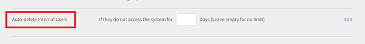
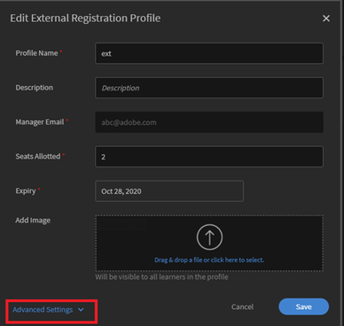

# Gebruiker wordt automatisch verwijderd uit Learning Manager {#user-gets-auto-deleted-in-learning-manager}

## Probleem

Een gebruiker wordt uit Learning Manager verwijderd, de beheerder heeft een dergelijke actie echter nooit uitgevoerd.

## Oorzaak

In Adobe Learning Manager bestaat een optie waarmee u een gebruiker kunt verwijderen als deze zich gedurende een bepaalde tijdsperiode niet in het systeem heeft aangemeld.

## De instelling wijzigen/toepassen

### Voor interne studenten

1. Meld u aan als **Beheerder**.
1. Onder **Configureren**, klik op **Instellingen** > **Algemeen**.
1. Zoek op de pagina Algemene instellingen de optie **Interne gebruikers automatisch verwijderen**.
1. Klikken **[!UICONTROL Bewerken]** om het aantal dagen in het veld in te voeren, om automatisch een student te verwijderen als deze het systeem niet heeft geopend.

   

   *Het aantal dagen bewerken*

>[!NOTE]
>
>   Laat het veld leeg als u gebruikers niet automatisch wilt verwijderen.

1. Klikken **[!UICONTROL Opslaan]** om de gemaakte instellingen te behouden.

### Voor externe studenten:

1. Meld u aan als **Beheerder**.
1. Onder **Beheren**, klik op **[!UICONTROL Gebruikers]** > **[!UICONTROL Extern]**.
1. Klik op de naam van een Externe gebruiker waarvoor de instellingen moeten worden toegepast.

   Hierdoor wordt het venster **Extern registratieprofiel bewerken** geopend.

1. Klikken **[!UICONTROL Geavanceerde instellingen]** linksonder.

   

   *Selecteer de optie Geavanceerde instellingen*

1. In het dialoogvenster **Aanmeldingsvereiste** het aantal dagen in dat een student automatisch moet verwijderen als deze nog geen toegang heeft tot het systeem.
1. Klikken **[!UICONTROL Opslaan]** om de gemaakte instellingen te behouden.
