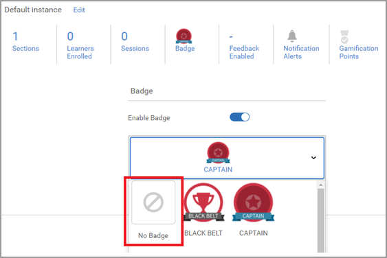
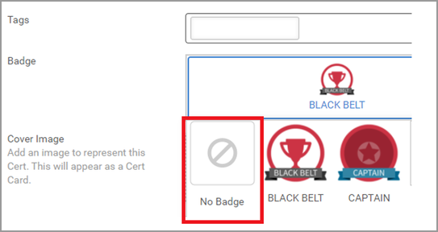

# Kan geen badge toewijzen

## Probleem

Zelfs na het voltooien van een cursus of training wordt een badge niet toegekend zoals verwacht.

## Beschrijving

Nadat een student een cursus/leerprogramma/certificering heeft voltooid, wordt de badge niet aan de student toegekend.

## Oorzaak

De badge die aan het leerobject wordt toegewezen, wordt toegevoegd nadat de student het leerobject heeft voltooid.

In de eerdere versie kon een badge later niet worden toegevoegd als er geen badge was toegewezen aan een leerobject op het moment dat de student het leerobject voltooide.

In de huidige versies is deze functie wel beschikbaar.

## Resolutie

Als een student dit probleem ondervindt, probeer dan de onderstaande stappen:

## Cursus/leerprogramma

1. Meld u aan als beheerder.

1. Open het betreffende leerobject (cursus/leerprogramma).

1. Klikken **[!UICONTROL Instanties]** > **[!UICONTROL Badge]**.

   

1. Verwijder de badge uit het leerobject en klik op **[!UICONTROL Opslaan]**.

   

1. Wijs de badge opnieuw toe aan het leerobject en klik op **[!UICONTROL Opslaan]**.

   Met deze stap wijst u de badge toe aan alle studenten die zijn ingeschreven voor het leerobject.

## Certificering

1. Meld u aan als beheerder.
1. Open de certificering.
1. Klikken **[!UICONTROL Overzicht]** > **[!UICONTROL Badge]**.
1. Verwijder de badge uit de certificering en klik op **[!UICONTROL Opslaan]**.

   

1. Wijs de badge opnieuw toe aan de certificering en klik op **[!UICONTROL Opslaan]**.
