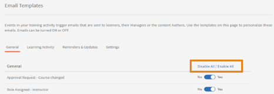
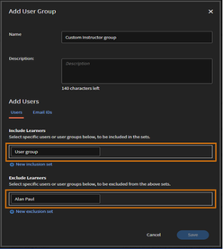

# Standaardtoewijzing van docentrollen aan gebruikersgroepen in Leermanager

## Probleem

Alle gebruikers die aan een sessie zijn toegewezen, krijgen de rol van docent toegewezen.

## Beschrijving

Er zijn scenario&#39;s waarin voor een sessie mogelijk meerdere docenten nodig zijn of waarin een beheerder/auteur een gebruikersgroep aan een sessie toewijst. Dit resulteert in alle gebruikers in de gebruikersgroep die de rol van docent wordt toegewezen.

## Oorzaak

Aangezien rollen niet kunnen worden vertakt tijdens bulktoewijzing van gebruikers in een gebruikersgroep, wordt de docentenrol toegewezen aan alle gebruikers.

## Oplossing

Maak aangepaste gebruikersgroepen om de gebruikersrollen te filteren die aan een sessie zijn toegewezen. Voer de volgende stappen uit om de toegewezen docentrollen in een gebruikersgroep te verwijderen:

1. Meld u aan als beheerder. Klik in het linkerdeelvenster op **[!UICONTROL E-mailsjablonen]**.
1. Klik op **[!UICONTROL Alles uitschakelen]**.

   

1. Navigeer naar **Gebruikers** > **Gebruikersgroep**. Klikken **[!UICONTROL Toevoegen]**.

   

1. Maak als volgt een aangepaste gebruikersgroep in het venster Gebruikersgroep toevoegen:

   * Voer een naam in voor de aangepaste groep in het dialoogvenster **[!UICONTROL Naam]** veld.
   * Onder **[!UICONTROL Inclusief studenten]** toevoegen, voegt u de gebruikersgroep toe waarvoor u de docenten wilt filteren.
   * Onder **[!UICONTROL Studenten uitsluiten]** toevoegen aan de gebruikers voor wie u de rol van docent wilt behouden.

   

   Met de bovenstaande stappen maakt u een lijst met gebruikers die moeten worden toegevoegd aan de opnameset en verwijdert u specifieke gebruikers (docenten) die worden genoemd in de uitsluitingsset.

1. Klikken **[!UICONTROL Opslaan]** de aangebrachte wijzigingen.
1. Zoek de gemaakte aangepaste gebruikersgroep door naar **[!UICONTROL Gebruikers]** > **[!UICONTROL Intern]**.

   

1. Klik op het selectievakje om alle gebruikers in de groep te selecteren.

   

1. Klikken **[!UICONTROL Handelingen]** > **[!UICONTROL Rol verwijderen]** > **[!UICONTROL Docent verwijderen]**.

Zorg ervoor dat alle e-mailtriggers die in stap 2 zijn uitgeschakeld, na voltooiing opnieuw worden ingeschakeld.
