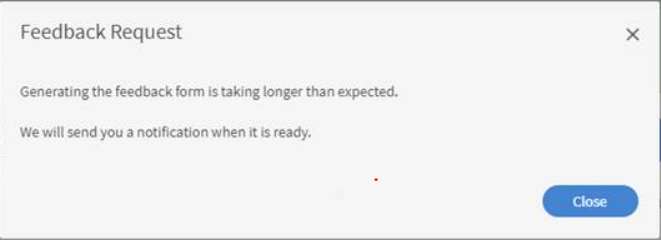

# De automatische pop-up voor L1-feedback wordt niet weergegeven

## Probleem

De automatische pop-up voor L1-feedback wordt niet weergegeven nadat een student de cursus heeft voltooid.

## Oorzaak

Het kan soms gebeuren dat een student de L1-feedback niet ontvangt nadat hij of zij een bepaalde cursus heeft voltooid of een melding ontvangt zoals hieronder wordt weergegeven:

*Kan geen L1-feedback ontvangen*

Dit kan de volgende oorzaken hebben:

1. Er is niet ingesteld dat feedback wordt weergegeven nadat de cursus is voltooid.
1. Herinneringen zijn uitgeschakeld.
1. De weergave van een herinnering staat gepland na een ingestelde tijdsperiode.

## Resolutie

1. Zorg ervoor dat de optie Vragenlijst direct tonen na voltooiing van de cursus is ingeschakeld in **Cursus** > **Instanties** > **L1-feedback**.
   <!---->
1. Navigeer als beheerder naar **Instellingen > Feedback**. Controleer voor wanneer de herinnering staat gepland. Wanneer deze gepland staat voor **Na cursusvoltooiing**, wijzigt u de optie naar **Bij cursusvoltooiing**.
1. Schakel de volgende e-mailsjablonen in: **E-mailsjablonen > Herinneringen en updates > Feedback van student vragen voor cursus**. Als de optie is uitgeschakeld, schakelt u deze in en test u deze.
1. Als de bovenstaande stappen niet werken, verwijdert u de ingestelde herinnering in **Beheerder > Instellingen > Feedback**. Maak een herinnering voor &#39;Bij cursusvoltooiing&#39; en stel de herhaling naar aanleiding van de behoefte in.
