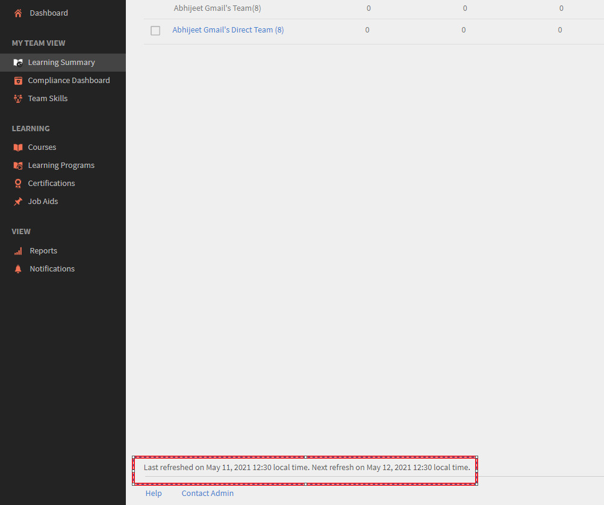

# Overzicht van leermateriaal toont niet de huidige gegevens

## Probleem

In Adobe Learning Manager geeft het leeroverzicht de huidige gegevens voor inschrijving, voltooiing of progressies niet weer.

Er zijn situaties waarbij een student een cursus voltooit, maar de gegevens niet zichtbaar zijn in het overzicht van leermateriaal wanneer dit door een beheerder of manager wordt bekeken.

## Oorzaak

Het probleem doet zich voor omdat het leeroverzicht op verschillende tijdstippen wordt bijgewerkt op basis van de criteria die u hebt geselecteerd.

## Duur van vernieuwen

De gegevens in het overzicht van leermateriaal worden vernieuwd volgens de volgende planningen:

1. **Deze maand:** De gegevens worden elke dag vernieuwd. U kunt het tijdstip van de laatste vernieuwing onderaan de pagina zien.
1. **Laatste 3 volledige maanden:** Deze gegevens worden één keer per maand vernieuwd.
1. **Laatste 12 volledige maanden:** Deze gegevens worden één keer per maand vernieuwd.

*Het bericht voor het vernieuwen van gegevens wordt onder aan de pagina weergegeven*
