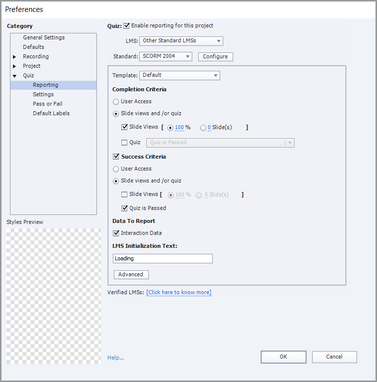

# Module wordt als niet voltooid gemarkeerd na voltooiing van een cursus in Adobe Learning Manager

## Probleem

Zelfs nadat een student een cursus heeft voltooid in Adobe Learning Manager, wordt de module gemarkeerd als niet voltooid.

## Oorzaak

SCORM 2004 definieert de criteria voor succes en voltooiing en verzendt de instructies voor beide afzonderlijk.

Stel dat u een inhoudsset met een **Voltooiingscriteria** van 100% diaweergaven en **Succescriteria** ingesteld als &quot;Quiz wordt doorgegeven&quot;.

Een student voltooit de cursus, maar slaagt niet. In dit geval is de voortgang 100%, maar wordt de module als onvolledig gemarkeerd omdat de student niet voldoet aan de **Succescriteria**.

## Oplossing

Het probleem heeft te maken met de rapportage **voorkeuren** die voor het project zijn ingesteld. De auteur moet de ingestelde voltooiings- en slagingscriteria voor de cursus verifiëren.

Als er wijzigingen zijn vereist, kan de auteur dit doen met een programma voor het schrijven van inhoud, zoals Adobe Captivate Classic. Vervolgens kan de auteur de module bijwerken.

*Voorkeuren voor klassieke rapportage Captivate weergeven*
