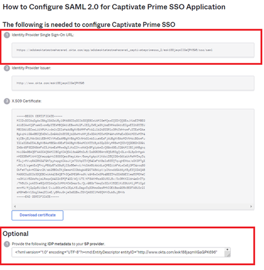

# Integratie van Okta Active Directory met Adobe Learning Manager {#okta-active-directory-integration-with-adobe-learning-manager}

In dit document, zult u leren hoe te om Adobe Learning Manager met Okta Actieve Folder (ADVERTENTIE) te integreren. Wanneer je Adobe Learning Manager integreert met Okta AD, kun je:

* Gebruikerstoegang tot Learning Manager controleren en beheren in Okta AD;
* Inschakelen dat gebruikers automatisch worden aangemeld bij Adobe Learning Manager met hun Okta AD-account;
* uw accounts op één centrale plek beheren: de Okta-portal.

Adobe Learning Manager biedt ondersteuning voor door Identity Provider (IdP) en door Service Provider (SP) geïnitieerde SSO.

## Een toepassing maken in OKTA

1. Meld u aan bij Okta AD.

   >[!NOTE]
   >
   >U hebt geen ALM-beheertoegang nodig om een toepassing te maken en een IDP in te stellen.

1. Klik op **[!UICONTROL Toepassingen]**. De appstore in Okta wordt geopend.

   

   *de toepassingsopslag van de Mening in Okta*

1. Klik **[!UICONTROL creeer de Integratie van de Toepassing]**.

   

   *uitgezocht creeer toepassingsintegratie*

1. Selecteer **[!UICONTROL SAML 2.0]** van het nieuwe venster van de toepassingsintegratie.

   

   *Uitgezochte SAML2.0 optie*

1. Selecteer **[!UICONTROL tot de integratie van SAML]** > **[!UICONTROL Algemene montagespagina]**. Voer een toepassingsnaam in.

   Let op: dit kan elke naam zijn om uw toepassing uniek te identificeren. Klik op **[!UICONTROL Volgende]** als u klaar bent.

   

   *ga de naam van de toepassing* in

1. Voer de volgende stappen uit op de pagina SAML-instellingen configureren:

   **voor opstelling IDP:**

   1. In het Enige Sign-op gebied URL, typ URL: [ https://learningmanager.adobe.com/saml/SSO](https://learningmanager.adobe.com/saml/SSO)
   1. Op het gebied van het Publiek URL, typ URL: [ https://learningmanager.adobe.com ](https://learningmanager.adobe.com/)
   1. In de **drop-down doos van het Formaat van de Naam** identiteitskaart, uitgezochte **E-mailAdres**.
   1. Selecteer Gebruikersnaam Okta in de vervolgkeuzelijst **Gebruikersnaam toepassing**.
   1. Indien u nog kenmerken wilt toevoegen, kunt u dit doen onder de **Kenmerkvermelding** (optioneel)

   

   *voeg attributen SAML* toe

   **voor de opstelling van SP:**

   1. In het Enige Sign-op gebied URL, typ URL: [ https://learningmanager.adobe.com/saml/SSO](https://learningmanager.adobe.com/saml/SSO)
   1. Op het gebied van het Publiek URL, typ URL: [ https://learningmanager.adobe.com ](https://learningmanager.adobe.com/)
   1. Selecteer **E-mailadres** in de vervolgkeuzelijst Indeling naam-ID.
   1. Selecteer Gebruikersnaam Okta in de vervolgkeuzelijst Gebruikersnaam toepassing.
   1. Klik op **Geavanceerde instellingen weergeven**.
   1. Selecteer RSA-SHA256 onder **Handtekeningalgoritme**
   1. Selecteer SHA256 in het **Bevestigingsalgoritme**
   1. Selecteer **Versleuteld** in de synchronisatielocatie **Bevestigingsversleuteling**.

   1. Upload het door Adobe gedeelde certificaatbestand bij de optie **Versleutelingscertificaat**.
   1. Indien u nog kenmerken wilt toevoegen, kunt u dit doen onder de **Kenmerkvermelding** (optioneel).

   

   *voeg extra attributen toe*

   Klik op **[!UICONTROL Volgende]** als u klaar bent.

1. Het **lusje van de Terugkoppeling** is facultatief. Zodra u de opties hebt geselecteerd en uw gegeven terugkoppelt, klik **[!UICONTROL Afwerking]**.

   

   *Volledige opstelling SAML*

## Door IDP geïnitieerde URL en metadatabestand extraheren

Voer de volgende stappen uit om het door IdP/SP geïnitieerde URL- en metagegevensbestand weer te geven:

1. Open de toepassing die u hebt gemaakt.
1. Onder het **Enige Sign-On** lusje, klik **[!UICONTROL Instructies van de Mening]**.

   

   *Uitgezochte SSO lusje*

   **voor IDP:**

   1. De URL voor eenmalige aanmelding van de ID-provider is de door IdP geïnitieerde URL.
   1. Kopieer al tekst die onder het **Facultatieve** gebied aanwezig is.
   1. Open een nieuw kladblokvenster en plak daar de gekopieerde tekst in.
   1. Klik **[!UICONTROL Dossier]** > **[!UICONTROL sparen als]** > &quot;filename.xml&quot;. Dit wordt het metadatabestand.

   **voor SP:**

   1. De URL voor eenmalige aanmelding van de ID-provider is de door IdP geïnitieerde URL.
   1. De uitgever van de ID-provider is de Entiteits-ID.
   1. Kopieer al tekst die onder het **Facultatieve** gebied aanwezig is.
   1. Open een nieuw kladblokvenster en plak daar de gekopieerde tekst in.
   1. Klik **[!UICONTROL Dossier]** > **[!UICONTROL sparen als]** > **[!UICONTROL filename.xml]**. Dit wordt het metadatabestand.

   

   *sparen het dossier van XML van SP*

   Sla dit bestand op in de indeling XML.

## Adobe Learning Manager SSO configureren

Voer de stappen uit in onderstaand artikel voor de configuratie van Adobe Learning Manager SSO.

<!--

article not in TOC

[SSO Authentication](/help/migrated/kb/sso-authentication-for-learning-manager.md)
-->
