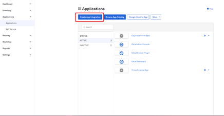
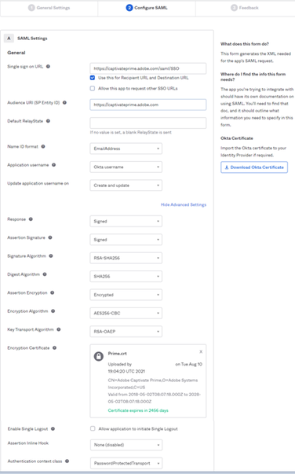
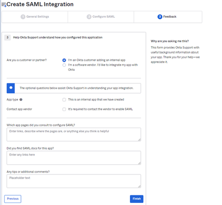

# Integratie van Okta Active Directory met Adobe Learning Manager {#okta-active-directory-integration-with-adobe-learning-manager}

In dit document leert u hoe u Adobe Learning Manager kunt integreren met Okta Active Directory (AD). Wanneer u Adobe Learning Manager integreert met Okta AD, kunt u:

* Gebruikerstoegang tot Learning Manager controleren en beheren in Okta AD;
* Inschakelen dat gebruikers automatisch worden aangemeld bij Adobe Learning Manager met hun Okta AD-account;
* uw accounts op één centrale plek beheren: de Okta-portal.

Adobe Learning Manager biedt ondersteuning voor door Identity Provider (IdP) en door Service Provider (SP) geïnitieerde SSO.

## Een toepassing maken in OKTA

1. Meld u aan als beheerder in Okta AD.
1. Klik op **[!UICONTROL Toepassingen]**. De appstore in Okta wordt geopend.

   

   *Toepassingsarchief in Okta weergeven*

1. Klikken **[!UICONTROL App-integratie maken]**.

   

   *Selecteer App-integratie maken*

1. Selecteren **[!UICONTROL SAML 2.0]** uit het nieuwe app-integratievenster.

   

   *De optie SAML2.0 selecteren*

1. Selecteren **[!UICONTROL SAML-integratie maken]** > **[!UICONTROL Pagina Algemene instellingen]**. Voer een toepassingsnaam in.

   Let op: dit kan elke naam zijn om uw toepassing uniek te identificeren. Klik op **[!UICONTROL Volgende]** als u klaar bent.

   

   *Voer de naam van de toepassing in*

1. Voer de volgende stappen uit op de pagina SAML-instellingen configureren:

   **Voor IDP-instelling:**

   1. Typ de URL in het veld Single Sign-on URL: [https://learningmanager.adobe.com/saml/SSO](https://learningmanager.adobe.com/saml/SSO)
   1. Typ de URL in het veld Audience URL: [https://learningmanager.adobe.com](https://learningmanager.adobe.com/)
   1. In het dialoogvenster **Naam-id-indeling** vervolgkeuzelijst, selecteert u **E-mailadres**.
   1. Selecteer Gebruikersnaam Okta in de vervolgkeuzelijst **Gebruikersnaam toepassing**.
   1. Indien u nog kenmerken wilt toevoegen, kunt u dit doen onder de **Kenmerkvermelding** (optioneel)

   

   *SAML-kenmerken toevoegen*

   **Voor SP-instelling:**

   1. Typ de URL in het veld Single Sign-on URL: [https://learningmanager.adobe.com/saml/SSO](https://learningmanager.adobe.com/saml/SSO)
   1. Typ de URL in het veld Audience URL: [https://learningmanager.adobe.com](https://learningmanager.adobe.com/)
   1. Selecteer **E-mailadres** in de vervolgkeuzelijst Indeling naam-ID.
   1. Selecteer Gebruikersnaam Okta in de vervolgkeuzelijst Gebruikersnaam toepassing.
   1. Klik op **Geavanceerde instellingen weergeven**.
   1. Selecteer RSA-SHA256 onder **Handtekeningalgoritme**
   1. Selecteer SHA256 in het **Bevestigingsalgoritme**
   1. Selecteer **Versleuteld** in de synchronisatielocatie **Bevestigingsversleuteling**.

   1. Upload het door Adobe gedeelde certificaatbestand bij de optie **Versleutelingscertificaat**.
   1. Indien u nog kenmerken wilt toevoegen, kunt u dit doen onder de **Kenmerkvermelding** (optioneel).

   

   *Extra kenmerken toevoegen*

   Klik op **[!UICONTROL Volgende]** als u klaar bent.

1. De **Feedback**  is optioneel. Nadat u de opties hebt geselecteerd en feedback hebt gegeven, klikt u op **[!UICONTROL Voltooien]**.

   

   *Volledige SAML-installatie*

## Door IDP geïnitieerde URL en metadatabestand extraheren

Voer de volgende stappen uit om het door IdP/SP geïnitieerde URL- en metagegevensbestand weer te geven:

1. Open de toepassing die u hebt gemaakt.
1. Onder de **Single Sign-On** tabblad, klikt u op **[!UICONTROL Instructies weergeven]**.

   

   *Tabblad SSO selecteren*

   **Voor IDP:**

   1. De URL voor eenmalige aanmelding van de ID-provider is de door IdP geïnitieerde URL.
   1. Kopieer alle tekst die aanwezig is onder de **Optioneel** veld.
   1. Open een nieuw kladblokvenster en plak daar de gekopieerde tekst in.
   1. Klikken **[!UICONTROL Bestand]** > **[!UICONTROL Opslaan als]** > &quot;filename.xml&quot;. Dit wordt het metadatabestand.

   **Voor SP:**

   1. De URL voor eenmalige aanmelding van de ID-provider is de door IdP geïnitieerde URL.
   1. De uitgever van de ID-provider is de Entiteits-ID.
   1. Kopieer alle tekst die aanwezig is onder de **Optioneel** veld.
   1. Open een nieuw kladblokvenster en plak daar de gekopieerde tekst in.
   1. Klikken **[!UICONTROL Bestand]** > **[!UICONTROL Opslaan als]** > **[!UICONTROL filename.xml]**. Dit wordt het metadatabestand.

   

   *SP XML-bestand opslaan*

   Sla dit bestand op in de indeling XML.

## Adobe Learning Manager SSO configureren

Voer de stappen uit in onderstaand artikel voor de configuratie van Adobe Learning Manager SSO.

<!--

article not in TOC

[SSO Authentication](/help/migrated/kb/sso-authentication-for-learning-manager.md)
-->