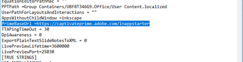

# Kan niet publiceren op het Learning Manager EU-domein {#unable-to-publish-to-learning-manager-eu-domain}

## Probleem

Kan vanuit Adobe Captivate niet publiceren op het Adobe Learning Manager EU-domein.

## Fout

Geen accounts gevonden

## Beschrijving

Er zijn scenario&#39;s waarin auteurs proberen om een cursus vanuit Adobe Captivate in Adobe Learning Manager te publiceren. Zij kunnen dit echter niet uitvoeren aangezien ze een foutmelding krijgen, &#39;Geen account gevonden&#39;.

## Oorzaak

Dit probleem doet zich voor omdat Adobe Captivate standaard is geconfigureerd voor publicatie op het VS-domein van Adobe Learning Manager.

## Oplossing:

Aandachtspunten:

* Sluit de toepassing Adobe Captivate als deze geopend is.
* U hebt Beheerderstoegang op uw machine nodig om de onderstaande stappen uit te voeren. Als u geen Beheerderstoegang hebt, neemt u dan voor assistentie contact op met uw IT-team.

Voer de onderstaande stappen uit:

1. Ga naar de installatiemap voor Adobe Captivate.

   Bijvoorbeeld:  `kbd C:\\Program Files\\Adobe\\Adobe Captivate 2019 x64` (2019 is de versie van de Captivate. Dit verschilt als u een andere versie van Adobe Captivate gebruikt).

1. Kopieer het configuratiebestand **AdobeCaptivate.ini** naar uw desktop.

   
   *Het configuratiebestand weergeven*

1. Open het gekopieerde bestand van uw desktop op een kladblok.
1. Wijzig de waarde van LearningManagerBaseUrl = `https://learningmanager.adobe.com/inappstarter` to LearningManagerBaseUrl = `https://learningmanagereu.adobe.com/inappstarter`

   
   *PrimeBaseURL weergeven*

1. Sla de wijzigingen op die op het kladblok zijn gemaakt.
1. Kopieer het opgeslagen bestand dat u hebt bewerkt en plak het weer in het bestandspad. Het oorspronkelijke bestand vervangen in  `kbd C:\\Program Files\\Adobe\\Adobe Captivate 2019 x64`
1. Als u hiermee klaar bent, opent u Adobe Captivate en probeert u naar Adobe Learning Manager te publiceren.
