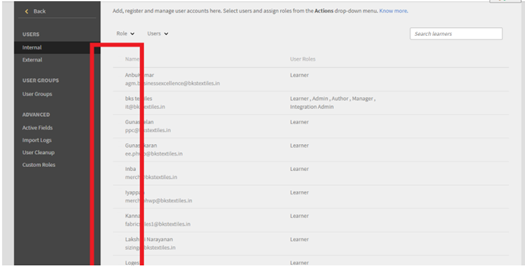

# Selectieknoppen worden niet weergegeven in Leerbeheer

## Probleem

Vanwege ontbrekende keuzerondjes kan een beheerder het volgende niet uitvoeren (geen volledige lijst):

* Rollen toewijzen of verwijderen.
* Verzend een welkomstmail.
* Verwijder een gebruiker.

## Oorzaak

Het probleem is ontstaan door onjuiste thema&#39;s in het account.

*Keuzerondjes niet zichtbaar*

## Resolutie

Laad de thema&#39;s opnieuw en repareer de weergave van de keuzerondjes. Voer de volgende stappen uit:

1. Als beheerder klikt u op **[!UICONTROL Branding]**.
1. In het dialoogvenster **Thema&#39;s** sectie, klik op **[!UICONTROL Bewerken].**
1. Kies een thema en sla de wijzigingen op.

   

   *Een thema selecteren*

1. Terugkeren naar het vorige thema en de wijzigingen opslaan.
1. Meld u af van Adobe Learning Manager en meld u opnieuw aan.
