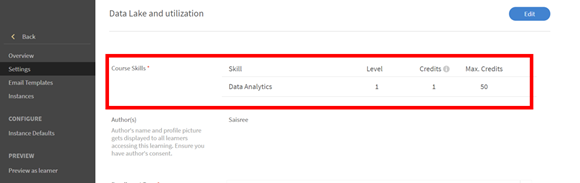

# Kan geen vaardigheid bereiken na voltooiing van een cursus

## Probleem

Een student verkrijgt zelfs na het afronden van een cursus geen vaardigheid. De vaardigheden die aan die cursus zijn toegewezen, blijven **In uitvoering** voor de student.

## Oorzaak

Dit probleem doet zich voor als **Vereiste crediteringen** om deze vaardigheid te bereiken, is groter dan **Verdiende tegoeden** door de student na voltooiing van de cursus.

## Oplossing

Huidige controleren **Vaardigheidscijfers** en **Punt** vereiste informatie om de vaardigheid te bereiken. Volg de onderstaande stappen:

1. Voor de student genereert u een **Studenttranscript** melden.
1. Klik tijdens het genereren van het Studenttranscript op **[!UICONTROL Geavanceerde opties]** en controleer de optie **[!UICONTROL Inclusief vaardigheidsgegevens en overzichtsbladen]**.

   

   *Selecteer de optie Inclusief vaardigheidsgegevens en overzichtsbladen*

1. Open het gedownloade rapport Studenttranscript.
1. Ga naar de **[!UICONTROL Transcriptie vaardigheden]** blad. Hier kunt u de **[!UICONTROL Vereiste crediteringen]** en **[!UICONTROL Verdiende tegoeden]** door de student.

   In het onderstaande voorbeeld zijn er bijvoorbeeld 50 punten vereist om de vaardigheid voor een cursus te bereiken. Maar de student heeft slechts één tegoed behaald.

   

   *Vereiste credits weergeven*

1. Meld u aan als beheerder en ga naar **Vaardigheden** zoals hieronder weergegeven:

   

   *Het tabblad Vaardigheden starten*

1. U kunt het aantal punten controleren dat aan een cursus is toegewezen door u aan te melden als auteur en de cursus te openen. Klikken **[!UICONTROL Instellingen]** > **Cursusvaardigheden** zoals hieronder weergegeven:

   

   *Cursusvaardigheden weergeven*
