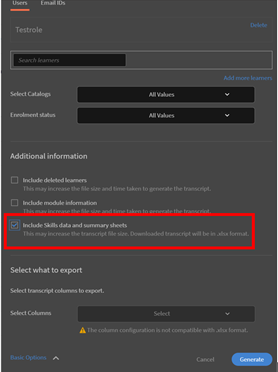

# Kan geen vaardigheid behalen na voltooiing van een cursus

## Probleem

Een student behaalt geen vaardigheid, zelfs niet na het voltooien van een cursus. De vaardigheden die aan die cursus zijn toegewezen, blijven **In uitvoering** voor de student.

## Oorzaak

Dit probleem doet zich voor als **Vereiste crediteringen** om deze vaardigheid te bereiken, is groter dan **Verdiende tegoeden** door de student na voltooiing van de cursus.

## Oplossing

Huidige controleren **Vaardigheidscijfers** en **Punt** vereiste informatie om de vaardigheid te bereiken. Volg onderstaande stappen:

1. Genereer een rapport van het **Studenttranscript** voor de student.
1. Klik tijdens het genereren van het Studenttranscript op **[!UICONTROL Geavanceerde opties]** en controleer de optie **[!UICONTROL Inclusief vaardigheidsgegevens en overzichtsbladen]**.

   

   *Selecteer de optie Inclusief vaardigheidsgegevens en overzichtsbladen*

1. Open het gedownloade rapport van Studenttranscript.
1. Ga naar het blad **[!UICONTROL Vaardighedentranscript]**. Hier kunt u de **[!UICONTROL Vereiste crediteringen]** en **[!UICONTROL Verdiende tegoeden]** door de student.

   In het onderstaande voorbeeld bedraagt het aantal punten dat nodig is om de vaardigheid voor een cursus te behalen bijvoorbeeld 50. Maar de student heeft slechts één punt behaald.

   

   *Vereiste credits weergeven*

1. Om de aan een bepaalde vaardigheid toegekende punten te controleren, meldt u zich aan als beheerder en gaat u naar het tabblad **Vaardigheden**, zoals hieronder weergegeven:

   

   *Het tabblad Vaardigheden starten*

1. Om het aantal aan een cursus toegekende punten te controleren, meldt u zich aan als auteur en opent u de cursus. Klikken **[!UICONTROL Instellingen]** > **Cursusvaardigheden** zoals hieronder weergegeven:

   

   *Cursusvaardigheden weergeven*
