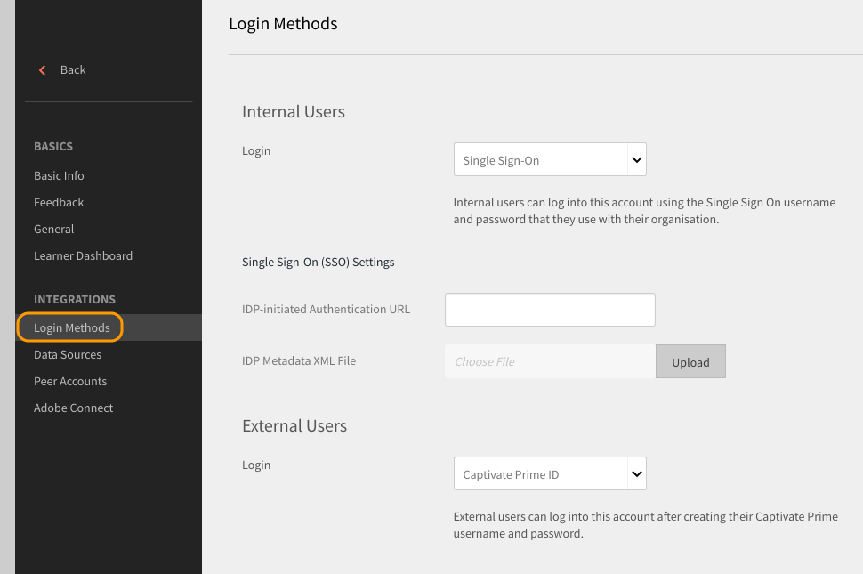

# Meld u aan bij Learning Manager met behulp van SSO-verificatie

Met dit document kunt u SSO-verificatie configureren om u aan te melden bij uw Learning Manager-account.

Voer de volgende stappen uit om SSO-verificatie te configureren:

1. Openen **[!UICONTROL Instellingen]** > **[!UICONTROL Aanmeldingsmethoden.]**

   

1. Kies **[!UICONTROL Interne gebruikers]** of **[!UICONTROL Externe gebruikers]** afhankelijk van uw vereisten.
1. Klik op de vervolgkeuzelijst naast  **[!UICONTROL login]** en selecteert u **[!UICONTROL Single Sign-On]**.

   

1. Als u SSO-instellingen (Single Sign-On) wilt aanpassen, klikt u op  **[!UICONTROL Wijzigen.]**

   

1. Enter  **[!UICONTROL Door IDP geïnitieerde verificatie-URL]** opgegeven door uw serviceprovider en upload uw XML-bestand door op **[!UICONTROL IDP-XML-metagegevensbestand.]**

   

   De SSO die u in Leermanager vormt zou SAML 2.0 moeten worden gesteund.

   U kunt zich nu aanmelden bij Learning Manager met uw SSO-verificatie.

