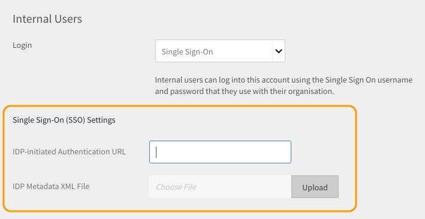

# Aanmelden bij Learning Manager met SSO-verificatie

Aan de hand van dit document kunt u SSO-verificatie configureren om u aan te melden bij uw Learning Manager-account.

Voer de volgende stappen uit om SSO-verificatie te configureren:

1. Open **[!UICONTROL Settings]** (Instellingen) > **[!UICONTROL Login Methods]** (Aanmeldingsmethoden).

   

1. Kies **[!UICONTROL Internal Users]** (Interne gebruikers) of **[!UICONTROL External Users]** (Externe gebruikers), afhankelijk van uw vereisten.
1. Klik op de vervolgkeuzelijst naast  **[!UICONTROL login]** en selecteert u **[!UICONTROL Single Sign-On]**.

   

1. Als u SSO-instellingen (Single Sign-On) wilt aanpassen, klikt u op  **[!UICONTROL Wijzigen.]**

   

1. Enter  **[!UICONTROL Door IDP geïnitieerde verificatie-URL]** opgegeven door uw serviceprovider en upload uw XML-bestand door op **[!UICONTROL IDP-XML-metagegevensbestand.]**

   

   De SSO die u in Learning Manager configureert, moet ondersteunde SAML 2.0 zijn.

   U kunt zich nu aanmelden bij Learning Manager met uw SSO-verificatie.

