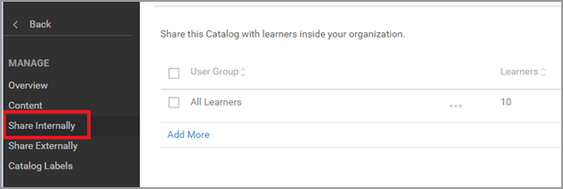
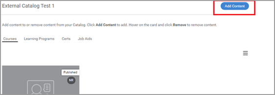

# Kan geen cursus zoeken in Learning Manager

## Probleem

Een student kan geen cursus zoeken in Learning Manager.

## Scenario 1: Inschrijving verloopt via een hoger leerobject

### Samenvatting

Er zijn scenario&#39;s waarbij een student een cursus zoekt en de cursus niet in de lijst staat. Als de student zich echter heeft ingeschreven voor een leerprogramma/certificering, kan de student de cursus in het leerobject bekijken.

### Waarom gebeurt dit?

Wanneer een student zich in Learning Manager via een leerprogramma/certificering heeft ingeschreven, wordt de inschrijving voor die cursus via het leerprogramma/de certificering uitgevoerd.

Daarom kan de student niet zoeken naar de op zichzelf staande cursussen onder **Mijn leerervaring**.

De student kan de cursussen echter niet bekijken in het leerprogramma/de certificering.

## Scenario 2: de student heeft geen toegang tot de catalogus die de cursus bevat.

### Samenvatting

Een student kan geen cursussen zoeken in de catalogus of het studentendashboard.

### Waarom gebeurt dit?

Dit probleem treedt op als:

* De student geen deel uitmaakt van de catalogus die de cursus bevat **OF**
* De cursus geen deel uitmaakt van de catalogus waartoe de student toegang heeft.

### Resolutie

1. Meld u aan als beheerder.

1. Klikken **[!UICONTROL Catalogus]** en blader naar de catalogus die de cursus bevat.
1. Klikken **[!UICONTROL Intern delen]** of **[!UICONTROL Inhoud]** (afhankelijk van het hierboven vermelde scenario).

   

   *De catalogus intern delen*

1. Neem de onderstaande scenario&#39;s door:

   * Student maakt geen deel uit van de catalogus

     Klik op **[!UICONTROL Toevoegen]** en voeg de gebruikersgroep toe waarvan de gebruiker deel uitmaakt. Klik op **[!UICONTROL Opslaan]**.

     

     *De gebruikersgroep toevoegen*

   * Cursus maakt geen deel uit van de catalogus

     Klik in de sectie Inhoud op **[!UICONTROL Inhoud toevoegen]** en selecteer de cursus die u aan de catalogus wilt toevoegen.

     

     *Inhoud aan de cursus toevoegen*
