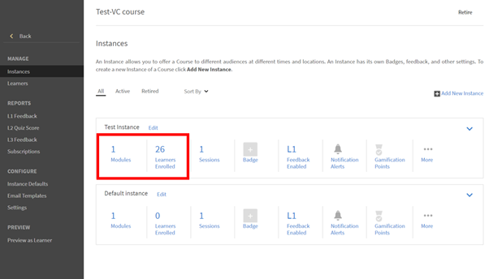

# Kan geen inzendingen weergeven in Adobe Learning Manager

## Probleem

Een docent kan de inzendingen die een student heeft geüpload niet bekijken.

## Beschrijving

Docenten kunnen geen bestanden weergeven die studenten in het **Module voor verzendactiviteiten**.

Een student heeft zich bijvoorbeeld ingeschreven voor een instantie genaamd **Testinstantie** van een cursus, zoals hieronder getoond:

*Instantie weergeven*

De student opent de cursus en uploadt een bestand in de activiteitenmodule.

Wanneer de docent probeert de inzending goed te keuren, kan de docent dit niet doen.

*Een bestand uploaden in de module Activiteit*

## Oorzaak

Als er geen docent is in de cursusinstantie waarvoor de student is ingeschreven, verschijnt het probleem.

## Resolutie

Voer de onderstaande stappen uit om te controleren of een docent aan de cursusinstantie is toegevoegd:

1. Navigeer naar de cursusinstellingen.
1. In het dialoogvenster **Beheren** sectie, klik op **[!UICONTROL Instanties].**
1. Klik in de instantie waar de student is ingeschreven op **[!UICONTROL Sessies]**.

   

   *Sessies selecteren in de instantie*

   Er is geen docent toegewezen aan deze sessie.

1. Klikken **[!UICONTROL Bewerken]**. Voeg de docent toe die de inzending van het bestand goedkeurt.

   

   *Voeg de docent toe*
1. Sla de wijzigingen op.

