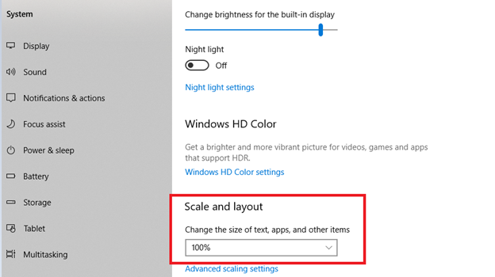

# Kan agenda niet weergeven

## Probleem

U kunt de kalender niet weergeven bij het bewerken van de vervaldatum van een extern profiel.

## Beschrijving

Wanneer een beheerder probeert de vervaldatum van een extern inschrijvingsprofiel te bewerken en op de kalender klikt om de vervaldatum te bewerken, wordt de kalender niet weergegeven.

## Oorzaak

Dit probleem wordt veroorzaakt door het volgende:

* Het zoomniveau van de browser is meer dan 100%.
* De schaal en lay-out in de weergave-instellingen zijn meer dan 100%.

## Resolutie

### Browser

1. Start de browser.
1. Meld u aan bij Adobe Learning Manager.
1. Klik op het zoompictogram op de adresbalk.
1. Klikken **[!UICONTROL Herstellen]**.
1. Wijzig de vervaldatum van het inschrijvingsprofiel.

### Weergave-instellingen

1. Klikken **[!UICONTROL Starten]** > **[!UICONTROL Instellingen]** > **[!UICONTROL Systeem]**.
1. Klikken **[!UICONTROL Weergave]**.
1. Onder de **[!UICONTROL Schalen en lay-out]** de vervolgkeuzelijst gebruiken. Wijzig de instellingen in 100%.

   

   *Weergave-instellingen wijzigen*

1. Start de computer opnieuw op.
