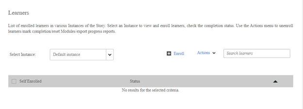

# Kan studenten niet weergeven in een cursus

## Probleem

U kunt studenten die zich voor een cursus hebben ingeschreven niet weergeven.

## Beschrijving

U kunt geen ingeschreven studenten op het tabblad Studenten van een cursus bekijken. Als u echter een rapport genereert, kunt u de ingeschreven studenten in het rapport bekijken.

*Geen student weergegeven*

## Oorzaak

Als een student is ingeschreven voor een hoger leerobject (leerprogramma of certificering), is de student zichtbaar op het tabblad Student van het hogere leerobject. De student kan niet zoeken op het tabblad Studenten van de cursus.

**Hoe kan ik zien aan welk hoger leerobject de student is ingeschreven?**

U kunt deze informatie controleren in het rapport van het leertranscript. Volg de onderstaande stappen om een studenttranscript te genereren:

1. Meld u aan als beheerder.
1. Klikken **[!UICONTROL Rapporten]** > **[!UICONTROL Aangepaste rapporten]** > **[!UICONTROL Excel-rapporten]** > **[!UICONTROL Studenttranscript]**.

1. Voer de naam in van de **[!UICONTROL Student]** en geeft de **[!UICONTROL Datum]** bereik.
1. Vouw de sectie **[!UICONTROL Geavanceerde opties]** uit en selecteer de optie **[!UICONTROL Informatie van moduleniveau inschakelen]**.
1. Klik op **[!UICONTROL Genereren]**.

   In het studenttranscript kunt u bekijken via welk hoger leerobject de student is ingeschreven.
