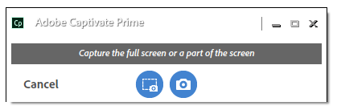
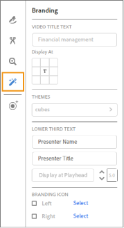

# Adobe Learning Manager-bureaubladtoepassing

Leer hoe u de bureaubladtoepassing van Adobe Learning Manager kunt gebruiken om inhoud te maken en te verrijken die kan worden gedeeld op Sociaal leren.

De bureaubladtoepassing van de Adobe Learning Manager is voornamelijk bedoeld voor studenten die Sociaal leren in Learning Manager gebruiken. Nadat de toepassing op een desktop is geïnstalleerd, kunnen studenten inhoud maken en deze op boards plaatsen in Learning Manager om informele, samenwerkende en sociale lessen onder collega&#39;s te vergemakkelijken. Bovendien zorgt de bureaubladtoepassing ervoor dat studenten meldingen over Sociaal leren op hun desktop ontvangen, zelfs als ze niet noodzakelijk zijn aangemeld bij de webtoepassing van de Learning Manager.

Studenten kunnen rijke inhoud maken, zoals video, audio en schermafbeeldingen, en deze delen met andere studenten. De inhoud kan letterlijk alles zijn: een softwaredemo of doorloop, een presentatie, een podcast of een geannoteerde schermafbeelding van iets dat kan worden gedeeld.

Klik op de webpagina Sociaal leren van Learning Manager op Nieuw bericht plaatsen en selecteer Video opnemen, Audio opnemen, of neem een screenshot of Leerbeheergalerie om de bureaubladtoepassing te starten. Voor meer informatie over Sociaal leren, [hier klikken](feature-summary/social-learning-web-user.md).

Als gebruikers de bureaubladtoepassing niet hebben, kunt u deze downloaden van de bureaubladpagina van de Adobe Learning Manager. Als u niet kunt downloaden, [hier klikken](../kb/troubleshooting-issues-with-adobe-learning-manager-desktop-app.md).

Nadat de gebruiker de toepassing heeft geïnstalleerd, moet hij/zij zich aanmelden met de studentgegevens van de Learning Manager. De startpagina wordt weergegeven zoals de onderstaande schermafbeelding.

>[!NOTE]
>
>Studenten kunnen de bureaubladtoepassing niet gebruiken als Sociaal leren voor hun account is uitgeschakeld.

<!---->
<!--*Home page*-->

## Een video maken {#creatingavideo}

Met de bureaubladtoepassing kan een gebruiker web, scherm en beide opnemen.

<!---->
<!--*Record web, screen, or both*-->

Ga als volgt te werk om een video-opname te maken en deze op het webplatform voor Sociaal leren te plaatsen:

1. Zorg ervoor dat aan de hardware- en softwarevereisten wordt voldaan. Zie [Systeemvereisten](../system-requirements.md) ter informatie.
1. Als u een opname wilt starten vanuit Sociaal leren, selecteert u het pictogram van de video-opname (web, scherm, beide), waarmee de toepassing Learning Manager Desktop wordt geopend. In de bureaubladtoepassing waarin de gebruiker is aangemeld, kan de inhoud worden gemaakt en vervolgens worden gepost.
1. Als u de opname wilt starten vanuit de bureaubladtoepassing, meldt u zich aan bij de toepassing met uw leerbeheerdersreferenties als student.
1. De startpagina wordt weergegeven.
1. Als u een bericht wilt maken, kiest u een van de drie opties op de startpagina. Klik op het pictogram Video opnemen om het opnamevenster te starten.
1. U kunt naar wens webcam, scherm of beide kiezen.

   **Webcam** De webcam legt de verteller vast die een project of toepassing met audio demonstreert of presenteert. Selecteer het webcampictogram in de bovenstaande opties om het venster Live te openen.

   **Raster** Neem handelingen op die zijn uitgevoerd op het monitorscherm. Als u het schermpictogram selecteert, wordt het scherm gemarkeerd met een recorddialoogvenster in het midden van het scherm.

   **Beide** Hiermee worden zowel de gesproken tekst als de schermacties vastgelegd. Door het laatste pictogram te selecteren, wordt het scherm gemarkeerd en krijgt de gebruiker een Live-venster met het scherm.

1. Voorkeuren voor opnamen instellen.

   **Camera selecteren** Klik op het pictogram van de videocamera onder aan het recordvideovenster. Selecteer een camera die de gebruiker wilt gebruiken in de opgegeven opties.

   **Microfoon selecteren** Klik op het microfoonpictogram onder in het video- of audiovenster en selecteer een microfoon die de gebruiker wilt gebruiken in de opgegeven opties.

   >[!NOTE]
   >
   >Als de gebruiker geen audio met scherm of video wil opnemen, selecteert u de optie **Geen** in de vervolgkeuzelijst die wordt weergegeven bij het klikken op het audiopictogram.
   >
   >Wanneer gebruikers hun scherm of zichzelf beginnen op te nemen, verschijnt er een pop-upvenster waarin ze worden gevraagd te bevestigen of ze willen doorgaan met opnemen zonder ondersteuning voor audio. Klik op Ja om door te gaan.

1. Gebruik de opnameknop om de opname te starten. De opname begint na het aftellen (3 seconden).
1. Klik op de pauze- of hervattingsknop om de opname te pauzeren en indien gewenst verder te gaan. Zie voor informatie over het bewerken van de opname [Een opname bewerken](adobe-learning-manager-app-for-desktop.md#Editing) en publiceren, zie [Een opname publiceren](adobe-learning-manager-app-for-desktop.md#Publishing).

## Een audio maken {#creatinganaudio}

<!---->
*Audio opnemen*

Ga als volgt te werk om een audio op te nemen:

1. Klik op het pictogram voor het opnemen van audio in het startvenster van de toepassing Learning Manager.
1. Klik op het pictogram voor het microfoonvolume en pas het volume aan om te controleren of het microfoonvolume is ingeschakeld.
1. Klik op de opnameknop om de opname te starten.
1. Wanneer gebruikers klaar zijn met het opnemen van de audio, klikt u op de pauzeknop om de opname te stoppen.
1. Klik op de afspeelknop om een voorvertoning van de opname weer te geven.
1. Als gebruikers een extra audio naar hetzelfde bestand willen opnemen, klikt u op **[!UICONTROL Hervatten]**. Klik op **[!UICONTROL Volgende]** om het bestand op de gewenste locatie op te slaan. De opname wordt opgeslagen in de Adobe Learning Manager-app voor de desktopgalerie, waar gebruikers hun opnamen en schermafbeeldingen kunnen bekijken.
1. Zie voor informatie over het bewerken van de opname [Een opname bewerken](adobe-learning-manager-app-for-desktop.md#Editing) en publiceren, zie [Een opname publiceren](adobe-learning-manager-app-for-desktop.md#Publishing).

## Een schermafbeelding maken {#creatingascreenshot}

Ga als volgt te werk om een schermafbeelding te maken:

1. Klik op het schermappictogram van de startpagina van de Learning Manager-bureaubladtoepassing.
1. Als u slechts een gedeelte van het scherm wilt vastleggen, klikt u op het pictogram voor een gedeeltelijk scherm van het fragment. Klik op het pictogram Volledig scherm vastleggen om het volledige scherm vast te leggen.

   <!--
   *Capture a screenshot*-->

1. Voeg annotaties toe aan de inhoud om andere studenten te helpen de presentatie of statische inhoud beter te begrijpen en te behouden.
1. De schermafbeelding bewerken: [hier klikken](adobe-learning-manager-app-for-desktop.md#Editing)en een screenshot publiceren [hier klikken](adobe-learning-manager-app-for-desktop.md#Publishing).

## Een video, audio en schermafbeelding bewerken {#editing}

Als een bestand eenmaal is opgeslagen, verschijnt het bewerkingsvenster onmiddellijk op het systeem waar opnamen perfect en professioneel kunnen worden weergegeven met behulp van onderstaande opties:

## Annotaties (video-opnamen en schermafbeeldingen) {#annotationsvideorecordingsandscreenshots}

U kunt annotaties gebruiken voor video-opnamen en schermafbeeldingen om specifieke details te markeren of om tekst te schrijven die de andere gebruikers kunnen lezen.

>[!NOTE]
>
>Voor video kunnen gebruikers alleen notities toevoegen boven op het scherm.

* De verschillende annotaties die kunnen worden geselecteerd, zijn **ovaal**, **lijn**, **pijl**, **markeren**, en **tekst**.

* Kies een kleur voor elke annotatie in het deelvenster Kleuren in het deelvenster met eigenschappen van de annotatie.
* Voor **Tekst** kiest u de volgende eigenschappen: Lettertype, Vet, Cursief, Kop, Uitlijning, Kleur en Achtergrondkleur.

>[!NOTE]
>
>Als u de achtergrondkleur voor tekst wilt weergeven, schakelt u achtergrondkleur in op Ja.

## Bijsnijden (alle typen video- en audio-opnamen) {#trimalltypesofvideoandaudiorecordings}

Gebruik het bijsnijdgereedschap als u delen van een video of audio die u niet nodig hebt, wilt bijsnijden of verwijderen.

Klik op **[!UICONTROL Bijsnijden starten]** of klik op het plusteken op de tijdlijn om het bijsnijden te starten. Klik vervolgens op de pauzeknop op de speler om het bijsnijden te stoppen. Klik op de knop **[!UICONTROL Bevestigen]** om het bijsnijden te voltooien.

Opnamen kunnen worden bijgesneden door de tijd in te voeren in de **[!UICONTROL Begintijd]** en **[!UICONTROL Eindtijd]** invoervelden na inschakelen **[!UICONTROL Timing wijzigen]**.

*Bijsnijden starten*

*Bijsnijden bevestigen*

## Pannen en zoomen (elke video-opname) {#panampzoomanyvideorecording}

De actie Pannen en zoomen kan alleen worden uitgevoerd op **Beide** (webcam en scherm) video-opnamen. Standaard is de volledige webcam of het volledige scherm geselecteerd. Selecteer de hoekgreep en sleep om het gedeelte van het scherm te selecteren dat moet worden weergegeven of dat de focus moet krijgen. Dubbelklik op het venster voor een volledig scherm.

*Pannen en zoomen*

## Branding (alle typen video-opnamen) {#brandingalltypesofvideorecordings}

Als u samen met een consistent thema een unieke naam voor een video wilt maken, selecteert u de brandingtool. Branding beoogt een significante en gedifferentieerde aanwezigheid in het LMS tot stand te brengen die studenten aantrekt en vasthoudt om de volledige video te bekijken.

Ga als volgt te werk om een merk of thema aan een video toe te voegen:

1. Klik op het brandpictogram in het navigatievenster aan de linkerkant van het bewerkingsvenster.
1. Selecteer een **Thema** van de opgegeven opties of gebruikers kunnen hun eigen thema aanpassen door een **start**, **achtergrond,** en **end** video van hun systeem.

   >[!NOTE]
   >
   >Klik op de knop **Meer assets ophalen** knop.

1. Voeg een tekst toe voor de titel van een video en selecteer een locatie op het tabblad **Weergeven op** raster voor weergave.

   >[!NOTE]
   >
   >Titeltekst kan alleen worden toegevoegd als onderdeel van een brandingvideo. U hebt een thema nodig voordat u een titel aan de brandingvideo geeft.

1. Voeg indien nodig een presentatornaam en titel van de presentator toe aan de video. Typ een getal binnen het bereik van de videotijd in het veld Weergeven op afspeelkop om de naam en titel van de presentator weer te geven tijdens het afspelen van de video.
1. Voeg indien nodig een brandpictogram toe aan de linker- of rechterkant van het videoscherm. Als u een brandpictogram wilt selecteren, klikt u op **[!UICONTROL Selecteren]** > **[!UICONTROL Bladeren vanuit systeem]**.
1. Klik op de afspeelknop in het voorvertoningsscherm om een voorvertoning van de video weer te geven.

   

   *Branding*

## Extra clips opnemen (alle typen video- en audio-opnamen) {#recordingadditionalclipsalltypesofvideoandaudiorecordings}

Extra audio- en videoclips kunnen worden opgenomen in een bestaand video- of audiobestand.

Als u een nieuwe opname wilt starten, klikt u op het pictogram voor het opnemen van extra clips. De nieuwe opname wordt ingevoegd op de positie van de afspeelkop in de opname die wordt bewerkt.

## Een video-opname, audio-opname en screenshot publiceren {#publishing}

Als alle wijzigingen en bewerkingen zijn aangebracht, klikt u op **[!UICONTROL Delen]** > typen of zoeken naar een **vaardigheid of board** die het best verband houdt met de post > **Post**.

<!---->
*Publiceren op internet*

## Bladeren door Leermiddelengalerie {#browsingcaptivateprimedesktopgallery}

Alle opnamen en schermafbeeldingen worden opgeslagen in de bureaubladtoepassing van Adobe Learning Manager. Als u door deze bestanden wilt bladeren, klikt u op **[!UICONTROL Galerie]** in het linkernavigatievenster op de startpagina.

>[!NOTE]
>
>U kunt de galerie ook starten vanuit Sociaal leren door op de knop **Galerie met leerprogramma&#39;s** pictogram tijdens het maken van een bericht.

Typ in het galerievenster de naam van het bestand dat u zoekt in het zoekveld.

Als u een nieuwe opname wilt maken vanuit het galerievenster, klikt u op de knop **Nieuwe record** knop.

Als u een bestand uit de galerie wilt bewerken of verwijderen, klikt u op de drie puntjes onder aan het bestand en selecteert u de optie in de pop-uplijst.

## Meldingen {#notifications}

Meldingen in Leermanager worden in het meldingsvenster weergegeven, ongeacht of de student is aangemeld bij de Leermiddelbeheerwebtoepassing. Meldingen omvatten berichten of boards die gebruikers hebben gemaakt, volgen of waaraan ze hebben deelgenomen. Door op de melding te klikken, navigeert de gebruiker naar het Learning Manager Social Learning-web.

Klik op * om meldingen te dempen *[!UICONTROL Menu Profiel*]* > **[!UICONTROL Instellingen] > **[!UICONTROL Meldingen dempen]**.

## Instellingen in Adobe Learning Manager-bureaubladtoepassing {#settingsinadobecaptivateprimedesktopapplication}

In het dialoogvenster **Instellingen** wijzigt u de volgende instellingen:

Mute meldingen, toepassing automatisch starten, toepassing automatisch bijwerken, productverbetering mogelijk maken.

Gebruikers kunnen de locatie van de galerie ook wijzigen door op de knop **Wijzigen** hyperlink.

*Adobe Leermanager-app-instellingen*
