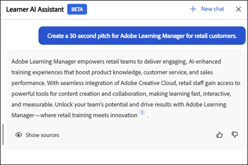
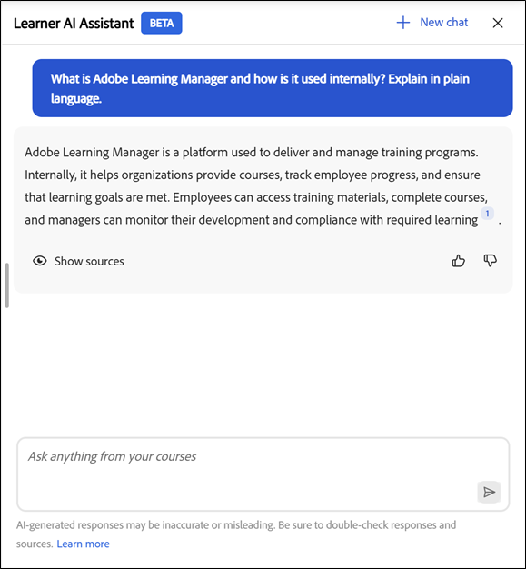
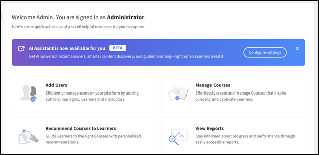
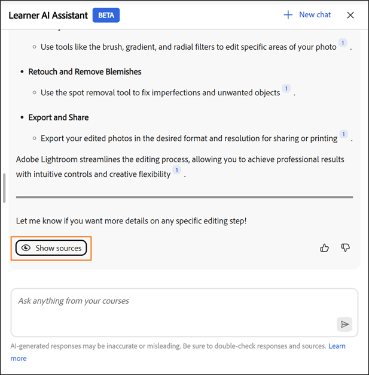

# Inleiding

Met de AI-assistent (bèta) voor studenten kunnen ze snel antwoorden vinden in de toegewezen leerinhoud zonder door volledige cursussen te bladeren. U kunt vragen stellen in gewone taal en u ontvangt nauwkeurige, gerichte antwoorden met bronkoppelingen naar de relevante cursusinhoud.

>[!IMPORTANT]
>
>De AI-assistent van de student bevindt zich momenteel in de bètafase en wordt vrijgegeven via een gefaseerde implementatie. Toegang kan per gebruiker verschillen.

## Wat is de AI-assistent?

AI Assistant is een door GenAI aangedreven chatassistent in Adobe Learning Manager die snelle, nauwkeurige antwoorden biedt op studentvragen met behulp van de vertrouwde leerinhoud die beschikbaar is in Adobe Learning Manager. Het bevat ook citaten, zodat studenten altijd de bron van de informatie kennen.

## Waarom gebruiken?

* Studenten worden geconfronteerd met overbelasting van inhoud en weten vaak niet waar ze moeten beginnen of welke bron ze moeten gebruiken.

* Met catalogus- en toegangsregels wordt het moeilijk te achterhalen welke inhoud voor hen beschikbaar is.

* Leertrajecten zijn gefragmenteerd in verschillende indelingen en trainingstypen, zoals cursussen, virtuele lesruimten, taakhulpen en beoordelingen.

* Er is geen eenvoudige, uniforme manier om specifieke informatie op te halen uit verschillende indelingen zoals SCORM, PDF, documenten, video&#39;s of transcripten.

* Verschillende rollen en sectoren van studenten (bijvoorbeeld verkoop, marketing, ondersteuning, bewerkingen) hebben unieke informatiebehoeften die snelle, contextuele antwoorden vereisen.

## Welke typen inhoud kan de AI-assistent transcriperen

De AI-assistent kan informatie vinden van alle typen leerinhoud die aan u zijn toegewezen, zoals:

* **Documenten:** PDF, Word, PowerPoint, Excel, HTML

* **Media:** Audio (mp3, wav, m4a), Video (mp4, mov, wmv)

* **Interactieve inhoud:** SCORM 1.2, SCORM 2004,

* **het Leren Type van Objecten:** Cursussen, het leren wegen, certificeringen, taakhulpen

Met Adobe kunt u uw leerinhoud veilig transcripten met behulp van vertrouwde externe verwerkingsservices die worden gehost in de persoonlijke VPC-omgeving van de Adobe.

**BELANGRIJK**

De AI-assistent gebruikt alleen inhoud die:

* Beschikbaar in de catalogi die voor de Studentassistent zijn geconfigureerd door beheerders, en

* Deel van interne catalogi in Adobe Learning Manager.

Gedeelde, overgenomen, externe of andere niet-interne catalogi worden niet ondersteund als inhoudsbronnen voor de AI-assistent in de huidige release.

Als u geen toegang hebt tot een cursus, zijn de bijbehorende aanhalingskoppelingen niet voor u toegankelijk. Bibliotheken van derden (zoals LinkedIn Learning of Go1) zijn niet inbegrepen voor het ophalen van antwoorden.

## Conversationele mogelijkheden

De AI-assistent ondersteunt zowel enkelvoudige vragen als meervoudige gesprekken. Het herinnert uw vorige vragen binnen de zelfde zitting.

**gesprek van het Voorbeeld:**

Jij: &quot;Wat is het terugbetalingsbeleid?&quot;
Assistent: Overzicht
Jij: &quot;En terugbetalingen na 30 dagen?&quot;
Assistent: geeft meer specifieke informatie

## Gebruiksscenario&#39;s voor AI-assistent

### Just-In-Time Learning-ondersteuning (alle studenten)

Studenten hebben vaak snelle antwoorden nodig terwijl ze aan het werk zijn, niet wanneer ze weer volledig op de cursus reageren. De AI-assistent maakt het direct ophalen van nauwkeurige gegevens uit toegewezen leerinhoud mogelijk.

**wat het met helpt:**

* Krijg directe antwoorden op specifieke vragen van cursussen, taakhulpen en documenten

* Naar exacte secties waarnaar wordt verwezen springen met citaten

* Verkort de zoektijd voor meerdere leerobjecten

### Verkoopmogelijkheden en klantgesprekken

Verkoopteams hebben snelle, nauwkeurige product- en procesinformatie nodig tijdens live klantinteracties. De AI-assistent fungeert als kennispartner op aanvraag.

**wat het met helpt:**

* De nieuwste productfuncties en positionering ophalen

* Snel verkoopscripts of sprekpunten genereren uit trainingsinhoud

* Productversies of aanbiedingen vergelijken met toegewezen leermateriaal

* Vergroot de verkoopkennis zonder volledige cursussen te volgen

**Voorbeeld 2**

**Doel:** toon dat AI Medewerker verkoopvertegenwoordigers kan helpen onmiddellijk vragen van de klantenvergelijking beantwoorden.

**geadviseerde Herinnering:** vergelijk Adobe Learning Manager en een traditioneel LMS voor ondernemingsopleiding. De vergelijking in tabelvorm tonen.

 in tabelvorm

### Gereedheid voor marketing en campagne

Marketingteams hebben vaak snelle vernieuwingen nodig voordat ze beoordelingen, lanceringen of discussies met belanghebbenden kunnen starten. De AI-assistent geeft een overzicht van complexe leercontent in actiegerichte inzichten.

**wat het met helpt:**

* Lange cursussen of video&#39;s samenvatten in belangrijke paden

* Vernieuw proces- of productkennis voor vergaderingen

* Ontdek gerelateerde leercontent om de expertise te verdiepen

### Verduidelijking van de operationele en procesvoering

Operaties, ondersteuning en interne teams vertrouwen op nauwkeurige procesdocumentatie. Met de AI-assistent krijg je direct duidelijkheid over beleidslijnen en workflows.

**wat het met helpt:**

* Vind antwoorden over interne processen, SOP&#39;s en nalevingsrichtlijnen

* Details op stapniveau verduidelijken zonder door lange documenten te bladeren

* Minder afhankelijk van SME&#39;s voor herhaalde vragen

### Snellere onboarding en rolovergangen

Nieuwe medewerkers en medewerkers die naar nieuwe rollen gaan, hebben vaak moeite om door grote leercatalogi te navigeren. De AI-assistent versnelt het opschuiven door hen te begeleiden naar relevante antwoorden.

**wat het met helpt:**

* Algemene onboardingvragen beantwoorden uit toegewezen inhoud

* Korte uitleg geven van rollenspecifieke concepten

* Ondersteuning voor zelfgericht leren zonder overbelasting van informatie

### Kennisvernieuwing en voortdurend leren

Ervaren studenten hebben snelle vernieuwingen nodig in plaats van volledige omscholing. De AI-assistent ondersteunt voortdurend leren in de workflow.

**wat het met helpt:**

* Vernieuw kennis op verzoek zonder cursussen opnieuw te bekijken

* Leerresultaten verbeteren na voltooiing van de training

* Veelvoorkomende, lakse betrokkenheid bij leercontent aanmoedigen

## Hoe de AI-assistent van de student inhoud gebruikt

De AI-assistent van de student helpt u snel nauwkeurige antwoorden te vinden terwijl u leert. Om het effectief te gebruiken, zou u moeten begrijpen welke inhoud de medewerker gebruikt, wat het niet gebruikt, en hoe het reacties produceert.

### Inhoud van de AI-assistent

De AI-assistent van de student beantwoordt vragen met alleen de leerinhoud die aan u is toegewezen in Adobe Learning Manager.

* De assistent gebruikt inhoud uit interne catalogi die de beheerder voor de AI-assistent van de student heeft ingeschakeld.

* De assistent respecteert uw rol, groepslidmaatschap en catalogusmachtigingen bij het ophalen van informatie.

### Wat voor inhoud wordt niet gebruikt door de AI-assistent

De AI-assistent van de student beperkt de antwoorden tot uw toegewezen leerbereik.

* Er wordt geen gebruik gemaakt van inhoud uit Standaard-, Gedeeld-, Opgehaalde, Externe of andere niet-interne catalogi.

* Er worden geen gegevens opgehaald uit inhoudsbibliotheken van derden, zoals LinkedIn Learning of Go1.

* Het bladert niet op internet of opent externe websites om antwoorden te genereren.

### Hoe de AI-assistent antwoorden genereert

De AI-assistent van de student analyseert uw toegewezen leerinhoud om gerichte en contextuele reacties te genereren.

* Elke reactie bevat verwijzingen naar de oorspronkelijke broninhoud.

* U kunt een citaat selecteren om rechtstreeks naar de desbetreffende cursus, module of document te navigeren.

* Met uitnodigingen kunt u informatie verifiëren en aanvullende context verkennen wanneer dat nodig is.

### De AI-assistent op verantwoordelijke wijze gebruiken

Gebruik de AI-assistent voor studenten als leerhulp om kennis te verkennen, te vernieuwen en te versterken.

* Behandel reacties als richtlijn op basis van beschikbare leerinhoud.

* Raadpleeg het genoemde bronmateriaal voor volledige en gezaghebbende informatie.

### Hoe beheerders toegang beheren

Beheerders beheren de toegang tot de AI-assistent van de student en bepalen welke inhoud wordt gebruikt.

* Beheerders wijzen de assistent toe aan specifieke gebruikersgroepen.

* Beheerders selecteren welke interne catalogi de assistent kan gebruiken als inhoudsbronnen.

* Met deze besturingselementen zorgt u ervoor dat de assistent alleen goedgekeurde en relevante leerinhoud oppervlakken.

## Ingebouwde vragen

De AI-assistent voor studenten bevat een reeks ingebouwde vragen om studenten te helpen snel aan de slag te gaan met veelvoorkomende vragen en scenario&#39;s. Deze aanwijzingen helpen studenten bij het werken met de assistent en tonen de typen vragen die ze kunnen stellen.

Ingebouwde vragen kunnen per account worden aangepast. Organisaties kunnen deze aanwijzingen afstemmen op hun leerdoelen, rollen van studenten, terminologie of specifieke gebruikssituaties.

Beheerders kunnen samen met hun Customer Success Manager (CSM) de ingebouwde vragen voor hun account configureren, wijzigen of bijwerken. Aanpassing op verzoek wordt beheerd op accountniveau en kan niet rechtstreeks worden geconfigureerd in de Adobe Learning Manager-gebruikersinterface in de huidige release.

De aanwijzingen die de studenten krijgen, kunnen per account verschillen op basis van de configuratie die met de Adobe is gedefinieerd.

## AI-assistent van student inschakelen

De AI Assistant (Beta) biedt AI-gestuurde ondersteuning om studenten te helpen content effectiever te ontdekken en te benaderen. Beheerders beheren de toegang door de functie toe te wijzen aan specifieke gebruikersgroepen en catalogi. Bij het configureren van de AI-assistent moeten alleen interne catalogi worden gebruikt. Inhoud uit Gedeelde, Opgehaalde, Externe of andere niet-interne catalogi wordt niet ondersteund voor opzoekacties in AI-assistent-reacties en -citaten.

Beheerders selecteren welke gebruikersgroepen en interne catalogi toegang hebben tot de AI-assistent-functie. Ze moeten ervoor zorgen dat de toegewezen catalogi alleen de leerinhoud bevatten die geschikt is om door AI-reacties en -citaten te worden opgezocht, en dat die catalogi intern, niet gedeeld, verworven of extern zijn.

Voordat u de AI-assistent (bèta) configureert, moet u controleren of u beheerdersreferenties hebt en hebt vastgesteld welke gebruikersgroepen en catalogi toegang moeten hebben tot de functie.

### Toegang tot de studentenassistent configureren

AI-assistent van student inschakelen:

1.Meld u aan bij Adobe Learning Manager als beheerder.

2.Selecteer **Montages** van de homepage.

3.Selecteer {Medewerker AI van 0} Leerling (Bèta) **van het** 3} menu van Montages {.****

4.Selecteer de knevelschakelaar om de **Medewerker AI van de Student (Bèta) toe te laten**.

5.Selecteer één of meerdere gebruikersgroepen van de **In aanmerking komende gebruikersgroepen** optie.

6.Selecteer **sparen** om de montages van de gebruikersgroep toe te passen.

7.Selecteer één of meerdere catalogi van de **In aanmerking komende optie van Catalogi**.

8.Selecteer **sparen** om de catalogusmontages toe te passen.

>[!IMPORTANT]
>
>Alleen interne catalogi worden ondersteund door de AI-assistent. Als u een gedeelde, verworven, externe of andere niet-interne catalogus selecteert, wordt de inhoud ervan niet weergegeven door de AI-assistent, zelfs niet als de catalogus wordt weergegeven in de lijst In aanmerking komende catalogi.

## Toegang tot AI-assistent van student in Adobe Learning Manager

Met de Adobe Learning Manager Learner AI Assistant (Bèta) kunt u snel antwoorden vinden terwijl u leert. Dit intelligente programma reageert rechtstreeks op uw vragen over cursussen, inhoud en platformfuncties, allemaal vanuit uw studentaccount.

De AI-assistent kan alleen inhoud gebruiken uit interne catalogi die uw beheerder heeft ingeschakeld voor de Learner Assistant. Inhoud die alleen in Gedeelde, Opgehaalde of Externe catalogi leeft, is niet inbegrepen.

De Learner AI Assistant (Bèta) is alleen beschikbaar voor geselecteerde studenten.

### De AI-assistent starten

Zo start u de AI-assistent voor studenten:

&#x200B;1. Meld u als student aan bij Adobe Learning Manager.

2.Selecteer **vraag AI Medewerker** op de homepage.

{de vertoningen van de homepage van 0} Leerling vragen AI Medewerker om het Leerling AI Hulppaneel te selecteren en te openen 

3.Wanneer de **Medewerker AI van de Student (Bèta)** het scherm verschijnt, uitgezocht **krijg Begonnen**.

>[!NOTE]
>
>Wanneer u de AI Assistant voor het eerst start, moet u eerst uw toestemming geven voordat u deze kunt gebruiken. Het dialoogvenster voor toestemming wordt alleen weergegeven tijdens deze eerste keer dat u de toepassing start. Voor alle volgende keren starten, wordt u rechtstreeks naar de AI-assistent geleid om uw vragen in te voeren.

&#x200B;4. Typ uw vraag in het tekstveld.

5.Pers **ga** binnen om een reactie te ontvangen. Bekijk uw antwoord, bronnen en aanbevelingen.

Met Adobe is een snelle aanpassing op accountniveau mogelijk. Neem contact op met de Customer Success Manager (CSM) van uw Adobe om ingebouwde vragen te configureren of bij te werken.

AI Assistant-reacties bevatten citaten met elk antwoord, zodat studenten eenvoudig kunnen controleren waar de informatie vandaan komt. Elke geciteerde referentie verwijst terug naar de oorspronkelijke cursusmodule, taakhulp of andere leerinhoud.

Studenten kunnen:

* Selecteer het animatienummer inline om naar de exacte sectie waarnaar wordt verwezen te gaan

* Open de volledige lijst van bronnen door **te selecteren toon Bronnen** bij de bodem van de reactie

De Studentenassistent bevat citaten met elk antwoord om te laten zien waar de informatie vandaan komt. Elke aanhaling is rechtstreeks gekoppeld aan de oorspronkelijke cursus, module of leerobject dat wordt gebruikt om het antwoord te genereren.

U kunt elke gewenste vermelding selecteren om de feitelijke cursuspagina in de Adobe Leermanager te openen en de volledige inhoud in context te bekijken. Met behulp van uitnodigingen kunt u informatie verifiëren, aanvullende details verkennen en blijven leren van de gezaghebbende bron.

## De AI-assistent openen met de zoekfunctie

Beheerders kunnen de AI-assistent ook rechtstreeks vanuit de zoekbalk starten. Typ eenvoudig uw vraag, en selecteer **AI Medewerker** van de opties die hieronder verschijnen om antwoorden van de toegewezen het leren inhoud te krijgen.

## Feedback geven op reacties van de AI-assistent (Bèta) van studenten

Uw feedback over de reacties die worden gegenereerd door de Learner AI Assistant (Beta) verbetert de nauwkeurigheid, relevantie en algehele prestaties.

### Een reactie leuk vinden of niet leuk vinden

* Selecteer **Duims omhoog**, kies wat u behulpzaam in de reactie vond, voeg naar keuze commentaren toe, en selecteer dan **voorleggen**.

 bij te werken

* Selecteer **Duimen neer**, kies de reden de reactie niet nuttig was, voeg om het even welke commentaren toe, en selecteer dan **voorleggen**.

## Nieuwe chat starten in AI Assistant

Studenten kunnen het huidige gesprek wissen en op elk gewenst moment een nieuwe chat starten.

* Selecteer **Nieuw praatje** in het AI Hulpscherm en selecteer dan **Ja**.

