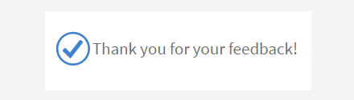
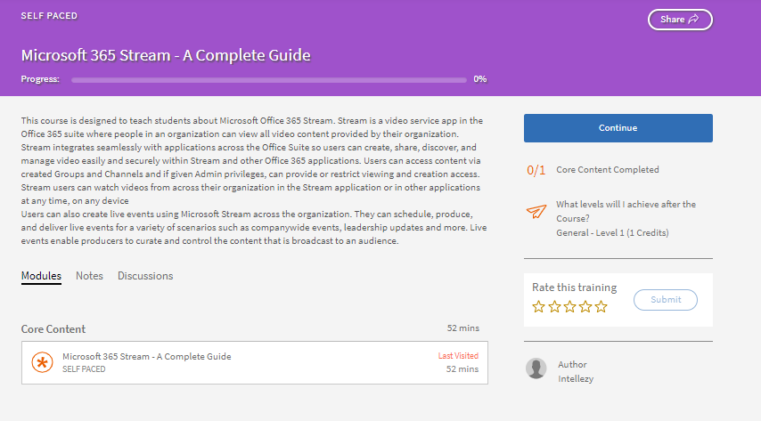

# Mijn leermateriaal

Lees dit artikel om te weten te komen hoe u cursussen weergeeft en volgt in Learning Manager. Neem deel aan discussies en geef feedback.

Auteurs maken cursussen. Studenten kunnen de cursussen volgen en beheerders kunnen de prestaties van de studenten volgen op basis van gevolgde cursussen.

## Overzicht {#overview}

Via Adobe Learning Manager kunnen studenten cursussen, leerprogramma’s en certificeringen openen. Studenten kunnen door alle beschikbare cursussen bladeren met behulp van catalogi of zich inschrijven voor cursussen. Studenten kunnen op het tabblad Leermateriaal alle ingeschreven cursussen en de aan hen toegewezen cursussen bekijken.

>[!NOTE]
>
>Studenten kunnen de iPad-app Learning Manager ook installeren vanuit de app van de appelwinkel en de Android-app van de Learning Manager van Google Play en ze hebben toegang tot cursussen op mobiele apparaten. Alle functies van de studentrol zijn ook beschikbaar in de app. Studenten kunnen ook offline cursussen volgen en ze vervolgens even gemakkelijk online openen. Verwijs naar [ iPad &amp; Android tabletgebruikers ](ipad-android-tablet-users.md) eigenschap voor meer informatie.

## Leerobjecten weergeven {#viewingcourses}

Als student kunt u een lijst van alle beschikbare cursussen bekijken. Klik op Mijn leerervaring op de startpagina of in het linkerdeelvenster om alle cursussen te bekijken waarvoor u zich hebt ingeschreven.

*Mening toegewezen cursussen*

Als u nog niet met de cursus bent begonnen, kunt u naast de cursus op de knop Start klikken. Als u al met de cursus bent begonnen, kunt u op de knop Doorgaan klikken.

Klik op de knop Opnieuw bekijken naast de cursus om een voltooide cursus te bekijken.

Er kunnen meerdere instanties van een cursus zijn. Klik op de cursusnaam om de details te bekijken. In het rechterdeelvenster ziet u de deadline voor elke instantie van de cursus.

*Mening een voltooide cursus*

## Cursuseffectiviteit {#courseeffectiveness}

Aan de hand van de score voor cursuseffectiviteit kunnen studenten de cursussen oppakken met de effectiefste scores voor hun leerbehoeften. De effectiviteit van de cursus wordt geëvalueerd om inzicht te krijgen in het nut van de cursus voor de student. Deze wordt berekend op basis van de feedback die van een aantal gebruikers voor een bepaalde cursus is ontvangen. Als het percentage deelnemers dat feedback geeft hoger is, is de effectiviteitsscore van de cursus hoog.

Het is een combinatie van de resultaten van feedback van de student over de cursusinhoud, de quizresultaten van de cursus voor een student en feedback van de manager die een student evalueert op basis van de verworven kennis.

Een student kan op de pagina Cursussen de effectiviteitsscore van de cursus op de cursusminiaturen zien, zoals weergegeven op de onderstaande afbeelding. U ziet de score voor deze cursus als 14.

*de effectiviteitsscore van de cursus van de Mening*

Klik op de waarde voor cursuseffectiviteit om de details hiervan te bekijken. Er verschijnt een pop-up, zoals hieronder weergegeven.

*de cursusdoeltreffendheid van de Mening*

Klik op het omlaagwijzende pijltje in de rechterbenedenhoek van het pop-upvenster om te zien hoe de effectiviteit van de cursus wordt berekend.

*Berekening van cursuseffectiviteit*

## Zoeken naar cursussen en leerprogramma&#39;s {#searchingcoursesandlearningprograms}

Adobe Learning Manager maakt het u gemakkelijker om snel de gewenste cursussen te vinden. U kunt als volgt naar uw cursussen zoeken:

1. Klik op het zoekpictogram in de rechterbovenhoek. Er verschijnt een zoekveld. Typ de naam van de cursus/het leerprogramma of eventuele trefwoorden die bij uw cursussen horen. U kunt naar cursussen zoeken op metagegevens, notities, vaardigheden, badges of tags. U kunt naar tags zoeken via het veld Zoeken, wat betekent dat de tags in het veld worden weergegeven terwijl u ze typt.
1. De student kan de zoekresultaten op de cataloguspagina verfijnen aan de hand van type, vaardigheden, tags en status.

U kunt de cursussen sorteren op relevantie, naam of publicatiedatum door op Sorteren op te klikken en een keuze te maken in het vervolgkeuzemenu.

Op de pagina van onderzoeksresultaten, kunt u de cursussen volgens de **duur** van de cursussen en het **formaat** van de cursussen filteren. Dit biedt meer flexibiliteit tijdens het zoeken naar cursussen en zorgt ervoor dat u de cursussen vindt die bij u passen.

## Inschrijven voor cursussen {#enrollingforcourses}

Studenten worden op de volgende drie manieren voor een cursus ingeschreven:

1. De beheerder/manager schrijft sommige studenten in voor verplichte cursussen op basis van de behoeften van de organisatie.
1. De manager wijst enkele cursussen aan voor hun teamleden. U krijgt een melding met de optie om de cursus/het leerprogramma te accepteren of te weigeren. Als studenten de aanwijzing accepteren, worden ze voor de cursus/het leerprogramma ingeschreven.
1. Studenten kunnen zichzelf rechtstreeks inschrijven voor een cursus/leerprogramma:

   1. Als de cursus/het leerprogramma van het type zelfinschrijving is, wordt de student onmiddellijk ingeschreven.
   1. Als de cursus/het Leren programma van manager goedgekeurd type is, dan beweegt de student zich in **goedkeuring in afwachting van** staat. Na goedkeuring door de manager wordt de student voor de cursus ingeschreven.
   1. Als studenten zich inschrijven voor een cursus met een wachtlijst (in geval van een klaslokaal), moeten ze wachten tot er iemand uitvalt of tot de beheerder hen goedkeurt voor de cursus.

Afhankelijk van hun keuze kunnen studenten zich voor een scala aan cursussen inschrijven. Op het tabblad Cursussen worden alle ingeschreven/aangewezen cursussen weergegeven.

U kunt echter een van de cursussen onder Catalogus doorlopen door de muis erop te plaatsen en op Verkennen te klikken. De pagina Inschrijven wordt weergegeven. Klik op Inschrijven in de rechterbovenhoek van de pagina, om de cursus in de lijst Cursussen op te nemen.

Een cursus/leerprogramma kan meerdere instanties/sessies hebben. Klik in de catalogus op de tegelnaam van de cursus/het leerprogramma om de details te bekijken. U kunt het aantal inschrijvingen voor de instantie van een cursus/leerprogramma op basis van de deadline voor elke instantie zien.

**Interesse voor cursussen aangeven**

U kunt aangeven dat u geïnteresseerd bent in klassikale cursussen zonder geplande sessies. U krijgt bericht wanneer de cursus begint om deze te volgen.

>[!NOTE]
>
>Studenten moeten een conflictbericht zien als ze zich tegelijkertijd of overlappend in twee verschillende sessies inschrijven.

## Schakelen tussen instanties

Een student die is ingeschreven voor een bepaalde instantie van een cursus kan een lijst met alle beschikbare instanties van de cursus bekijken en schakelen naar een andere instantie die voor de student beter werkt. De reden voor overschakeling is bijvoorbeeld dat de student niet aanwezig was bij de vorige instantie, of de sessietiming voor de nieuwe instantie beter uitkomt. Het kan ook iets anders zijn.

De voortgang van de student als onderdeel van de cursus, quizscores van de leerling etc. worden overgedragen naar de nieuwe instantie. Deze functie is voornamelijk bedoeld voor klaslokaal- en gemengde cursussen, maar we ondersteunen alle typen cursussen, inclusief zelfstudiecursussen.

Bij deze optie wordt Alle instanties weergeven getoond, ongeacht de instellingen voor Schakelen tussen instanties. Studenten zien nu een optie om alle instanties te bekijken als er meer dan één instantie van een cursus is.

Als de optie Schakelen tussen instanties is ingeschakeld, kunnen studenten tussen verschillende instanties schakelen totdat ze de cursus voltooien. Als de optie is uitgeschakeld, kunnen studenten de instanties bekijken, maar kunnen ze zich niet inschrijven voor de cursus.

Wanneer de student **Alle instanties bekijken** selecteert, ziet de student alle cursusinstanties.

_Bekijk al instantiepagina van studentenconsole_

_instantie van de Schakelaar van studentenpagina_

Een beheerder kan van instantie veranderen voor studenten. Selecteer een cursus van de admin console, ga naar de **[!UICONTROL sectie van Studenten]**, kies een gebruiker, en selecteer de **[!UICONTROL knoop van de Actie]**. Dan, selecteer **[!UICONTROL Instantie van de Schakelaar]** en kies de gewenste instantie.

_instantie van de Schakelaar van Admin console_

_de instantieherinnering van de Schakelaar_

U kunt niet van instantie wisselen totdat een instantie van de cursus is voltooid vanuit de Learner- of Admin-app.

Auteurs kunnen tijdens het maken van een cursus schakelen tussen het in- en uitschakelen van de optie Instantieverwisselen. Schakelen van instantie is alleen beschikbaar voor gratis cursussen.

## Workflow als student

Als student kunt u een cursus pas beoordelen na uw inschrijving. U kunt de gemiddelde Classificaties van de Ster voor om het even welke cursus op de **1&rbrace; Pagina van het Huis zien,** Mijn het Leren **pagina en** Catalogus **.**

1. Login als a **Student**. Dit laadt de **Pagina van het Huis**.

1. Zoek een cursus door de cursusnaam in de zoekbalk in te voeren. Afwisselend, kunt u van de getoonde cursuslijst kiezen door **Mijn Leren** of **Catalogus** van de linkerruit te klikken.

1. Na het selecteren van een cursus, klik **[!UICONTROL Inschrijven]**.

   
   *schrijf in een cursus* in

1. Selecteer het aantal sterren om een cursus dienovereenkomstig te beoordelen, waarbij 1 de laagste waardering en 5 de hoogste waardering is. Dan klik **[!UICONTROL voorleggen]**.

   
   *verzend cursusclassificatie*

   Een student kan de feedback opnieuw indienen door meerdere keren een waardering met sterren te geven, aangezien de meest recente waardering in beschouwing wordt genomen.

1. Na het indienen wordt er een bevestigingsbericht weergegeven.

   
   *bericht van de de bevestigingsbevestiging van de Terugkoppeling*

   Als u de feedback opnieuw wilt indienen, kunt u dit doen door op het bericht te klikken. Nadat de waardering is ingediend, wordt het bericht drie seconden lang weergegeven. Vervolgens wordt de waardering weergegeven. Als u de waardering wilt wijzigen, kunt u een andere ster selecteren en indienen.

Cursussen kunnen worden gesorteerd op basis van de gemiddelde waarderingen. U kunt de gevallen van de Soort door drop-down in de hoogste juiste hoek, beschikbaar in **Catalogus** sorteren.

## Een cursus volgen {#consumingnbspacourse}

Nadat u zich voor een cursus hebt ingeschreven, kunt u de cursus volgen door op de cursus op Start te klikken. Alternatief, klik **[!UICONTROL Cursussen]** in **[!UICONTROL Leren]** tabel. Kies een cursus die u interesseert.

Als u nog niet met de cursus bent begonnen, kunt u naast de cursustitel op de knop Start klikken. 

U kunt alle modules voor de cursus in een browservenster bekijken.

**Spelerfuncties**

**TOC** - terwijl het opnemen van een cursus, toont de speler een inhoudstafel voor die bepaalde cursus op de linkerruit van het venster. U kunt op een willekeurig onderwerp klikken om hier direct naartoe te gaan.

**Bladwijzers** - als om het even welke cursusmodules een moduleTOC heeft, dan kunnen de onderwerpen in moduleTOC worden bookmarked om later te verwijzen. Wanneer er een zwart lintje bij een ingang in de inhoudsopgave staat, is er een bladwijzer aan de ingang gekoppeld. Klik nogmaals op dit lintje om een bladwijzer te verwijderen.

**Nota&#39;s** - een bepaling is beschikbaar om nota&#39;s te registreren terwijl u de cursus opneemt. Nadat u de notities hebt opgenomen, kunt u deze opslaan en als PDF-bestand downloaden. U kunt de notities ook e-mailen naar de e-mail-ID&#39;s van geregistreerde studenten. Wanneer u op Opslaan klikt, kunt u kiezen waar u het PDF-bestand wilt opslaan.

*neem cursusnota&#39;s*

**Gesloten titels** - voor Adobe Captivate ontwikkelde cursussen, als de gesloten titels tijdens cursusontwikkeling wordt toegelaten, dan kan de student de titels bekijken. Klik op CC onderaan de speler. De ondertitelingsoptie is alleen beschikbaar voor Captivate 8.0.2 HTML-inhoud. Voor alle andere modules staat de CC-optie niet op de afspeelbalk.

**cursus van het Herzicht** - u kunt een cursus in twee wijzen onder twee mogelijke scenario&#39;s opnieuw bekijken:

* Klik op Opnieuw bekijken wanneer de cursus voltooid is.
* Klik op Doorgaan wanneer de cursus nog niet is voltooid.

**Volledig scherm** klik het Volledige het schermpictogram bij de laag-juiste hoek van de speler om de cursus in het volledige schermvenster te bekijken.

**knopen van de Navigatie** U kunt omhoog/onderaan pijlen klikken om zich over dia&#39;s in pdf, docx en pptx inhoud te bewegen. Met schuifpijlen kunt u in allerlei inhoud naar volgende onderwerpen gaan.

**Cursus sluiten** Klik op het kruisje (x) rechtsboven in de speler om de cursus af te sluiten.

*Na het weggaan van de cursus, kunt u de cursus opnieuw bekijken door op de knoop van de Cursus van de cursusbeschrijving te klikken.*

## Meerdere inschrijvingsinstanties

Als een cursus meerdere instanties heeft, kunnen studenten kiezen voor een specifieke instantie en zich hiervoor inschrijven. Indien nodig kunnen ze ook schakelen tussen instanties.

## Waardering met sterren

Alleen na inschrijving voor een cursus kan een student een sterrenfeedback op de cursus geven. Op de pagina Cursusoverzicht van een cursus kan de student de cursus beoordelen als sterren (1-laagste, 5-hoogste).

*verstrek sterclassificatie als terugkoppel*

Een student kan een bepaalde ster (van de 5) selecteren en de classificatie indienen. De student kan de selectie ook bewerken door op een andere ster te klikken. Na verzending wordt het feedbackbericht Hartelijk dank weergegeven.

Als de student de feedback opnieuw wil indienen, kan hij/zij dit doen door op het bericht te klikken. De **voorlegt** knoop wordt re-toegelaten. Een student kan meerdere malen sterrenwaardering geven na inschrijving voor een cursus. De meest recente waardering wordt altijd in beschouwing genomen.

Zodra de student een classificatie verstrekt, de gemiddelde sterclassificatie en het aantal studenten die de eigenschap van sterclassificaties in de **pagina van het Overzicht van de Cursus** hebben verstrekt.

*Overzicht van de Cursus*

Deze functie is uitgeschakeld voor alle bestaande accounts. Beheerders kunnen deze inschakelen via Instellingen. Alleen dan worden waarderingen met sterren weergegeven voor de studenten.

## Inhoudsmarktplaats

De optie Inhoudsmarktplaats staat in het linkerdeelvenster in de Learner-app. Wanneer u op de optie klikt, ziet u alle cursussen/Volledige catalogus en Gecurreerd afspeellijsten.

Op de onderstaande pagina ziet u de cursussen die in de volledige catalogus aanwezig zijn. Elke cursus toont de duur en het bredere onderwerp waartoe het behoort. U kunt het onderwerp kiezen uit het filter aan de linkerkant van de pagina.

U kunt precies twee minuten een voorbeeld van een cursus zien.

*cursus van de Voorproef in markt*

Wanneer de Beheerder u uitnodigt om een groot aantal cursussen te verkennen en te bekijken, ziet u een melding.

Als student, kunt u interesse voor een volledige catalogus of om het even welke beheerde playlist in de **Beheerde sectie van de Playlist** uitdrukken.

*Beheerde playlist van de Mening*

Nadat u interesse hebt getoond voor een cursus/training, wordt de interesse geregistreerd en kan de beheerder de record ophalen.

In de Learner-app hebben alle beheerders toegang tot de Content Marketplace. Als de beheerder de toegang heeft ingetrokken, kunnen studenten het tabblad Contentmarkt niet zien.

Studenten die zijn uitgenodigd door de beheerder, kunnen de Inhoudsmarktplaats bekijken.

>[!NOTE]
>
>Content Marketplace wordt niet ondersteund in Internet Explorer 11.

Alle filters en andere opties worden in de onderstaande video getoond.

### Voorbeeld van inhoud bekijken

U kunt een voorbeeld van de cursus bekijken en ontdekken en zien welke cursus bij uw leerbehoeften past. Klik de **knoop van de Voorproef** en zie de cursusvoorproef. Het voorbeeld is twee minuten beschikbaar.

*inhoud van de Voorproef in de markt*

## Inhoudshub

Met de Content Hub kunnen beheerders en SME&#39;s (Subject Matter Experts) vereiste afspeellijsten in de Learner-app kort weergeven. Zodra de shortlist is weergegeven, kunnen beheerders het Aankoopaanvraagformulier downloaden en delen met de Adobe Sales Agent.

Een beheerder kan SME&#39;s uitnodigen om de afspeellijst te shortlisten waarin zij geïnteresseerd zijn.

De inhoudshub is beschikbaar in de studentrol voor alle beheerders. Beheerders kunnen SME&#39;s de afspeellijst laten shortlisten waarin zij geïnteresseerd zijn.

De pagina Inhoudshub is altijd zichtbaar voor beheerders in hun studentrol, omdat zij zo eenvoudig afspeellijsten kunnen shortlisten. Om u te helpen bij het shortlisten van de juiste afspeellijst, kunnen beheerders deze pagina toegankelijk maken voor geselecteerde SME&#39;s. Ga naar de pagina Zakelijke Training aan de beheerderskant en volg de stappen om toegang te verlenen.

## Cursusinstantie kiezen {#choosecourseinstance}

Als u als student bent ingeschreven voor een cursusinstantie waarvan de sessie is verlopen, kunt u nu overschakelen naar een andere sessie om vooruitgang te boeken. Dit kan alleen als de LP flexibel is.

Volg deze stappen om van cursus te veranderen:

1. Open Catalogi > Leerprogramma.

   
   *selecteer een het leren programma*

1. Kies met de keuzerondjes of u alle cursussen of cursussen met niet-geselecteerde exemplaren wilt bekijken. Let op: als de student het exemplaar heeft voltooid, kan hij niet overschakelen naar een andere instantie.

   
   *Bekijk alle cursussen of cursussen met niet-geselecteerde instanties*

1. In het vervolgkeuzemenu van de cursus worden de beschikbare instanties weergegeven. Kies de instantie uit de vervolgkeuzelijst.

   
   *selecteer een instantie*

1. Klik op **[!UICONTROL Inschrijving bijwerken]** om de geselecteerde instantie toe te passen. De optie Inschrijving bijwerken staat rechtsboven op de pagina.

   De zojuist geselecteerde instantie wordt ingeschreven. Als een student is ingeschreven voor een cursusinstantie die deel uitmaakt van een andere LO en de cursusinstantie bijwerkt die deel uitmaakt van het flexibele leerprogramma, wordt hij na een waarschuwing automatisch uitgeschreven van de andere leerobjecten.

## Een cursus voltooien {#completingacourse}

Als student kunt u het vereiste aantal modules in een cursus voltooien om de cursus af te ronden. Het voltooiingscriterium voor de cursus is afhankelijk van het aantal modules dat door de auteur verplicht is gesteld. Wanneer u zich inschrijft voor een cursus waarvoor minimale voltooiingscriteria gelden, kunt u de criteria in het rechterdeelvenster van de pagina Cursus bekijken.

*de voltooiingscriteria van de Mening*

Als het voltooiingscriterium voor een bepaalde cursus bijvoorbeeld is dat één van de twee modules moet worden voltooid, is het voltooien van één module voldoende om de cursus af te ronden. In dit geval geeft de voortgangsbalk 100% aan als voltooiingsstatus wanneer u de eerste module heeft voltooid.

Als de auteur modules in een bepaalde volgorde heeft gezet, moet u het vereiste aantal modules op volgorde voltooien, te beginnen bij de eerste. Staan de modules niet op volgorde, dan kunt u het opgegeven aantal modules in een willekeurige volgorde voltooien.

Nadat u een cursus hebt afgerond met het vereiste aantal modules kunt u, als u de optionele modules wilt afronden, teruggaan naar de cursus.

## Weergeven van en deelnemen aan discussies {#viewingandpariticpatingindiscussions}

Als student kunt u via het tabblad Discussies communiceren met andere studenten en uw docenten. U kunt de berichten zien van elke cursus die u bekijkt of waarvoor u zich inschrijft. Als een beheerder discussies voor een cursus heeft ingeschakeld, ziet u voor die cursus het tabblad Discussies naast het tabblad Notities.

Wanneer u op het tabblad Discussies klikt, kunt u de bestaande berichten en opmerkingen voor die cursus zien. Als u zich al voor de cursus hebt ingeschreven, kunt u ook berichten of opmerkingen typen die andere gebruikers kunnen zien. Klik nadat u het bericht hebt getypt op Plaatsen. Uw bericht moet ten minste 10 tekens bevatten.

Het bericht is direct zichtbaar op het tabblad Discussies. U kunt de berichten sorteren op Nieuwste eerst of Oudste eerst en de berichten die u hebt geschreven verwijderen. Zelfs nadat u zich hebt afgemeld van de cursus, kunt u nog steeds alle berichten bekijken en berichten die u hebt geschreven verwijderen.

*de deelnemersbesprekingen van de Mening*

Het tabblad Discussies is niet ingeschakeld voor externe gebruikers.

*het lusje van de Discussie*

## Levenscyclus van cursus {#courselifecycle}

De levenscyclus van een cursus ziet er meestal als volgt uit:

**Ontwerp** - wanneer een auteur het creëren van een cursus voltooit en het bewaart. Een cursus met deze status is nog niet beschikbaar voor studenten.

**Gepubliceerd** - wanneer een auteur voltooit het publiceren van een cursus. Studenten kunnen zich inschrijven voor een cursus met deze status.

**Gearchiveerd** - Na het publiceren van een cursus, kan een auteur het naar een gearchiveerde staat verplaatsen als hij niet de cursus in cursuscatalogus voor studenten wil verschijnen.

**Geschrapt** - een cursus onder geschrapte staat is wanneer het volledig uit de toepassing van Adobe Learning Manager wordt verwijderd. Auteurs kunnen alleen cursussen met de status Concept of Gearchiveerd verwijderen. 

*Overzicht van een cyclus van het cursusleven*
