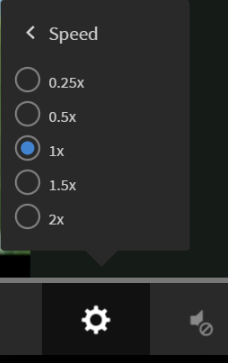

# Fluidic Player

Lees dit artikel voor informatie over het gebruik van de Fluidic Player met cursussen.

Fluidic Player is een platform voor studenten om cursussen te volgen met ononderbroken en blended learning-ervaring. Alle ondersteunde indelingen worden consistent afgespeeld in deze speler. Auteurs en beheerders kunnen een voorbeeld van de inhoud bekijken met behulp van de speler.

## Spelerfuncties {#playerfeatures}

<!---->

**TOC** - terwijl het opnemen van een cursus, toont de speler een inhoudstafel voor die cursus op de linkerruit van het venster. U kunt op een willekeurig onderwerp klikken om hier direct naartoe te gaan.

**Bladwijzers** - als om het even welke cursusmodules een moduleTOC heeft, dan kunnen de onderwerpen in moduleTOC worden bookmarked om later te verwijzen. Wanneer er een stericoon bij een onderdeel in de inhoudsopgave staat, is er een bladwijzer aan de ingang gekoppeld. Klik nogmaals op deze ster om een bladwijzer te verwijderen.

**Nota&#39;s** - een bepaling is beschikbaar om nota&#39;s te registreren terwijl u de cursus opneemt. Nadat u de notities hebt opgenomen, kunt u deze opslaan en als PDF-bestand downloaden. U kunt de notities ook e-mailen naar de e-mail-ID&#39;s van geregistreerde studenten. Wanneer u op Opslaan klikt, kunt u kiezen waar u het PDF-bestand wilt opslaan.

*neem cursusnota&#39;s*

**Gesloten titels** - voor Adobe Captivate ontwikkelde cursussen, als de gesloten titels tijdens cursusontwikkeling wordt toegelaten, dan kan de student de titels bekijken. Klik op CC onderaan de speler.

**cursus van het Herzicht** - u kunt een cursus in twee wijzen onder twee mogelijke scenario&#39;s opnieuw bekijken:

* Klik op Opnieuw bekijken wanneer de cursus voltooid is.
* Klik op Doorgaan wanneer de cursus nog niet is voltooid.

**Volledig scherm** klik het Volledige het schermpictogram bij de laag-juiste hoek van de speler om de cursus in het volledige schermvenster te bekijken.

**Navigatieknoppen** Gebruik de omhoog- of omlaagwijzende pijltjes om door dia&#39;s in pdf, docx en pptx te gaan. Met schuifpijlen kunt u in allerlei inhoud naar volgende onderwerpen gaan.

**Skip vooruit/Achteruit** terwijl het spelen van een cursus, kunt u het  pictogram gebruiken om terug met tien seconden en het  pictogram over te slaan om vooruit door tien seconden over te slaan.

**Afspeelsnelheid wijzigen** Klik op het pictogram  om het dialoogvenster met instellingen te openen. U ziet een pop-up met daarin Snelheid. Klik op Snelheid om de vijf beschikbare snelheidsinstellingen weer te geven: 0,25x, 0,5x, 1x, 1x, 1,5x en 2x. 1x is de standaard, normale afspeelsnelheid.

*selecteer de juiste playbacksnelheid*

**Volume-instellingen wijzigen:** gebruik de volumeregelaar om het volume aan te passen wanneer u een cursus volgt. Sleep de volumeregelaar omhoog of omlaag om de volume-instellingen te wijzigen.

*pas het volume* aan

**Cursus sluiten** Klik op het kruisje (x) rechtsboven in de speler om de cursus af te sluiten.

Na het weggaan van de cursus, kunt u de cursus opnieuw bekijken door **te klikken Revisit** / **ga** knoop op de pagina van de cursusbeschrijving verder.

**auto-spel**: De Fluidic Player van Adobe Learning Manager heeft geen ingebouwde optie om video&#39;s tegen te houden automatisch speel. Of een video automatisch wordt afgespeeld, is afhankelijk van uw browserinstellingen en niet van de speler zelf.

De Fluidic Player kan ook worden ingesloten in een externe website of toepassing met behulp van de Learning Manager-API.

De mobiele Fluidic Player heeft de volgende functies:

* Het aanraken of tikken van het scherm mag de speler niet onderbreken. In plaats daarvan moet de navigatiebalk van de speler worden weergegeven.
* Als er geen interactie is met de navigatiebalk, verdwijnt deze na 3 seconden.
* De navigatiebalk blijft actief totdat de navigatiemenu-items (Inhoudsopgave, Notities, Instellingen) worden gesloten.

