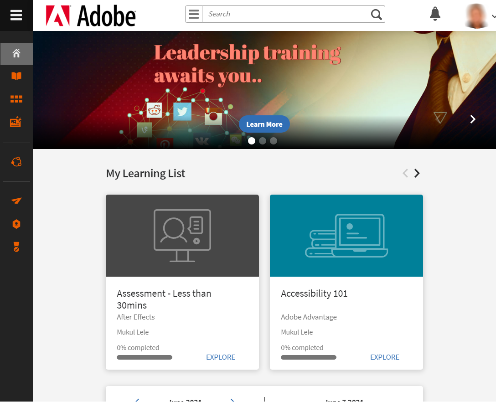

# Aan de slag als student

Aan de slag met de Learner-app in Learning Manager.

Doordat de Learner-app in Learning Manager als widget is ontworpen, kunt u de verschillende functies in één of twee klikken doorlopen.

In de Learning Manager-webtoepassing kunt u, nadat u zich als student hebt aangemeld, de volgende widgets op de startpagina zien:

*Widgets voor leerdoeleinden weergeven*

**Mijn leerervaring**: u kunt de leerobjecten per type en per deadline bekijken en aanklikken. Klik op de cirkel in de widget Mijn leerervaring om direct naar het type leerobject te gaan, of om de leerobjecten per deadline te bekijken.

**Mijn Vaardigheden**: u kunt ook de vaardighedenkaart in de rechterbovenhoek van de pagina bekijken. Verwijzen  [vaardighedenkaart](skills-levels.md) voor meer informatie.

**Widget leerobject**: u vindt deze direct onder Mijn leerervaring, en u vindt er de leerobjecten voor de gebruiker. Onder Mijn leerervaring kunt u alle  [cursussen](courses.md),  [leerprogramma&#39;s](learning-programs.md) en  [certificeringen](certifications.md) die door u zijn ingeschreven of aan u zijn toegewezen. U kunt direct beginnen met het volgen van een leerobject, of een leerobject opnieuw bekijken vanuit deze widget.

**Studentenagenda**: deze widget toont de lijst met komende en geplande leeractiviteiten in uw organisatie, per kwartaal. De inschrijvingsstatus voor is Ingeschreven als u zich hebt ingeschreven voor een specifieke cursus.

**Aanbevolen leermateriaal**: in deze widget kunt u alle cursussen bekijken die voor uw profiel worden aanbevolen door de beheerder/manager van uw bedrijf. U kunt op deze links klikken om naar de cursuspagina&#39;s te navigeren.

**Mijn prestaties**: u krijgt na het afronden van een cursus een badge. De badges worden bovenaan de pagina naast uw profiel weergegeven. Klik op Badges voor specifieke informatie. Raadpleeg voor meer informatie over badges de  [badges](badges.md) gebruiken.

Deze widget geeft ook de gamificationpunten voor de student weer. Klik op de Gamification-link om de gedetailleerde punten en andere functies in Gamification te zien. Raadpleeg voor meer informatie over gamificationpunten en leaderboards de  [Gamification](gamification.md) gebruiken.

Als u Learning Manager opent met behulp van een iPad- of Android-tablet, raadpleeg dan het onderdeel iPad- en Android-apps op deze pagina.

## Tijdlijn van leermateriaal {#learningtimeline}

De tijdlijn van het leerproces toont de planning van de studenten met de cursussen die ze moeten voltooien. In deze sectie ziet u de waarschuwingen voor al uw cursussen, certificeringen en leerprogramma&#39;s in oplopende volgorde van de deadlines. De deadlines worden per leeractiviteit in het linkerdeelvenster weergegeven.

Klik op elk leerobject in de linkertegel om de bijbehorende informatie als cursuskaart in het rechterdeelvenster weer te geven. U kunt op de cursus/leerprogramma/certificeringstegel klikken om de volledige informatie van elk leerobject weer te geven.

Beweeg de muis over de tijdlijn om de schuifbalk aan de rechterkant te bekijken. Gebruik de schuifbalk om omhoog of omlaag te gaan om meer waarschuwingen te bekijken.

## Gebruikers van de iPad- en Android-app {#ipadandandroidappusers}

In de app Learning Manager op een iPad- of Android-tablet ziet u, nadat u zich als student hebt aangemeld, de informatie op het tabblad Start als volgt:

*Tabblad Start in de app*

Tik op de knop **Menu** en kiest u de gewenste optie.

*Items in de vervolgkeuzelijst Menu*

### Offline toegang tot de app

U hebt offline toegang tot de Learning Manager-app op iPad- en Android-tablets. Download en volg cursussen in offline modus en synchroniseer de inhoud met de online app wanneer u verbinding maakt met het netwerk.

1. Tik bovenaan op de vervolgkeuzelijst Menu en tik op de optie Leermateriaal. Een lijst van alle beschikbare cursussen wordt weergegeven in tegels.
1. Tik op het downloadpictogram onderaan elke leerobjecttegel om de leerinhoud te downloaden.

*De cursussen downloaden*

1. Wanneer u online bent, verschijnt er op een balk boven in de app een melding om te controleren of u uw inhoud online wilt synchroniseren. Tik op de roodgekleurde balk als uw antwoord ja is. Een groengekleurde balk geeft aan dat uw inhoud met de online app is gesynchroniseerd.

<!--### Track device storage

You can monitor your device storage periodically.

Tap the profile icon at the upper-right corner of the app and tap **Device Storage** menu option.

An app storage information dialog appears as shown below.

Using the app storage information, you can check the total space of device, app and the downloaded courses. This information enables you to download courses accordingly. To delete the downloaded courses in the device, tap X icon adjacent to each course name.-->
